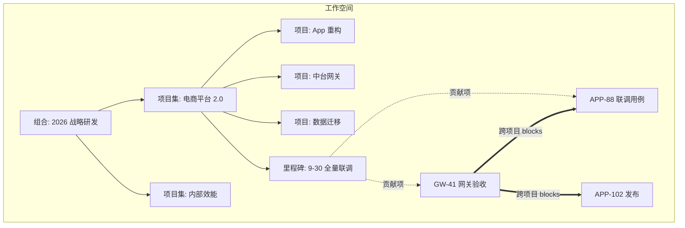
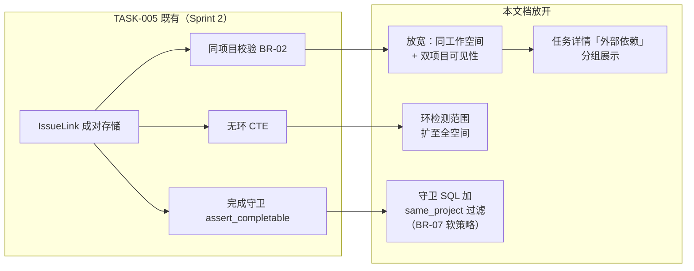
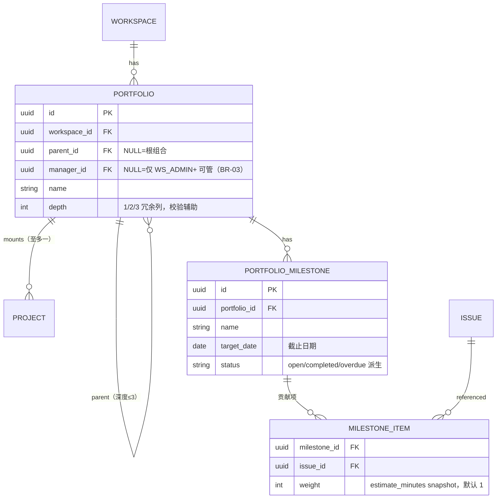

# 项目集 / 项目组合与跨项目依赖

| 元信息项 | 内容 |
| --- | --- |
| 文档编号 | PROJ-004 |
| 所属迭代 | Sprint 9 — 企业项目/报表/Wiki（第 12 周） |
| 模块 | M3-PROJ 项目管理（项目集） |
| 优先级 | P3（企业版核心 · 企业版 V1.0 组成部分） |
| 工作量估算 | 后端 3.0 人日（组合树 1 + 里程碑 0.5 + 跨项目依赖放开 1 + 汇总 0.5）｜前端 3.0 人日（组合面板 1.5 + 依赖连线图 1 + 里程碑视图 0.5）｜测试 1.5 人日 |
| 关联架构文档 | [`unified-issue-model.md`](../architecture/unified-issue-model.md)（§2.11 IssueLink）、[`rbac-permission-model.md`](../architecture/rbac-permission-model.md)、[`api-conventions.md`](../architecture/api-conventions.md) |
| 上游依赖 | `PROJ-003`（项目生命周期 draft/active/archived/closed 四态，dependency-graph §4 记载）；`AUTH-008`（自定义角色与细粒度资源权限——读面行级裁剪依 rbac §6 `accessible_by`，dependency-graph §4 记载）；`TASK-005`（IssueLink 成对存储与无环约束——**BR-02 同项目限制在本迭代放开为「同工作空间可跨项目」**）；`TASK-013`（工时台账——资源汇总数据源；非 dg 文档级依赖，BR-12 资源矩阵的硬数据前提，不要求 dg 回改） |
| 下游消费 | P4 资源统一调度、项目集级工作流；`RPT-004`（健康度可按项目集聚合） |
| 文档状态 | 待评审（Draft） |
| 最后更新日期 | 2026-09-05（R1 修复：响应信封对齐 api-conventions §4、BLOCKER_SQL 按上游 TASK-005 语义重写并逐行对齐别名、深度超限改 409（子码 `DEPTH`，api-conventions §8.8 已注册）、`Portfolio.manager` 数据模型落地 BR-03、blocked_external 方向与字段名修正、DELETE 去请求体、响应示例补齐、BR-10 用例与 P95 门槛、四主体越权用例、UT-01 断言对齐、端点/约束计数修正。R2 修复：新增 BR-14 读面可见性过滤并对齐 rbac §2.2 角色语义（GUEST 403 / MEMBER 可见性裁剪）、里程碑编辑端点补齐、根组合重名 COALESCE 表达式唯一索引、示例数值三方对齐（65%）、QA-001 引用 §2.3、CYCLE 子码改「已注册」、上游依赖补 AUTH-008、挂载叶子口径统一。R3 修复：§4.3 聚合服务落实 BR-14（`descendant_projects` 增加 actor 入参与 rbac `accessible_by` 求交并注明服务层求交原因，progress/resource_matrix/risk_list 经其收窄，milestone_progress 补 actor 可见性收窄、系统上下文缺省全集）、`uniq_portfolio_name_per_parent` 补 workspace 列（跨空间允许同名根组合）、`uniq_milestone_issue` 补软删 condition（端点表「删贡献项」行同步标注软删）、UT-09 错误码对齐 `RESOURCE_CIRCULAR_DEPENDENCY`+`CYCLE`、上游依赖 PROJ-003 补 dg §4 出处括注、TASK-013 加非 dg 性质注、BR-10 补 `PERM_PROJECT_CLOSED`（api-conventions §8.3 已注册，UT-13 双态断言）、BR-02 并入挂载叶子口径（新增 UT-16 + 错误矩阵行）、IT-06 扩五主体补非工作空间成员 404、示例 weeks 对齐风险卡快照日、matrix 补截断标注、§3.3 补 500 边界数依据。R4 复评 PASS（9.5×5）后随手收口：milestone_progress 拆 keyword-only 双模式（读面 actor 必填/for_system 仅 beat 全集，防漏传泄露）、BR-13 补与 RPT-002 完成率双口径关系说明、BR-09 保险丝措辞对齐 TASK-005、BR-02 补已挂项目节点不变式、端点表 {pid}/{id} 记法统一） |

---

## 1. 概述

### 1.1 背景

企业客户的中大型研发组织按「项目集（Program）→ 项目（Project）」两级管理：一个「电商平台 2.0」项目集下挂「App 重构」「中台网关」「数据迁移」三个项目，管理层要看的是**跨项目的整体进度、里程碑对齐与跨项目依赖**（网关未完成会阻塞 App 联调），而非单个项目的看板。

单项目视图（Sprint 0-8 既有）回答「这个团队做得怎么样」；PROJ-004 回答「这一盘棋走得怎么样」。这是企业版与标准版在管理视角上的分水岭之一。

### 1.2 目标

1. **项目集组合树**：`Portfolio` 自引用树（深度 ≤3：组合 → 项目集 → 子项目集），项目仅可挂载到**叶子节点**（§4.2/迭代概览 §9 同口径）；一个项目至多属于一个项目集。
2. **里程碑**：`PortfolioMilestone` 跨项目对齐点（如「9-30 全量联调」），聚合各项目向其贡献的任务完成度，延期预警。
3. **跨项目依赖**：放开 `TASK-005` 的同项目限制至同工作空间；跨项目依赖**仅可视化与统计，不参与单项目流转拦截**（上下文不同，硬拦易误伤——迭代概览 §5 决策）。
4. **汇总面板**：项目集级进度（按 state.group 加权）、资源汇总（消费 `TASK-013` 工时快照）、风险列表（逾期/阻塞/里程碑偏差）。

### 1.3 范围与边界

| 范围 | 本文档交付 | 明确不做（归属） |
| --- | --- | --- |
| 组合树 | Portfolio 树 CRUD、项目挂载/迁移 | 集团-子公司多级（P4 多租户之上） |
| 里程碑 | 跨项目里程碑、完成度聚合、延期预警 | 里程碑基线对比（P4 `TASK-015` 之上） |
| 跨项目依赖 | IssueLink 放开同工作空间、依赖关系图可视化、统计 | **流转硬拦截**（明确不做，见 BR-07）、跨工作空间依赖（P4） |
| 汇总面板 | 进度/资源/风险三卡 | 资源统一调度与容量规划（P4） |

### 1.4 术语表

| 术语 | 定义 |
| --- | --- |
| 项目集（Portfolio） | 一组项目的逻辑归集，树形结构；叶子挂载项目。注：api-conventions §2.5 端点清单将 Module 注为「模块 / 项目集」，与本术语冲突（架构文档待回改：以 docs/README.md §4 索引为准，Portfolio = 项目集、Module = 模块） |
| 里程碑（Milestone） | 项目集级时间点目标，关联多个项目的任务集合作为「贡献项」 |
| 跨项目依赖 | 两端任务分属不同项目的 IssueLink（本迭代放开后合法） |
| 贡献项 | 挂载到里程碑下的任务（任意项目），完成度 = 贡献项加权完成比例 |

### 1.5 前置依赖

| 依赖 | 内容 | 阻塞原因 |
| --- | --- | --- |
| `TASK-005` | IssueLink 成对存储（INVERSE_MAP）、无环 CTE、成对删除 | 跨项目放开复用全部机制，仅放宽 BR-02 校验 |
| `PROJ-003` | 项目生命周期状态机（draft/active/archived/closed 四态） | 归档/关闭项目可挂项目集但只读 |
| `TASK-013` | `WorkLogSummary` 人×周快照 | 资源汇总卡数据源 |
| `TASK-004` | 子树进度上卷（`completed_sub_issues_count`） | 项目级进度聚合范式复用 |

### 1.6 竞品参考

| 竞品 | 参考点 | 处置 |
| --- | --- | --- |
| Jira (Advanced Roadmaps) | Plan 跨项目组合、层级（Epic→Initiative）、依赖可视化与**告警不硬拦** | 「依赖可视化 + 软告警」策略采纳——与本迭代 BR-07 决策一致 |
| Ones | 项目集（Program）+ 里程碑 + 跨项目依赖 | 组合树与里程碑语义对齐 |
| Plane | 无项目集（2026-09，仅有 Project 平铺） | 项目集为企业版差异化能力 |

---

## 2. 业务逻辑

### 2.1 总体结构



> 图注：图示为局部示例——APP-102 的第二个外部阻塞源 `GW-52` 见 §4.6 ② `risks`；同项目 blocks 边不在项目集依赖图中重复展开（§3.3）。

### 2.2 业务规则（BR）

| 编号 | 规则 | 强制层 | 违约响应 |
| --- | --- | --- | --- |
| BR-01 | `Portfolio` 树深度 ≤3（组合 L1 → 项目集 L2 → 子项目集 L3）；禁止成环（parent 链检查同 TASK-004 `_is_descendant` CTE） | Service + CTE | `409 RESOURCE_LIMIT_EXCEEDED`（超深，details 子码 `DEPTH`——api-conventions §8.8 已注册条目，与 TASK-004 层级深度越限同码）/ `409 RESOURCE_CIRCULAR_DEPENDENCY`（成环） |
| BR-02 | 一个项目至多挂一个项目集节点；项目仅可挂载**叶子节点**（§1.2/§4.2 docstring 同口径，UT-16）；迁移挂载需原目标双权限；已挂项目的节点不再新增子节点（保持「项目挂叶子」不变式，违反时 BR-11 删除守卫兜底迁移） | DB 唯一约束（project_id 部分唯一）+ Service 叶子校验（目标节点子节点存在性） | `409 RESOURCE_ALREADY_EXISTS`；非叶子挂载 400 `VALIDATION_INVALID_PARAM`（api-conventions §8.4 已注册） |
| BR-03 | 项目集/里程碑**管理**需 WS_ADMIN+ **或**项目集 `manager`（数据支撑：`Portfolio.manager` 外键，§4.2；节点祖先链上的 manager 同样放行——深度 ≤3 至多回溯 2 跳）；**读面**（组合树/summary/里程碑/依赖图）对 WS_MEMBER+ 开放，WS_GUEST 无工作空间级浏览权返回 403（rbac §2.2），可见性裁剪见 BR-14 | Permission（对象级旁路，同 rbac §5.3 `has_object_permission` 模式） | `403 PERM_ROLE_INSUFFICIENT` |
| BR-04 | 里程碑 `target_date` 必填；贡献项任务须属于项目集下任一项目（直接/间接子节点） | Serializer | `400 VALIDATION_ERROR` + `DOES_NOT_EXIST` |
| BR-05 | 里程碑完成度 = 贡献项中 `state.group ∈ {completed}` 的加权比例（权重 = 任务 `estimate_minutes`，无预估按 1 计） | 聚合服务 | — |
| BR-06 | 里程碑延期预警：`target_date` 前 7 天完成度 <100% → 每日一条预警至项目集 `manager` 收件箱（`manager` 为空回退通知 WS_ADMIN+，幂等键含日期）；逾期后转「已延期」红标 | Celery beat + SETNX | — |
| BR-07 | **跨项目依赖不参与流转拦截**：`TASK-005` 完成守卫仅统计**同项目** blocks 边；跨项目边在任务详情/依赖图展示「外部依赖」标记并计入风险统计 | 引擎守卫 SQL 加项目过滤 | — |
| BR-08 | 跨项目关联放开范围 = 同工作空间；两端项目均须对操作者可见；跨项目边创建需**源项目** `issue.update` | Permission + Service | `404 RESOURCE_NOT_FOUND`（存在性隐藏）/ `403 PERM_DENIED` |
| BR-09 | 跨项目边的无环检测范围扩展到同工作空间全图（CTE 沿 blocks 边，`CTE_GUARD_DEPTH=100` 保险丝语义承袭上游不变——TASK-005 BR-05：仅作脏数据告警线，非业务深度限制） | Service | `409 RESOURCE_CIRCULAR_DEPENDENCY` |
| BR-10 | 归档（archived）与关闭（closed）项目在组合树中保留只读（写保护复用 PROJ-003 状态守卫，组合树不绕过）；项目归档不影响项目集统计（历史数据照常聚合） | Service | 写归档项目内资源 `403 PERM_PROJECT_ARCHIVED`；写关闭项目内资源 `403 PERM_PROJECT_CLOSED`（api-conventions §8.3 已注册，Sprint 5 `PROJ-003`） |
| BR-11 | 删除非空项目集（下挂项目或子节点）须先迁移内容 | Service | `409 RESOURCE_IN_USE` + `details` 计数 |
| BR-12 | 资源汇总卡数据源 = `TASK-013` `WorkLogSummary`（按项目集下项目集合过滤，人×周聚合为「人×项目」矩阵）；不另建聚合表 | 聚合服务 | — |
| BR-13 | 项目集级进度 = 下挂项目进度加权平均（权重 = 项目未取消任务数）；项目进度 = 任务 state.group 完成比例（承 TASK-004 上卷语义）。**与 RPT-002 完成率的口径关系**：本表以根任务（`parent__isnull=True`）为基座避免子任务重复计数，RPT-002 以全部未归档任务为基座——子任务分布不均时两处数值可不同，属显式双口径而非缺陷（§6 防争议条款） | 聚合服务 | — |
| BR-14 | **读面可见性过滤**：summary/资源矩阵/风险列表/依赖图仅聚合操作者 `accessible_by`（rbac §6 行级 Manager）可见的项目，BR-13 加权在可见集合上计算（WS_ADMIN+ 可见全部）；组合树节点结构全量返回，节点 `project_count` 仅计可见项目。与 BR-08「双项目可见」同一哲学（服务层落点见 §4.3 `descendant_projects(actor)`，IT-06） | QuerySet 行级过滤（`accessible_by`）＋ 服务层显式求交（§4.3） | — |

### 2.3 跨项目依赖放开方案（对 TASK-005 的增量）



| 兼容点 | 说明 |
| --- | --- |
| API 契约不变 | `relations/` 端点与响应结构零变化；跨项目边在 `related_issue` 内联对象中追加 `target_project` 摘要（TASK-005 冻结条款「加字段可以，改语义不可以」明确允许） |
| 既有数据零迁移 | 同项目边天然满足新校验 |
| GANTT-001 冻结契约 | relations/ 载荷结构不变，甘特连线渲染跨项目边时加虚线样式（GANTT-003 关键路径仅计算同项目子图） |

---

## 3. UI/UX 设计

### 3.1 项目集汇总面板

```
┌──────────────────────────────────────────────────────────────────────────┐
│ ◈ 电商平台 2.0 · 项目集                     [里程碑] [依赖图] [成员] [设置] │
├──────────────────────────────────────────────────────────────────────────┤
│ ┌─ 整体进度 ──────────┐ ┌─ 资源（近 4 周）─┐ ┌─ 风险 (3) ──────────────┐ │
│ │ ▓▓▓▓▓▓▓▓▓░░░░░ 65% │ │ 李骁   App  30h   │ │ ⚠ GW-41 逾期 3 天        │ │
│ │ App 重构    ███ 71% │ │        网关 12h   │ │ ⚠ 里程碑「全量联调」      │ │
│ │ 中台网关    ██░ 48% │ │ 王思远 网关 26h   │ │   完成度 55%，剩 7 天    │ │
│ │ 数据迁移    ███ 80% │ │ 陈默   迁移 22h   │ │ ⚠ APP-102 被 2 个外部    │ │
│ │ (权重: 未取消任务数) │ │ (人×项目矩阵)     │ │   依赖阻塞               │ │
│ └────────────────────┘ └──────────────────┘ └─────────────────────────┘ │
├──────────────────────────────────────────────────────────────────────────┤
│ 项目列表                                                [+ 挂载项目]      │
│ 项目         状态    进度   任务    逾期   负责人      最近动态            │
│ ──────────────────────────────────────────────────────────────────────  │
│ App 重构     ●活跃   71%   128     3     张妍       2 分钟前 · 迭代规划    │
│ 中台网关     ●活跃   48%    86     7     李骁       1 小时前 · 网关验收    │
│ 数据迁移     ●活跃   80%    45     0     陈默       昨天 · 双写验证        │
└──────────────────────────────────────────────────────────────────────────┘
```

> 注：面板数值按操作者可见项目聚合（BR-14）；示例为 WS_ADMIN 视角全集——overall 65% = (71%×128 + 48%×86 + 80%×45) / 259（权重 = 未取消任务数，BR-13）。

### 3.2 里程碑视图

```
┌────────────────────────────────────────────────────────────────────────┐
│ 里程碑 · 电商平台 2.0                              [+ 新建里程碑]        │
├────────────────────────────────────────────────────────────────────────┤
│ ● 9-30 全量联调     ▓▓▓▓▓░░░░░ 55%   剩 7 天   贡献项 11（完成 6）       │
│   ├─ APP-88  联调用例通过      App 重构    ●进行中    负责人 王思远      │
│   ├─ GW-41   网关验收          中台网关    ⚠逾期 3天  负责人 李骁        │
│   └─ DM-17   双写校验报告      数据迁移    ✓已完成    负责人 陈默        │
│ ○ 11-15 灰度上线    ░░░░░░░░░░  0%   剩 53 天  贡献项 8（完成 0）        │
│ ✓ 8-31 接口冻结     ▓▓▓▓▓▓▓▓▓▓ 100%   已完成    贡献项 9（完成 9）       │
└────────────────────────────────────────────────────────────────────────┘
```

### 3.3 依赖关系图

项目集级依赖图（仅跨项目边 + 关键同项目边）：节点 = 任务卡片（编号+标题+项目色标），边 = 依赖箭头（跨项目边虚线 + 「外部」徽标）；支持按项目集下项目过滤、点击节点跳转任务。100 节点内 SVG 渲染，超出提示先过滤。规模有界依据（§5.2 门禁「≤100 节点 / 500 边」的出处）：单任务直接关联数受 TASK-005 BR-08 上限 50 约束（正反合并计数），100 节点的典型项目集子图边数为 500 量级，前端按此阈值提示过滤。

### 3.4 任务详情的外部依赖展示

任务详情「关联」区分组：`本项目关联`（V1.0 样式不变）+ `外部依赖`（新增分组，卡片含项目徽标 + 项目名；仅当存在跨项目边时渲染该分组）。完成守卫 toast 说明：「外部依赖不阻止完成，请自行确认」（BR-07 的用户可见表达，首次出现跨项目边时展示一次）。

---

## 4. 技术架构

### 4.1 实体关系



### 4.2 模型定义

```python
class Portfolio(BaseModel):
    """项目集组合树 —— 深度 ≤3（BR-01），项目挂载叶子（BR-02）"""

    MAX_DEPTH = 3

    workspace = models.ForeignKey(
        Workspace, on_delete=models.CASCADE, related_name="portfolios", verbose_name="所属工作空间"
    )
    parent = models.ForeignKey(
        "self", on_delete=models.CASCADE, null=True, blank=True,
        related_name="children", verbose_name="父节点", help_text="NULL = 根组合"
    )
    name = models.CharField(max_length=128, verbose_name="名称")
    description = models.TextField(blank=True, verbose_name="说明")
    manager = models.ForeignKey(
        "db.User", on_delete=models.SET_NULL, null=True, blank=True,
        related_name="managed_portfolios", verbose_name="项目集负责人",
        help_text="BR-03 数据支撑：manager（含祖先节点 manager）与 WS_ADMIN+ 共同持有管理权；NULL 时仅 WS_ADMIN+"
    )
    depth = models.PositiveSmallIntegerField(default=1, verbose_name="层级（冗余）")
    sort_order = models.FloatField(default=65535.0, verbose_name="排序值")

    class Meta(BaseModel.Meta):
        db_table = "portfolios"
        constraints = [
            # parent 为 NULL 时普通 (parent, name) 唯一约束不判重（PG NULL ≠ NULL），
            # 用 COALESCE 表达式把根组合的 parent 归一到零值 UUID；叠加 workspace 列——
            # 根组合归一值若全表共享，跨工作空间将不能有同名根组合，故同空间内判重（保证
            # 同空间根组合不同名，跨空间允许同名）；非根节点已由 parent 隐含 workspace，不受影响
            models.UniqueConstraint(
                "workspace",
                models.functions.Coalesce("parent", models.Value(uuid.UUID("00000000-0000-0000-0000-000000000000"))),
                "name",
                condition=models.Q(deleted_at__isnull=True),
                name="uniq_portfolio_name_per_parent"),
            models.CheckConstraint(check=models.Q(depth__gte=1, depth__lte=3),
                                   name="chk_portfolio_depth"),
        ]
        indexes = [models.Index(fields=["workspace", "parent"], name="idx_portfolio_ws_parent")]


class PortfolioProject(BaseModel):
    """项目挂载关系 —— 一个项目至多一个项目集（BR-02）"""

    portfolio = models.ForeignKey(
        Portfolio, on_delete=models.CASCADE, related_name="mounted_projects", verbose_name="项目集"
    )
    project = models.ForeignKey(
        Project, on_delete=models.CASCADE, related_name="portfolio_mount", verbose_name="项目"
    )

    class Meta(BaseModel.Meta):
        db_table = "portfolio_projects"
        constraints = [
            models.UniqueConstraint(fields=["project"], condition=models.Q(deleted_at__isnull=True),
                                    name="uniq_project_single_portfolio"),
        ]


class PortfolioMilestone(BaseModel):
    portfolio = models.ForeignKey(
        Portfolio, on_delete=models.CASCADE, related_name="milestones", verbose_name="所属项目集"
    )
    name = models.CharField(max_length=128, verbose_name="里程碑名称")
    description = models.TextField(blank=True, verbose_name="说明")
    target_date = models.DateField(db_index=True, verbose_name="截止日期")       # BR-04（截止字段统一 target_date，api-conventions §4.5）
    completed_at = models.DateTimeField(null=True, blank=True, verbose_name="完成时间")

    class Meta(BaseModel.Meta):
        db_table = "portfolio_milestones"
        indexes = [models.Index(fields=["portfolio", "target_date"], name="idx_pm_portfolio_target")]


class MilestoneItem(BaseModel):
    """里程碑贡献项 —— 权重快照避免 estimate 后续变更篡改历史完成度（BR-05）"""

    milestone = models.ForeignKey(
        PortfolioMilestone, on_delete=models.CASCADE, related_name="items", verbose_name="里程碑"
    )
    issue = models.ForeignKey(
        Issue, on_delete=models.CASCADE, related_name="milestone_items", verbose_name="贡献任务"
    )
    weight = models.PositiveIntegerField(default=1, verbose_name="权重快照")

    class Meta(BaseModel.Meta):
        db_table = "milestone_items"
        constraints = [models.UniqueConstraint(fields=["milestone", "issue"],
                                               condition=models.Q(deleted_at__isnull=True),
                                               name="uniq_milestone_issue")]
```

### 4.3 聚合服务

```python
class PortfolioService:
    # BR-14 强制层落点说明：rbac §6.3 的行级 Manager（BaseViewSet 强制注入）以 get_queryset() 为入口，
    # 只天然覆盖 Portfolio 主行；summary/资源矩阵/风险列表/依赖图跨 Project/Issue/WorkLogSummary
    # 多表聚合，QuerySet 注入覆盖不到——行级收口在服务层显式完成：统一经
    # descendant_projects(actor, …) 与 Project.objects.accessible_by(actor) 求交，
    # 读面聚合不出现全集口径（IT-06 / BR-14）

    def descendant_projects(self, actor, portfolio_id) -> list[UUID]:
        """项目集下 actor 可见项目（CTE 展开子节点 + 挂载表，再与 rbac §6 accessible_by 求交）
        ——面板/里程碑读面共用入口（唯一定义，BR-14）"""
        return Project.objects.accessible_by(actor).filter(
            portfolio_mount__portfolio_id__in=self._subtree_ids(portfolio_id),
            deleted_at__isnull=True).values_list("id", flat=True)

    def progress(self, actor, portfolio_id) -> PortfolioProgress:
        """BR-13：项目进度 = completed/(total - cancelled)；项目集 = 按未取消任务数加权
        （项目集经 descendant_projects(actor, …) 收窄至可见项目，BR-14）"""
        rows = (
            Issue.objects.filter(project_id__in=self.descendant_projects(actor, portfolio_id),
                                 deleted_at__isnull=True, parent__isnull=True)
            .values("project_id")
            .annotate(total=Count("id", filter=~Q(state__group="cancelled")),
                      done=Count("id", filter=Q(state__group="completed")))
        )
        total = sum(r["total"] for r in rows) or 1
        return PortfolioProgress(
            overall=sum(r["done"] for r in rows) / total,
            by_project=[{"project_id": r["project_id"],
                         "ratio": r["done"] / (r["total"] or 1)} for r in rows])

    def milestone_progress(self, milestone_id, *, for_system=False, actor=None) -> float:
        """BR-05：Σ(已完成贡献项 weight) / Σ(weight)。
        读面调用（§4.6 里程碑列表「含完成度」）必须显式传 actor：按 BR-14 收窄，
        完成度仅计 actor 可见项目的贡献项——漏传会把跨项目贡献项完成度泄露给不可见读者
        （keyword-only + for_system 门，防止读面静默落入全集缺省，R4 复评 MINOR）；
        for_system=True（仅限 §4.5 BR-06 预警 beat）：全集口径——通知 manager 的完成度
        不应随单个读者视角波动，此时忽略 actor"""
        qs = MilestoneItem.objects.filter(milestone_id=milestone_id)
        if actor is not None:
            portfolio_id = PortfolioMilestone.objects.get(pk=milestone_id).portfolio_id
            qs = qs.filter(issue__project_id__in=self.descendant_projects(actor, portfolio_id))
        agg = qs.aggregate(
            total=Coalesce(Sum("weight"), 0),
            done=Coalesce(Sum("weight", filter=Q(issue__state__group="completed")), 0))
        return agg["done"] / agg["total"] if agg["total"] else 0.0

    def resource_matrix(self, actor, portfolio_id, from_week, to_week):
        """BR-12：消费 TASK-013 快照，人×项目矩阵——不扫明细表
        （项目集经 descendant_projects(actor, …) 收窄，BR-14）"""
        return (
            WorkLogSummary.objects.filter(
                project_id__in=self.descendant_projects(actor, portfolio_id),
                week_start__range=(from_week, to_week))
            .values("actor_id", "project_id")
            .annotate(minutes=Sum("total_minutes"))
        )

    def risk_list(self, actor, portfolio_id) -> list[Risk]:
        """风险三源：逾期任务、被外部依赖阻塞任务、里程碑偏差（BR-06 判定同源）。
        「外部依赖」= 阻塞源任务属另一项目（同项目集内跨项目也算，与 BR-07「跨项目边」同义）；
        项目集经 descendant_projects(actor, …) 收窄（BR-14）"""
        projects = self.descendant_projects(actor, portfolio_id)
        overdue = Issue.objects.filter(project_id__in=projects, target_date__lt=timezone.localdate(),
                                       deleted_at__isnull=True).exclude(
            state__group__in=["completed", "cancelled"])
        # 被外部项目任务阻塞（BR-07 统计源）——TASK-005 成对存储的镜像行语义：
        # relation_type='is_blocked_by' 行中 issue=被阻塞任务、related_issue=阻塞源（字段名为 relation_type）
        blocked_external = (IssueLink.objects
            .filter(relation_type="is_blocked_by", issue__project_id__in=projects,
                    issue__deleted_at__isnull=True)
            .exclude(related_issue__project_id=F("issue__project_id"))              # 阻塞源在另一项目 = 跨项目边
            .exclude(related_issue__state__group__in=["completed", "cancelled"])    # 已完成/取消的源不再是风险（TASK-005 BR-07 同源）
            .exclude(issue__state__group__in=["completed", "cancelled"]))
        ...
```

### 4.4 跨项目依赖放开（对 TASK-005 Service 的增量 diff）

```python
# TASK-005 create_relation（§4.3.1 唯一写入口）的 BR-02 校验 diff（放开为 BR-08）：
-    if issue.project_id != related.project_id:                          # 原 BR-02：两端必须同项目
-        raise ValidationError({"related_issue_id": "关联双方必须属于同一项目"})
+    if issue.workspace_id != related.workspace_id:                      # BR-08：放开为同工作空间
+        raise ValidationError({"related_issue_id": "仅支持同工作空间内建立关联"})
+        # → 400 VALIDATION_ERROR + details=[{field: "related_issue_id",
+        #    code: "DOES_NOT_EXIST", message: "仅支持同工作空间内建立关联"}]（api-conventions §4.2）
+    # 双项目可见性（存在性隐藏，api-conventions §4.3「404 vs 403」一致性策略；
+    # actor 由服务层按 actor_id 装配，rbac 行级 Manager 收口）
+    if not Project.objects.accessible_by(actor).filter(id=related.project_id).exists():
+        raise NotFound()                                                # → 404 RESOURCE_NOT_FOUND

# TASK-005 assert_completable 的 BLOCKER_SQL diff（BR-07 软策略）——在上游 SQL 基础上仅加一行项目过滤：
  SELECT i.id, i.sequence_id, i.name, s."group"
    FROM issue_links l
    JOIN issues i ON i.id = l.related_issue_id     -- related_issue_id = 阻塞我的任务（镜像行语义）
    LEFT JOIN states s ON s.id = i.state_id
   WHERE l.issue_id = %(me)s
     AND l.relation_type = 'is_blocked_by'         -- 我持有的镜像行（字段名为 relation_type，非 link_type）
     AND l.deleted_at IS NULL
     AND i.deleted_at IS NULL
+    AND i.project_id = %(project_id)s             -- BR-07：仅同项目边参与硬拦截；跨项目边仅展示与统计
     AND COALESCE(s."group", 'unstarted') NOT IN ('completed', 'cancelled')
-- 调用侧传参：{"me": issue.id, "project_id": issue.project_id}（除 + 号行外与 TASK-005 §4.3.3 BLOCKER_SQL 逐行一致）

# 无环检测 _reaches 不加项目过滤（BR-09：环就是环，跨项目同样禁止）
```

> **对上游 SQL 的三点核对（修正 R1 稿偏差）**：① 上游 `BLOCKER_SQL` 本就是**非递归**单层点查——完成守卫只看直接前置（走 `idx_link_issue_type` 索引，<1ms），递归 CTE 只用于无环检测 `_reaches`（§4.3.2），R1 稿的 `WITH RECURSIVE` 无递归成员、属误加；② 上游字段名为 `relation_type`（`IssueLink` 模型定义），R1 稿误写 `link_type`；③ 上游以 `issue_id = 我 AND relation_type='is_blocked_by'` 取「阻塞我的边」，R1 稿 `link_type='blocks'` + `issue_id=我` 取到的是「我阻塞他」的**反向**边，与行内项目过滤叠加后拦截近乎空转——本稿按上游语义重写，语义真实可运行。

### 4.5 里程碑预警任务

```python
@shared_task(queue="reports")
def milestone_due_alerts():
    """Celery beat 每日 09:00：BR-06 前 7 天每日一条（幂等键含日期），逾期转红标"""
    today = timezone.localdate()
    # 扫描窗 30 天仅约束预警发送（超窗里程碑不再发新预警，避免陈年里程碑噪音）；
    # 「已延期」红标为读时派生口径（BR-06），不受扫描窗影响
    for ms in PortfolioMilestone.objects.filter(
            completed_at__isnull=True, target_date__gte=today - timedelta(days=30),
            deleted_at__isnull=True).select_related("portfolio"):
        # for_system=True：BR-06 系统任务走全集口径（§4.3 milestone_progress 唯一合法全集入口）
        progress = PortfolioService().milestone_progress(ms.id, for_system=True)
        if progress >= 1.0:
            continue
        days_left = (ms.target_date - today).days
        if days_left <= 7:
            key = f"ms:alert:{ms.id}:{today}"
            if cache.set(key, "1", timeout=86400, nx=True):
                notify_milestone_risk.delay(str(ms.id), days_left, progress)  # manager 收件箱（manager 为空回退 WS_ADMIN+，BR-06）
```

### 4.6 API 端点

| 方法 | 路径 | 说明 | 权限 |
| --- | --- | --- | --- |
| GET/POST | `/api/v1/workspaces/{slug}/portfolios/` | 组合树列表（嵌套）/ 新建节点 | 读：WS_MEMBER+（WS_GUEST 403，BR-03/BR-14）；写：WS_ADMIN+ 或项目集 manager（BR-03） |
| GET/PATCH/DELETE | `…/portfolios/{id}/` | 详情/改/删（BR-11 非空阻断；DELETE 不带请求体，api-conventions §3.1） | 同上 |
| POST | `…/portfolios/{id}/projects/` | 挂载项目（请求体 `{project_id}`，BR-02） | 双端权限 |
| DELETE | `…/portfolios/{id}/projects/{project_id}/` | 卸载项目（无请求体，删除目标由路径承载） | 双端权限 |
| GET | `…/portfolios/{id}/summary/` | 汇总面板（进度+资源+风险三卡一次返回） | WS_MEMBER+（BR-14 可见性过滤） |
| GET/POST | `…/portfolios/{id}/milestones/` | 里程碑列表（含完成度）/ 新建 | 读：WS_MEMBER+（BR-14）；写：BR-03 同上 |
| GET/PATCH/DELETE | `…/portfolios/{id}/milestones/{milestone_id}/` | 详情/编辑（`completed_at` 显式置位·清除，§3.2「已完成」态的唯一置位路径）/删（软删） | 读：WS_MEMBER+（BR-14）；写：BR-03 同上 |
| POST | `…/portfolios/{id}/milestones/{milestone_id}/items/` | 增贡献项（请求体 `{issue_id}`，BR-04） | BR-03 同上 |
| DELETE | `…/portfolios/{id}/milestones/{milestone_id}/items/{item_id}/` | 删贡献项（无请求体，软删——`uniq_milestone_issue` 的 condition 同步放行同名重建） | BR-03 同上 |
| GET | `…/portfolios/{id}/dependency-graph/` | 依赖图载荷（节点+边，跨项目边标记） | WS_MEMBER+（BR-14 可见性过滤） |

> 分页与排序遵循 api-conventions §5.4/§6.3：里程碑等列表端点接入游标分页（`per_page` 默认/上限 100），排序用 `?ordering=`（白名单 `name` / `target_date` / `created_at`，默认 `-created_at,-id`）；组合树端点整树返回（深度 ≤3、节点有界，游标分页显式豁免，同 TASK-005 `relations/` 模式），`meta.count` 为根节点数。

**① `GET …/portfolios/` 组合树列表响应（200，整树返回）**：

```json
{
  "status": "success",
  "data": [
    {
      "id": "0d5c2f6a-9b1e-4c8d-a3f7-2e4b6d8f0a1c",
      "name": "2026 战略研发",
      "parent_id": null,
      "depth": 1,
      "manager_id": null,
      "project_count": 0,
      "children": [
        {
          "id": "3a9e1f4b-7c2d-4a6e-b8f0-5d1c3e7a9b2d",
          "name": "电商平台 2.0",
          "parent_id": "0d5c2f6a-9b1e-4c8d-a3f7-2e4b6d8f0a1c",
          "depth": 2,
          "manager_id": "9c8b7a6d-5e4f-4a3b-2c1d-0e9f8a7b6c5d",
          "project_count": 3,
          "children": []
        }
      ]
    }
  ],
  "meta": { "count": 1 }
}
```

**② `GET …/portfolios/{id}/summary/` 响应（200，详情端点省略 meta）**：

```json
{
  "status": "success",
  "data": {
    "portfolio": { "id": "3a9e1f4b-7c2d-4a6e-b8f0-5d1c3e7a9b2d", "name": "电商平台 2.0",
                    "manager_id": "9c8b7a6d-5e4f-4a3b-2c1d-0e9f8a7b6c5d" },
    "progress": {
      "overall": 0.65,
      "by_project": [
        { "project_id": "1b2c3d4e-5f6a-4b7c-8d9e-0f1a2b3c4d5e", "identifier": "APP", "ratio": 0.71 },
        { "project_id": "2c3d4e5f-6a7b-4c8d-9e0f-1a2b3c4d5e6f", "identifier": "GW", "ratio": 0.48 },
        { "project_id": "3d4e5f6a-7b8c-4d9e-0f1a-2b3c4d5e6f7a", "identifier": "DM", "ratio": 0.80 }
      ]
    },
    "resource": {
      "weeks": ["2026-08-31", "2026-09-07", "2026-09-14", "2026-09-21"],
      "matrix": [
        { "actor": "李骁", "cells": { "APP": 1800, "GW": 720 } }
      ]
    },
    "risks": [
      { "type": "overdue_issue", "issue": "GW-41", "title": "网关验收", "days": 3 },
      { "type": "milestone_slip", "milestone": "全量联调", "progress": 0.55, "days_left": 7 },
      { "type": "external_blocked", "issue": "APP-102", "blocked_by": ["GW-41", "GW-52"] }
    ]
  }
}
```

> 示意截断说明：`resource.matrix` 仅示首行——王思远 / 陈默各行及「…」省略（全量按「人×项目」逐行展开，同 §3.1 资源卡 3 人）；`resource.weeks` 为 `WorkLogSummary.week_start`（周一），取近 4 个完整周，末位 `2026-09-21` 与风险卡同快照窗口（里程碑 target 09-30、「剩 7 天」→ 快照约 09-23，落在 09-21 起始周内）。

**③ `DELETE …/portfolios/{id}/` 失败响应（409，非空项目集，BR-11）**：

```json
{
  "status": "error",
  "error": {
    "code": "RESOURCE_IN_USE",
    "message": "项目集下仍有挂载内容，请先迁移后再删除",
    "details": [
      { "field": "children", "code": "IN_USE", "message": "子节点 1 个" },
      { "field": "projects", "code": "IN_USE", "message": "挂载项目 3 个" }
    ],
    "request_id": "01JCB5T9N3YR8O0Q6W4X7Z9A2E"
  }
}
```

> 信封契约（api-conventions §4）：`status` 恒为 `"success"` / `"error"` 字符串；`request_id` 只出现在 error 对象内（禁止放 meta）；`details` 恒为 `[{field, code, message}]` 数组。示例中子码 `IN_USE` 未在 api-conventions §8.8 注册，交付时补登条目（架构文档待回改登记，同 TASK-005 §2.5 补登模式）。

**④ 错误响应矩阵**（`details` 均为 `[{field, code, message}]` 数组形态）：

| 场景 | HTTP | code | details |
| --- | --- | --- | --- |
| 树深度 >3 | 409 | `RESOURCE_LIMIT_EXCEEDED` | `[{"field": "parent_id", "code": "DEPTH", "message": "组合树深度上限 3"}]`（子码 `DEPTH` 为 api-conventions §8.8 已注册条目，同 TASK-004） |
| 父链成环 | 409 | `RESOURCE_CIRCULAR_DEPENDENCY` | `parent_id` / 子码 `CYCLE` / 环路径（子码 `CYCLE` 已注册——api-conventions §8.8，TASK-005 §4.2.2 登记） |
| 项目重复挂载 | 409 | `RESOURCE_ALREADY_EXISTS` | `project_id` / 子码 `UNIQUE` / 当前挂载点 |
| 挂载目标非叶子节点 | 400 | `VALIDATION_INVALID_PARAM` | `portfolio_id` / 子码 `INVALID` / 「项目仅可挂载叶子节点」（BR-02，api-conventions §8.4 已注册） |
| 删除非空项目集 | 409 | `RESOURCE_IN_USE` | `children`/`projects` / 子码 `IN_USE` / 计数（见 ③ 示例） |
| 跨工作空间关联 | 400 | `VALIDATION_ERROR` | `related_issue_id` / 子码 `DOES_NOT_EXIST` |
| 不可见目标项目 | 404 | `RESOURCE_NOT_FOUND` | 存在性隐藏（无 details） |
| 贡献项非项目集内任务 | 400 | `VALIDATION_ERROR` | `issue_id` / 子码 `DOES_NOT_EXIST` |
| 权限不足 | 403 | `PERM_ROLE_INSUFFICIENT` | — |

### 4.7 前端实现

```typescript
class PortfolioStore {
  @observable tree: PortfolioNode[] = [];
  @observable summary: PortfolioSummary | null = null;
  @observable milestones: MilestoneVM[] = [];

  async fetchSummary(portfolioId: string) {
    // SWR 30s：三卡一次载荷（§4.6 ②），里程碑流转/任务完成后 mutate
    const res = await api.get(`…/portfolios/${portfolioId}/summary/`);
    runInAction(() => { this.summary = res.data.data; });
  }

  @computed milestoneProgress(m: MilestoneVM): number {
    const total = m.items.reduce((s, i) => s + i.weight, 0) || 1;
    return m.items.filter(i => i.done).reduce((s, i) => s + i.weight, 0) / total;
  }
}
```

| 前端要点 | 方案 |
| --- | --- |
| 依赖图 | ELK.js 分层布局（tech-stack 待回改登记：ELK.js 前端依赖未入 tech-stack §2，按其 §9 新增依赖流程补登）；跨项目边虚线 + 「外部」徽标；>100 节点提示过滤 |
| 面板三卡 | 单次 `summary/` 载荷渲染；风险卡可点击直达任务/里程碑 |
| 外部依赖分组 | 任务详情 `relations` 按内联 `related_issue.target_project` 是否为本项目分桶渲染（跨项目边虚线，§2.3） |

---

## 5. 测试用例

### 5.1 单元测试（UT）

| 编号 | 用例 | 断言 |
| --- | --- | --- |
| UT-01 | 组合树深度：L3 下再挂子节点 | 409 `RESOURCE_LIMIT_EXCEEDED` + 子码 `DEPTH` |
| UT-02 | 父链成环（A→B→C→A） | 409 `RESOURCE_CIRCULAR_DEPENDENCY` + 环路径 |
| UT-03 | 项目重复挂载 | 409 `RESOURCE_ALREADY_EXISTS`（DB 约束并发兜底） |
| UT-04 | 删除非空项目集 | 409 `RESOURCE_IN_USE` + 计数 |
| UT-05 | `progress` 加权：cancelled 不计、空项目不除零 | 与手工核算一致 |
| UT-06 | `milestone_progress`：权重快照语义（estimate 后续变更不影响） | 完成度不变 |
| UT-07 | 跨项目边创建：同工作空间放行/跨空间拒绝/不可见 404 | 三路径 |
| UT-08 | `assert_completable` 加项目过滤：跨项目 blocks 不拦截完成 | 同项目拦截行为不变（TASK-005 回归） |
| UT-09 | 跨项目环检测：A(p1) blocks B(p2) blocks A(p1) | 409 `RESOURCE_CIRCULAR_DEPENDENCY` + 子码 `CYCLE`（与 §4.6 ④ 错误矩阵同一矩阵） |
| UT-10 | 资源矩阵聚合与 TASK-013 快照对账 | 逐 cell 一致 |
| UT-11 | 里程碑预警幂等：同日重复跑 beat 只一条 | SETNX 生效 |
| UT-12 | 贡献项项目归属校验（非项目集内任务） | 400 `DOES_NOT_EXIST` |
| UT-13 | BR-10 归档/关闭项目写保护：组合树/项目集视图内分别写归档、关闭项目内任务 | 归档 403 `PERM_PROJECT_ARCHIVED`、关闭 403 `PERM_PROJECT_CLOSED` 双态断言（PROJ-003 守卫不因组合树上下文绕过，api-conventions §8.3） |
| UT-14 | BR-10 归档项目统计：项目归档后项目集进度/资源矩阵仍聚合其历史数据 | 与归档前口径一致 |
| UT-15 | BR-03 对象级判定三路径：项目集 manager / 祖先链 manager（≤2 跳）/ 非 manager | 放行 / 放行 / 403 `PERM_ROLE_INSUFFICIENT` |
| UT-16 | BR-02 叶子口径：挂载到含子节点的项目集节点 | 400 `VALIDATION_INVALID_PARAM`（details.field=`portfolio_id`，§4.6 ④ 同行） |

### 5.2 集成测试（IT）

| 编号 | 用例 | 断言 |
| --- | --- | --- |
| IT-01 | 建 3 项目 + 2 里程碑项目集：summary 三卡字段与手工核算一致 | 迭代概览验收第 2 条 |
| IT-02 | 跨项目依赖建边 → 依赖图载荷含虚线标记 + 任务详情外部分组 | 结构正确 |
| IT-03 | 跨项目边下 TASK-005 守卫回归：同项目 blocks 仍硬拦 | 行为快照一致 |
| IT-04 | 里程碑 T-7 预警：每日一条、完成度达 100% 后停止 | 通知计数正确 |
| IT-05 | 挂载/迁移/卸载项目的权限矩阵（双端权限） | 403/200 路径正确 |
| IT-06 | BR-03/BR-14 五主体矩阵（api-conventions §14 四主体 + 项目集 manager，写端点 + 读端点各一）：WS_ADMIN+ / 项目集 manager / WS_MEMBER / WS_GUEST / 非工作空间成员 | 写：前两者 2xx，WS_MEMBER/WS_GUEST 403 `PERM_ROLE_INSUFFICIENT`，非成员 404 存在性隐藏；读：前三者 200（WS_MEMBER 载荷仅含其 accessible_by 项目的贡献——§4.3 `descendant_projects(actor)` 求交，BR-14），WS_GUEST 403，非成员 404（负向用例） |
| IT-07 | 性能门禁压测：`summary/` 与 `dependency-graph/` 在 perf-heavy 数据集跑压（见下方门禁登记） | P95 均达标 |

> **性能门禁（P95，登记口径对齐 QA-001 §2.3 压测回归基准矩阵）**：`GET …/portfolios/{id}/summary/` < 300ms（perf-heavy：项目集下 3 项目合计 1 万任务 + 近 4 周工时快照；summary 单载荷聚合进度/资源/风险三源，较单项目 stats（RPT-002 <200ms）放宽一档）；`GET …/portfolios/{id}/dependency-graph/` < 200ms（perf-heavy：同工作空间 1 万任务，项目集子图 ≤100 节点 / 500 边——§3.3 有界）。出处锚定本文 §5.2（IT-07）；补登后由 QA-001 §2.3 的收录口径（其 UT-07 一致性守卫）同步纳入压测基准矩阵。

### 5.3 E2E

| 编号 | 场景 |
| --- | --- |
| E2E-01 | 建组合树（组合→项目集→3 项目）→ 面板进度/资源/风险三卡渲染正确 |
| E2E-02 | 里程碑添加 3 项目贡献项 → 完成部分 → 完成度与加权一致 → 延期预警出现 |
| E2E-03 | 依赖图：建跨项目 blocks → 图渲染虚线边 → 点击跳转任务详情见「外部依赖」分组 |
| E2E-04 | 跨项目依赖下完成被依赖任务不被硬拦（toast 提示一次），同项目依赖仍硬拦 |

---

## 6. 竞品深度对标

| 维度 | Jira Advanced Roadmaps | Ones 项目集 | Plane | **本方案** |
| --- | --- | --- | --- | --- |
| 组合层级 | Plan → 无限层级（Initiative 等需配置层级方案） | 项目集 → 项目 | 无 | 固定 3 层（组合/项目集/子项目集）——够用且免层级方案配置负担 |
| 跨项目依赖 | 可视化 + 软告警（不硬拦） | 可视化，可选硬拦 | 无 | **可视化 + 软告警**（BR-07 与 Jira 同策略；Ones 硬拦在跨项目上下文误伤率高） |
| 里程碑 | Release 对齐（单项目版本） | 项目集里程碑 | 无 | 跨项目贡献项 + 权重快照完成度 + T-7 预警 |
| 资源视图 | 容量规划（独立模块，按 sprint 容量） | 工时统计 | 无 | 复用 TASK-013 快照零新聚合；容量规划留 P4 |
| 进度口径 | 按 estimate 加权（可配） | 按任务数 | — | 未取消任务数加权（BR-13），口径写入文档防争议 |

---

## 7. 里程碑与验收

### 7.1 交付清单

| 类别 | 交付物 |
| --- | --- |
| Model / Migration | `portfolios` / `portfolio_projects` / `portfolio_milestones` / `milestone_items` 四表 + 4 命名约束 + 3 索引（`idx_portfolio_ws_parent` / `idx_pm_portfolio_target` / `target_date` db_index） |
| 后端 | `PortfolioService`（子树展开/进度/里程碑完成度/资源矩阵/风险列表）、TASK-005 跨项目放开 diff（校验 + 守卫 SQL）、`milestone_due_alerts` beat 任务 + `notify_milestone_risk` 通知任务、10 组端点（§4.6 表 10 条路径） |
| 前端 | 组合树导航、汇总面板三卡、里程碑视图、依赖关系图（ELK 布局）、任务详情外部依赖分组 |
| 测试 | UT-01~16、IT-01~07、E2E-01~04 |

### 7.2 可操作演示的验收标准

1. 建含 3 项目 + 2 里程碑的项目集：跨项目依赖连线正确、整体进度与资源汇总实时、里程碑延期预警可见（迭代概览验收第 2 条全项）。
2. 跨项目依赖演示：建边成功 → 依赖图虚线渲染 → 被依赖方完成不被硬拦（toast 提示）→ 同项目依赖回归硬拦。
3. 环检测演示：构造跨项目依赖环返回 409 `RESOURCE_CIRCULAR_DEPENDENCY` 且给出环路径。
4. 资源汇总与 `TASK-013` 台账逐 cell 对账一致（单一数据源验证）。
5. 权重快照演示：贡献项 estimate 变更后历史里程碑完成度不变。
6. 权限演示：非 manager 挂载项目 403；不可见项目关联 404（存在性隐藏）。
7. 全部端点通过 `api-conventions.md` §14 检查清单。

---

## 8. 相关文档

- 迭代概览：[`docs/sprint-9-enterprise-portfolio/sprint-overview.md`](sprint-overview.md)
- 依赖机制基座：[`docs/sprint-2-task-full/TASK-005-task-dependency.md`](../sprint-2-task-full/TASK-005-task-dependency.md)
- 工时尚源：[`docs/sprint-7-enterprise-workflow/TASK-013-team-worklog.md`](../sprint-7-enterprise-workflow/TASK-013-team-worklog.md)
- 健康度聚合：[`docs/sprint-9-enterprise-portfolio/RPT-004-project-health.md`](RPT-004-project-health.md)
- 关键路径边界：[`docs/sprint-9-enterprise-portfolio/GANTT-003-critical-path.md`](GANTT-003-critical-path.md)（跨项目边不参与 CPM）


