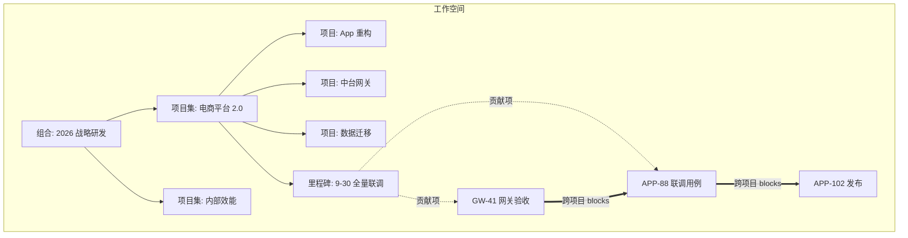
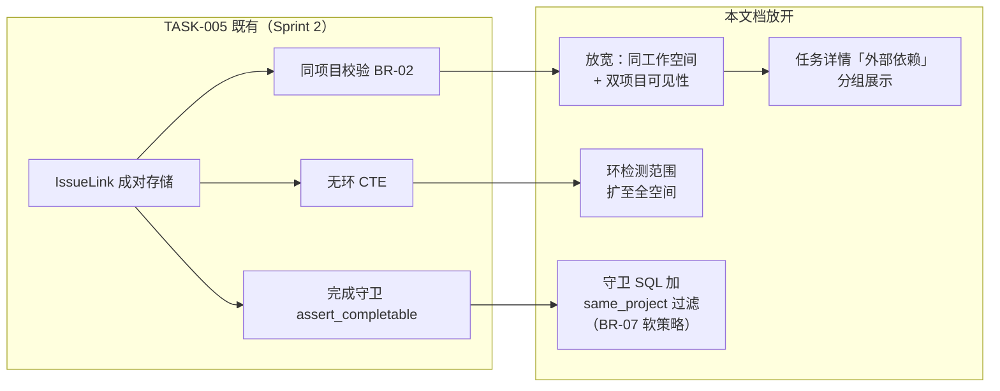
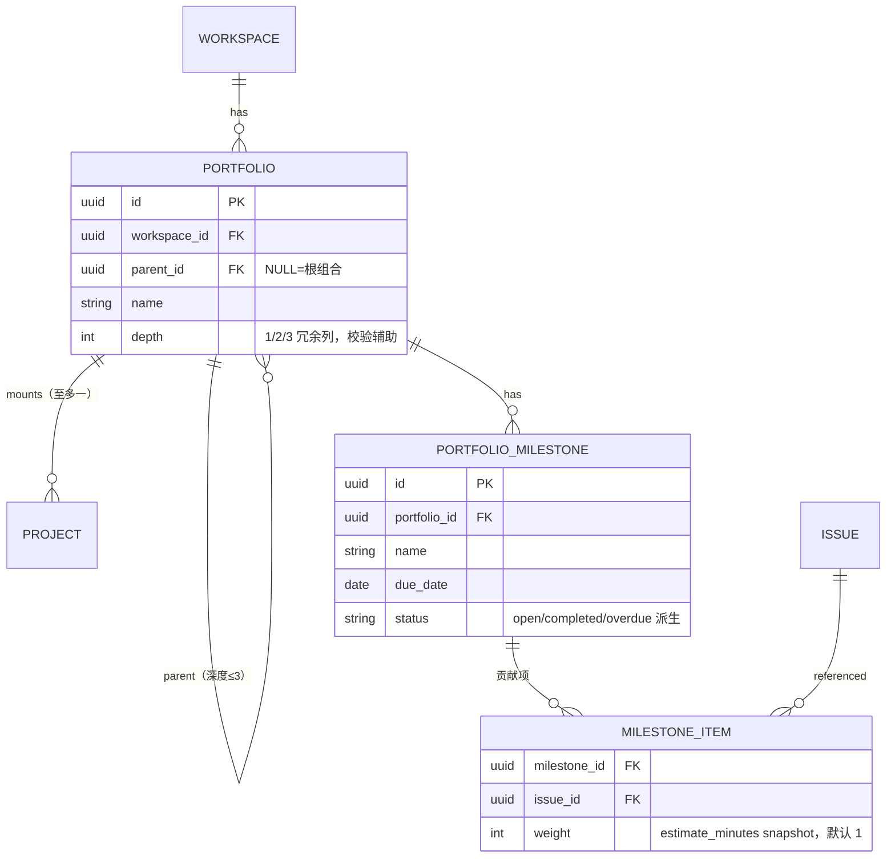

# PROJ-004 项目集 / 项目组合与跨项目依赖

| 元信息项 | 内容 |
| --- | --- |
| 文档编号 | PROJ-004 |
| 所属迭代 | Sprint 9 — 企业项目/报表/Wiki（第 12 周） |
| 模块 | M3-PROJ 项目管理（项目集） |
| 优先级 | P3（企业版核心 · 企业版 V1.0 组成部分） |
| 工作量估算 | 后端 3.0 人日（组合树 1 + 里程碑 0.5 + 跨项目依赖放开 1 + 汇总 0.5）｜前端 3.0 人日（组合面板 1.5 + 依赖连线图 1 + 里程碑视图 0.5）｜测试 1.5 人日 |
| 关联架构文档 | [`unified-issue-model.md`](../architecture/unified-issue-model.md)（§2.11 IssueLink）、[`rbac-permission-model.md`](../architecture/rbac-permission-model.md)、[`api-conventions.md`](../architecture/api-conventions.md) |
| 上游依赖 | `PROJ-001/003`（项目生命周期）；`TASK-005`（IssueLink 成对存储与无环约束——**BR-02 同项目限制在本迭代放开为「同工作空间可跨项目」**）；`TASK-013`（工时台账——资源汇总数据源） |
| 下游消费 | P4 资源统一调度、项目集级工作流；`RPT-004`（健康度可按项目集聚合） |
| 文档状态 | 待评审（Draft） |
| 最后更新日期 | 2026-09-01 |

---

## 1. 概述

### 1.1 背景

企业客户的中大型研发组织按「项目集（Program）→ 项目（Project）」两级管理：一个「电商平台 2.0」项目集下挂「App 重构」「中台网关」「数据迁移」三个项目，管理层要看的是**跨项目的整体进度、里程碑对齐与跨项目依赖**（网关未完成会阻塞 App 联调），而非单个项目的看板。

单项目视图（Sprint 0-8 既有）回答「这个团队做得怎么样」；PROJ-004 回答「这一盘棋走得怎么样」。这是企业版与标准版在管理视角上的分水岭之一。

### 1.2 目标

1. **项目集组合树**：`Portfolio` 自引用树（深度 ≤3：组合 → 项目集 → 子项目集），项目可挂载到项目集节点；一个项目至多属于一个项目集。
2. **里程碑**：`PortfolioMilestone` 跨项目对齐点（如「9-30 全量联调」），聚合各项目向其贡献的任务完成度，延期预警。
3. **跨项目依赖**：放开 `TASK-005` 的同项目限制至同工作空间；跨项目依赖**仅可视化与统计，不参与单项目流转拦截**（上下文不同，硬拦易误伤——迭代概览 §5 决策）。
4. **汇总面板**：项目集级进度（按 state.group 加权）、资源汇总（消费 `TASK-013` 工时快照）、风险列表（逾期/阻塞/里程碑偏差）。

### 1.3 范围与边界

| 范围 | 本文档交付 | 明确不做（归属） |
| --- | --- | --- |
| 组合树 | Portfolio 树 CRUD、项目挂载/迁移 | 集团-子公司多级（P4 多租户之上） |
| 里程碑 | 跨项目里程碑、完成度聚合、延期预警 | 里程碑基线对比（P4 `TASK-015` 之上） |
| 跨项目依赖 | IssueLink 放开同工作空间、依赖关系图可视化、统计 | **流转硬拦截**（明确不做，见 BR-07）、跨工作空间依赖（P4） |
| 汇总面板 | 进度/资源/风险三卡 | 资源统一调度与容量规划（P4） |

### 1.4 术语表

| 术语 | 定义 |
| --- | --- |
| 项目集（Portfolio） | 一组项目的逻辑归集，树形结构；叶子挂载项目 |
| 里程碑（Milestone） | 项目集级时间点目标，关联多个项目的任务集合作为「贡献项」 |
| 跨项目依赖 | 两端任务分属不同项目的 IssueLink（本迭代放开后合法） |
| 贡献项 | 挂载到里程碑下的任务（任意项目），完成度 = 贡献项加权完成比例 |

### 1.5 前置依赖

| 依赖 | 内容 | 阻塞原因 |
| --- | --- | --- |
| `TASK-005` | IssueLink 成对存储（INVERSE_MAP）、无环 CTE、成对删除 | 跨项目放开复用全部机制，仅放宽 BR-02 校验 |
| `PROJ-003` | 项目生命周期状态机（active/archived） | 归档项目可挂项目集但只读 |
| `TASK-013` | `WorkLogSummary` 人×周快照 | 资源汇总卡数据源 |
| `TASK-004` | 子树进度上卷（`completed_sub_issues_count`） | 项目级进度聚合范式复用 |

### 1.6 竞品参考

| 竞品 | 参考点 | 处置 |
| --- | --- | --- |
| Jira (Advanced Roadmaps) | Plan 跨项目组合、层级（Epic→Initiative）、依赖可视化与**告警不硬拦** | 「依赖可视化 + 软告警」策略采纳——与本迭代 BR-07 决策一致 |
| Ones | 项目集（Program）+ 里程碑 + 跨项目依赖 | 组合树与里程碑语义对齐 |
| Plane | 无项目集（2026-09，仅有 Project 平铺） | 项目集为企业版差异化能力 |

---

## 2. 业务逻辑

### 2.1 总体结构



### 2.2 业务规则（BR）

| 编号 | 规则 | 强制层 | 违约响应 |
| --- | --- | --- | --- |
| BR-01 | `Portfolio` 树深度 ≤3（组合 L1 → 项目集 L2 → 子项目集 L3）；禁止成环（parent 链检查同 TASK-004 `_is_descendant` CTE） | Service + CTE | `400 VALIDATION_ERROR` / `409 RESOURCE_CIRCULAR_DEPENDENCY` |
| BR-02 | 一个项目至多挂一个项目集节点；迁移挂载需原目标双权限 | DB 唯一约束（project_id 部分唯一） | `409 RESOURCE_ALREADY_EXISTS` |
| BR-03 | 项目集/里程碑管理需 WS 级权限（WS_ADMIN+）或项目集 `manager` 成员；只读对全部 WS 成员开放 | Permission | `403 PERM_ROLE_INSUFFICIENT` |
| BR-04 | 里程碑 `due_date` 必填；贡献项任务须属于项目集下任一项目（直接/间接子节点） | Serializer | `400 VALIDATION_ERROR` + `DOES_NOT_EXIST` |
| BR-05 | 里程碑完成度 = 贡献项中 `state.group ∈ {completed}` 的加权比例（权重 = 任务 `estimate_minutes`，无预估按 1 计） | 聚合服务 | — |
| BR-06 | 里程碑延期预警：`due_date` 前 7 天完成度 <100% → 每日一条预警至项目集 manager 收件箱（幂等键含日期）；逾期后转「已延期」红标 | Celery beat + SETNX | — |
| BR-07 | **跨项目依赖不参与流转拦截**：`TASK-005` 完成守卫仅统计**同项目** blocks 边；跨项目边在任务详情/依赖图展示「外部依赖」标记并计入风险统计 | 引擎守卫 SQL 加项目过滤 | — |
| BR-08 | 跨项目关联放开范围 = 同工作空间；两端项目均须对操作者可见；跨项目边创建需**源项目** `issue.update` | Permission + Service | `404 RESOURCE_NOT_FOUND`（存在性隐藏）/ `403 PERM_DENIED` |
| BR-09 | 跨项目边的无环检测范围扩展到同工作空间全图（CTE 沿 blocks 边，深度守卫 `CTE_GUARD_DEPTH=100` 不变） | Service | `409 RESOURCE_CIRCULAR_DEPENDENCY` |
| BR-10 | 归档项目在组合树中保留只读；项目归档不影响项目集统计（历史数据照常聚合） | Service | — |
| BR-11 | 删除非空项目集（下挂项目或子节点）须先迁移内容 | Service | `409 RESOURCE_IN_USE` + `details` 计数 |
| BR-12 | 资源汇总卡数据源 = `TASK-013` `WorkLogSummary`（按项目集下项目集合过滤，人×周聚合为「人×项目」矩阵）；不另建聚合表 | 聚合服务 | — |
| BR-13 | 项目集级进度 = 下挂项目进度加权平均（权重 = 项目未取消任务数）；项目进度 = 任务 state.group 完成比例（承 TASK-004 上卷语义） | 聚合服务 | — |

### 2.3 跨项目依赖放开方案（对 TASK-005 的增量）



| 兼容点 | 说明 |
| --- | --- |
| API 契约不变 | `relations/` 端点与响应结构零变化；跨项目边在 `details` 中追加 `target_project` 摘要 |
| 既有数据零迁移 | 同项目边天然满足新校验 |
| GANTT-001 冻结契约 | relations/ 载荷结构不变，甘特连线渲染跨项目边时加虚线样式（GANTT-003 关键路径仅计算同项目子图） |

---

## 3. UI/UX 设计

### 3.1 项目集汇总面板

```
┌──────────────────────────────────────────────────────────────────────────┐
│ ◈ 电商平台 2.0 · 项目集                     [里程碑] [依赖图] [成员] [设置] │
├──────────────────────────────────────────────────────────────────────────┤
│ ┌─ 整体进度 ──────────┐ ┌─ 资源（近 4 周）─┐ ┌─ 风险 (4) ──────────────┐ │
│ │ ▓▓▓▓▓▓▓▓▓░░░░░ 62% │ │ 李骁   App  30h   │ │ ⚠ GW-41 逾期 3 天        │ │
│ │ App 重构    ███ 71% │ │        网关 12h   │ │ ⚠ 里程碑「全量联调」      │ │
│ │ 中台网关    ██░ 48% │ │ 王思远 网关 26h   │ │   完成度 55%，剩 7 天    │ │
│ │ 数据迁移    ███ 80% │ │ 陈默   迁移 22h   │ │ ⚠ APP-102 被 2 个外部    │ │
│ │ (权重: 未取消任务数) │ │ (人×项目矩阵)     │ │   依赖阻塞               │ │
│ └────────────────────┘ └──────────────────┘ └─────────────────────────┘ │
├──────────────────────────────────────────────────────────────────────────┤
│ 项目列表                                                [+ 挂载项目]      │
│ 项目         状态    进度   任务    逾期   负责人      最近动态            │
│ ──────────────────────────────────────────────────────────────────────  │
│ App 重构     ●活跃   71%   128     3     张妍       2 分钟前 · 迭代规划    │
│ 中台网关     ●活跃   48%    86     7     李骁       1 小时前 · 网关验收    │
│ 数据迁移     ●活跃   80%    45     0     陈默       昨天 · 双写验证        │
└──────────────────────────────────────────────────────────────────────────┘
```

### 3.2 里程碑视图

```
┌────────────────────────────────────────────────────────────────────────┐
│ 里程碑 · 电商平台 2.0                              [+ 新建里程碑]        │
├────────────────────────────────────────────────────────────────────────┤
│ ● 9-30 全量联调     ▓▓▓▓▓░░░░░ 55%   剩 7 天   贡献项 11（完成 6）       │
│   ├─ APP-88  联调用例通过      App 重构    ●进行中    负责人 王思远      │
│   ├─ GW-41   网关验收          中台网关    ⚠逾期 3天  负责人 李骁        │
│   └─ DM-17   双写校验报告      数据迁移    ✓已完成    负责人 陈默        │
│ ○ 11-15 灰度上线    ░░░░░░░░░░  0%   剩 53 天  贡献项 8（完成 0）        │
│ ✓ 8-31 接口冻结     ▓▓▓▓▓▓▓▓▓▓ 100%   已完成    贡献项 9（完成 9）       │
└────────────────────────────────────────────────────────────────────────┘
```

### 3.3 依赖关系图

项目集级依赖图（仅跨项目边 + 关键同项目边）：节点 = 任务卡片（编号+标题+项目色标），边 = 依赖箭头（跨项目边虚线 + 「外部」徽标）；支持按项目集下项目过滤、点击节点跳转任务。100 节点内 SVG 渲染，超出提示先过滤。

### 3.4 任务详情的外部依赖展示

任务详情「关联」区分组：`本项目关联`（V1.0 样式不变）+ `外部依赖`（新增分组，卡片含项目徽标 + 项目名；仅当存在跨项目边时渲染该分组）。完成守卫 toast 说明：「外部依赖不阻止完成，请自行确认」（BR-07 的用户可见表达，首次出现跨项目边时展示一次）。

---

## 4. 技术架构

### 4.1 实体关系



### 4.2 模型定义

```python
class Portfolio(BaseModel):
    """项目集组合树 —— 深度 ≤3（BR-01），项目挂载叶子（BR-02）"""

    MAX_DEPTH = 3

    workspace = models.ForeignKey(
        Workspace, on_delete=models.CASCADE, related_name="portfolios", verbose_name="所属工作空间"
    )
    parent = models.ForeignKey(
        "self", on_delete=models.CASCADE, null=True, blank=True,
        related_name="children", verbose_name="父节点", help_text="NULL = 根组合"
    )
    name = models.CharField(max_length=128, verbose_name="名称")
    description = models.TextField(blank=True, verbose_name="说明")
    depth = models.PositiveSmallIntegerField(default=1, verbose_name="层级（冗余）")
    sort_order = models.FloatField(default=65535.0, verbose_name="排序值")

    class Meta(BaseModel.Meta):
        db_table = "portfolios"
        constraints = [
            models.UniqueConstraint(fields=["parent", "name"],
                                    condition=models.Q(deleted_at__isnull=True),
                                    name="uniq_portfolio_name_per_parent"),
            models.CheckConstraint(check=models.Q(depth__gte=1, depth__lte=3),
                                   name="chk_portfolio_depth"),
        ]
        indexes = [models.Index(fields=["workspace", "parent"], name="idx_portfolio_ws_parent")]


class PortfolioProject(BaseModel):
    """项目挂载关系 —— 一个项目至多一个项目集（BR-02）"""

    portfolio = models.ForeignKey(
        Portfolio, on_delete=models.CASCADE, related_name="mounted_projects", verbose_name="项目集"
    )
    project = models.ForeignKey(
        Project, on_delete=models.CASCADE, related_name="portfolio_mount", verbose_name="项目"
    )

    class Meta(BaseModel.Meta):
        db_table = "portfolio_projects"
        constraints = [
            models.UniqueConstraint(fields=["project"], condition=models.Q(deleted_at__isnull=True),
                                    name="uniq_project_single_portfolio"),
        ]


class PortfolioMilestone(BaseModel):
    portfolio = models.ForeignKey(
        Portfolio, on_delete=models.CASCADE, related_name="milestones", verbose_name="所属项目集"
    )
    name = models.CharField(max_length=128, verbose_name="里程碑名称")
    description = models.TextField(blank=True, verbose_name="说明")
    due_date = models.DateField(db_index=True, verbose_name="截止日期")          # BR-04
    completed_at = models.DateTimeField(null=True, blank=True, verbose_name="完成时间")

    class Meta(BaseModel.Meta):
        db_table = "portfolio_milestones"
        indexes = [models.Index(fields=["portfolio", "due_date"], name="idx_pm_portfolio_due")]


class MilestoneItem(BaseModel):
    """里程碑贡献项 —— 权重快照避免 estimate 后续变更篡改历史完成度（BR-05）"""

    milestone = models.ForeignKey(
        PortfolioMilestone, on_delete=models.CASCADE, related_name="items", verbose_name="里程碑"
    )
    issue = models.ForeignKey(
        Issue, on_delete=models.CASCADE, related_name="milestone_items", verbose_name="贡献任务"
    )
    weight = models.PositiveIntegerField(default=1, verbose_name="权重快照")

    class Meta(BaseModel.Meta):
        db_table = "milestone_items"
        constraints = [models.UniqueConstraint(fields=["milestone", "issue"],
                                               name="uniq_milestone_issue")]
```

### 4.3 聚合服务

```python
class PortfolioService:
    def descendant_projects(self, portfolio_id) -> list[UUID]:
        """项目集下全部项目（经 CTE 展开子节点 + 挂载表）——面板/里程碑共用入口"""
        return Project.objects.filter(
            portfolio_mount__portfolio_id__in=self._subtree_ids(portfolio_id),
            deleted_at__isnull=True).values_list("id", flat=True)

    def progress(self, portfolio_id) -> PortfolioProgress:
        """BR-13：项目进度 = completed/(total - cancelled)；项目集 = 按未取消任务数加权"""
        rows = (
            Issue.objects.filter(project_id__in=self.descendant_projects(portfolio_id),
                                 deleted_at__isnull=True, parent__isnull=True)
            .values("project_id")
            .annotate(total=Count("id", filter=~Q(state__group="cancelled")),
                      done=Count("id", filter=Q(state__group="completed")))
        )
        total = sum(r["total"] for r in rows) or 1
        return PortfolioProgress(
            overall=sum(r["done"] for r in rows) / total,
            by_project=[{"project_id": r["project_id"],
                         "ratio": r["done"] / (r["total"] or 1)} for r in rows])

    def milestone_progress(self, milestone_id) -> float:
        """BR-05：Σ(已完成贡献项 weight) / Σ(weight)"""
        agg = MilestoneItem.objects.filter(milestone_id=milestone_id).aggregate(
            total=Coalesce(Sum("weight"), 0),
            done=Coalesce(Sum("weight", filter=Q(issue__state__group="completed")), 0))
        return agg["done"] / agg["total"] if agg["total"] else 0.0

    def resource_matrix(self, portfolio_id, from_week, to_week):
        """BR-12：消费 TASK-013 快照，人×项目矩阵——不扫明细表"""
        return (
            WorkLogSummary.objects.filter(
                project_id__in=self.descendant_projects(portfolio_id),
                week_start__range=(from_week, to_week))
            .values("actor_id", "project_id")
            .annotate(minutes=Sum("total_minutes"))
        )

    def risk_list(self, portfolio_id) -> list[Risk]:
        """风险三源：逾期任务、被外部依赖阻塞任务、里程碑偏差（BR-06 判定同源）"""
        projects = self.descendant_projects(portfolio_id)
        overdue = Issue.objects.filter(project_id__in=projects, due_date__lt=timezone.today(),
                                       deleted_at__isnull=True).exclude(
            state__group__in=["completed", "cancelled"])
        blocked_external = IssueLink.objects.filter(
            link_type="blocks", issue__project_id__in=projects,
        ).exclude(related_issue__project_id__in=projects)  # 跨项目边（BR-07 展示源）
        ...
```

### 4.4 跨项目依赖放开（对 TASK-005 Service 的增量 diff）

```python
# TASK-005 IssueLinkService.create 的校验 diff：
- if link.issue.project_id != link.related_issue.project_id:
-     raise ApiError("VALIDATION_ERROR", 400, code="DOES_NOT_EXIST")   # 原 BR-02 同项目
+ if link.issue.workspace_id != link.related_issue.workspace_id:       # BR-08：放开到同工作空间
+     raise ApiError("VALIDATION_ERROR", 400, details={
+         "related_issue": [{"code": "DOES_NOT_EXIST", "message": "仅支持同工作空间内关联"}]})
+ # 双项目可见性（存在性隐藏语义，api-conventions §3.4）
+ if not PermissionResolver.can_view(actor, link.related_issue.project):
+     raise ApiError("RESOURCE_NOT_FOUND", 404)

# TASK-005 assert_completable 的 BLOCKER_SQL diff（BR-07 软策略）：
  WITH RECURSIVE blockers AS (
      SELECT il.related_issue_id FROM issue_links il
      WHERE il.issue_id = %(issue_id)s AND il.link_type = 'blocks'
+       AND il.related_issue_id IN (SELECT id FROM issues WHERE project_id = %(project_id)s)
      -- 仅同项目边参与硬拦截；跨项目边仅展示与统计
      ...
  )

# 无环检测 _reaches 不加项目过滤（BR-09：环就是环，跨项目同样禁止）
```

### 4.5 里程碑预警任务

```python
@shared_task(queue="reports")
def milestone_due_alerts():
    """Celery beat 每日 09:00：BR-06 前 7 天每日一条（幂等键含日期），逾期转红标"""
    today = timezone.localdate()
    for ms in PortfolioMilestone.objects.filter(
            completed_at__isnull=True, due_date__gte=today - timedelta(days=30),
            deleted_at__isnull=True).select_related("portfolio"):
        progress = PortfolioService().milestone_progress(ms.id)
        if progress >= 1.0:
            continue
        days_left = (ms.due_date - today).days
        if days_left <= 7:
            key = f"ms:alert:{ms.id}:{today}"
            if cache.set(key, "1", timeout=86400, nx=True):
                notify_milestone_risk.delay(str(ms.id), days_left, progress)  # manager 收件箱
```

### 4.6 API 端点

| 方法 | 路径 | 说明 | 权限 |
| --- | --- | --- | --- |
| GET/POST | `/api/v1/workspaces/{slug}/portfolios/` | 组合树列表（嵌套）/ 新建节点 | 读：WS 成员；写：WS_ADMIN+ 或项目集 manager |
| GET/PATCH/DELETE | `…/portfolios/{id}/` | 详情/改/删（BR-11 非空阻断） | 同上 |
| POST/DELETE | `…/portfolios/{id}/projects/` | 挂载/卸载项目 `{project_id}`（BR-02） | 双端权限 |
| GET | `…/portfolios/{id}/summary/` | 汇总面板（进度+资源+风险三卡一次返回） | WS 成员 |
| GET/POST | `…/portfolios/{id}/milestones/` | 里程碑列表（含完成度）/ 新建 | 读：WS 成员；写：manager+ |
| POST/DELETE | `…/milestones/{id}/items/` | 增删贡献项 `{issue_id}`（BR-04） | manager+ |
| GET | `…/portfolios/{id}/dependency-graph/` | 依赖图载荷（节点+边，跨项目边标记） | WS 成员 |

**① `GET …/summary/` 响应（200）**：

```json
{
  "status": 0,
  "data": {
    "portfolio": { "id": "01J9XQK7M3N4P5R6S7T8V9W1A1", "name": "电商平台 2.0" },
    "progress": {
      "overall": 0.62,
      "by_project": [
        { "project_id": "01J9XQK7M3N4P5R6S7T8V9W1B2", "identifier": "APP", "ratio": 0.71 },
        { "project_id": "01J9XQK7M3N4P5R6S7T8V9W1C3", "identifier": "GW", "ratio": 0.48 }
      ]
    },
    "resource": {
      "weeks": ["2026-08-10", "2026-08-17", "2026-08-24", "2026-08-31"],
      "matrix": [
        { "actor": "李骁", "cells": { "APP": 1800, "GW": 720 } }
      ]
    },
    "risks": [
      { "type": "overdue_issue", "issue": "GW-41", "title": "网关验收", "days": 3 },
      { "type": "milestone_slip", "milestone": "全量联调", "progress": 0.55, "days_left": 7 },
      { "type": "external_blocked", "issue": "APP-102", "blocked_by": ["GW-41", "GW-52"] }
    ]
  },
  "meta": { "request_id": "01J9XQK7M3N4P5R6S7T8V9W1D4" }
}
```

**② 错误响应矩阵**：

| 场景 | HTTP | code | details |
| --- | --- | --- | --- |
| 树深度 >3 | 400 | `VALIDATION_ERROR` | 子码 `TOO_LARGE` |
| 父链成环 | 409 | `RESOURCE_CIRCULAR_DEPENDENCY` | 环路径 |
| 项目重复挂载 | 409 | `RESOURCE_ALREADY_EXISTS` | 当前挂载点 |
| 删除非空项目集 | 409 | `RESOURCE_IN_USE` | `children`/`projects` 计数 |
| 跨工作空间关联 | 400 | `VALIDATION_ERROR` | 子码 `DOES_NOT_EXIST` |
| 不可见目标项目 | 404 | `RESOURCE_NOT_FOUND` | 存在性隐藏 |
| 贡献项非项目集内任务 | 400 | `VALIDATION_ERROR` | 子码 `DOES_NOT_EXIST` |
| 权限不足 | 403 | `PERM_ROLE_INSUFFICIENT` | — |

### 4.7 前端实现

```typescript
class PortfolioStore {
  @observable tree: PortfolioNode[] = [];
  @observable summary: PortfolioSummary | null = null;
  @observable milestones: MilestoneVM[] = [];

  async fetchSummary(portfolioId: string) {
    // SWR 30s：三卡一次载荷（§4.6 ①），里程碑流转/任务完成后 mutate
    const res = await api.get(`…/portfolios/${portfolioId}/summary/`);
    runInAction(() => { this.summary = res.data.data; });
  }

  @computed milestoneProgress(m: MilestoneVM): number {
    const total = m.items.reduce((s, i) => s + i.weight, 0) || 1;
    return m.items.filter(i => i.done).reduce((s, i) => s + i.weight, 0) / total;
  }
}
```

| 前端要点 | 方案 |
| --- | --- |
| 依赖图 | ELK.js 分层布局；跨项目边虚线 + 「外部」徽标；>100 节点提示过滤 |
| 面板三卡 | 单次 `summary/` 载荷渲染；风险卡可点击直达任务/里程碑 |
| 外部依赖分组 | 任务详情 `relations` 按 `target_project` 是否同项目分桶渲染 |

---

## 5. 测试用例

### 5.1 单元测试（UT）

| 编号 | 用例 | 断言 |
| --- | --- | --- |
| UT-01 | 组合树深度：L3 下再挂子节点 | 400 `TOO_LARGE` |
| UT-02 | 父链成环（A→B→C→A） | 409 `RESOURCE_CIRCULAR_DEPENDENCY` + 环路径 |
| UT-03 | 项目重复挂载 | 409 `RESOURCE_ALREADY_EXISTS`（DB 约束并发兜底） |
| UT-04 | 删除非空项目集 | 409 `RESOURCE_IN_USE` + 计数 |
| UT-05 | `progress` 加权：cancelled 不计、空项目不除零 | 与手工核算一致 |
| UT-06 | `milestone_progress`：权重快照语义（estimate 后续变更不影响） | 完成度不变 |
| UT-07 | 跨项目边创建：同工作空间放行/跨空间拒绝/不可见 404 | 三路径 |
| UT-08 | `assert_completable` 加项目过滤：跨项目 blocks 不拦截完成 | 同项目拦截行为不变（TASK-005 回归） |
| UT-09 | 跨项目环检测：A(p1) blocks B(p2) blocks A(p1) | 409 `CIRCULAR` |
| UT-10 | 资源矩阵聚合与 TASK-013 快照对账 | 逐 cell 一致 |
| UT-11 | 里程碑预警幂等：同日重复跑 beat 只一条 | SETNX 生效 |
| UT-12 | 贡献项项目归属校验（非项目集内任务） | 400 `DOES_NOT_EXIST` |

### 5.2 集成测试（IT）

| 编号 | 用例 | 断言 |
| --- | --- | --- |
| IT-01 | 建 3 项目 + 2 里程碑项目集：summary 三卡字段与手工核算一致 | 迭代概览验收第 2 条 |
| IT-02 | 跨项目依赖建边 → 依赖图载荷含虚线标记 + 任务详情外部分组 | 结构正确 |
| IT-03 | 跨项目边下 TASK-005 守卫回归：同项目 blocks 仍硬拦 | 行为快照一致 |
| IT-04 | 里程碑 T-7 预警：每日一条、完成度达 100% 后停止 | 通知计数正确 |
| IT-05 | 挂载/迁移/卸载项目的权限矩阵（双端权限） | 403/200 路径正确 |

### 5.3 E2E

| 编号 | 场景 |
| --- | --- |
| E2E-01 | 建组合树（组合→项目集→3 项目）→ 面板进度/资源/风险三卡渲染正确 |
| E2E-02 | 里程碑添加 3 项目贡献项 → 完成部分 → 完成度与加权一致 → 延期预警出现 |
| E2E-03 | 依赖图：建跨项目 blocks → 图渲染虚线边 → 点击跳转任务详情见「外部依赖」分组 |
| E2E-04 | 跨项目依赖下完成被依赖任务不被硬拦（toast 提示一次），同项目依赖仍硬拦 |

---

## 6. 竞品深度对标

| 维度 | Jira Advanced Roadmaps | Ones 项目集 | Plane | **本方案** |
| --- | --- | --- | --- | --- |
| 组合层级 | Plan → 无限层级（Initiative 等需配置层级方案） | 项目集 → 项目 | 无 | 固定 3 层（组合/项目集/子项目集）——够用且免层级方案配置负担 |
| 跨项目依赖 | 可视化 + 软告警（不硬拦） | 可视化，可选硬拦 | 无 | **可视化 + 软告警**（BR-07 与 Jira 同策略；Ones 硬拦在跨项目上下文误伤率高） |
| 里程碑 | Release 对齐（单项目版本） | 项目集里程碑 | 无 | 跨项目贡献项 + 权重快照完成度 + T-7 预警 |
| 资源视图 | 容量规划（独立模块，按 sprint 容量） | 工时统计 | 无 | 复用 TASK-013 快照零新聚合；容量规划留 P4 |
| 进度口径 | 按 estimate 加权（可配） | 按任务数 | — | 未取消任务数加权（BR-13），口径写入文档防争议 |

---

## 7. 里程碑与验收

### 7.1 交付清单

| 类别 | 交付物 |
| --- | --- |
| Model / Migration | `portfolios` / `portfolio_projects` / `portfolio_milestones` / `milestone_items` 四表 + 5 约束 + 3 索引 |
| 后端 | `PortfolioService`（子树展开/进度/里程碑完成度/资源矩阵/风险列表）、TASK-005 跨项目放开 diff（校验 + 守卫 SQL）、`milestone_due_alerts` beat 任务、8 组端点 |
| 前端 | 组合树导航、汇总面板三卡、里程碑视图、依赖关系图（ELK 布局）、任务详情外部依赖分组 |
| 测试 | UT-01~12、IT-01~05、E2E-01~04 |

### 7.2 可操作演示的验收标准

1. 建含 3 项目 + 2 里程碑的项目集：跨项目依赖连线正确、整体进度与资源汇总实时、里程碑延期预警可见（迭代概览验收第 2 条全项）。
2. 跨项目依赖演示：建边成功 → 依赖图虚线渲染 → 被依赖方完成不被硬拦（toast 提示）→ 同项目依赖回归硬拦。
3. 环检测演示：构造跨项目依赖环返回 409 `RESOURCE_CIRCULAR_DEPENDENCY` 且给出环路径。
4. 资源汇总与 `TASK-013` 台账逐 cell 对账一致（单一数据源验证）。
5. 权重快照演示：贡献项 estimate 变更后历史里程碑完成度不变。
6. 权限演示：非 manager 挂载项目 403；不可见项目关联 404（存在性隐藏）。
7. 全部端点通过 `api-conventions.md` §14 检查清单。

---

## 8. 相关文档

- 迭代概览：[`docs/sprint-9-enterprise-portfolio/sprint-overview.md`](sprint-overview.md)
- 依赖机制基座：[`docs/sprint-2-task-full/TASK-005-task-dependency.md`](../sprint-2-task-full/TASK-005-task-dependency.md)
- 工时尚源：[`docs/sprint-7-enterprise-workflow/TASK-013-team-worklog.md`](../sprint-7-enterprise-workflow/TASK-013-team-worklog.md)
- 健康度聚合：[`docs/sprint-9-enterprise-portfolio/RPT-004-project-health.md`](RPT-004-project-health.md)
- 关键路径边界：[`docs/sprint-9-enterprise-portfolio/GANTT-003-critical-path.md`](GANTT-003-critical-path.md)（跨项目边不参与 CPM）


