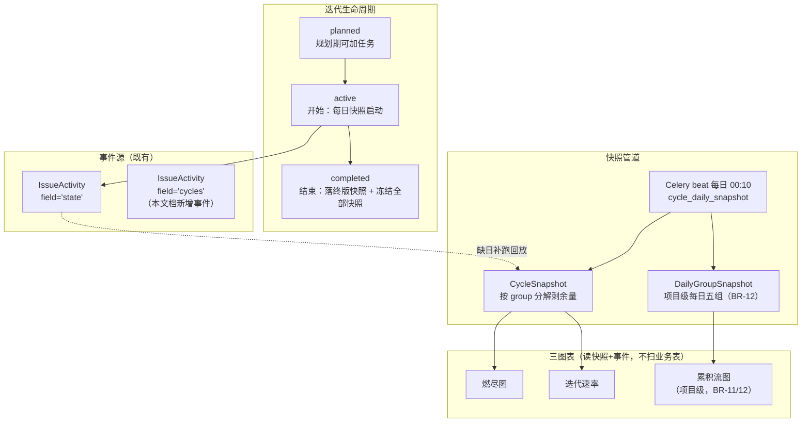
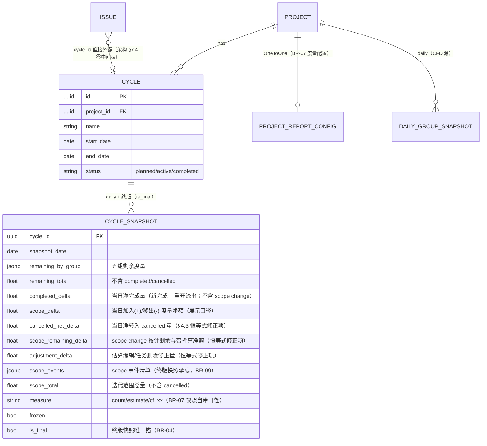

# 燃尽图 / 迭代速率 / 累积流图

| 元信息项 | 内容 |
| --- | --- |
| 文档编号 | RPT-003 |
| 所属迭代 | Sprint 9 — 企业项目/报表/Wiki（第 12 周） |
| 模块 | M10-RPT 数据报表 |
| 优先级 | P3（企业版核心 · 企业版 V1.0 组成部分） |
| 工作量估算 | 后端 4.0 人日（Cycle 模型 1 + 快照管道 1.5 + 三图表服务 1.5）｜前端 3.5 人日（三图表 2 + 迭代管理 1 + 导出 0.5）｜测试 2.0 人日 |
| 关联架构文档 | [`unified-issue-model.md`](../architecture/unified-issue-model.md)（**§7.4 本项目 Cycle 处置——任务归属用 `Issue.cycle_id` 直接外键，零中间表**；§7.2 Plane Cycle 原型——时间盒 / `field='cycles'` scope change 语义，本文档落地两节）、[`api-conventions.md`](../architecture/api-conventions.md) |
| 上游依赖 | `RPT-002`（项目统计框架——项目级报表聚合口径基座）；`TASK-010`（IssueActivity 事件管道——`field='state'` 与 `field='cycles'` 事件是三图表的回算数据源）——二者为 dependency-graph §4 RPT-003 行记载的依赖边；`TASK-006`（estimate_minutes 作为燃尽度量之一；**范式复用，非 dg 边**）；`GANTT-002`（PNG 导出管线复用；**范式复用，非 dg 边**——对齐迭代概览 §3 对 FILE-005 附属项的标注惯例） |
| 下游消费 | `RPT-004`（健康度消费速率与燃尽趋势）；P4 `RPT-005`（大屏数据源） |
| 文档状态 | 待评审（Draft） |
| 最后更新日期 | 2026-09-05（R3 修复：`completed_delta` 改净口径——当日新进入 − 当日流出 completed（重开为负项，与 `cancelled_net_delta` 转入−回流对称，恒等式对任务重开封闭）、新增 UT-19 重开对账 / velocity 不虚高用例（§7.1 同步 UT-01~19）、§4.4 首日快照降级改零值降级对象并实装 `meta.warnings[]` 注入、beat/velocity/complete 三处 `ProjectReportConfig` 统一 `get_or_create(defaults count)` 惰性建行、CSV 上界声明改「与 RPT-004 同为服务端流式，同步上界与异步转投由本文档登记」并删上游 RPT-002「导出」表述（其范围表明确导出 ❌）、UT-02 区分 DB/Service 两类兜底、BR-10 补完成柱口径注、§1.3 注明 CSV 仅燃尽端点、§2.1 虚线边改「缺日补跑回放」、§4.2 补 FloatField 整数取值与加入已取消任务折算说明、§4.3 补硬删 CASCADE 归因注、§4.5 示例 `scope_events` 标注节选。R2 修复：§4.3 恒等式补 cancelled 转入 / 估算编辑 / scope 计剩余折算三个修正项并把自校验降级为带容差软对账（超差告警+补跑不硬失败）、§2.1 mermaid CFD 数据源改指 DailyGroupSnapshot（BR-12）、§4.4 归档 scope_events 改读终版快照 JSONB + 活查补 `issue__project` 过滤、`on_cycle_completed` 补「首次进入 completed」边沿守卫（BR-06）、velocity 首日快照缺行显式补跑、`reports/config/` PUT 改 PATCH（api-conventions §3.2）、迭代列表端点补 §14 游标分页/ordering 白名单/filterset 契约、元信息上游补 `RPT-002`、新增 UT-15~18（恒等式反例×2 / 归档 403 / 非法字段 400）、BR-13/14 补 R5 开关设置项落点与 rbac `cycle.read` 待回改注、beat 时区单口径边界、CFD 度量切换空窗声明、CSV 同步导出上界、§3.1 横轴收敛至 end_date 09-06。R4 复评 PASS（10×5 满分）后随手收口：§3.2 标题迭代数与横轴对齐（limit=6 含进行中占位不计柱）、§2.3 补跑行限定 CycleSnapshot（DailyGroupSnapshot 缺日按 BR-12 空窗+插值）、移动均值仅同度量连续区间计算、UT-02 兜底措辞精确化） |

---

## 1. 概述

### 1.1 背景

敏捷团队的管理三问：「这个迭代能按时交付吗（燃尽）、我们团队稳定产能是多少（速率）、工作流哪里在积压（累积流）」。三张图是敏捷报表的最小完备集，也是企业版相对标准版（仅有 `RPT-001` 个人统计与 `RPT-002` 项目统计）在**过程管理**上的分水岭。

数据基础已全部就绪：`TASK-010` 的 IssueActivity 事件流记录了每一次状态变更（`field='state'`），架构文档 §7.4 预留的 `Issue.cycle_id` 关联位与 §7.2 对标的 Cycle 时间盒 / scope change 语义定义了迭代容器。本文档把二者拼成报表体系——**核心纪律：报表消费事件流与快照，不实时扫业务表**（迭代概览 §5「数据可信」约束）。

### 1.2 目标

1. **Cycle 迭代模型落地**：按架构 §7.4 处置建 `Cycle`（时间盒），任务归属直接用 `Issue.cycle_id` 外键（P0 已预留列，本 sprint 零中间表、零 issues 表 DDL）；`field='cycles'` Activity 事件记录加入/移出（scope change）。
2. **燃尽图**：迭代内每日剩余工作量曲线 vs 理想线；度量可切任务数/预估工时/故事点（自定义数字字段）。
3. **迭代速率**：近 N 个已完成迭代的完成量柱状 + 均值线，为下一迭代规划提供产能基线。
4. **累积流图（CFD）**：按 `state.group` 五组堆叠的时序面积图，积压段一眼可见。
5. **快照不可篡改**：迭代期间每日落 `CycleSnapshot` 日报快照，结束时**落终版快照（`is_final` 唯一锚）并冻结全部快照**，**结束后修改历史任务不改变已归档报表**（迭代概览验收第 3 条）。

### 1.3 范围与边界

| 范围 | 本文档交付 | 明确不做（归属） |
| --- | --- | --- |
| 迭代容器 | Cycle CRUD / 开始 / 结束 / 任务加入移出 | 自动滚动迭代（未完成任务自动转入下一迭代——提供「结转」按钮，不做自动策略） |
| 燃尽 | 日粒度实际线 + 理想线 + scope change 标注 | 燃尽预测线（P4 AI `AI-001`） |
| 速率 | 完成量柱状 + 移动均值 | 按成员拆速率（RPT-004 负载域） |
| CFD | 五组堆叠时序 + 区间缩放 | 自定义状态组聚合（group 五组即冻结口径） |
| 导出 | PNG（前端渲染，复用 GANTT-002 管线）+ CSV（服务端流式；CSV 仅燃尽端点提供，velocity/CFD 无导出） | 定时订阅推送（P4 `RPT-005`） |

### 1.4 术语表

| 术语 | 定义 |
| --- | --- |
| 时间盒（Time-box） | Cycle 的 `start_date`/`end_date` 闭区间；项目内时间不重叠（BR-03） |
| scope change | 迭代开始后加入/移出的任务变更——燃尽图台阶与 CFD 的口径修正依据；**只计入 `scope_delta`，不混入完成量**（BR-10/§4.3） |
| 剩余量 | 迭代内未达 `completed` 且未 `cancelled` 组任务的度量总和（任务数/工时/点数）——与 §4.3 口径函数一致，`cancelled` 不计剩余 |
| 计划量（planned） | 首日快照（`start_date` 当日）的 `scope_total`：迭代开始时刻范围内全部任务度量合计（不含 `cancelled`）；速率图的「计划」柱即此值（BR-10） |
| 快照 | `CycleSnapshot`：迭代期间每日一行（剩余量按组分解），结束时另落终版快照（`is_final=true`），之后只读 |

### 1.5 前置依赖

| 依赖 | 内容 | 阻塞原因 |
| --- | --- | --- |
| `unified-issue-model.md` §7.4/§7.2 | `Issue.cycle_id` 直接外键处置（P0 已预留列）、Cycle 时间盒模型、`field='cycles'` scope change 事件 | 模型照此落地，零设计分歧 |
| `RPT-002` | 项目统计框架——项目级报表聚合口径基座 | 三图表项目级聚合遵循同基线（dependency-graph §4 RPT-003 上游，dg 依赖边；导出不在 RPT-002 范围——其范围表明确「报表导出 ❌ → P3 RPT-004」） |
| `TASK-010` | IssueActivity 管道 + `idx_activity_field` 索引 | 快照回填与历史回算数据源；`field='cycles'` 事件挂点 |
| `TASK-006` | `estimate_minutes` | 工时度量燃尽（范式复用，非 dg 边） |
| `TASK-008` | 自定义数字字段 | 故事点度量（`cf_*` 数字字段可选为度量） |
| `GANTT-002` | html-to-image PNG 导出 2x 管线 | 导出复用（范式复用，非 dg 边） |

### 1.6 竞品参考

| 竞品 | 参考点 | 处置 |
| --- | --- | --- |
| Jira | Sprint Report（燃尽 + scope change 标记）、Velocity Chart、CFD | 三图语义全对齐；scope change 的「加入/移出」事件标注方式采纳 |
| Plane | Cycle + `field='cycles'` Activity + burn-down（架构 §7.2 已逆向） | 模型对齐（Cycle 源自 Plane）；归属关系按架构 §7.4 处置改用 `Issue.cycle_id` 直接外键（一对一语义下省掉 CycleIssue 中间表的 JOIN）；**快照不可篡改为我方强化**（Plane 实时回算，历史可被修改污染） |
| Azure DevOps | CFD 按看板列堆叠 | 我方按 `state.group` 五组（跨项目语义稳定，BR 冻结口径） |

---

## 2. 业务逻辑

### 2.1 总体数据流



### 2.2 业务规则（BR）

| 编号 | 规则 | 强制层 | 违约响应 |
| --- | --- | --- | --- |
| BR-01 | 一任务同时只属于一个迭代：归属即 `Issue.cycle_id` 单值外键（架构 §7.4，不建 CycleIssue 中间表）；`PUT …/issues/` 整批换绑同事务完成「旧迭代移出 + 新迭代加入」（两条 `cycles` Activity）；单任务快捷加入遇已归属其他迭代时拒绝，须走整批换绑 | Service（单值外键天然唯一） | `409 RESOURCE_ALREADY_EXISTS` |
| BR-02 | Cycle 状态机：`planned → active → completed`；`active → planned` 仅当无快照产生；`completed` 终态不可重开 | Service | `409 RESOURCE_STATE_INVALID` |
| BR-03 | 项目内 `active` 迭代至多一个；`planned` 迭代时间盒不得与 `active` 重叠 | Service + 约束 | `409 RESOURCE_STATE_INVALID` |
| BR-04 | 迭代结束（`complete`）：**事务内顺序 = 先落 `status=completed`（同事务触发 `on_cycle_completed` 落终版快照——快照按完成时刻口径、含未完成任务，见 ①）→ 后执行 ③ 未完成任务移交**。① **落终版快照**（`CycleSnapshot(is_final=true, frozen=true, snapshot_date=完成日)`，含终版按组剩余与完成度量合计——速率统计锚点，防日快照漏跑导致速率偏低；**并把 BR-09 `scope_events` 序列化进终版快照 JSONB**——归档图只读快照、不再活查 Activity，因 IssueActivity 随 issue 删除 CASCADE 会改写归档 ▲▼ 标注）② 冻结全部历史快照（`frozen=true`）③ 未完成任务给出「结转到下一迭代 / 移回待规划」二选一（默认移回，不自动结转） | Service | — |
| BR-05 | 快照口径：每日 00:10（项目时区——本迭代实现为服务器时区单口径，对齐 TASK-013 BR-01 裁定，见 §4.3 时区注）按当时数据落上一自然日快照；**当日中途变更不改写已落快照**，仅在当天快照落定时反映 | 快照任务 | — |
| BR-06 | 已结束迭代的报表**只读快照**：历史任务的状态/归属变更不影响已归档图表（验收硬指标） | 查询层（冻结快照直查） | — |
| BR-07 | 度量三选一（项目级配置，默认任务数）：`count` / `estimate_minutes` / 指定数字自定义字段（故事点）；同一项目全部图表同度量 | 项目配置 + Serializer | `400 VALIDATION_ERROR`（字段非数字类型时） |
| BR-08 | 燃尽理想线 = 起始剩余量 → 0 的直线（按自然日，含周末——可配排除周末）；实际线 = 每日快照剩余量 | 图表服务 | — |
| BR-09 | scope change 标注：`active` 期间 `cycles` 事件的加入/移出在燃尽图上渲染 ▲/▼ 标记，并在 tooltip 列出任务；`complete` 时把事件清单序列化进终版快照 JSONB，归档图读快照、不再活查 IssueActivity（BR-06 不可篡改） | 图表服务 | — |
| BR-10 | 速率 = `completed` 迭代各自**终版快照**（`is_final=true` 唯一锚，非 `last()` 排序取值）中 `completed` 组度量合计的柱状 + 近 5 移动均值线；`planned` = 首日快照 `scope_total`（口径定义见 §4.4），**完成量与 scope change 严格分列**（§4.3 恒等式）；完成柱口径注：取终版快照 `completed` 组，含加入时已完成的 scope 任务（与 Jira 仅计迭代内完成的口径不同，本文以此为准） | 图表服务 | — |
| BR-11 | CFD 口径：项目级（不限迭代），每日各 `state.group` 任务数（或度量）堆叠；时间轴由调用方给 `from/to`（默认近 30 天） | 图表服务 | — |
| BR-12 | CFD 数据源：`DailyGroupSnapshot`（项目级每日五组快照，与 Cycle 快照同管道落）——不逐日回放 Activity（百万事件级回放不可行，迭代概览性能约束）；度量切换后**历史区间按旧度量快照原样展示、不回填**（新度量自切换日起另起新行，唯一键含 `measure`；请求度量无快照的日期为空窗，前端空值插值语义见 UT-12） | 快照任务 | — |
| BR-13 | 报表权限：`report.read` 项目成员四角色均可（rbac §8.2 项目级）；导出 `report.export` 仅 **PROJ_ADMIN ✅ / PROJ_CONTRIBUTOR（⚠️ R5 项目「成员可导出」开关，默认开）**，COMMENTER/VIEWER 拒绝——与 rbac §8.2 矩阵逐格一致；迭代管理写操作另需 `cycle.manage`（rbac §8.2：PROJ_ADMIN ✅ / PROJ_CONTRIBUTOR ⚠️ R5 项目「成员可管理迭代」开关，默认开 / COMMENTER ❌ / VIEWER ❌）；度量配置修改另需 `project.setting.manage`（rbac §8.2，仅 PROJ_ADMIN）；导出入审计（Sprint 8 `AUTH-010` 挂接点）；R5 两开关的设置项落点 = §4.5 `reports/config/`（与 `report_measure` 同端点读写）（rbac 文档待回改：§8.2 未注册 `cycle.read`——迭代读取暂挂 `report.read`（项目级报表读面语义），rbac 增补该码后回改本行） | Permission | `403 PERM_DENIED` |
| BR-14 | 归档项目迭代只读；不可新建/开始迭代；设置项落点端点（§4.5 `reports/config/`）在归档项目下写操作同拒、读放行 | Service | `403 PERM_PROJECT_ARCHIVED` |

### 2.3 快照与回算的边界（数据可信设计）

| 场景 | 处理 |
| --- | --- |
| 迭代进行中查询燃尽 | 已落快照 + **当日实时段**（当日 Activity 增量计算，标注「进行中」虚线段） |
| 快照任务漏跑（宕机） | 补跑机制：从 `IssueActivity`（`field='state'`/`field='cycles'`，`idx_activity_field` 索引）回算缺日的 **CycleSnapshot**（迭代域）；回算结果与实时一致（同一口径函数）。**DailyGroupSnapshot 缺日不回补**（beat 仅落昨日），CFD 按 BR-12 空窗 + 前端插值呈现。终版快照在 `complete` 时同步落库（BR-04），不依赖 beat 补跑 |
| 任务被删除 | 删除当日快照起不再计入（当日起 `adjustment_delta` 承接删除的剩余修正、保证恒等式对账，§4.3）；历史快照**不回改**（BR-05/06） |
| 度量配置变更 | 仅影响变更后落的快照；历史快照保留原度量（图表按快照自带度量单位渲染）；CFD 历史区间按旧度量快照展示、不回填（BR-12） |

---

## 3. UI/UX 设计

### 3.1 迭代管理页

```
┌────────────────────────────────────────────────────────────────────────┐
│ 迭代 · 电商重构项目                                 [+ 新建迭代]          │
├────────────────────────────────────────────────────────────────────────┤
│ ● Sprint 24   08-24 ~ 09-06   ▓▓▓▓▓▓▓░░░ 68%   任务 32   剩余 24.5h     │
│   [燃尽图] [看板] [结束迭代 ▸]                                           │
│ ○ Sprint 25   09-07 ~ 09-20   规划中       任务 12（规划中可随时调整）   │
│   [开始迭代]                                                            │
│ ✓ Sprint 23   08-10 ~ 08-23   已完成      完成 96.0h / 计划 104h  速率 → │
├────────────────────────────────────────────────────────────────────────┤
│ ▼ Sprint 24 燃尽图                                  度量: 预估工时 ▾     │
│  120h┤ ╲ 理想线                                                          │
│   90h┤  ╲╲                                                               │
│   60h┤   ╲___╱╲___ 实际                                                  │
│   30h┤        ▲     ▼___······ 今日(进行中)                               │
│    0h┼──┬──┬──┬──┬──┬──┬──┬──┬                                           │
│      8/24 26 28 30  9/1  3   5  6                                        │
│      ▲ 09-01 scope +3 任务（+8h）  ▼ 09-03 移出 1 任务（-4h）             │
└────────────────────────────────────────────────────────────────────────┘
```

### 3.2 迭代速率页

```
┌────────────────────────────────────────────────────────────────────────┐
│ 迭代速率 · 近 5 个已完成迭代（limit=6 含当前进行中占位，不计柱） 度量: 预估工时 ▾│
│  110h┤  ▄                                                                │
│   90h┤  █  ▄    ▄      ▄                                                 │
│   70h┤  █  █  ▄ █  ▄   █      ▄                                          │
│   50h┤  █  █  █ █  █   █  ▄   █                                          │
│      ┤  完成░░ 计划▓▓        ─ ─ ─ ─ 移动均值(5) 82h                      │
│      └──S19──S20──S21──S22──S23──S24(进行中,不计)──                      │
│  结论卡: 团队稳定产能 ≈ 82h/双周 · 建议 Sprint 25 计划 ≤ 82h              │
└────────────────────────────────────────────────────────────────────────┘
```

### 3.3 累积流图（CFD）

```
┌────────────────────────────────────────────────────────────────────────┐
│ 累积流 · 电商重构项目      近 30 天 ▾       [8/05 ◀━━滑杆━━▶ 9/04]      │
│   180┤██████████████████████████████ cancelled                           │
│   150┤██████████████████████████████████▒▒▒ completed（持续增厚=交付健康）│
│   120┤████████████████████░░░░░░░░░░░░░░░░░ started                      │
│    90┤██████████████░░░░░░░░░░░░░░░░░░░░░░░░░                            │
│    60┤████████░░░░░░░░░░░░░░░░░░ unstarted                               │
│    30┤████░░░░░░░░ backlog                                               │
│     0┼────────────────────────────────────────                          │
│      8/05        8/15        8/25        9/04                            │
│  ⚠ 8/20 起 started 段持续增厚（+15）——进行中积压，建议控制 WIP            │
└────────────────────────────────────────────────────────────────────────┘
```

### 3.4 交互规则

| 交互 | 行为 |
| --- | --- |
| 度量切换 | 三图统一切换（BR-07 项目级配置，改配置即重算当日之后快照口径） |
| 燃尽 tooltip | 悬停日期：剩余量 + 当日净完成（`completed_delta`，重开日为负）+ scope 事件清单（BR-09） |
| CFD 区间滑杆 | 双端滑杆缩放时间轴，最小粒度 7 天 |
| 结束迭代对话框 | 列出未完成任务（勾选）→ 二选一「结转到 Sprint 25 / 移回待规划」（BR-04） |
| 导出 | PNG（前端 html-to-image 2x，复用 GANTT-002）/ CSV（服务端流式，`report.export`） |

---

## 4. 技术架构

### 4.1 实体关系



### 4.2 模型定义

```python
class Cycle(BaseModel):
    """时间盒迭代 —— 落地架构文档 §7.4 处置（Plane 对标见 §7.2）"""

    class Status(models.TextChoices):
        PLANNED = "planned", "规划中"
        ACTIVE = "active", "进行中"
        COMPLETED = "completed", "已完成"

    project = models.ForeignKey(
        Project, on_delete=models.CASCADE, related_name="cycles", verbose_name="所属项目"
    )
    name = models.CharField(max_length=64, verbose_name="迭代名称")
    start_date = models.DateField(verbose_name="开始日期")
    end_date = models.DateField(verbose_name="结束日期")
    status = models.CharField(
        max_length=16, choices=Status.choices, default=Status.PLANNED, db_index=True, verbose_name="状态"
    )

    class Meta(BaseModel.Meta):
        db_table = "cycles"
        constraints = [
            models.CheckConstraint(check=models.Q(end_date__gt=models.F("start_date")),
                                   name="chk_cycle_date_range"),
            models.UniqueConstraint(fields=["project"], condition=models.Q(status="active"),
                                    name="uniq_active_cycle_per_project"),          # BR-03
            models.UniqueConstraint(fields=["project", "name"],
                                    condition=models.Q(deleted_at__isnull=True),
                                    name="uniq_cycle_name_per_project"),
        ]
        indexes = [models.Index(fields=["project", "status"], name="idx_cycle_project_status")]


# 任务归属：不建 CycleIssue 中间表——直接用 Issue 上的单值外键（架构 §7.4 处置，
# 「一个工作项同时只属于一个迭代」由单值列天然保证，省掉 Plane CycleIssue 的一层 JOIN）。
# 该列 P0 建 Issue 表时已随 migration 预留，本 sprint 零 issues 表 DDL：
#
#   # apps/api/plane/db/models/issue.py（已有列，此处仅引用）
#   cycle = models.ForeignKey("db.Cycle", on_delete=models.SET_NULL,
#                             null=True, blank=True, related_name="issues",
#                             verbose_name="所属迭代")


# 数值口径：聚合字段用 FloatField——count / estimate_minutes 度量下取值恒为整数
# （工时以整数分钟存储，api-conventions §4.5），float 仅承载 cf_* 数字字段的小数故事点。
class CycleSnapshot(BaseModel):
    """迭代日快照 —— BR-05/06 不可篡改性的物理载体"""

    cycle = models.ForeignKey(Cycle, on_delete=models.CASCADE,
                              related_name="snapshots", verbose_name="迭代")
    snapshot_date = models.DateField(verbose_name="快照日期")
    measure = models.CharField(max_length=32, verbose_name="度量口径", help_text="count/estimate_minutes/cf_<uuid>")
    remaining_total = models.FloatField(verbose_name="剩余总量",
        help_text="未达 completed 且未 cancelled 组的度量总和（cancelled 不计剩余）")
    remaining_by_group = models.JSONField(verbose_name="按组分解",
        help_text='{"backlog": 0, "unstarted": 12, "started": 8.5, "completed": 30, "cancelled": 0}')
    completed_delta = models.FloatField(default=0, verbose_name="当日净完成量",
        help_text="当日新进入 completed 的度量 − 当日流出 completed 的度量（重开为负项），与 cancelled_net_delta 的「转入 − 回流」净口径对称；不含 scope change（§4.3 恒等式，反例 UT-19）")
    scope_delta = models.FloatField(default=0, verbose_name="当日 scope change 净额",
        help_text="cycles 事件：加入 +x / 移出 -x 的度量净额（展示口径，BR-09 ▲▼ 与 BR-10 分列），不参与恒等式对账（对账走 scope_remaining_delta）")
    cancelled_net_delta = models.FloatField(default=0, verbose_name="当日净转入 cancelled 量",
        help_text="当日净转入 cancelled 组的度量（转入 − 回流，回流为负项）；cancelled 不计剩余，故不得并入 completed/scope 展示 delta（§4.3 恒等式，反例 UT-15）")
    scope_remaining_delta = models.FloatField(default=0, verbose_name="scope change 计剩余折算净额",
        help_text="cycles 事件按任务当日所处组是否计入剩余折算：加入计剩余组（backlog/unstarted/started）+x、加入已完成/已取消任务记 0（cancelled 不计剩余）；移出对称（§4.3 恒等式，反例 UT-16）")
    adjustment_delta = models.FloatField(default=0, verbose_name="估算编辑/任务删除修正量",
        help_text="estimate_minutes 编辑净差（new−old，仅计剩余组任务）+ 任务删除的剩余修正——TASK-010 §1.2 标量 diff / 删除事件可溯源（§4.3 恒等式）")
    scope_events = models.JSONField(default=list, blank=True, verbose_name="scope 事件清单",
        help_text="complete 时把 BR-09 ▲▼ 事件（含任务与 delta）序列化进终版快照，归档图读快照——活查 IssueActivity 会随 issue 删除 CASCADE 改写归档标注（BR-06）；日快照恒为空")
    scope_total = models.FloatField(default=0, verbose_name="迭代范围总量",
        help_text="迭代内全部任务度量合计（不含 cancelled）；首日快照本字段即速率图的 planned（BR-10）")
    frozen = models.BooleanField(default=False, verbose_name="是否冻结（迭代结束）")
    is_final = models.BooleanField(default=False, verbose_name="终版快照",
        help_text="complete 时落一行 is_final=true（BR-04），作为速率统计唯一锚，替代任何 last() 排序取值")

    class Meta(BaseModel.Meta):
        db_table = "cycle_snapshots"
        constraints = [
            models.UniqueConstraint(fields=["cycle", "snapshot_date"], name="uniq_cycle_snapshot_day"),
            models.UniqueConstraint(fields=["cycle"], condition=models.Q(is_final=True),
                                    name="uniq_cycle_final_snapshot"),             # BR-04 终版唯一锚
        ]
        indexes = [models.Index(fields=["cycle", "snapshot_date"], name="idx_cs_cycle_day")]


class ProjectReportConfig(BaseModel):
    """BR-07 度量口径的项目级单例配置（report_measure 的存储与读写端点见 §4.5）。
    行供给时机：beat / velocity 首日兜底 / on_cycle_completed 三处消费点统一
    `get_or_create(defaults={"report_measure": "count"})` 惰性建行——项目从未写过
    配置时无 DoesNotExist 中断（§4.3/§4.4 同一约定贯穿）。"""

    project = models.OneToOneField(Project, on_delete=models.CASCADE,
                                   related_name="report_config", verbose_name="项目")
    report_measure = models.CharField(max_length=32, default="count", verbose_name="报表度量口径",
        help_text="count / estimate_minutes / cf_<uuid>（数字类型自定义字段，BR-07）")

    class Meta(BaseModel.Meta):
        db_table = "project_report_configs"


class DailyGroupSnapshot(BaseModel):
    """项目级每日五组快照 —— CFD 数据源（BR-12），与 Cycle 快照同管道"""

    project = models.ForeignKey(Project, on_delete=models.CASCADE,
                                related_name="daily_group_snapshots", verbose_name="项目")
    snapshot_date = models.DateField(verbose_name="快照日期")
    measure = models.CharField(max_length=32, verbose_name="度量口径")
    counts = models.JSONField(verbose_name="五组数量/度量",
        help_text='{"backlog": 42, "unstarted": 18, "started": 9, "completed": 130, "cancelled": 6}')

    class Meta(BaseModel.Meta):
        db_table = "daily_group_snapshots"
        constraints = [models.UniqueConstraint(fields=["project", "snapshot_date", "measure"],
                                               name="uniq_dgs_project_day_measure")]
        indexes = [models.Index(fields=["project", "snapshot_date"], name="idx_dgs_project_day")]
```

### 4.3 快照管道（每日 + 补跑）

```python
def backfill_cycle_snapshots(cycle, up_to, measure):
    """缺日补跑（§2.3）：自 start_date 起逐日 update_or_create（幂等，UT-10/IT-03）。
    beat 主路径与 velocity 首日兜底（§4.4 `_first_day_snapshot`）共用同一口径函数。"""
    for day in missing_days(cycle, up_to):
        CycleSnapshot.objects.update_or_create(
            cycle=cycle, snapshot_date=day,
            defaults=compute_cycle_snapshot(cycle, day, measure))  # 同一口径函数，实时/回算一致


@shared_task(queue="reports")
def cycle_daily_snapshot():
    """Celery beat 每日 00:10：BR-05 落昨日快照 + 缺日补跑（§2.3）。
    时区边界：timezone.localdate() 取服务器时区（settings.TIME_ZONE 单一口径，
    对齐 TASK-013 BR-01 裁定；Project.timezone 字段本迭代不存在），见代码块下时区注。"""
    for project in Project.objects.filter(status="active", deleted_at__isnull=True):
        # BR-07（§4.2）：get_or_create 惰性建行——项目从未写过配置时无 DoesNotExist 中断项目循环
        config, _ = ProjectReportConfig.objects.get_or_create(
            project=project, defaults={"report_measure": "count"})
        measure = config.report_measure
        yesterday = timezone.localdate() - timedelta(days=1)
        # ① 项目级五组快照（CFD 源，BR-12）
        DailyGroupSnapshot.objects.update_or_create(
            project=project, snapshot_date=yesterday, measure=measure,
            defaults={"counts": compute_group_counts(project, yesterday, measure)})
        # ② active 迭代快照（含缺日补跑：自 start_date 起逐日）
        cycle = project.cycles.filter(status=Cycle.Status.ACTIVE).first()
        if cycle:
            backfill_cycle_snapshots(cycle, yesterday, measure)


def compute_cycle_snapshot(cycle, day, measure) -> dict:
    """口径单源：当日迭代内任务按 state.group 分解剩余量。
    进行中日 = 直查当前表；历史日（补跑）= 以 IssueActivity 回放至当日 24:00 的状态
    （field='state' / field='cycles' 事件，命中 idx_activity_field）。"""
    issues = issues_in_cycle_at(cycle, day)                    # cycles 事件回放
    by_group = {g: 0.0 for g in State.Group.values}
    for issue in issues:
        group = state_group_at(issue, day)                     # state 事件回放
        by_group[group] += measure_of(issue, measure)          # count=1 / estimate / cf_*
    remaining = sum(v for g, v in by_group.items()
                    if g not in (State.Group.COMPLETED, State.Group.CANCELLED))  # cancelled 不计剩余
    prev = CycleSnapshot.objects.filter(cycle=cycle, snapshot_date=day - timedelta(days=1)).first()
    # 完成量与 scope change 严格分列（BR-10）——中途移出的任务不再冒充「完成」：
    # completed_delta 净口径：当日新进入 completed − 当日流出 completed（重开为负项），
    # 与 cancelled_net_delta 的「转入 − 回流」对称；任务 D−5 完成、D 日重开（QA 退回，
    # completed→非 completed 组间回流）时剩余回升 +480 由负项承接，不产生对账超差假
    # 告警——补跑重放同口径结果不变（反例 UT-19）。
    completed_delta = (sum(measure_of(i, measure)
                           for i in issues_entered_completed_at(cycle, day))    # 他组 → completed（新完成）
                       - sum(measure_of(i, measure)
                             for i in issues_left_completed_at(cycle, day)))    # completed → 他组（重开）
    scope_delta = scope_change_net_at(cycle, day, measure)     # cycles 事件加入/移出净额（展示口径，BR-09）
    # ——恒等式修正项：普通事件也守恒（反例锁定见 UT-15/16）——
    # cancelled_net_delta：当日净转入 cancelled 的估算量（转入 − 回流，回流为负项）。
    #   反例：started→cancelled 使剩余 −480 而两个展示 delta 均为 0，由本项承接。
    cancelled_net_delta = net_entered_cancelled_at(cycle, day, measure)
    # scope_remaining_delta：cycles 事件按「任务当日所处组是否计入剩余」折算——
    #   加入计剩余组（backlog/unstarted/started）+x；加入已完成/已取消任务记 0（cancelled 不计剩余，
    #   scope_delta 仍 +x，两口径分列）；移出对称。
    scope_remaining_delta = scope_change_remaining_at(cycle, day, measure)
    # adjustment_delta：estimate_minutes 编辑净差（new−old，仅计剩余组任务，8h→4h 即 −240）
    #   + 任务删除的剩余修正——均经 TASK-010 §1.2 标量 diff / 删除事件溯源。
    #   硬删场景 IssueActivity 随 issue CASCADE 消失、事件不可溯源：按前日快照成员差集归因、
    #   残差落入容差对账（软删为常规路径，删除事件存活）。
    adjustment_delta = estimate_edit_and_delete_delta_at(cycle, day, measure)
    # 恒等式（带容差对账，非硬失败）：
    #   remaining_total == prev.remaining_total − completed_delta − cancelled_net_delta
    #                      + scope_remaining_delta + adjustment_delta
    if prev is not None:
        reconcile_or_replay(cycle, day, prev, remaining, measure,
                            completed_delta, cancelled_net_delta,
                            scope_remaining_delta, adjustment_delta)
    return {"measure": measure, "remaining_by_group": by_group, "remaining_total": remaining,
            "completed_delta": completed_delta, "scope_delta": scope_delta,
            "cancelled_net_delta": cancelled_net_delta,
            "scope_remaining_delta": scope_remaining_delta, "adjustment_delta": adjustment_delta,
            "scope_total": sum(v for g, v in by_group.items() if g != State.Group.CANCELLED)}


def reconcile_or_replay(cycle, day, prev, remaining, measure,
                        completed_delta, cancelled_net_delta,
                        scope_remaining_delta, adjustment_delta) -> None:
    """带容差的对账（超差 → 告警 + 该日补跑，不硬失败）：
    |remaining − expected| > max(1, prev.remaining_total × 0.5%) 时触发该日补跑；
    补跑（同一口径函数重放）后仍超差仅上报告警——取整/并发边界不使管道假失败。"""
    expected = (prev.remaining_total - completed_delta - cancelled_net_delta
                + scope_remaining_delta + adjustment_delta)
    if abs(remaining - expected) > max(1, prev.remaining_total * 0.005):
        log_warning("cycle_snapshot_reconcile_mismatch", cycle=cycle.pk, day=day)   # 告警
        backfill_cycle_snapshots(cycle, day, measure)              # 补跑后仍超差仅告警，不抛异常


@receiver(pre_save, sender=Cycle)
def _stash_prev_status(sender, instance, **kwargs):
    """捕获 DB 旧状态，供 post_save 判定「首次进入 completed」迁移边沿。"""
    if instance.pk:
        instance._prev_status = Cycle.objects.filter(pk=instance.pk) \
                                     .values_list("status", flat=True).first()


@receiver(post_save, sender=Cycle)
def on_cycle_completed(sender, instance, **kwargs):
    """BR-04：迭代结束 → 落终版快照 + 冻结全部快照。
    终版行与日快照共用 (cycle, snapshot_date) 唯一键（幂等合并）并打 is_final=true——
    速率统计只认该唯一锚：即使 beat 漏跑最后数日，完成量也不会系统性偏低。
    边沿守卫（BR-06）：仅「非 completed → completed」首次迁移触发；completed 之后的
    任何保存（改名/兜底写等）不重算、不覆写终版快照。"""
    if instance.status != Cycle.Status.COMPLETED:
        return
    if getattr(instance, "_prev_status", None) == Cycle.Status.COMPLETED:
        return                                                 # 非迁移边沿，跳过
    config, _ = ProjectReportConfig.objects.get_or_create(
        project=instance.project, defaults={"report_measure": "count"})  # BR-07 惰性建行（§4.2）
    measure = config.report_measure
    today = timezone.localdate()
    final, _ = CycleSnapshot.objects.update_or_create(
        cycle=instance, snapshot_date=today,
        defaults={**compute_cycle_snapshot(instance, today, measure), "is_final": True})
    final.scope_events = serialize_scope_events(instance)      # BR-09：归档图读快照（BR-06）
    final.save(update_fields=["scope_events"])
    CycleSnapshot.objects.filter(cycle=instance).update(frozen=True)
```

> **恒等式与对账口径**：`remaining_total == prev.remaining_total − completed_delta − cancelled_net_delta + scope_remaining_delta + adjustment_delta`。四个修正项随快照持久化（§4.2），逐项可溯源回放：`completed_delta` 为**净口径**——当日新进入 completed 减当日流出 completed（重开为负项），与 `cancelled_net_delta` 的「转入 − 回流」净口径对称，二者共同保证恒等式对组间双向流转封闭；`cancelled_net_delta` 承载净转入 cancelled（回流为负）；`scope_remaining_delta` 按 cycles 事件任务**当日所处组是否计入剩余**折算（加入已完成/已取消任务记 0）；`adjustment_delta` 承载 estimate_minutes 编辑与任务删除（TASK-010 §1.2 标量 diff）。**封闭性自查**：恒等式对五类事件全部封闭——进入 completed（`completed_delta` 正项）、重开（`completed_delta` 负项）、cancelled 转入/回流（`cancelled_net_delta`）、cycles 范围变更（`scope_remaining_delta`）、estimate 编辑/删除（`adjustment_delta`）；燃尽 remaining 与 velocity 柱值均按快照直算（`remaining_by_group`/`scope_total`），不受 delta 口径影响。原「等式成立即自校验通过」降级为**带容差的对账**（容差 `max(1, prev.remaining_total × 0.5%)`）：超差 → 告警 + 触发该日补跑，补跑后仍超差仅告警、不硬失败（避免取整/并发边界让补跑假失败）。
>
> **时区口径（本迭代边界）**：beat 以 `timezone.localdate()`（服务器时区）逐项目执行——「每日 00:10（项目时区）」在本迭代实现为服务器时区单口径（对齐 TASK-013 BR-01 服务器时区单口径裁定，`Project.timezone`/`User.timezone` 字段均不存在）；多时区需求出现时按项目时区分桶调度，随 TASK-013 BR-01 待补列一并回改。

### 4.4 图表查询服务

```python
class AgileReportService:
    def burndown(self, cycle_id) -> BurndownPayload:
        cycle = get_object_or_404(Cycle, pk=cycle_id)
        snaps = list(cycle.snapshots.order_by("snapshot_date"))
        if cycle.status == Cycle.Status.ACTIVE:                 # §2.3 当日实时段
            snaps.append(self._realtime_point(cycle))
        ideal = ideal_line(cycle, snaps)                        # BR-08（可配排除周末）
        if cycle.status == Cycle.Status.COMPLETED:
            # BR-06：归档图只读终版快照——scope_events 已在 complete 时序列化进 JSONB（BR-04/09）；
            # 活查 IssueActivity 会随 issue 删除 CASCADE 改写归档 ▲▼ 标注（不可篡改红线）
            scope_events = next(s for s in snaps if s.is_final).scope_events
        else:
            scope_events = IssueActivity.objects.filter(
                field="cycles", issue__project=cycle.project_id,   # 限定本项目，防跨项目同 ID 误标
                created_at__gte=cycle.start_date,
            ).filter(Q(new_identifier=cycle.pk) | Q(old_identifier=cycle.pk))  # BR-09 ▲▼ 标注
        return BurndownPayload(points=snaps, ideal=ideal, scope_events=scope_events,
                               frozen=cycle.status == Cycle.Status.COMPLETED)  # BR-06

    def velocity(self, project_id, limit=6) -> VelocityPayload:
        """BR-10：completed 迭代终版快照（is_final 唯一锚）完成度量 + 近 5 移动均值；
        planned = 首日快照 scope_total（缺行显式补跑，见 `_first_day_snapshot`）——
        两处均为唯一键直取，无任何 last() 排序依赖。完成柱为终版快照 completed 组
        直算值，不受 completed_delta 净口径影响（重开任务不计入，UT-19）。"""
        cycles = Cycle.objects.filter(project_id=project_id, status="completed") \
                              .prefetch_related("snapshots").order_by("-end_date")[:limit]
        bars, warnings = [], []
        for c in reversed(cycles):
            first_day = self._first_day_snapshot(c)
            if getattr(first_day, "_degraded", False):         # 零值降级 → meta.warnings[] 注明
                warnings.append(f"cycle:{c.pk} first-day snapshot missing, planned degraded to 0")
            bars.append({"cycle": c.name,
                         "completed": c.snapshots.get(is_final=True).remaining_by_group["completed"],
                         "planned": first_day.scope_total,       # BR-10 planned 口径
                        })
        # warnings 经信封层并入 meta.warnings[] 下发
        # 移动均值仅对同度量连续区间计算：迭代间切换过 report_measure 时分段/置空（异纲量相加无意义，BR-12 同源）
        return VelocityPayload(bars=bars, moving_avg=moving_average([b["completed"] for b in bars], 5),
                               warnings=warnings)

    def _first_day_snapshot(self, cycle) -> CycleSnapshot:
        """首日快照缺行（beat 宕机漏跑）→ 同步触发补跑（复用 §4.3 `backfill_cycle_snapshots`，
        幂等）后直取——不令 `DoesNotExist` 冒 500；补跑后仍缺（空迭代等异常态）返回**零值
        降级对象**（不落库，scope_total/remaining 恒 0，打 `_degraded` 标志由调用方 velocity
        并入 meta.warnings[]）——返回注解非 Optional，调用方 `.scope_total` 恒可用，
        无 AttributeError 500 路径（UT-14 同链路覆盖）。"""
        snap = next((s for s in cycle.snapshots.all() if s.snapshot_date == cycle.start_date), None)
        if snap is None:
            config, _ = ProjectReportConfig.objects.get_or_create(
                project_id=cycle.project_id, defaults={"report_measure": "count"})  # BR-07 惰性建行（§4.2）
            backfill_cycle_snapshots(cycle, cycle.start_date, config.report_measure)
            snap = cycle.snapshots.filter(snapshot_date=cycle.start_date).first()
        if snap is not None:
            return snap
        degraded = CycleSnapshot(cycle=cycle, snapshot_date=cycle.start_date,
                                 measure=config.report_measure,
                                 remaining_by_group={g: 0 for g in State.Group.values},
                                 remaining_total=0, scope_total=0)
        degraded._degraded = True                              # velocity 据此写 meta.warnings[]
        return degraded

    def cumulative_flow(self, project_id, frm, to, measure) -> CFDPayload:
        """BR-11/12：直查 DailyGroupSnapshot——百万任务项目也是 to-from 行内索引扫描。
        度量切换空窗（BR-12）：旧区间按旧度量快照原样展示、不回填；请求度量无快照的
        日期为空窗，前端按 UT-12 空值插值语义渲染。"""
        rows = DailyGroupSnapshot.objects.filter(
            project_id=project_id, snapshot_date__range=(frm, to), measure=measure
        ).order_by("snapshot_date").values("snapshot_date", "counts")
        return CFDPayload(series=rows)
```

**planned 口径定义**（贯穿 §3.2 / BR-10 / velocity 载荷）：`planned = 首日快照（snapshot_date = start_date，唯一键直取）的 scope_total` = 迭代开始时刻范围内全部任务度量合计（不含 `cancelled`），按任务数/工时/点数随 BR-07 度量切换。首日快照若因宕机缺失，由 velocity 显式触发补跑回填（§4.4 `_first_day_snapshot`，复用 §2.3/§4.3 同一口径函数、幂等，不令查询 500）；补跑后仍缺（空迭代等异常态）按零值降级并入 `meta.warnings[]`（UT-14），保证「计划」柱可复现且不受迭代结束后任务结转/删除影响。

**性能核算**（迭代概览约束：百万事件级 P95 < 500ms）：三图全部直查快照表（行数 = 迭代天数/项目天数级，≤数百行），零 Activity 回放——回放仅发生在补跑任务（离线）。`velocity` 的终版快照经 `uniq_cycle_final_snapshot` 唯一锚直取（`is_final=true` 每迭代至多一行），**无排序依赖、无 N+1**（`prefetch_related`）。

### 4.5 API 端点

| 方法 | 路径 | 说明 | 权限 |
| --- | --- | --- | --- |
| GET/POST | `…/projects/{id}/cycles/` | 迭代列表（含进度）/ 新建 | `report.read` / `cycle.manage` |
| GET/PATCH/DELETE | `…/cycles/{cycle_id}/` | 详情/改（planned 可改时间盒）/删（仅 planned） | `report.read` / `cycle.manage` |
| POST | `…/cycles/{cycle_id}/start/` | 开始（BR-03 唯一 active 校验） | `cycle.manage` |
| POST | `…/cycles/{cycle_id}/complete/` | 结束 `{carry_over: "next" \| "backlog"}`（BR-04；事务内顺序：先落 `status=completed` 触发终版快照（含未完成任务）→ 后执行结转/移回移交） | `cycle.manage` |
| PUT | `…/cycles/{cycle_id}/issues/` | 整批设置迭代任务（BR-01 换绑同事务） | `cycle.manage` |
| GET | `…/cycles/{cycle_id}/burndown/` | 燃尽载荷 | `report.read` |
| GET | `…/projects/{id}/reports/velocity/` | 速率载荷 | `report.read` |
| GET | `…/projects/{id}/reports/cumulative-flow/?from=&to=` | CFD 载荷 | `report.read` |
| GET/PATCH | `…/projects/{id}/reports/config/` | 报表度量配置读写（`report_measure`，§4.2 `ProjectReportConfig`，BR-07；单例配置用 **PATCH**——api-conventions §3.2 禁单例 PUT（PUT 仅保留给集合型子资源全量替换），与 TASK-013 `worklog-config/` 同范式） | `report.read` / `project.setting.manage` |
| GET | `…/cycles/{cycle_id}/burndown/export/?format=csv` | CSV 导出（PNG 前端渲染） | `report.export` |

> 权限码均为 rbac §8.2 项目级注册表既有码（`cycle.manage` / `report.read` / `report.export` / `project.setting.manage`，零新增）；角色逐格口径见 BR-13。燃尽/速率/CFD 三个聚合读取端点挂 api-conventions §7.2「报表聚合端点」配额 **10 请求/分钟**（L2 用户级），超限返回 `429 RATE_LIMIT_EXCEEDED` + `Retry-After`（用例 IT-07）。
>
> **迭代列表端点查询契约**（`GET …/projects/{id}/cycles/`，api-conventions §14 查询能力必查项）：接入游标分页——`per_page` 默认 100 / 上限 100（超限静默截断并在 `meta.degraded` 告知，§6.3）；`?ordering=` 白名单 `name` / `start_date` / `end_date`，默认 `-start_date,-id`（唯一键结尾，§5.4；非白名单字段返回 `400 VALIDATION_INVALID_PARAM`）；`filterset_fields = ["status"]`（`status` 已建索引——`idx_cycle_project_status`；project 由路径段作用域限定），未知筛选参数忽略并回 `meta.ignored_params`（§5.3）。
>
> **CSV 同步导出规模上界**（与 RPT-004 同为服务端流式；同步上界与异步转投由本文档登记——RPT-002 范围表明确「报表导出 ❌ → P3 RPT-004」，无导出口径可比）：燃尽 CSV = 迭代日快照行 + scope 事件行（≤ 数百行量级）内走同步流式（`StreamingHttpResponse`）直接返回；单次导出超出该上界（如全迭代合并导出类扩展）时转 api-conventions §13.1 异步导出（`202` + `task_id`/`status_url`）。

**① `GET …/burndown/` 响应（200；`scope_events` 为节选，非全量清单）**：

```json
{
  "status": "success",
  "data": {
    "cycle": { "id": "7f3a2c1e-8b4d-4e9a-b6c2-1d5f0a8e3c77", "name": "Sprint 24", "start_date": "2026-08-24", "end_date": "2026-09-06", "status": "active" },
    "measure": "estimate_minutes",
    "frozen": false,
    "ideal": [{ "date": "2026-08-24", "remaining": 7200 }, { "date": "2026-09-06", "remaining": 0 }],
    "points": [
      { "date": "2026-08-24", "remaining": 7200, "completed_delta": 0, "by_group": { "backlog": 0, "unstarted": 5400, "started": 1800, "completed": 0, "cancelled": 0 } },
      { "date": "2026-08-25", "remaining": 6720, "completed_delta": 480, "by_group": { "backlog": 0, "unstarted": 4920, "started": 1800, "completed": 480, "cancelled": 0 } }
    ],
    "today": { "date": "2026-09-01", "remaining": 4380, "provisional": true },
    "scope_events": [
      { "date": "2026-09-01", "direction": "added", "issue": "RBT-188", "delta": 480 },
      { "date": "2026-09-03", "direction": "removed", "issue": "RBT-155", "delta": -240 }
    ]
  }
}
```

> 信封遵 api-conventions §4.1/§4.2：`status` 固定 `"success"`/`"error"` 字面量；详情端点 `meta` 可省略；`request_id` 仅出现在错误对象的 `error.request_id` 内，成功响应经 `X-Request-Id` 响应头携带。

**② 错误响应矩阵**：

| 场景 | HTTP | code | details |
| --- | --- | --- | --- |
| 已有 active 迭代再开始 | 409 | `RESOURCE_STATE_INVALID` | 当前 active 迭代 ID |
| completed 迭代重开/修改 | 409 | `RESOURCE_STATE_INVALID` | `status: completed` |
| 任务已在其他迭代 | 409 | `RESOURCE_ALREADY_EXISTS` | 当前迭代名（换绑走 PUT 整批） |
| 时间盒倒挂 | 400 | `VALIDATION_INVALID_DATE_RANGE` | — |
| 度量字段非数字 | 400 | `VALIDATION_ERROR` | 子码 `INVALID` |
| complete 请求体非法（`carry_over` 非枚举值等） | 400 | `VALIDATION_ERROR` | 子码 `NOT_A_CHOICE` / `INVALID` |
| 归档项目操作 | 403 | `PERM_PROJECT_ARCHIVED` | — |
| 无导出权限 | 403 | `PERM_DENIED` | `report.export` |

### 4.6 前端实现

```typescript
class AgileReportStore {
  @observable burndown: BurndownPayload | null = null;
  @observable velocity: VelocityPayload | null = null;
  @observable cfd: CFDPayload | null = null;
  @observable measure: "count" | "estimate_minutes" | string = "estimate_minutes";

  async fetchBurndown(cycleId: string) {
    // SWR 60s；任务流转后由 IssueStore 事件触发 mutate
    const res = await api.get(`…/cycles/${cycleId}/burndown/`);
    runInAction(() => { this.burndown = res.data.data; });
  }

  @computed burndownSeries(): ChartSeries {
    // 实线=已落快照，虚线=provisional 当日段；▲▼ 标注 scope_events（BR-09）
    return toRechartsSeries(this.burndown, { provisionalDashed: true, markPoints: "scope" });
  }
}
```

| 前端要点 | 方案 |
| --- | --- |
| 图表库 | recharts `2.15.x`（tech-stack.md §2 前端版本表锁定；与 RPT-001 趋势图同栈。RPT-002 因「两图一表」轻量场景采用 SVG 手写，本模块三图复杂度回归 recharts）；三图共享时间轴主题与色板（五组颜色承 state.group 规范） |
| CFD 滑杆 | recharts `<Brush>`（区间缩放），最小窗口 7 天 |
| PNG 导出 | html-to-image 2x（复用 GANTT-002 管线，含图表标题/水印/导出时间） |
| 已归档报表 | `frozen: true` 时图表头部显示「已归档快照」徽标，不做任何实时 mutate |

---

## 5. 测试用例

### 5.1 单元测试（UT）

| 编号 | 用例 | 断言 |
| --- | --- | --- |
| UT-01 | Cycle 状态机全路径（planned→active→completed；active→planned 有快照拒绝） | 409/200 正确 |
| UT-02 | 时间盒约束（end≤start、active 重叠、planned 与 active 时间盒重叠） | 400/409；active 重叠由 `uniq_active_cycle_per_project` 部分唯一索引兜底（DB CHECK 仅管时间倒挂），planned/active 时间盒重叠为 Service 层校验（无 DB 兜底）（BR-03） |
| UT-03 | `Issue.cycle_id` 单值换绑同事务（BR-01，无中间表） | 旧绑解除 + 两条 `cycles` Activity |
| UT-04 | `compute_cycle_snapshot` 三度量口径（count/estimate/cf_*） | 与手工核算一致 |
| UT-05 | 历史日回放：状态在当日 24:00 的取值（Activity 回放边界） | 跨日变更归正确日期 |
| UT-06 | cancelled 不计剩余；backlog 组任务不计入迭代（未加入） | 口径正确 |
| UT-07 | 理想线含/排除周末两配置 | 斜率正确 |
| UT-08 | scope change 事件标注方向与 delta | added/removed 正确 |
| UT-09 | 速率移动均值窗口 5 | 序列正确 |
| UT-10 | 快照补跑幂等：`update_or_create` 重复跑结果一致 | 无重复行 |
| UT-11 | 迭代完成 → `frozen=true`；后续任务变更不改冻结行；completed 后再次保存迭代（如改名）不重算覆写终版快照（§4.3 边沿守卫） | BR-06 硬指标 |
| UT-12 | CFD 区间缺日（项目停用期） | 前端插值点空值语义正确 |
| UT-13 | 权限负向矩阵：VIEWER/COMMENTER 调 CSV 导出；R5「成员可导出 / 成员可管理迭代」开关关闭时 CONTRIBUTOR 导出 / 写迭代；非项目成员访问燃尽 | 前四者 403 `PERM_DENIED`（`details` 含对应权限码），非成员 404 隐藏存在性——与 BR-13 / rbac §8.2 逐格一致 |
| UT-14 | 速率锚点唯一性：重复 complete、补跑重放后 `is_final=true` 行至多一行，velocity 柱值不变 | 终版快照 / 首日快照均唯一键直取，无 `last()` 排序依赖（BR-10） |
| UT-15 | 恒等式反例一·cancelled 转入：active 期间任务 started→cancelled（`completed_delta`/`scope_delta` 均为 0 而剩余下降 480） | `cancelled_net_delta=480` 入账，带容差对账平衡；cancelled 不计剩余（§4.3 恒等式） |
| UT-16 | 恒等式反例二·估算编辑与加入已完成任务：estimate_minutes 8h→4h 编辑；加入已完成任务（`scope_delta=+480` 而剩余不变） | `adjustment_delta=−240`（TASK-010 §1.2 diff 溯源）；加入已完成任务 `scope_remaining_delta=0`，对账平衡且不冒充完成（BR-10 分列） |
| UT-17 | 归档（archived/closed）项目的迭代端点写操作：start / complete / `PUT …/cycles/{id}/issues/` 整批 / `reports/config/` PATCH | 403 `PERM_PROJECT_ARCHIVED`（BR-14；config 读放行） |
| UT-18 | complete 请求体非法字段：`carry_over="next_week"`（非枚举值） | 400 `VALIDATION_ERROR`（子码 `NOT_A_CHOICE`，§4.5 错误矩阵） |
| UT-19 | 恒等式反例三·任务重开：active 期间任务 completed→started（QA 退回，D−5 完成、D 日重开，剩余回升 480 而其余 delta 为 0） | `completed_delta=−480` 净口径入账（当日流出 completed 为负项，与 `cancelled_net_delta` 转入−回流对称，§4.3），带容差对账平衡；velocity 完成柱按终版快照 `completed` 组直算、重开任务不计入不虚高；补跑重放同口径结果不变 |

### 5.2 集成测试（IT）

| 编号 | 用例 | 断言 |
| --- | --- | --- |
| IT-01 | 全链路：建迭代→加任务→开始→每日快照→结束→燃尽/速率/CFD 三载荷 | 与手工核算逐点一致（迭代概览验收第 3 条前半） |
| IT-02 | 快照不可篡改：迭代结束后修改历史任务状态/删除任务 → 归档燃尽逐点不变 | **验收硬指标** |
| IT-03 | 宕机补跑：删除昨日快照 → 补跑任务 → 与实时计算一致（同一口径函数） | 差值为 0 |
| IT-04 | 中途加入/移出任务 → 当日 scope 事件 + 燃尽台阶 | ▲▼ 数据正确 |
| IT-05 | 结转：结束时未完成任务转下一迭代（`cycle_id` 单值换绑 + Activity） | 新迭代任务集正确 |
| IT-06 | 大数据量：10 万任务项目 CFD 30 天查询 | P95 < 500ms（快照直查，EXPLAIN 佐证） |
| IT-07 | 限流：同一用户 1 分钟内第 11 次请求燃尽聚合端点 | 429 `RATE_LIMIT_EXCEEDED` + `Retry-After` 响应头（api-conventions §7.2 报表聚合端点 10 请求/分钟） |

### 5.3 E2E

| 编号 | 场景 |
| --- | --- |
| E2E-01 | 完整 Sprint：规划→开始→每日拖拽完成任务→燃尽实际线贴合理想线→结束→速率柱出现 |
| E2E-02 | 中途 scope change：加入 3 任务 → 燃尽 ▲ 标注 + tooltip 清单 |
| E2E-03 | CFD：连续 5 天 started 段增厚 → 积压提示渲染 |
| E2E-04 | 导出：燃尽 PNG（2x 含水印）与 CSV 数值一致；已归档图带快照徽标 |

---

## 6. 竞品深度对标

| 维度 | Jira | Plane | Azure DevOps | **本方案** |
| --- | --- | --- | --- | --- |
| 迭代容器 | Sprint（板级，一任务可隐式跨板） | Cycle（CycleIssue OneToOne） | Iteration Path（树形） | Cycle（`Issue.cycle_id` 直接外键，架构 §7.4 处置、零中间表）+ 项目级唯一 active |
| 燃尽口径 | 实时回算（历史可被修改污染，社区长期抱怨「Sprint Report 变了」） | 实时回算 | 快照 | **日快照 + 结束冻结**——「报表即档案」，验收硬指标 BR-06 |
| scope change | Sprint Report 标注 | `field='cycles'` 事件 | 支持 | Activity 事件 + 图表 ▲▼ 标注（BR-09） |
| CFD 堆叠维度 | 看板列（列可改 → 历史口径漂移） | state.group | 看板列 | **state.group 五组冻结口径**——改状态名/看板列不漂移 |
| 速率 | Velocity Chart | 无 | Velocity | 完成度量 + 近 5 移动均值 + 规划建议卡 |

---

## 7. 里程碑与验收

### 7.1 交付清单

| 类别 | 交付物 |
| --- | --- |
| Model / Migration | `cycles` / `cycle_snapshots` / `daily_group_snapshots` / `project_report_configs` 四表 + 6 约束 + 3 索引（任务归属 `Issue.cycle_id` 直接外键，零中间表——架构 §7.4，P0 已预留列零 issues 表 DDL） |
| 后端 | Cycle 生命周期服务、`cycle_daily_snapshot` beat（含补跑）、口径单源 `compute_cycle_snapshot`、三图表服务、10 组端点（含 `reports/config/` 度量配置读写）、`field='cycles'` Activity 事件挂接 |
| 前端 | 迭代管理页、燃尽/速率/CFD 三图（recharts）、结束迭代对话框、PNG/CSV 导出 |
| 测试 | UT-01~19、IT-01~07、E2E-01~04 |

### 7.2 可操作演示的验收标准

1. 含 3 个迭代的项目：燃尽/速率/累积流与手工核算一致（迭代概览验收第 3 条）。
2. **快照不可篡改演示**：迭代结束后修改历史任务状态与删除任务，归档燃尽逐点不变（IT-02）。
3. scope change 演示：中途加入/移出任务，燃尽 ▲▼ 标注与 tooltip 清单正确。
4. 补跑演示：人为删除一日快照后补跑，与实时口径零差异。
5. 性能：10 万任务项目 CFD 30 天 P95 < 500ms；燃尽 P95 < 200ms（快照直查）。
6. 导出：PNG/CSV 与图表数据一致；无 `report.export` 权限 403（UT-13）；聚合端点同分钟第 11 次请求 429 + `Retry-After`（IT-07）。
7. 全部端点通过 `api-conventions.md` §14 检查清单。

---

## 8. 相关文档

- 迭代概览：[`docs/sprint-9-enterprise-portfolio/sprint-overview.md`](sprint-overview.md)
- Cycle 设计原型：[`docs/architecture/unified-issue-model.md`](../architecture/unified-issue-model.md) §7.2
- 统计口径基座：[`docs/sprint-5-integration-standard/RPT-002-project-stats.md`](../sprint-5-integration-standard/RPT-002-project-stats.md)
- 事件管道：[`docs/sprint-2-task-full/TASK-010-full-audit-log.md`](../sprint-2-task-full/TASK-010-full-audit-log.md)
- 工时度量：[`docs/sprint-2-task-full/TASK-006-worklog.md`](../sprint-2-task-full/TASK-006-worklog.md)
- 健康度消费：[`docs/sprint-9-enterprise-portfolio/RPT-004-project-health.md`](RPT-004-project-health.md)
- 导出管线：[`docs/sprint-4-gantt-file/GANTT-002-delay-export.md`](../sprint-4-gantt-file/GANTT-002-delay-export.md)


