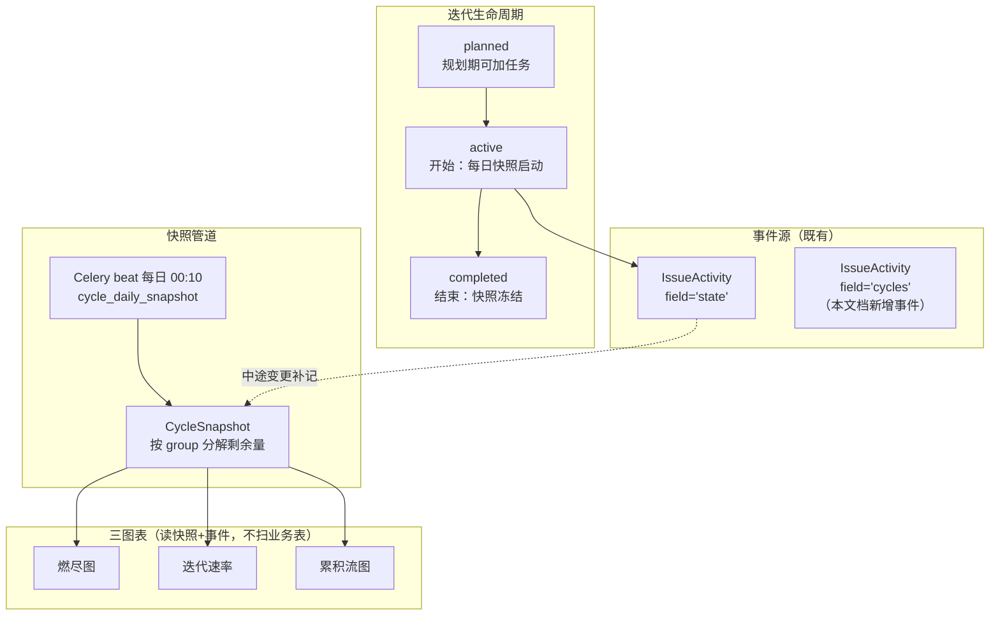
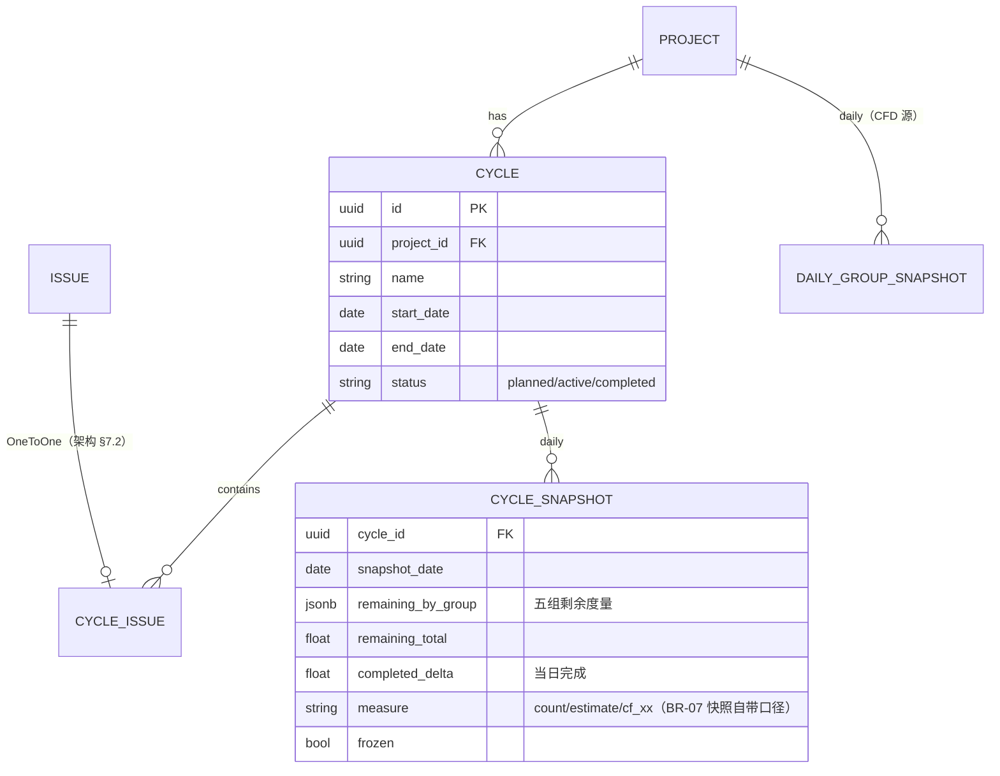

# RPT-003 燃尽图 / 迭代速率 / 累积流图

| 元信息项 | 内容 |
| --- | --- |
| 文档编号 | RPT-003 |
| 所属迭代 | Sprint 9 — 企业项目/报表/Wiki（第 12 周） |
| 模块 | M10-RPT 数据报表 |
| 优先级 | P3（企业版核心 · 企业版 V1.0 组成部分） |
| 工作量估算 | 后端 4.0 人日（Cycle 模型 1 + 快照管道 1.5 + 三图表服务 1.5）｜前端 3.5 人日（三图表 2 + 迭代管理 1 + 导出 0.5）｜测试 2.0 人日 |
| 关联架构文档 | [`unified-issue-model.md`](../architecture/unified-issue-model.md)（**§7.2 Plane Cycle 设计——CycleIssue OneToOne / scope change / 时间盒**，本文档直接落地该节）、[`api-conventions.md`](../architecture/api-conventions.md) |
| 上游依赖 | `TASK-010`（IssueActivity 事件管道——`field='state'` 与 `field='cycles'` 事件是三图表的回算数据源）；`TASK-006`（estimate_minutes 作为燃尽度量之一）；`GANTT-002`（PNG 导出管线复用） |
| 下游消费 | `RPT-004`（健康度消费速率与燃尽趋势）；P4 `RPT-005`（大屏数据源） |
| 文档状态 | 待评审（Draft） |
| 最后更新日期 | 2026-09-01 |

---

## 1. 概述

### 1.1 背景

敏捷团队的管理三问：「这个迭代能按时交付吗（燃尽）、我们团队稳定产能是多少（速率）、工作流哪里在积压（累积流）」。三张图是敏捷报表的最小完备集，也是企业版相对标准版（仅有 `RPT-001` 个人统计与 `RPT-002` 项目统计）在**过程管理**上的分水岭。

数据基础已全部就绪：`TASK-010` 的 IssueActivity 事件流记录了每一次状态变更（`field='state'`），架构文档 §7.2 预留的 Cycle 迭代模型定义了时间盒容器与 scope change 语义。本文档把二者拼成报表体系——**核心纪律：报表消费事件流与快照，不实时扫业务表**（迭代概览 §5「数据可信」约束）。

### 1.2 目标

1. **Cycle 迭代模型落地**：按架构 §7.2 建 `Cycle`（时间盒）+ `CycleIssue`（OneToOne，一任务同时只属于一个迭代）；`field='cycles'` Activity 事件记录加入/移出（scope change）。
2. **燃尽图**：迭代内每日剩余工作量曲线 vs 理想线；度量可切任务数/预估工时/故事点（自定义数字字段）。
3. **迭代速率**：近 N 个已完成迭代的完成量柱状 + 均值线，为下一迭代规划提供产能基线。
4. **累积流图（CFD）**：按 `state.group` 五组堆叠的时序面积图，积压段一眼可见。
5. **快照不可篡改**：迭代结束即落 `CycleSnapshot` 日报快照，**结束后修改历史任务不改变已归档报表**（迭代概览验收第 3 条）。

### 1.3 范围与边界

| 范围 | 本文档交付 | 明确不做（归属） |
| --- | --- | --- |
| 迭代容器 | Cycle CRUD / 开始 / 结束 / 任务加入移出 | 自动滚动迭代（未完成任务自动转入下一迭代——提供「结转」按钮，不做自动策略） |
| 燃尽 | 日粒度实际线 + 理想线 + scope change 标注 | 燃尽预测线（P4 AI `AI-001`） |
| 速率 | 完成量柱状 + 移动均值 | 按成员拆速率（RPT-004 负载域） |
| CFD | 五组堆叠时序 + 区间缩放 | 自定义状态组聚合（group 五组即冻结口径） |
| 导出 | PNG（前端渲染，复用 GANTT-002 管线）+ CSV（服务端流式） | 定时订阅推送（P4 `RPT-005`） |

### 1.4 术语表

| 术语 | 定义 |
| --- | --- |
| 时间盒（Time-box） | Cycle 的 `start_date`/`end_date` 闭区间；项目内时间不重叠（BR-03） |
| scope change | 迭代开始后加入/移出的任务变更——燃尽图台阶与 CFD 的口径修正依据 |
| 剩余量 | 迭代内未达 `completed` 组任务的度量总和（任务数/工时/点数） |
| 快照 | `CycleSnapshot`：迭代期间每日一行（剩余量按组分解），结束后只读 |

### 1.5 前置依赖

| 依赖 | 内容 | 阻塞原因 |
| --- | --- | --- |
| `unified-issue-model.md` §7.2 | Cycle/CycleIssue 模型定义、OneToOne 语义、`field='cycles'` scope change 事件 | 模型照此落地，零设计分歧 |
| `TASK-010` | IssueActivity 管道 + `idx_activity_field` 索引 | 快照回填与历史回算数据源；`field='cycles'` 事件挂点 |
| `TASK-006` | `estimate_minutes` | 工时度量燃尽 |
| `TASK-008` | 自定义数字字段 | 故事点度量（`cf_*` 数字字段可选为度量） |
| `GANTT-002` | html-to-image PNG 导出 2x 管线 | 导出复用 |

### 1.6 竞品参考

| 竞品 | 参考点 | 处置 |
| --- | --- | --- |
| Jira | Sprint Report（燃尽 + scope change 标记）、Velocity Chart、CFD | 三图语义全对齐；scope change 的「加入/移出」事件标注方式采纳 |
| Plane | Cycle + `field='cycles'` Activity + burn-down（架构 §7.2 已逆向） | 模型对齐（CycleIssue OneToOne 直接源自 Plane）；**快照不可篡改为我方强化**（Plane 实时回算，历史可被修改污染） |
| Azure DevOps | CFD 按看板列堆叠 | 我方按 `state.group` 五组（跨项目语义稳定，BR 冻结口径） |

---

## 2. 业务逻辑

### 2.1 总体数据流



### 2.2 业务规则（BR）

| 编号 | 规则 | 强制层 | 违约响应 |
| --- | --- | --- | --- |
| BR-01 | `CycleIssue.issue` OneToOne：一任务同时只属于一个迭代；加入新迭代 = 先移出旧迭代（同事务，产生两条 `cycles` Activity） | DB 唯一约束 + Service | `409 RESOURCE_ALREADY_EXISTS` |
| BR-02 | Cycle 状态机：`planned → active → completed`；`active → planned` 仅当无快照产生；`completed` 终态不可重开 | Service | `409 RESOURCE_STATE_INVALID` |
| BR-03 | 项目内 `active` 迭代至多一个；`planned` 迭代时间盒不得与 `active` 重叠 | Service + 约束 | `409 RESOURCE_STATE_INVALID` |
| BR-04 | 迭代结束（`complete`）：① 快照冻结（`CycleSnapshot.frozen=true`）② 未完成任务给出「结转到下一迭代 / 移回待规划」二选一（默认移回，不自动结转） | Service | — |
| BR-05 | 快照口径：每日 00:10（项目时区）按当时数据落上一自然日快照；**当日中途变更不改写已落快照**，仅在当天快照落定时反映 | 快照任务 | — |
| BR-06 | 已结束迭代的报表**只读快照**：历史任务的状态/归属变更不影响已归档图表（验收硬指标） | 查询层（冻结快照直查） | — |
| BR-07 | 度量三选一（项目级配置，默认任务数）：`count` / `estimate_minutes` / 指定数字自定义字段（故事点）；同一项目全部图表同度量 | 项目配置 + Serializer | `400 VALIDATION_ERROR`（字段非数字类型时） |
| BR-08 | 燃尽理想线 = 起始剩余量 → 0 的直线（按自然日，含周末——可配排除周末）；实际线 = 每日快照剩余量 | 图表服务 | — |
| BR-09 | scope change 标注：`active` 期间 `cycles` 事件的加入/移出在燃尽图上渲染 ▲/▼ 标记，并在 tooltip 列出任务 | 图表服务 | — |
| BR-10 | 速率 = `completed` 迭代各自「完成度量」（结束时 `completed` 组任务度量合计）的柱状 + 近 5 个移动均值线 | 图表服务 | — |
| BR-11 | CFD 口径：项目级（不限迭代），每日各 `state.group` 任务数（或度量）堆叠；时间轴由调用方给 `from/to`（默认近 30 天） | 图表服务 | — |
| BR-12 | CFD 数据源：`DailyGroupSnapshot`（项目级每日五组快照，与 Cycle 快照同管道落）——不逐日回放 Activity（百万事件级回放不可行，迭代概览性能约束） | 快照任务 | — |
| BR-13 | 报表权限：`report.read`（项目成员默认可读）；导出 `report.export`（COMMENTER+）；导出入审计（Sprint 8 `AUTH-010` 挂接点） | Permission | `403 PERM_DENIED` |
| BR-14 | 归档项目迭代只读；不可新建/开始迭代 | Service | `403 PERM_PROJECT_ARCHIVED` |

### 2.3 快照与回算的边界（数据可信设计）

| 场景 | 处理 |
| --- | --- |
| 迭代进行中查询燃尽 | 已落快照 + **当日实时段**（当日 Activity 增量计算，标注「进行中」虚线段） |
| 快照任务漏跑（宕机） | 补跑机制：从 `IssueActivity`（`field='state'`/`cycles'`，`idx_activity_field` 索引）回算缺日快照；回算结果与实时一致（同一口径函数） |
| 任务被删除 | 删除当日快照起不再计入；历史快照**不回改**（BR-05/06） |
| 度量配置变更 | 仅影响变更后落的快照；历史快照保留原度量（图表按快照自带度量单位渲染） |

---

## 3. UI/UX 设计

### 3.1 迭代管理页

```
┌────────────────────────────────────────────────────────────────────────┐
│ 迭代 · 电商重构项目                                 [+ 新建迭代]          │
├────────────────────────────────────────────────────────────────────────┤
│ ● Sprint 24   08-24 ~ 09-06   ▓▓▓▓▓▓▓░░░ 68%   任务 32   剩余 24.5h     │
│   [燃尽图] [看板] [结束迭代 ▸]                                           │
│ ○ Sprint 25   09-07 ~ 09-20   规划中       任务 12（规划中可随时调整）   │
│   [开始迭代]                                                            │
│ ✓ Sprint 23   08-10 ~ 08-23   已完成      完成 96.0h / 计划 104h  速率 → │
├────────────────────────────────────────────────────────────────────────┤
│ ▼ Sprint 24 燃尽图                                  度量: 预估工时 ▾     │
│  120h┤ ╲ 理想线                                                          │
│   90h┤  ╲╲                                                               │
│   60h┤   ╲___╱╲___ 实际                                                  │
│   30h┤        ▲     ▼___······ 今日(进行中)                               │
│    0h┼──┬──┬──┬──┬──┬──┬──┬──┬──┬──┬──                                  │
│      8/24 26 28 30  9/1  3   5   7   9   11  13                          │
│      ▲ 09-01 scope +3 任务（+8h）  ▼ 09-03 移出 1 任务（-4h）             │
└────────────────────────────────────────────────────────────────────────┘
```

### 3.2 迭代速率页

```
┌────────────────────────────────────────────────────────────────────────┐
│ 迭代速率 · 近 6 个已完成迭代                        度量: 预估工时 ▾      │
│  110h┤  ▄                                                                │
│   90h┤  █  ▄    ▄      ▄                                                 │
│   70h┤  █  █  ▄ █  ▄   █      ▄                                          │
│   50h┤  █  █  █ █  █   █  ▄   █                                          │
│      ┤  完成░░ 计划▓▓        ─ ─ ─ ─ 移动均值(5) 82h                      │
│      └──S19──S20──S21──S22──S23──S24(进行中,不计)──                      │
│  结论卡: 团队稳定产能 ≈ 82h/双周 · 建议 Sprint 25 计划 ≤ 82h              │
└────────────────────────────────────────────────────────────────────────┘
```

### 3.3 累积流图（CFD）

```
┌────────────────────────────────────────────────────────────────────────┐
│ 累积流 · 电商重构项目      近 30 天 ▾       [8/05 ◀━━滑杆━━▶ 9/04]      │
│   180┤██████████████████████████████ cancelled                           │
│   150┤██████████████████████████████████▒▒▒ completed（持续增厚=交付健康）│
│   120┤████████████████████░░░░░░░░░░░░░░░░░ started                      │
│    90┤██████████████░░░░░░░░░░░░░░░░░░░░░░░░░                            │
│    60┤████████░░░░░░░░░░░░░░░░░░ unstarted                               │
│    30┤████░░░░░░░░ backlog                                               │
│     0┼────────────────────────────────────────                          │
│      8/05        8/15        8/25        9/04                            │
│  ⚠ 8/20 起 started 段持续增厚（+15）——进行中积压，建议控制 WIP            │
└────────────────────────────────────────────────────────────────────────┘
```

### 3.4 交互规则

| 交互 | 行为 |
| --- | --- |
| 度量切换 | 三图统一切换（BR-07 项目级配置，改配置即重算当日之后快照口径） |
| 燃尽 tooltip | 悬停日期：剩余量 + 当日完成 + scope 事件清单（BR-09） |
| CFD 区间滑杆 | 双端滑杆缩放时间轴，最小粒度 7 天 |
| 结束迭代对话框 | 列出未完成任务（勾选）→ 二选一「结转到 Sprint 25 / 移回待规划」（BR-04） |
| 导出 | PNG（前端 html-to-image 2x，复用 GANTT-002）/ CSV（服务端流式，`report.export`） |

---

## 4. 技术架构

### 4.1 实体关系



### 4.2 模型定义

```python
class Cycle(BaseModel):
    """时间盒迭代 —— 落地架构文档 §7.2（Plane 对标）"""

    class Status(models.TextChoices):
        PLANNED = "planned", "规划中"
        ACTIVE = "active", "进行中"
        COMPLETED = "completed", "已完成"

    project = models.ForeignKey(
        Project, on_delete=models.CASCADE, related_name="cycles", verbose_name="所属项目"
    )
    name = models.CharField(max_length=64, verbose_name="迭代名称")
    start_date = models.DateField(verbose_name="开始日期")
    end_date = models.DateField(verbose_name="结束日期")
    status = models.CharField(
        max_length=16, choices=Status.choices, default=Status.PLANNED, db_index=True, verbose_name="状态"
    )

    class Meta(BaseModel.Meta):
        db_table = "cycles"
        constraints = [
            models.CheckConstraint(check=models.Q(end_date__gt=models.F("start_date")),
                                   name="chk_cycle_date_range"),
            models.UniqueConstraint(fields=["project"], condition=models.Q(status="active"),
                                    name="uniq_active_cycle_per_project"),          # BR-03
            models.UniqueConstraint(fields=["project", "name"],
                                    condition=models.Q(deleted_at__isnull=True),
                                    name="uniq_cycle_name_per_project"),
        ]
        indexes = [models.Index(fields=["project", "status"], name="idx_cycle_project_status")]


class CycleIssue(BaseModel):
    """OneToOne：一任务同时只属于一个迭代（架构 §7.2 / BR-01）"""

    issue = models.OneToOneField(Issue, on_delete=models.CASCADE,
                                 related_name="issue_cycle", verbose_name="工作项")
    cycle = models.ForeignKey(Cycle, on_delete=models.CASCADE,
                              related_name="issue_cycle", verbose_name="迭代")

    class Meta(BaseModel.Meta):
        db_table = "cycle_issues"
        indexes = [models.Index(fields=["cycle"], name="idx_cycle_issue_cycle")]


class CycleSnapshot(BaseModel):
    """迭代日快照 —— BR-05/06 不可篡改性的物理载体"""

    cycle = models.ForeignKey(Cycle, on_delete=models.CASCADE,
                              related_name="snapshots", verbose_name="迭代")
    snapshot_date = models.DateField(verbose_name="快照日期")
    measure = models.CharField(max_length=32, verbose_name="度量口径", help_text="count/estimate_minutes/cf_<uuid>")
    remaining_total = models.FloatField(verbose_name="剩余总量")
    remaining_by_group = models.JSONField(verbose_name="按组分解",
        help_text='{"backlog": 0, "unstarted": 12, "started": 8.5, "completed": 30, "cancelled": 0}')
    completed_delta = models.FloatField(default=0, verbose_name="当日完成量")
    frozen = models.BooleanField(default=False, verbose_name="是否冻结（迭代结束）")

    class Meta(BaseModel.Meta):
        db_table = "cycle_snapshots"
        constraints = [models.UniqueConstraint(fields=["cycle", "snapshot_date"],
                                               name="uniq_cycle_snapshot_day")]
        indexes = [models.Index(fields=["cycle", "snapshot_date"], name="idx_cs_cycle_day")]


class DailyGroupSnapshot(BaseModel):
    """项目级每日五组快照 —— CFD 数据源（BR-12），与 Cycle 快照同管道"""

    project = models.ForeignKey(Project, on_delete=models.CASCADE,
                                related_name="daily_group_snapshots", verbose_name="项目")
    snapshot_date = models.DateField(verbose_name="快照日期")
    measure = models.CharField(max_length=32, verbose_name="度量口径")
    counts = models.JSONField(verbose_name="五组数量/度量",
        help_text='{"backlog": 42, "unstarted": 18, "started": 9, "completed": 130, "cancelled": 6}')

    class Meta(BaseModel.Meta):
        db_table = "daily_group_snapshots"
        constraints = [models.UniqueConstraint(fields=["project", "snapshot_date", "measure"],
                                               name="uniq_dgs_project_day_measure")]
        indexes = [models.Index(fields=["project", "snapshot_date"], name="idx_dgs_project_day")]
```

### 4.3 快照管道（每日 + 补跑）

```python
@shared_task(queue="reports")
def cycle_daily_snapshot():
    """Celery beat 每日 00:10（项目时区逐个）：BR-05 落昨日快照 + 缺日补跑（§2.3）"""
    for project in Project.objects.filter(status="active", deleted_at__isnull=True):
        measure = ProjectConfig.objects.get(project=project).report_measure  # BR-07
        yesterday = timezone.localdate() - timedelta(days=1)
        # ① 项目级五组快照（CFD 源，BR-12）
        DailyGroupSnapshot.objects.update_or_create(
            project=project, snapshot_date=yesterday, measure=measure,
            defaults={"counts": compute_group_counts(project, yesterday, measure)})
        # ② active 迭代快照（含缺日补跑：自 start_date 起逐日）
        cycle = project.cycles.filter(status=Cycle.Status.ACTIVE).first()
        if cycle:
            for day in missing_days(cycle, yesterday):
                CycleSnapshot.objects.update_or_create(
                    cycle=cycle, snapshot_date=day,
                    defaults=compute_cycle_snapshot(cycle, day, measure))  # 同一口径函数，实时/回算一致


def compute_cycle_snapshot(cycle, day, measure) -> dict:
    """口径单源：当日迭代内任务按 state.group 分解剩余量。
    进行中日 = 直查当前表；历史日（补跑）= 以 IssueActivity 回放至当日 24:00 的状态
    （field='state'/'cycles' 事件，命中 idx_activity_field）。"""
    issues = issues_in_cycle_at(cycle, day)                    # cycles 事件回放
    by_group = {g: 0.0 for g in State.Group.values}
    for issue in issues:
        group = state_group_at(issue, day)                     # state 事件回放
        by_group[group] += measure_of(issue, measure)          # count=1 / estimate / cf_*
    remaining = sum(v for g, v in by_group.items()
                    if g not in (State.Group.COMPLETED, State.Group.CANCELLED))
    prev = CycleSnapshot.objects.filter(cycle=cycle, snapshot_date=day - timedelta(days=1)).first()
    return {"measure": measure, "remaining_by_group": by_group, "remaining_total": remaining,
            "completed_delta": (prev.remaining_total - remaining) if prev else 0}


@receiver(post_save, sender=Cycle)
def on_cycle_completed(sender, instance, **kwargs):
    """BR-04/06：迭代结束 → 快照冻结"""
    if instance.status == Cycle.Status.COMPLETED:
        CycleSnapshot.objects.filter(cycle=instance, frozen=False).update(frozen=True)
```

### 4.4 图表查询服务

```python
class AgileReportService:
    def burndown(self, cycle_id) -> BurndownPayload:
        cycle = get_object_or_404(Cycle, pk=cycle_id)
        snaps = list(cycle.snapshots.order_by("snapshot_date"))
        if cycle.status == Cycle.Status.ACTIVE:                 # §2.3 当日实时段
            snaps.append(self._realtime_point(cycle))
        ideal = ideal_line(cycle, snaps)                        # BR-08（可配排除周末）
        scope_events = IssueActivity.objects.filter(
            field="cycles", issue__issue_cycle__cycle=cycle,
            created_at__gte=cycle.start_date)                   # BR-09 ▲▼ 标注
        return BurndownPayload(points=snaps, ideal=ideal, scope_events=scope_events,
                               frozen=cycle.status == Cycle.Status.COMPLETED)  # BR-06

    def velocity(self, project_id, limit=6) -> VelocityPayload:
        """BR-10：completed 迭代完成度量 + 近 5 移动均值"""
        cycles = Cycle.objects.filter(project_id=project_id, status="completed") \
                              .order_by("-end_date")[:limit]
        bars = [{"cycle": c.name,
                 "completed": c.snapshots.filter(frozen=True).last().remaining_by_group["completed"]
                            if c.snapshots.exists() else 0,
                 "planned": planned_of(c)} for c in reversed(cycles)]
        return VelocityPayload(bars=bars, moving_avg=moving_average([b["completed"] for b in bars], 5))

    def cumulative_flow(self, project_id, frm, to, measure) -> CFDPayload:
        """BR-11/12：直查 DailyGroupSnapshot——百万任务项目也是 to-from 行内索引扫描"""
        rows = DailyGroupSnapshot.objects.filter(
            project_id=project_id, snapshot_date__range=(frm, to), measure=measure
        ).order_by("snapshot_date").values("snapshot_date", "counts")
        return CFDPayload(series=rows)
```

**性能核算**（迭代概览约束：百万事件级 P95 < 500ms）：三图全部直查快照表（行数 = 迭代天数/项目天数级，≤数百行），零 Activity 回放——回放仅发生在补跑任务（离线）。`velocity` 的 `snapshots.last()` 走 `idx_cs_cycle_day` 主键序，无 N+1（`prefetch_related`）。

### 4.5 API 端点

| 方法 | 路径 | 说明 | 权限 |
| --- | --- | --- | --- |
| GET/POST | `…/projects/{id}/cycles/` | 迭代列表（含进度）/ 新建 | `report.read` / `issue.update`（规划） |
| GET/PATCH/DELETE | `…/cycles/{cycle_id}/` | 详情/改（planned 可改时间盒）/删（仅 planned） | 同上 |
| POST | `…/cycles/{cycle_id}/start/` | 开始（BR-03 唯一 active 校验） | `issue.update` |
| POST | `…/cycles/{cycle_id}/complete/` | 结束 `{carry_over: "next" \| "backlog"}`（BR-04） | `issue.update` |
| PUT | `…/cycles/{cycle_id}/issues/` | 整批设置迭代任务（BR-01 换绑同事务） | `issue.update` |
| GET | `…/cycles/{cycle_id}/burndown/` | 燃尽载荷 | `report.read` |
| GET | `…/projects/{id}/reports/velocity/` | 速率载荷 | `report.read` |
| GET | `…/projects/{id}/reports/cumulative-flow/?from=&to=` | CFD 载荷 | `report.read` |
| GET | `…/cycles/{cycle_id}/burndown/export/?format=csv` | CSV 导出（PNG 前端渲染） | `report.export` |

**① `GET …/burndown/` 响应（200）**：

```json
{
  "status": 0,
  "data": {
    "cycle": { "id": "01J9XQK7M3N4P5R6S7T8V9W2E1", "name": "Sprint 24", "start_date": "2026-08-24", "end_date": "2026-09-06", "status": "active" },
    "measure": "estimate_minutes",
    "frozen": false,
    "ideal": [{ "date": "2026-08-24", "remaining": 7200 }, { "date": "2026-09-06", "remaining": 0 }],
    "points": [
      { "date": "2026-08-24", "remaining": 7200, "completed_delta": 0, "by_group": { "unstarted": 5400, "started": 1800, "completed": 0 } },
      { "date": "2026-08-25", "remaining": 6720, "completed_delta": 480, "by_group": { "unstarted": 4920, "started": 1800, "completed": 480 } }
    ],
    "today": { "date": "2026-09-01", "remaining": 4380, "provisional": true },
    "scope_events": [
      { "date": "2026-09-01", "direction": "added", "issue": "RBT-188", "delta": 480 },
      { "date": "2026-09-03", "direction": "removed", "issue": "RBT-155", "delta": -240 }
    ]
  },
  "meta": { "request_id": "01J9XQK7M3N4P5R6S7T8V9W2F2" }
}
```

**② 错误响应矩阵**：

| 场景 | HTTP | code | details |
| --- | --- | --- | --- |
| 已有 active 迭代再开始 | 409 | `RESOURCE_STATE_INVALID` | 当前 active 迭代 ID |
| completed 迭代重开/修改 | 409 | `RESOURCE_STATE_INVALID` | `status: completed` |
| 任务已在其他迭代 | 409 | `RESOURCE_ALREADY_EXISTS` | 当前迭代名（换绑走 PUT 整批） |
| 时间盒倒挂 | 400 | `VALIDATION_INVALID_DATE_RANGE` | — |
| 度量字段非数字 | 400 | `VALIDATION_ERROR` | 子码 `INVALID` |
| 归档项目操作 | 403 | `PERM_PROJECT_ARCHIVED` | — |
| 无导出权限 | 403 | `PERM_DENIED` | `report.export` |

### 4.6 前端实现

```typescript
class AgileReportStore {
  @observable burndown: BurndownPayload | null = null;
  @observable velocity: VelocityPayload | null = null;
  @observable cfd: CFDPayload | null = null;
  @observable measure: "count" | "estimate_minutes" | string = "estimate_minutes";

  async fetchBurndown(cycleId: string) {
    // SWR 60s；任务流转后由 IssueStore 事件触发 mutate
    const res = await api.get(`…/cycles/${cycleId}/burndown/`);
    runInAction(() => { this.burndown = res.data.data; });
  }

  @computed burndownSeries(): ChartSeries {
    // 实线=已落快照，虚线=provisional 当日段；▲▼ 标注 scope_events（BR-09）
    return toEChartsLine(this.burndown, { provisionalDashed: true, markPoints: "scope" });
  }
}
```

| 前端要点 | 方案 |
| --- | --- |
| 图表库 | ECharts（与 RPT-001/002 一致）；三图共享时间轴主题与色板（五组颜色承 state.group 规范） |
| CFD 滑杆 | ECharts dataZoom，最小窗口 7 天 |
| PNG 导出 | html-to-image 2x（复用 GANTT-002 管线，含图表标题/水印/导出时间） |
| 已归档报表 | `frozen: true` 时图表头部显示「已归档快照」徽标，不做任何实时 mutate |

---

## 5. 测试用例

### 5.1 单元测试（UT）

| 编号 | 用例 | 断言 |
| --- | --- | --- |
| UT-01 | Cycle 状态机全路径（planned→active→completed；active→planned 有快照拒绝） | 409/200 正确 |
| UT-02 | 时间盒约束（end≤start、active 重叠） | 400/409 + DB CHECK 兜底 |
| UT-03 | CycleIssue OneToOne 换绑同事务 | 旧绑解除 + 两条 `cycles` Activity |
| UT-04 | `compute_cycle_snapshot` 三度量口径（count/estimate/cf_*） | 与手工核算一致 |
| UT-05 | 历史日回放：状态在当日 24:00 的取值（Activity 回放边界） | 跨日变更归正确日期 |
| UT-06 | cancelled 不计剩余；backlog 组任务不计入迭代（未加入） | 口径正确 |
| UT-07 | 理想线含/排除周末两配置 | 斜率正确 |
| UT-08 | scope change 事件标注方向与 delta | added/removed 正确 |
| UT-09 | 速率移动均值窗口 5 | 序列正确 |
| UT-10 | 快照补跑幂等：`update_or_create` 重复跑结果一致 | 无重复行 |
| UT-11 | 迭代完成 → `frozen=true`；后续任务变更不改冻结行 | BR-06 硬指标 |
| UT-12 | CFD 区间缺日（项目停用期） | 前端插值点空值语义正确 |

### 5.2 集成测试（IT）

| 编号 | 用例 | 断言 |
| --- | --- | --- |
| IT-01 | 全链路：建迭代→加任务→开始→每日快照→结束→燃尽/速率/CFD 三载荷 | 与手工核算逐点一致（迭代概览验收第 3 条前半） |
| IT-02 | 快照不可篡改：迭代结束后修改历史任务状态/删除任务 → 归档燃尽逐点不变 | **验收硬指标** |
| IT-03 | 宕机补跑：删除昨日快照 → 补跑任务 → 与实时计算一致（同一口径函数） | 差值为 0 |
| IT-04 | 中途加入/移出任务 → 当日 scope 事件 + 燃尽台阶 | ▲▼ 数据正确 |
| IT-05 | 结转：结束时未完成任务转下一迭代（OneToOne 换绑 + Activity） | 新迭代任务集正确 |
| IT-06 | 大数据量：10 万任务项目 CFD 30 天查询 | P95 < 500ms（快照直查，EXPLAIN 佐证） |

### 5.3 E2E

| 编号 | 场景 |
| --- | --- |
| E2E-01 | 完整 Sprint：规划→开始→每日拖拽完成任务→燃尽实际线贴合理想线→结束→速率柱出现 |
| E2E-02 | 中途 scope change：加入 3 任务 → 燃尽 ▲ 标注 + tooltip 清单 |
| E2E-03 | CFD：连续 5 天 started 段增厚 → 积压提示渲染 |
| E2E-04 | 导出：燃尽 PNG（2x 含水印）与 CSV 数值一致；已归档图带快照徽标 |

---

## 6. 竞品深度对标

| 维度 | Jira | Plane | Azure DevOps | **本方案** |
| --- | --- | --- | --- | --- |
| 迭代容器 | Sprint（板级，一任务可隐式跨板） | Cycle（CycleIssue OneToOne） | Iteration Path（树形） | Cycle OneToOne（架构 §7.2 落地）+ 项目级唯一 active |
| 燃尽口径 | 实时回算（历史可被修改污染，社区长期抱怨「Sprint Report 变了」） | 实时回算 | 快照 | **日快照 + 结束冻结**——「报表即档案」，验收硬指标 BR-06 |
| scope change | Sprint Report 标注 | `field='cycles'` 事件 | 支持 | Activity 事件 + 图表 ▲▼ 标注（BR-09） |
| CFD 堆叠维度 | 看板列（列可改 → 历史口径漂移） | state.group | 看板列 | **state.group 五组冻结口径**——改状态名/看板列不漂移 |
| 速率 | Velocity Chart | 无 | Velocity | 完成度量 + 近 5 移动均值 + 规划建议卡 |

---

## 7. 里程碑与验收

### 7.1 交付清单

| 类别 | 交付物 |
| --- | --- |
| Model / Migration | `cycles` / `cycle_issues` / `cycle_snapshots` / `daily_group_snapshots` 四表 + 6 约束 + 4 索引 |
| 后端 | Cycle 生命周期服务、`cycle_daily_snapshot` beat（含补跑）、口径单源 `compute_cycle_snapshot`、三图表服务、9 组端点、`field='cycles'` Activity 事件挂接 |
| 前端 | 迭代管理页、燃尽/速率/CFD 三图（ECharts）、结束迭代对话框、PNG/CSV 导出 |
| 测试 | UT-01~12、IT-01~06、E2E-01~04 |

### 7.2 可操作演示的验收标准

1. 含 3 个迭代的项目：燃尽/速率/累积流与手工核算一致（迭代概览验收第 3 条）。
2. **快照不可篡改演示**：迭代结束后修改历史任务状态与删除任务，归档燃尽逐点不变（IT-02）。
3. scope change 演示：中途加入/移出任务，燃尽 ▲▼ 标注与 tooltip 清单正确。
4. 补跑演示：人为删除一日快照后补跑，与实时口径零差异。
5. 性能：10 万任务项目 CFD 30 天 P95 < 500ms；燃尽 P95 < 200ms（快照直查）。
6. 导出：PNG/CSV 与图表数据一致；无 `report.export` 权限 403。
7. 全部端点通过 `api-conventions.md` §14 检查清单。

---

## 8. 相关文档

- 迭代概览：[`docs/sprint-9-enterprise-portfolio/sprint-overview.md`](sprint-overview.md)
- Cycle 设计原型：[`docs/architecture/unified-issue-model.md`](../architecture/unified-issue-model.md) §7.2
- 事件管道：[`docs/sprint-2-task-full/TASK-010-full-audit-log.md`](../sprint-2-task-full/TASK-010-full-audit-log.md)
- 工时度量：[`docs/sprint-2-task-full/TASK-006-worklog.md`](../sprint-2-task-full/TASK-006-worklog.md)
- 健康度消费：[`docs/sprint-9-enterprise-portfolio/RPT-004-project-health.md`](RPT-004-project-health.md)
- 导出管线：[`docs/sprint-4-gantt-file/GANTT-002-delay-export.md`](../sprint-4-gantt-file/GANTT-002-delay-export.md)


