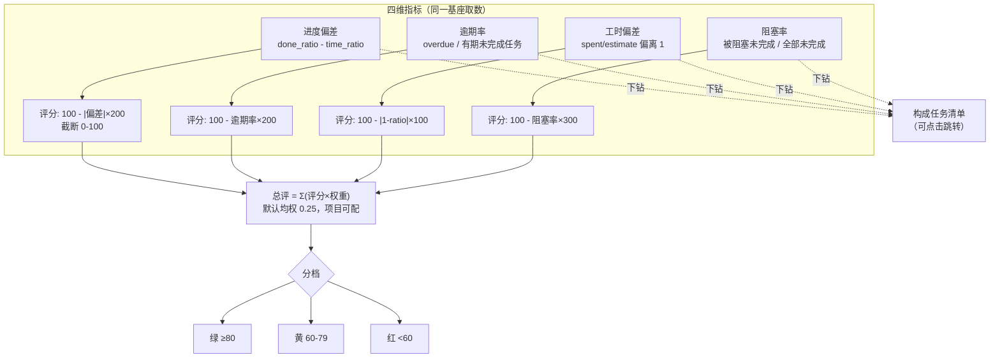
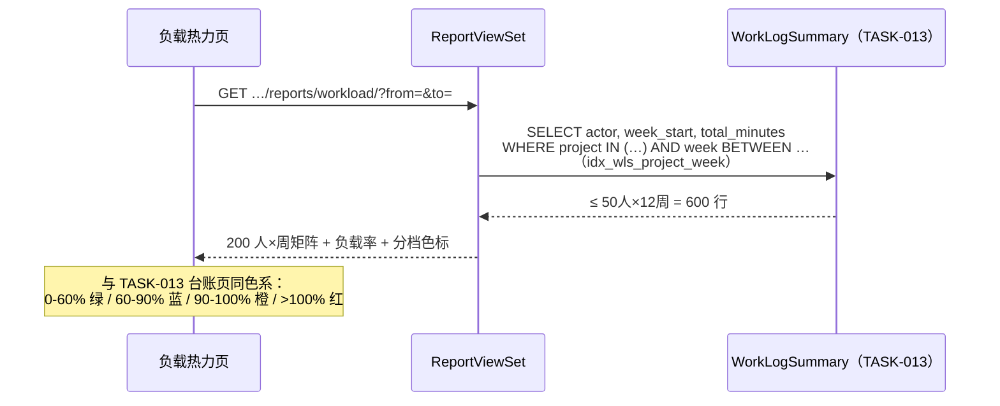
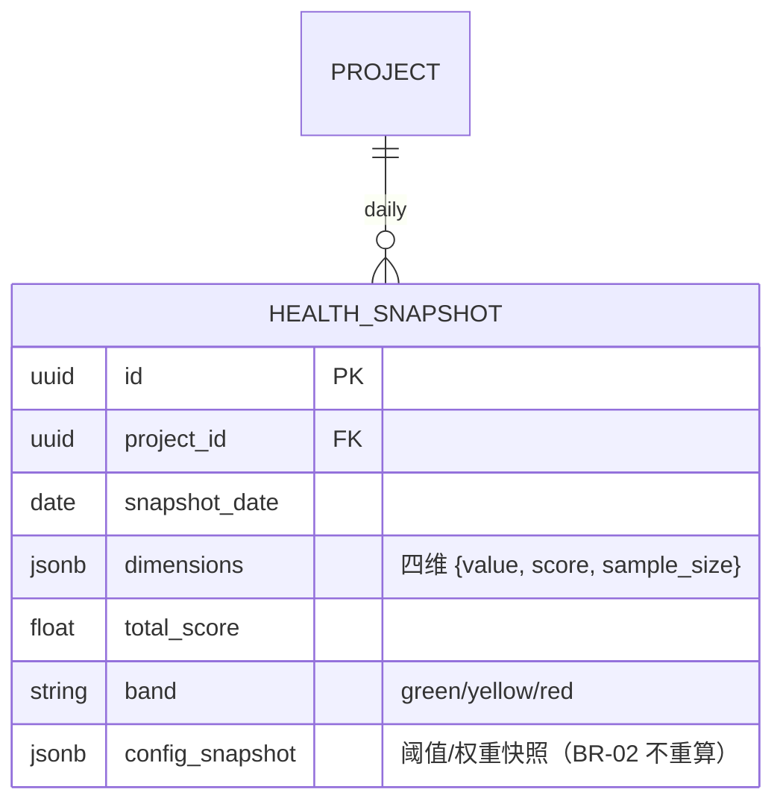

# RPT-004 项目健康度 / 团队负载 / 报表导出

| 元信息项 | 内容 |
| --- | --- |
| 文档编号 | RPT-004 |
| 所属迭代 | Sprint 9 — 企业项目/报表/Wiki（第 12 周） |
| 模块 | M10-RPT 数据报表 |
| 优先级 | P3（企业版核心 · 企业版 V1.0 组成部分） |
| 工作量估算 | 后端 3.0 人日（评分卡聚合 1.5 + 负载 0.5 + 导出 1）｜前端 3.0 人日（评分卡 1.5 + 热力图 1 + 下钻 0.5）｜测试 1.5 人日 |
| 关联架构文档 | [`api-conventions.md`](../architecture/api-conventions.md)、[`rbac-permission-model.md`](../architecture/rbac-permission-model.md)（`report.read/export`） |
| 上游依赖 | `RPT-002`（项目统计口径基座 `issue_stats_base()`）；`RPT-003`（速率/燃尽趋势）；`TASK-013`（`WorkLogSummary` 负载快照——**同源复用，不另建聚合**）；`TASK-005`（阻塞统计）；`WF-002`（审批滞留可计入阻塞维度，可选信号） |
| 下游消费 | P4 `RPT-005`（大屏数据源）；`PROJ-004`（项目集健康度聚合复用评分卡函数） |
| 文档状态 | 待评审（Draft） |
| 最后更新日期 | 2026-09-01 |

---

## 1. 概述

### 1.1 背景

`RPT-002`（项目统计）回答「现在是什么状态」，`RPT-003`（敏捷报表）回答「迭代跑得怎么样」，RPT-004 回答管理层更直接的问题：**「这个项目健康吗？谁过载了？」**

两块能力：

1. **项目健康度评分卡**：进度偏差、逾期率、工时偏差、阻塞率四个维度，各 0-100 分加权合成总评，红黄绿三档——每个维度可**下钻**到构成它的任务清单（评分不是黑盒，必须可解释）。
2. **团队负载热力图**：人 × 周的负载率矩阵（数据源直接复用 `TASK-013` 台账快照），过载/闲置一眼可见，与台账页同色系规范。

### 1.2 目标

- 四维评分卡：每维 = 指标值 + 评分函数 + 阈值可配 + 下钻清单；总评 = 加权（权重项目级可配，默认均权）。
- 负载热力：人 × 周矩阵（负载率 = 周工时/40h），支持按项目/项目集（`PROJ-004`）两级查看。
- 导出：评分卡 + 热力图 PNG（前端渲染）与明细 CSV（服务端流式），导出入审计。

### 1.3 范围与边界

| 范围 | 本文档交付 | 明确不做（归属） |
| --- | --- | --- |
| 健康度 | 四维评分卡 + 下钻 + 阈值/权重配置 | 跨组织经营分析（P4）、AI 风险预测（P4 `AI-001`） |
| 负载 | 人×周热力（复用 WorkLogSummary） | 容量规划/资源调度（P4） |
| 导出 | PNG/CSV | 定时推送订阅（P4 `RPT-005`） |
| 项目集级 | 评分卡函数被 `PROJ-004` 复用（聚合多项目） | 项目集专属页面（`PROJ-004` 面板已含） |

### 1.4 术语表

| 术语 | 定义 |
| --- | --- |
| 进度偏差 | 实际完成比例 vs 时间进度比例的差值（`done_ratio - time_elapsed_ratio`） |
| 逾期率 | 逾期未完成任务 / 有截止日期的未完成任务 |
| 工时偏差 | `spent / estimate`（仅统计有预估的任务）与 1 的偏离度 |
| 阻塞率 | 被 blocks 链阻塞（前置未完成）的未完成任务 / 全部未完成任务 |
| 负载率 | 周工时（分钟）/ 2400（40h 标准周，项目可配） |

### 1.5 前置依赖

| 依赖 | 内容 | 阻塞原因 |
| --- | --- | --- |
| `RPT-002` | `issue_stats_base()` 口径单源（状态组聚合） | 进度/逾期维度复用同一基座，口径不漂移 |
| `RPT-003` | 速率移动均值、燃尽趋势 | 评分卡趋势箭头数据源 |
| `TASK-013` | `WorkLogSummary`（`total_minutes`、`idx_wls_project_week`） | 负载热力唯一数据源 |
| `TASK-005` | `blocks` 边与未完成判定 | 阻塞率维度 |
| `GANTT-002` | PNG 导出管线 | 复用 |

### 1.6 竞品参考

| 竞品 | 参考点 | 处置 |
| --- | --- | --- |
| Jira (Advanced Roadmaps) | 进度偏差 + 容量视图 | 偏差语义对齐；容量简化为负载率（容量规划留 P4） |
| Ones | 项目健康度（进度/质量/资源多维度评分）+ 团队负载 | 四维评分卡 + 热力矩阵交互对齐；**下钻可解释性为我方强化项** |
| Plane | 无健康度/负载报表（2026-09） | 差异化能力 |

---

## 2. 业务逻辑

### 2.1 评分卡结构



### 2.2 业务规则（BR）

| 编号 | 规则 | 强制层 | 违约响应 |
| --- | --- | --- | --- |
| BR-01 | 四维指标口径如上表（冻结公式）；取数复用 `RPT-002` 基座与 `TASK-005/013`，**禁止新建独立统计 SQL** | 聚合服务 | — |
| BR-02 | 评分函数线性截断（公式见 §2.1 图）；阈值/权重项目级可配（`report.configure` = PROJ_ADMIN+），配置变更仅影响之后计算（历史评分快照不重算） | 项目配置 | `400 VALIDATION_ERROR`（权重和 ≠1） |
| BR-03 | 评分按日快照（`HealthSnapshot`，每日 00:20 项目时区落上一日）；趋势箭头 = 当日 vs 7 日前 | 快照任务 | — |
| BR-04 | 每维下钻清单 = 构成该指标的任务（如逾期清单、被阻塞清单），游标分页 ≤100/页，与指标**同一事务时点**取数（防口径分裂） | 聚合服务 | — |
| BR-05 | 工时偏差仅统计 `estimate_minutes > 0` 的任务；样本 <3 时该维度显示「样本不足」不参与总评（权重按比例重归一） | 聚合服务 | — |
| BR-06 | 负载率 = `total_minutes / (40×60×workday_ratio)`；标准周 40h 项目可配 30-60h | 项目配置 | `400 VALIDATION_ERROR` |
| BR-07 | 负载热力数据源 = `WorkLogSummary`（TASK-013），人×周矩阵；项目集级 = 项目集合过滤（`PROJ-004` `descendant_projects` 复用） | 聚合服务 | — |
| BR-08 | 负载可见性：成员见自己；`report.read` 见项目全员（BR 与 TASK-013 BR-14 台账权限对齐）；项目集级需 WS 成员 + 项目集可见 | Permission | `403 PERM_DENIED` |
| BR-09 | 导出：PNG 前端渲染（复用 GANTT-002 管线）；CSV 服务端流式（明细清单）；`report.export` 权限 + 审计挂接（`AUTH-010`） | Permission | `403 PERM_DENIED` |
| BR-10 | 项目无任务 / 无截止日期任务等空样本：总评显示「数据不足」而非 0 分（0 分=红是误判） | 聚合服务 | — |
| BR-11 | 阻塞率口径含跨项目边（`PROJ-004` BR-07 软策略不改变统计——**拦截软、统计硬**，外部阻塞也是风险） | 聚合服务 | — |

### 2.3 负载热力时序



---

## 3. UI/UX 设计

### 3.1 项目健康度评分卡

```
┌──────────────────────────────────────────────────────────────────────────┐
│ 项目健康度 · 电商重构项目              2026-09-01 快照    [配置阈值] [导出]│
│ ┌────────────────────────────────────────────────────────────────────┐  │
│ │          总评  72  🟡 持平（vs 7 日前 74）                           │  │
│ │      ┌──────────────────────────────────────────┐                  │  │
│ │      │        ▓▓▓▓▓▓▓▓▓▓▓▓▓▓░░░░░░ 72/100       │                  │  │
│ │      └──────────────────────────────────────────┘                  │  │
│ └────────────────────────────────────────────────────────────────────┘  │
│ ┌─ 进度偏差 ────────┐ ┌─ 逾期率 ──────────┐ ┌─ 工时偏差 ────────┐ ┌─ 阻塞率 ───┐│
│ │  62  🟡 ↓         │ │  78  🟡 ↑         │ │  85  🟢 →         │ │  70 🟡 ↓   ││
│ │ 完成 48% vs       │ │ 逾期 11/50 (22%)  │ │ spent/est = 1.15  │ │ 8/38 (21%) ││
│ │ 时间进度 55%      │ │ 阈值 ≤10%         │ │ 阈值 0.8~1.2      │ │ 阈值 ≤5%   ││
│ │ [下钻 12 任务 ▸]  │ │ [下钻 11 任务 ▸]  │ │ [下钻 9 任务 ▸]   │ │ [下钻 8 ▸] ││
│ └──────────────────┘ └──────────────────┘ └──────────────────┘ └───────────┘│
│ 近 30 天总评趋势: 68→70→75→72→71→72▁▂▃▅▃▂▃                                   │
└──────────────────────────────────────────────────────────────────────────┘
```

### 3.2 维度下钻抽屉

```
┌──────────────────────────────────────────────────────────┐
│ ✕ 逾期率 · 构成任务（11）              2026-09-01 时点     │
│ ──────────────────────────────────────────────────────── │
│ 任务         标题              截止      逾期   负责人     │
│ RBT-141     网关验收          08-29     3 天   李骁       │
│ RBT-150     压力测试报告      08-30     2 天   王思远     │
│ RBT-152     限流配置文档      08-31     1 天   陈默       │
│ …（游标分页，点击跳转任务详情）                            │
└──────────────────────────────────────────────────────────┘
```

### 3.3 团队负载热力图

```
┌────────────────────────────────────────────────────────────────────────┐
│ 团队负载 · 电商重构项目      [项目▾]  近 8 周            [导出 CSV]      │
├────────────────────────────────────────────────────────────────────────┤
│           W29   W30   W31   W32   W33   W34   W35   W36                  │
│ 李骁      🟦75%  🟦80%  🟧92%  🟥108% 🟥105%  🟧95%  🟦88%  🟦75%      │
│ 王思远    🟦65%  🟦70%  🟦72%  🟧91%  🟥102%  🟥106%  🟧98%  🟦66%      │
│ 陈默      🟩55%  🟩58%  🟦62%  🟦70%  🟦75%  🟦80%  🟦82%  🟩55%        │
│ ────────────────────────────────────────────────────────────────────  │
│ 🟩<60%  🟦60-90%  🟧90-100%  🟥>100%   悬停: 周工时明细（跳 TASK-013 台账）│
│ ⚠ 李骁/王思远 连续 3 周 >90%——建议调整 Sprint 25 任务分配                │
└────────────────────────────────────────────────────────────────────────┘
```

---

## 4. 技术架构

### 4.1 实体关系与快照



```python
class HealthSnapshot(BaseModel):
    """健康度日快照 —— BR-03 趋势数据源；config 快照保证历史不重算"""

    project = models.ForeignKey(Project, on_delete=models.CASCADE,
                                related_name="health_snapshots", verbose_name="项目")
    snapshot_date = models.DateField(verbose_name="快照日期")
    dimensions = models.JSONField(verbose_name="四维明细",
        help_text='{"progress": {"value": -0.07, "score": 62, "n": 128}, "overdue": {...}, ...}')
    total_score = models.FloatField(verbose_name="总评")
    band = models.CharField(max_length=8, verbose_name="分档", help_text="green/yellow/red")
    config_snapshot = models.JSONField(verbose_name="阈值权重快照")

    class Meta(BaseModel.Meta):
        db_table = "health_snapshots"
        constraints = [models.UniqueConstraint(fields=["project", "snapshot_date"],
                                               name="uniq_health_snapshot_day")]
        indexes = [models.Index(fields=["project", "snapshot_date"], name="idx_hs_project_day")]
```

### 4.2 评分聚合服务

```python
class HealthReportService:
    def compute(self, project, day, cfg) -> HealthSnapshot:
        """BR-01：四维全部复用既有基座取数——零独立统计 SQL"""
        base = issue_stats_base(project)                       # RPT-002 口径单源
        time_ratio = elapsed_ratio(project, day)               # 项目起止日或迭代时间盒
        dims = {
            "progress": self._dim(value=base.done_ratio - time_ratio,
                                  score=clamp(100 - abs(base.done_ratio - time_ratio) * 200),
                                  n=base.total_active,
                                  drill=issues_behind_schedule(project, day)),
            "overdue":  self._dim(value=base.overdue_ratio,
                                  score=clamp(100 - base.overdue_ratio * 200),
                                  n=base.due_open,
                                  drill=base.overdue_issues),          # 下钻清单（BR-04 同时点）
            "effort":   self._effort_dim(project),                     # BR-05 样本 <3 → None
            "blocked":  self._blocked_dim(project),                    # BR-11 含跨项目边
        }
        weights = renormalize(cfg.weights, dims)               # 样本不足维度剔除后重归一（BR-05）
        total = sum(d["score"] * weights[k] for k, d in dims.items() if d) or None
        return HealthSnapshot(project=project, snapshot_date=day, dimensions=dims,
                              total_score=total, band=band_of(total, cfg),   # BR-10 None → 数据不足
                              config_snapshot=cfg.as_dict())

    def _blocked_dim(self, project):
        """被 blocks 阻塞的未完成任务（含跨项目边，BR-11）——TASK-005 BLOCKER_SQL 的统计变体"""
        blocked = Issue.objects.filter(
            project=project, deleted_at__isnull=True,
        ).exclude(state__group__in=["completed", "cancelled"]).filter(
            links_out__link_type="blocks",
            links_out__related_issue__state__group__in=["backlog", "unstarted", "started"])
        open_qs = Issue.objects.filter(project=project, deleted_at__isnull=True) \
                               .exclude(state__group__in=["completed", "cancelled"])
        ratio = blocked.count() / (open_qs.count() or 1)
        return self._dim(value=ratio, score=clamp(100 - ratio * 300),
                         n=open_qs.count(), drill=blocked)

    def workload(self, projects, frm, to, cfg) -> WorkloadMatrix:
        """BR-07：直查 WorkLogSummary（TASK-013 同源），项目集级传项目集合"""
        rows = (WorkLogSummary.objects
                .filter(project_id__in=projects, week_start__range=(frm, to))
                .values("actor_id", "actor__display_name", "week_start")
                .annotate(minutes=Sum("total_minutes")))
        return WorkloadMatrix(rows=rows, capacity=cfg.weekly_capacity_minutes)  # BR-06


@shared_task(queue="reports")
def health_daily_snapshot():
    """Celery beat 每日 00:20：活跃项目落昨日快照（BR-03）"""
    for project in Project.objects.filter(status="active", deleted_at__isnull=True):
        cfg = HealthConfig.of(project)
        HealthSnapshot.objects.update_or_create(
            project=project, snapshot_date=timezone.localdate() - timedelta(days=1),
            defaults=HealthReportService().compute(project, ..., cfg).as_defaults())
```

### 4.3 API 端点

| 方法 | 路径 | 说明 | 权限 |
| --- | --- | --- | --- |
| GET | `…/projects/{id}/reports/health/` | 当前评分卡（最新快照 + 7 日趋势） | `report.read` |
| GET | `…/reports/health/drilldown/?dimension=&cursor=` | 维度下钻清单（BR-04） | `report.read` |
| GET | `…/reports/health/trend/?days=30` | 总评趋势序列 | `report.read` |
| GET/PATCH | `…/projects/{id}/reports/health/config/` | 阈值/权重/标准周配置（BR-02/06） | `report.configure` |
| GET | `…/projects/{id}/reports/workload/?from=&to=` | 负载热力矩阵 | BR-08 |
| GET | `…/reports/workload/export/?format=csv` | 负载 CSV 导出 | `report.export` |

**① `GET …/reports/health/` 响应（200）**：

```json
{
  "status": 0,
  "data": {
    "snapshot_date": "2026-08-31",
    "total_score": 72.4,
    "band": "yellow",
    "trend_7d": -1.6,
    "dimensions": {
      "progress": { "value": -0.07, "score": 62, "n": 128, "drilldown_count": 12 },
      "overdue":  { "value": 0.22,  "score": 56, "n": 50,  "drilldown_count": 11 },
      "effort":   { "value": 1.15,  "score": 85, "n": 34,  "drilldown_count": 9 },
      "blocked":  { "value": 0.21,  "score": 70, "n": 38,  "drilldown_count": 8 }
    },
    "weights": { "progress": 0.25, "overdue": 0.25, "effort": 0.25, "blocked": 0.25 }
  },
  "meta": { "request_id": "01J9XQK7M3N4P5R6S7T8V9W3G1" }
}
```

**② 错误响应矩阵**：

| 场景 | HTTP | code | details |
| --- | --- | --- | --- |
| 权重和 ≠1 | 400 | `VALIDATION_ERROR` | 子码 `INVALID` + 当前和 |
| 维度非法（drilldown） | 400 | `VALIDATION_INVALID_PARAM` | 合法枚举 |
| 无 `report.export` 导出 | 403 | `PERM_DENIED` | — |
| 成员查他人负载明细 | 403 | `PERM_DENIED` | BR-08 |
| 数据不足（新项目） | 200 | — | `total_score: null, band: "insufficient"`（BR-10） |

### 4.4 前端实现

```typescript
class HealthReportStore {
  @observable health: HealthPayload | null = null;
  @observable workload: WorkloadMatrix | null = null;

  async fetchHealth(projectId: string) {
    const res = await api.get(`…/projects/${projectId}/reports/health/`);
    runInAction(() => { this.health = res.data.data; });
  }

  bandColor(band: string) {                              // 评分卡与热力图统一色板
    return { green: "#10B981", yellow: "#F59E0B", red: "#EF4444",
             insufficient: "#9CA3AF" }[band];
  }
  loadBand(rate: number) {                               // 与 TASK-013 台账同色系（BR 对齐）
    return rate < 0.6 ? "green" : rate < 0.9 ? "blue" : rate <= 1.0 ? "orange" : "red";
  }
}
```

| 前端要点 | 方案 |
| --- | --- |
| 评分卡 | 四维卡片 + 总评仪表；下钻抽屉游标分页（复用列表组件） |
| 热力图 | ECharts heatmap；悬停 cell 显示周工时 + 跳台账锚点 |
| 导出 | PNG html-to-image 2x（GANTT-002 管线）；CSV 走服务端流式 |
| 数据不足 | 「数据不足」空态卡（BR-10），不显示 0 分红 |

---

## 5. 测试用例

### 5.1 单元测试（UT）

| 编号 | 用例 | 断言 |
| --- | --- | --- |
| UT-01 | 四维评分函数边界（0/50/100 分、超界截断） | 线性截断正确 |
| UT-02 | 工时偏差样本 <3 → 维度 None 且权重重归一 | BR-05 |
| UT-03 | 空项目 → `band: insufficient` | BR-10 |
| UT-04 | 阻塞率含跨项目边 | BR-11 统计口径 |
| UT-05 | 趋势箭头 = 当日 vs 7 日前 | 差值正确 |
| UT-06 | 权重和校验（≠1 拒绝） | 400 |
| UT-07 | 配置变更不影响历史快照（config_snapshot 隔离） | BR-02 |
| UT-08 | 负载率计算与容量可配（30/40/60h） | 除数正确 |
| UT-09 | 下钻清单与指标同一时点（并发变更不裂口径） | 事务隔离验证 |
| UT-10 | 负载权限：成员仅自己 / report.read 全员 | 403/200 |

### 5.2 集成测试（IT）

| 编号 | 用例 | 断言 |
| --- | --- | --- |
| IT-01 | 构造已知数据集：四维值与评分与手工核算一致 | 逐维相等 |
| IT-02 | 下钻清单与维度计数一致（drilldown_count = 清单总数） | 对账 |
| IT-03 | 负载热力与 `TASK-013` 台账 API 逐 cell 一致 | **同源验证（迭代概览验收第 4 条）** |
| IT-04 | 快照每日落行 + 趋势序列连续 | beat 幂等 |
| IT-05 | 导出 CSV 与矩阵一致；导出入审计挂接点 | 内容对账 + mock 断言 |

### 5.3 E2E

| 编号 | 场景 |
| --- | --- |
| E2E-01 | 评分卡渲染（四维+总评+趋势）→ 下钻逾期清单 → 跳任务详情 |
| E2E-02 | 阈值配置改为 5% → 次日快照逾期维度分档变化，历史快照不变 |
| E2E-03 | 负载热力：连续 3 周 >90% 成员出现提示条；悬停跳台账 |
| E2E-04 | PNG/CSV 导出与页面数据一致 |

---

## 6. 竞品深度对标

| 维度 | Jira Advanced Roadmaps | Ones | Plane | **本方案** |
| --- | --- | --- | --- | --- |
| 健康度模型 | 无总评（分散指标） | 多维评分 | 无 | 四维加权总评 + 红黄绿分档 + 日快照趋势 |
| 可解释性 | 指标→任务链接 | 部分下钻 | — | **每维强制下钻清单且同时点取数**（BR-04，评分永不黑盒） |
| 负载数据源 | 容量模块（独立配置容量） | 工时统计 | — | 复用工时台账快照（零容量配置负担，BR-07） |
| 空样本处理 | 显示 0/NaN | 显示 0 | — | 「数据不足」独立分档（BR-10 防误判） |
| 配置治理 | 全局阈值 | 项目可配 | — | 项目级阈值/权重 + 配置快照隔离历史（BR-02） |

---

## 7. 里程碑与验收

### 7.1 交付清单

| 类别 | 交付物 |
| --- | --- |
| Model / Migration | `health_snapshots` 表 + 1 唯一约束 + 1 索引 |
| 后端 | `HealthReportService`（四维聚合复用基座）、`health_daily_snapshot` beat、负载矩阵服务（复用 WorkLogSummary）、6 组端点 |
| 前端 | 评分卡（总评仪表+四维卡+下钻抽屉）、负载热力图、配置面板、PNG/CSV 导出 |
| 测试 | UT-01~10、IT-01~05、E2E-01~04 |

### 7.2 可操作演示的验收标准

1. 健康度四维评分卡可下钻（迭代概览验收第 4 条前半）：点击维度 → 构成任务清单 → 跳任务详情。
2. 团队负载热力图按人×周正确，与 `TASK-013` 台账逐 cell 一致（同源验证）。
3. 导出：PNG/CSV 可用且数据与页面一致（迭代概览验收第 4 条后半）。
4. 样本边界演示：工时偏差样本 <3 显示「样本不足」且总评权重重归一；新项目显示「数据不足」而非 0 分红。
5. 配置治理：权重和 ≠1 拒绝；阈值修改不影响历史快照。
6. 阻塞率含跨项目边演示（`PROJ-004` 联动）。
7. 全部端点通过 `api-conventions.md` §14 检查清单。

---

## 8. 相关文档

- 迭代概览：[`docs/sprint-9-enterprise-portfolio/sprint-overview.md`](sprint-overview.md)
- 统计基座：[`docs/sprint-5-integration-standard/RPT-002-project-stats.md`](../sprint-5-integration-standard/RPT-002-project-stats.md)
- 敏捷报表：[`docs/sprint-9-enterprise-portfolio/RPT-003-agile-reports.md`](RPT-003-agile-reports.md)
- 负载同源：[`docs/sprint-7-enterprise-workflow/TASK-013-team-worklog.md`](../sprint-7-enterprise-workflow/TASK-013-team-worklog.md)
- 项目集聚合：[`docs/sprint-9-enterprise-portfolio/PROJ-004-portfolio.md`](PROJ-004-portfolio.md)


