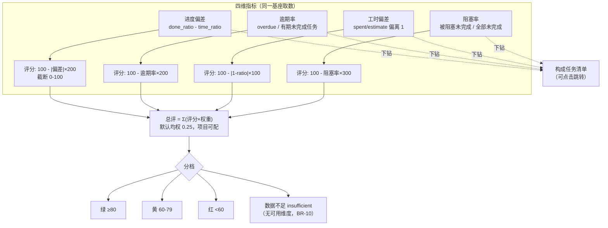
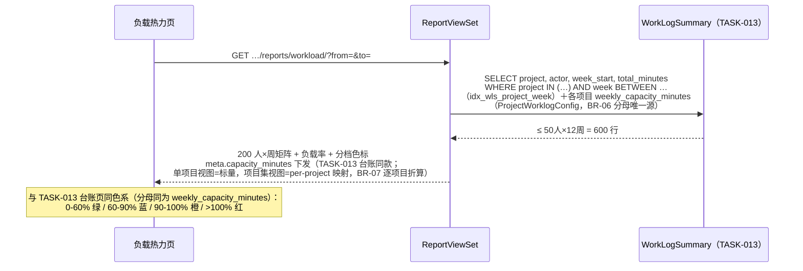
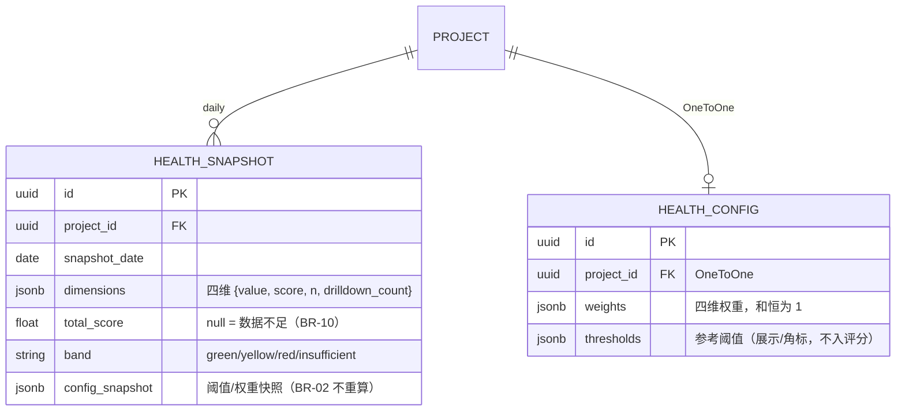

# 项目健康度 / 团队负载 / 报表导出

| 元信息项 | 内容 |
| --- | --- |
| 文档编号 | RPT-004 |
| 所属迭代 | Sprint 9 — 企业项目/报表/Wiki（第 12 周） |
| 模块 | M10-RPT 数据报表 |
| 优先级 | P3（企业版核心 · 企业版 V1.0 组成部分） |
| 工作量估算 | 后端 3.0 人日（评分卡聚合 1.5 + 负载 0.5 + 导出 1）｜前端 3.0 人日（评分卡 1.5 + 热力图 1 + 下钻 0.5）｜测试 1.5 人日 |
| 关联架构文档 | [`api-conventions.md`](../architecture/api-conventions.md)、[`rbac-permission-model.md`](../architecture/rbac-permission-model.md)（`report.read` / `report.export` / `project.setting.manage`——均为 §8 既有注册码） |
| 上游依赖 | `RPT-002`（项目统计口径基座 `issue_stats_base()`）；`RPT-003`（速率/燃尽趋势；**Cycle 时间盒**——进度维度时间锚）；`TASK-013`（`WorkLogSummary` 负载快照——**同源复用，不另建聚合**；`ProjectWorklogConfig.weekly_capacity_minutes` 负载分母唯一配置源；可见性按其 BR-14「报表读/台账管理面分码分工」对齐）；`TASK-005`（阻塞统计）；`WF-002`（审批滞留可计入阻塞维度，可选信号） |
| 下游消费 | P4 `RPT-005`（大屏数据源）；`PROJ-004`（项目集健康度聚合复用评分卡函数） |
| 文档状态 | 已实现（Sprint-9，2026-09-10；偏差登记 ADR-0031） |
| 最后更新日期 | 2026-09-05（R2 修复：信封 status 字符串化 + request_id 移出 meta、配置权限码改 `project.setting.manage`、负载分母单源对齐 TASK-013、示例数值按冻结公式全量重算、`_blocked_dim` ORM 方向修正、HealthConfig 模型补全、band 扩容 insufficient、下钻时点锚定声明。R2 复评 PASS 后随手收口：drilldown/trend/workload-export 三端点补 `projects/{id}/` 项目作用域 + export 窗口必填、BR-08 可见性语序消歧（持码=全员/未持码=仅自己）、compute() 同事务取数落为显式 transaction.atomic 要求、SQL #2 补归档过滤与 RPT-002 下沉待回改登记、capacity_minutes 单项目/项目集双形态声明、as_of 字面量与 RPT-002 时间戳区分） |

---

## 1. 概述

### 1.1 背景

`RPT-002`（项目统计）回答「现在是什么状态」，`RPT-003`（敏捷报表）回答「迭代跑得怎么样」，RPT-004 回答管理层更直接的问题：**「这个项目健康吗？谁过载了？」**

两块能力：

1. **项目健康度评分卡**：进度偏差、逾期率、工时偏差、阻塞率四个维度，各 0-100 分加权合成总评，红黄绿三档——每个维度可**下钻**到构成它的任务清单（评分不是黑盒，必须可解释）。
2. **团队负载热力图**：人 × 周的负载率矩阵（数据源直接复用 `TASK-013` 台账快照），过载/闲置一眼可见，与台账页同色系规范。

### 1.2 目标

- 四维评分卡：每维 = 指标值 + 评分函数 + 阈值可配 + 下钻清单；总评 = 加权（权重项目级可配，默认均权）。
- 负载热力：人 × 周矩阵（负载率 = 周工时 / 周容量，分母唯一配置源 = `ProjectWorklogConfig.weekly_capacity_minutes`，默认 40h——BR-06，不另设配置），支持按项目/项目集（`PROJ-004`）两级查看。
- 导出：评分卡 + 热力图 PNG（前端渲染）与明细 CSV（服务端流式），导出入审计。

### 1.3 范围与边界

| 范围 | 本文档交付 | 明确不做（归属） |
| --- | --- | --- |
| 健康度 | 四维评分卡 + 下钻 + 阈值/权重配置 | 跨组织经营分析（P4）、AI 风险预测（P4 `AI-001`） |
| 负载 | 人×周热力（复用 WorkLogSummary） | 容量规划/资源调度（P4） |
| 导出 | PNG/CSV | 定时推送订阅（P4 `RPT-005`） |
| 项目集级 | 评分卡函数被 `PROJ-004` 复用（聚合多项目） | 项目集专属页面（`PROJ-004` 面板已含） |

### 1.4 术语表

| 术语 | 定义 |
| --- | --- |
| 进度偏差 | 实际完成比例 vs 时间进度比例的差值（`done_ratio - time_elapsed_ratio`；`done_ratio` = 已完成 / 全部未取消任务，与 `RPT-002` `completion_rate` 同口径；`time_elapsed_ratio` = 活跃 Cycle 时间盒流逝比例，公式与边界见 BR-01） |
| 逾期率 | 逾期未完成任务 / 有截止日期的未完成任务（`overdue_q` / `due_open`，RPT-002 §4.3.1 同款） |
| 工时偏差 | `spent / estimate`（仅统计未开始+进行中且有预估的任务，RPT-002 `worklog_summary` 同范围）与 1 的偏离度 |
| 阻塞率 | 被阻塞（持有 `is_blocked_by` 镜像行且阻塞项未完成，TASK-005 `BLOCKER_SQL` 同口径，含跨项目边——BR-11）的未完成任务 / 全部未完成任务（未完成 = `state.group ∉ {completed, cancelled}`，含 backlog） |
| 负载率 | 周工时（分钟）/ 周容量（`ProjectWorklogConfig.weekly_capacity_minutes`，默认 2400 即 40h，可配 1800~3600 即 30-60h——TASK-013 §4.2 唯一配置源，本文档不另设同义配置） |

### 1.5 前置依赖

| 依赖 | 内容 | 阻塞原因 |
| --- | --- | --- |
| `RPT-002` | `issue_stats_base()` 口径单源（状态组聚合） | 进度/逾期维度复用同一基座，口径不漂移 |
| `RPT-003` | 速率移动均值、燃尽趋势；`Cycle` 时间盒（`start_date`/`end_date`，`Issue.cycle_id` 直连） | 评分卡趋势箭头数据源；`time_elapsed_ratio` 的时间锚（BR-01） |
| `TASK-013` | `WorkLogSummary`（`total_minutes`、`idx_wls_project_week`）；`ProjectWorklogConfig.weekly_capacity_minutes` | 负载热力唯一数据源；负载分母唯一配置源（BR-06） |
| `TASK-005` | `blocks` 边与未完成判定（`BLOCKER_SQL`、BR-06 拦截口径） | 阻塞率维度 |
| `GANTT-002` | PNG 导出管线 | 复用 |

### 1.6 竞品参考

| 竞品 | 参考点 | 处置 |
| --- | --- | --- |
| Jira (Advanced Roadmaps) | 进度偏差 + 容量视图 | 偏差语义对齐；容量简化为负载率（容量规划留 P4） |
| Ones | 项目健康度（进度/质量/资源多维度评分）+ 团队负载 | 四维评分卡 + 热力矩阵交互对齐；**下钻可解释性为我方强化项** |
| Plane | 无健康度/负载报表（2026-09） | 差异化能力 |

---

## 2. 业务逻辑

### 2.1 评分卡结构



### 2.2 业务规则（BR）

| 编号 | 规则 | 强制层 | 违约响应 |
| --- | --- | --- | --- |
| BR-01 | 四维指标口径如术语表（冻结公式，§2.1 图）。**数值链**：指标值四舍五入至两位小数 → 维度评分 = 冻结公式(取整后指标值) 四舍五入至整数 → 总评 = Σ(维度评分×权重) 保留一位小数。`time_elapsed_ratio` = 活跃 Cycle（RPT-003 时间盒）流逝比例：`clamp((快照日 − start_date) / (end_date − start_date), 0, 1)`，边界——快照日 ≤ start_date 记 0、≥ end_date 记 1、起止同日记 1。取数复用 `RPT-002` 基座（`issue_stats_base` / `overdue_q` / `open_q`）与 `TASK-005/013`，**禁止新建独立统计 SQL** | 聚合服务 | — |
| BR-02 | 评分函数线性截断（公式见 §2.1 图）；阈值/权重项目级可配（配置写 = `project.setting.manage`，rbac §8.2 既有码，PROJ_ADMIN+——原拟 `report.configure` 未在注册表登记，**不引入新码**）。**权重进入总评计算；阈值仅作维度卡参考线与超标角标（评分公式冻结，不随阈值变化）**。配置变更不重算历史快照（各快照带 `config_snapshot`，BR-03） | 项目配置 | `400 VALIDATION_ERROR`（`details: [{field:"weights", code:"INVALID", message:"权重和 ≠1"}]`） |
| BR-03 | 评分按日快照（`HealthSnapshot`，每日 00:20 服务器时区落上一日——全系统单一时区，与 TASK-013 BR-01 同口径）；趋势箭头 = 当日 vs 7 日前 | 快照任务 | — |
| BR-04 | 每维下钻清单 = 构成该维度指标分子/范围的任务全集（逾期清单=逾期任务、阻塞清单=被阻塞任务、工时偏差=有预估未完成任务、进度=活跃时间盒内未完成任务——§4.2 `compute()` 内联定义），游标分页 `per_page` 默认 100、上限 100（api-conventions §6.3，超限静默截断记 `meta.degraded`）。**时点锚定分两层**：①快照内部——`dimensions` 与 `drilldown_count` 同一事务时点取数（防计算期口径分裂）；②下钻端点为**实时查询**（响应 `meta.as_of="realtime"`），与快照 `drilldown_count` 允许存在时点差，前端抽屉以实时计数为准 | 聚合服务 | — |
| BR-05 | 工时偏差仅统计 `estimate_minutes > 0` 的任务；样本 <3 时该维度显示「样本不足」不参与总评；进度维度另需项目存在活跃 Cycle，无活跃 Cycle 时同样按样本不足处理——以上剔除后权重按比例重归一 | 聚合服务 | — |
| BR-06 | 负载率 = `total_minutes / ProjectWorklogConfig.weekly_capacity_minutes`（默认 2400=40h，可配 1800~3600 即 30-60h）——**分母唯一配置源裁定**：字段归属 TASK-013 `project_worklog_configs` 表（其 §4.2 归属裁定），本文档为消费方，`HealthConfig` 不设同义键；容量范围校验随其 `worklog-config` PATCH 端点（`chk_worklog_weekly_capacity_range`） | 项目配置（TASK-013 承载） | —（容量越界由 TASK-013 端点拒绝） |
| BR-07 | 负载热力数据源 = `WorkLogSummary`（TASK-013），人×周矩阵；`from/to` 必填（自然周周一）、跨度 ≤12 周（TASK-013 台账端点同款声明，越界 `400 VALIDATION_INVALID_PARAM`）；项目集级 = 项目集合过滤（`PROJ-004` `descendant_projects` 复用），负载率逐项目按各自容量折算 | 聚合服务 | `400 VALIDATION_INVALID_PARAM`（窗口越界） |
| BR-08 | 负载可见性——与 TASK-013 BR-14「**报表读与台账管理面分码分工**」对齐（两文档口径以该 BR 为准，本文不另设第二套）：负载热力为报表读面，**持 `report.read` 者见项目全员**（rbac §8.2 项目级四角色默认全持），**未持码者（P3 自定义角色裁剪）仅见自己**；工时审批/台账管理面仍归 `worklog.approve`（TASK-013，本文不复用）；CSV 导出同 TASK-013 需 `report.export`；项目集级需 WS 成员 + 项目集可见 | Permission | `403 PERM_DENIED` |
| BR-09 | 导出：PNG 前端渲染（复用 GANTT-002 管线）；CSV 服务端流式（明细清单）；`report.export` 权限 + 审计挂接（`AUTH-010`） | Permission | `403 PERM_DENIED` |
| BR-10 | 项目无任务 / 全部维度样本不足：总评为 `null` 且 `band: "insufficient"`（「数据不足」独立分档，而非 0 分——0 分=红是误判）；部分维度可用时按可用维度重归一计算（BR-05） | 聚合服务 | — |
| BR-11 | 阻塞率口径含跨项目边（`PROJ-004` BR-07 软策略不改变统计——**拦截软、统计硬**，外部阻塞也是风险）：镜像行判定不加 `related_issue__project` 过滤，仅外层任务限本项目 | 聚合服务 | — |

### 2.3 负载热力时序



---

## 3. UI/UX 设计

### 3.1 项目健康度评分卡

```
┌──────────────────────────────────────────────────────────────────────────┐
│ 项目健康度 · 电商重构项目              2026-08-31 快照    [配置阈值] [导出]│
│ ┌────────────────────────────────────────────────────────────────────┐  │
│ │        总评  75.0  🟡 ↓（vs 7 日前 77.0）                            │  │
│ │      ┌──────────────────────────────────────────┐                  │  │
│ │      │      ▓▓▓▓▓▓▓▓▓▓▓▓▓▓▓░░░░░ 75.0/100       │                  │  │
│ │      └──────────────────────────────────────────┘                  │  │
│ └────────────────────────────────────────────────────────────────────┘  │
│ ┌─ 进度偏差 ────────┐ ┌─ 逾期率 ──────────┐ ┌─ 工时偏差 ────────┐ ┌─ 阻塞率 ───┐│
│ │  86  🟢 ↓         │ │  56  🔴 ↑         │ │  85  🟢 →         │ │  73 🟡 ↓   ││
│ │ 完成 48% vs       │ │ 逾期 11/50 (22%)  │ │ spent/est = 1.15  │ │ 6/67 (9%)  ││
│ │ 时间进度 55%      │ │ 阈值 ≤10%         │ │ 阈值 0.8~1.2      │ │ 阈值 ≤5%   ││
│ │ [下钻 38 任务 ▸]  │ │ [下钻 11 任务 ▸]  │ │ [下钻 34 任务 ▸]  │ │ [下钻 6 ▸] ││
│ └──────────────────┘ └──────────────────┘ └──────────────────┘ └───────────┘│
│ 近 30 天总评趋势: 71→73→76→74→77→75.0 ▁▂▄▃▅▄                                 │
└──────────────────────────────────────────────────────────────────────────┘
```

> 示例数值自洽（BR-01 数值链，可逐格复算）：done_ratio = 61/128 = 0.48、time_elapsed_ratio = 0.55 → 偏差 −0.07 → 评分 100−0.07×200 = **86**；逾期 11/50 = 0.22 → 100−0.22×200 = **56**；spent/est = 1.15 → 100−|1−1.15|×100 = **85**；阻塞 6/67 = 0.09 → 100−0.09×300 = **73**；总评 = (86+56+85+73)×0.25 = **75.0**。各维卡色 = 评分三档（绿 ≥80 / 黄 60-79 / 红 <60）；「阈值」行为参考线与超标角标（BR-02，不入评分）。

### 3.2 维度下钻抽屉

```
┌──────────────────────────────────────────────────────────┐
│ ✕ 逾期率 · 构成任务（11 实时）      实时时点（BR-04②）    │
│ ──────────────────────────────────────────────────────── │
│ 任务         标题              截止      逾期   负责人     │
│ RBT-141     网关验收          08-29     3 天   李骁       │
│ RBT-150     压力测试报告      08-30     2 天   王思远     │
│ RBT-152     限流配置文档      08-31     1 天   陈默       │
│ …（游标分页，点击跳转任务详情）                            │
└──────────────────────────────────────────────────────────┘
```

> 抽屉标题计数为**实时口径**（BR-04②，响应 `meta.as_of="realtime"`）；评分卡下钻角标为快照时点的 `drilldown_count`——两者允许时点差，抽屉以实时计数为准（示例为静态数据集，二者同为 11）。

### 3.3 团队负载热力图

```
┌────────────────────────────────────────────────────────────────────────┐
│ 团队负载 · 电商重构项目      [项目▾]  近 8 周            [导出 CSV]      │
├────────────────────────────────────────────────────────────────────────┤
│           W29   W30   W31   W32   W33   W34   W35   W36                  │
│ 李骁      🟦75%  🟦80%  🟧92%  🟥108% 🟥105%  🟧95%  🟦88%  🟦75%      │
│ 王思远    🟦65%  🟦70%  🟦72%  🟧91%  🟥102%  🟥106%  🟧98%  🟦66%      │
│ 陈默      🟩55%  🟩58%  🟦62%  🟦70%  🟦75%  🟦80%  🟦82%  🟩55%        │
│ ────────────────────────────────────────────────────────────────────  │
│ 🟩<60%  🟦60-90%  🟧90-100%  🟥>100%   悬停: 周工时明细（跳 TASK-013 台账）│
│ ⚠ 李骁/王思远 连续 3 周 >90%——建议调整 Sprint 25 任务分配                │
└────────────────────────────────────────────────────────────────────────┘
```

---

## 4. 技术架构

### 4.1 实体关系与快照



```python
# apps/api/plane/reports/models.py（后端落位 apps/api/plane/，主键 UUID v4 承 BaseModel）
class HealthSnapshot(BaseModel):
    """健康度日快照 —— BR-03 趋势数据源；config 快照保证历史不重算"""

    project = models.ForeignKey(Project, on_delete=models.CASCADE,
                                related_name="health_snapshots", verbose_name="项目")
    snapshot_date = models.DateField(verbose_name="快照日期")
    dimensions = models.JSONField(verbose_name="四维明细",
        help_text='{"progress": {"value": -0.07, "score": 86, "n": 128, "drilldown_count": 38},'
                  ' "overdue": {...}, "effort": null, "blocked": {...}}——effort 为 null 即样本不足（BR-05）')
    total_score = models.FloatField(null=True, verbose_name="总评（null = 数据不足，BR-10）")
    band = models.CharField(max_length=16, verbose_name="分档",
                            help_text="green/yellow/red/insufficient——16 位容纳 insufficient（BR-10）")
    config_snapshot = models.JSONField(verbose_name="阈值权重快照")

    class Meta(BaseModel.Meta):
        db_table = "health_snapshots"
        constraints = [models.UniqueConstraint(fields=["project", "snapshot_date"],
                                               name="uniq_health_snapshot_day")]
        indexes = [models.Index(fields=["project", "snapshot_date"], name="idx_hs_project_day")]


DEFAULT_HEALTH_WEIGHTS = {"progress": 0.25, "overdue": 0.25, "effort": 0.25, "blocked": 0.25}
DEFAULT_HEALTH_THRESHOLDS = {"progress": 0.05, "overdue": 0.10, "effort": 0.20, "blocked": 0.05}


class HealthConfig(BaseModel):
    """健康度阈值/权重项目级配置（BR-02）——每项目至多一行，读侧 of() get_or_create 兜底
    （TASK-013 §4.1 三重保障同范式）。

    **周容量分母不落本表**：唯一配置源 = `ProjectWorklogConfig.weekly_capacity_minutes`
    （TASK-013 §4.2 归属裁定，本文 BR-06 消费该字段）——本模型不设同义键，
    「HealthConfig.weekly_capacity_minutes」同义双源按其登记消除。
    """

    project = models.OneToOneField(Project, on_delete=models.CASCADE,
                                   related_name="health_config", verbose_name="项目")
    weights = models.JSONField(default=lambda: dict(DEFAULT_HEALTH_WEIGHTS),
                               verbose_name="四维权重（和恒为 1，BR-02 序列化层校验）")
    thresholds = models.JSONField(default=lambda: dict(DEFAULT_HEALTH_THRESHOLDS),
                                  verbose_name="四维参考阈值（维度卡参考线/超标角标，不入评分——BR-02）",
                                  help_text="effort 键为允许偏差半宽（默认 0.20 即 0.8~1.2）")

    class Meta(BaseModel.Meta):
        db_table = "health_configs"      # 项目唯一性由 OneToOne 承担，无额外约束/索引

    @classmethod
    def of(cls, project) -> "HealthConfig":
        cfg, _ = cls.objects.get_or_create(project=project)
        return cfg

    def as_dict(self) -> dict:           # 快照 config_snapshot 载荷（BR-02/BR-03）
        return {"weights": self.weights, "thresholds": self.thresholds}
```

### 4.2 评分聚合服务

```python
# apps/api/plane/reports/services/health.py
from django.db.models import Count, Exists, OuterRef, Q, Sum
from django.db.models.functions import Coalesce
from plane.analytics.services.project import issue_stats_base, overdue_q, open_q  # RPT-002 §4.3.1 基座（BR-01 唯一合法取数入口）
from plane.db.models import Cycle, IssueLink, ProjectWorklogConfig, WorkLog       # RPT-003 / TASK-005 / TASK-013 / TASK-006


class HealthReportService:
    def compute(self, project, day, cfg) -> HealthSnapshot:
        """BR-01：四维全部复用既有基座取数——零独立统计 SQL。
        BR-04①：dims 与 drilldown_count 的取数语句必须包在同一个
        transaction.atomic() 内执行（READ COMMITTED 下独立语句各见各的快照，
        不包事务则同事务口径承诺落空——UT-09 断言对象）。
        数值链：value 四舍五入两位小数 → score = 冻结公式(value) 四舍五入整数
        → total = Σ(score×weight) 保留一位小数（示例见 §3.1 注）。"""
        base = issue_stats_base(project_id=project.id)         # RPT-002 口径单源（Issue QuerySet，非聚合行）
        agg = base.aggregate(                                  # SQL #1：四维分子/分母单条聚合
            non_cancelled=Count("id", filter=~Q(state__group="cancelled")),
            done=Count("id", filter=Q(state__group="completed")),
            due_open=Count("id", filter=~Q(state__group__in=["completed", "cancelled"])
                                      & Q(target_date__isnull=False)),
            overdue=Count("id", filter=overdue_q(day)),        # RPT-002 §4.3.1 同款 Q
            effort_n=Count("id", filter=open_q() & Q(estimate_minutes__gt=0)),
            est=Coalesce(Sum("estimate_minutes", filter=open_q() & Q(estimate_minutes__gt=0)), 0),
        )
        spent = (WorkLog.objects                               # SQL #2：工时聚合（RPT-002 worklog SQL 同款第二条；该 SQL 待 RPT-002 下沉共享函数——RPT-002 文档待回改登记）
                 .filter(issue__project=project, deleted_at__isnull=True,
                         issue__archived_at__isnull=True,      # 与分母基座对称：归档任务不计入工时偏差
                         issue__state__group__in=["unstarted", "started"],
                         issue__estimate_minutes__gt=0)
                 .aggregate(s=Coalesce(Sum("minutes"), 0))["s"])

        # 活跃时间盒（RPT-003 Cycle 同源；start_date/end_date 日期或时间戳均按 .date() 归一比较）
        cycle = next((c for c in Cycle.objects.filter(
                          project=project, start_date__isnull=False, end_date__isnull=False)
                          .order_by("-start_date")
                      if c.start_date.date() <= day <= c.end_date.date()), None)
        progress = None                                        # 无活跃 Cycle → 样本不足（BR-05）
        if cycle is not None:
            done_ratio = agg["done"] / max(agg["non_cancelled"], 1)
            span = (cycle.end_date.date() - cycle.start_date.date()).days
            elapsed = 1 if span == 0 else min(max((day - cycle.start_date.date()).days / span, 0), 1)
            value = round(done_ratio - elapsed, 2)             # BR-01 冻结口径
            progress = self._dim(value=value, score=100 - abs(value) * 200,
                                 n=agg["non_cancelled"],
                                 drill=base.exclude(state__group__in=["completed", "cancelled"])
                                           .filter(cycle_id=cycle.id)
                                           .order_by("target_date", "id"))  # 下钻：时间盒内未完成清单

        overdue_v = round(agg["overdue"] / max(agg["due_open"], 1), 2)
        overdue = self._dim(value=overdue_v, score=100 - overdue_v * 200,
                            n=agg["due_open"],
                            drill=base.filter(overdue_q(day)).order_by("target_date", "id"))

        effort = None                                          # BR-05 样本 <3 → None
        if agg["effort_n"] >= 3 and agg["est"]:
            effort_v = round(spent / agg["est"], 2)
            effort = self._dim(value=effort_v, score=100 - abs(1 - effort_v) * 100,
                               n=agg["effort_n"],
                               drill=base.filter(open_q() & Q(estimate_minutes__gt=0))
                                         .annotate(spent_sum=Coalesce(
                                             Sum("work_logs__minutes",
                                                 filter=Q(work_logs__deleted_at__isnull=True)), 0))
                                         .order_by("-spent_sum", "id"))  # 下钻：按实际工时降序

        dims = {"progress": progress, "overdue": overdue, "effort": effort,
                "blocked": self._blocked_dim(project, base)}   # BR-11 含跨项目边
        weights = renormalize(cfg.weights, dims)               # 样本不足维度剔除后重归一（BR-05）
        total = (round(sum(d["score"] * weights[k] for k, d in dims.items() if d), 1)
                 if any(dims.values()) else None)
        return HealthSnapshot(project=project, snapshot_date=day, dimensions=dims,
                              total_score=total,
                              band=band_of(total),              # BR-10 None → "insufficient"
                              config_snapshot=cfg.as_dict())

    @staticmethod
    def _dim(*, value, score, n, drill):
        """维度载荷：value 两位小数、score 冻结公式截断取整、n 指标分母、drilldown_count 清单总数
        （与 drill 同一 QuerySet 同事务计数，BR-04①）"""
        return {"value": value, "score": clamp(score), "n": n, "drilldown_count": drill.count()}

    def _blocked_dim(self, project, base):
        """被阻塞的未完成任务（含跨项目边，BR-11）——TASK-005 BLOCKER_SQL 的 ORM 统计变体：
        issue 侧镜像行（relation_type='is_blocked_by'，与 TASK-011 `_is_blocked` 注解同向同语义——
        镜像行在 task 侧持有，'blocks' 行在阻塞方侧，方向不可反）∧ 阻塞项未完成
        （state.group ∉ {completed, cancelled}，TASK-005 BR-06 同口径，cancelled 视为已解除）"""
        open_qs = base.exclude(state__group__in=["completed", "cancelled"])
        blocked = open_qs.filter(Exists(IssueLink.objects.filter(
            issue=OuterRef("pk"), relation_type="is_blocked_by", deleted_at__isnull=True,
            related_issue__deleted_at__isnull=True,
            related_issue__state__group__in=["backlog", "unstarted", "started"])))
        ratio = round(blocked.count() / (open_qs.count() or 1), 2)
        return self._dim(value=ratio, score=100 - ratio * 300,
                         n=open_qs.count(), drill=blocked.order_by("target_date", "id"))

    def workload(self, projects, frm, to) -> WorkloadMatrix:
        """BR-07：直查 WorkLogSummary（TASK-013 同源），项目集级传项目集合。
        分母 BR-06：逐项目取 ProjectWorklogConfig.weekly_capacity_minutes（缺行由
        TASK-013 §4.1 三重保障兜底），负载率按 (project, actor, week) 格折算。"""
        capacity_by_project = dict(ProjectWorklogConfig.objects
                                   .filter(project_id__in=projects)
                                   .values_list("project_id", "weekly_capacity_minutes"))
        rows = (WorkLogSummary.objects
                .filter(project_id__in=projects, week_start__range=(frm, to))
                .values("project_id", "actor_id", "actor__display_name", "week_start")
                .annotate(minutes=Sum("total_minutes")))
        return WorkloadMatrix(rows=rows, capacity_by_project=capacity_by_project)  # BR-06 分母唯一源


@shared_task(queue="reports")
def health_daily_snapshot():
    """Celery beat 每日 00:20（服务器时区，TASK-013 BR-01 同口径）：活跃项目落昨日快照（BR-03）"""
    day = timezone.localdate() - timedelta(days=1)
    for project in Project.objects.filter(status="active", deleted_at__isnull=True):
        cfg = HealthConfig.of(project)                         # get_or_create 兜底（§4.1）
        snap = HealthReportService().compute(project, day, cfg)
        HealthSnapshot.objects.update_or_create(
            project=project, snapshot_date=day,
            defaults={"dimensions": snap.dimensions, "total_score": snap.total_score,
                      "band": snap.band, "config_snapshot": snap.config_snapshot})
```

### 4.3 API 端点

> 端点前缀 `/api/v1/workspaces/{slug}/`（下表 `…` 省略该前缀）；全部端点归「报表聚合端点」限流——10 请求/分钟（`ReportAggregationThrottle`，api-conventions §7.2），响应头必带 `Cache-Control: no-store` + `X-RateLimit-*`。

| 方法 | 路径 | 说明 | 权限 |
| --- | --- | --- | --- |
| GET | `…/projects/{id}/reports/health/` | 当前评分卡（最新快照 + 7 日趋势） | `report.read` |
| GET | `…/projects/{id}/reports/health/drilldown/?dimension=&cursor=` | 维度下钻清单（BR-04，实时口径，`meta.as_of="realtime"` 字面量标记——区别于 RPT-002 §4.3 `as_of` 的 ISO 时间戳） | `report.read` |
| GET | `…/projects/{id}/reports/health/trend/?days=30` | 总评趋势序列 | `report.read` |
| GET/PATCH | `…/projects/{id}/reports/health/config/` | 阈值/权重配置（BR-02；负载容量**不在本端点**——归 TASK-013 `worklog-config`，BR-06） | `project.setting.manage`（rbac §8.2，PROJ_ADMIN） |
| GET | `…/projects/{id}/reports/workload/?from=&to=` | 负载热力矩阵（窗口校验 BR-07：周一起始、跨度 ≤12 周；`meta.capacity_minutes` 下发） | BR-08 |
| GET | `…/projects/{id}/reports/workload/export/?from=&to=&format=csv` | 负载 CSV 导出（`from/to` 必填，BR-07 窗口校验同款） | `report.export` |

**① `GET …/reports/health/` 响应（200）**（信封 `status` 为字符串、详情端点 `meta` 可省略——api-conventions §4.1；`request_id` 仅出现在错误信封 `error` 内，§4.2；示例数值与 §3.1 同一数据集，可复算）：

```json
{
  "status": "success",
  "data": {
    "snapshot_date": "2026-08-31",
    "total_score": 75.0,
    "band": "yellow",
    "trend_7d": -2.0,
    "dimensions": {
      "progress": { "value": -0.07, "score": 86, "n": 128, "drilldown_count": 38 },
      "overdue":  { "value": 0.22,  "score": 56, "n": 50,  "drilldown_count": 11 },
      "effort":   { "value": 1.15,  "score": 85, "n": 34,  "drilldown_count": 34 },
      "blocked":  { "value": 0.09,  "score": 73, "n": 67,  "drilldown_count": 6 }
    },
    "weights": { "progress": 0.25, "overdue": 0.25, "effort": 0.25, "blocked": 0.25 }
  }
}
```

**② 错误响应矩阵**（`details` 恒为 `[{field, code, message}]` 数组，api-conventions §4.2）：

| 场景 | HTTP | code | details |
| --- | --- | --- | --- |
| 权重和 ≠1 | 400 | `VALIDATION_ERROR` | `[{field:"weights", code:"INVALID", message:"权重和 1.10 ≠ 1"}]` |
| 维度非法（drilldown） | 400 | `VALIDATION_INVALID_PARAM` | `details.field=dimension` + 合法枚举 |
| workload 窗口越界（非周一/跨度 >12 周） | 400 | `VALIDATION_INVALID_PARAM` | `details.field=from/to`（BR-07） |
| 配置写无权限 | 403 | `PERM_DENIED` | 所需权限码 `project.setting.manage` |
| 无 `report.export` 导出 | 403 | `PERM_DENIED` | 所需权限码 `report.export` |
| 成员查他人负载明细（被自定义角色裁剪未持码者） | 403 | `PERM_DENIED` | BR-08 |
| 数据不足（新项目） | 200 | — | `total_score: null, band: "insufficient"`（BR-10） |

### 4.4 前端实现

```typescript
class HealthReportStore {
  @observable health: HealthPayload | null = null;
  @observable workload: WorkloadMatrix | null = null;

  async fetchHealth(projectId: string) {
    const res = await api.get(`…/projects/${projectId}/reports/health/`);
    runInAction(() => { this.health = res.data.data; });
  }

  bandColor(band: string) {                              // 评分卡与热力图统一色板
    return { green: "#10B981", yellow: "#F59E0B", red: "#EF4444",
             insufficient: "#9CA3AF" }[band];
  }
  loadBand(rate: number) {                               // 与 TASK-013 台账同色系（BR 对齐）
    return rate < 0.6 ? "green" : rate < 0.9 ? "blue" : rate <= 1.0 ? "orange" : "red";
  }
}
```

| 前端要点 | 方案 |
| --- | --- |
| 评分卡 | 四维卡片 + 总评仪表；下钻抽屉游标分页（复用列表组件） |
| 热力图 | recharts 热力图（tech-stack §2 锁定图表库，与 RPT-003 同栈）；悬停 cell 显示周工时 + 跳台账锚点 |
| 导出 | PNG html-to-image 2x（GANTT-002 管线）；CSV 走服务端流式 |
| 数据不足 | 「数据不足」空态卡（BR-10），不显示 0 分红 |

---

## 5. 测试用例

### 5.1 单元测试（UT）

| 编号 | 用例 | 断言 |
| --- | --- | --- |
| UT-01 | 四维评分函数边界（0/50/100 分、超界截断） | 线性截断正确 |
| UT-02 | 工时偏差样本 <3、无活跃 Cycle → 对应维度 None 且权重重归一 | BR-05 |
| UT-03 | 空项目 → `band: insufficient`（band 列 16 位可存） | BR-10 |
| UT-04 | 阻塞率含跨项目边（`related_issue` 异项目仍计数） | BR-11 统计口径 |
| UT-05 | 趋势箭头 = 当日 vs 7 日前 | 差值正确 |
| UT-06 | 权重和校验（≠1 拒绝） | 400 `VALIDATION_ERROR` + `details[weights]` |
| UT-07 | 配置变更不影响历史快照（config_snapshot 隔离） | BR-02 |
| UT-08 | 负载率计算与容量可配（1800/2400/3600） | 除数 = `ProjectWorklogConfig.weekly_capacity_minutes`（HealthConfig 无同义键） |
| UT-09 | 快照内 dims 与 drilldown_count 同事务计数；下钻端点响应带 `meta.as_of="realtime"` | BR-04 两层锚定 |
| UT-10 | 负载权限：未持码成员（自定义角色裁剪）仅自己 / 持 report.read 者全员 | 403/200 |

### 5.2 集成测试（IT）

| 编号 | 用例 | 断言 |
| --- | --- | --- |
| IT-01 | 构造已知数据集（§3.1 注同款自洽数值）：四维值与评分与手工核算一致 | 逐维相等 |
| IT-02 | 下钻清单与维度计数一致（drilldown_count = 清单总数；静态数据集——快照后无变更窗口内断言，实时口径差异见 BR-04②） | 对账 |
| IT-03 | 负载热力与 `TASK-013` 台账 API 逐 cell 一致 | **同源验证（迭代概览验收第 4 条）** |
| IT-04 | 快照每日落行 + 趋势序列连续 | beat 幂等 |
| IT-05 | 导出 CSV 与矩阵一致；导出入审计挂接点 | 内容对账 + mock 断言 |

### 5.3 E2E

| 编号 | 场景 |
| --- | --- |
| E2E-01 | 评分卡渲染（四维+总评+趋势）→ 下钻逾期清单 → 跳任务详情 |
| E2E-02 | 权重配置 overdue 改 0.4 → 次日快照总评变化，历史快照不变（`config_snapshot` 隔离；阈值仅为参考线不入评分——BR-02） |
| E2E-03 | 负载热力：连续 3 周 >90% 成员出现提示条；悬停跳台账 |
| E2E-04 | PNG/CSV 导出与页面数据一致 |

---

## 6. 竞品深度对标

| 维度 | Jira Advanced Roadmaps | Ones | Plane | **本方案** |
| --- | --- | --- | --- | --- |
| 健康度模型 | 无总评（分散指标） | 多维评分 | 无 | 四维加权总评 + 红黄绿分档 + 日快照趋势 |
| 可解释性 | 指标→任务链接 | 部分下钻 | — | **每维强制下钻清单**（快照计数同事务 + 实时清单双锚定，BR-04，评分永不黑盒） |
| 负载数据源 | 容量模块（独立配置容量） | 工时统计 | — | 复用工时台账快照（零容量配置负担，BR-07） |
| 空样本处理 | 显示 0/NaN | 显示 0 | — | 「数据不足」独立分档（BR-10 防误判） |
| 配置治理 | 全局阈值 | 项目可配 | — | 项目级阈值/权重 + 配置快照隔离历史（BR-02） |

---

## 7. 里程碑与验收

### 7.1 交付清单

| 类别 | 交付物 |
| --- | --- |
| Model / Migration | `health_snapshots`、`health_configs` 两表（迁移落 `apps/api/plane/reports/migrations/`）+ 1 唯一约束（`uniq_health_snapshot_day`）+ 1 索引（`idx_hs_project_day`）；`health_configs` 唯一性由 OneToOne 承担；`band` 列 CharField(16)（容纳 `insufficient`） |
| 后端 | `HealthReportService`（四维聚合复用 RPT-002 基座）、`HealthConfig`（阈值/权重，配置写 `project.setting.manage`）、`health_daily_snapshot` beat、负载矩阵服务（复用 WorkLogSummary + `ProjectWorklogConfig.weekly_capacity_minutes` 分母）、6 组端点（报表聚合限流） |
| 前端 | 评分卡（总评仪表+四维卡+下钻抽屉）、负载热力图（分母随 `meta.capacity_minutes` 下发）、配置面板、PNG/CSV 导出 |
| 测试 | UT-01~10、IT-01~05、E2E-01~04 |

### 7.2 可操作演示的验收标准

1. 健康度四维评分卡可下钻（迭代概览验收第 4 条前半）：点击维度 → 构成任务清单 → 跳任务详情。
2. 团队负载热力图按人×周正确，与 `TASK-013` 台账逐 cell 一致（同源验证）。
3. 导出：PNG/CSV 可用且数据与页面一致（迭代概览验收第 4 条后半）。
4. 样本边界演示：工时偏差样本 <3 显示「样本不足」且总评权重重归一；新项目显示「数据不足」而非 0 分红。
5. 配置治理：权重和 ≠1 拒绝；阈值修改不影响历史快照。
6. 阻塞率含跨项目边演示（`PROJ-004` 联动）。
7. 全部端点通过 `api-conventions.md` §14 检查清单。

---

## 8. 相关文档

- 迭代概览：[`docs/sprint-9-enterprise-portfolio/sprint-overview.md`](sprint-overview.md)
- 统计基座：[`docs/sprint-5-integration-standard/RPT-002-project-stats.md`](../sprint-5-integration-standard/RPT-002-project-stats.md)
- 敏捷报表：[`docs/sprint-9-enterprise-portfolio/RPT-003-agile-reports.md`](RPT-003-agile-reports.md)
- 负载同源：[`docs/sprint-7-enterprise-workflow/TASK-013-team-worklog.md`](../sprint-7-enterprise-workflow/TASK-013-team-worklog.md)
- 项目集聚合：[`docs/sprint-9-enterprise-portfolio/PROJ-004-portfolio.md`](PROJ-004-portfolio.md)


