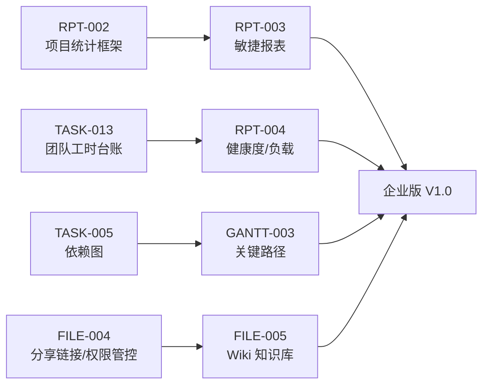
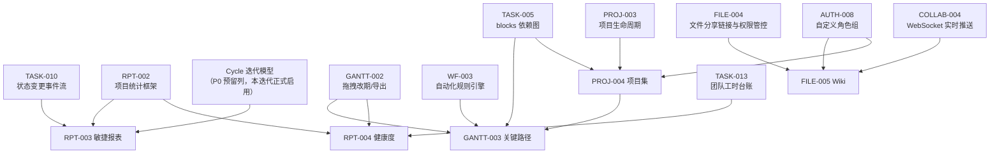

# Sprint 9 — 企业项目 / 报表 / Wiki 迭代概览

| 元信息项 | 内容 |
| --- | --- |
| 所属迭代 | Sprint 9 — 企业项目/报表/Wiki（第 12 周） |
| 优先级 | P3（企业版核心级 · **企业版 V1.0 交付迭代**） |
| 覆盖模块 | M3-PROJ 项目管理（项目集）｜M10-RPT 数据报表｜M7-FILE 文件（Wiki）｜M6-GANTT（关键路径） |
| 文档状态 | 已实现（Sprint-9，2026-09-10；偏差登记 ADR-0031） |
| 最后更新日期 | 2026-09-05（R1 修复：补 §9 风险与 §10 退出条件、「文档模板」显式排除、依赖边逐行对齐 `dependency-graph.md` §4、验收「实时」改量化 P95 门槛、消除「P4」节点/优先级双义。R2 前预检：QA-001 基准矩阵 §2.2→§2.3 两处、§4 `float_time`→`float_days` 对齐 GANTT-003、Cycle 预留位措辞消歧（P0 预留列/本迭代启用，对齐架构 §7.4 与 RPT-003）。R2 修复：GANTT-003 自动化转发上游按 README §4 消解为 **WF-003**（dg §4 字面 WF-005 系其 WF 编号错位，注 dg 待回改）、「文档模板」出处 §3.3→§3.7／§8.2 两处、§5 权限行补对象级 manager、风险 3「多一倍」改量级中性表述、下游消费「基线」→跨项目字段 TASK-014） |
| 上游依赖 | Sprint 8（组织治理与审计）、标准版全量（甘特/工时/动态流） |
| 下游消费 | 企业版 V1.0 发布；P4 增强（大屏/AI/跨项目字段 `TASK-014`）以此为基线 |
| 迭代周期 | 5 个工作日，固定预留 20% 缓冲 |

---

## 1. 迭代目标

企业版收官迭代，交付四块「管理层视角」能力：**项目集**（多项目归集、里程碑、跨项目依赖、整体进度）、**敏捷报表**（燃尽图/迭代速率/累积流）、**项目健康度与团队负载**、**Wiki 知识库**，外加甘特**关键路径**计算。共同把系统从「执行工具」升级为「决策工具」——这正是企业版与标准版的分水岭。

核心结果：

1. **项目集（Program/Portfolio）**：项目组合树、里程碑、跨项目依赖可视化、整体进度与资源汇总面板。
2. **敏捷报表**：燃尽图（理想线 vs 实际）、迭代速率（多 Sprint 均值）、累积流图（状态组堆叠时序）——数据源为 `IssueActivity` 状态变更事件 + Cycle 快照（架构文档 §7.2 `progress_snapshot` 思想）。
3. **项目健康度**：进度偏差/逾期率/工时偏差/阻塞率四维评分卡；**团队负载**：按人任务量×工时热力图；报表导出。
4. **Wiki**：项目 Wiki 空间（多级页面树）、富文本协作（复用 Tiptap 基座）、权限分级、版本回溯、全局知识检索（标题+内容 trgm）。
5. **关键路径**：依赖图上的 CPM（正推/逆推）计算，甘特高亮关键链与浮动时间，延期预警。

## 2. 范围与边界

| 范围 | 本迭代交付 | 明确不做 |
| --- | --- | --- |
| 项目集 | 组合树/里程碑/跨项目依赖/汇总面板 | 资源统一调度（P4）、项目集级工作流（P4） |
| 敏捷报表 | 燃尽/速率/累积流 + 导出（PNG/CSV） | 自定义报表设计器（P4 `RPT-005`）、数据大屏（P4） |
| 健康度 | 四维评分卡 + 团队负载热力 + 导出 | 跨组织经营分析（P4） |
| Wiki | 页面树/协作编辑/权限/版本/检索 | 多人实时协同编辑（Yjs，P4 评估）、模板市场；**文档模板**（需求文档 §3.7／§8.2 文件管理 P3 列有列名，README §4.11 本迭代 5 份与 §4.12 P4 批次均未立项——显式排除，不作为验收项） |
| 关键路径 | CPM 计算、甘特高亮、浮动时间、预警配置 | 关键路径锁定（P4）、自动调优建议（P4 AI） |

> 「P4」口径说明：本文所有「P4」一律指 README §4.12「P4 远期增强」批次（优先级口径同其索引表），非本迭代交付，亦非本文任何图中的节点编号；本迭代优先级为 P3（见元信息表）。

## 3. 前置依赖

迭代依赖边以 [`dependency-graph.md`](../architecture/dependency-graph.md) §4 为准（架构文档为唯一事实来源），逐行核对如下：

| 本迭代文档 | 上游依赖（dg §4 记载） | 说明 |
| --- | --- | --- |
| `PROJ-004` | `PROJ-003` `TASK-005` `AUTH-008` | 跨项目依赖建立在任务依赖与细粒度权限上 |
| `RPT-003` | `RPT-002` `TASK-010` | 敏捷图表依赖状态变更历史；Cycle 迭代模型为 RPT-003 本迭代自建（`Issue.cycle_id` 为架构 §7.4 P0 预留列，本迭代正式启用），非文档级依赖边 |
| `RPT-004` | `RPT-002` `TASK-013` `GANTT-002` | 团队负载消费工时、进度与甘特数据 |
| `FILE-005` | `FILE-004` `AUTH-008` `COLLAB-004` | Wiki 权限委托项目权限，协同编辑依赖实时服务（`FILE-002/003` 仅范式引用，非依赖边） |
| `GANTT-003` | `GANTT-002` `PROJ-004` `WF-003` | 关键路径基于依赖图，跨项目汇总依赖项目集，预警走自动化规则 |

> dg 缺边登记（本文按真实前提补画）：**（dependency-graph 待回改：§4 `GANTT-003` 上游补 `TASK-005` 边——CPM 以 blocks 依赖图为计算前提，GANTT-003 文档元信息表已声明该前提，dg §4 该行未列）**。Cycle 预留位为 RPT-003 的技术使能而非文档级依赖，不要求 dg 回改。
>
> **WF 编号错位消解（裁决 A/G：README §4 为准）**：上表 `WF-003` 按 README §4「自动化规则引擎」——dg §4 `GANTT-003` 行字面作 `WF-005`，系 dg §1.3 WF-002~006 编号-标题错位（s7/s8 已两轮登记待回改）所致（「预警走自动化规则」在 dg 字面挂到了模板库 WF-005 名下）；dg 回改时随 §1.3 一并对齐。

进入前必须满足：`IssueActivity` 状态事件管道完整（`TASK-010`）；Cycle 迭代模型启用（`Issue.cycle_id` 为架构 §7.4 P0 预留列、零 issues 表 DDL；`Cycle` 表本迭代正式建）；依赖图无环约束稳定（`TASK-005`）；`FILE-004` 分享链接与权限管控、`AUTH-008` 自定义角色组、`COLLAB-004` WebSocket 实时推送、`WF-003` 自动化规则引擎均已交付（分别为 Wiki 权限单入口、角色细粒度、协同编辑、预警自动化转发的前提）。

## 4. P3 模块覆盖

| 文档 | 交付重点 | 关键数据结构 | 直接下游 |
| --- | --- | --- | --- |
| `PROJ-004` | 项目集/组合与跨项目依赖 | `Portfolio`（树）/`PortfolioMilestone`/跨项目 `IssueLink` 放开 | P4 资源调度 |
| `RPT-003` | 燃尽/速率/累积流 | `Cycle` + `Issue.cycle_id` 直接外键（零中间表）+ `CycleSnapshot`/`DailyGroupSnapshot` | RPT-005（P4） |
| `RPT-004` | 健康度/团队负载/导出 | 四维评分聚合 + 负载快照 | P4 大屏 |
| `FILE-005` | 项目 Wiki 与知识检索 | `WikiSpace/WikiPage`（树 + 三格式内容 + 版本复用） | P4 全局知识 |
| `GANTT-003` | 关键路径与延期预警 | CPM（正推/逆推）+ `float_days` 派生 | P4 路径锁定 |

## 5. 统一工程约束

| 类别 | 约束 |
| --- | --- |
| 数据可信 | 报表消费事件流与快照（不实时扫表）：迭代结束即快照，历史报表不可被后续修改篡改 |
| 性能 | 燃尽/累积流百万事件级 P95 < 500ms（预聚合）；关键路径 1 万节点 < 300ms |
| Wiki | 页面内容三格式存储（复用 Issue 描述范式）；检索标题+剥离文本 trgm |
| 项目集 | 跨项目依赖仅可视化与统计（不参与单项目流转拦截——跨项目上下文不同，硬拦易误伤） |
| 导出 | PNG 前端渲染（复用 GANTT-002 管线）；CSV 服务端流式 |
| 权限 | `report.read/export`；项目集管理 WS 级+对象级 manager（PROJ-004 BR-03/BR-14）；Wiki 权限复用文件三态 |

## 6. 验收标准

- [ ] 5 份规格均含七章结构与全部详尽要素。
- [ ] 建含 3 项目 + 2 里程碑的项目集：跨项目依赖连线正确、里程碑延期预警可见；汇总面板「实时」以性能门禁判定——`summary/` P95 < 300ms（perf-heavy：项目集下 3 项目合计 1 万任务 + 近 4 周工时快照）、`dependency-graph/` P95 < 200ms（perf-heavy：同工作空间 1 万任务，子图 ≤100 节点/500 边；两端点数据形状详见 PROJ-004 §5.2 / IT-07）。
- [ ] 含 3 个迭代的项目：燃尽/速率/累积流与手工核算一致；迭代结束后修改历史任务**不改变**已归档报表（快照不可篡改验证）。
- [ ] 健康度四维评分卡可下钻；团队负载热力图按人×周正确；PNG/CSV 导出可用。
- [ ] Wiki 三级页面树、协作编辑、版本回滚、权限分级、全局检索命中标题与正文。
- [ ] 关键路径：已知网络验证 CPM（最早/最晚开始、浮动）；甘特高亮关键链；关键任务延期触发预警。
- [ ] 企业版 V1.0 整体回归通过（标准版零回归）。

## 7. 文档清单

| 序号 | 文件 | 一级标题 |
| --- | --- | --- |
| 1 | `PROJ-004-portfolio.md` | 项目集 / 项目组合与跨项目依赖 |
| 2 | `RPT-003-agile-reports.md` | 燃尽图 / 迭代速率 / 累积流图 |
| 3 | `RPT-004-project-health.md` | 项目健康度 / 团队负载 / 报表导出 |
| 4 | `FILE-005-wiki.md` | 项目 Wiki 与全局知识检索 |
| 5 | `GANTT-003-critical-path.md` | 关键路径计算与延期预警 |

## 8. 排期

| 工作日 | 主线 A（项目与报表） | 主线 B（Wiki 与甘特） | 当日验收 |
| --- | --- | --- | --- |
| Day 1 | `PROJ-004` 组合树与汇总 | `FILE-005` 页面树与编辑 | 组合面板；Wiki 三级树 |
| Day 2 | `RPT-003` Cycle 与快照 | `FILE-005` 版本/权限/检索 | 迭代归档快照 |
| Day 3 | `RPT-003` 三图表 | `GANTT-003` CPM 计算 | 图表对账一致 |
| Day 4 | `RPT-004` 评分卡与负载 | `GANTT-003` 高亮与预警 | 负载热力；预警触发 |
| Day 5 | 导出与回归 | 压测、缓冲、V1.0 验收 | 企业版 V1.0 清单全过 |

## 9. 风险与应对

| # | 风险 | 影响 | 概率 | 应对措施 | 责任文档 |
| --- | --- | --- | --- | --- | --- |
| 1 | **关键路径算法性能与缓存重算风暴**：CPM 门槛 1 万节点 < 300ms 依赖 `IssueCPMCache` 的 `input_hash` 命中，而锚点日入指纹导致指纹跨日必失配（每日 beat 全量重算兜底）；跨项目边放开后无环检测 CTE 范围扩至同工作空间全图，大工作空间下重算量与图规模同步放大 | 高：Day 5 压测不达标直接卡企业版 V1.0 验收 | 中 | ① Kahn 拓扑排序 O(V+E) 纯内存两遍扫描（GANTT-003 §4 性能核算：1 万节点/2 万边 ≈ 80ms + 加载 SQL ≈ 40ms，余量 2 倍）；② 60s debounce 增量重算 + 指纹命中即复用、不跨日漂移；③ >2 万节点降级「仅关键链近似」并响应标注 `approximate: true`；④ UT-12（1 万节点 < 300ms）进 CI 基准防回归 | `GANTT-003` BR-07/BR-10/BR-11、UT-12 |
| 2 | **Wiki 全文检索的 trgm/tsvector 能力边界**：检索排序走 `pg_trgm` 相似度（标题 3x 权重 + 正文），摘要用 `ts_headline('simple', …)`——`simple` 配置不做中文分词，整句中文查询的摘要切分质量有限；1-2 字符短查询词 trgm 区分度低、相关度排序弱于「tsvector + 中文分词」真全文检索方案（本迭代未引入） | 中：中文长句/超短词的检索召回与排序体验不达预期 | 中 | ① 验收按 FILE-005 IT-08 造数压测（500 页面 × 100 次检索，P95 < 300ms，权限过滤 JOIN 前置不回退）；② 标题 3x 权重保「标题必中」底线，`ts_headline` 片段 ≤160 字保可读性；③ 附件全文检索/语义检索已显式排除至 P4（§2 Wiki 行、`AI-001`），验收期不扩范围 | `FILE-005` BR-10/BR-11、IT-08 |
| 3 | **跨项目依赖聚合查询压力**：`summary/` 单载荷聚合进度/资源/风险三源（perf-heavy：1 万任务 + 近 4 周工时快照）；跨项目无环检测走全空间 CTE；RPT-004 阻塞率口径含跨项目边（镜像行判定不加项目过滤，统计面扩大至含跨项目边集） | 高：汇总面板/健康度接口超时即「管理层视角」核心承诺失守 | 中 | ① 双门禁压测：`summary/` P95 < 300ms、`dependency-graph/` P95 < 200ms（PROJ-004 IT-07，登记入 QA-001 §2.3 基准矩阵）；② 组合树深 ≤3 + 项目挂载叶子保证聚合集合有界；③ 负载热力复用 `TASK-013` `WorkLogSummary` 快照、不另建聚合 SQL；④ 报表聚合端点限流 10 请求/分钟兜底 | `PROJ-004` BR-09、IT-07；`RPT-004` BR-11 |
| 4 | **报表快照管道漏跑与事件回放边界**：百万事件级逐日回放不可行（CFD 走项目级每日五组快照），beat 漏跑/迟到会产生日快照缺口、速率偏低；已归档报表被历史任务修改污染是验收硬红线（§6 第 3 条） | 高：报表与手工核算对账不一致，快照不可篡改承诺失效 | 中 | ① 每日 00:10（时区口径对齐 RPT-003 BR-05：本迭代实现为服务器时区单口径）落日快照 + 迭代结束落终版快照（`is_final` 唯一锚），防日快照漏跑导致速率偏低；② 结束即冻结全部快照、已结束迭代只读快照直查（历史修改零影响）；③ Day 3「图表对账一致」当日验收 + 快照不可篡改用例前置 | `RPT-003` BR-04/BR-05/BR-06/BR-12 |
| 5 | **5 日收官迭代排期与范围蔓延**：5 份规格两条主线并行、固定 20% 缓冲，Day 5 还要承载压测与 V1.0 整体回归（标准版零回归）；Wiki 协作编辑与甘特高亮是「顺手增强」高发区，且需求文档 §3.7／§8.2 的「文档模板」列名极易被误认为本迭代范围 | 高：任一主线延期即挤压压测与回归窗口，V1.0 交付顺延 | **高** | ① §2「明确不做」列（含文档模板显式排除）作为硬性范围基线；② 主线里程碑前置暴露偏差（Day 3 图表对账、Day 4 负载热力与预警触发）；③ Day 5 压测/缓冲/V1.0 验收固定不动，功能挤占即触发砍范围而非顺延 | 本文档 §2/§8 |

## 10. 迭代退出条件

同时满足以下三项，Sprint 9 方可关闭并宣布企业版 V1.0 交付：

1. **功能验收**：§6 的 7 条验收清单全部通过，其中性能项以各被测文档登记的门禁为判定标准——汇总面板 `summary/` P95 < 300ms、`dependency-graph/` P95 < 200ms（`PROJ-004` IT-07）；燃尽/累积流百万事件级 P95 < 500ms（§5 性能约束，`RPT-003` 预聚合）；Wiki 检索 500 页面 P95 < 300ms（`FILE-005` IT-08）；关键路径 1 万节点 < 300ms（`GANTT-003` UT-12 CI 基准）。
2. **工程质量**：无阻塞级（P0/P1）未修复缺陷；企业版 V1.0 整体回归通过且标准版零回归（§6 第 7 条）；本迭代性能门禁压测结果已登记入 QA-001 §2.3 压测基准矩阵。
3. **文档同步**：本迭代 5 份功能文档状态全部标记为「已实现」，实现过程中对架构决策的任何偏离已回写至对应架构文档（或已登记为 ADR）。

## 11. 相关文档

- 上级索引：[`docs/README.md`](../README.md) §4.11
- 依赖边权威：[`docs/architecture/dependency-graph.md`](../architecture/dependency-graph.md) §4（本文 §3 依赖表出处；待回改项见其标注）
- 前置迭代：[`docs/sprint-8-enterprise-org/sprint-overview.md`](../sprint-8-enterprise-org/sprint-overview.md)
- 原始需求：[`docs/需求文档.md`](../需求文档.md) §3.3/§3.6/§3.7/§8.2 各模块行 P3 列
- 下一迭代：`docs/sprint-future-p4/sprint-overview.md`（P4 远期增强）
