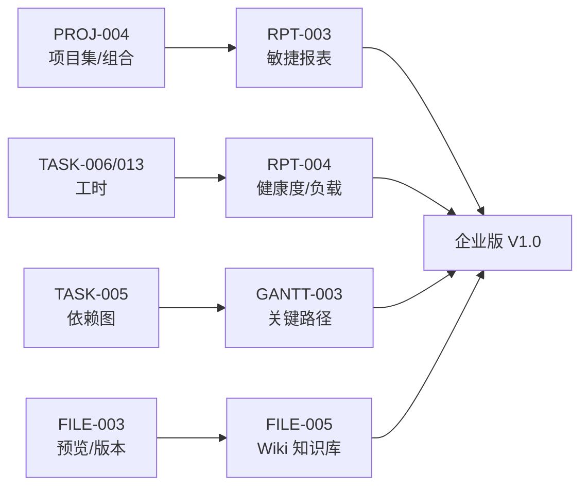
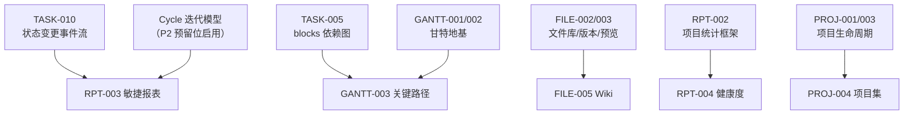

# Sprint 9 — 企业项目 / 报表 / Wiki 迭代概览

| 元信息项 | 内容 |
| --- | --- |
| 所属迭代 | Sprint 9 — 企业项目/报表/Wiki（第 12 周） |
| 优先级 | P3（企业版核心级 · **企业版 V1.0 交付迭代**） |
| 覆盖模块 | M3-PROJ 项目管理（项目集）｜M10-RPT 数据报表｜M7-FILE 文件（Wiki）｜M6-GANTT（关键路径） |
| 文档状态 | 待评审（Draft） |
| 最后更新日期 | 2026-09-01 |
| 上游依赖 | Sprint 8（组织治理与审计）、标准版全量（甘特/工时/动态流） |
| 下游消费 | 企业版 V1.0 发布；P4 增强（大屏/AI/基线）以此为基线 |
| 迭代周期 | 5 个工作日，固定预留 20% 缓冲 |

---

## 1. 迭代目标

企业版收官迭代，交付四块「管理层视角」能力：**项目集**（多项目归集、里程碑、跨项目依赖、整体进度）、**敏捷报表**（燃尽图/迭代速率/累积流）、**项目健康度与团队负载**、**Wiki 知识库**，外加甘特**关键路径**计算。共同把系统从「执行工具」升级为「决策工具」——这正是企业版与标准版的分水岭。

核心结果：

1. **项目集（Program/Portfolio）**：项目组合树、里程碑、跨项目依赖可视化、整体进度与资源汇总面板。
2. **敏捷报表**：燃尽图（理想线 vs 实际）、迭代速率（多 Sprint 均值）、累积流图（状态组堆叠时序）——数据源为 `IssueActivity` 状态变更事件 + Cycle 快照（架构文档 §7.2 `progress_snapshot` 思想）。
3. **项目健康度**：进度偏差/逾期率/工时偏差/阻塞率四维评分卡；**团队负载**：按人任务量×工时热力图；报表导出。
4. **Wiki**：项目 Wiki 空间（多级页面树）、富文本协作（复用 Tiptap 基座）、权限分级、版本回溯、全局知识检索（标题+内容 trgm）。
5. **关键路径**：依赖图上的 CPM（正推/逆推）计算，甘特高亮关键链与浮动时间，延期预警。

## 2. 范围与边界

| 范围 | 本迭代交付 | 明确不做 |
| --- | --- | --- |
| 项目集 | 组合树/里程碑/跨项目依赖/汇总面板 | 资源统一调度（P4）、项目集级工作流（P4） |
| 敏捷报表 | 燃尽/速率/累积流 + 导出（PNG/CSV） | 自定义报表设计器（P4 `RPT-005`）、数据大屏（P4） |
| 健康度 | 四维评分卡 + 团队负载热力 + 导出 | 跨组织经营分析（P4） |
| Wiki | 页面树/协作编辑/权限/版本/检索 | 多人实时协同编辑（Yjs，P4 评估）、模板市场 |
| 关键路径 | CPM 计算、甘特高亮、浮动时间、预警配置 | 关键路径锁定（P4）、自动调优建议（P4 AI） |

## 3. 前置依赖

进入前必须满足：`IssueActivity` 状态事件管道完整；Cycle 迭代模型启用（P2 预留 `cycle_id` 外键 + `Cycle` 表本迭代正式建）；依赖图无环约束稳定（`TASK-005`）；文件版本与预览生产可用。

## 4. P3 模块覆盖

| 文档 | 交付重点 | 关键数据结构 | 直接下游 |
| --- | --- | --- | --- |
| `PROJ-004` | 项目集/组合与跨项目依赖 | `Portfolio`（树）/`PortfolioMilestone`/跨项目 `IssueLink` 放开 | P4 资源调度 |
| `RPT-003` | 燃尽/速率/累积流 | `Cycle` + `CycleIssue`（OneToOne）+ `progress_snapshot` | RPT-005（P4） |
| `RPT-004` | 健康度/团队负载/导出 | 四维评分聚合 + 负载快照 | P4 大屏 |
| `FILE-005` | 项目 Wiki 与知识检索 | `WikiSpace/WikiPage`（树 + 三格式内容 + 版本复用） | P4 全局知识 |
| `GANTT-003` | 关键路径与延期预警 | CPM（正推/逆推）+ `float_time` 派生 | P4 路径锁定 |

## 5. 统一工程约束

| 类别 | 约束 |
| --- | --- |
| 数据可信 | 报表消费事件流与快照（不实时扫表）：迭代结束即快照，历史报表不可被后续修改篡改 |
| 性能 | 燃尽/累积流百万事件级 P95 < 500ms（预聚合）；关键路径 1 万节点 < 300ms |
| Wiki | 页面内容三格式存储（复用 Issue 描述范式）；检索标题+剥离文本 trgm |
| 项目集 | 跨项目依赖仅可视化与统计（不参与单项目流转拦截——跨项目上下文不同，硬拦易误伤） |
| 导出 | PNG 前端渲染（复用 GANTT-002 管线）；CSV 服务端流式 |
| 权限 | `report.read/export`；项目集管理 WS 级；Wiki 权限复用文件三态 |

## 6. 验收标准

- [ ] 5 份规格均含七章结构与全部详尽要素。
- [ ] 建含 3 项目 + 2 里程碑的项目集：跨项目依赖连线正确、整体进度与资源汇总实时、里程碑延期预警可见。
- [ ] 含 3 个迭代的项目：燃尽/速率/累积流与手工核算一致；迭代结束后修改历史任务**不改变**已归档报表（快照不可篡改验证）。
- [ ] 健康度四维评分卡可下钻；团队负载热力图按人×周正确；PNG/CSV 导出可用。
- [ ] Wiki 三级页面树、协作编辑、版本回滚、权限分级、全局检索命中标题与正文。
- [ ] 关键路径：已知网络验证 CPM（最早/最晚开始、浮动）；甘特高亮关键链；关键任务延期触发预警。
- [ ] 企业版 V1.0 整体回归通过（标准版零回归）。

## 7. 文档清单

| 序号 | 文件 | 一级标题 |
| --- | --- | --- |
| 1 | `PROJ-004-portfolio.md` | 项目集 / 项目组合与跨项目依赖 |
| 2 | `RPT-003-agile-reports.md` | 燃尽图 / 迭代速率 / 累积流图 |
| 3 | `RPT-004-project-health.md` | 项目健康度 / 团队负载 / 报表导出 |
| 4 | `FILE-005-wiki.md` | 项目 Wiki 与全局知识检索 |
| 5 | `GANTT-003-critical-path.md` | 关键路径计算与延期预警 |

## 8. 排期

| 工作日 | 主线 A（项目与报表） | 主线 B（Wiki 与甘特） | 当日验收 |
| --- | --- | --- | --- |
| Day 1 | `PROJ-004` 组合树与汇总 | `FILE-005` 页面树与编辑 | 组合面板；Wiki 三级树 |
| Day 2 | `RPT-003` Cycle 与快照 | `FILE-005` 版本/权限/检索 | 迭代归档快照 |
| Day 3 | `RPT-003` 三图表 | `GANTT-003` CPM 计算 | 图表对账一致 |
| Day 4 | `RPT-004` 评分卡与负载 | `GANTT-003` 高亮与预警 | 负载热力；预警触发 |
| Day 5 | 导出与回归 | 压测、缓冲、V1.0 验收 | 企业版 V1.0 清单全过 |

## 9. 相关文档

- 前置迭代：[`docs/sprint-8-enterprise-org/sprint-overview.md`](../sprint-8-enterprise-org/sprint-overview.md)
- 原始需求：[`docs/需求文档.md`](../需求文档.md) §3.3/§3.6/§3.7/§8.2 报表行 P3 列
- 下一迭代：`docs/sprint-future-p4/sprint-overview.md`（P4 远期增强）
