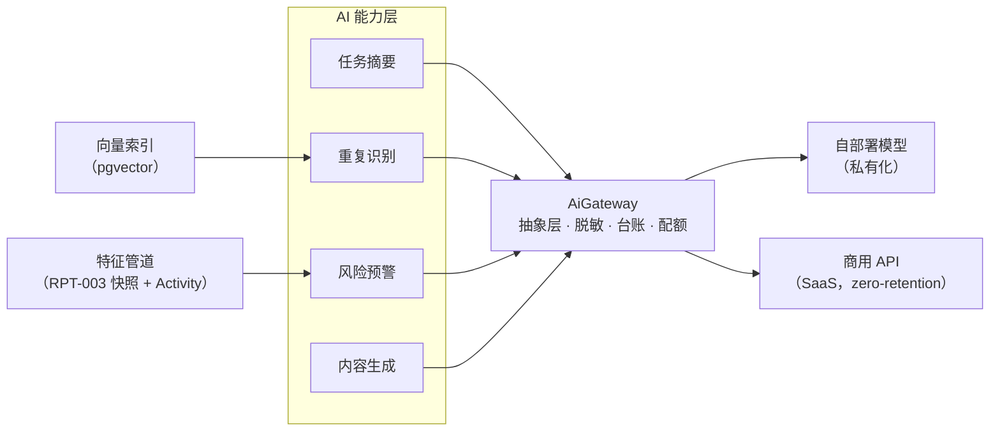
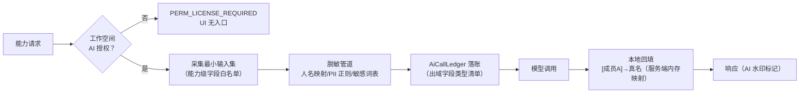

# AI 辅助能力（摘要 / 预警 / 生成）

| 元信息项 | 内容 |
| --- | --- |
| 文档编号 | AI-001 |
| 所属迭代 | P4：远期增强（第 13 周起，签约驱动排期） |
| 优先级 | P4（企业版增强 / 智能价值线） |
| 所属模块 | M11-AI 智能辅助 |
| 文档状态 | 待评审（Draft） |
| 最后更新日期 | 2026-09-01 |
| 上游依据 | `docs/需求文档.md` §3.8 AI 能力节、§8.2 P4 列（AI 行）、§9.2 AI 数据出域约束 |
| 前置依赖 | 全量数据面（Sprint 1-9 全模块）、`RPT-003/004`（聚合框架，风险预警特征源）、`AUTH-012`（租户级 AI 开关与配额治理）、`FILE-006`（脱敏基础设施复用） |
| 下游依赖 | P4+ AI 深化（智能排期、自动分类）；`FILE-006` DLP 内容识别升级 |
| 架构基线 | [`api-conventions.md`](../architecture/api-conventions.md) §8、[`tech-stack.md`](../architecture/tech-stack.md) §5（异步任务范式） |
| 竞品参考 | Linear（AI 摘要与相似任务）、Notion AI、Jira Intelligence（Atlassian Intelligence）、飞书智能伙伴 |

> **范围声明**：本文档交付四项 AI 能力——**任务摘要**（长讨论一键归纳）、**重复识别**（建任务时相似推荐）、**风险预警**（基于进度信号的任务延期预测）、**内容生成**（任务描述/子任务拆解草稿）。全部能力共享同一**模型服务抽象层**（§4.1，多提供方可插拔）与**数据出域授权体系**（§2.4，显式授权 + 脱敏策略）。不做：自主操作（AI 直接改任务状态）、对话式 Agent、客户数据训练。

---

## 1. 概述

### 1.1 功能定位

AI 在项目管理里的真实价值不是「聊天框」，而是**把分散信息压缩成决策依据**。四项能力的选型原则：高频、结果可人工核验、错了代价低（草稿/建议性质，BR-01）。

| 能力 | 触发 | 产出 | 价值 |
| --- | --- | --- | --- |
| 任务摘要 | 用户点击（评论 ≥ 10 条时推荐） | 结构化摘要：结论/待办/争议点/关键人 | 长讨论 5 分钟变 20 秒 |
| 重复识别 | 创建任务输入标题时（去抖 800ms） | Top-5 相似任务卡片（含状态） | 重复工单减少，知识复用 |
| 风险预警 | 后台每日计算 + 任务页实时信号 | 延期风险分（0-100）+ 三条主因 | PM 提前一周看到要延的任务 |
| 内容生成 | 用户点击「AI 起草」 | 描述草稿 / 子任务拆解清单（≤ 8 条） | 冷启动成本降低 |

### 1.2 启动条件

| 条件 | 判定 |
| --- | --- |
| 商业条件 | 企业版客户签约 AI 增值包（独立 SKU）；**数据出域授权书**签署（§2.4）是启用前置 |
| 技术前置 | 全量数据面稳定（风险预警特征依赖 `TASK-006/010`、`RPT-003` 快照）；`AUTH-012` 可承载 AI 调用配额 |
| 选型前置 | **模型服务选型评审完成**：首选自部署开源模型（Qwen/Llama 系，私有化客户）+ 商用 API（SaaS 客户，Anthropic/OpenAI/通义），抽象层验证两家以上提供方接入 |

### 1.3 独立交付判定

1. 四能力在演示工作空间（授权开启）全链路可用；授权关闭的工作空间 UI 无入口、API 返回 `PERM_LICENSE_REQUIRED`。
2. 摘要质量人工评测：50 条真实讨论抽样，「结论准确且待办无遗漏」≥ 80%（评审表 §5.3 E2E-04）。
3. 出域审计：任意一次模型调用可在台账查到「谁触发、出了什么字段、走了哪家模型」；脱敏规则命中可验证（§2.4）。
4. 零回归：AI 全关时系统行为与企业版 V1.0 一致；模型服务故障时业务路径零影响（降级策略 §4.6）。

### 1.4 AI 伦理与责任边界（BR 前置声明）

| 原则 | 落地 |
| --- | --- |
| 建议而非决策 | 所有 AI 产出标注「AI 生成」水印；采纳动作（保存/创建）必须人工点击；Activity 区分 AI 草稿与人工内容 |
| 不用客户数据训练 | 与模型提供方的协议层保证（zero-retention API / 自部署）；系统自身也不将提示词与产出用于训练 |
| 可追溯 | 每次调用落 `AiCallLedger`（§4.3）：提示词哈希、出域字段清单、模型标识、token 用量 |
| 可关闭 | 工作空间级总开关 + 四能力独立开关；关闭即无数据出域（代码路径级，非配置掩盖） |

---

## 2. 业务逻辑

### 2.1 四能力流程



| 能力 | 输入 | 模型侧任务 | 输出契约 |
| --- | --- | --- | --- |
| 摘要 | 标题 + 描述 + 最近 50 条评论（脱敏后） | 结构化抽取（JSON Schema 约束输出） | `{conclusions[], todos[], disputes[], key_people[]}` |
| 重复识别 | 标题 + 描述向量（embedding） | pgvector 余弦 Top-K（阈值 0.82）+ 重排 | `[{issue_id, score, title, state}]` |
| 风险预警 | 12 维特征（§2.3） | 梯度提升模型（自训，非 LLM） | `{score, top_reasons[3], confidence}` |
| 生成 | 标题 + 项目上下文（最近 20 任务标题） | LLM 草稿生成 | `{description_draft, sub_tasks[≤8]}` |

### 2.2 业务规则（BR）

| 编号 | 规则 | 说明 |
| --- | --- | --- |
| BR-01 | 建议性质 | AI 产出永不直接写库；生成内容进编辑器草稿态，人工保存才生效；风险分只是展示 |
| BR-02 | 显式授权 | 工作空间 AI 总开关默认**关**；开启时弹授权书（出域字段清单 + 提供方 + zero-retention 条款），WS_ADMIN 签署留痕 |
| BR-03 | 脱敏前置 | 出域 payload 经脱敏管道（§2.4）：人名→`[成员A]`、邮箱/电话/身份证正则屏蔽、自定义敏感词表；摘要等人名敏感场景在**返回后**本地回填（`[成员A]`→真名映射只存在服务端内存） |
| BR-04 | 台账可查 | 每次调用落 `AiCallLedger`（触发人/能力/出域字段类型/模型/token/耗时/状态）；WS_ADMIN 可导出 |
| BR-05 | 配额治理 | 租户级日配额（按 SKU：摘要 500 次/日、生成 300 次/日、预警与识别不限量——后两者非 LLM 或低成本）；超限 `QUOTA_AI_EXCEEDED`（§4.5 注册新码于 api-conventions 增补） |
| BR-06 | 失败降级 | 模型超时/故障：摘要与生成显示「暂时不可用」重试按钮；重复识别静默隐藏面板；风险预警用前一日分数；**业务写路径永不阻塞** |
| BR-07 | 反馈回路 | 摘要与生成结果旁「有用/无用」轻反馈；反馈落库供 prompt 迭代，不含内容本身 |
| BR-08 | 风险分可解释 | 预警必须给出 ≤ 3 条主因（来自特征贡献度，如「近 7 天无活动」「剩余 3 天完成度 20%」），不允许裸分数 |
| BR-09 | 重复识别范围 | 相似搜索严格限制在当前用户**可见**项目集（行级过滤先行，向量索引按 workspace 分区） |
| BR-10 | 内容安全 | 生成结果过安全过滤层（提供方侧 + 本地关键词兜底）；命中时返回空草稿并提示重试 |
| BR-11 | 私有化自部署 | 私有化客户只走自部署模型（数据零出域）；无 GPU 的私有化客户可选购纯 CPU 降级包（仅重复识别与规则版预警） |
| BR-12 | 审计 | 授权签署/关闭/配额变更/台账导出四动作入 `AuditLog` |

### 2.3 风险预警特征与模型

| # | 特征 | 来源 |
| --- | --- | --- |
| 1-3 | 剩余天数 / 完成度（子任务完成率）/ 时间消耗比 | `Issue` + `TASK-004` 子任务统计 |
| 4-5 | 近 7 天活动数 / 距上次活动天数 | `TASK-010` Activity 流 |
| 6-7 | 阻塞依赖数 / 阻塞者平均延期 | `TASK-005` 依赖图 |
| 8-9 | 负责人并发任务数 / 负责人历史准时率 | `TASK-007` + `RPT-004` 负载 |
| 10 | 近 30 天改期次数 | Activity 日期事件 |
| 11-12 | 优先级 / 是否关键路径 | `Issue` + `GANTT-003` |

| 模型决策 | 说明 |
| --- | --- |
| 非 LLM | 梯度提升树（LightGBM），小数据可训、可解释（SHAP 贡献度直出 BR-08 主因）、CPU 可跑（BR-11 降级友好） |
| 训练数据 | 我方脱敏基准集 + 客户**可选**贡献匿名特征（贡献开关独立授权，默认关） |
| 冷启动 | 无训练数据期走规则版（阈值打分：剩余<3天且完成度<50% → 高风险），模型版上线后双跑 30 天校准 |
| 更新 | 每日 04:00 全量重算（Celery）；任务页打开时若分数 > 24h 未更新则实时算该单行 |

### 2.4 数据出域授权与脱敏管道



| 机制 | 说明 |
| --- | --- |
| 字段白名单 | 每能力声明允许出域的字段类型（如摘要：`title/description_text/comment_text/author_role`）；**不出域**：自定义字段值、附件、邮箱、ID 原文（ID 用会话级伪随机映射） |
| 人名映射 | `@张三`→`[成员A]` 出域，返回后回填；映射表仅存活于请求上下文，不落盘不缓存 |
| 授权书要素 | 出域字段清单、提供方名单、zero-retention 承诺、关闭方式；版本化管理（条款变更需重签） |
| 台账内容 | 记录**字段类型与计数**（如 `comment_text × 32`）而非内容本身——台账本身不构成二次出域 |

---

## 3. UI/UX 设计

### 3.1 入口清单

| 入口 | 位置 | 形态 |
| --- | --- | --- |
| 任务摘要 | 任务详情评论 ≥ 10 条时顶部横幅 + 详情菜单常驻 | 按钮 → 抽屉式摘要面板 |
| 重复识别 | 创建任务标题输入（去抖 800ms） | 标题下方内联相似列表（可折叠） |
| 风险预警 | 列表/看板/甘特行级风险徽标 + 详情页风险卡 | 着色徽标（🟡🟠🔴）+ 悬停主因 |
| 内容生成 | 描述编辑器「✨ AI 起草」+ 子任务区「✨ 拆解建议」 | 草稿注入编辑器（人工确认） |
| AI 管理 | 工作空间设置 → AI 能力 | 授权、四开关、配额水位、台账导出 |

### 3.2 摘要面板与风险卡线框

```
┌─ ✨ AI 摘要 · 最近 47 条评论 ──────────────────────────┐
│ [AI 生成 · 基于 9/1 前讨论 · 反馈👍👎]                   │
│ ── 结论 ─────────────────────────────                   │
│ · 支付渠道选定方案 B（费率低 0.3%）已达成共识            │
│ · 上线时间从 9/20 推迟到 9/27（安全审计未排入）          │
│ ── 待办 ─────────────────────────────                   │
│ · @张三点：周四前出渠道 B 联调计划                        │
│ · @李四维：补安全审计排期                                  │
│ ── 争议点 ────────────────────────────                  │
│ · 渠道 A 备用方案是否保留（产品 vs 财务分歧，未决）       │
│ ────────────────────────────────── [复制] [生成子任务]  │
└──────────────────────────────────────────────────────────┘

┌─ 风险预警 · 🔴 78 分 ──────────────────┐
│ 主要风险因素：                          │
│ 1. 剩余 3 天，子任务完成度仅 20%         │
│ 2. 近 7 天无任何进展活动                │
│ 3. 前置任务 ECOM-198 已延期 5 天        │
│ [查看依赖]            [反馈：不准确]    │
└─────────────────────────────────────────┘
```

### 3.3 重复识别与 AI 管理线框

```
创建任务
  标题: [支付回调偶发失败____]
  ┌─ 可能相关的已有任务 (3) ─────────────────────────┐
  │ ● ECOM-188 支付回调超时重试   进行中 · 相似 92%  │
  │ ○ ECOM-151 网关超时排查       已完成 · 相似 87%  │
  │ ○ OPS-77    支付对账差异      待办   · 相似 83%  │
  └──────────────────────────────────────────────────┘

┌─ 设置 / AI 能力 ─────────────────────────────────────┐
│ 总开关: ● 已启用（授权书 v3 · 陈合规 签于 8/15）[查看] │
│ 能力:   ☑任务摘要 ☑重复识别 ☑风险预警 ☐内容生成        │
│ 模型:   商用 API（Anthropic，zero-retention）▾        │
│ 今日用量: 摘要 121/500 · 生成 88/300                   │
│ 台账:   [查看调用台账] [导出 CSV]                      │
└───────────────────────────────────────────────────────┘
```

### 3.4 交互规则

| 场景 | 交互 |
| --- | --- |
| 未授权 | 四能力入口全隐藏（服务端菜单剔除 + 组件不渲染），设置页显示「未启用」与开启向导 |
| 授权向导 | 三步：能力选择 → 授权书阅读（强制滚动到底）→ 签署（WS_ADMIN 密码确认） |
| AI 生成注入 | 草稿以「待确认」样式插入编辑器（虚线框 + 来源标签），光标默认停在标题提示人工审阅；直接丢弃一键还原 |
| 反馈 | 👍👎 点击即落库（无二次弹窗）；👎 可选填一句原因 |
| 配额触顶 | 按钮置灰 + Tooltip「今日配额已用完，明日 0 点重置」；管理员收到 80% 预警 |
| 降级 | 模型故障时摘要/生成按钮显示「AI 服务暂时不可用」；风险徽标带「昨日数据」角标 |

---

## 4. 技术架构

### 4.1 模型服务抽象层（AiGateway）

```python
# apps/api/rp_ai/gateway.py
from typing import Protocol


class ChatModel(Protocol):
    """多提供方统一接口；实现：Anthropic / OpenAI / 通义 / vLLM(自部署)。"""

    def complete_json(self, prompt: str, schema: dict,
                      *, max_tokens: int, timeout_s: float) -> dict: ...
    def complete_text(self, prompt: str, *, max_tokens: int,
                      timeout_s: float) -> str: ...
    def embed(self, texts: list[str]) -> list[list[float]]: ...


class AiGateway:
    """唯一出域闸口：授权 → 采集 → 脱敏 → 台账 → 调用 → 回填。"""

    def __init__(self, workspace):
        self.ws = workspace
        self.policy = AiPolicy.for_workspace(workspace)   # 授权与开关
        self.provider = ProviderRegistry.for_workspace(workspace)

    def summarize(self, issue, actor) -> dict:
        self.policy.assert_enabled("summary")              # BR-02
        payload = collectors.summary_payload(issue)        # 字段白名单
        masked, restore = mask_outbound(payload, self.ws)  # BR-03
        ledger = AiCallLedger.open(self.ws, actor, "summary", masked)
        try:
            result = self.provider.complete_json(
                prompts.SUMMARY.render(masked), SUMMARY_SCHEMA,
                max_tokens=1200, timeout_s=20)
            ledger.succeed(result.usage)
        except ProviderError as exc:
            ledger.fail(str(exc))                          # BR-06 台账也记失败
            raise AiUnavailable from exc
        return restore(result)                             # 本地回填人名
```

| 要点 | 说明 |
| --- | --- |
| 提供方注册表 | `ProviderRegistry` 按工作空间配置路由：私有化 → vLLM 集群端点；SaaS → 商用 API（密钥密保库，zero-retention 参数） |
| 配额前置 | `assert_enabled` 内做 Redis 日计数预检（BR-05），计数在台账落笔时 +1 |
| 超时纪律 | LLM 调用硬超时 20s（摘要/生成）、5s（embedding 批量）；Celery 任务重试上限 2 次 |

### 4.2 重复识别（pgvector）

```sql
-- 迁移：启用扩展 + 向量列（独立表，不动 Issue 主表）
CREATE EXTENSION IF NOT EXISTS vector;

CREATE TABLE issue_embedding (
    issue_id    UUID PRIMARY KEY REFERENCES issue(id),
    workspace_id UUID NOT NULL,
    project_id  UUID NOT NULL,
    embedding   vector(1024) NOT NULL,
    state_group VARCHAR(16) NOT NULL,
    updated_at  TIMESTAMPTZ NOT NULL DEFAULT now()
);
CREATE INDEX idx_issue_emb_hnsw ON issue_embedding
    USING hnsw (embedding vector_cosine_ops) WITH (m = 16, ef_construction = 64);
CREATE INDEX idx_issue_emb_ws ON issue_embedding (workspace_id, project_id);

-- 相似查询（BR-09：行级过滤先行）
SELECT ie.issue_id, 1 - (ie.embedding <=> %(qvec)::vector) AS score
FROM issue_embedding ie
WHERE ie.workspace_id = %(ws)s
  AND ie.project_id = ANY(%(visible_projects)s)   -- 权限预过滤
  AND ie.issue_id <> %(self)s
ORDER BY ie.embedding <=> %(qvec)::vector
LIMIT 5;
```

| 要点 | 说明 |
| --- | --- |
| 索引时机 | 任务创建/标题描述变更后 `on_commit` 异步入队（`ai_embed` 队列）；批量回填按项目分批 500 |
| 阈值 | 余弦相似 ≥ 0.82 才展示；embedding 模型自部署 bge-large（私有化和 SaaS 同模，避免双模型漂移） |
| 分区 | `workspace_id` 等值过滤 + `project_id ANY` 权限剪枝，HNSW 内建不跨空间（BR-09） |

### 4.3 台账与策略模型

```python
# apps/api/rp_ai/models.py
class AiConsent(BaseModel):
    """AI 授权书签署记录；版本化（条款变更需重签，BR-02）。"""
    workspace = models.ForeignKey("rp_workspaces.Workspace",
                                  on_delete=models.CASCADE)
    consent_version = models.CharField(max_length=8)           # v3
    capabilities = models.JSONField(default=list)              # 四能力子集
    provider_policy = models.CharField(max_length=16)          # commercial/selfhosted
    signed_by = models.ForeignKey("rp_users.User",
                                  on_delete=models.PROTECT)
    revoked_at = models.DateTimeField(null=True)

    class Meta:
        db_table = "ai_consent"
        indexes = [models.Index(fields=["workspace", "-created_at"],
                                name="idx_ai_consent_ws")]


class AiCallLedger(BaseModel):
    workspace = models.ForeignKey("rp_workspaces.Workspace",
                                  on_delete=models.CASCADE)
    actor = models.ForeignKey("rp_users.User", null=True,
                              on_delete=models.SET_NULL)
    capability = models.CharField(max_length=16)               # summary/dup/risk/gen
    provider = models.CharField(max_length=24)                 # anthropic/vllm/…
    model = models.CharField(max_length=48)
    outbound_fields = models.JSONField(default=dict)           # {"comment_text": 32}
    prompt_hash = models.CharField(max_length=64)              # 内容不入账
    tokens = models.JSONField(default=dict)                    # {"in":..,"out":..}
    latency_ms = models.PositiveIntegerField(default=0)
    status = models.CharField(max_length=8)                    # ok/failed
    error = models.CharField(max_length=255, blank=True)

    class Meta:
        db_table = "ai_call_ledger"
        indexes = [
            models.Index(fields=["workspace", "-created_at"],
                         name="idx_ai_ledger_ws"),
        ]
```

### 4.4 API 端点

| 方法 | 路径 | 说明 |
| --- | --- | --- |
| POST | `/api/v1/projects/{pid}/issues/{id}/ai-summary/` | 生成摘要（同步 ≤ 20s，超出转异步 + 轮询） |
| GET | `/api/v1/projects/{pid}/issues/similar/?title=&description=` | 重复识别（去抖后端调用） |
| GET | `/api/v1/projects/{pid}/issues/{id}/risk-score/` | 单行风险分（含主因与置信度） |
| POST | `/api/v1/projects/{pid}/ai-draft/` | 描述/子任务拆解草稿 |
| POST | `/api/v1/ai/feedback/` | 有用/无用反馈（BR-07） |
| GET/POST/DELETE | `/api/v1/workspaces/{slug}/ai/consent/` | 授权查看/签署/撤销 |
| GET | `/api/v1/workspaces/{slug}/ai/ledger/` | 台账（cursor 分页 + CSV 导出） |
| GET | `/api/v1/workspaces/{slug}/ai/quota/` | 配额水位 |

**成功示例** — `POST …/ai-summary/`：

```json
{
  "status": "success",
  "data": {
    "generated_by": "ai",
    "model": "claude-sonnet-5",
    "based_on": {"comments": 47, "until": "2026-09-01T06:00:00Z"},
    "summary": {
      "conclusions": ["支付渠道选定方案 B（费率低 0.3%）", "上线推迟至 9/27"],
      "todos": [{"assignee": "张三点", "text": "周四前出渠道 B 联调计划"}],
      "disputes": ["渠道 A 备用方案是否保留（未决）"],
      "key_people": ["张三点", "李四维"]
    },
    "feedback_id": "01J70DK2M8NQ4PXRBTVH5WD3EA"
  },
  "meta": {"request_id": "01J70DL3N9OR5QYSCUW6XE4FB"}
}
```

**错误示例** — 未授权（BR-02）：

```json
{
  "status": "error",
  "error": {
    "code": "PERM_LICENSE_REQUIRED",
    "message": "该工作空间未启用 AI 能力，需管理员签署数据出域授权书",
    "details": [{"field": "ai_consent", "code": "REQUIRED",
                 "message": "设置 → AI 能力 → 开启向导"}]
  },
  "meta": {"request_id": "01J70DM4O0PS6RZTDVX7YF5GC"}
}
```

**错误示例** — 配额超限（BR-05）：

```json
{
  "status": "error",
  "error": {
    "code": "QUOTA_AI_EXCEEDED",
    "message": "今日 AI 摘要配额已用完（500/500），明日 0 点重置",
    "details": [{"field": "capability", "code": "TOO_LARGE",
                 "message": "可在设置 → AI 能力 查看用量或升级套餐"}]
  },
  "meta": {"request_id": "01J70DN5P1QT7S1UEWY8ZG6HD"}
}
```

> 注：`QUOTA_AI_EXCEEDED` 为本文档向 `api-conventions.md` §8.7 申请的**增补码**（409），随本能力发布同步更新注册表。

### 4.5 前端 Store

```typescript
// apps/web/src/modules/ai/ai.store.ts
export class AiStore {
  consent: IAiConsent | null = null;
  quota: IAiQuota | null = null;
  summary: ISummaryResult | null = null;
  similarIssues: ISimilarIssue[] = [];
  isSummarizing = false;

  constructor(private workspaceSlug: string) { makeAutoObservable(this); }

  get enabled() { return !!this.consent && !this.consent.revokedAt; }
  get summaryExhausted() {
    return !!this.quota && this.quota.summary.used >= this.quota.summary.limit;
  }

  async summarize(projectId: string, issueId: string) {
    this.isSummarizing = true;
    try {
      const res = await aiService.summarize(projectId, issueId);
      runInAction(() => { this.summary = res.data; });
    } catch (e) {
      if (errorCode(e) === "QUOTA_AI_EXCEEDED") toast.warn(e.message);
      else if (errorCode(e) === "SERVER_EXTERNAL_SERVICE_ERROR")
        toast.error("AI 服务暂时不可用，请稍后重试");   // BR-06
      else throw e;
    } finally {
      runInAction(() => { this.isSummarizing = false; });
    }
  }

  searchSimilar = debounce(async (projectId: string, title: string) => {
    if (title.trim().length < 4) return;
    const res = await aiService.similar(projectId, title);
    runInAction(() => { this.similarIssues = res.data.results; });
  }, 800);
}
```

| 前端规则 | 说明 |
| --- | --- |
| 无感关闭 | `consent` 为空时四能力组件全部不渲染（非 disabled），与 BR-02「UI 无入口」一致 |
| 草稿注入 | 生成结果以 ProseMirror 装饰节点（虚线框 + AI 标签）插入，接受/拒绝即替换或移除 |
| SWR 键 | `AI_SUMMARY(issueId)` 手动刷新型（不自动 revalidate，防配额浪费）；`AI_QUOTA(ws)` 每日 |

### 4.6 性能、成本与降级

| 指标 | 预算 | 手段 |
| --- | --- | --- |
| 摘要延迟 | P95 < 12s（同步） | 评论截断最近 50 条 + max_tokens 1200；超时转异步 |
| 重复识别 | P95 < 300ms | HNSW + 权限预过滤；embedding 异步预计算 |
| 风险全量 | 10 万任务 < 15min/日 | LightGBM 批量推理（单机 CPU 万行/秒级） |
| 成本封顶 | 租户月成本 ≤ 套餐毛利红线 | 日配额（BR-05）+ prompt 长度上限 + 模型路由（草稿类可走小模型档） |
| 降级矩阵 | §BR-06 四能力各异 | 全部降级不阻塞业务写路径（IT-04 验证） |

---

## 5. 测试用例

### 5.1 单元测试（UT）

| 编号 | 用例 | 断言 |
| --- | --- | --- |
| UT-01 | 未授权拒绝 | 无 consent 调摘要返回 `PERM_LICENSE_REQUIRED`；四端点同 |
| UT-02 | 撤销即失效 | `revoked_at` 非空后所有能力 403 |
| UT-03 | 字段白名单 | 摘要 payload 不含自定义字段/附件/邮箱（schema 断言） |
| UT-04 | 人名脱敏回填 | 出域串含 `[成员A]` 不含真名；响应回填后真名正确 |
| UT-05 | PII 正则 | 手机号/身份证/邮箱在出域串中被屏蔽（fixture 10 例） |
| UT-06 | 台账完整 | 调用后台账含能力/模型/字段计数/用量；内容本身不入账（grep 断言） |
| UT-07 | 配额 | 第 501 次摘要 `QUOTA_AI_EXCEEDED`；次日重置 |
| UT-08 | 相似阈值 | 相似度 0.81 不展示，0.83 展示；自身排除 |
| UT-09 | 相似权限 | 不可见项目任务不出现在相似结果（BR-09） |
| UT-10 | 风险主因 | 分数响应含 ≤3 条主因且与特征贡献度一致（BR-08） |
| UT-11 | 规则版预警 | 冷启动规则打分与阈值表一致 |
| UT-12 | 反馈落库 | 👍/👎 落反馈表且不含内容 |

### 5.2 集成测试（IT）

| 编号 | 用例 | 断言 |
| --- | --- | --- |
| IT-01 | 摘要全链 | 50 评论 fixture → 结构化输出 schema 合法 → 台账 + 配额扣减正确 |
| IT-02 | embedding 索引 | 建任务 → 异步入索引 → 相似可查；改标题后向量更新 |
| IT-03 | 风险日更 | 04:00 任务后 10 万任务分数全更新；单行实时重算正确 |
| IT-04 | 故障降级 | 注入提供方 500/超时：四能力按 BR-06 降级，业务写路径 P95 漂移 < 3% |
| IT-05 | 双提供方路由 | 同工作空间切换 commercial/selfhosted 配置，调用落到正确端点（mock 断言） |
| IT-06 | 授权重签 | 条款版本升级后旧 consent 失效，能力 403 直至重签 |

### 5.3 E2E 测试与质量评测

| 编号 | 场景 | 验收 |
| --- | --- | --- |
| E2E-01 | 授权向导 | 设置页开启 → 授权书滚动签署 → 四能力入口出现；撤销后全消失 |
| E2E-02 | 摘要演示 | 真实长讨论任务一键摘要 → 面板展示 → 复制/生成子任务可用 → 👍👎 落库 |
| E2E-03 | 建任务防重 | 输入与存量相似标题 → 相似卡片出现 → 点击跳转原任务 |
| E2E-04 | 质量评测 | 50 条抽样人工评审表：结论准确且待办无遗漏 ≥ 80%；风险分 Top-20 人工复核「确实危险」≥ 70% |

---

## 6. 竞品深度对标

| 维度 | Linear AI | Notion AI | Atlassian Intelligence | 本系统 |
| --- | --- | --- | --- | --- |
| 能力面 | 摘要/相似/自动归类 | 写作/摘要/Q&A | 摘要/自然语言 JQL/虚拟代理 | 摘要/重复/预警/生成（决策导向） |
| 风险预测 | ❌ | ❌ | 有限（Atlassian Analytics 另售） | ✅ 可解释预警（特征 + SHAP 主因） |
| 数据出域 | 提供方子处理方清单 | 同左 + 不训练承诺 | 同左 | 授权书 + 字段白名单 + 脱敏回填 + 台账自证 |
| 私有化 | ❌（云 only） | ❌ | 部分 | ✅ 自部署模型路由（BR-11） |
| 自主性 | 建议型 | 生成型 | 代理型（可执行动作） | 建议型（BR-01，永不自动写库） |

**结论**：Linear 证明「贴着工作流的建议型 AI」比对话框更有留存；Atlassian 的虚拟代理方向（AI 直接操作）在企业客户侧引发权限与审计焦虑，本系统明确不走。风险预警是差异化空档——竞品普遍没有「带主因的延期预测」，因为它是数据工程（特征管道）而非 prompt 工程，恰是本系统全量数据面的复利兑现。出域体系（授权书 + 白名单 + 回填 + 台账）是对国内企业客户采购评审的正面回答。

---

## 7. 里程碑与验收

### 7.1 工作量估算

| 交付面 | 内容 | 估算 |
| --- | --- | --- |
| 抽象层 | AiGateway + 双提供方适配 + 脱敏管道 + 台账 | 4 d |
| 四能力 | 摘要/生成（prompt + schema）、embedding 索引、风险特征与模型 | 6 d |
| 前端 | 五入口组件 + AI 管理页 + 授权向导 | 4 d |
| 质量评测 | 评测集构建与评审流程（E2E-04） | 2 d |
| 测试 | UT-01~12、IT-01~06、E2E-01~04 | 3 d |
| **合计** | | **19 d（3 人并行约 2 周）** |

### 7.2 可操作演示的验收标准

1. 授权闭环：开启向导签署 → 四能力可用；撤销 → 入口全消失且 API 403；条款升级 → 重签前 403。
2. 出域自证：随机抽 10 次调用，台账字段清单与抓包（代理层录制的实际出域 payload）逐字段比对一致；真名零出现。
3. 四能力演示（E2E-01~03）一次通过；质量评测（E2E-04）达标。
4. 降级演练：断开模型端点 10 分钟，系统业务全功能正常，四能力按降级矩阵表现，恢复后自动可用。
5. 零回归：AI 全关工作空间契约快照与企业版 V1.0 一致。
