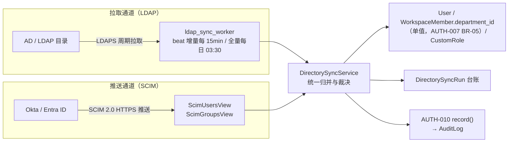
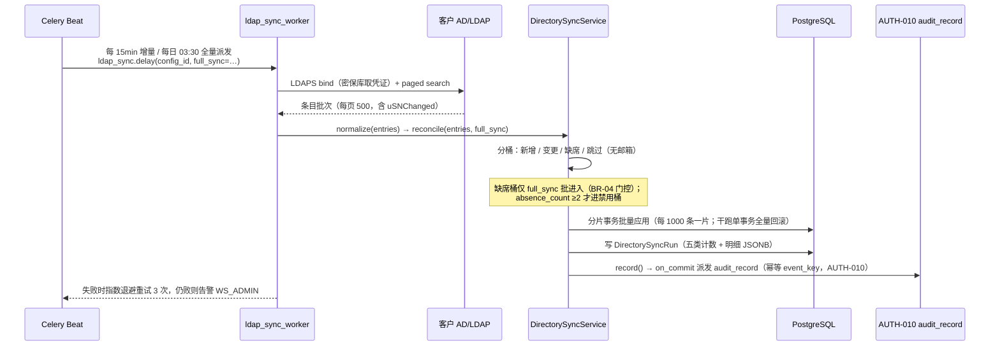
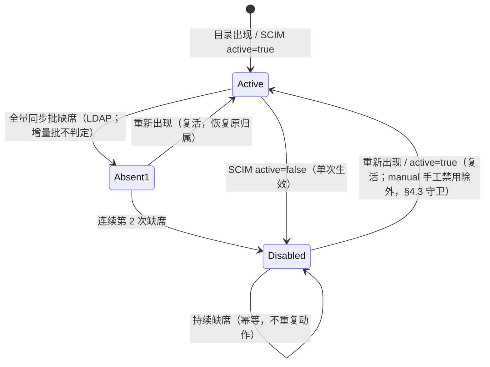

# LDAP / SCIM 账号同步

| 元信息项 | 内容 |
| --- | --- |
| 文档编号 | AUTH-011 |
| 所属迭代 | P4：远期增强（第 13 周起，签约驱动排期） |
| 优先级 | P4（企业版增强 / 安全与合规价值线） |
| 所属模块 | M1-AUTH 账号与权限 |
| 文档状态 | 待评审（Draft） |
| 最后更新日期 | 2026-09-06 |
| 修复摘要 | 2026-09-05 R1 评审 10 项修复：①缺席判定 full_sync 门控（增量批跳过，防批量误禁用）；②待开通/裁决队列 `DirectoryPendingAction` 落库 + `identity_source`/`is_sync_protected` 落映射表；③审计挂接对齐 AUTH-010 `record()` 契约；④`request_id` 移入 error 对象；⑤成员挂部门改 `WorkspaceMember.department_id` 单值语义；⑥SCIM `/scim/v2/` 信封豁免边界声明；⑦`sync/` 改 202 异步、PUT 白名单纠正；⑧subject/externalId 双层标识表述；⑨水位线改取 max；⑩补越权负向用例（UT-18/19、IT-08、E2E-05）。2026-09-06 R2 复评修复 13 项（3 MAJOR + 5 MINOR + 5 INFO）：①复活分支补 `disabled_at_source != "manual"` 守卫（MAJOR-1，UT-08 伪代码级锁定）；②reconcile 改 1000 条分片事务、干跑单事务 ≤5000，§2.3/§4.3/§4.8/UT-10 四处统一（MAJOR-2）；③补 pending-actions 列表 + resolve 端点、expand_seats 补开通闭环、UT-20~22/IT-09（MAJOR-3，§7.1 同步）；④事件注册表跨文锚点改 AUTH-010 §1.3/§7.1（BR-05）；⑤BR-04「非过滤条件变化」括注机制化为 BR-07 干跑确认 `absence_count=0` 豁免；⑥水位线补跨批只进不退比较守卫（UT-17）；⑦WS_MEMBER 直调 403 码统一 `PERM_WORKSPACE_ADMIN_REQUIRED`（对齐 AUTH-007 先例）；⑧失败告警改重试 3 次仍败条件触发（与 §2.3 时序一致）；⑨`User` 字段事实锚改 sprint-0 INFRA-003（L544 `class User`）；⑩系统主体 actor 改 `"system"`（对齐 AUTH-010 actor_id 枚举 BR-15）；⑪event_key 第五元 run_id 范式变体注；⑫待办 30 天过期补每日维护 beat 任务；⑬03:30 双锁并发窗口分层说明 |
| 上游依据 | `docs/需求文档.md` §3.1 企业版专属节、§8.2 P4 列（账号与权限行） |
| 前置依赖 | `AUTH-009`（SSO：SAML/OIDC 与 JIT 开通，身份面同窗）、`AUTH-007`（部门树，目录同步落点）、`AUTH-008`（自定义角色，映射目标）、`AUTH-010`（审计管道，同步留痕） |
| 下游依赖 | `AUTH-012`（多租户身份隔离复用同步管道）、P4 合规报表 |
| 架构基线 | [`api-conventions.md`](../architecture/api-conventions.md) §3.2 / §4 / §7.2 / §8 / §13.1、[`rbac-permission-model.md`](../architecture/rbac-permission-model.md) §2 / §4 / §8 |
| 竞品参考 | Ones（LDAP/AD On-Premises 同步 + SCIM）、Plane（无 LDAP，SSO 仅 OIDC 且企业版）、GitLab（LDAP group sync）、Okta SCIM 范式 |

> **范围声明**：本文档交付两条企业身份源通道——**LDAP/AD 拉取式目录同步**（我方周期性拉取）与 **SCIM 2.0 推送式开通**（IdP 主动推送）。两者共用同一张映射表与同一套冲突裁决规则。SAML/OIDC 登录协议面归 `AUTH-009`，本文档只消费其 `SSOAccount` 身份绑定结果，不重复实现。

---

## 1. 概述

### 1.1 功能定位

企业客户的真实账号源在 **AD/LDAP 目录** 或 **云 IdP（Okta / Entra ID / 飞连 / 竹云）** 中。没有目录同步时，管理员需要手工在 RabbitProjects 逐个建号、逐个禁用——500 人规模的组织每季度入离职变动约 30-60 人次，手工维护必然漏禁（离职账号残留 = 安全事故），这是企业采购的硬性阻断项。

AUTH-011 交付一个可独立售卖的「身份源打通」能力包：

| 交付项 | 说明 |
| --- | --- |
| LDAP 目录同步 | 周期拉取 AD/LDAP 用户与组，自动开通 / 变更 / 禁用账号，按组映射部门与角色 |
| SCIM 2.0 服务端 | 接受 IdP 推送的 User/Group 开通、更新、禁用事件，幂等落库 |
| 冲突裁决 | 邮箱为主键的统一身份归并规则（本地账号 × SSO 账号 × 目录账号三方归并） |
| 同步留痕 | 每次同步产生 `DirectorySyncRun` 台账（新增/变更/禁用/跳过/失败五类计数 + 逐条明细） |
| 干跑（Dry Run） | 同步策略变更后先干跑输出影响清单，确认后才允许真实执行 |

### 1.2 启动条件（签约驱动）

| 条件 | 判定 |
| --- | --- |
| 商业条件 | 客户签约企业版且合同含「身份源集成」条款；许可 Seats ≥ 50（小客户手工维护成本可接受，不推销） |
| 技术前置 | 企业版 V1.0（Sprint 9）已发布；`AUTH-009` SSO 上线且至少一个客户生产可用 |
| 选型前置 | 收集客户目录类型（AD / OpenLDAP / 云 IdP）、是否允许出域连接（私有化部署无障碍；SaaS 需客户开放 LDAPS 或改用 SCIM） |
| 安全前置 | 安全评审通过：bind 凭证入密保库存储、LDAPS/StartTLS 强制、同步操作全量入审计 |

### 1.3 独立交付判定

本能力包**不依赖其他 P4 文档**，满足以下全部条件即判定独立交付完成：

1. AD 环境（客户提供测试域或本团队 `docs/testing/ad-fixture` 容器）完成全量 + 增量同步各一轮，台账计数与目录实况一致。
2. Okta 或 Entra ID 沙盒完成 SCIM 开通 → 变更 → 禁用全链路，幂等重放不产生重复账号。
3. 既有客户零回归：未启用目录同步的工作空间行为与企业版 V1.0 完全一致（API v1 契约不变）。
4. 安全评审表（§4.7）签字归档。

### 1.4 目标用户

| 用户 | 场景 | 关注点 |
| --- | --- | --- |
| 客户 IT 管理员 | 入职 50 人批量开通；离职当天禁用 | 目录里改一次，系统 15 分钟内生效；禁用不可遗漏 |
| 安全合规官 | 季度权限审计 | 任何账号的开通/禁用都有来源记录（谁同步、何时、依据哪条目录记录） |
| 实施工程师 | 私有化交付时对接客户 AD | 连接可测试、映射可配置、失败有明确报错，不需要改代码 |

### 1.5 前置依赖说明

| 依赖文档 | 依赖内容 | 缺失后果 |
| --- | --- | --- |
| `AUTH-009` | `IdentityProvider` / `SSOAccount` 模型、`subject` 绑定锚范式（SAML NameID / OIDC `sub`；目录/SCIM 侧标识字段名为 `externalId`，双层表述见 §2.1）、JIT 开通代码路径 | 目录同步与 SSO 各建一份身份绑定，同一用户两个账号 |
| `AUTH-007` | `Department` 树与成员归属 API（`WorkspaceMember.department_id` 单值） | 同步来的部门归属无处落 |
| `AUTH-008` | `CustomRole` 权限码集合与角色挂接 API | 组→角色映射无目标 |
| `AUTH-010` | `record()` 统一写入契约（幂等 `event_key` + 事务 on_commit 派发，事件须在注册表登记） | 同步留痕需自建管道，重复造轮子 |

### 1.6 竞品参考结论（详见第 6 章）

- **Ones**：私有化版 LDAP/AD 同步是标准能力——周期全量拉取、组映射部门、离职自动禁用；SCIM 在其国际化版提供。同步粒度为「全量覆盖式」，无干跑。
- **GitLab**：LDAP group sync 以 `cn` 匹配组名，提供 `ldap:check` rake 干跑任务；其「blocked on LDAP disable」语义与本系统一致。
- **Okta SCIM 范式**：`POST /Users` 幂等靠 `externalId` + `userName` 唯一约束；`active=false` 即禁用而非删除；Group push 独立开关。
- **本系统取舍**：采纳 GitLab 干跑 + Okta 幂等语义；**不采纳** Ones 的「全量覆盖式禁用」（网络分区时会误禁全员），改为「连续两次同步缺席才禁用」的双确认机制（§2.4）。

---

## 2. 业务逻辑

### 2.1 两条通道的统一模型



| 维度 | LDAP 通道 | SCIM 通道 |
| --- | --- | --- |
| 方向 | 我方拉取（outbound 连接客户目录） | IdP 推送（inbound 到我方端点） |
| 典型部署 | 私有化（目录在内网可达） | SaaS / 云 IdP 客户 |
| 时效 | 周期 15 分钟（可配 5-1440） | 准实时（秒级） |
| 幂等键 | 目录侧 `objectGUID` / `entryUUID` | `externalId`（IdP 侧主键） |
| 组语义 | LDAP group → 部门 + 角色 | SCIM Group → 部门 + 角色 |
| 互斥性 | 同一工作空间**只允许启用一条通道**（BR-01） | 同左 |

> **标识双层语义（subject / externalId）**：SCIM 协议（RFC 7643）中资源主体标识是 `subject`（schema 语义的 `id`），`externalId` 是 IdP 侧可控的映射字段——两者是不同层的概念。本系统目录映射字段名取 `external_id`（承载 LDAP `objectGUID`/`entryUUID` 或 SCIM `externalId`），作为幂等键与绑定锚；SSO 通道（AUTH-009）的绑定锚则是 `SSOAccount.subject`（SAML NameID / OIDC `sub`）。两通道标识互不复用，身份归并仅经小写邮箱（BR-02）。

### 2.2 业务规则（BR）

| 编号 | 规则 | 说明 |
| --- | --- | --- |
| BR-01 | 单通道互斥 | 一个 Workspace 同时只能启用 `ldap` 或 `scim` 一条通道；切换前必须停用旧通道并完成一次「归属移交」干跑 |
| BR-02 | 邮箱主键 | 身份归并的唯一键是小写规范化邮箱（`lower(trim())`）；目录记录无邮箱者进「跳过」桶并给出原因 |
| BR-03 | 不开通无席位者 | 许可席位满时，新目录成员进入「待开通」队列（落 `DirectoryPendingAction(kind=pending_provision)`，§4.2）而非直接开通，WS_ADMIN 收到通知；扩容后经 §4.5 `resolve(action=expand_seats)` 补开通闭环；禁止静默失败 |
| BR-04 | 双确认禁用 | LDAP 通道下，某账号连续 **2 次**全量同步均缺席才执行禁用；映射变更干跑确认时对影响清单内映射重置 `absence_count=0`（缺席豁免，防过滤条件变化所致误禁——机制见 BR-07/§4.3 设计表）；**缺席判定仅在全量同步批（`full_sync=True`）执行**——增量批只拿到变更集、没有目录全员视图，做差集会把全员误判缺席（§4.3 门控伪代码）；SCIM 通道以 IdP `active=false` 为准，单次即生效 |
| BR-05 | 禁用不删除 | 任何通道都只做 `is_active=False` 软禁用，历史数据（任务/评论/审批）全部保留；重新出现即复活并恢复原部门与角色（**手工禁用除外**——`disabled_at_source="manual"` 永不自动复活，见 §2.4 字段表/UT-08） |
| BR-06 | 保护本地管理员 | `WS_OWNER`（角色实时判定）与映射记录 `is_sync_protected=True` 的账号永不被同步禁用或改角色（防目录配置错误锁死组织）；保护标记落 `DirectoryUserMapping.is_sync_protected`（`User` 模型无此字段——sprint-0 `INFRA-003` L544 `class User` 已核实，不改 User 模型） |
| BR-07 | 映射变更需干跑 | 修改属性映射 / 组映射 / 过滤条件后，必须先 Dry Run 输出影响清单，由管理员显式确认才生效；确认应用时对影响清单内映射执行 `absence_count=0` 重置（缺席豁免标记，自本轮起重新计双确认——即 BR-04「非过滤条件变化所致」的机制化落地） |
| BR-08 | 凭证最小化 | 系统不存储任何用户目录密码；bind 凭证仅入密保库（KMS/Vault），DB 只存引用句柄 |
| BR-09 | 审计全覆盖 | 每次同步（含干跑）产生台账；每个账号的开通/变更/禁用/复活各产生一条 `AuditLog`（经 AUTH-010 `record()` 写入，§4.3），`actor` 为 `system` 系统主体（快照 `display_name=目录同步`，对齐 AUTH-010 actor_id 枚举 BR-15） |
| BR-10 | 冲突人工裁决 | 同邮箱出现「本地密码账号」与「目录账号」时，默认归并为同一 `User` 并在映射记录标记 `identity_source=merged`（字段落 `DirectoryUserMapping.identity_source`，`User` 模型无此字段——sprint-0 `INFRA-003` L544 已核实）；归并动作不可逆，进台账高亮；邮箱变更疑义经 §4.5 `resolve(action=merge)` 人工闭环（§2.6） |
| BR-11 | 组映射幂等 | 组→部门/角色映射按「增量计算 + 差异应用」，重复执行不产生重复归属记录 |
| BR-12 | 失败降级 | 单次同步失败（连接超时/凭证失效）只告警不动作；**绝不**因同步失败批量禁用账号 |

### 2.3 LDAP 同步流程



| 步骤 | 关键决策 |
| --- | --- |
| 全量 vs 增量 | 默认每 15 分钟增量（`uSNChanged`/`modifyTimestamp` 水位线），每日 03:30 一次全量校准；水位线存 `LdapDirectoryConfig.sync_cursor`，推进取本批 **max(uSNChanged)**（乱序/并发写入下取「末条」会回退漏事件），且**跨批只进不退**——新值与现值比较、仅更大才前移（守卫全量批/旧导出重放致游标回退，§4.4 代码、UT-17）；**缺席判定仅全量批执行**（BR-04），增量批跳过 |
| 分页 | 强制 paged results（page=500），拒绝不分页拉取（防大目录 OOM） |
| 过滤 | 管理员可配 `user_filter`（如 `(&(objectClass=user)(!(userAccountControl:1.2.840.113556.1.4.803:=2)))`），保存时服务端语法校验 |
| 属性映射 | `mail→email`、`displayName→display_name`、`department→部门路径`、`title→job_title`；可自定义 JSON 映射表 |

### 2.4 缺席双确认状态机



| 字段 | 语义 |
| --- | --- |
| `absence_count` | 连续缺席次数，重新出现即清零；禁用动作只在 `absence_count` 从 1→2 的跃迁点执行一次 |
| `disabled_at_source` | `ldap_absent` / `scim_inactive` / `manual`——手工禁用优先级最高，同步永不自动复活手工禁用账号（BR-06 延伸） |

> 缺席判定伪代码见 §4.3 `_reconcile_absent`：仅 `full_sync=True` 批次进入，增量批直接返回——增量变更集不携带目录全员视图，做差集等价于「全员缺席」，会触发批量禁用事故。

### 2.5 SCIM 服务端语义

| SCIM 操作 | 端点 | 系统动作 | 幂等处理 |
| --- | --- | --- | --- |
| 开通 | `POST /scim/v2/Users` | 按 `userName`（=邮箱）查重：存在则 409 转 200 返回既有（Okta 容忍）；不存在则创建待激活账号 | `externalId` 唯一约束兜底 |
| 全量更新 | `PUT /scim/v2/Users/{id}` | 覆盖式更新映射属性（`PUT` 为 RFC 7644 §3.5.1 协议规定方法，随 §2.5 协议豁免，不受 api-conventions §3.2 PUT 白名单约束） | `meta.version` ETag 不匹配返回 409 |
| 补丁 | `PATCH /scim/v2/Users/{id}` | 仅支持 `replace active` / `replace name` / `replace emails` 三类 op | 操作日志按 `externalId+op 哈希` 去重 |
| 禁用 | `PATCH … active=false` | 单次生效软禁用（BR-04） | 重复禁用幂等 200 |
| 组推送 | `POST /scim/v2/Groups` 等 | 组 → 部门/角色映射（同 LDAP 组映射引擎） | 成员增删按差集应用（BR-11） |
| 删除 | `DELETE /scim/v2/Users/{id}` | **拒绝物理删除**：按禁用处理，返回 204 | 符合 BR-05 |

SCIM 认证：每工作空间一枚 `ScimToken`（`scim_` 前缀，SHA-256 落库仅存哈希），走 `Authorization: Bearer`；token 泄露可一键吊销重签，吊销动作入审计。

> **响应信封豁免边界（⑥）**：`/scim/v2/` 前缀端点为 RFC 7643/7644 标准协议端点，**按协议豁免统一响应信封**——请求/响应使用 SCIM schema（`schemas` / `meta` / `Resources` 等），错误返回 SCIM `Errors` 结构（数字 `status` + `detail`），HTTP 语义遵循 RFC 7644 §3（如唯一性冲突 409 `uniqueness`）。豁免**仅限 `/scim/v2/` 前缀**；其余 directory 管理端点（`/api/v1/workspaces/{slug}/directory/…`）一律走 api-conventions §4 统一信封，无豁免。

### 2.6 身份归并与冲突裁决

同邮箱三方归并的裁决矩阵（BR-02 / BR-10）：

| 既有身份 | 目录记录到达时 | 裁决 |
| --- | --- | --- |
| 无账号 | — | 创建 `User`（`identity_source=directory`），随机口令置不可用，强制走 SSO/邀请设密 |
| 本地密码账号 | 同邮箱 | 归并：绑定 `DirectoryUserMapping`，`identity_source` 改为 `merged`；台账高亮，通知本人 |
| SSO 账号（AUTH-009） | 同邮箱 | 归并：SSO 绑定保留，目录映射叠加；登录仍走 SSO |
| 已禁用目录账号 | 重新出现 | 复活：恢复 `is_active` + 原部门 + 原角色（`DirectoryUserMapping.snapshot` 回放） |
| 目录邮箱变更 | 老邮箱缺席 + 新邮箱出现 | **不自动归并**（防冒名），进「人工裁决」队列（落 `DirectoryPendingAction(kind=manual_review)`，§4.2），WS_ADMIN 经 §4.5 `resolve(action=merge)` 确认后合并 |

---

## 3. UI/UX 设计

### 3.1 页面清单与信息架构

| 页面 | 路由 | 入口 | 核心任务 |
| --- | --- | --- | --- |
| 身份源总览 | `/{ws}/settings/directory` | 工作空间设置 → 身份源 | 查看通道状态、最近同步、待办（待开通/人工裁决） |
| LDAP 配置 | `/{ws}/settings/directory/ldap` | 总览 → 配置 | 连接参数、属性映射、组映射、过滤、周期 |
| SCIM 配置 | `/{ws}/settings/directory/scim` | 总览 → 配置 | 端点 URL、Token 生成/吊销、属性映射 |
| 同步台账 | `/{ws}/settings/directory/runs` | 总览 → 台账 | 每次同步五类计数、明细下钻、失败原因 |
| 干跑确认 | `/{ws}/settings/directory/dry-run/{runId}` | 映射变更后强制跳转 | 影响清单审阅 → 确认执行 / 放弃 |

### 3.2 身份源总览线框

```
┌──────────────────────────────────────────────────────────────────┐
│ 设置 / 身份源                                    [? 帮助文档]      │
├──────────────────────────────────────────────────────────────────┤
│ ┌─ 当前通道 ──────────────────────────────────────────────────┐  │
│ │  ● LDAP/AD 同步   已启用 · 每 15 分钟                        │  │
│ │  目录: ldaps://ad.corp.example:636  (base: OU=Staff,DC=…)   │  │
│ │  最近同步: 2026-09-01 14:30 · 成功 · +3 变更 12 缺席 0       │  │
│ │  [立即同步]  [干跑一次]  [修改配置]  [停用通道…]              │  │
│ └─────────────────────────────────────────────────────────────┘  │
│ ┌─ 待办 ──────────────────────────────────────────────────────┐  │
│ │  ⚠ 待开通 (5)   席位不足，请扩容或选择不开通        [处理]    │  │
│ │  ⚠ 人工裁决 (2) 邮箱变更疑似同人，需确认            [裁决]    │  │
│ │  ⚠ 跳过 (1)     目录记录缺邮箱 (CN=svc-printer)     [详情]    │  │
│ └─────────────────────────────────────────────────────────────┘  │
│ 最近 7 天同步趋势  ▁▃▅▃▆▅▃  成功 96/96                            │
└──────────────────────────────────────────────────────────────────┘
```

### 3.3 干跑确认页线框

```
┌──────────────────────────────────────────────────────────────────┐
│ 干跑结果 · 组映射变更                                2026-09-01    │
├──────────────────────────────────────────────────────────────────┤
│ 变更摘要: 组「CN=QA-Team」映射从 部门:质量部 改为 部门:测试中心   │
│                                                                  │
│ 将影响 23 个账号:                                                 │
│ ┌──────────────────────┬────────────┬─────────────────────────┐  │
│ │ 账号                 │ 动作       │ 明细                    │  │
│ ├──────────────────────┼────────────┼─────────────────────────┤  │
│ │ wang.fang@corp.ex…   │ 部门变更   │ 质量部 → 测试中心       │  │
│ │ li.wei@corp.ex…      │ 部门变更   │ 质量部 → 测试中心       │  │
│ │ …(展开全部 23 条)                                             │  │
│ └──────────────────────┴────────────┴─────────────────────────┘  │
│ 新增 0 · 变更 23 · 禁用 0 · 跳过 0                               │
│                                                                  │
│            [放弃变更]                    [确认并应用 →]           │
└──────────────────────────────────────────────────────────────────┘
```

### 3.4 交互规则

| 场景 | 交互 |
| --- | --- |
| 保存映射配置 | 不直接生效；自动触发干跑并跳转确认页；干跑 24h 未确认则过期需重新发起 |
| 停用通道 | 二次确认弹窗说明「已有绑定保留但不再同步；账号不会被禁用」；停用动作入审计 |
| 连接测试 | 配置页「测试连接」按钮即时验证 bind + base DN + 过滤语法，返回样本前 5 条（脱敏） |
| 令牌展示 | `ScimToken` 仅创建时完整展示一次，之后只显示前后各 4 位 |
| 权限 | 仅持有 `directory.manage`（WS_ADMIN+，按 rbac 附录 B 登记）可见身份源菜单；`WS_MEMBER` 无入口（菜单服务端下发剔除）且直调 API 返回 403 `PERM_WORKSPACE_ADMIN_REQUIRED`（对齐 AUTH-007 `department.manage` 先例/api-conventions §8.3 注册码，UT-19） |

---

## 4. 技术架构

### 4.1 数据模型

```python
# apps/api/plane/db/models/directory.py
import uuid
from django.db import models
from plane.db.models.base import BaseModel


class DirectoryChannel(models.TextChoices):
    LDAP = "ldap", "LDAP/AD"
    SCIM = "scim", "SCIM 2.0"


class LdapDirectoryConfig(BaseModel):
    """LDAP 拉取通道配置；每工作空间至多一条 enabled（BR-01）。"""

    workspace = models.ForeignKey(
        "db.Workspace", on_delete=models.CASCADE,
        related_name="ldap_configs",
    )
    name = models.CharField(max_length=64)
    server_uri = models.CharField(max_length=255)          # ldaps://ad.corp:636
    bind_dn = models.CharField(max_length=255)
    bind_secret_ref = models.CharField(max_length=128)     # 密保库句柄，非密文本身
    base_dn = models.CharField(max_length=255)
    user_filter = models.CharField(
        max_length=512,
        default="(&(objectClass=user)(mail=*))",
    )
    attribute_map = models.JSONField(default=dict)         # {"mail": "email", ...}
    group_map = models.JSONField(default=list)             # [{"dn":..., "department":..., "role":...}]
    sync_interval_minutes = models.PositiveSmallIntegerField(default=15)
    use_starttls = models.BooleanField(default=False)
    sync_cursor = models.CharField(max_length=64, blank=True)  # uSNChanged 水位线
    is_enabled = models.BooleanField(default=False)

    class Meta:
        db_table = "directory_ldap_config"
        constraints = [
            models.UniqueConstraint(
                fields=["workspace"],
                condition=models.Q(is_enabled=True),
                name="uq_ldap_enabled_per_workspace",
            ),
        ]


class ScimConnector(BaseModel):
    workspace = models.ForeignKey(
        "db.Workspace", on_delete=models.CASCADE,
        related_name="scim_connectors",
    )
    name = models.CharField(max_length=64)
    token_hash = models.CharField(max_length=64, unique=True)   # SHA-256
    token_prefix = models.CharField(max_length=8)               # 展示用 scim_Ab3x
    attribute_map = models.JSONField(default=dict)
    group_map = models.JSONField(default=list)
    is_enabled = models.BooleanField(default=False)
    last_used_at = models.DateTimeField(null=True, blank=True)

    class Meta:
        db_table = "directory_scim_connector"
        constraints = [
            models.UniqueConstraint(
                fields=["workspace"],
                condition=models.Q(is_enabled=True),
                name="uq_scim_enabled_per_workspace",
            ),
        ]
```

### 4.2 映射与台账模型

```python
class DirectoryUserMapping(BaseModel):
    """目录身份 ↔ 本地账号 的唯一映射与复活快照。"""

    workspace = models.ForeignKey("db.Workspace", on_delete=models.CASCADE)
    user = models.ForeignKey(
        "db.User", on_delete=models.CASCADE,
        related_name="directory_mappings",
    )
    channel = models.CharField(max_length=8, choices=DirectoryChannel.choices)
    external_id = models.CharField(max_length=128)         # objectGUID / SCIM externalId
    email_snapshot = models.EmailField()                   # 归并时邮箱（变更检测用）
    absence_count = models.PositiveSmallIntegerField(default=0)
    disabled_at_source = models.CharField(
        max_length=16, blank=True,
    )  # ldap_absent / scim_inactive / manual / ""
    identity_source = models.CharField(
        max_length=16, default="directory",
    )  # directory / merged / sso_merge —— BR-10 来源标记（User 模型无此字段——INFRA-003 L544 已核实，落映射表）
    is_sync_protected = models.BooleanField(default=False)  # BR-06 保护标记：同步永不禁用/改角色
    restore_snapshot = models.JSONField(default=dict)      # {"department_id": ..., "roles": [...]}
    # ↑ department_id 为单值：成员挂部门是 WorkspaceMember.department_id（AUTH-007 BR-05，无中间表）

    class Meta:
        db_table = "directory_user_mapping"
        constraints = [
            models.UniqueConstraint(
                fields=["workspace", "channel", "external_id"],
                name="uq_directory_identity",
            ),
        ]
        indexes = [
            models.Index(fields=["workspace", "email_snapshot"],
                         name="idx_dir_mapping_email"),
        ]


class DirectorySyncRun(BaseModel):
    """每次同步（含干跑）的台账头；明细存 detail JSONB。"""

    class Status(models.TextChoices):
        RUNNING = "running", "执行中"
        SUCCESS = "success", "成功"
        FAILED = "failed", "失败"
        DRY_RUN = "dry_run", "干跑"
        CONFIRMED = "confirmed", "干跑已确认"

    workspace = models.ForeignKey("db.Workspace", on_delete=models.CASCADE)
    channel = models.CharField(max_length=8, choices=DirectoryChannel.choices)
    status = models.CharField(max_length=12, choices=Status.choices,
                              default=Status.RUNNING)
    is_dry_run = models.BooleanField(default=False)
    full_sync = models.BooleanField(default=False)   # 全量批（缺席判定唯一入口）/ 增量批（BR-04）
    triggered_by = models.CharField(max_length=16, default="beat")  # beat/manual/dry_run
    counts = models.JSONField(default=dict)   # {"created":3,"updated":12,"disabled":0,"skipped":1,"failed":0}
    detail = models.JSONField(default=list)   # 逐条 {email, action, reason}
    error = models.TextField(blank=True)
    confirmed_by = models.ForeignKey(
        "db.User", null=True, blank=True, on_delete=models.SET_NULL,
    )
    expires_at = models.DateTimeField(null=True, blank=True)  # 干跑 24h 过期

    class Meta:
        db_table = "directory_sync_run"
        indexes = [
            models.Index(fields=["workspace", "-created_at"],
                         name="idx_dir_run_ws_created"),
        ]


class DirectoryPendingAction(BaseModel):
    """待开通 / 人工裁决队列——总览页「待办」计数的落库支撑（§3.2 待办卡、§4.6 todos）。

    状态机：pending → resolved（管理员处理）/ dismissed（放弃）/ expired（30 天超时或
    引用的干跑过期自动关闭）。同 (workspace, kind, dedup_key) 仅允许一条 pending，
    重复目录事件幂等复用既有行。
    """

    class Kind(models.TextChoices):
        PENDING_PROVISION = "pending_provision", "待开通（席位满）"   # BR-03
        MANUAL_REVIEW = "manual_review", "人工裁决（疑似同人）"       # §2.6 邮箱变更

    workspace = models.ForeignKey("db.Workspace", on_delete=models.CASCADE)
    kind = models.CharField(max_length=20, choices=Kind.choices)
    status = models.CharField(
        max_length=12, default="pending",
    )  # pending / resolved / dismissed / expired
    dedup_key = models.CharField(max_length=200)
    # ↑ 待开通 = 目录 external_id；人工裁决 = "old_email→new_email"，防重复合入队
    payload = models.JSONField(default=dict)
    # ↑ 待开通：{external_id, email, display_name, attrs}；人工裁决：{old_email, new_email, mapping_id}
    source_run = models.ForeignKey(
        "DirectorySyncRun", null=True, blank=True, on_delete=models.SET_NULL,
    )
    resolved_by = models.ForeignKey(
        "db.User", null=True, blank=True, on_delete=models.SET_NULL,
    )
    resolved_action = models.CharField(max_length=32, blank=True)  # provision/merge/dismiss/expand_seats

    class Meta:
        db_table = "directory_pending_action"
        constraints = [
            models.UniqueConstraint(
                fields=["workspace", "kind", "dedup_key"],
                condition=models.Q(status="pending"),
                name="uq_pending_action_dedup",
            ),
        ]
        indexes = [
            models.Index(fields=["workspace", "kind", "status"],
                         name="idx_dir_pending_ws"),
        ]
```

迁移要点：5 表（`directory_ldap_config` / `directory_scim_connector` / `directory_user_mapping` / `directory_sync_run` / `directory_pending_action`）一次迁移建齐，唯一约束同迁移；`uq_*_enabled_per_workspace` 与 `uq_pending_action_dedup` 部分唯一索引依赖 PostgreSQL，`CREATE INDEX CONCURRENTLY` 不适用新表（直接建）；大字段 `detail` 上限 10 万字符，超出截断留 `truncated=true` 标记。**无对上游表的列变更**：`identity_source` / `is_sync_protected` 均落本域 `directory_user_mapping`（`User` 模型经 sprint-0 `INFRA-003` L544 `class User` 核实无此两字段，不改动 `users` 表），成员部门为 `workspace_member.department_id` 单值既有列（AUTH-007）。

### 4.3 归并服务（DirectorySyncService）

```python
# apps/api/plane/directory/services.py
from dataclasses import dataclass, field
from hashlib import sha256

from django.db import transaction
from plane.audit.recorder import record   # AUTH-010 唯一写入入口（内部 on_commit 派发 audit_record）
from plane.db.models import User

# 系统主体快照（BR-09）：id 取 "system" 对齐 AUTH-010 actor_id 枚举
# （UUID v4 字符串 / "system" / None；AUTH-010 BR-15 系统任务 actor=system），域内主体名入 display_name
SYSTEM_DIRECTORY_SYNC = {"id": "system", "type": "system",
                         "display_name": "目录同步（directory_sync）"}


@dataclass
class SyncBuckets:
    created: list = field(default_factory=list)
    updated: list = field(default_factory=list)
    disabled: list = field(default_factory=list)
    skipped: list = field(default_factory=list)
    failed: list = field(default_factory=list)

    def counts(self) -> dict:
        return {k: len(getattr(self, k)) for k in
                ("created", "updated", "disabled", "skipped", "failed")}


class DirectorySyncService:
    """LDAP 与 SCIM 共用的归并裁决核心；所有动作幂等、可干跑。"""

    ABSENCE_THRESHOLD = 2  # BR-04 双确认
    SHARD_SIZE = 1000      # 真实执行分片事务粒度（§4.8）；干跑单事务、条目 ≤ 5000

    def __init__(self, workspace, channel: str, dry_run: bool = False,
                 run_id: str | None = None):
        self.workspace = workspace
        self.channel = channel
        self.dry_run = dry_run
        self.run_id = run_id
        self.buckets = SyncBuckets()

    def reconcile(self, entries: list[dict], *, full_sync: bool) -> SyncBuckets:
        """entries: 规范化后的目录记录 [{external_id, email, attrs...}]。

        事务粒度（§4.8）：真实执行按 `SHARD_SIZE` 分片、每片独立事务——某片异常致
        run 标记 failed 时，**已提交分片保留不回滚**，重跑/续跑按状态前置判断幂等
        承接（本服务所有动作幂等，见下方设计表）；干跑保持单事务
        `set_rollback(True)` 全量回滚（条目 ≤ 5000，UT-10）。

        缺席判定门控（BR-04）伪代码：
            if full_sync:   # 每日校准批：有目录全员视图，可做差集
                absent = 系统内活跃映射 − entries 全员 → 逐条累加 absence_count
            else:           # 增量批：只有变更集，**跳过缺席判定**
                pass        # 水位窗口内的漏检由当日全量批兜底复核
        """
        seen_ids = {e["external_id"] for e in entries}
        if self.dry_run:                     # 干跑：单事务保证回滚原子性
            with transaction.atomic():
                for entry in entries:
                    self._reconcile_one(entry)
                if full_sync:                # BR-04 门控：仅全量批判定缺席
                    self._reconcile_absent(seen_ids)
                transaction.set_rollback(True)  # 干跑：全部回滚
        else:                                # 真实执行：每 1000 条一个独立事务
            for i in range(0, len(entries), self.SHARD_SIZE):
                with transaction.atomic():
                    for entry in entries[i:i + self.SHARD_SIZE]:
                        self._reconcile_one(entry)
            if full_sync:                    # 缺席判定需全员视图，末尾独立片事务
                with transaction.atomic():
                    self._reconcile_absent(seen_ids)
        return self.buckets

    def _reconcile_one(self, entry: dict) -> None:
        email = (entry.get("email") or "").strip().lower()
        if not email:  # BR-02
            self.buckets.skipped.append(
                {"external_id": entry["external_id"], "reason": "missing_email"})
            return
        mapping = DirectoryUserMapping.objects.filter(
            workspace=self.workspace, channel=self.channel,
            external_id=entry["external_id"],
        ).select_related("user").first()
        if mapping is None:
            self._create_or_merge(entry, email)
            return
        if not mapping.user.is_active and mapping.disabled_at_source != "manual":
            self._reactivate(mapping)          # 复活 + 快照回放（BR-05）
            return
        if not mapping.user.is_active:
            # 手工禁用不同步复活（UT-08 伪代码级锁定）：§2.4 字段表——手工禁用
            # （disabled_at_source="manual"）优先级最高，同步永不自动复活手工禁用
            # 账号（BR-06 延伸：停职/调查等管理员决策不被全量批推翻）
            return
        if self._attrs_changed(mapping, entry):
            self._apply_update(mapping, entry)  # 变更：显示名/部门/角色

    def _reconcile_absent(self, seen_ids: set) -> None:
        """仅 full_sync 批调用（见 reconcile 门控）；增量批不进入本方法。"""
        if self.channel == DirectoryChannel.SCIM:
            return  # SCIM 以 active=false 推送为准，无缺席概念
        qs = DirectoryUserMapping.objects.filter(
            workspace=self.workspace, channel=self.channel,
            user__is_active=True,
        ).exclude(external_id__in=seen_ids).exclude(
            disabled_at_source="manual")
        for mapping in qs.select_related("user"):
            mapping.absence_count += 1
            if mapping.absence_count >= self.ABSENCE_THRESHOLD:
                self._disable(mapping, source="ldap_absent")
            else:
                mapping.save(update_fields=["absence_count", "updated_at"])

    def _disable(self, mapping, *, source: str) -> None:
        user = mapping.user
        if self._is_protected(mapping):        # BR-06：WS_OWNER 角色或 is_sync_protected 标记
            self.buckets.skipped.append(
                {"email": user.email, "reason": "sync_protected"})
            return
        mapping.restore_snapshot = self._snapshot_membership(user)
        mapping.disabled_at_source = source
        user.is_active = False
        if not self.dry_run:
            user.save(update_fields=["is_active", "updated_at"])
            mapping.save()
            record(                            # AUTH-010 契约：record 内部事务 on_commit 派发
                event_key=sha256(              # 幂等键范式 sha256(domain|object_id|op|actor|occurred)
                    f"directory|{mapping.external_id}|disable|"
                    f"system|{self.run_id}".encode()).hexdigest(),
                # ↑ 第五元以 run_id 替代 occurred_at_ms（范式变体，对齐 AUTH-010 §1.3 契约形态）：
                #   同 run 重放同键、跨 run 重做可再次留痕，幂等颗粒度对齐台账批次
                category="member", action="directory_disabled",
                # ↑ 新 action 按 AUTH-010 §1.3/§7.1 事件注册表登记（AUTH-010 BR-05：新事件须注册；
                #   AUTH-010 文档待回改：§1.3 注册表补登记 directory_created / directory_updated /
                #   directory_disabled / directory_restored 四枚举）
                workspace_id=str(self.workspace.id),
                actor=SYSTEM_DIRECTORY_SYNC,
                obj=user,
                detail={"channel": self.channel, "source": source,
                        "run_id": str(self.run_id)},
            )
        self.buckets.disabled.append({"email": user.email, "source": source})
```

| 设计点 | 说明 |
| --- | --- |
| 分片事务 + 干跑回滚 | 真实执行按 1000 条分片、每片独立事务（§4.8）；某片异常致 run 标记 failed 时**已提交分片保留、不回滚**，重跑按状态前置判断幂等承接（无重复开通/禁用/复活）；干跑保持单事务 `set_rollback(True)` 零副作用但桶计数真实（条目 ≤ 5000，UT-10） |
| 缺席门控 | `_reconcile_absent` 仅 `full_sync=True` 批进入；增量批没有目录全员视图，做差集=全员误判缺席（BR-04/BR-12 双保险，漏检由当日全量批兜底复核） |
| 幂等 | 所有动作按当前状态前置判断（已禁用不重复禁用）；审计经 AUTH-010 `record()` 三层去重（`event_key` 唯一兜底） |
| 复活守卫 | `_reconcile_one` 复活分支带 `disabled_at_source != "manual"` 条件——手工禁用账号即使重新出现在目录中也保持禁用（§2.4/BR-06 延伸，UT-08 按此实现必然通过） |
| manual 盖章钩子 | `User.is_active` True→False 时由**本域 post_save 信号接收器**盖章，同步置该用户全部 DirectoryUserMapping 的 `disabled_at_source="manual"`（随本文档交付，§7.1 后端行）——守卫的前提是 manual 已被盖章，无此钩子则守卫落空（UT-23 锁定）。**注意：不得挂接 TEAM-002 成员移除路径**——成员行软删（WorkspaceMember.deleted_at+is_active=False）≠ 账号禁用（User.is_active），误挂会让被移除成员永久豁免缺席禁用；管理员禁用账号的产品端点归账号治理能力（AUTH-001 状态机节已声明暂未立项，其落地即自动被本钩子覆盖） |
| 干跑确认豁免 | `runs/{id}/confirm/` 应用成功后对影响清单内映射重置 `absence_count=0`（BR-04/BR-07 缺席豁免：过滤条件变化轮次重新计双确认，防「目录仍存在但暂被过滤」账号误禁） |
| 保护名单 | `_is_protected` = `WS_OWNER` 角色判定 或 `mapping.is_sync_protected`（BR-06） |

### 4.4 Celery 任务与 LDAP 拉取

```python
# apps/api/plane/directory/tasks.py
from celery import shared_task
from django.db import transaction


@shared_task(bind=True, queue="directory",
             autoretry_for=(LdapConnectionError,),
             retry_backoff=True, retry_kwargs={"max_retries": 3})
def ldap_sync(self, config_id: str, *, full_sync: bool = False,
              dry_run: bool = False, triggered_by: str = "beat") -> str:
    config = LdapDirectoryConfig.objects.select_related("workspace").get(
        id=config_id, is_enabled=True)
    run = DirectorySyncRun.objects.create(
        workspace=config.workspace, channel="ldap",
        is_dry_run=dry_run, full_sync=full_sync, triggered_by=triggered_by)
    try:
        entries = LdapClient(config).paged_search(page_size=500,
                                                  full_sync=full_sync)
        svc = DirectorySyncService(config.workspace, "ldap", dry_run=dry_run,
                                   run_id=str(run.id))
        buckets = svc.reconcile(entries, full_sync=full_sync)
        run.status = "dry_run" if dry_run else "success"
        run.counts = buckets.counts()
        run.detail = _serialize_buckets(buckets)
        if not dry_run and entries:
            # 水位线批内取 max(uSNChanged)（乱序/并发写入下取「末条」会回退漏事件），
            # 跨批只进不退：与现值比较、仅更大才前移（守卫全量批/旧导出重放致回退，UT-17）
            batch_max = str(max(int(e["usn_changed"]) for e in entries))
            if not config.sync_cursor or int(batch_max) > int(config.sync_cursor):
                config.sync_cursor = batch_max
                config.save(update_fields=["sync_cursor", "updated_at"])
    except Exception as exc:                      # noqa: BLE001 — 台账必须落失败原因
        run.status, run.error = "failed", str(exc)[:2000]
        run.save()
        if self.request.retries >= self.max_retries:   # 重试 3 次仍败才告警（与 §2.3 时序一致）
            notify_workspace_admins.delay(            # BR-12：只告警不动作
                config.workspace_id, "directory_sync_failed",
                {"run_id": str(run.id), "error": run.error[:200]})
        raise
    run.save()
    return str(run.id)
```

| 要点 | 说明 |
| --- | --- |
| 独立队列 | `directory` 队列与 `webhook`/`activity` 隔离，避免大目录同步阻塞通知投递 |
| 全量/增量派发 | beat 每 15min 派发增量（`full_sync=False`，跳过缺席判定），每日 03:30 派发全量校准（`full_sync=True`，缺席判定唯一入口）；两任务 Redis 锁分键 `dirsync:{config_id}:delta` / `:full` 互不阻塞 |
| 派发时机 | API 触发（立即同步/干跑）一律 `transaction.on_commit`；beat 触发无需 |
| 重叠防护 | beat 派发前查同 config 同键有无 `running` 状态 run，有则跳过本轮（Redis 锁 `dirsync:{config_id}:delta`/`:full`，TTL=interval）。增量/全量双锁分键不互阻，03:30 存在同刻并发窗口，分层兜底无碍正确性：缺席计数仅全量批累加且阈值 2（单次并发至多累加 1 次、不达禁用线），且 BR-01 通道互斥为应用层语义、同空间任一时刻仅一条通道在写 |
| 待办超时 | 每日维护 beat 任务扫描 `DirectoryPendingAction(status="pending", created_at < now-30d)` 置 `expired`（引用干跑已过期的一并关闭；幂等可重入，§4.2 状态机）——复用 AUTH-010 每日维护任务范式（分区/清理/校验） |
| 席位检查 | `_create_or_merge` 内查许可席位，满则落 `DirectoryPendingAction(kind=pending_provision)` 并通知（BR-03），不抛异常中断整批 |

### 4.5 API 端点

| 方法 | 路径 | 说明 | 权限码 |
| --- | --- | --- | --- |
| GET | `/api/v1/workspaces/{slug}/directory/` | 通道总览（启用状态 + 最近 run + 待办计数，待办计数来自 `DirectoryPendingAction`） | `directory.manage` |
| POST | `/api/v1/workspaces/{slug}/directory/ldap/` | 创建 LDAP 配置（201 + Location；enabled 部分唯一约束 BR-01） | `directory.manage` |
| PATCH | `/api/v1/workspaces/{slug}/directory/ldap/` | 修改周期/过滤/映射（触发干跑强制流程） | `directory.manage` |
| POST | `/api/v1/workspaces/{slug}/directory/ldap/test/` | 连接测试（bind + base + filter 样本 5 条脱敏） | `directory.manage` |
| POST | `/api/v1/workspaces/{slug}/directory/sync/` | 立即同步/干跑 `{"dry_run": false}`——**异步受理：202 Accepted + `task_id`/`status_url`**（api-conventions §13.1） | `directory.manage` |
| GET | `/api/v1/workspaces/{slug}/directory/runs/` | 台账列表（cursor 分页，`per_page` 默认/上限 100，api-conventions §6.3） | `directory.manage` |
| GET | `/api/v1/workspaces/{slug}/directory/runs/{id}/` | 台账明细 | `directory.manage` |
| POST | `/api/v1/workspaces/{slug}/directory/runs/{id}/confirm/` | 确认干跑结果并应用 | `directory.manage` |
| GET | `/api/v1/workspaces/{slug}/directory/pending-actions/?kind=&status=&cursor=&per_page=&ordering=` | 待办队列列表（`kind` ∈ `pending_provision`/`manual_review`、`status` ∈ `pending`/`resolved`/`dismissed`/`expired` 白名单筛选；cursor 分页 `per_page` 默认/上限 100、`ordering` 白名单 `created_at`/`-created_at`，api-conventions §5.4/§6.3） | `directory.manage` |
| POST | `/api/v1/workspaces/{slug}/directory/pending-actions/{id}/resolve/` | 处置裁决：`{"action": "provision\|merge\|dismiss\|expand_seats", …}`（`merge` 附 `merge_target_id`）；成功置 `resolved` 并落 `resolved_by`；非 `pending` 状态重放返回 409 `RESOURCE_STATE_INVALID`（幂等语义，UT-21），`resolved_by`/`resolved_action` 不变 | `directory.manage` |
| PATCH | `/api/v1/workspaces/{slug}/directory/mappings/{id}/` | 映射保护开关：`{"is_sync_protected": true/false}`——保护名单（break-glass 服务账号等）的产品化写入路径，`is_sync_protected=true` 者缺席判定与 SCIM inactive 均不动作（BR-06 第二腿，UT-24） | `directory.manage` |
| POST | `/api/v1/workspaces/{slug}/directory/scim/` | 启用 SCIM 并签发 Token（201，仅本次返回明文；重签调 `POST …/scim/token/`） | `directory.manage` |
| DELETE | `/api/v1/workspaces/{slug}/directory/scim/token/` | 吊销 Token | `directory.manage` |
| * | `/scim/v2/Users`、`/scim/v2/Groups` | SCIM 协议端点（Bearer Token 认证，不走 Session；**按协议豁免统一信封**，返回 SCIM schema，豁免边界见 §2.5） | ScimToken |

> 权限码说明：`directory.manage` 为新码（**按 rbac 附录 B 登记**；rbac §8 注册表当前无 directory 条目——rbac 文档待回改：附录 B / §8 注册表补 `directory.manage` 条目）——角色映射对齐同表 `department.manage`：WS_ADMIN 及以上可用，WS_MEMBER 无权限；登记后同步 rbac §4 前端权限矩阵。原 PUT 端点已按 api-conventions §3.2 白名单纠正：PUT 仅限集合型子资源全量替换，本域配置创建/启用一律 POST、修改 PATCH。

**待办处置闭环（BR-03 / §2.6，对齐 §3.2 待办卡「处理/裁决/详情」按钮）**——`DirectoryPendingAction` 全生命周期经上述两端点闭合，不再止步入队：

| action | 适用 kind | 服务端语义 |
| --- | --- | --- |
| `provision` | `pending_provision` | 重跑席位检查，有余量即按 `payload` 落开通（复用 `_create_or_merge` 分支）并置 `resolved`；席位仍满返回 409 `RESOURCE_STATE_INVALID`（不静默失败） |
| `expand_seats` | `pending_provision` | **扩容后补开通路径**：管理员完成许可扩容后调用，服务端重跑席位检查 → 按 `payload` 补开通（BR-03 隐含路径的显式落地），一条端点内完成「扩容确认 + 补开通」 |
| `merge` | `manual_review` | 按 `merge_target_id` 将老邮箱映射归并到新邮箱（BR-10 语义，不可逆，台账高亮、通知本人） |
| `dismiss` | 任一 | 置 `dismissed`，不做任何账号动作（如确认非同人） |

「详情」复用列表行 `payload` 字段展开，不设独立端点。四种处置各落一条 `AuditLog`（经 AUTH-010 `record()`，`actor` 为操作管理员、`resolved_by` 同人），处置结果同步刷新总览待办计数（§4.6 `fetchOverview`）。

**成功示例** — `POST …/directory/sync/` → `202 Accepted`：

```json
{
  "status": "success",
  "data": {
    "task_id": "01J6ZQK4M2N8PXRVTBWY3HD5EA",
    "state": "queued",
    "status_url": "/api/v1/tasks/01J6ZQK4M2N8PXRVTBWY3HD5EA/",
    "run_id": "7c2e9f4a-1b3d-4e5f-8a6b-9c0d1e2f3a4b"
  }
}
```

> `task_id`/`status_url` 为 api-conventions §13.1 异步任务范式；`run_id` 为台账 UUID v4 主键（api-conventions §4.5）。成功信封**不含 `request_id`**——请求追踪 ID 成功时经响应头 `X-Request-Id` 承载（api-conventions §4.4），失败时仅在 `error.request_id`（api-conventions §4.2），禁止放 `meta`。

**错误示例** — 另一通道已启用（BR-01）：

```json
{
  "status": "error",
  "error": {
    "code": "RESOURCE_STATE_INVALID",
    "message": "已启用 SCIM 通道，须先停用并完成归属移交干跑后才能启用 LDAP",
    "details": [{"field": "channel", "code": "STATE",
                 "message": "当前启用通道: scim"}],
    "request_id": "01J6ZQK6H2RM8P5W3N7T1VY4ZC"
  }
}
```

**错误示例** — 未确认干跑直接改映射：

```json
{
  "status": "error",
  "error": {
    "code": "RESOURCE_STATE_INVALID",
    "message": "映射变更需先完成干跑确认",
    "details": [{"field": "group_map", "code": "REQUIRED",
                 "message": "存在未确认的干跑 7c2e9f4a…，请先确认或放弃"}],
    "request_id": "01J6ZQK7J9SN2Q6X4M8W0VZ3AD"
  }
}
```

### 4.6 前端 Store（MobX）

```typescript
// apps/web/src/modules/directory/directory.store.ts
import { makeAutoObservable, runInAction } from "mobx";

interface IDirectoryOverview {
  channel: "ldap" | "scim" | null;
  enabled: boolean;
  lastRun: { id: string; status: string; counts: Record<string, number> } | null;
  // todos 计数来自后端对 DirectoryPendingAction 按 kind/status=pending 的聚合（§4.2）
  todos: { pendingProvision: number; manualReview: number; skipped: number };
}

export class DirectoryStore {
  overview: IDirectoryOverview | null = null;
  dryRunDetail: ISyncRunDetail | null = null;
  isSyncing = false;

  constructor(private workspaceSlug: string) {
    makeAutoObservable(this);
  }

  get hasBlockingTodos(): boolean {
    const t = this.overview?.todos;
    return !!t && (t.pendingProvision + t.manualReview) > 0;
  }

  async triggerSync(dryRun: boolean) {
    this.isSyncing = true;
    try {
      const res = await directoryService.sync(this.workspaceSlug, dryRun);
      if (dryRun) await this.pollRunUntilDone(res.data.run_id);
      return res.data.run_id;
    } finally {
      runInAction(() => { this.isSyncing = false; });
    }
  }

  async confirmDryRun(runId: string) {
    await directoryService.confirmRun(this.workspaceSlug, runId);
    await this.fetchOverview();   // 应用后刷新待办与通道状态
  }

  async resolvePendingAction(
    actionId: string,
    payload: { action: "provision" | "merge" | "dismiss" | "expand_seats";
               merge_target_id?: string },
  ) {
    // §3.2 待办卡「处理/裁决」按钮 → §4.5 resolve 端点（409 时引导改用 expand_seats）
    await directoryService.resolvePendingAction(this.workspaceSlug, actionId, payload);
    await this.fetchOverview();   // 处置后刷新待办计数（闭环对账）
  }
}
```

| 前端规则 | 说明 |
| --- | --- |
| 轮询 | `sync/` 202 受理后按 2s 起指数放大至 10s 轮询（api-conventions §13.1），经 `status_url`/`run_id` 取 run 状态，`success/failed` 即止；亦消费 live 完成事件避免空轮询 |
| SWR 缓存键 | `DIRECTORY_OVERVIEW(ws)` / `DIRECTORY_RUNS(ws, cursor)`，确认干跑后 mutate 两个键 |
| 错误呈现 | `RESOURCE_STATE_INVALID`（BR-01/BR-07）弹引导对话框而非 Toast（需用户决策） |

### 4.7 安全评审清单（签字归档项）

| # | 检查项 | 标准 |
| --- | --- | --- |
| 1 | bind 凭证 | 仅密保库句柄落 DB；日志/台账/审计任何位置不出现密文；连接测试不回显 |
| 2 | 传输加密 | `ldap://` 明文连接拒绝保存（强制 `ldaps://` 或 StartTLS）；证书校验不可关闭（私有化自签 CA 走受信根导入，非 skip-verify） |
| 3 | SCIM Token | SHA-256 落库、仅创建时明文展示一次、可吊销；SCIM 端点独立限流 60/min（`AUTH_INVALID_TOKEN` 连续 10 次封 IP 15min） |
| 4 | 日志脱敏 | 目录条目进台账前剥离 `userPassword`/`unicodePwd` 等敏感属性（黑名单过滤） |
| 5 | 越权面 | SCIM 端点绑定 `workspace`（Token 解析即定位），跨空间 ID 一律 `RESOURCE_NOT_FOUND`（存在性隐藏，api-conventions §4.3）；管理端点统一 `directory.manage` 校验，WS_MEMBER 直调 403 `PERM_WORKSPACE_ADMIN_REQUIRED`（对齐 AUTH-007 `department.manage` 先例）；无效/过期 Token 401 `AUTH_INVALID_TOKEN`（负向用例 UT-18/19、IT-08、E2E-05） |
| 6 | 注入面 | `user_filter` 保存时做 LDAP 过滤器语法白名单校验 |

### 4.8 性能与规模

| 指标 | 预算 | 手段 |
| --- | --- | --- |
| 1 万账号全量同步 | < 10 min | paged 500/页 + 批量 `bulk_create`/`bulk_update`（每批 500）；部门/角色差集应用 |
| 同步期 DB 压力 | 分批事务 < 30s/批 | 每 1000 条一个事务（干跑除外——干跑单事务保证回滚原子性，限定干跑条目 ≤ 5000） |
| SCIM 开通延迟 | P95 < 500ms | 同步路径无 Celery 跳转，直接写库；审计异步 |
| 缺席扫描（仅全量批） | 1 万映射 < 5s | `exclude(external_id__in=…)` 走 `uq_directory_identity` 索引；增量批跳过（BR-04 门控） |

---

## 5. 测试用例

### 5.1 单元测试（UT）

| 编号 | 用例 | 断言 |
| --- | --- | --- |
| UT-01 | 无邮箱目录记录 | 进 skipped 桶，reason=`missing_email`，不落库 |
| UT-02 | 邮箱大小写/空格归一 | `  Wang.Fang@Corp.com ` 与 `wang.fang@corp.com` 归并为同一人 |
| UT-03 | 首次同步开通 | 创建 `User`（不可用口令）+ `DirectoryUserMapping`，`identity_source=directory` |
| UT-04 | 本地账号归并 | 同邮箱本地账号被绑定，`identity_source=merged`，台账高亮 |
| UT-05 | 全量批缺席一次 | `full_sync=True` 批缺席：`absence_count=1`，账号仍 active |
| UT-06 | 连续两次全量批缺席 | 第二次后 `is_active=False`，`disabled_at_source=ldap_absent`，快照已存 |
| UT-07 | 复活 | 重新出现后 `is_active=True` 且部门/角色按快照回放 |
| UT-08 | 手工禁用不复活 | `disabled_at_source=manual` 的账号重新出现也不复活——伪代码级锁定：命中 §4.3 `_reconcile_one` 守卫 `if not mapping.user.is_active and mapping.disabled_at_source != "manual"` 不成立，落入显式 return 分支：`is_active` 保持 False、无 `directory_restored` 审计、快照/缺席计数不变（按该实现必然通过） |
| UT-09 | 保护名单 | `WS_OWNER`/`is_sync_protected=True` 缺席两次仍 active，进 skipped |
| UT-10 | 干跑回滚 | dry_run（单事务 `set_rollback`，§4.8 条目 ≤ 5000）后数据库零变化，桶计数正确；真实执行分片事务（每 1000 条一片）中途失败时已提交分片保留、重跑幂等无重复动作（§4.3 设计表） |
| UT-11 | SCIM 重复开通 | 同 `externalId` 第二次 POST 返回 200 既有账号，不重复创建 |
| UT-12 | SCIM DELETE | 按禁用处理，返回 204，历史任务保留 |
| UT-13 | 席位满 | 新成员落 `DirectoryPendingAction(kind=pending_provision)`（pending 去重），WS_ADMIN 收到通知，批次继续 |
| UT-14 | 单通道互斥 | 启用 LDAP 时启用 SCIM 返回 409 `RESOURCE_STATE_INVALID` |
| UT-15 | 邮箱变更不归并 | 老缺席+新出现落 `DirectoryPendingAction(kind=manual_review)`，不自动合并 |
| UT-16 | 增量批缺席不判定 | `full_sync=False` 时目录缺席账号 `absence_count` 不变、不禁用（BR-04 门控，防批量误禁用） |
| UT-17 | 水位线乱序与跨批守卫 | 批内 `uSNChanged` 乱序到达 `sync_cursor` 取 max 不回退；旧批重放（批 max < 现值）时游标保持不变（跨批只进不退比较守卫，§4.4） |
| UT-18 | SCIM Token 无效/过期 | 无效/过期 Token 访问 `/scim/v2/Users` 返回 401 `AUTH_INVALID_TOKEN`；连续 10 次封 IP 15min（§4.7-3） |
| UT-19 | 普通成员调管理端点 | WS_MEMBER 调 `POST …/directory/sync/` 返回 403 `PERM_WORKSPACE_ADMIN_REQUIRED`（对齐 AUTH-007 `department.manage` 先例）；总览菜单服务端下发剔除 |
| UT-20 | 待办处置四 action | `POST …/pending-actions/{id}/resolve/`：`provision` 有余量即开通并置 `resolved`（`resolved_by` 落操作者）；`merge` 带 `merge_target_id` 归并、`identity_source=merged`、台账高亮；`dismiss` 置 dismissed 零账号动作；`expand_seats` 扩容后重跑席位检查→按 payload 补开通（BR-03 闭环，§4.5） |
| UT-21 | resolve 幂等重放 | 已 `resolved`/`dismissed` 的 action 再次 resolve 返回 409 `RESOURCE_STATE_INVALID`，无二次开通/归并，`resolved_by`/`resolved_action` 不变 |
| UT-22 | 待办列表筛选与分页 | `GET …/pending-actions/?kind=&status=` 组合筛选正确；`per_page>100` 静默截断为 100 且 `meta.degraded=true`（api-conventions §6.3）；非白名单 `ordering` 返回 400 `VALIDATION_INVALID_PARAM`（§5.4） |
| UT-23 | 普通禁用盖章：管理员经用户管理路径 deactivate 目录同步账号 → 钩子置全部映射 `disabled_at_source="manual"` → 次轮全量同步不复活（无 restored 审计） | manual 盖章钩子端到端 |
| UT-24 | 保护开关：`PATCH …/directory/mappings/{id}/` 置 `is_sync_protected=true` 后，缺席判定与 SCIM inactive 均跳过该账号；非 directory.manage 调用 403 | BR-06 第二腿产品化 |

### 5.2 集成测试（IT）

| 编号 | 用例 | 断言 |
| --- | --- | --- |
| IT-01 | AD fixture 容器全量同步 | 1,000 条目录记录 90s 内完成，五类计数与 fixture 清单一致 |
| IT-02 | 增量水位线 | 修改 3 条后增量同步只处理 3 条，`sync_cursor` 批内取 max 且跨批只进不退（与现值比较守卫，UT-17） |
| IT-03 | 同步失败告警 | 关闭 AD 端口后同步 failed，无任何账号被禁用，重试 3 次仍败才收到告警通知（§4.4 条件触发） |
| IT-04 | Okta 沙盒 SCIM 全链路 | 开通→改部门→禁用→重激活四步，每步幂等重放结果一致 |
| IT-05 | 重叠防护 | 连续触发两次立即同步，第二个任务检测到 running 锁跳过 |
| IT-06 | 审计完整性 | 同步产生的每条动作均有对应 `AuditLog` 且 `event_key` 唯一 |
| IT-07 | 映射变更强制干跑 | PATCH `group_map` 后未确认干跑直接保存被拒（409 `RESOURCE_STATE_INVALID`） |
| IT-08 | SCIM 跨工作空间越权 | 用 A 空间 Token 请求 B 空间 `/scim/v2/Users/{id}` 返回 404 `RESOURCE_NOT_FOUND`（存在性隐藏），B 空间无任何数据泄露 |
| IT-09 | 待办清零闭环 | 席位满入队（UT-13）→ 管理员扩容 → `resolve(action=expand_seats)` 补开通 → 总览待办计数归零、台账与审计各一条（对齐 E2E-01，§4.5 处置闭环） |

### 5.3 E2E 测试

| 编号 | 场景 | 验收 |
| --- | --- | --- |
| E2E-01 | 管理员配置 LDAP → 测试连接 → 干跑 → 确认 → 立即同步 | 总览页计数与台账一致，待办清零 |
| E2E-02 | 离职禁用 | AD 中删除用户 → 两次同步后该账号登录返回 `AUTH_ACCOUNT_DISABLED` |
| E2E-03 | 入职开通 | AD 新增用户 → 15 分钟内可经 SSO 登录（`AUTH-009` 链路），部门归属正确 |
| E2E-04 | SCIM Token 吊销 | 吊销后旧 Token 请求返回 `AUTH_TOKEN_REVOKED` |
| E2E-05 | 越权负向链路 | 无效 Token 401、跨空间资源 404、WS_MEMBER 无菜单入口且直调 API 403 `PERM_WORKSPACE_ADMIN_REQUIRED`，全程无账号/目录数据泄露（对应 §4.7-5） |

---

## 6. 竞品深度对标

| 维度 | Ones（私有化） | GitLab | Okta 范式 | 本系统 |
| --- | --- | --- | --- | --- |
| 同步模式 | 全量覆盖式周期拉取 | 全量 + group sync | 推送式 | 增量水位线 + 每日全量校准 |
| 禁用语义 | 目录缺席即禁用 | `ldap:check` 后 block | `active=false` | **双确认缺席禁用**（且缺席仅全量批判定，防网络分区与增量误伤） |
| 干跑 | ❌ | `rake ldap:check`（只读输出） | 事件可回放 | 事务回滚式干跑 + 强制确认流（BR-07） |
| 身份归并 | 邮箱归并（自动） | extern_uid + email | `externalId` | 三方归并矩阵 + 邮箱变更人工裁决（§2.6） |
| 删除语义 | 软禁用 | block | `active=false` | 软禁用 + 快照回放复活（BR-05） |
| 代码路径 | `ldap_sync_service.rb`（GitLab CE `lib/gitlab/ldap/`） | 同左 | SCIM RFC 7643/7644 | `plane/directory/services.py` 单裁决核心，双通道复用 |

**结论**：Ones 强在私有化 AD 对接成熟度但禁用语义激进；GitLab 的干跑思想值得采纳但仅限只读输出；本系统的差异化是「事务回滚干跑 + 双确认禁用 + 快照回放复活」三件套，直接针对企业客户最怕的两类事故——误批量禁用与离职漏禁。

---

## 7. 里程碑与验收

### 7.1 工作量估算

| 交付面 | 内容 | 估算 |
| --- | --- | --- |
| Model / Migration | 5 表 + 唯一约束 + 索引（含 `DirectoryPendingAction` 待办队列） | 1.5 d |
| 后端 | `DirectorySyncService` 裁决核心（含 full_sync 缺席门控、分片事务）、LdapClient、SCIM 协议视图（Users/Groups 六端点）、directory 管理/台账/干跑/待办处置端点（§4.5 含 `pending-actions` 列表与 `resolve`）、Celery 任务与 beat 注册（含待办 30 天过期维护）、AUTH-010 `record()` 审计挂接与事件登记 | 6 d、manual 盖章信号钩子（post_save 接收器） |
| 前端 | 总览/配置/台账/干跑确认四页 + Store + 轮询 | 4 d |
| 安全评审 | §4.7 六项检查 + 整改 | 1.5 d |
| 测试 | UT-01~24、IT-01~09、E2E-01~05 | 3 d |
| **合计** | | **16 d（约 3.2 人周，2 人并行 2 周）** |

### 7.2 可操作演示的验收标准

1. AD fixture（1,000 用户 12 组）全量同步一轮：台账计数与 fixture 清单逐条一致；修改 5 条后增量同步只处理 5 条。
2. 双确认演示：删除 AD 用户 → 第一次同步后仍 active → 第二次后禁用 → 登录返回 `AUTH_ACCOUNT_DISABLED` → AD 恢复用户 → 下一次同步复活且部门/角色与删除前一致。
3. Okta 沙盒 SCIM：开通 → 变更 → 禁用全链路；同请求重放三次不产生重复账号或重复审计。
4. 干跑强制流：改组映射 → 自动干跑 → 确认页影响清单正确 → 应用生效；绕过干跑直接 PATCH 被 409 拒绝。
5. 席位满：新目录成员进待开通队列且管理员收到通知，批次其余成员正常开通。
6. 零回归：未启用通道的工作空间全量 API 契约测试通过（与企业版 V1.0 快照比对无差异）。
7. 安全评审六项全过，扫描无凭证泄露（日志/台账/审计全文 grep `unicodePwd`/`userPassword`/bind 密文 = 0 命中）。
8. 越权负向链路（E2E-05）通过：无效 Token 401、跨空间 404、WS_MEMBER 403 且无菜单入口；增量批缺席不触发任何禁用（UT-16），批量禁用仅在双确认全量路径可达。
