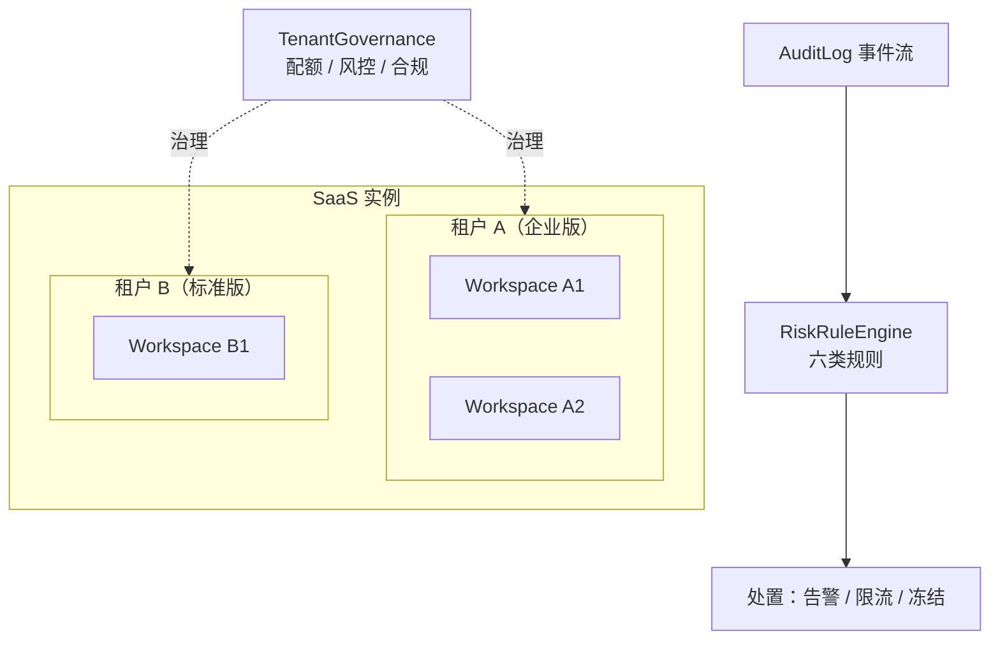
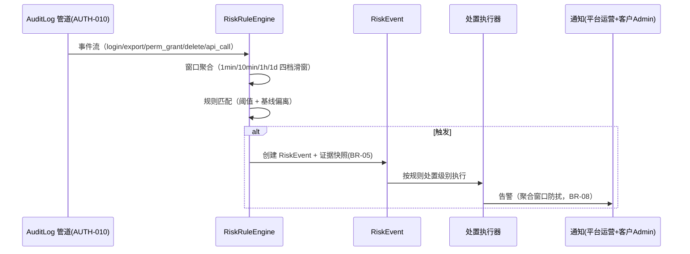

# 多租户隔离与风控告警溯源

| 元信息项 | 内容 |
| --- | --- |
| 文档编号 | AUTH-012 |
| 所属迭代 | P4：远期增强（第 13 周起，签约驱动排期） |
| 优先级 | P4（企业版增强 / 安全与合规价值线） |
| 所属模块 | M1-AUTH 账号与权限 |
| 文档状态 | 待评审（Draft） |
| 最后更新日期 | 2026-09-01 |
| 上游依据 | `docs/需求文档.md` §3.1 企业版专属节、§8.2 P4 列（账号与权限行） |
| 前置依赖 | `AUTH-006`（数据库行级隔离，长期稳定运行是硬性前提）、`AUTH-010`（审计管道）、`INFRA-005`（限流与生产部署基线） |
| 下游依赖 | `INFRA-006`（高可用私有化部署的多租户拓扑）、P4 合规报表 |
| 架构基线 | [`api-conventions.md`](../architecture/api-conventions.md) §7 / §8、[`rbac-permission-model.md`](../architecture/rbac-permission-model.md) §2 / §4 |
| 竞品参考 | Slack Enterprise Grid（Org 级多工作空间治理）、GitHub Enterprise（EMU 托管用户）、飞书（租户数据隔离 + 风控） |

> **范围声明**：本文档面向 **SaaS 部署形态**（单实例服务多客户租户）。私有化单租户部署不启用本文档能力。交付三件事：**租户边界模型**（Workspace 升级为 Tenant 的治理层）、**跨租户风控**（异常行为检测与自动处置）、**合规溯源**（租户级数据边界证明与导出）。行级隔离的技术底座归 `AUTH-006`，本文档只做治理与风控，不重写隔离机制。

---

## 1. 概述

### 1.1 功能定位

SaaS 形态下，一个实例承载数百个客户租户。`AUTH-006` 解决了「数据查不错」（行级隔离），但没有解决三个经营级问题：

| 问题 | 后果 | 本文档对策 |
| --- | --- | --- |
| 单租户资源滥用（批量导出、API 爬虫、存储膨胀） | 拖累全实例性能，其他租户受害 | 租户级配额与风控规则引擎 |
| 异常行为无感知（深夜批量导出、异地登录风暴、权限批量提升） | 数据泄露事后才发现 | 风控告警规则 + 自动处置（告警/限流/冻结） |
| 合规审查要求「证明我的数据与别人隔离」 | 销售阻断 | 租户边界证明报告（隔离测试 + 审计导出） |

### 1.2 启动条件（签约驱动）

| 条件 | 判定 |
| --- | --- |
| 商业条件 | SaaS 形态正式商业化且付费租户 ≥ 20（小规模期人工巡检成本可接受） |
| 技术前置 | `AUTH-006` 行级隔离生产运行 ≥ 90 天无隔离事故；`AUTH-010` 审计数据积累 ≥ 30 天（风控规则需要行为基线） |
| 运营前置 | 明确租户分级策略（免费/标准/企业）与各档配额表（§2.3）经商务评审 |
| 合规前置 | 至少一家客户提出隔离证明需求或等保/ SOC 2 审计排期确定 |

### 1.3 独立交付判定

1. 三档租户配额生效且互不干扰：构造 A 租户 API 爬虫（超限）被自动限流，B 租户同期延迟无统计显著变化（P95 漂移 < 5%）。
2. 六类风控规则（§2.4）在预发环境各触发一次，告警/限流/冻结三档处置链路完整。
3. 任取一租户出具《数据边界证明报告》：含隔离测试记录、近 90 天跨租户访问尝试（应为 0）、审计导出样本。
4. 私有化部署零变化：`TENANT_GOVERNANCE_ENABLED=False` 时全部新代码路径不执行，API v1 契约不变。

### 1.4 目标用户

| 用户 | 场景 | 关注点 |
| --- | --- | --- |
| 平台运营（我方） | 日常巡检租户健康度；处置风控告警 | 一屏看全；处置动作可逆、有审批 |
| 客户安全官 | 要求隔离证明；查看自己租户的风控事件 | 报告可信（数据来自系统而非人工填写） |
| 商务 | 租户升级套餐（配额提升） | 配额变更即时生效、有审计 |

### 1.5 前置依赖说明

| 依赖文档 | 依赖内容 | 缺失后果 |
| --- | --- | --- |
| `AUTH-006` | 行级隔离策略、`workspace_id` 全表覆盖、隔离测试套件 | 风控无意义——隔离本身不可信 |
| `AUTH-010` | `AuditLog` 全量事件流（登录/权限变更/导出/删除） | 风控规则无数据源 |
| `INFRA-005` | Throttle 家族与限流头填充 | 租户级限流需重建轮子 |

### 1.6 竞品参考结论（详见第 6 章）

- **Slack Enterprise Grid**：Org 层治理多个 Workspace——统一成员、统一策略、跨空间 DLP；其「Org 级导出审批」是风控处置的范本。
- **GitHub EMU（Enterprise Managed Users）**：企业托管用户身份与租户强绑定，用户不可跨租户泄漏身份；其「enterprise 级审计流」外发 SIEM 是合规溯源标配。
- **飞书**：租户粒度数据隔离 + 管理后台风控告警（异地登录/批量导出），处置含「冻结租户」并有双人审批。
- **本系统取舍**：采纳 Slack 的 Org 治理层与飞书的双人审批冻结；EMU 的身份托管与本系统 SSO 体系（`AUTH-009/011`）衔接但不强制；风控规则引擎刻意做**规则表驱动**而非通用 CEP（六类预置规则 + 参数可调，不做自定义规则 DSL）。

---

## 2. 业务逻辑

### 2.1 租户治理模型



| 概念 | 定义 | 说明 |
| --- | --- | --- |
| `Tenant` | 客户法人级实体，下挂 1..N 个 Workspace | 免费/标准客户通常 1:1；企业客户（集团）可多空间归一治理 |
| `TenantQuota` | 租户级配额（存储/成员/API 速率/导出行数） | 覆盖 `INFRA-005` 的用户级限流，是更粗一层的总量闸 |
| `RiskRule` | 预置六类风控规则 + 租户级参数覆盖 | 平台默认值 → 租户可收紧不可放宽（BR-06） |
| `RiskEvent` | 规则触发产生的事件，含证据快照 | 处置动作全链路审计 |

### 2.2 业务规则（BR）

| 编号 | 规则 | 说明 |
| --- | --- | --- |
| BR-01 | 隔离底座不动 | 本文档不修改 `AUTH-006` 任何隔离机制；所有新查询同样走行级过滤 |
| BR-02 | 配额超发禁止 | 租户配额是硬上限：存储超限拒绝上传（`QUOTA_STORAGE_EXCEEDED`）、成员超限拒绝邀请（`QUOTA_MEMBER_EXCEEDED`） |
| BR-03 | 处置可逆 | 限流/冻结均可解除；解除与施加同等级审批；冻结期间数据完整保留不删除 |
| BR-04 | 冻结双人审批 | 冻结租户属重大处置：发起人与审批人不得同人，二次确认弹窗需输入租户名 |
| BR-05 | 证据快照 | 风控事件触发即固化证据（相关审计记录 ID 列表 + 统计值），后续审计数据留存到期删除不影响事件证据 |
| BR-06 | 规则只紧不松 | 租户管理员可调紧自己租户的风控阈值（如导出从 10 万次/日调到 1 万），不可调松平台默认 |
| BR-07 | 平台侧最小知情 | 平台运营看风控事件只见行为统计与 ID，不见业务内容（任务标题等需二次授权工单才可见，见 §2.5） |
| BR-08 | 告警不扰民 | 同一租户同一规则 1 小时内只告警一次（聚合窗口），处置记录追加到同一事件 |
| BR-09 | 冻结不杀会话 | 冻结生效时刻起拒绝新写操作（`RESOURCE_STATE_INVALID`），已建立会话可读不可写 15 分钟缓冲后全只读 |
| BR-10 | 合规报告自证 | 《数据边界证明报告》内容全部由系统生成（隔离测试结果 + 审计统计），运营只能触发不能编辑 |
| BR-11 | 私有化关闭 | `TENANT_GOVERNANCE_ENABLED=False` 时：治理 API 返回 `SERVER_NOT_IMPLEMENTED`，风控引擎不调度，模型存在但无数据 |
| BR-12 | 配额变更审计 | 任何配额调整（含套餐升级自动调整）产生 `AuditLog`，记录新旧值与操作主体 |

### 2.3 租户分级与配额表

| 配额项 | 免费版 | 标准版 | 企业版 | 超限行为 |
| --- | --- | --- | --- | --- |
| 成员数 | 10 | 100 | 按合同 Seats | `QUOTA_MEMBER_EXCEEDED` 拒绝邀请 |
| 存储 | 5 GB | 100 GB | 1 TB（可扩） | `QUOTA_STORAGE_EXCEEDED` 拒绝上传 |
| API 请求 | 600 req/min | 3,000 req/min | 10,000 req/min | `RATE_LIMIT_EXCEEDED`（`Retry-After`） |
| 单日导出行数 | 1 万 | 10 万 | 100 万 | 风控规则 R-03 监测 + 硬拒 |
| Webhook 订阅 | 5 | 50 | 200 | `RESOURCE_LIMIT_EXCEEDED` |
| 项目数 | 3 | 不限 | 不限 | `QUOTA_PROJECT_EXCEEDED` |

| 机制 | 说明 |
| --- | --- |
| 计数源 | 存储/成员为实时查（已有汇总列）；API 速率走 Redis 滑动窗口（key=`tq:{tenant}:{minute}`）；导出行数日粒度计数器 |
| 套餐变更 | 升级即时生效；降级给 30 天宽限期（只告警不硬拒），宽限期后硬拒 |
| 多空间聚合 | 配额按 Tenant 计，下挂所有 Workspace 共享池 |

### 2.4 风控规则引擎（六类预置规则）



| 规则 | 触发条件（平台默认） | 处置 |
| --- | --- | --- |
| R-01 登录风暴 | 单租户 10 min 内失败登录 > 200 次 | 告警 + 来源 IP 段临时封禁 30 min |
| R-02 异地登录 | 同一账号 1 h 内登录地跨度 > 1,000 km | 告警（本人 + 管理员），可强制重登 |
| R-03 批量导出 | 单租户日导出行数 > 配额 80% 预警 / > 100% 硬拒 | 预警告警 / 硬拒 + 通知 |
| R-04 权限批量提升 | 单操作者 1 h 内授予管理员 > 5 人 | 告警 + 要求该操作者二次验证 |
| R-05 深夜批量删除 | 00:00-06:00 删除对象 > 50 个 | 告警 + 自动快照保护（回收站保留期延长至 90 天） |
| R-06 API 爬虫模式 | 单 token 1 h 调用 > 配额 50% 且 95% 为 GET 列表 | 告警 + 该 token 降速至 10% 配额 1 h |

### 2.5 最小知情与二次授权工单

平台运营处置风控时遵循 BR-07：

| 层级 | 可见内容 | 条件 |
| --- | --- | --- |
| L1 默认 | 行为统计（次数/比率）、对象 ID、时间线 | 处置所需 |
| L2 工单授权 | 业务内容（任务标题/文件名等） | 客户 WS_ADMIN 在线批准或客户书面授权工单号；授权 24h 有效，访问全程审计 |
| L3 永不 | 文件内容、评论正文、描述正文 | 系统无此访问路径（即使 DBA 也受 `AUTH-006` 行级策略约束） |

### 2.6 合规溯源产出

| 产出 | 内容 | 格式 |
| --- | --- | --- |
| 数据边界证明报告 | 租户 ID、隔离机制说明（`AUTH-006` 策略清单）、近 90 天跨租户访问尝试计数（应恒为 0，任何 >0 即事故）、最近一次隔离渗透测试结果 | PDF（系统生成，BR-10） |
| 风控事件台账 | 事件列表、处置动作、审批链、证据快照 | 平台后台 + CSV 导出 |
| 租户自身审计包 | 该租户自己的 AuditLog 导出（复用 `AUTH-010` 导出，增加租户级签名校验） | CSV + SHA-256 清单 |

---

## 3. UI/UX 设计

### 3.1 页面清单

| 页面 | 路由 | 使用者 | 核心任务 |
| --- | --- | --- | --- |
| 平台租户总览 | `/admin/tenants/` | 平台运营 | 租户健康度一屏（配额水位/风控事件数/冻结状态） |
| 租户详情 | `/admin/tenants/{id}/` | 平台运营 | 配额调整、风控事件列表、处置操作 |
| 风控事件中心 | `/admin/risk-events/` | 平台运营 | 事件流、筛选（规则/级别/租户/状态）、处置 |
| 冻结审批 | `/admin/risk-events/{id}/freeze/` | 平台运营（双人） | 发起 → 审批 → 生效全链路 |
| 我的租户安全 | `/{ws}/settings/security/` | 客户 WS_ADMIN | 本租户风控事件、规则阈值调紧、审计包导出 |

### 3.2 平台租户总览线框

```
┌────────────────────────────────────────────────────────────────────┐
│ 平台管理 / 租户治理                              [风控事件 3 未处置]│
├────────────────────────────────────────────────────────────────────┤
│ 搜索: [____________]  套餐: [全部▾]  状态: [全部▾]                  │
│ ┌──────────────┬───────┬─────────┬─────────┬────────┬───────────┐ │
│ │ 租户         │ 套餐  │ 存储水位│ API水位 │ 风控   │ 状态      │ │
│ ├──────────────┼───────┼─────────┼─────────┼────────┼───────────┤ │
│ │ Acme Corp    │ 企业  │ ████ 42%│ ██ 18%  │ 0      │ 正常      │ │
│ │ Beta Ltd     │ 标准  │ ███████░│ ████ 61%│ 1 ⚠   │ 正常      │ │
│ │              │       │    78%  │         │ R-03   │           │ │
│ │ Gamma Inc    │ 免费  │ ████████│ ███████ │ 2 🔴  │ 限流中    │ │
│ │              │       │    96%! │   92%   │ R-06   │ [解除]    │ │
│ └──────────────┴───────┴─────────┴─────────┴────────┴───────────┘ │
│ 近 24h 全站: 风控事件 12 (R-01×2 R-03×4 R-06×6) · 冻结 0 · 限流 1  │
└────────────────────────────────────────────────────────────────────┘
```

### 3.3 风控事件处置线框

```
┌────────────────────────────────────────────────────────────────────┐
│ 风控事件 #E-20260901-0042                            级别: 🔴 高    │
├────────────────────────────────────────────────────────────────────┤
│ 规则: R-03 批量导出     租户: Beta Ltd      触发: 2026-09-01 02:14 │
│                                                                    │
│ 证据快照 (BR-05):                                                  │
│  · 当日导出行数 102,340 / 配额 100,000 (102.3%)                     │
│  · 操作账号: 3 个 (u_01J6… 贡献 81%)                                │
│  · 时间分布: 01:30-02:14 集中爆发                                   │
│  · 关联审计: 47 条 [查看 ID 列表]                                   │
│                                                                    │
│ 处置:   (•) 仅告警   ( ) 限流 24h   ( ) 冻结租户 [需双人审批]      │
│ 备注: [________________________________________________]           │
│                                                                    │
│ 平台最小知情 (BR-07): 业务内容不可见。如需查看 → [申请 L2 授权工单] │
│                                                                    │
│                        [取消]              [执行处置]              │
└────────────────────────────────────────────────────────────────────┘
```

### 3.4 交互规则

| 场景 | 交互 |
| --- | --- |
| 冻结操作 | 选择冻结即进入审批流：发起人提交 → 另一运营审批（系统校验不同人，BR-04）→ 输入租户名确认 → 生效 |
| 冻结期间租户视图 | 租户成员登录看到横幅「租户处于安全审查期，功能暂时受限」，不写「违规」等定性词（法务要求） |
| 阈值调紧 | 客户侧修改阈值即时生效并显示「此操作只会更严格，平台默认值不可放宽」（BR-06） |
| 水位预警 | 配额 ≥ 80% 时客户设置页显示黄色进度条；≥ 95% 红色 + 通知 WS_ADMIN |
| 权限 | 平台治理页仅 `SYSTEM_ADMIN` + 显式 `tenant_ops` 授权组成员；客户侧「我的租户安全」WS_ADMIN 可见 |

---

## 4. 技术架构

### 4.1 数据模型

```python
# apps/api/rp_governance/models.py
from django.db import models
from rp_core.models import BaseModel


class Tenant(BaseModel):
    """客户法人级租户；Workspace 通过 tenant_id 归集。"""

    name = models.CharField(max_length=128)
    tier = models.CharField(
        max_length=12,
        choices=[("free", "免费"), ("standard", "标准"), ("enterprise", "企业")],
        default="free",
    )
    seats = models.PositiveIntegerField(default=10)       # 合同席位
    is_frozen = models.BooleanField(default=False)
    frozen_at = models.DateTimeField(null=True, blank=True)
    frozen_reason = models.CharField(max_length=255, blank=True)

    class Meta:
        db_table = "gov_tenant"


class TenantQuota(BaseModel):
    """租户级配额；null 表示跟随 tier 默认值。"""

    tenant = models.OneToOneField(Tenant, on_delete=models.CASCADE,
                                  related_name="quota")
    storage_bytes = models.BigIntegerField(null=True, blank=True)
    member_limit = models.PositiveIntegerField(null=True, blank=True)
    api_rate_per_minute = models.PositiveIntegerField(null=True, blank=True)
    export_rows_per_day = models.PositiveIntegerField(null=True, blank=True)
    webhook_limit = models.PositiveIntegerField(null=True, blank=True)
    project_limit = models.PositiveIntegerField(null=True, blank=True)
    downgrade_grace_until = models.DateField(null=True, blank=True)  # §2.3 宽限期

    class Meta:
        db_table = "gov_tenant_quota"
```

`Workspace` 增列：`tenant = models.ForeignKey(Tenant, null=True, on_delete=models.SET_NULL)`——null 即「未治理租户」（私有化/迁移期），治理 API 对其 `SERVER_NOT_IMPLEMENTED`（BR-11）。迁移为 `AddField` + 回填迁移（每 Workspace 建同名 Tenant），回填批处理每批 500。

### 4.2 风控模型

```python
class RiskRule(BaseModel):
    """预置六类规则的平台默认 + 租户覆盖（只紧不松，BR-06）。"""

    code = models.CharField(max_length=8)          # R-01..R-06
    tenant = models.ForeignKey(Tenant, null=True, blank=True,
                               on_delete=models.CASCADE)
    # tenant=null → 平台默认行；六条种子数据由迁移写入
    threshold = models.JSONField()                 # {"count":200,"window":"10m"}
    action = models.CharField(
        max_length=12,
        choices=[("alert", "仅告警"), ("throttle", "限流"), ("freeze", "冻结")],
        default="alert",
    )
    is_enabled = models.BooleanField(default=True)

    class Meta:
        db_table = "gov_risk_rule"
        constraints = [
            models.UniqueConstraint(fields=["code", "tenant"],
                                    name="uq_risk_rule_tenant"),
        ]


class RiskEvent(BaseModel):
    class Status(models.TextChoices):
        OPEN = "open", "待处置"
        ACTIONED = "actioned", "已处置"
        DISMISSED = "dismissed", "误报关闭"

    tenant = models.ForeignKey(Tenant, on_delete=models.CASCADE,
                               related_name="risk_events")
    rule_code = models.CharField(max_length=8)
    severity = models.CharField(max_length=8)      # low/medium/high
    status = models.CharField(max_length=10, choices=Status.choices,
                              default=Status.OPEN)
    evidence = models.JSONField()                  # BR-05 证据快照
    aggregate_key = models.CharField(max_length=64)  # BR-08 聚合窗口键
    actions = models.JSONField(default=list)       # [{action, by, at, note}]
    freeze_approval = models.JSONField(null=True, blank=True)
    # {"initiator": "...", "approver": "...", "approved_at": "..."}

    class Meta:
        db_table = "gov_risk_event"
        indexes = [
            models.Index(fields=["tenant", "-created_at"],
                         name="idx_risk_event_tenant"),
            models.Index(fields=["status", "-created_at"],
                         name="idx_risk_event_open"),
            models.Index(fields=["aggregate_key", "-created_at"],
                         name="idx_risk_event_agg"),
        ]
```

### 4.3 规则引擎与处置执行

```python
# apps/api/rp_governance/risk_engine.py
from django.core.cache import cache


class RiskRuleEngine:
    """事件驱动 + 滑窗聚合；刻意规则表驱动，不做通用 CEP（§1.6）。"""

    WINDOWS = {"1m": 60, "10m": 600, "1h": 3600, "1d": 86400}

    def ingest(self, audit_event: dict) -> None:
        tenant_id = audit_event["tenant_id"]
        if tenant_id is None:
            return                              # BR-11 未治理租户跳过
        for rule in self._rules_for(tenant_id, audit_event["action"]):
            key = f"risk:{rule.code}:{tenant_id}:{rule.threshold['window']}"
            count = cache.incr(key)
            if count == 1:
                cache.expire(key, self.WINDOWS[rule.threshold["window"]])
            if count >= rule.threshold["count"]:
                self._fire(rule, tenant_id, audit_event)

    def _fire(self, rule, tenant_id: str, event: dict) -> None:
        agg_key = f"{rule.code}:{tenant_id}:{event['created_at'][:13]}"  # 1h 窗口
        existing = RiskEvent.objects.filter(
            aggregate_key=agg_key, status="open").first()
        if existing:                            # BR-08 聚合不重复告警
            existing.evidence["occurrences"] = existing.evidence.get(
                "occurrences", 1) + 1
            existing.save(update_fields=["evidence", "updated_at"])
            return
        RiskEvent.objects.create(
            tenant_id=tenant_id, rule_code=rule.code,
            severity=RULE_SEVERITY[rule.code],
            evidence=self._snapshot_evidence(rule, event),  # BR-05
            aggregate_key=agg_key)
        execute_action.delay(rule.action, tenant_id, rule.code)  # on_commit

    def _rules_for(self, tenant_id: str, action: str) -> list:
        # 租户覆盖行优先，平台默认行兜底；只紧不松在保存时校验（§4.5）
        ...
```

| 要点 | 说明 |
| --- | --- |
| 数据源 | 挂接 `AUTH-010` 审计管道的事件扇出（新增 `risk` 订阅者），不引入第二条事件流 |
| 滑窗 | Redis `INCR` + 首击过期，窗口即 TTL；无需持久化计数 |
| 处置隔离 | `execute_action` 独立 `governance` 队列；冻结走双人审批子流程（`freeze_approval` 两签后才执行） |
| 冻结实现 | `Tenant.is_frozen=True` + Redis 标记 `frozen:{tenant}`（中间件快路径）；写请求返回 `RESOURCE_STATE_INVALID`，15 min 缓冲后读也收紧为只读缓存视图（BR-09） |

### 4.4 API 端点

| 方法 | 路径 | 说明 | 权限 |
| --- | --- | --- | --- |
| GET | `/api/v1/admin/tenants/` | 租户列表（配额水位聚合） | tenant_ops |
| GET | `/api/v1/admin/tenants/{id}/` | 租户详情 | tenant_ops |
| PATCH | `/api/v1/admin/tenants/{id}/quota/` | 配额调整（BR-12 审计） | tenant_ops |
| GET | `/api/v1/admin/risk-events/` | 风控事件流（`?rule=&status=&tenant=&cursor=`） | tenant_ops |
| POST | `/api/v1/admin/risk-events/{id}/actions/` | 处置：`{"action":"alert\|throttle\|freeze","note":"..."}` | tenant_ops |
| POST | `/api/v1/admin/risk-events/{id}/freeze-approval/` | 冻结第二签审批 | tenant_ops（≠发起人） |
| POST | `/api/v1/admin/tenants/{id}/boundary-report/` | 生成数据边界证明报告（异步 → PDF） | tenant_ops |
| GET | `/api/v1/workspaces/{slug}/security/events/` | 客户侧本租户风控事件 | WS_ADMIN |
| PATCH | `/api/v1/workspaces/{slug}/security/rules/{code}/` | 客户调紧阈值（BR-06） | WS_ADMIN |

**成功示例** — `POST …/risk-events/{id}/actions/`（限流处置）：

```json
{
  "status": "success",
  "data": {
    "event_id": "01J6ZR2B8KQW4NXVTPY5H3MD7F",
    "status": "actioned",
    "actions": [
      {"action": "throttle", "by": "ops_chen", "at": "2026-09-01T06:22:11Z",
       "note": "R-06 爬虫模式确认，降速 24h"}
    ]
  },
  "meta": {"request_id": "01J6ZR3C9LRX5OYWUQZ6J4NE8G"}
}
```

**错误示例** — 冻结审批同人（BR-04）：

```json
{
  "status": "error",
  "error": {
    "code": "PERM_DENIED",
    "message": "冻结审批人不得与发起人相同",
    "details": [{"field": "approver", "code": "INVALID",
                 "message": "发起人与审批人均为 ops_chen"}]
  },
  "meta": {"request_id": "01J6ZR4DAMSX6PZXVRA7K5PF9H"}
}
```

**错误示例** — 私有化部署（BR-11）：

```json
{
  "status": "error",
  "error": {
    "code": "SERVER_NOT_IMPLEMENTED",
    "message": "当前部署形态未启用租户治理",
    "details": []
  },
  "meta": {"request_id": "01J6ZR5EBNTY7QAYWSB8L6QG0J"}
}
```

### 4.5 配额强制点（写路径挂接）

| 强制点 | 位置 | 逻辑 |
| --- | --- | --- |
| 上传预检 | `FILE-001/003` 预签名签发前 | `usage + file_size > quota` → `QUOTA_STORAGE_EXCEEDED`；在途上传预留量复用 `FILE-002` 配额预留机制 |
| 邀请成员 | `TEAM-002` 邀请接受时 | `member_count + 1 > limit` → `QUOTA_MEMBER_EXCEEDED` |
| API 速率 | 中间件（`INFRA-005` Throttle 之后） | 租户桶 `tq:{tenant}:{minute}` 滑动窗口，超则 `RATE_LIMIT_EXCEEDED` |
| 阈值保存 | `PATCH …/security/rules/{code}/` | 服务端比较平台默认：数值必须更严格（更小）否则 `VALIDATION_ERROR`（BR-06） |

### 4.6 性能与规模

| 指标 | 预算 | 手段 |
| --- | --- | --- |
| 中间件冻结检查 | < 0.2 ms/请求 | Redis GET `frozen:{tenant}`，本地 1s 负缓存 |
| 租户速率桶 | < 0.5 ms/请求 | 复用 `INFRA-005` 滑窗实现，多一个 key 维度 |
| 风控 ingest 吞吐 | ≥ 5,000 事件/s | 审计管道扇出异步消费，Redis 计数 O(1) |
| 租户总览聚合 | 500 租户 < 800 ms | 配额水位走 `TenantQuota` + Redis 计数值直读，无实时扫表 |

---

## 5. 测试用例

### 5.1 单元测试（UT）

| 编号 | 用例 | 断言 |
| --- | --- | --- |
| UT-01 | 配额 null 跟随 tier | `TenantQuota.storage_bytes=null` 时按 tier 默认表取值 |
| UT-02 | 存储超限 | `usage+incoming>quota` 预签名拒绝，错误码 `QUOTA_STORAGE_EXCEEDED` |
| UT-03 | 成员超限 | 邀请接受返回 `QUOTA_MEMBER_EXCEEDED`，邀请不落库 |
| UT-04 | 降级宽限期 | 降级后 30 天内超限只告警；第 31 天硬拒 |
| UT-05 | 滑窗计数 | 窗口内 N-1 次不触发，第 N 次触发；窗口过期重新计数 |
| UT-06 | 聚合防扰 | 同规则 1h 内第二次触发不新建事件，`occurrences` 递增（BR-08） |
| UT-07 | 只紧不松 | 租户保存更宽阈值返回 `VALIDATION_ERROR`；更紧保存成功 |
| UT-08 | 冻结双人审批 | 同人审批 `PERM_DENIED`；不同人两签后 `is_frozen=True` |
| UT-09 | 冻结写拒 | 冻结后写请求 `RESOURCE_STATE_INVALID`；15 min 缓冲内读正常 |
| UT-10 | 证据快照固化 | 源审计记录删除后事件 `evidence` 仍完整（BR-05） |
| UT-11 | 未治理租户跳过 | `tenant_id=null` 事件 ingest 直接返回，无 Redis 写入 |
| UT-12 | 私有化关闭 | `TENANT_GOVERNANCE_ENABLED=False` 时治理 API 返回 `SERVER_NOT_IMPLEMENTED` |

### 5.2 集成测试（IT）

| 编号 | 用例 | 断言 |
| --- | --- | --- |
| IT-01 | R-06 爬虫模式全链路 | 构造 token 高频 GET → 事件生成 → 降速生效 → 24h 后自动恢复 |
| IT-02 | 邻居干扰隔离 | A 租户打满 API 配额被限流期间，B 租户 P95 延迟漂移 < 5% |
| IT-03 | 冻结双人审批流 | 发起 → 审批 → 中间件生效 → 解除（同审批级）→ 恢复，全链审计 |
| IT-04 | 边界报告生成 | PDF 内容含隔离策略清单与跨租户访问计数；内容与系统状态一致（BR-10） |
| IT-05 | 配额变更审计 | PATCH quota 后 `AuditLog` 含新旧值 diff |
| IT-06 | 多空间共享池 | 同 Tenant 两 Workspace 存储合计超限即拒，与单空间计数一致 |

### 5.3 E2E 测试

| 编号 | 场景 | 验收 |
| --- | --- | --- |
| E2E-01 | 运营处置告警 | 事件中心筛选 → 查看证据 → 限流处置 → 租户侧可见「安全审查」横幅 |
| E2E-02 | 客户调紧阈值 | WS_ADMIN 将导出阈值调为默认 1/10 → 触发预警 → 收到告警 |
| E2E-03 | 冻结全链路 | 双人审批冻结 → 租户写操作被拒 → 解除后恢复，数据零丢失 |

---

## 6. 竞品深度对标

| 维度 | Slack Enterprise Grid | GitHub EMU | 飞书管理后台 | 本系统 |
| --- | --- | --- | --- | --- |
| 治理层 | Org 管多 Workspace，策略统一下发 | Enterprise 管托管用户 | 租户即组织 | `Tenant` 管多 Workspace + 共享配额池 |
| 风控规则 | DLP 规则（内容级） | 审计流外发 SIEM（检测在客户侧） | 异地登录/批量导出告警 | 六类行为规则表（统计级，不触内容，BR-07） |
| 处置 | 导出审批、域声明 | 凭据吊销 | 冻结 + 双人审批 | 告警/限流/冻结三档 + 双人审批（对齐飞书） |
| 合规证明 | 企业密钥管理（EKM） | 合规报告（SOC2） | 等保材料包 | 系统自证边界报告（BR-10，不可编辑） |
| 最小知情 | EKM 下平台不可见内容 | 托管用户平台可见 | 未公开 | 三级知情模型 L1/L2/L3（§2.5） |

**结论**：Slack 的 Org 治理与飞书的双人冻结是成熟范式，直接对齐；差异化在「系统自证报告」与「三级最小知情」——前者把合规证明从人工材料变成系统产出，后者以制度 + 技术双重约束平台侧数据访问，是 SaaS 多租户信任状的核心卖点。

---

## 7. 里程碑与验收

### 7.1 工作量估算

| 交付面 | 内容 | 估算 |
| --- | --- | --- |
| Model / Migration | `Tenant/TenantQuota/RiskRule/RiskEvent` 4 表 + `Workspace.tenant` 增列回填 | 2 d |
| 后端 | 配额强制点 4 处、规则引擎 + 滑窗、处置执行器（含冻结双人审批）、治理 API 9 端点、报告生成任务 | 7 d |
| 前端 | 平台治理 4 页 + 客户安全页 1 页 + 冻结横幅 | 4 d |
| 测试 | UT-01~12、IT-01~06、E2E-01~03 | 3 d |
| **合计** | | **16 d（2 人并行约 2 周）** |

### 7.2 可操作演示的验收标准

1. 配额三档生效：免费租户第 11 名成员邀请被拒；存储打满后预签名拒发；API 超限返回 `RATE_LIMIT_EXCEEDED` 且 `Retry-After` 正确。
2. R-06 全链路：脚本模拟爬虫 → 事件中心出现高严重事件 → 限流处置 → 邻居租户延迟无显著漂移（IT-02 指标）。
3. 冻结双人审批：同人审批被拒；两签生效后租户写拒读限；解除后全恢复；每步入审计。
4. 边界报告：为测试租户生成 PDF，跨租户访问计数为 0，隔离策略清单与 `AUTH-006` 文档一致。
5. 零回归：`TENANT_GOVERNANCE_ENABLED=False` 配置下跑全量 API 契约测试，与企业版 V1.0 快照无差异。
