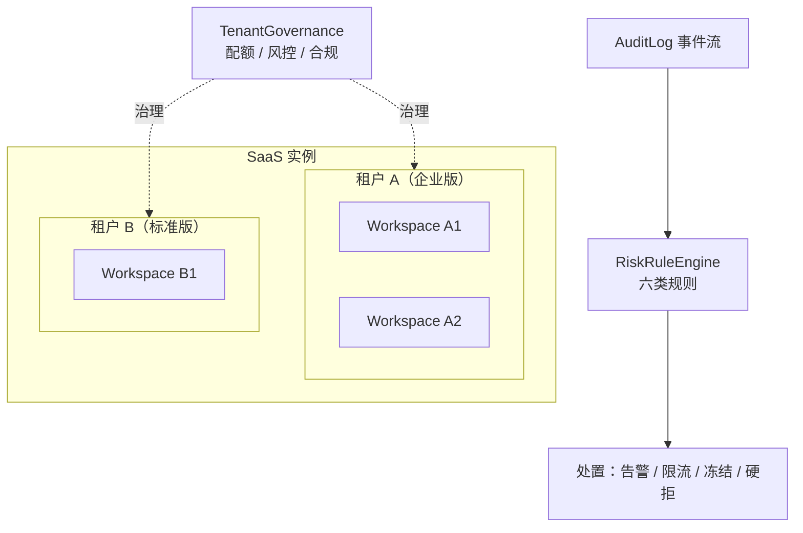
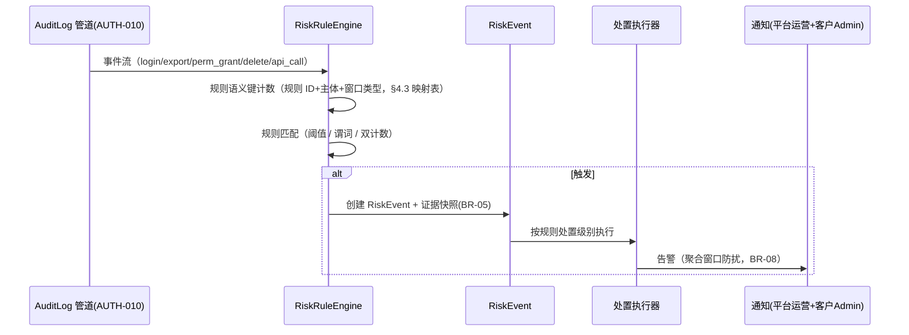

# 多租户隔离与风控告警溯源

| 元信息项 | 内容 |
| --- | --- |
| 文档编号 | AUTH-012 |
| 所属迭代 | P4：远期增强（第 13 周起，签约驱动排期） |
| 优先级 | P4（企业版增强 / 安全与合规价值线） |
| 所属模块 | M1-AUTH 账号与权限 |
| 文档状态 | 待评审（Draft） |
| 最后更新日期 | 2026-09-06（R1 修复 10 项：①L3 知情层级表述改为与应用层行级过滤一致的机制事实（无 PG RLS）②租户/工作空间两层配额模型显式化（扣减顺序与错误码）③`?rule=` 筛选补索引 ④成功信封去除 `meta.request_id` ⑤包路径回归 `plane/` 基线 + `audit_log.tenant_id` 增补登记 ⑥RiskRule 偏条件唯一约束修复 NULL 失效 ⑦风控键改为规则语义键（逐 R-xx 映射）⑧补解除处置/误报申诉端点 ⑨L2 授权工单建模 + boundary-report 202 契约 ⑩BR-07 与 R-01/02/04/05 补用例；另按跨文档仲裁定义 TenantPlan 四档位（含旗舰档，供 FILE-006 引用）。R2 修复 15 项（4 MAJOR + 6 MINOR + 5 INFO）：①R-03 硬拒落地——§4.5 增第 5 强制点（导出 presign 系端点挂 R-03 计数判定，指认 AUTH-010 审计导出/FILE-002 打包下载/RPT-005 订阅快照及本文自有出口）、`RiskRule.action` 增 `deny` 档（与 freeze 分档）、指认 `409 RESOURCE_LIMIT_EXCEEDED`（api-conventions §8.5 已注册，`details` 注明规则与余量，补错误示例）、补 UT-22/IT-10 ②申诉复核运营端契约 `POST /api/v1/instances/risk-appeals/{id}/review/`（accepted 自动解除处置、rejected 通知申诉人，均落 `reviewed_by`/`review_note`）③Workspace/audit_log 回填迁移显式门控 `TENANT_GOVERNANCE_ENABLED`（私有化保持 NULL 未治理语义，BR-11/§1.3#4 一致化）④`cross_tenant_hits` 计数源定义为隔离渗透测试 beat 任务日探测回填（Redis 日计数 TTL 90d 且逐日落库持久化（防 Redis 数据丢失致 90 天窗口回填失真），数据流落 §4.3 要点表）⑤BR-08 补「同主体」限定 ⑥聚合窗口改述 UTC 自然小时整点桶 + UT-06 边界断言 ⑦L3 全称断言限定治理链路 ⑧§4.3 示意符号定义注记 ⑨R-01 IP 段封禁补载体（Redis 键模板 + 中间件挂点 + 与 rbac §11.5 分域）⑩written 工单补 `written-confirm/` 运营端端点（端点 14→16）+ `written_ref` 必填用例（UT-18/IT-07）⑪R-06 配额 50% 量纲（req/min 档位 × 60 × 50%）+ UT-17 数值口径 ⑫BR-02 加 QUOTA_STORAGE_EXCEEDED 描述扩宽待回改注 ⑬tenant_ops 循环引用消解（权威载体 rbac 附录 B）⑭Σ WS 已用值聚合读取 SQL 形态一句 ⑮`tenant_id` 不建 FK 注明系 AUTH-010 零外键原则之引申；§7.1 同步（强制点 5 处、16 端点、UT-01~22/IT-01~10，合计 20.5 d）。R3 复评 PASS（10×5）后随手收口：IT-01 恢复时长 24h→1h 对齐 R-06 处置、GovernanceTicket revoked 补 revocation 端点（16→17）、Webhook 订阅/项目数配额补两行强制点+UT-25/26（范围 UT-01~26）、FILE-002 打包下载引用 §3.4→§3.3、 BoundaryReport 不提供 cancelled 消歧、强制点 1 位置补 FILE-002、UT-13 边界差一改第 201 次、review/ 补 accepted 同步通知申诉人、cross_tenant_hits 探明日计数逐日落库加固、appeals 列表经事件详情内嵌注记） |
| 上游依据 | `docs/需求文档.md` §3.1 企业版专属节、§8.2 P4 列（账号与权限行） |
| 前置依赖 | `AUTH-006`（数据库行级隔离与成员权限分配——README §4 实文，长期稳定运行是硬性前提）、`AUTH-010`（全站操作审计日志）、`INFRA-005`（接口限流 / 数据备份 / 生产部署配置） |
| 下游依赖 | `INFRA-006`（高可用集群与私有化部署的多租户拓扑）、P4 合规报表、`FILE-006`（旗舰档合规能力引用本文 TenantPlan 档位） |
| 架构基线 | [`api-conventions.md`](../architecture/api-conventions.md) §4 信封 / §7 限流 / §8 错误码 / §13.1 异步、[`rbac-permission-model.md`](../architecture/rbac-permission-model.md) §2 / §4 / §8、[`monorepo-structure.md`](../architecture/monorepo-structure.md) §2（后端包路径基线） |
| 竞品参考 | Slack Enterprise Grid（Org 级多工作空间治理）、GitHub Enterprise（EMU 托管用户）、飞书（租户数据隔离 + 风控） |

> **范围声明**：本文档面向 **SaaS 部署形态**（单实例服务多客户租户）。私有化单租户部署不启用本文档能力。交付三件事：**租户边界模型**（Workspace 升级为 Tenant 的治理层）、**跨租户风控**（异常行为检测与自动处置）、**合规溯源**（租户级数据边界证明与导出）。行级隔离的技术底座归 `AUTH-006`，本文档只做治理与风控，不重写隔离机制。

---

## 1. 概述

### 1.1 功能定位

SaaS 形态下，一个实例承载数百个客户租户。`AUTH-006` 解决了「数据查不错」（行级隔离），但没有解决三个经营级问题：

| 问题 | 后果 | 本文档对策 |
| --- | --- | --- |
| 单租户资源滥用（批量导出、API 爬虫、存储膨胀） | 拖累全实例性能，其他租户受害 | 租户级配额与风控规则引擎 |
| 异常行为无感知（深夜批量导出、异地登录风暴、权限批量提升） | 数据泄露事后才发现 | 风控告警规则 + 自动处置（告警/限流/冻结） |
| 合规审查要求「证明我的数据与别人隔离」 | 销售阻断 | 租户边界证明报告（隔离测试 + 审计导出） |

### 1.2 启动条件（签约驱动）

| 条件 | 判定 |
| --- | --- |
| 商业条件 | SaaS 形态正式商业化且付费租户 ≥ 20（小规模期人工巡检成本可接受） |
| 技术前置 | `AUTH-006` 行级隔离生产运行 ≥ 90 天无隔离事故；`AUTH-010` 审计数据积累 ≥ 30 天（风控规则需要行为基线） |
| 运营前置 | 明确租户分级策略（免费/标准/企业/旗舰，`TenantPlan` 枚举见 §2.3）与各档配额表（§2.3）经商务评审 |
| 合规前置 | 至少一家客户提出隔离证明需求或等保/ SOC 2 审计排期确定 |

### 1.3 独立交付判定

1. 各档租户配额生效且互不干扰：构造 A 租户 API 爬虫（超限）被自动限流，B 租户同期延迟无统计显著变化（P95 漂移 < 5%）；存储两层配额（工作空间层 → 租户层）按 §2.3 顺序判定。
2. 六类风控规则（§2.4）在预发环境各触发一次，告警/限流/冻结三档处置链路完整（R-03 另验硬拒档 `deny`——§4.5 第 5 强制点）。
3. 任取一租户出具《数据边界证明报告》：含隔离测试记录、近 90 天跨租户访问尝试（应为 0）、审计导出样本。
4. 私有化部署零变化：`TENANT_GOVERNANCE_ENABLED=False` 时全部新代码路径不执行，API v1 契约不变。

### 1.4 目标用户

| 用户 | 场景 | 关注点 |
| --- | --- | --- |
| 平台运营（我方） | 日常巡检租户健康度；处置风控告警 | 一屏看全；处置动作可逆、有审批 |
| 客户安全官 | 要求隔离证明；查看自己租户的风控事件 | 报告可信（数据来自系统而非人工填写） |
| 商务 | 租户升级套餐（配额提升） | 配额变更即时生效、有审计 |

### 1.5 前置依赖说明

| 依赖文档 | 依赖内容 | 缺失后果 |
| --- | --- | --- |
| `AUTH-006` | 行级隔离策略、`workspace_id` 全表覆盖、隔离测试套件 | 风控无意义——隔离本身不可信 |
| `AUTH-010` | `AuditLog` 全量事件流（登录/权限变更/导出/删除） | 风控规则无数据源 |
| `INFRA-005` | Throttle 家族与限流头填充 | 租户级限流需重建轮子 |

### 1.6 竞品参考结论（详见第 6 章）

- **Slack Enterprise Grid**：Org 层治理多个 Workspace——统一成员、统一策略、跨空间 DLP；其「Org 级导出审批」是风控处置的范本。
- **GitHub EMU（Enterprise Managed Users）**：企业托管用户身份与租户强绑定，用户不可跨租户泄漏身份；其「enterprise 级审计流」外发 SIEM 是合规溯源标配。
- **飞书**：租户粒度数据隔离 + 管理后台风控告警（异地登录/批量导出），处置含「冻结租户」并有双人审批。
- **本系统取舍**：采纳 Slack 的 Org 治理层与飞书的双人审批冻结；EMU 的身份托管与本系统 SSO 体系（`AUTH-009/011`）衔接但不强制；风控规则引擎刻意做**规则表驱动**而非通用 CEP（六类预置规则 + 参数可调，不做自定义规则 DSL）。

---

## 2. 业务逻辑

### 2.1 租户治理模型



| 概念 | 定义 | 说明 |
| --- | --- | --- |
| `Tenant` | 客户法人级实体，下挂 1..N 个 Workspace | 免费/标准客户通常 1:1；企业客户（集团）可多空间归一治理 |
| `TenantQuota` | 租户级配额（存储/成员/API 速率/导出行数） | 与 FILE-002 工作空间级配额构成两层模型（§2.3 分层表）：WS 层管单空间公平，租户层管客户总量闸；另覆盖 `INFRA-005` 用户级限流之上更粗一层的总量闸 |
| `RiskRule` | 预置六类风控规则 + 租户级参数覆盖 | 平台默认值 → 租户可收紧不可放宽（BR-06） |
| `RiskEvent` | 规则触发产生的事件，含证据快照 | 处置动作全链路审计 |

### 2.2 业务规则（BR）

| 编号 | 规则 | 说明 |
| --- | --- | --- |
| BR-01 | 隔离底座不动 | 本文档不修改 `AUTH-006` 任何隔离机制；所有新查询同样走行级过滤 |
| BR-02 | 配额超发禁止 | 租户配额是硬上限（两层模型见 §2.3）：存储在 WS 层判定通过后做租户聚合判定，任一层超限拒绝上传（统一 `QUOTA_STORAGE_EXCEEDED`，`details.message` 注明层级——api-conventions §8.7 待回改：该码现描述「工作空间存储配额耗尽」，随本文两层模型扩宽为「工作空间/租户层存储配额耗尽」）、成员超限拒绝邀请（`QUOTA_MEMBER_EXCEEDED`） |
| BR-03 | 处置可逆 | 限流/冻结均可解除；解除与施加同等级审批；冻结期间数据完整保留不删除 |
| BR-04 | 冻结双人审批 | 冻结租户属重大处置：发起人与审批人不得同人，二次确认弹窗需输入租户名 |
| BR-05 | 证据快照 | 风控事件触发即固化证据（相关审计记录 ID 列表 + 统计值），后续审计数据留存到期删除不影响事件证据 |
| BR-06 | 规则只紧不松 | 租户管理员可调紧自己租户的风控阈值（如导出从 10 万次/日调到 1 万），不可调松平台默认 |
| BR-07 | 平台侧最小知情 | 平台运营看风控事件只见行为统计与 ID，不见业务内容（任务标题等需二次授权工单才可见，见 §2.5） |
| BR-08 | 告警不扰民 | 同一租户同一规则**同一主体**在同一自然小时（UTC 整点桶）内只告警一次（聚合窗口，`aggregate_key` 含主体段与小时桶，§4.3），处置记录追加到同一事件 |
| BR-09 | 冻结不杀会话 | 冻结生效时刻起拒绝新写操作（`RESOURCE_STATE_INVALID`），已建立会话可读不可写 15 分钟缓冲后全只读 |
| BR-10 | 合规报告自证 | 《数据边界证明报告》内容全部由系统生成（隔离测试结果 + 审计统计），运营只能触发不能编辑 |
| BR-11 | 私有化关闭 | `TENANT_GOVERNANCE_ENABLED=False` 时：治理 API 返回 `SERVER_NOT_IMPLEMENTED`，风控引擎不调度，模型存在但无数据；`Workspace`/`audit_log` 回填迁移同被门控不执行（存量保持 `tenant=NULL`「未治理」语义，§4.1） |
| BR-12 | 配额变更审计 | 任何配额调整（含套餐升级自动调整）产生 `AuditLog`，记录新旧值与操作主体 |

### 2.3 租户分级与配额表

| 配额项 | 免费版 | 标准版 | 企业版 | 超限行为 |
| --- | --- | --- | --- | --- |
| 成员数 | 10 | 100 | 按合同 Seats | `QUOTA_MEMBER_EXCEEDED` 拒绝邀请 |
| 存储 | 5 GB | 100 GB | 1 TB（可扩） | `QUOTA_STORAGE_EXCEEDED` 拒绝上传（两层，见下） |
| API 请求 | 600 req/min | 3,000 req/min | 10,000 req/min | `RATE_LIMIT_EXCEEDED`（`Retry-After`） |
| 单日导出行数 | 1 万 | 10 万 | 100 万 | 风控规则 R-03 监测（80% 预警）+ 硬拒（`RESOURCE_LIMIT_EXCEEDED`，§4.5 第 5 强制点） |
| Webhook 订阅 | 5 | 50 | 200 | `RESOURCE_LIMIT_EXCEEDED`（409，上限类） |
| 项目数 | 3 | 不限 | 不限 | `QUOTA_PROJECT_EXCEEDED` |

> **旗舰档说明**：旗舰档（`tier="flagship"`）配额完全继承企业版列值（按合同可扩），配额表不单列——其差异在合规能力位而非配额。

**套餐档位（`TenantPlan`）定义**（本文档为该枚举的权威定义处，`FILE-006` 引用的「旗舰档」即本档位）：

| 档位 | 枚举值 | 定义 | 能力边界 |
| --- | --- | --- | --- |
| 免费 | `free` | 试用 / 个人客户 | 基础治理：租户模型与配额两层全档启用（平台侧风控不因档位降级），配额最小 |
| 标准 | `standard` | 付费标准客户 | 标准配额；合规溯源产出（§2.6）全量可用 |
| 企业 | `enterprise` | 合同企业客户 | 企业配额 + 多空间归一治理 + 按合同 Seats |
| 旗舰 | `flagship` | 企业版顶层档（FILE-006「旗舰档」） | 企业版全量配额与风控 + **FILE-006 高级合规位**（DCT 暗水印等计算开销高的合规能力仅此档开启）；不含额外租户治理特权（治理能力全档一致） |

**两层配额模型**（租户层 × 工作空间层，存储项示例，其余项同构）：

| 层 | 载体 | 判定时机 | 超限错误 |
| --- | --- | --- | --- |
| L-WS 工作空间层（`FILE-002` 既有，不动） | `Workspace.storage_quota_bytes`（默认 10GB，WS 级行锁记账，`FILE-002` §4.3.4） | 上传预检**先行**判定（单空间公平） | `QUOTA_STORAGE_EXCEEDED`（`details.message` 注明「工作空间层」） |
| L-T 租户层（本文新增，**硬上限**） | `TenantQuota.storage_bytes` | WS 层判定通过后，按 Σ 下挂 WS「已用 + 在途预留 + incoming」聚合判定 | `QUOTA_STORAGE_EXCEEDED`（`details.message` 注明「租户层」） |

约束与推论：租户为硬上限 ⇒ 租户实际可用 ≤ min(租户配额, Σ WS 配额)。免费档租户配额 5GB < 单 WS 默认 10GB，租户层是实际绑定约束；企业档多空间时两层独立生效。**扣减顺序**：presign 事务内先 WS 判定（`FILE-002` 既有强制点零改动）→ 再租户聚合判定（本文新增强制点）→ 两层均通过才落预留；任一层超限整体拒绝、不产生预留（避免「WS 层预留悬空」）。成员/API 速率/导出行数同构：`TEAM-002` 邀请判定 → 租户成员聚合；`INFRA-005` 用户级限流先行 → 租户桶兜底。**Σ 已用值聚合读取形态**：租户层判定为单条汇总查询 `SELECT COALESCE(SUM(storage_used + in_flight_reserved), 0) FROM workspace WHERE tenant_id = %s`（`tenant` 外键自带索引；与 §4.5 上传预检同一事务，经 `FILE-002` §4.3.4 WS 行锁串行化后再求和）。

| 机制 | 说明 |
| --- | --- |
| 计数源 | 存储/成员为实时查（已有汇总列）；API 速率走 Redis 固定窗口（key=`tq:{tenant_id}:rpm:{window_start}`，复用 `INFRA-005` Throttle 骨架注入租户维度，滑动窗口升级与其 P4 演进同步）；导出行数日粒度计数器（键设计见 §4.3 映射表 R-03 行） |
| 套餐变更 | 升级即时生效；降级给 30 天宽限期（只告警不硬拒），宽限期后硬拒 |
| 多空间聚合 | 配额按 Tenant 计，下挂所有 Workspace 共享池（两层模型见上表：WS 层管单空间、租户层管总量） |

### 2.4 风控规则引擎（六类预置规则）



| 规则 | 触发条件（平台默认） | 处置 |
| --- | --- | --- |
| R-01 登录风暴 | 单租户 10 min 内失败登录 > 200 次 | 告警 + 来源 IP 段临时封禁 30 min |
| R-02 异地登录 | 同一账号 1 h 内登录地跨度 > 1,000 km | 告警（本人 + 管理员），可强制重登 |
| R-03 批量导出 | 单租户日导出行数 > 配额 80% 预警 / > 100% 硬拒 | 预警告警 / 硬拒 + 通知（硬拒返回 `409 RESOURCE_LIMIT_EXCEEDED`，`details` 注明规则与余量，§4.5 第 5 强制点） |
| R-04 权限批量提升 | 单操作者 1 h 内授予管理员 > 5 人 | 告警 + 要求该操作者二次验证 |
| R-05 深夜批量删除 | 00:00-06:00 删除对象 > 50 个 | 告警 + 自动快照保护（回收站保留期延长至 90 天） |
| R-06 API 爬虫模式 | 单 token 1 h 调用 > 租户 API 配额 50%（量纲：§2.3 `req/min` 档位 × 60 × 50%，如标准版 3,000 req/min → 90,000 次/h）且 95% 为 GET 列表 | 告警 + 该 token 降速至 10% 配额 1 h |

### 2.5 最小知情与二次授权工单

平台运营处置风控时遵循 BR-07：

| 层级 | 可见内容 | 条件 |
| --- | --- | --- |
| L1 默认 | 行为统计（次数/比率）、对象 ID、时间线 | 处置所需 |
| L2 工单授权 | 业务内容（任务标题/文件名等） | 客户 WS_ADMIN 在线批准或客户书面授权工单号，落 `GovernanceTicket` 模型（§4.2）；授权 24h 有效，访问全程审计 |
| L3 永不 | 文件内容、评论正文、描述正文 | 治理链路（ingest 载荷与治理序列化器）无此访问路径：租户治理域代码不存在读取三类正文的任何接口与序列化字段（本断言限定于治理链路，业务域对三类正文的读写归各业务文档管辖）；行级隔离为 `AUTH-006` 的应用层 `accessible_by` 过滤（**非 PG RLS**，不约束 DBA 直连数据库）——DBA 侧由运维审批与堡垒机审计约束，属部署治理范畴，不构成应用层承诺 |

### 2.6 合规溯源产出

| 产出 | 内容 | 格式 |
| --- | --- | --- |
| 数据边界证明报告 | 租户 ID、隔离机制说明（`AUTH-006` 策略清单）、近 90 天跨租户访问尝试计数（应恒为 0，任何 >0 即事故；计数源与数据流见 §4.3 要点表「跨租户命中计数」行）、最近一次隔离渗透测试结果 | PDF（系统生成，BR-10） |
| 风控事件台账 | 事件列表、处置动作、审批链、证据快照 | 平台后台 + CSV 导出 |
| 租户自身审计包 | 该租户自己的 AuditLog 导出——`AUTH-010` 导出为 workspace 作用域，多空间租户按其下挂各 Workspace 逐空间调用导出任务合并打包（复用其 1h 预签名下载范式），外加租户级 SHA-256 合并清单签名 | CSV + SHA-256 清单 |

---

## 3. UI/UX 设计

### 3.1 页面清单

| 页面 | 路由 | 使用者 | 核心任务 |
| --- | --- | --- | --- |
| 平台租户总览 | `/admin/tenants/` | 平台运营 | 租户健康度一屏（配额水位/风控事件数/冻结状态） |
| 租户详情 | `/admin/tenants/{id}/` | 平台运营 | 配额调整、风控事件列表、处置操作 |
| 风控事件中心 | `/admin/risk-events/` | 平台运营 | 事件流、筛选（规则/级别/租户/状态）、处置 |
| 冻结审批 | `/admin/risk-events/{id}/freeze/` | 平台运营（双人） | 发起 → 审批 → 生效全链路 |
| 我的租户安全 | `/{ws}/settings/security/` | 客户 WS_ADMIN | 本租户风控事件、规则阈值调紧、审计包导出 |

### 3.2 平台租户总览线框

```
┌────────────────────────────────────────────────────────────────────┐
│ 平台管理 / 租户治理                              [风控事件 3 未处置]│
├────────────────────────────────────────────────────────────────────┤
│ 搜索: [____________]  套餐: [全部▾]  状态: [全部▾]                  │
│ ┌──────────────┬───────┬─────────┬─────────┬────────┬───────────┐ │
│ │ 租户         │ 套餐  │ 存储水位│ API水位 │ 风控   │ 状态      │ │
│ ├──────────────┼───────┼─────────┼─────────┼────────┼───────────┤ │
│ │ Acme Corp    │ 企业  │ ████ 42%│ ██ 18%  │ 0      │ 正常      │ │
│ │ Beta Ltd     │ 标准  │ ███████░│ ████ 61%│ 1 ⚠   │ 正常      │ │
│ │              │       │    78%  │         │ R-03   │           │ │
│ │ Gamma Inc    │ 免费  │ ████████│ ███████ │ 2 🔴  │ 限流中    │ │
│ │              │       │    96%! │   92%   │ R-06   │ [解除]    │ │
│ └──────────────┴───────┴─────────┴─────────┴────────┴───────────┘ │
│ 近 24h 全站: 风控事件 12 (R-01×2 R-03×4 R-06×6) · 冻结 0 · 限流 1  │
└────────────────────────────────────────────────────────────────────┘
```

### 3.3 风控事件处置线框

```
┌────────────────────────────────────────────────────────────────────┐
│ 风控事件 #E-20260901-0042                            级别: 🔴 高    │
├────────────────────────────────────────────────────────────────────┤
│ 规则: R-03 批量导出     租户: Beta Ltd      触发: 2026-09-01 02:14 │
│                                                                    │
│ 证据快照 (BR-05):                                                  │
│  · 当日导出行数 102,340 / 配额 100,000 (102.3%)                     │
│  · 操作账号: 3 个 (u_01J6… 贡献 81%)                                │
│  · 时间分布: 01:30-02:14 集中爆发                                   │
│  · 关联审计: 47 条 [查看 ID 列表]                                   │
│                                                                    │
│ 处置:   (•) 仅告警   ( ) 限流 24h   ( ) 冻结租户 [需双人审批]      │
│ 备注: [________________________________________________]           │
│                                                                    │
│ 平台最小知情 (BR-07): 业务内容不可见。如需查看 → [申请 L2 授权工单] │
│                                                                    │
│                        [取消]              [执行处置]              │
└────────────────────────────────────────────────────────────────────┘
```

### 3.4 交互规则

| 场景 | 交互 |
| --- | --- |
| 冻结操作 | 选择冻结即进入审批流：发起人提交 → 另一运营审批（系统校验不同人，BR-04）→ 输入租户名确认 → 生效 |
| 冻结期间租户视图 | 租户成员登录看到横幅「租户处于安全审查期，功能暂时受限」，不写「违规」等定性词（法务要求） |
| 阈值调紧 | 客户侧修改阈值即时生效并显示「此操作只会更严格，平台默认值不可放宽」（BR-06） |
| 水位预警 | 配额 ≥ 80% 时客户设置页显示黄色进度条；≥ 95% 红色 + 通知 WS_ADMIN |
| 权限 | 平台治理页需 `system.tenant.manage`（按 rbac 附录 B 登记）：`SYSTEM_ADMIN` 且 `SystemAdmin.is_tenant_ops=True`（§4.4 注记，tenant_ops 授权组名单）；客户侧「我的租户安全」WS_ADMIN 可见（`audit.read`） |

---

## 4. 技术架构

### 4.1 数据模型

```python
# apps/api/plane/db/models/governance.py（P4 新增模型文件，落位 monorepo-structure §2 基线）
from django.db import models
from plane.db.models.base import BaseModel


class Tenant(BaseModel):
    """客户法人级租户；Workspace 通过 tenant_id 归集。"""

    class Plan(models.TextChoices):
        FREE = "free", "免费"
        STANDARD = "standard", "标准"
        ENTERPRISE = "enterprise", "企业"
        FLAGSHIP = "flagship", "旗舰"        # §2.3 TenantPlan 四档；FILE-006「旗舰档」即本档

    name = models.CharField(max_length=128)
    tier = models.CharField(max_length=12, choices=Plan.choices, default=Plan.FREE)
    seats = models.PositiveIntegerField(default=10)       # 合同席位
    is_frozen = models.BooleanField(default=False)
    frozen_at = models.DateTimeField(null=True, blank=True)
    frozen_reason = models.CharField(max_length=255, blank=True)

    class Meta:
        db_table = "gov_tenant"


class TenantQuota(BaseModel):
    """租户级配额（§2.3 两层模型的 L-T 租户层，硬上限）；null 表示跟随 tier 默认值。"""

    tenant = models.OneToOneField(Tenant, on_delete=models.CASCADE,
                                  related_name="quota")
    storage_bytes = models.BigIntegerField(null=True, blank=True)
    member_limit = models.PositiveIntegerField(null=True, blank=True)
    api_rate_per_minute = models.PositiveIntegerField(null=True, blank=True)
    export_rows_per_day = models.PositiveIntegerField(null=True, blank=True)
    webhook_limit = models.PositiveIntegerField(null=True, blank=True)
    project_limit = models.PositiveIntegerField(null=True, blank=True)
    downgrade_grace_until = models.DateField(null=True, blank=True)  # §2.3 宽限期

    class Meta:
        db_table = "gov_tenant_quota"
```

`Workspace` 增列：`tenant = models.ForeignKey(Tenant, null=True, on_delete=models.SET_NULL)`——null 即「未治理租户」（私有化/迁移期），治理 API 对其 `SERVER_NOT_IMPLEMENTED`（BR-11）。迁移为 `AddField` + 回填迁移（每 Workspace 建同名 Tenant）。**回填显式门控**：数据迁移函数体首先判定 `settings.TENANT_GOVERNANCE_ENABLED`——False（私有化）直接返回不执行，存量 Workspace 保持 `tenant=NULL`「未治理」语义（BR-11、§1.3#4 私有化零变化），杜绝私有化实例被回填静默批量建租户；仅 SaaS 形态（True）执行回填，批处理每批 500。增列 DDL（`AddField`）本身无条件执行：新增可空列对既有读写路径零影响，不触及 API v1 契约。

**`audit_log` 增补租户列**（风控 ingest 直读依赖，`AUTH-010` 现行模型仅有 `workspace` 外键——**AUTH-010 待回改：recorder 埋点与 `record()` 载荷增补 `tenant_id` 写入**；列 DDL 由本文迁移交付，随 Workspace 回填同源映射）：

```sql
-- 本文 P4 迁移（RunSQL 承载 DDL）；`tenant_id` 不建 FK 系 AUTH-010 审计表零外键
-- 原则之**引申**适用（原则原位为 AUTH-010 §4.1 `object_id` 不做 FK），由应用层保证
ALTER TABLE audit_log ADD COLUMN tenant_id uuid NULL;
CREATE INDEX idx_audit_tenant ON audit_log (tenant_id, created_at);
-- 回填（与 Workspace.tenant 同一门控数据迁移承载：迁移体内先判
-- TENANT_GOVERNANCE_ENABLED，False 直接 return——下方 UPDATE 为 True（SaaS）路径
-- 的有效语句；私有化实例保持 tenant_id=NULL「未治理」语义，BR-11）：
UPDATE audit_log a SET tenant_id = w.tenant_id
  FROM workspace w WHERE a.workspace_id = w.id AND w.tenant_id IS NOT NULL;
```

### 4.2 风控模型

```python
class RiskRule(BaseModel):
    """预置六类规则的平台默认 + 租户覆盖（只紧不松，BR-06）。"""

    code = models.CharField(max_length=8)          # R-01..R-06
    tenant = models.ForeignKey(Tenant, null=True, blank=True,
                               on_delete=models.CASCADE)
    # tenant=null → 平台默认行；六条种子数据由迁移写入
    threshold = models.JSONField()                 # {"count":200,"window":"10m"}
    action = models.CharField(
        max_length=12,
        # deny=硬拒：配额类规则（R-03）的截断档——针对单次请求直接 409 拒绝，
        # 与 freeze 分档（freeze 针对租户整体状态、需双人审批；deny 不置 is_frozen）
        choices=[("alert", "仅告警"), ("throttle", "限流"), ("freeze", "冻结"),
                 ("deny", "硬拒")],
        default="alert",
    )
    is_enabled = models.BooleanField(default=True)

    class Meta:
        db_table = "gov_risk_rule"
        constraints = [
            # PG 对 NULL 互异：复合 (code, tenant) 唯一对平台默认行（tenant=NULL）
            # 不去重，可插入任意重复行——拆两条偏条件唯一约束（FILE-002 BR-01
            # 根层同款范式），tenant 非空行同时受第二条约束
            models.UniqueConstraint(fields=["code"],
                                    condition=models.Q(tenant__isnull=True),
                                    name="uq_risk_rule_platform"),
            models.UniqueConstraint(fields=["code", "tenant"],
                                    condition=models.Q(tenant__isnull=False),
                                    name="uq_risk_rule_tenant"),
        ]


class RiskEvent(BaseModel):
    class Status(models.TextChoices):
        OPEN = "open", "待处置"
        ACTIONED = "actioned", "已处置"
        DISMISSED = "dismissed", "误报关闭"

    tenant = models.ForeignKey(Tenant, on_delete=models.CASCADE,
                               related_name="risk_events")
    rule_code = models.CharField(max_length=8)
    severity = models.CharField(max_length=8)      # low/medium/high
    status = models.CharField(max_length=10, choices=Status.choices,
                              default=Status.OPEN)
    evidence = models.JSONField()                  # BR-05 证据快照
    aggregate_key = models.CharField(max_length=128)  # BR-08 聚合键（含主体段，见 §4.3）
    actions = models.JSONField(default=list)       # [{action, by, at, note}]
    freeze_approval = models.JSONField(null=True, blank=True)
    # {"initiator": "...", "approver": "...", "approved_at": "..."}

    class Meta:
        db_table = "gov_risk_event"
        indexes = [
            models.Index(fields=["tenant", "-created_at"],
                         name="idx_risk_event_tenant"),
            models.Index(fields=["status", "-created_at"],
                         name="idx_risk_event_open"),
            models.Index(fields=["rule_code", "-created_at"],
                         name="idx_risk_event_rule"),   # ?rule= 开放筛选必须有索引（api-conventions §5.3）
            models.Index(fields=["aggregate_key", "-created_at"],
                         name="idx_risk_event_agg"),
        ]


class GovernanceTicket(BaseModel):
    """L2 业务内容访问授权工单（§2.5 二级知情的落库闸门，BR-07）。

    状态机：pending → approved（granted_at 起 24h，expires_at 到点由 beat 置
            expired） / rejected；approved → revoked（客户或运营任一方撤回——写路径为 POST …/l2-tickets/{id}/revocation/，UT-18）
    approved 双通道：客户在线批准（approval/ 端点）或书面授权运营确认
    （written-confirm/ 端点，written_ref 必填校验，§4.4）。
    L2 字段可见性 = 存在 risk_event 命中、status=approved 且未过期的工单，
    其 scope 列出的字段在序列化层动态放行（无工单时业务内容字段整体剥离）。
    """

    class Status(models.TextChoices):
        PENDING = "pending", "待客户批准"
        APPROVED = "approved", "已批准"
        REJECTED = "rejected", "已驳回"
        EXPIRED = "expired", "已过期"
        REVOKED = "revoked", "已撤回"

    tenant = models.ForeignKey(Tenant, on_delete=models.CASCADE,
                               related_name="l2_tickets")
    risk_event = models.ForeignKey(RiskEvent, on_delete=models.CASCADE,
                                   related_name="l2_tickets")
    requested_by = models.ForeignKey("db.User", on_delete=models.CASCADE,
                                     related_name="l2_tickets_requested")
    scope = models.JSONField()                     # 授权字段清单 + 事件对象 ID（最小必要）
    approve_channel = models.CharField(
        max_length=8,
        choices=[("online", "客户在线批准"), ("written", "书面授权")],
    )
    written_ref = models.CharField(max_length=128, blank=True)  # 书面授权工单号（written 必填）
    approver = models.ForeignKey("db.User", on_delete=models.SET_NULL,
                                 null=True, blank=True,
                                 related_name="l2_tickets_approved")  # 客户 WS_ADMIN（online）
    status = models.CharField(max_length=10, choices=Status.choices,
                              default=Status.PENDING)
    granted_at = models.DateTimeField(null=True, blank=True)
    expires_at = models.DateTimeField(null=True, blank=True)   # granted_at + 24h
    note = models.CharField(max_length=255, blank=True)

    class Meta:
        db_table = "gov_l2_ticket"
        indexes = [models.Index(fields=["risk_event", "status", "-created_at"],
                                name="idx_l2_ticket_event")]


class RiskAppeal(BaseModel):
    """客户侧误报申诉（§4.4 appeals/ 端点落库）。

    状态机：pending → accepted（事件置 dismissed 并自动解除处置，复用
            releases/ 逻辑）/ rejected（事件维持原处置）。
    复核写路径唯一入口为 POST /api/v1/instances/risk-appeals/{id}/review/
    （§4.4）：accepted/rejected 均落 reviewed_by/review_note，rejected 通知申诉人。
    """

    class Status(models.TextChoices):
        PENDING = "pending", "待复核"
        ACCEPTED = "accepted", "申诉成立"
        REJECTED = "rejected", "申诉驳回"

    event = models.ForeignKey(RiskEvent, on_delete=models.CASCADE,
                              related_name="appeals")
    tenant = models.ForeignKey(Tenant, on_delete=models.CASCADE,
                               related_name="risk_appeals")
    applicant = models.ForeignKey("db.User", on_delete=models.CASCADE,
                                  related_name="risk_appeals")   # 客户 WS_ADMIN
    reason = models.TextField()
    status = models.CharField(max_length=10, choices=Status.choices,
                              default=Status.PENDING)
    reviewed_by = models.ForeignKey("db.User", on_delete=models.SET_NULL,
                                    null=True, blank=True,
                                    related_name="risk_appeals_reviewed")
    review_note = models.CharField(max_length=255, blank=True)

    class Meta:
        db_table = "gov_risk_appeal"
        indexes = [models.Index(fields=["tenant", "status", "-created_at"],
                                name="idx_risk_appeal_tenant")]


class BoundaryReport(BaseModel):
    """数据边界证明报告（§4.4 202 异步产出物登记行，BR-10）。"""

    tenant = models.ForeignKey(Tenant, on_delete=models.CASCADE,
                               related_name="boundary_reports")
    requested_by = models.ForeignKey("db.User", on_delete=models.CASCADE,
                                     related_name="boundary_reports")
    state = models.CharField(
        max_length=12,
        choices=[("queued", "排队"), ("processing", "生成中"),
                 ("succeeded", "完成"), ("failed", "失败")],
        default="queued",
    )                                              # 对齐 api-conventions §13.1 异步枚举（不含 cancelled——本文无取消入口）
    cross_tenant_hits = models.PositiveIntegerField(default=0)  # 近 90 天跨租户访问尝试（计数源=隔离渗透测试任务日探测回填，§4.3 要点表；应恒为 0，>0 即事故）
    file_path = models.CharField(max_length=255, blank=True)    # MinIO 私有前缀对象键（succeeded 后非空）

    class Meta:
        db_table = "gov_boundary_report"
        indexes = [models.Index(fields=["tenant", "-created_at"],
                                name="idx_boundary_report_tenant")]
```

### 4.3 规则引擎与处置执行

**规则语义键设计**——键必须编码「规则 ID + 主体 + 窗口类型」，通用模板 `risk:{rule_code}:{subject_type}:{subject_id}:{window}:{window_start}[:variant]`（固定窗口对齐，`window_start = epoch // 窗口秒`，骨架复用 `INFRA-005` Throttle）。六条规则的语义差异逐条落键，**禁止规则无关的通用计数键**：

| 规则 | 键 | 主体 | 窗口 | 语义实现 |
| --- | --- | --- | --- | --- |
| R-01 登录风暴 | `risk:R-01:tenant:{tid}:10m:{ws}` | 租户 | 10m 固定窗 | 失败登录事件 INCR，≥200 触发；触发即写封禁键 `risk:R-01:ipban:{cidr_block}`（TTL 30 min，载体 Redis），挂全局中间件与冻结标记 `frozen:{tenant}` 同一快路径校验，命中返回 `403 PERM_DENIED`；与 rbac §11.5 IP 白名单分域——白名单是常规准入策略（`IP_NOT_ALLOWED`），本封禁是风控临时处置，二者独立判定互不替代 |
| R-02 异地登录 | `risk:R-02:user:{uid}:last_geo`（TTL 1h） | **账号** | 1h | 非计数规则：新登录地与 `last_geo` 算 haversine 距离 > 1,000 km 即触发，随后刷新 `last_geo`；另以 `…:1h:{ws}` 计数键记录触发次数供 BR-08 聚合 |
| R-03 批量导出 | `risk:R-03:tenant:{tid}:1d:{YYYYMMDD}:rows` | 租户 | 自然日 | **按行数 INCRBY**（非事件计数）；阈值按当日配额 80%（预警）/ 100%（硬拒，`action=deny` → `409 RESOURCE_LIMIT_EXCEEDED`，挂接点见 §4.5 第 5 强制点）判定 |
| R-04 权限批量提升 | `risk:R-04:operator:{uid}:1h:{ws}` | **操作者** | 1h | 该操作者的管理员授予事件 INCR，> 5 触发；不同操作者键互相独立 |
| R-05 深夜批量删除 | `risk:R-05:tenant:{tid}:1d:{YYYYMMDD}` | 租户 | 自然日 + 时段谓词 | ingest **前置谓词**：`created_at ∈ [00:00, 06:00)` 才 INCR 删除事件，窗外事件不计数 |
| R-06 API 爬虫模式 | `risk:R-06:token:{token_id}:1h:{ws}:total` 与 `…:getlist` **双键** | **token** | 1h | 每次调用 INCR total；GET 列表类调用另 INCR getlist；触发条件 `total > 租户配额 50% 且 getlist/total ≥ 95%`（50% 量纲=§2.3 `req/min` 档位 × 60 × 50%） |

```python
# apps/api/plane/governance/risk_engine.py
# （P4 新增子包，对齐 plane/audit/ 先例；monorepo-structure §2 目录树待回改登记）
from django.core.cache import cache


class RiskRuleEngine:
    """事件驱动 + 规则语义键计数；刻意规则表驱动，不做通用 CEP（§1.6）。

    键设计铁律见上表：R-02 主体是账号、R-03 计行数、R-05 有时段谓词、
    R-06 需双计数——单一 tenant+window 键无法表达这四类语义。
    """

    WINDOW_SECONDS = {"10m": 600, "1h": 3600, "1d": 86400}

    def ingest(self, audit_event: dict) -> None:
        tenant_id = (audit_event.get("tenant_id")
                     or resolve_tenant(audit_event.get("workspace_id")))
        # tenant_id 直读依赖 AUTH-010 recorder 增补写入（AUTH-010 待回改，§4.1 DDL）；
        # 过渡期按 workspace→tenant 映射兜底（与 §4.1 回填同一映射源）
        if tenant_id is None:
            return                              # BR-11 未治理租户跳过
        handler = RULE_HANDLERS[audit_event["action"]]
        handler(self, tenant_id, audit_event)   # 各规则谓词/键/主体按映射表分派

    def _bump(self, key: str, window: str, amount: int = 1) -> int:
        """固定窗口计数：首击 add 自带 TTL（窗口对齐），非首击原子自增。"""
        if cache.add(key, amount, timeout=self.WINDOW_SECONDS[window]):
            return amount
        return cache.incr(key, amount)          # R-03 行数场景 amount=导出行数

    def _fire(self, rule, tenant_id: str, subject_key: str, event: dict) -> None:
        agg_key = f"{rule.code}:{tenant_id}:{subject_key}:{event['created_at'][:13]}"  # UTC 小时桶
        existing = RiskEvent.objects.filter(
            aggregate_key=agg_key, status="open").first()
        if existing:                            # BR-08 聚合不重复告警
            existing.evidence["occurrences"] = existing.evidence.get(
                "occurrences", 1) + 1
            existing.save(update_fields=["evidence", "updated_at"])
            return
        RiskEvent.objects.create(
            tenant_id=tenant_id, rule_code=rule.code,
            severity=RULE_SEVERITY[rule.code],
            evidence=self._snapshot_evidence(rule, event),  # BR-05
            aggregate_key=agg_key)
        transaction.on_commit(lambda: execute_action.delay(
            rule.action, tenant_id, rule.code))

    def _rules_for(self, tenant_id: str, action: str) -> list:
        # 租户覆盖行优先，平台默认行兜底；只紧不松在保存时校验（§4.5）
        ...
```

（R-01 / R-04 为映射表单键 INCR + 阈值判定的直用；R-02 / R-03 / R-05 / R-06 按各自行的谓词、双键与 INCRBY 语义实现，判定通过后统一走 `_fire`。）

（示意代码：`transaction.on_commit`/`resolve_tenant`/`RULE_HANDLERS`/`RULE_SEVERITY`/`execute_action` 等符号的定义与完整实现见交付物 `apps/api/plane/governance/risk_engine.py`，此处仅示关键路径。）

| 要点 | 说明 |
| --- | --- |
| 数据源 | 挂接 `AUTH-010` 审计管道的事件扇出（新增 `risk` 订阅者），不引入第二条事件流 |
| 跨租户命中计数 | `cross_tenant_hits`（BoundaryReport）数据源为**隔离渗透测试任务**（本文新增 Celery beat 任务，每日一次错峰调度）：以受控探针账号（其余租户成员身份）对目标租户资源抽样构造越权读请求，每次探测记录命中/未命中——被行级过滤拒绝的读尝试 `AUTH-010` 审计**不落事件**（越权响应与真 404 逐字节一致，AUTH-006 越权矩阵同语义），故该计数不能取自审计流；命中即 INCR `iso:probe:{tid}:{YYYYMMDD}`（TTL 90 d 对齐报告窗口）并立即 CRITICAL 告警平台运营与安全值班（不等报告生成——§2.6「任何 >0 即事故」由此成立）；报告生成任务 Σ 近 90 天键值求和回填 `cross_tenant_hits`。数据流：beat（每日）→ 探测 → Redis 日计数 → 报告任务聚合回填 |
| 计数窗口 | 固定窗口对齐（`window_start` 入键）+ 首击 `add` 带 TTL；无需持久化计数；语义差异（主体/双计数/谓词/INCRBY）按映射表落键 |
| 处置隔离 | `execute_action` 独立 `governance` 队列；冻结走双人审批子流程（`freeze_approval` 两签后才执行）；解除处置经 `releases/` 端点（§4.4，冻结解除同样需二签）；`deny` 为同步档——判定发生在 §4.5 第 5 强制点的请求路径内直接 409，不经 `execute_action` 异步队列 |
| 冻结实现 | `Tenant.is_frozen=True` + Redis 标记 `frozen:{tenant}`（中间件快路径）；写请求返回 `RESOURCE_STATE_INVALID`，15 min 缓冲后读也收紧为只读缓存视图（BR-09） |

### 4.4 API 端点

平台级治理端点挂实例层 `/api/v1/instances/`（平台租户为实例级资源，可脱离 workspace 独立存在不嵌套——api-conventions §2.4，消费方 `apps/admin`；权限码 `system.tenant.manage` 为新码，**按 rbac 附录 B 登记**，仅 `SYSTEM_ADMIN` 且 `SystemAdmin.is_tenant_ops=True`（本文 P4 增列，rbac §3.3 表的运营授权位；tenant_ops 授权组成员名单以 rbac 附录 B 登记为权威载体，§3.4 与本注记互为引用而非定义））。客户侧端点挂 `/api/v1/workspaces/{slug}/`：

| 方法 | 路径 | 说明 | 权限 |
| --- | --- | --- | --- |
| GET | `/api/v1/instances/tenants/` | 租户列表（配额水位聚合；`ordering` 白名单 `-created_at`/`-is_frozen`，非白名单 `400 VALIDATION_INVALID_PARAM`；`per_page` 分页） | `system.tenant.manage`（按 rbac 附录 B 登记） |
| GET | `/api/v1/instances/tenants/{id}/` | 租户详情 | 同上 |
| PATCH | `/api/v1/instances/tenants/{id}/quota/` | 配额调整（BR-12 审计） | 同上 |
| GET | `/api/v1/instances/risk-events/` | 风控事件流（`?rule=&status=&tenant=&ordering=&per_page=&cursor=`，`rule` 筛选走 `idx_risk_event_rule`；L1 字段集默认不含业务内容，BR-07） | 同上 |
| POST | `/api/v1/instances/risk-events/{id}/actions/` | 处置：`{"action":"alert\|throttle\|freeze\|dismiss","note":"..."}`（`dismiss` = 误报关闭，事件置 `dismissed`） | 同上 |
| POST | `/api/v1/instances/risk-events/{id}/freeze-approval/` | 冻结第二签审批 | 同上（≠发起人） |
| POST | `/api/v1/instances/risk-events/{id}/releases/` | 解除处置（BR-03 可逆）：`{"note":"..."}`——限流即时解除 `200`；冻结发起解除需第二签（复用 `freeze-approval/` 二签通道，同人 `403 PERM_DENIED`），生效后 `is_frozen=False`、横幅撤除 | 同上 |
| POST | `/api/v1/instances/l2-tickets/` | 发起 L2 业务内容授权工单（BR-07，模型 §4.2） | 同上 |
| POST | `/api/v1/workspaces/{slug}/security/l2-tickets/{id}/approval/` | 客户批准 / 驳回工单：`{"decision":"approve\|reject","note":"..."}` | `security.l2.approve`（新码，按 rbac 附录 B 登记；客户 WS_ADMIN） |
| POST | `/api/v1/instances/l2-tickets/{id}/written-confirm/` | 书面授权运营确认（`approve_channel=written` 的 pending→approved 承载）：`{"written_ref":"...","note":"..."}`——`written_ref` 必填（缺失 `400 VALIDATION_INVALID_PARAM`，`details.field=written_ref`、子码 `REQUIRED`），通过后置 `approved`（`granted_at` 起算 24h）、`approver` 落操作运营 | `system.tenant.manage`（按 rbac 附录 B 登记） |
| POST | `/api/v1/instances/tenants/{id}/boundary-reports/` | 生成数据边界证明报告（**202 异步**，api-conventions §13.1） | `system.tenant.manage`（按 rbac 附录 B 登记） |
| GET | `/api/v1/instances/tenants/{id}/boundary-reports/{report_id}/` | 报告状态 / `succeeded` 后 1h 预签名下载 URL（换发幂等） | 同上 |
| GET | `/api/v1/workspaces/{slug}/security/events/` | 客户侧本租户风控事件 | `audit.read`（rbac §8.1 既有码，WS_ADMIN+） |
| PATCH | `/api/v1/workspaces/{slug}/security/rules/{code}/` | 客户调紧阈值（BR-06） | `workspace.setting.manage`（rbac §8.1 既有码） |
| POST | `/api/v1/workspaces/{slug}/security/events/{id}/appeals/` | 客户误报申诉：`{"reason":"..."}` 落 `RiskAppeal`（§4.2），运营复核 accepted 后事件置 `dismissed` 并自动解除处置（复核请求走下行 `review/` 端点） | `audit.read`（WS_ADMIN+） |
| POST | `/api/v1/instances/risk-appeals/{id}/review/` | 申诉复核（`reviewed_by`/`review_note` 唯一写路径）：`{"decision":"accepted\|rejected","note":"..."}`——accepted 事件置 `dismissed` 并自动解除处置（复用 `releases/` 逻辑，冻结仍走二签）、rejected 通知申诉人，accepted 同步通知申诉人（解除生效）；两侧均落 `reviewed_by`/`review_note` | `system.tenant.manage`（按 rbac 附录 B 登记） |

**成功示例** — `POST …/risk-events/{id}/actions/`（限流处置；信封 api-conventions §4.1——`request_id` 仅经 `X-Request-Id` 响应头与错误体承载，不出现在成功 `meta`）：

```json
{
  "status": "success",
  "data": {
    "event_id": "3f6c2a1e-8b4d-4c9a-9e2f-5d7a1b3c8e90",
    "status": "actioned",
    "actions": [
      {"action": "throttle", "by": "ops_chen", "at": "2026-09-01T06:22:11.204Z",
       "note": "R-06 爬虫模式确认，降速 24h"}
    ]
  }
}
```

**异步示例** — `POST …/tenants/{id}/boundary-reports/`（202，api-conventions §13.1 契约：`task_id` + `status_url`）：

```json
{
  "status": "success",
  "data": {
    "report_id": "8a2d4f6b-1c3e-4a5d-9b7f-2e4c6a8d0f12",
    "task_id": "01J6ZR3C9LRX5OYWUQZ6J4NE8G",
    "state": "queued",
    "status_url": "/api/v1/tasks/01J6ZR3C9LRX5OYWUQZ6J4NE8G/"
  }
}
```

完成后轮询 `GET …/boundary-reports/{report_id}/` 至 `state=succeeded`，`data.download_url` 携带 1h 预签名 PDF 链接（过期重调换发，幂等）。

**错误示例** — 冻结审批同人（BR-04）：

```json
{
  "status": "error",
  "error": {
    "code": "PERM_DENIED",
    "message": "冻结审批人不得与发起人相同",
    "details": [{"field": "approver", "code": "INVALID",
                 "message": "发起人与审批人均为 ops_chen"}],
    "request_id": "01J6ZR4DAMSX6PZXVRA7K5PF9H"
  }
}
```

**错误示例** — 私有化部署（BR-11）：

```json
{
  "status": "error",
  "error": {
    "code": "SERVER_NOT_IMPLEMENTED",
    "message": "当前部署形态未启用租户治理",
    "details": [],
    "request_id": "01J6ZR5EBNTY7QAYWSB8L6QG0J"
  }
}
```

**错误示例** — R-03 导出硬拒（§4.5 第 5 强制点，`409 RESOURCE_LIMIT_EXCEEDED` 为 api-conventions §8.5 已注册码，字段级子码 `LIMIT` 同注册于 §8.8）：

```json
{
  "status": "error",
  "error": {
    "code": "RESOURCE_LIMIT_EXCEEDED",
    "message": "租户当日导出行数已达配额上限",
    "details": [{"field": "export", "code": "LIMIT",
                 "message": "规则 R-03：当日已导出 102,340 行 / 配额 100,000 行，余量 0，次日窗口滚动后恢复"}],
    "request_id": "01J6ZR6FCOUZ8RBYXSC9L6M7HK"
  }
}
```

### 4.5 配额强制点（写路径挂接）

| 强制点 | 位置 | 逻辑 |
| --- | --- | --- |
| 上传预检 | `FILE-001/002/003` 预签名签发前（FILE-002 §4.3.4 同一 presign 事务） | **两层顺序判定**（§2.3）：先 WS 层（`FILE-002` §4.3.4 行锁记账，零改动）→ 通过后租户聚合层 `Σ(已用+在途) + incoming > 租户配额` → `QUOTA_STORAGE_EXCEEDED`（`details.message` 注明「租户层」）；在途上传预留量复用 `FILE-002` 配额预留机制，任一层拒绝整体拒绝、不落预留 |
| 邀请成员 | `TEAM-002` 邀请接受时 | `member_count + 1 > limit` → `QUOTA_MEMBER_EXCEEDED`（租户层聚合所有 WS 成员数） |
| API 速率 | 中间件（`INFRA-005` 用户级 Throttle 之后） | 租户桶 `tq:{tenant_id}:rpm:{window_start}` 固定窗口（复用 `INFRA-005` Throttle 骨架注入租户维度），超则 `RATE_LIMIT_EXCEEDED` + `Retry-After` |
| 阈值保存 | `PATCH …/security/rules/{code}/` | 服务端比较平台默认：数值必须更严格（更小）否则 `400 VALIDATION_INVALID_PARAM`（`details=[{field:"threshold",code:"TOO_LARGE",…}]`，BR-06） |
| 导出产物出口 | 导出 presign 系端点（R-03 计数判定挂点）：`AUTH-010` 审计导出——`POST …/audit-logs/exports/` 创建受理前判定 + `GET …/exports/{id}/` 预签名换发前复核（实读核实：该二端点为 AUTH-010 §4.2 既有）；`FILE-002`「多选打包下载」（其 §3.3 登记的 P4 路线项，打包产物落 MinIO 的任务入口随其定稿即挂接）；`RPT-005` 订阅快照渲染（`render_snapshot` 落 MinIO 前判定）；本文自有出口同挂——租户审计包合并打包与风控事件台账 CSV（§2.6），防自建出口绕过 | R-03 日行数计数（键 `risk:R-03:tenant:{tid}:1d:{YYYYMMDD}:rows`，INCRBY）：行类导出按预估/实际行数计，文件与快照类产物按 1 行当量/对象折算；> 80% 仅预警告警（不拒）；> 100% **硬拒**（`action=deny`）——创建/换发请求直接 `409 RESOURCE_LIMIT_EXCEEDED`（api-conventions §8.5 已注册），`details` 注明 `rule=R-03`、当日已用与余量（§4.4 错误示例）；异步导出不受理不生成，已受理在途任务不中断（仅限当日新请求），次日 `YYYYMMDD` 键滚动自动恢复 |
| Webhook 订阅数配额 | `INTG-002` 订阅创建写路径挂 `webhook_limit` 计数判定——超限 `409 RESOURCE_LIMIT_EXCEEDED`（§8.5），UT-25 |
| 项目数配额 | 项目创建写路径挂 `project_limit` 计数判定——超限 `409 RESOURCE_LIMIT_EXCEEDED`（§8.5，`QUOTA_PROJECT_EXCEEDED` 子码语义），UT-26 |

### 4.6 性能与规模

| 指标 | 预算 | 手段 |
| --- | --- | --- |
| 中间件冻结检查 | < 0.2 ms/请求 | Redis GET `frozen:{tenant}`，本地 1s 负缓存 |
| 租户速率桶 | < 0.5 ms/请求 | 复用 `INFRA-005` 固定窗口 Throttle 实现，多一个 key 维度（滑动窗口随其 P4 演进同步升级） |
| 风控 ingest 吞吐 | ≥ 5,000 事件/s | 审计管道扇出异步消费，Redis 计数 O(1) |
| 租户总览聚合 | 500 租户 < 800 ms | 配额水位走 `TenantQuota` + Redis 计数值直读，无实时扫表 |

---

## 5. 测试用例

### 5.1 单元测试（UT）

| 编号 | 用例 | 断言 |
| --- | --- | --- |
| UT-01 | 配额 null 跟随 tier | `TenantQuota.storage_bytes=null` 时按 tier 默认表取值 |
| UT-02 | 存储超限（两层） | WS 层 10GB 未满、租户层 5GB 打满 → 预签名拒绝 `QUOTA_STORAGE_EXCEEDED` 且 `details` 注明租户层；反转（WS 层先满）注明工作空间层 |
| UT-03 | 成员超限 | 邀请接受返回 `QUOTA_MEMBER_EXCEEDED`，邀请不落库 |
| UT-04 | 降级宽限期 | 降级后 30 天内超限只告警；第 31 天硬拒 |
| UT-05 | 规则键计数 | 窗口内 N-1 次不触发，第 N 次触发；首击 `add` 写 TTL，窗口过期（`window_start` 滚动）重新计数 |
| UT-06 | 聚合防扰 | 同一 UTC 自然小时（整点桶）内同规则同主体第二次触发不新建事件，`occurrences` 递增（BR-08）；10:59 触发与 11:01 触发分属两桶、各自新建事件（跨桶边界不聚合） |
| UT-07 | 只紧不松 | 租户保存更宽阈值返回 `400 VALIDATION_INVALID_PARAM`（`details.field=threshold`、子码 `TOO_LARGE`）；更紧保存成功 |
| UT-08 | 冻结双人审批 | 同人审批 `PERM_DENIED`；不同人两签后 `is_frozen=True` |
| UT-09 | 冻结写拒 | 冻结后写请求 `RESOURCE_STATE_INVALID`；15 min 缓冲内读正常 |
| UT-10 | 证据快照固化 | 源审计记录删除后事件 `evidence` 仍完整（BR-05） |
| UT-11 | 未治理租户跳过 | `tenant_id=null` 事件 ingest 直接返回，无 Redis 写入 |
| UT-12 | 私有化关闭 | `TENANT_GOVERNANCE_ENABLED=False` 时治理 API 返回 `SERVER_NOT_IMPLEMENTED` |
| UT-13 | R-01 登录风暴键 | 租户级 10m 键 INCR 至第 201 次（>200）触发事件 + IP 段封禁 30 min（载体与分域见 §4.3 映射表 R-01 行：`risk:R-01:ipban:{cidr}`，中间件快路径）；不同租户键隔离 |
| UT-14 | R-02 异地登录语义 | 同账号 1h 内登录地 haversine 距离 > 1,000 km 触发、≤ 1,000 km 不触发；不同账号键互不影响（主体=账号非租户） |
| UT-15 | R-04 操作者主体 | 同一操作者 1h 授予管理员第 6 人触发；另一操作者计数独立（键含 `operator:{uid}`） |
| UT-16 | R-05 时段谓词 | 00:00–06:00 删除第 51 个对象触发；06:00 后删除不计数（谓词前置，键不增长） |
| UT-17 | R-06 双计数判定 | `total` > 配额 50% 且 `getlist/total ≥ 95%` 触发；GET 占比 80% 不触发（双键独立计数）；数值口径：标准版 3,000 req/min × 60 × 50% = 90,000 次/h，`total=90,001` 即越线（§2.3 量纲） |
| UT-18 | BR-07 最小知情与 L2 闸门 | 无工单时事件响应剥离业务内容字段；`GovernanceTicket` `approved` 且未过期时 L2 字段可见；`expired`/`revoked` 后再剥离；L3 字段全端点无序列化路径；`written-confirm/` 缺 `written_ref` 返回 `400 VALIDATION_INVALID_PARAM`（`details.field=written_ref`、子码 `REQUIRED`），补全后 pending→approved（`granted_at` 起算 24h） |
| UT-19 | 解除处置 | `releases/` 对限流即时解除（`200`，`Retry-After` 头停发）；对冻结发起解除后同人二签 `403 PERM_DENIED`、异人二签生效 `is_frozen=False`；解除全程落 `actions` 审计 |
| UT-20 | 误报申诉状态机 | `appeals/` 受理落 `RiskAppeal(pending)`；运营 accepted → 事件置 `dismissed` 且限流自动解除；rejected → 事件维持原处置；`actions/` 直接 `dismiss` 同样置 `dismissed` |
| UT-21 | RiskRule 唯一约束 | 平台默认行（tenant=NULL）同 code 二次插入被 `uq_risk_rule_platform` 拒绝；同租户同 code 二次插入被 `uq_risk_rule_tenant` 拒绝（偏条件约束各自生效） |
| UT-22 | R-03 硬拒（deny 档） | 当日计数 > 100% 后导出创建/换发请求返回 `409 RESOURCE_LIMIT_EXCEEDED`，`details` 含 `rule=R-03` 与当日余量（0，§4.4 错误示例）；80%~100% 区间仅预警告警不拒；`deny` 仅针对单次请求、不置 `Tenant.is_frozen`（与 freeze 语义分档） |
| UT-25 | Webhook 订阅数配额硬拒 | 订阅创建达 `webhook_limit` → 409 `RESOURCE_LIMIT_EXCEEDED`（§4.5 强制点） |
| UT-26 | 项目数配额硬拒 | 项目创建达 `project_limit` → 409 `RESOURCE_LIMIT_EXCEEDED`（§4.5 强制点） |

### 5.2 集成测试（IT）

| 编号 | 用例 | 断言 |
| --- | --- | --- |
| IT-01 | R-06 爬虫模式全链路 | 构造 token 高频 GET → 事件生成 → 降速生效（10% 配额）→ 1 h 后自动恢复（R-06 处置档；人工处置 note 另计） |
| IT-02 | 邻居干扰隔离 | A 租户打满 API 配额被限流期间，B 租户 P95 延迟漂移 < 5% |
| IT-03 | 冻结双人审批流 | 发起 → 审批 → 中间件生效 → `releases/` 解除（同审批级二签）→ 恢复，全链审计 |
| IT-04 | 两层配额与扣减顺序 | 同 Tenant 两 WS 各自 10GB 未满、合计打满租户 5GB → 后到 presign 拒且 `details` 注明租户层；判定顺序 WS 先、租户后；任一层拒绝无预留落库（§2.3） |
| IT-05 | 配额变更审计 | PATCH quota 后 `AuditLog` 含新旧值 diff |
| IT-06 | 多空间共享池 | 同 Tenant 两 Workspace 存储合计超限即拒，与单空间计数一致 |
| IT-07 | L2 工单全链路（BR-07） | 运营发起 `l2-tickets/` → 客户 WS_ADMIN `approval/` 批准 → L2 字段可见且访问全程审计 → `expires_at`（+24h）到期 beat 置 `expired` 后字段再剥离；written 通道经 `written-confirm/`（附书面工单号）同样进入 approved 且 L2 字段同规则可见 |
| IT-08 | 边界报告 202 全链路 | `POST boundary-reports/` 返回 `202`（`task_id` + `status_url`）→ 轮询 `succeeded` → 1h 预签名 PDF；内容含隔离策略清单与跨租户访问计数（=0，与 `BoundaryReport.cross_tenant_hits` 一致，BR-10） |
| IT-09 | 误报申诉全链路 | 客户 `appeals/` 申诉 → 运营 `review/` accepted → 事件 `dismissed` + 限流自动解除 → 双侧通知；rejected 路径事件维持处置且申诉人收到驳回通知；两侧响应均含 `reviewed_by`/`review_note` 落库结果 |
| IT-10 | R-03 当日累计越界（硬拒路径） | 晨间多笔小额导出 INCRBY 累计至配额 95%（预警告警一次，BR-08 同桶聚合）→ 午后单笔大额导出累计越界 → 该笔创建 `409` 硬拒 + 通知 WS_ADMIN（R-03 处置），事件台账含该 `deny` 处置记录；计数不回落，次日 `YYYYMMDD` 键滚动后恢复可导出 |

### 5.3 E2E 测试

| 编号 | 场景 | 验收 |
| --- | --- | --- |
| E2E-01 | 运营处置告警 | 事件中心筛选 → 查看证据 → 限流处置 → 租户侧可见「安全审查」横幅 |
| E2E-02 | 客户调紧阈值 | WS_ADMIN 将导出阈值调为默认 1/10 → 触发预警 → 收到告警 |
| E2E-03 | 冻结全链路 | 双人审批冻结 → 租户写操作被拒 → `releases/` 解除后恢复，数据零丢失 |
| E2E-04 | 误报申诉与解除 | 客户提交申诉 → 运营复核接受 → 事件误报关闭、限流解除、横幅消失 → 客户侧可见处理结果 |

---

## 6. 竞品深度对标

| 维度 | Slack Enterprise Grid | GitHub EMU | 飞书管理后台 | 本系统 |
| --- | --- | --- | --- | --- |
| 治理层 | Org 管多 Workspace，策略统一下发 | Enterprise 管托管用户 | 租户即组织 | `Tenant` 管多 Workspace + 共享配额池 |
| 风控规则 | DLP 规则（内容级） | 审计流外发 SIEM（检测在客户侧） | 异地登录/批量导出告警 | 六类行为规则表（统计级，不触内容，BR-07） |
| 处置 | 导出审批、域声明 | 凭据吊销 | 冻结 + 双人审批 | 告警/限流/冻结三档 + 双人审批（对齐飞书） |
| 合规证明 | 企业密钥管理（EKM） | 合规报告（SOC2） | 等保材料包 | 系统自证边界报告（BR-10，不可编辑） |
| 最小知情 | EKM 下平台不可见内容 | 托管用户平台可见 | 未公开 | 三级知情模型 L1/L2/L3（§2.5） |

**结论**：Slack 的 Org 治理与飞书的双人冻结是成熟范式，直接对齐；差异化在「系统自证报告」与「三级最小知情」——前者把合规证明从人工材料变成系统产出，后者以制度 + 技术双重约束平台侧数据访问，是 SaaS 多租户信任状的核心卖点。

---

## 7. 里程碑与验收

### 7.1 工作量估算

| 交付面 | 内容 | 估算 |
| --- | --- | --- |
| Model / Migration | `Tenant/TenantQuota/RiskRule/RiskEvent/GovernanceTicket/RiskAppeal/BoundaryReport` 7 表 + `Workspace.tenant` 增列与**门控回填**（`TENANT_GOVERNANCE_ENABLED` 判定，§4.1）+ `audit_log.tenant_id` 增补与门控回填（AUTH-010 待回改登记，§4.1 DDL）+ 隔离渗透测试 beat 任务（`cross_tenant_hits` 计数源，§4.3 要点表） | 3 d |
| 后端 | 配额强制点 5 处（存储/成员/速率/阈值/导出行数硬拒——导出挂 `AUTH-010`/`FILE-002`/`RPT-005` presign 系端点）、规则引擎 + 规则语义键、处置执行器（含冻结双人审批与解除二签、`deny` 硬拒档）、L2 工单（含 `written-confirm/`）与误报申诉复核（`review/`）、治理 API 17 端点（含 revocation）、边界报告异步任务（202） | 8.5 d |
| 前端 | 平台治理 4 页（含 L2 工单与申诉复核操作）+ 客户安全页 1 页（含申诉入口与工单批准）+ 冻结横幅 | 4.5 d |
| 测试 | UT-01~22、IT-01~10、E2E-01~04 | 4.5 d |
| **合计** | | **20.5 d（2 人并行约 2 周余）** |

### 7.2 可操作演示的验收标准

1. 配额各档生效：免费租户第 11 名成员邀请被拒；存储在 WS 层未满、租户层打满 5GB 时预签名拒发且 `details` 注明租户层（两层模型 IT-04）；API 超限返回 `RATE_LIMIT_EXCEEDED` 且 `Retry-After` 正确。
2. R-06 全链路：脚本模拟爬虫 → 事件中心出现高严重事件 → 限流处置 → 邻居租户延迟无显著漂移（IT-02 指标）。
3. 冻结双人审批：同人审批被拒；两签生效后租户写拒读限；`releases/` 解除（同审批级二签）后全恢复；每步入审计。
4. 误报申诉：客户提交申诉 → 运营复核接受 → 事件误报关闭、处置自动解除、横幅消失（IT-09 / E2E-04）。
5. 边界报告：`POST boundary-reports/` 返回 202（`task_id` + `status_url`），完成后为测试租户生成 1h 预签名 PDF，跨租户访问计数为 0，隔离策略清单与 `AUTH-006` 文档一致。
6. 零回归：`TENANT_GOVERNANCE_ENABLED=False` 配置下跑全量 API 契约测试，与企业版 V1.0 快照无差异。
