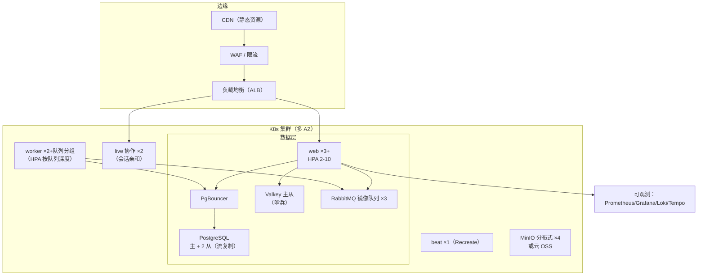
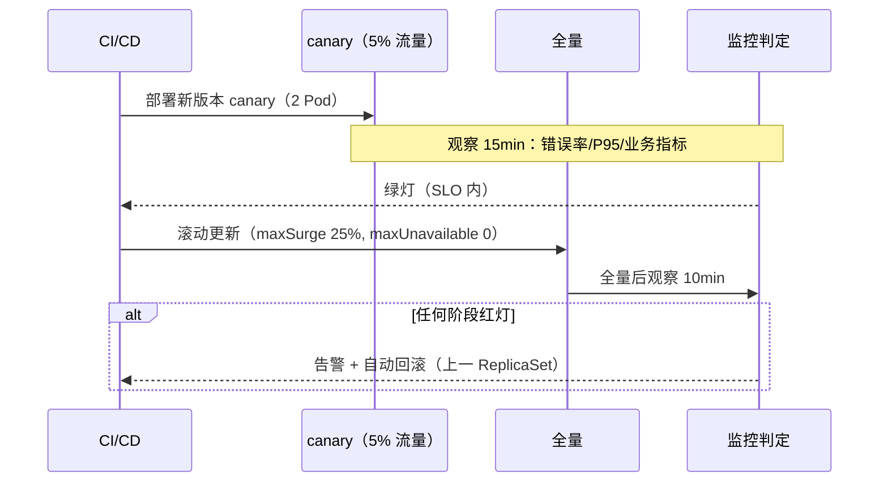

# 高可用集群与私有化部署

| 元信息项 | 内容 |
| --- | --- |
| 文档编号 | INFRA-006 |
| 所属迭代 | P4：远期增强（第 13 周起，签约驱动排期） |
| 优先级 | P4（企业版增强 / 部署底座价值线） |
| 所属模块 | M12-INFRA 基础设施 |
| 文档状态 | 待评审（Draft） |
| 最后更新日期 | 2026-09-01 |
| 上游依据 | `docs/需求文档.md` §3.7 部署节、§8.2 P4 列（基础设施行） |
| 前置依赖 | `INFRA-005`（限流/备份/生产部署基线——本文档是其集群化扩展）、`AUTH-012`（多租户拓扑对 SaaS 集群的约束）、`INFRA-001/002`（Monorepo 与容器基线） |
| 下游依赖 | 大客户私有化交付（本能力是其标书基础）；P4+ 异地多活 |
| 架构基线 | [`tech-stack.md`](../architecture/tech-stack.md) 全文、[`api-conventions.md`](../architecture/api-conventions.md) §12（维护模式） |
| 竞品参考 | GitLab Omnibus / Helm Chart（私有化交付范式）、Plane（docker-compose 单机交付）、Jira Data Center（集群版商业化参照） |

> **范围声明**：本文档交付两种部署形态的工程化——**SaaS 高可用集群**（多副本、自动伸缩、灰度发布、全链路监控）与**大客户私有化**（Helm Chart / 离线安装包 / 升级工具链）。异地多活（跨地域双写）**不做**——RPO≤5min 的异地灾备（异步复制 + 一键切换演练）是本文档的边界。

---

## 1. 概述

### 1.1 功能定位

`INFRA-005` 把系统送进了「能生产运行」；本文档把它送进「敢签 SLA」。两端的驱动力：

| 形态 | 驱动力 | 目标 |
| --- | --- | --- |
| SaaS 集群 | 付费客户规模增长 + SLA 承诺（99.9%） | 单点全消除；发布零停机；故障 5 分钟内发现 |
| 私有化 | 大客户（政企/金融）准入 | 离线可装、2 人天交付、升级有工具不回手工文档 |

### 1.2 启动条件

| 条件 | 判定 |
| --- | --- |
| 商业条件 | SaaS 月流水达到需签 SLA 的体量，或首个私有化大单（通常 ≥ 50 万）签约——私有化交付包是标书附件 |
| 技术前置 | `INFRA-005` 单机生产稳定 ≥ 90 天；备份/恢复演练（`INFRA-005` §恢复）连续 3 次成功 |
| 选型前置 | K8s 发行版选型（SaaS 用云厂商托管 K8s；私有化交付用 k3s 单节点可起步 + Helm 同一套 Chart）；监控栈选型（Prometheus + Grafana + Loki，SaaS 与私有化同栈降维护成本） |

### 1.3 独立交付判定

1. SaaS 集群：任一组件（web/worker/DB 从库/Redis 节点）单点故障注入，服务不中断或 RTO < 60s；发布过程错误率零尖峰（灰度验证）。
2. 私有化：干净离线机器按安装包 2 人天完成部署并跑通冒烟套件；从 N-1 版本升级含数据迁移自动化。
3. 灾备演练：异地备份恢复 RPO ≤ 5min、RTO ≤ 4h，演练报告归档。
4. 零回归：单 docker-compose 部署形态继续受支持（小客户/试用），`INFRA-005` 文档不失效。

### 1.4 竞品参考结论（详见第 6 章）

- **GitLab**：Omnibus 一体化包 + Helm Chart 双轨，私有化交付的行业天花板；升级路径工具化（`gitlab-ctl`）。
- **Jira Data Center**：集群版单独定价的商业范式——HA 是增值 SKU 而非默认。
- **Plane**：docker-compose 单机交付，无 HA 方案（社区诟病点）。
- **本系统取舍**：交付工具链对齐 GitLab（Helm + 安装器脚本）；HA 商业化对齐 Jira DC（集群支持属企业版旗舰档）；监控栈自建开源（不引 SaaS 监控依赖，私有化必须闭环）。

---

## 2. 业务逻辑（部署架构规格）

### 2.1 SaaS 集群拓扑



| 组件 | 副本 | HA 机制 | 故障影响 |
| --- | --- | --- | --- |
| web | ≥3（跨 AZ） | HPA + PDB(minAvailable=2) | 单 Pod 摘除无感 |
| live（Hocuspocus） | 2 | 会话亲和 + 房间重连（`COLLAB-004` 重同步） | 断连 ≤ 3s 自动恢复 |
| worker | ≥2/队列组 | 队列消费天然多活 | 任务重投（幂等消费已保证） |
| beat | 1 | Recreate 策略（防重跑） | 重启间隙 ≤ 60s，任务补跑 |
| PostgreSQL | 1 主 2 从 | 流复制 + repmgr 自动故障转移 | RTO < 60s；读请求可走从库 |
| Valkey | 主从 + 哨兵 | 自动切换 | 缓存短暂miss，Session 在 DB 兜底（`INFRA-005` 决策） |
| RabbitMQ | 3 节点镜像队列 | quorum queue | 无感 |
| MinIO | 4 节点 EC:2 | 纠删码 | 单机故障无感 |

### 2.2 灰度发布与回滚



| 规则 | 说明 |
| --- | --- |
| 门禁指标 | HTTP 5xx 率 < 0.1%、P95 < 基线 ×1.2、队列积压不增长、WS 断连率 < 1% |
| DB 迁移纪律 | 迁移必须**前后兼容**（加列可回滚、删列分两版本）；破坏性迁移走 `INFRA-005` 维护窗口预案 |
| 回滚 | 应用层一键回滚（ReplicaSet 保留 5 代）；DB 只前滚不后滚（备份兜底） |

### 2.3 私有化交付包

| 交付物 | 内容 |
| --- | --- |
| 离线安装包 | 镜像 tar 包（全部组件）+ Helm Chart + 安装器脚本（`install.sh`：环境预检 → k3s 落地 → Chart 安装 → License 导入 → 冒烟） |
| 规格档位 | 标准档（k3s 单节点 8C16G，≤200 用户）/ 高可用档（3 节点 + 外置 PG/MinIO，≤2000 用户） |
| License | 离线 License 文件（RSA 签名，绑定域名 + 席位 + 到期）；校验失败只读模式（不锁数据） |
| 升级工具 | `rp-upgrade`：版本检查 → 备份快照 → 镜像更新 → 迁移执行 → 冒烟 → 失败自动回滚应用层 |
| 运维手册 | 监控接入口（Prometheus 端点暴露）、日志采集、备份对接客户既有存储 |

### 2.4 灾备（SaaS）

| 层级 | 机制 | 指标 |
| --- | --- | --- |
| 数据备份 | 沿用 `INFRA-005`（每日全量 + WAL 归档），异地对象存储复制 | RPO ≤ 5min（WAL） |
| 应用无状态 | web/worker 无状态可任意重建；配置入 Git（GitOps） | 重建 < 30min |
| 切换演练 | 每季度隔离环境恢复演练（复用 `INFRA-005` 演练脚本 + 集群参数） | RTO ≤ 4h |
| 明确不做 | 跨地域双活/双写（一致性成本远超当前客户体量收益） | — |

### 2.5 全链路监控

| 层 | 工具 | 关键指标 |
| --- | --- | --- |
| Metrics | Prometheus + Grafana | RED（请求/错误/时延）、队列深度、DB 复制延迟、HPA 水位 |
| 日志 | Loki + 结构化 JSON 日志 | `request_id` 贯穿（api-conventions §5）；错误日志 5min 聚合告警 |
| Trace | OpenTelemetry + Tempo | 慢链路下钻（web→DB→Celery）；采样率 10% |
| 告警 | Alertmanager → 值班 webhook | 分级：P1 电话/P2 IM/P3 日报；与 `AUTH-012` 风控面分离 |
| SLA 报表 | 自动月报 | 可用性计算（剔除维护窗口）、故障复盘链接 |

### 2.6 业务规则（BR）

| 编号 | 规则 | 说明 |
| --- | --- | --- |
| BR-01 | 单点清零 | SaaS 集群任意单组件（含单 AZ）故障不中断服务或 RTO < 60s；每季度混沌演练验证 |
| BR-02 | 发布零停机 | `maxUnavailable=0` + 前后兼容迁移；破坏性交更必须走维护模式（api-conventions §12 `SERVER_MAINTENANCE`） |
| BR-03 | 状态外置 | 应用 Pod 无本地状态：上传走预签名直传对象存储；Session 在 Valkey + DB 兜底；临时文件用 emptyDir 且不留关键数据 |
| BR-04 | 配置即代码 | 全部环境差异走 Helm values / GitOps 仓库；禁止手工 kubectl 改生产（审计 webhook 记录） |
| BR-05 | 密保统一 | 云上 KMS 或 Vault；私有化用密封 secret（kubeseal）；任何密文不入 Git 明文 |
| BR-06 | License 宽严 | License 过期：功能降只读、数据完整、导出可用；**永不**锁死客户数据（商业伦理红线） |
| BR-07 | 离线闭环 | 私有化部署不依赖任何公网服务（含字体/图标/遥测全本地化；遥测默认关且可验） |
| BR-08 | 升级可回滚 | 应用层回滚自动化；DB 迁移只前滚，升级前强制快照（`rp-upgrade` 内置） |
| BR-09 | 资源护栏 | 每组件 requests/limits 明示；PDB 全覆盖；节点亲和把数据层与工作负载分层 |
| BR-10 | 演练纪律 | 灾备演练每季度一次、混沌演练每季度一次、私有化升级演练每版本一次；报告归档 |
| BR-11 | 小形态存续 | docker-compose 单机形态继续维护（试用/小客户），文档与 Chart 同仓同步更新 |
| BR-12 | SLA 可证 | 可用性从监控数据自动计算生成月报；故障复盘（5 Why）24h 内产出并链接 |

---

## 3. UI/UX 设计

### 3.1 交付面说明

本文档的「界面」主要是**运维面**而非终端用户面：

| 界面 | 使用者 | 内容 |
| --- | --- | --- |
| Grafana 大盘 | 我方 SRE / 私有化客户运维 | 集群健康、SLO 仪表、租户资源 TopN |
| 安装器终端交互 | 实施工程师 | 预检报告、进度条、冒烟结果 |
| License 管理页 | 私有化客户 WS_ADMIN | License 状态、席位用量、到期提醒（90/30/7 天三档横幅） |
| 系统状态页 | 终端用户（SaaS） | 公开 status 页：组件状态与历史事故（BR-12 信任面） |

### 3.2 Grafana 大盘线框

```
┌─ RabbitProjects · 生产总览 ────────────────────────────────────┐
│ SLO(30d): 99.95% ██████████████████░  错误预算剩余: 68%         │
├───────────┬───────────┬───────────┬───────────┬────────────────┤
│ 请求速率   │ 5xx 率    │ P95 延迟  │ 队列积压  │ WS 在线连接    │
│ 1,240/min │ 0.02% ●  │ 210ms ●  │ 12 ●     │ 3,482          │
├───────────┴───────────┴───────────┴───────────┴────────────────┤
│ Web Pods: ●●●●●○ (HPA 5/10)   DB 复制延迟: 0.3s / 0.4s          │
│ 缓存命中: 96.2%   MinIO 容量: ██████░░ 61%                      │
│ 慢查询 Top5: [列表…]   最近告警: P3 磁盘 78% (node-3, 2h 前)     │
└─────────────────────────────────────────────────────────────────┘
```

### 3.3 License 横幅与安装器线框

```
系统内横幅（到期前 30 天）
┌──────────────────────────────────────────────────────────────┐
│ ⚠ License 将于 30 天后到期（2026-10-01）。请联系商务续期；    │
│   到期后系统将转为只读，数据不受影响。          [查看 License] │
└──────────────────────────────────────────────────────────────┘

安装器终端
$ sudo ./install.sh --bundle rp-enterprise-v1.4.0-offline.tar.gz
[1/6] 环境预检 … ✓ 8C/16G ✓ 磁盘 480G ✓ 内核 6.1 ✓ 无公网依赖
[2/6] 部署 k3s … ✓ (42s)
[3/6] 导入镜像 (12) … ✓ (3m10s)
[4/6] 安装 Chart（标准档） … ✓ web×2 worker×2 db×1 minio×1
[5/6] 导入 License … ✓ 席位 200 · 到期 2027-08-31
[6/6] 冒烟检查 (18 项) … ✓✓✓ … 全部通过 (28s)
访问: https://rp.corp.internal  初始管理员: admin / 见 .rp-initial-secret
```

### 3.4 交互规则

| 场景 | 交互 |
| --- | --- |
| License 临期 | 90/30/7 天三档横幅（信息/警告/严重）；到期转只读：写操作 `PERM_LICENSE_REQUIRED`，横幅含导出指引（BR-06） |
| 安装失败 | 预检失败给出具体修复命令（非笼统报错）；任一步失败可 `--resume` 续装 |
| 状态页 | 事故条目含时间线与复盘链接；订阅更新走 webhook（`INTG-002`） |

---

## 4. 技术架构

### 4.1 Helm Chart 结构

```
deploy/chart/rabbit-projects/
├── Chart.yaml                  # appVersion 与版本锚定
├── values.yaml                 # 默认（SaaS 基线）
├── values-saas-prod.yaml       # SaaS 生产（多 AZ/HPA/外置数据层）
├── values-onprem-standard.yaml # 私有化标准档（k3s 单节点，内嵌 PG/MinIO）
├── values-onprem-ha.yaml       # 私有化高可用档（3 节点，外置 PG/MinIO）
├── templates/
│   ├── web/         # Deployment + HPA + PDB + Service + Ingress
│   ├── live/        # 协作服务（会话亲和 Service sessionAffinity: ClientIP）
│   ├── worker/      # 按队列组拆分 Deployment（default/activity/webhook/…）
│   ├── beat/        # Deployment replicas=1 strategy: Recreate
│   ├── data/        # 私有化内嵌 PG(StatefulSet)/Valkey/MinIO；SaaS 外链
│   ├── observability/ # ServiceMonitor + GrafanaDashboard ConfigMap
│   └── security/    # NetworkPolicy + SealedSecret + RBAC
└── files/
    ├── smoke/       # 冒烟套件（18 项，install.sh 第 6 步同款）
    └── dashboards/  # Grafana JSON（§3.2）
```

| values 关键项（节选） | SaaS | 私有化标准 | 私有化 HA |
| --- | --- | --- | --- |
| `web.replicas / hpa` | 3 / 2-10 | 2 / — | 3 / 2-6 |
| `postgresql.mode` | external（云 RDS 主从） | embedded-single | external（客户 PG 集群） |
| `minio.mode` | external（云 OSS） | embedded-single | external（客户 MinIO 分布式） |
| `persistence.backupTo` | 异地 OSS | 客户 NAS（NFS CSI） | 同左 |
| `telemetry.enabled` | true | false（BR-07） | false |

### 4.2 HPA 与 PDB 清单（web 示例）

```yaml
# templates/web/hpa.yaml
apiVersion: autoscaling/v2
kind: HorizontalPodAutoscaler
metadata: { name: rp-web }
spec:
  scaleTargetRef: { apiVersion: apps/v1, kind: Deployment, name: rp-web }
  minReplicas: 2
  maxReplicas: 10
  metrics:
    - type: Resource
      resource: { name: cpu, target: { type: Utilization, averageUtilization: 65 } }
    - type: Pods
      pods:
        metric: { name: http_requests_per_second }
        target: { type: AverageValue, averageValue: "40" }
  behavior:
    scaleDown: { stabilizationWindowSeconds: 300 }   # 防抖动
---
apiVersion: policy/v1
kind: PodDisruptionBudget
metadata: { name: rp-web }
spec:
  minAvailable: 2
  selector: { matchLabels: { app: rp-web } }
```

| worker 伸缩 | 按队列深度自定义指标（RabbitMQ `queue_messages_ready` 经 prometheus-rabbitmq-exporter 暴露）：深度 > 500 持续 2min 触发扩容，0 持续 10min 缩容 |
| --- | --- |

### 4.3 数据库 HA 与迁移纪律

| 主题 | 规格 |
| --- | --- |
| 故障转移 | repmgr 托管主从；`repmgrd` 自动 promote；PgBouncer 配置重载指向新主（< 60s RTO，BR-01） |
| 读写分离 | 重读端点（报表/导出）路由只读副本：`DATABASE_READ_REPLICA_DSN`，`RPT-*` 查询引擎显式走从库 |
| 迁移门禁 | CI 强制检查：新迁移必须前后兼容（`AddField` 带默认值/`null=True`；删列禁止与代码同版本）；危险迁移需 `--maintenance` 标记走维护窗口 |
| 连接治理 | PgBouncer transaction pooling；web 每 Pod max 20 连接；总连接预算 < PG `max_connections` 70% |

### 4.4 CI/CD 与灰度流水线

```yaml
# .ci/deploy-prod.yaml（节选）
stages:
  - name: canary
    steps:
      - helm_upgrade: { values: values-saas-prod.yaml, set: { image.tag: ${VERSION} },
                        only: [web-canary] }
      - assert_slo: { window: 15m, error_rate_lt: 0.001, p95_drift_lt: 1.2,
                      queue_backlog_stable: true }
  - name: full-rollout
    steps:
      - helm_upgrade: { strategy: rolling, maxSurge: "25%", maxUnavailable: 0 }
      - assert_slo: { window: 10m }
    on_failure:
      - helm_rollback: { to_revision: previous }
      - page: { level: P1, message: "prod rollout ${VERSION} auto-rolled-back" }
```

| 规则 | 说明 |
| --- | --- |
| 版本锚定 | Chart `appVersion` 与镜像 tag 同源（Git tag）；禁止 `latest` |
| 迁移执行 | 迁移在 canary 阶段由一次性 Job 执行（先行于全量）；与 BR-02 兼容纪律联动 |

### 4.5 License 校验服务

```python
# apps/api/rp_license/service.py
import base64, json
from cryptography.hazmat.primitives.asymmetric import rsa, padding
from cryptography.hazmat.primitives import hashes


class LicenseService:
    """离线 License：RSA 签名 JSON，本地公钥验签，零外呼（BR-07）。"""

    GRACE_READONLY_DAYS = 0          # 到期即只读（提前 90/30/7 已充分提醒）

    def load(self) -> "License":
        raw = license_store.read()   # 安装时导入，存 DB 单例行
        payload, sig = raw["payload"], base64.b64decode(raw["signature"])
        PUBLIC_KEY.verify(
            sig, json.dumps(payload, sort_keys=True).encode(),
            padding.PKCS1v15(), hashes.SHA256())
        return License(**payload)    # {seats, expires_at, domain, tier, features[]}

    def enforce(self, request) -> None:
        lic = self.load()
        if timezone.now().date() > lic.expires_at:
            if request.method not in ("GET", "HEAD", "OPTIONS"):
                raise LicenseExpired   # → PERM_LICENSE_REQUIRED（BR-06）
        if request.resolver_match and "export" in request.path:
            return                     # 导出走通：数据主权红线
        cache.set("license:state", lic.state(), timeout=300)   # 快路径
```

| 要点 | 说明 |
| --- | --- |
| 验签成本 | 结果缓存 5min，请求路径零密码学开销 |
| 席位计数 | 活跃成员数 > seats 时**告警**不踢人（超限坐席 30 天整改期，商务流程衔接） |
| 防篡改 | 公钥编译进发行包；篡改 License 仅导致验签失败 → 只读，不崩溃 |

**成功示例** — `GET /api/v1/workspaces/{slug}/license/`（私有化 License 状态）：

```json
{
  "status": "success",
  "data": {
    "tier": "enterprise-ha",
    "seats": {"limit": 200, "active": 173},
    "expires_at": "2027-08-31",
    "days_remaining": 364,
    "domain": "rp.corp.internal",
    "features": ["ldap_scim", "ai_selfhosted", "ha_support"],
    "readonly": false
  },
  "meta": {"request_id": "01J70HK2M8NQ4PXRBTVH5WD3EA"}
}
```

**错误示例** — License 过期后的写操作（BR-06）：

```json
{
  "status": "error",
  "error": {
    "code": "PERM_LICENSE_REQUIRED",
    "message": "License 已于 2026-10-01 到期，系统处于只读模式；数据完整，导出功能不受影响，请联系商务续期",
    "details": [{"field": "license", "code": "INVALID",
                 "message": "到期日: 2026-10-01；只读期间 GET 与导出端点正常"}]
  },
  "meta": {"request_id": "01J70HL3N9OR5QYSCUW6XE4FB"}
}
```

### 4.6 监控埋点（应用侧）

| 埋点 | 实现 |
| --- | --- |
| RED | 中间件暴露 `http_requests_total{route,method,status}` 与 `http_request_duration_seconds` 直方图（route 模板化，禁高基标签） |
| 队列 | Celery 任务装饰器统一埋 `task_duration_seconds{queue,task}`；队列深度由 RabbitMQ exporter 供给 |
| DB | django-prometheus 连接池与查询计数；慢查询 > 500ms 结构化日志（`request_id` 串联 Loki↔Tempo） |
### 4.7 NetworkPolicy（零信任内网）

```yaml
# templates/security/networkpolicy-web.yaml（默认拒绝 + 白名单放行）
apiVersion: networking.k8s.io/v1
kind: NetworkPolicy
metadata: { name: rp-web }
spec:
  podSelector: { matchLabels: { app: rp-web } }
  policyTypes: [Ingress, Egress]
  ingress:
    - from: [{ namespaceSelector: { matchLabels: { name: ingress } } }]
      ports: [{ port: 8000 }]
  egress:
    - to: [{ podSelector: { matchLabels: { app: pgbouncer } } }]
      ports: [{ port: 6432 }]
    - to: [{ podSelector: { matchLabels: { app: valkey } } }]
      ports: [{ port: 6379 }]
    - to: [{ namespaceSelector: { matchLabels: { name: rabbitmq } } }]
      ports: [{ port: 5672 }]
    - ports: [{ port: 53, protocol: UDP }]      # DNS
    - ports: [{ port: 443 }]                     # 出网（对象存储/集成回调，经 egress 网关审计）
```

| 规则 | 说明 |
| --- | --- |
| 默认拒绝 | 全命名空间 `default-deny-all` 兜底，逐组件开白名单 |
| 数据层隔离 | PG/Valkey/MinIO 只接受来自 pgbouncer/web/worker 的连接；监控命名空间仅 9100/metrics 可达 |
| 出网审计 | 私有化环境出网 443 全部经 egress 网关日志（集成回调可审计，BR-07 遥测验证依据） |

### 4.8 备份/恢复 Runbook（摘要，全文在运维手册）

| 步骤 | SaaS | 私有化 | 验证 |
| --- | --- | --- | --- |
| 日常备份 | RDS 快照 + WAL 归档 → 异地 OSS（`INFRA-005`） | `rp-backup` CronJob → 客户 NAS | 每日校验 sha256 清单 |
| 恢复准备 | 隔离集群 + 解冻密钥 | 隔离 VM + 安装包同版本 | 预检脚本 |
| 数据恢复 | 快照重建 + WAL replay 到 PITR 点 | `rp-restore --to <ts>` | 行数比对（核心表） |
| 应用恢复 | GitOps 同版本部署 | 同版本安装 + 备份挂载 | 冒烟 18 项 |
| 切换 | DNS/入口切换（TTL 预降 60s） | 客户侧切换 | 业务对账抽查 20 单 |
| 时限 | RTO ≤ 4h / RPO ≤ 5min | 同左（标准档 RPO ≤ 24h——NAS 备份周期） | 演练报告归档（BR-10） |

### 4.9 私有化交付 checklist（实施工程师签字项）

- [ ] 预检报告客户签字（硬件/网络/存储确认）
- [ ] 离线包 sha256 与发布页一致（防供应链篡改）
- [ ] License 绑定域名与https 证书一致
- [ ] 备份目标（NAS）挂载与首备成功
- [ ] 监控端点（Prometheus federation）对接客户既有运维平台或交付独立 Grafana
- [ ] 管理员初始口令移交记录 + 强制改密确认
- [ ] 遥测关闭状态截图存证（BR-07）
- [ ] 升级窗口与联系机制写入运维交接单

---

## 5. 测试用例

### 5.1 部署测试（DT，替代常规 UT）

| 编号 | 用例 | 断言 |
| --- | --- | --- |
| DT-01 | Chart 模板渲染 | 四套 values `helm template` 全绿；kube-score 静态检查无高危 |
| DT-02 | 私有化离线安装 | 干净断网 VM（8C16G）`install.sh` 全程无公网请求（tcpdump 断言）+ 冒烟 18 项全过 |
| DT-03 | 升级回滚 | N-1 数据 fixture 升级 → 迁移自动 → 冒烟过；注入迁移失败 → 应用回滚且数据快照可恢复 |
| DT-04 | License 验签 | 篡改 payload 验签失败转只读；过期 License 写操作 `PERM_LICENSE_REQUIRED` 且导出可用 |
| DT-05 | 迁移兼容门禁 | 提交破坏性迁移（同版本删列）CI 红灯阻断 |
| DT-06 | HPA 行为 | 压测 CPU 80%：2min 内扩容；回落 5min 后缩容；PDB 保证 minAvailable |
| DT-07 | 单点故障注入 | 杀 web Pod×1 / worker×1 / Redis 主：服务可用性或 RTO < 60s |
| DT-08 | DB 故障转移 | 杀 PG 主：repmgr promote < 60s；写恢复无数据丢失（同步复制窗口） |
| DT-09 | 灾备演练 | 异地备份恢复到隔离集群：RPO ≤ 5min、RTO ≤ 4h、冒烟通过 |
| DT-10 | 配置漂移 | GitOps 仓库与集群实际 diff 为零（每日审计 Job） |
| DT-11 | 只读降级 | License 过期演练：全部写端点拒、读正常、导出可用、横幅正确 |
| DT-12 | compose 存续 | `INFRA-005` docker-compose 形态新装 + 冒烟全过（BR-11） |

### 5.2 演练与发布验证（E2E）

| 编号 | 场景 | 验收 |
| --- | --- | --- |
| E2E-01 | 灰度发布 | 真实版本发布：canary 15min 门禁 → 全量 → 零错误尖峰；注入慢查询版本验证自动回滚 |
| E2E-02 | 混沌日 | 季度混沌演练报告：BR-01 全部单点场景记录 RTO 与发现时间 |
| E2E-03 | SLA 月报 | 自动月报数据与监控原始数据抽样一致；事故条目链接复盘 |

---

## 6. 竞品深度对标

| 维度 | GitLab | Jira Data Center | Plane | 本系统 |
| --- | --- | --- | --- | --- |
| 私有化交付 | Omnibus + Helm 双轨，工具化升级 | DC 安装器 + 集群向导 | docker-compose only | 离线包 + Helm（k3s 起步）+ `rp-upgrade` |
| HA 商业化 | 含在订阅（Geo 另售） | 集群版独立 SKU（贵） | ❌ 无 | HA 属旗舰档（对齐 DC 范式） |
| 发布 | 零停机（自称，大版本仍有窗口） | 滚动升级（ZDU） | 无方案 | canary + SLO 门禁 + 自动回滚 |
| 监控 | 内置 Prometheus | 需外挂 + 插件 | 无 | 同栈双形态（Prom/Grafana/Loki/Tempo） |
| License | 在线激活（可离线） | 离线 License | 无 | 离线 RSA 验签 + 只读降级不锁数据（BR-06） |
| 多活 | Geo（只读副本） | 无跨地域 | 无 | 明确不做双活，灾备 RPO≤5min/RTO≤4h |

**结论**：GitLab 证明了私有化竞争力的核心是「安装与升级的工具化程度」而非架构华丽度——客户记恨的是升级翻车，不是少了双活。Jira DC 证明 HA 可以是独立定价点，但 DC 的复杂度（应用层集群状态同步）是反面教材：本系统从架构上保证应用无状态（BR-03），HA 只是副本数问题而非代码分支问题。License 的「只读不锁数据」红线是与客户建立长期信任的合同级承诺。

---

## 7. 里程碑与验收

### 7.1 工作量估算

| 交付面 | 内容 | 估算 |
| --- | --- | --- |
| Chart 与安装器 | 四套 values、全部模板、install.sh、冒烟套件 | 6 d |
| SaaS 集群落地 | 多 AZ 拓扑、HPA/PDB、数据层 HA、PgBouncer、读写分离 | 5 d |
| CI/CD 灰度 | canary 流水线、SLO 门禁、自动回滚、迁移门禁 | 3 d |
| 可观测 | 指标/日志/Trace 埋点、Grafana 大盘、告警分级、SLA 月报 | 3 d |
| License | 验签服务、管理页、横幅、只读降级 | 2 d |
| 演练与测试 | DT-01~12、E2E-01~03、混沌与灾备首轮演练 | 3 d |
| **合计** | | **22 d（3 人并行约 2.5 周）** |

### 7.2 可操作演示的验收标准

1. 故障注入演示（DT-07/08）：现场杀 Pod 与 PG 主，RTO 与数据完整性达标。
2. 灰度发布演示（E2E-01）：含一次注入故障触发的自动回滚。
3. 私有化离线交付演示（DT-02）：断网 VM 从零到冒烟通过 ≤ 2 人天（实测计时）。
4. 升级演练（DT-03）：N-1 → 新版本自动化升级与回滚路径均验证。
5. License 演示（DT-04/11）：过期只读 + 导出可用 + 数据完整。
6. 灾备演练报告（DT-09）归档；SLA 月报首月产出（E2E-03）。
7. 零回归：docker-compose 形态冒烟全过（DT-12）；`INFRA-005` 文档交叉引用更新完成。