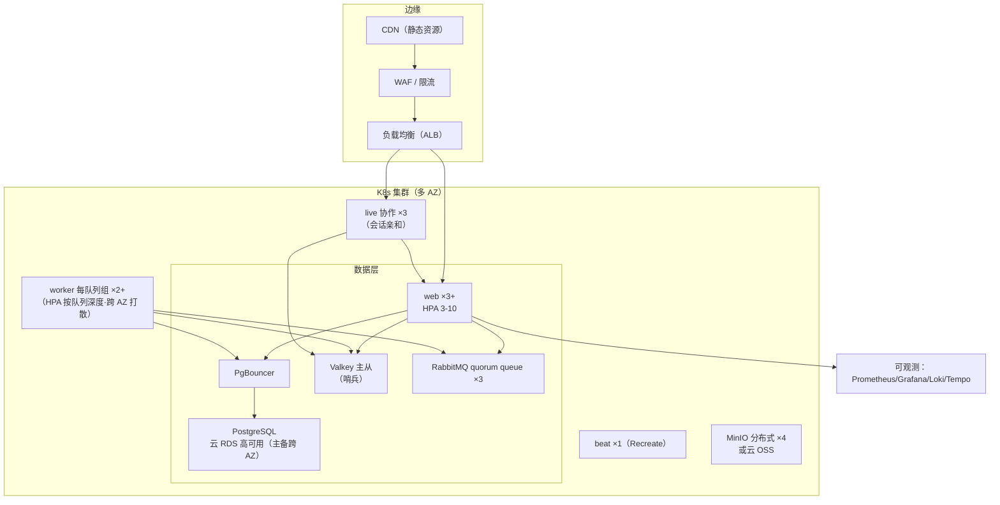
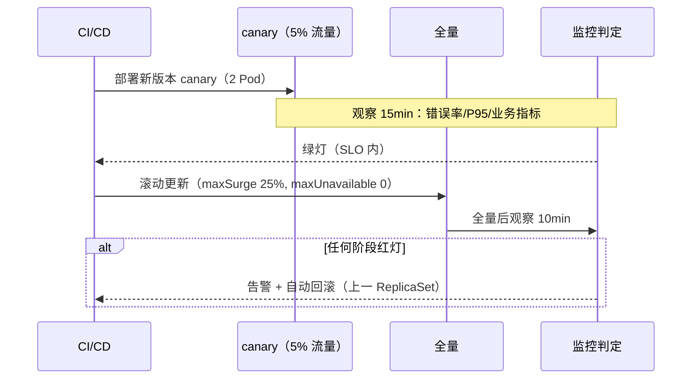

# 高可用集群与私有化部署

| 元信息项 | 内容 |
| --- | --- |
| 文档编号 | INFRA-006 |
| 所属迭代 | P4：远期增强（第 13 周起，签约驱动排期） |
| 优先级 | P4（企业版增强 / 部署底座价值线） |
| 所属模块 | M12-INFRA 基础设施 |
| 文档状态 | R5 评审修复完成 · R6 复评 PASS（10/9.5/9.5/10/10） |
| 最后更新日期 | 2026-09-06 |
| 修复摘要 | 2026-09-05 R1 评审 10 项问题逐条修复（数据层双形态矩阵 / 引用节号 / 响应信封 / NetworkPolicy 白名单 / HPA 跨 AZ 打散等），逐条清单见附录 A；2026-09-06 R2 评审 4 MAJOR + 3 MINOR + 6 INFO 逐条修复（副本口径统一 live=3 / worker 每队列组 ≥2 并按组件给出单 AZ 存活下限；web/live NetworkPolicy 补监控命名空间抓取放行；worker 出向补 SMTP :587/:465；数据层补同层 HA 互连；依赖登记补 cryptography / prometheus-adapter 等），逐条清单见附录 B；2026-09-06 R3 评审 3 MAJOR + 5 MINOR + 6 INFO 逐条修复（web/worker/live 出向补 valkey 哨兵 :26379 发现新主；矩阵补私有化 HA 档外置 PG/MinIO 出向与 ingress→minio 预签名直传入向；beat 可选抓取口径、组件命名映射、≥3 AZ 前提、prometheus-adapter 适用形态、live 内部端点出处等收口），逐条清单见附录 C；2026-09-06 R4 评审 2 MAJOR + 4 MINOR + 5 INFO 逐条修复（§4.7 矩阵监控行重排——出向补组件 metrics 抓取/命名空间内互连/对象存储数据面、入向补 adapter/Grafana/OTel 通道，default-deny-all 不豁免口径明示；pgbouncer 出向补只读副本 :5432 只读池、RPT 走向写清；§2.1 拓扑补 live→valkey/web、worker→valkey 三边并加图注；DNS 补 TCP :53 对齐 `INFRA-005` §4.5.2 基线；矩阵补 ingress 命名空间行与 worker/pgbouncer YAML 同构生成注等收口），逐条清单见附录 D；2026-09-06 R5 评审 2 MAJOR + 4 MINOR 修复（rp-web 入向补 live 来源腿——verify-rooms/onStoreDocument 收端；pgbouncer 出向补 DNS :53 三形态域名解析；§4.7 命名空间规划注；ingress 控制器 hostNetwork 前提；web 出向 FQDN 策略承接 INFRA-005 BR-13；HA 档直传走向注）+ R6 复评 PASS（10/9.5/9.5/10/10）后收口（pgbouncer DNS 键移入出向列、§3.3 线框副本口径对齐），逐条见附录 E |
| 上游依据 | `docs/需求文档.md` §7.9 部署与安全、§8.2 分模块优先级全景表 P4 列（部署运维行：高可用集群、异地灾备、灰度发布、企业级全链路监控）——原引 §3.7 系节号错引（该节实为「文件资源管理模块」） |
| 前置依赖 | `INFRA-005`（限流/备份/生产部署基线——本文档是其集群化扩展）、`AUTH-012`（多租户拓扑对 SaaS 集群的约束）、`INFRA-001/002`（Monorepo 与容器基线） |
| 下游依赖 | 大客户私有化交付（本能力是其标书基础）；P4+ 异地多活 |
| 架构基线 | [`tech-stack.md`](../architecture/tech-stack.md) 全文、[`api-conventions.md`](../architecture/api-conventions.md) §4（统一响应格式）、§8.6（`SERVER_MAINTENANCE` 维护模式）、§10.4（全局异常处理，含配套中间件表）——原引 §12（维护模式）系节号错引，§12 实为「与 Ones Open API 的对比」，架构文档自身无矛盾、无需回改 |
| 竞品参考 | GitLab Omnibus / Helm Chart（私有化交付范式）、Plane（docker-compose 单机交付）、Jira Data Center（集群版商业化参照） |

> **范围声明**：本文档交付两种部署形态的工程化——**SaaS 高可用集群**（多副本、自动伸缩、灰度发布、全链路监控）与**大客户私有化**（Helm Chart / 离线安装包 / 升级工具链）。异地多活（跨地域双写）**不做**——RPO≤5min 的异地灾备（异步复制 + 一键切换演练）是本文档的边界。

---

## 1. 概述

### 1.1 功能定位

`INFRA-005` 把系统送进了「能生产运行」；本文档把它送进「敢签 SLA」。两端的驱动力：

| 形态 | 驱动力 | 目标 |
| --- | --- | --- |
| SaaS 集群 | 付费客户规模增长 + SLA 承诺（99.9%） | 单点全消除；发布零停机；故障 5 分钟内发现 |
| 私有化 | 大客户（政企/金融）准入 | 离线可装、2 人天交付、升级有工具不回手工文档 |

### 1.2 启动条件

| 条件 | 判定 |
| --- | --- |
| 商业条件 | SaaS 月流水达到需签 SLA 的体量，或首个私有化大单（通常 ≥ 50 万）签约——私有化交付包是标书附件 |
| 技术前置 | `INFRA-005` 单机生产稳定 ≥ 90 天；备份/恢复演练（`INFRA-005` §2.2 备份日循环与恢复演练、§4.4.4 演练脚本）连续 3 次成功 |
| 选型前置 | K8s 发行版选型（SaaS 用云厂商托管 K8s；私有化交付用 k3s 单节点可起步 + Helm 同一套 Chart）；监控栈选型（Prometheus + Grafana + Loki，SaaS 与私有化同栈降维护成本） |

### 1.3 独立交付判定

1. SaaS 集群：任一组件（web/worker/DB 主备切换/Valkey 主节点）单点故障注入，服务不中断或 RTO < 60s；发布过程错误率零尖峰（灰度验证）。
2. 私有化：干净离线机器按安装包 2 人天完成部署并跑通冒烟套件；从 N-1 版本升级含数据迁移自动化。
3. 灾备演练：异地备份恢复 RPO ≤ 5min、RTO ≤ 4h，演练报告归档。
4. 零回归：单 docker-compose 部署形态继续受支持（小客户/试用），`INFRA-005` 文档不失效。

### 1.4 竞品参考结论（详见第 6 章）

- **GitLab**：Omnibus 一体化包 + Helm Chart 双轨，私有化交付的行业天花板；升级路径工具化（`gitlab-ctl`）。
- **Jira Data Center**：集群版单独定价的商业范式——HA 是增值 SKU 而非默认。
- **Plane**：docker-compose 单机交付，无 HA 方案（社区诟病点）。
- **本系统取舍**：交付工具链对齐 GitLab（Helm + 安装器脚本）；HA 商业化对齐 Jira DC（集群支持属企业版旗舰档）；监控栈自建开源（不引 SaaS 监控依赖，私有化必须闭环）。

---

## 2. 业务逻辑（部署架构规格）

### 2.1 SaaS 集群拓扑



> 图注：连线仅画主干调用（live→web 为 verify-rooms 票据复核、live/worker→valkey 为房间广播与 result backend；beat 调度边省略），全量网络白名单以 §4.7 策略矩阵为准。

| 组件 | 副本 | HA 机制 | 故障影响 |
| --- | --- | --- | --- |
| web | ≥3（跨 AZ） | HPA + PDB(minAvailable=2) | 单 Pod 摘除无感 |
| live（Hocuspocus） | 3（跨 AZ 打散） | 会话亲和 + `@hocuspocus/extension-redis` 跨实例房间广播 | 单 Pod 摘除后新建连接无感；存量连接按 `COLLAB-004` §2.2 语义处理：退避重连（1s→2s→…→30s 封顶）+ 水位补偿不丢数据，心跳超时判定 ≤ 60s，重连窗口内事件通道降级轮询（SWR 60s 周期兜底、`/health` 每 30s 探测恢复——量级同 `COLLAB-004` §2.2 降级恢复口径）——与 `COLLAB-004` 断连重连语义一致 |
| worker | ≥2/队列组 | 队列消费天然多活（跨 AZ 打散同 §4.2 规则） | 任务重投（幂等消费已保证） |
| beat | 1 | Recreate 策略（防重跑） | 重启间隙 ≤ 60s，任务补跑 |
| PostgreSQL | 云 RDS 高可用版（主备跨 AZ）+ 只读副本 | 云厂商托管自动故障转移（应用连接端点不变） | RTO < 60s；重读走只读副本（经 pgbouncer 只读池路由，§4.3/§4.7）。私有化 HA 档为自建流复制 + repmgr（形态矩阵见 §2.3） |
| Valkey | 主从 + 哨兵 | 自动切换（客户端经哨兵 :26379 查询发现新主，网络放行见 §4.7） | 缓存短暂 miss；Session 在 Valkey + DB 兜底（BR-03，本文明确定义，不依赖 `INFRA-005`） |
| RabbitMQ | 3 节点 quorum queue | Raft 多数派 | 无感 |
| MinIO | 4 节点 EC:2（私有化档；SaaS=云 OSS） | 纠删码 | 单机故障无感 |

> 组件命名映射：本文 web（Django :8000）＝`INFRA-005` §4.5.2 清单骨架的 rp-api／需求文档 docker-compose 的 api 服务——本文统一命名 rp-web（与 live/worker/beat 命名族一致），上游两文档无需回改。

### 2.2 灰度发布与回滚



| 规则 | 说明 |
| --- | --- |
| 门禁指标 | HTTP 5xx 率 < 0.1%、P95 < 基线 ×1.2、队列积压不增长、WS 断连率 < 1% |
| DB 迁移纪律 | 迁移必须**前后兼容**（加列可回滚、删列分两版本）；破坏性迁移走维护模式预案（api-conventions §8.6 `SERVER_MAINTENANCE` + §10.4 `MaintenanceModeMiddleware`，本文 §2.2 灰度门禁联动——`INFRA-005` 无「维护窗口」定义，本文明确定义、不依赖 `INFRA-005`） |
| 回滚 | 应用层一键回滚（ReplicaSet 保留 5 代）；DB 只前滚不后滚（备份兜底） |

### 2.3 私有化交付包

| 交付物 | 内容 |
| --- | --- |
| 离线安装包 | 镜像 tar 包（全部组件）+ Helm Chart + 安装器脚本（`install.sh`：环境预检 → k3s 落地 → Chart 安装 → License 导入 → 冒烟） |
| 规格档位 | 标准档（k3s 单节点 8C16G，≤200 用户）/ 高可用档（3 节点 + 外置 PG/MinIO，≤2000 用户） |
| License | 离线 License 文件（RSA 签名，绑定域名 + 席位 + 到期）；校验失败只读模式（不锁数据） |
| 升级工具 | `rp-upgrade`：版本检查 → 备份快照 → 镜像更新 → 迁移执行 → 冒烟 → 失败自动回滚应用层 |
| 运维手册 | 监控接入口（Prometheus 端点暴露）、日志采集、备份对接客户既有存储 |
| 数据层形态矩阵 | **SaaS=云 RDS 高可用**（备份/故障转移/监控全托管，本文 §2.1/§4.3/§4.8/DT-08 均按此形态）；私有化标准档=内嵌单机 PG（快照备份）；私有化 HA 档=自建 PG 主从（流复制 + `repmgrd` 自动故障转移，备份走 `rp-backup`）——**repmgr 相关流程仅适用私有化 HA 档**，不用于 SaaS |

### 2.4 灾备（SaaS）

| 层级 | 机制 | 指标 |
| --- | --- | --- |
| 数据备份 | 沿用 `INFRA-005` §4.4（每日全量 + WAL 归档），异地对象存储复制；SaaS 数据层为云 RDS 时以 RDS 快照 + WAL 归档承载（§4.8） | RPO ≤ 5min（WAL） |
| 应用无状态 | web/worker 无状态可任意重建；配置入 Git（GitOps） | 重建 < 30min |
| 切换演练 | 每季度隔离环境恢复演练（复用 `INFRA-005` §4.4.4 演练脚本 + 集群参数） | RTO ≤ 4h |
| 异地多活 | 明确不做：跨地域双活/双写（一致性成本远超当前客户体量收益） | — |

### 2.5 全链路监控

| 层 | 工具 | 关键指标 |
| --- | --- | --- |
| Metrics | Prometheus + Grafana | RED（请求/错误/时延）、队列深度、DB 复制延迟、HPA 水位 |
| 日志 | Loki + 结构化 JSON 日志 | `request_id` 贯穿（api-conventions §4.4 `X-Request-Id` 响应头、§4.2 `error.request_id`、§13.5 日志与可观测性（结构化日志）——原引 §5 系节号错引，§5 实为「查询能力规范」）；错误日志 5min 聚合告警 |
| Trace | OpenTelemetry + Tempo | 慢链路下钻（web→DB→Celery）；采样率 10% |
| 告警 | Alertmanager → 值班 webhook | 分级：P1 电话/P2 IM/P3 日报；与 `AUTH-012` 风控面分离 |
| SLA 报表 | 自动月报 | 可用性计算（剔除维护模式时段）、故障复盘链接 |

### 2.6 业务规则（BR）

| 编号 | 规则 | 说明 |
| --- | --- | --- |
| BR-01 | 单点清零 | SaaS 集群任意单组件（含单 AZ）故障不中断服务或 RTO < 60s；每季度混沌演练验证 |
| BR-02 | 发布零停机 | `maxUnavailable=0` + 前后兼容迁移；破坏性变更必须走维护模式（api-conventions §8.6 `SERVER_MAINTENANCE`） |
| BR-03 | 状态外置 | 应用 Pod 无本地状态：上传走预签名直传对象存储；Session 在 Valkey + DB 兜底；临时文件用 emptyDir 且不留关键数据 |
| BR-04 | 配置即代码 | 全部环境差异走 Helm values / GitOps 仓库；禁止手工 kubectl 改生产（审计 webhook 记录） |
| BR-05 | 密保统一 | 云上 KMS 或 Vault；私有化用密封 secret（kubeseal）；任何密文不入 Git 明文 |
| BR-06 | License 宽严 | License 过期：功能降只读、数据完整、导出可用；**永不**锁死客户数据（商业伦理红线） |
| BR-07 | 离线闭环 | 私有化部署不依赖任何公网服务（含字体/图标/遥测全本地化；遥测默认关且可验） |
| BR-08 | 升级可回滚 | 应用层回滚自动化；DB 迁移只前滚，升级前强制快照（`rp-upgrade` 内置） |
| BR-09 | 资源护栏 | 每组件 requests/limits 明示；PDB 全覆盖；节点亲和把数据层与工作负载分层 |
| BR-10 | 演练纪律 | 灾备演练每季度一次、混沌演练每季度一次、私有化升级演练每版本一次；报告归档 |
| BR-11 | 小形态存续 | docker-compose 单机形态继续维护（试用/小客户），文档与 Chart 同仓同步更新 |
| BR-12 | SLA 可证 | 可用性从监控数据自动计算生成月报；故障复盘（5 Why）24h 内产出并链接 |

---

## 3. UI/UX 设计

### 3.1 交付面说明

本文档的「界面」主要是**运维面**而非终端用户面：

| 界面 | 使用者 | 内容 |
| --- | --- | --- |
| Grafana 大盘 | 我方 SRE / 私有化客户运维 | 集群健康、SLO 仪表、租户资源 TopN |
| 安装器终端交互 | 实施工程师 | 预检报告、进度条、冒烟结果 |
| License 管理页 | 私有化客户 WS_ADMIN | License 状态、席位用量、到期提醒（90/30/7 天三档横幅） |
| 系统状态页 | 终端用户（SaaS） | 公开 status 页：组件状态与历史事故（BR-12 信任面） |

### 3.2 Grafana 大盘线框

```
┌─ RabbitProjects · 生产总览 ────────────────────────────────────┐
│ SLO(30d): 99.95% ██████████████████░  错误预算剩余: 68%         │
├───────────┬───────────┬───────────┬───────────┬────────────────┤
│ 请求速率   │ 5xx 率    │ P95 延迟  │ 队列积压  │ WS 在线连接    │
│ 1,240/min │ 0.02% ●  │ 210ms ●  │ 12 ●     │ 3,482          │
├───────────┴───────────┴───────────┴───────────┴────────────────┤
│ Web Pods: ●●●●●○ (HPA 5/10)   DB 复制延迟: 0.3s / 0.4s          │
│ 缓存命中: 96.2%   MinIO 容量: ██████░░ 61%                      │
│ 慢查询 Top5: [列表…]   最近告警: P3 磁盘 78% (node-3, 2h 前)     │
└─────────────────────────────────────────────────────────────────┘
```

### 3.3 License 横幅与安装器线框

```
系统内横幅（到期前 30 天）
┌──────────────────────────────────────────────────────────────┐
│ ⚠ License 将于 30 天后到期（2026-10-06）。请联系商务续期；    │
│   到期后系统将转为只读，数据不受影响。          [查看 License] │
└──────────────────────────────────────────────────────────────┘

安装器终端
$ sudo ./install.sh --bundle rp-enterprise-v1.4.0-offline.tar.gz
[1/6] 环境预检 … ✓ 8C/16G ✓ 磁盘 480G ✓ 内核 6.1 ✓ 无公网依赖
[2/6] 部署 k3s … ✓ (42s)
[3/6] 导入镜像 (12) … ✓ (3m10s)
[4/6] 安装 Chart（标准档） … ✓ web×2 live×1 worker×2（队列组×1）beat×1 db×1 minio×1
[5/6] 导入 License … ✓ 席位 200 · 到期 2027-08-31
[6/6] 冒烟检查 (18 项) … ✓✓✓ … 全部通过 (28s)
访问: https://rp.corp.internal  初始管理员: admin / 见 .rp-initial-secret
```

### 3.4 交互规则

| 场景 | 交互 |
| --- | --- |
| License 临期 | 90/30/7 天三档横幅（信息/警告/严重）；到期转只读：写操作 `PERM_LICENSE_REQUIRED`（复用 api-conventions §8.3 已注册错误码，扩义「到期只读」触发场景），横幅含导出指引（BR-06） |
| 安装失败 | 预检失败给出具体修复命令（非笼统报错）；任一步失败可 `--resume` 续装 |
| 状态页 | 事故条目含时间线与复盘链接；订阅更新走 webhook（`INTG-002`） |

---

## 4. 技术架构

### 4.1 Helm Chart 结构

```
deploy/k8s/chart/rabbit-projects/
├── Chart.yaml                  # appVersion 与版本锚定
├── values.yaml                 # 默认（SaaS 基线）
├── values-saas-prod.yaml       # SaaS 生产（多 AZ/HPA/外置数据层）
├── values-onprem-standard.yaml # 私有化标准档（k3s 单节点，内嵌 PG/MinIO）
├── values-onprem-ha.yaml       # 私有化高可用档（3 节点，外置 PG/MinIO）
├── templates/
│   ├── web/         # Deployment + HPA + PDB + Service + Ingress
│   ├── live/        # 协作服务（会话亲和 Service sessionAffinity: ClientIP）
│   ├── worker/      # 按队列组拆分 Deployment（default/activity/webhook/…）
│   ├── beat/        # Deployment replicas=1 strategy: Recreate
│   ├── data/        # 私有化内嵌 PG(StatefulSet)/Valkey/MinIO；SaaS 外链
│   ├── observability/ # ServiceMonitor + GrafanaDashboard ConfigMap
│   └── security/    # NetworkPolicy + SealedSecret + RBAC
└── files/
    ├── smoke/       # 冒烟套件（18 项，install.sh 第 6 步同款）
    └── dashboards/  # Grafana JSON（§3.2）
```

> **落位说明**：仓库 `deploy/` 既有基线为 `deploy/compose/`（`INFRA-002`）与 `deploy/k8s/`（`INFRA-005` §4.5.2 原生清单骨架，「原生清单即未来 chart 的模板底座，Helm Chart 封装归 P4 `INFRA-006`」）。本 Chart 为 `deploy/k8s/` 原生清单的封装，落位 `deploy/k8s/chart/`（deploy 目录新增 `k8s/chart/` 子目录，monorepo-structure 文档待回改登记）。

| values 关键项（节选） | SaaS | 私有化标准 | 私有化 HA |
| --- | --- | --- | --- |
| `web.replicas / hpa` | 3 / 3-10（跨 AZ 打散，§4.2） | 2 / — | 3 / 2-6 |
| `live / worker / beat 副本` | 3 / 每队列组 ≥2（§4.2）/ 1 | 1 / 1 / 1（单节点档） | 同 SaaS 口径：3 / 每队列组 ≥2 / 1（随 3 节点打散） |
| `postgresql.mode` | external（云 RDS 高可用） | embedded-single | external（外置自建 PG 主从，交付时部署于客户基础设施，§2.3） |
| `minio.mode` | external（云 OSS） | embedded-single | external（外置自建 MinIO 分布式，交付时部署于客户基础设施） |
| `persistence.backupTo` | 异地 OSS | 客户 NAS（NFS CSI） | 同左 |
| `telemetry.enabled` | true | false（BR-07） | false |

### 4.2 HPA 与 PDB 清单（web 示例）

```yaml
# templates/web/hpa.yaml
apiVersion: autoscaling/v2
kind: HorizontalPodAutoscaler
metadata: { name: rp-web }
spec:
  scaleTargetRef: { apiVersion: apps/v1, kind: Deployment, name: rp-web }
  minReplicas: 3        # ≥3 且跨 AZ 打散（Deployment 的 topologySpreadConstraints）：前提 SaaS 集群 ≥3 AZ 且 1/1/1 打散，任一 AZ 全故障仍余 ≥2 存活（BR-01，web 组件存活下限；其余组件口径见下表）
  maxReplicas: 10
  metrics:
    - type: Resource
      resource: { name: cpu, target: { type: Utilization, averageUtilization: 65 } }
    - type: Pods
      pods:
        metric: { name: http_requests_per_second }
        target: { type: AverageValue, averageValue: "40" }
  behavior:
    scaleDown: { stabilizationWindowSeconds: 300 }   # 防抖动
---
apiVersion: policy/v1
kind: PodDisruptionBudget
metadata: { name: rp-web }
spec:
  minAvailable: 2
  selector: { matchLabels: { app: rp-web } }
---
# templates/web/deployment.yaml 同步声明跨 AZ 打散（SaaS 形态专属；私有化单/三节点档不适用多 AZ 语义）：
# topologySpreadConstraints:
#   - maxSkew: 1
#     topologyKey: topology.kubernetes.io/zone
#     minDomains: 3                          # AZ 域数下限（SaaS 集群 ≥3 AZ 前提锚定，防部分 AZ 缩容后打散语义失效）
#     whenUnsatisfiable: DoNotSchedule
#     labelSelector: { matchLabels: { app: rp-web } }
```

| worker 伸缩 | 按队列深度自定义指标（`rabbitmq_queue_messages_ready`，经 prometheus-rabbitmq-exporter 暴露）：深度 > 500 持续 2min 触发扩容，0 持续 10min 缩容 |
| --- | --- |
| 跨 AZ 双活（SaaS） | topologySpreadConstraints（`topology.kubernetes.io/zone`，maxSkew=1，DoNotSchedule，minDomains=3——前提：SaaS 集群 ≥3 AZ）各 Deployment 同规则：web/live minReplicas=3；worker 按队列组拆分 Deployment、每组 minReplicas ≥ 2；单 AZ 全故障存活下限按组件给出：web ≥ 2（PDB minAvailable=2）、live ≥ 2、worker 每组 ≥ 1（任务幂等重投补齐，§2.1 故障影响列；beat 单例 Recreate 不参与本断言）（BR-01 可测：DT-06/DT-07 断言各组件打散约束全程满足且存活下限达标） |

### 4.3 数据库 HA 与迁移纪律

| 主题 | 规格 |
| --- | --- |
| 故障转移 | SaaS：云 RDS 高可用托管 failover（健康探测自动主备切换，连接端点不变，PgBouncer transaction pooling 自动重连，< 60s RTO，BR-01）；私有化 HA 档：自建主从 + `repmgrd` 自动 promote、PgBouncer 重载指向新主（< 60s RTO）——repmgr 仅私有化形态（§2.3 形态矩阵） |
| 读写分离 | 重读端点（报表/导出）路由只读副本：`DATABASE_READ_REPLICA_DSN`，`RPT-*` 查询引擎显式走从库。走向取定：**经 pgbouncer 只读池**（同一 PgBouncer 实例注册双池——rw 池指向主库、ro 池指向只读副本），web 大盘/worker 报表导出仍只连 pgbouncer :6432，连接治理同本表「连接治理」行，网络放行见 §4.7 pgbouncer 行（只读副本 :5432） |
| 迁移门禁 | CI 强制检查：新迁移必须前后兼容（`AddField` 带默认值/`null=True`；删列禁止与代码同版本）；危险迁移需 `--maintenance` 标记走维护模式（api-conventions §8.6 / §10.4，§2.2 纪律） |
| 连接治理 | PgBouncer transaction pooling；web 每 Pod max 20 连接；总连接预算 < PG `max_connections` 70% |

### 4.4 CI/CD 与灰度流水线

```yaml
# .ci/deploy-prod.yaml（节选）
stages:
  - name: canary
    steps:
      - helm_upgrade: { values: values-saas-prod.yaml, set: { image.tag: ${VERSION} },
                        only: [web-canary] }
      - assert_slo: { window: 15m, error_rate_lt: 0.001, p95_drift_lt: 1.2,
                      queue_backlog_stable: true, ws_disconnect_rate_lt: 0.01 }
  - name: full-rollout
    steps:
      - helm_upgrade: { strategy: rolling, maxSurge: "25%", maxUnavailable: 0 }
      - assert_slo: { window: 10m }
    on_failure:
      - helm_rollback: { to_revision: previous }
      - page: { level: P1, message: "prod rollout ${VERSION} auto-rolled-back" }
```

| 规则 | 说明 |
| --- | --- |
| 版本锚定 | Chart `appVersion` 与镜像 tag 同源（Git tag）；禁止 `latest` |
| 门禁指标全集 | assert_slo 为节选：WS 断连率 < 1%（`ws_disconnect_rate_lt=0.01`）等门禁指标同 §2.2 门禁表，全量口径以 §2.2 为准 |
| 迁移执行 | 迁移在 canary 阶段由一次性 Job 执行（先行于全量）；与 BR-02 兼容纪律联动 |

### 4.5 License 校验服务

```python
# apps/api/rp_license/service.py
import base64, json
from cryptography.hazmat.primitives.asymmetric import rsa, padding
from cryptography.hazmat.primitives import hashes


class LicenseService:
    """离线 License：RSA 签名 JSON，本地公钥验签，零外呼（BR-07）。"""

    GRACE_READONLY_DAYS = 0          # 到期即只读（提前 90/30/7 已充分提醒）

    def load(self) -> "License":
        raw = license_store.read()   # 安装时导入，存 DB 单例行
        payload, sig = raw["payload"], base64.b64decode(raw["signature"])
        PUBLIC_KEY.verify(
            sig, json.dumps(payload, sort_keys=True).encode(),
            padding.PKCS1v15(), hashes.SHA256())
        return License(**payload)    # {seats, expires_at, domain, tier, features[]}

    def enforce(self, request) -> None:
        lic = self.load()
        # ① 导出旁路先判定（数据主权红线 BR-06）：必须先于到期拦截——
        #    否则过期后导出请求在抵达旁路前即被只读拦截 403
        if request.resolver_match and "export" in request.path:
            cache.set("license:state", lic.state(), timeout=300)
            return                     # 导出走通：数据主权红线
        # ② 到期只读拦截：仅拦写方法，GET/HEAD/OPTIONS 放行
        if timezone.now().date() > lic.expires_at:
            if request.method not in ("GET", "HEAD", "OPTIONS"):
                raise LicenseExpired   # → PERM_LICENSE_REQUIRED（BR-06）
        # ③ 快路径缓存
        cache.set("license:state", lic.state(), timeout=300)
```

| 要点 | 说明 |
| --- | --- |
| 验签成本 | 结果缓存 5min，请求路径零密码学开销 |
| 席位计数 | 活跃成员数 > seats 时**告警**不踢人（超限坐席 30 天整改期，商务流程衔接） |
| 防篡改 | 公钥编译进发行包；篡改 License 仅导致验签失败 → 只读，不崩溃 |

**成功示例** — `GET /api/v1/workspaces/{slug}/license/`（私有化 License 状态；示例统一基准日＝本文更新日 2026-09-06）：

```json
{
  "status": "success",
  "data": {
    "tier": "enterprise-ha",
    "seats": {"limit": 200, "active": 173},
    "expires_at": "2027-08-31",
    "days_remaining": 359,
    "domain": "rp.corp.internal",
    "features": ["ldap_scim", "ai_selfhosted", "ha_support"],
    "readonly": false
  }
}
```

> 信封说明（api-conventions §4.1）：详情端点 `meta` 可省略；`request_id` 不入成功信封，追踪 ID 统一经 `X-Request-Id` 响应头返回（api-conventions §4.4）。

**错误示例** — License 过期后的写操作（BR-06）：

```json
{
  "status": "error",
  "error": {
    "code": "PERM_LICENSE_REQUIRED",
    "message": "License 已于 2026-10-06 到期，系统处于只读模式；数据完整，导出功能不受影响，请联系商务续期",
    "details": [{"field": "license", "code": "INVALID",
                 "message": "到期日: 2026-10-06；只读期间 GET 与导出端点正常"}],
    "request_id": "01J70HL3N9OR5QYSCUW6XE4FB"
  }
}
```

### 4.6 监控埋点（应用侧）

| 埋点 | 实现 |
| --- | --- |
| RED | 中间件暴露 `http_requests_total{route,method,status}` 与 `http_request_duration_seconds` 直方图（route 模板化，禁高基标签） |
| 队列 | Celery 任务装饰器统一埋 `task_duration_seconds{queue,task}`；队列深度由 RabbitMQ exporter 供给 |
| DB | django-prometheus 连接池与查询计数；慢查询 > 500ms 结构化日志（`request_id` 串联 Loki↔Tempo） |
### 4.7 NetworkPolicy（零信任内网）

> **命名空间规划**：app 命名空间含 web/live/worker/beat/pgbouncer/valkey/embedded PG/MinIO（podSelector 同 namespace 语义即指此层）；rabbitmq 独立命名空间（namespaceSelector 放行）；ingress/monitoring 各自独立命名空间。

```yaml
# templates/security/networkpolicy-web.yaml（默认拒绝 + 白名单放行）
apiVersion: networking.k8s.io/v1
kind: NetworkPolicy
metadata: { name: rp-web }
spec:
  podSelector: { matchLabels: { app: rp-web } }
  policyTypes: [Ingress, Egress]
  ingress:
    - from: [{ namespaceSelector: { matchLabels: { name: ingress } } }]
      ports: [{ port: 8000 }]
    - from: [{ namespaceSelector: { matchLabels: { name: monitoring } } }]
      ports: [{ port: 8000 }]                    # Prometheus 抓取 /metrics（django-prometheus，§4.6；§4.2 HPA 自定义指标数据源）
    - from: [{ podSelector: { matchLabels: { app: rp-live } } }]
      ports: [{ port: 8000 }]                    # live → web：COLLAB-004 BR-03 票据复核（verify-rooms）与 onStoreDocument 持久化收端
  egress:
    - to: [{ podSelector: { matchLabels: { app: pgbouncer } } }]
      ports: [{ port: 6432 }]                    # rw/ro 双池同端点：ro 池 backend=只读副本（§4.3 读写分离）
    - to: [{ podSelector: { matchLabels: { app: valkey } } }]
      ports: [{ port: 6379 }, { port: 26379 }]   # 26379=哨兵查询：failover 后经哨兵发现新主（§2.1 自动切换、DT-07 断言前提）；哨兵与主从共享 app: valkey 标签，本规则一并覆盖
    - to: [{ namespaceSelector: { matchLabels: { name: rabbitmq } } }]
      ports: [{ port: 5672 }]
    - to: [{ namespaceSelector: { matchLabels: { name: monitoring } } }]
      ports: [{ port: 4317 }, { port: 4318 }]    # OTLP Trace 上报 → OTel Collector（§2.5）
    - ports: [{ port: 53, protocol: UDP }, { port: 53, protocol: TCP }]   # DNS（UDP+TCP，对齐 INFRA-005 §4.5.2 基线）
    - ports: [{ port: 443 }]                     # 出网（对象存储/集成回调，经 egress 网关审计）
---
# templates/security/networkpolicy-live.yaml
apiVersion: networking.k8s.io/v1
kind: NetworkPolicy
metadata: { name: rp-live }
spec:
  podSelector: { matchLabels: { app: rp-live } }
  policyTypes: [Ingress, Egress]
  ingress:
    - from: [{ namespaceSelector: { matchLabels: { name: ingress } } }]
      ports: [{ port: 3000 }]                    # WS 入口（会话亲和经 Service sessionAffinity: ClientIP）
    - from: [{ namespaceSelector: { matchLabels: { name: monitoring } } }]
      ports: [{ port: 3000 }]                    # Prometheus 抓取 /health 附带 connections/rooms 指标（COLLAB-004 BR-14）
  egress:
    - to: [{ podSelector: { matchLabels: { app: valkey } } }]
      ports: [{ port: 6379 }, { port: 26379 }]   # 6379=@hocuspocus/extension-redis 跨实例房间广播；26379=哨兵发现新主（failover 后写不落旧主）；哨兵与主从共享 app: valkey 标签，本规则一并覆盖
    - to: [{ podSelector: { matchLabels: { app: rp-web } } }]
      ports: [{ port: 8000 }]                    # verify-rooms 票据复核（COLLAB-004）；onStoreDocument 持久化为 P4 新增内部端点（COLLAB-004 仅 verify-rooms），认证走 api-conventions §9.7 X-Internal-Key
    - ports: [{ port: 53, protocol: UDP }, { port: 53, protocol: TCP }]  # DNS（UDP+TCP，对齐 INFRA-005 §4.5.2 基线）
---
# templates/security/networkpolicy-beat.yaml
apiVersion: networking.k8s.io/v1
kind: NetworkPolicy
metadata: { name: rp-beat }
spec:
  podSelector: { matchLabels: { app: rp-beat } }
  policyTypes: [Egress]                        # 入向默认不放行：如启用矩阵「监控 metrics 抓取（可选）」，需另补 Ingress 类型与监控命名空间放行规则
  egress:
    - to: [{ podSelector: { matchLabels: { app: pgbouncer } } }]
      ports: [{ port: 6432 }]                    # django-celery-beat 调度表读写（tech-stack §3）
    - to: [{ namespaceSelector: { matchLabels: { name: rabbitmq } } }]
      ports: [{ port: 5672 }]                    # 周期任务投递（RabbitMQ 唯一 broker）
    - ports: [{ port: 53, protocol: UDP }, { port: 53, protocol: TCP }]  # DNS（UDP+TCP，对齐 INFRA-005 §4.5.2 基线）
```

> 正文仅示例 web/live/beat 三份策略 YAML；worker/pgbouncer 及其余组件按矩阵行同构生成于模板 `templates/security/`（同一 podSelector/端口白名单纪律），DT-01 渲染断言逐行覆盖。

**全组件策略矩阵**（`default-deny-all` 兜底下逐组件开白名单，任一行缺失即断链）：

| 组件 | 入向（Ingress） | 出向（Egress） |
| --- | --- | --- |
| web | ingress 命名空间 :8000；监控命名空间 :8000（Prometheus 抓取 /metrics，§4.6 → §4.2 HPA 指标链）；live（同命名空间 podSelector）:8000（verify-rooms/onStoreDocument 收端，COLLAB-004 BR-03） | pgbouncer :6432（rw/ro 双池——大盘重读经 ro 池到只读副本，§4.3）、valkey :6379 + 哨兵 :26379（发现新主）、rabbitmq :5672、监控命名空间 OTel Collector :4317/:4318（OTLP Trace 上报，§2.5）、DNS :53（UDP/TCP）、出网 :443（OSS/集成回调，egress 网关审计；域名级白名单由 egress 网关 FQDN 策略承载——承接 INFRA-005 BR-13 移交项） |
| live | ingress 命名空间 :3000（WS）；监控命名空间 :3000（/health 附带指标，`COLLAB-004` BR-14） | valkey :6379（房间广播）+ 哨兵 :26379（发现新主）、web :8000（verify-rooms 票据复核 `COLLAB-004`；onStoreDocument 持久化——P4 新增内部端点，认证 api-conventions §9.7）、DNS :53（UDP/TCP） |
| worker | 监控命名空间 metrics 抓取 | pgbouncer :6432（rw/ro 双池——`RPT-*` 报表/导出经 ro 池到只读副本，§4.3）、rabbitmq :5672、valkey :6379 + 哨兵 :26379（result backend 发现新主）、对象存储 :443（SaaS 云 OSS）/MinIO :9000（私有化 embedded）/外置 MinIO :9000（私有化 HA 档，限交付时登记的客户网段/podSelector，出网经 egress 审计）、SMTP :587/:465（找回密码/邀请邮件——P1/P2 实际发信方，承接 `INFRA-005` §4.5.2 rp-worker-egress 出站基线）、监控命名空间 OTel Collector :4317/:4318（OTLP Trace 上报，§2.5）、DNS :53（UDP/TCP）、出网 :443（webhook 投递） |
| beat | 监控命名空间 metrics 抓取（可选——rp-beat YAML 默认仅 Egress 未放行，启用需另补 ingress 规则） | pgbouncer :6432（调度表）、rabbitmq :5672（任务投递）、DNS :53（UDP/TCP） |
| pgbouncer | web/worker/beat :6432 | 云 RDS :5432（SaaS，出网经 egress 审计）/ 私有化 data/ PG StatefulSet :5432（标准档 embedded）/ 外置自建 PG :5432（私有化 HA 档，出网经 egress 审计）；只读副本 :5432（ro 池 backend——SaaS=云 RDS 副本端点 ipBlock / 私有化 HA=外置从库 :5432，均出网经 egress 审计；标准档单机无副本，ro 池回指主库）；DNS :53（UDP/TCP——解析云 RDS/embedded Service/外置自建 PG 域名，三形态均依赖集群 DNS） |
| 数据层（valkey/rabbitmq/PG/minio——embedded 在集群内按本行管控；私有化 HA 档外置 PG/MinIO 位于客户基础设施、不在集群 NetworkPolicy 管控内，客户端出向见 pgbouncer/worker 行） | web/worker/beat/live/pgbouncer 按上表端口；ingress 命名空间 → minio :9000（预签名直传/下载，仅私有化 embedded 形态，BR-03；私有化 HA 档=外置 MinIO 在客户基础设施，浏览器直达、不经集群 ingress）；监控命名空间仅 metrics 端口可达 | DNS :53（UDP/TCP，集群内域名解析）；同层 HA 互连（限同组件 podSelector）：valkey 主从复制 :6379 + 哨兵 :26379、rabbitmq 节点间 :4369/:25672、minio 纠删码互连 :9000 |
| ingress 命名空间（控制器） | LB/客户端流量自集群边界外进入（非 NetworkPolicy 管控对象——前提：控制器以 hostNetwork/hostPort 部署，podNetwork 控制器需另行放行 LB→控制器入向；本行管控其 Pod 出向） | web :8000、live :3000、minio :9000（仅私有化 embedded 档预签名直传，BR-03）、DNS :53（UDP/TCP） |
| 监控命名空间（Prometheus/Grafana/Loki/Tempo/prometheus-adapter/promtail/OTel Collector；同样适用 default-deny-all，不豁免） | web/worker → OTel Collector :4317/:4318（OTLP Trace 上报，§2.5）；kube-apiserver → adapter :443（HPA 自定义指标聚合 API 回源，§4.2）；SRE → Grafana :3000（大盘通道，§3.1/§3.2） | → 各组件 metrics 端口（Prometheus 抓取，§4.6）；命名空间内互连（promtail→Loki、OTel Collector→Tempo、Grafana→Prometheus/Loki/Tempo 大盘数据源、adapter→Prometheus——§4.2 HPA 指标链最后一环）；→ 对象存储 :443（SaaS 云 OSS，Loki/Tempo 数据面；私有化档落本地持久卷不出集群，BR-07）；Alertmanager → 值班 webhook :443（§2.5）；DNS :53（UDP/TCP） |

| 规则 | 说明 |
| --- | --- |
| 默认拒绝 | 全命名空间（含监控命名空间——**不豁免**，其抓取/互连/对象存储/大盘通道按矩阵监控行白名单放行）`default-deny-all` 兜底，逐组件开白名单 |
| 数据层隔离（逐组件） | PG 仅 pgbouncer :6432（外置形态的客户端出向见 pgbouncer 行）；Valkey 接受 web/worker/live :6379 及其 :26379 哨兵查询（同层复制互连见数据层行）；MinIO 接受 worker :9000，私有化 embedded 档另放行 ingress 命名空间 :9000（预签名直传/下载，BR-03）；RabbitMQ 接受 web/worker/beat :5672；监控命名空间仅 9100/metrics 可达 |
| 出网审计 | 私有化环境出网 443 全部经 egress 网关日志（集成回调可审计，BR-07 遥测验证依据） |
| 策略即代码 | 矩阵逐行对应 `templates/security/` 一个 YAML（DT-01 渲染断言覆盖）；集群落地后跑跨组件连通性冒烟（§5.1 DT-02 同款思想），防白名单漏项断链 |

### 4.8 备份/恢复 Runbook（摘要，全文在运维手册）

| 步骤 | SaaS | 私有化 | 验证 |
| --- | --- | --- | --- |
| 日常备份 | RDS 快照 + WAL 归档 → 异地 OSS（`INFRA-005` §4.4 流程复用，承载介质为云 RDS） | `rp-backup` CronJob → 客户 NAS | 每日校验 sha256 清单 |
| 恢复准备 | 隔离集群 + 解冻密钥 | 隔离 VM + 安装包同版本 | 预检脚本 |
| 数据恢复 | 快照重建 + WAL replay 到 PITR 点 | `rp-restore --to <ts>` | 行数比对（核心表） |
| 应用恢复 | GitOps 同版本部署 | 同版本安装 + 备份挂载 | 冒烟 18 项 |
| 切换 | DNS/入口切换（TTL 预降 60s） | 客户侧切换 | 业务对账抽查 20 单 |
| 时限 | RTO ≤ 4h / RPO ≤ 5min | 同左（标准档 RPO ≤ 24h——NAS 备份周期） | 演练报告归档（BR-10） |

### 4.9 私有化交付 checklist（实施工程师签字项）

- [ ] 预检报告客户签字（硬件/网络/存储确认）
- [ ] 离线包 sha256 与发布页一致（防供应链篡改）
- [ ] License 绑定域名与 https 证书一致
- [ ] 备份目标（NAS）挂载与首备成功
- [ ] 监控端点（Prometheus federation）对接客户既有运维平台或交付独立 Grafana
- [ ] 管理员初始口令移交记录 + 强制改密确认
- [ ] 遥测关闭状态截图存证（BR-07）
- [ ] 升级窗口与联系机制写入运维交接单

### 4.10 外部依赖登记（tech-stack 待回改登记）

本文引入而 `docs/architecture/tech-stack.md` 版本矩阵尚未登记的依赖（10 项核心 + 4 项应用侧导出/指标适配组件，**tech-stack 待回改登记**；版本为本文建议基线，回改时以彼处终审为准）：

| 依赖 | 建议基线 | 用途 | 适用形态 |
| --- | --- | --- | --- |
| k3s | `v1.30.x+` | 私有化交付 K8s 发行版（单节点起步，HA 档 3 节点） | 私有化 |
| Helm | `v3.14.x+` | 双形态统一交付封装（Chart，§4.1） | 双形态 |
| PgBouncer | `1.22.x` | transaction pooling 连接池（连接治理 §4.3） | 双形态 |
| Prometheus | `v2.5x` | Metrics 采集与告警规则（§2.5） | 双形态 |
| Alertmanager | `v0.27.x` | 告警分级路由（P1 电话/P2 IM/P3 日报） | 双形态 |
| Grafana | `11.x` | 大盘与 SLA 月报数据源（§3.2） | 双形态 |
| Loki | `3.x` | 结构化日志聚合（`request_id` 检索） | 双形态 |
| Tempo | `2.6.x` | Trace 存储与查询（§2.5） | 双形态 |
| OpenTelemetry（SDK + Collector） | SDK 最新稳定 / Collector `0.10x` | Trace 采集导出（采样率 10%） | 双形态 |
| Sealed Secrets（kubeseal） | `v0.27.x` | 私有化密文交付（BR-05） | 私有化 |
| django-prometheus | 随 Django 5 兼容最新稳定 | web/worker 应用指标导出（§4.6） | 双形态 |
| prometheus-rabbitmq-exporter | 最新稳定 | 队列深度指标（HPA 扩容数据源，§4.2） | 双形态 |
| cryptography | `43.x+` | License RSA 签名验签（§4.5 直接 import 的应用侧依赖） | 私有化 |
| prometheus-adapter（或等价自定义指标 API 组件） | 最新稳定 | HPA 自定义指标（`http_requests_per_second` / 队列深度）聚合供给（§4.2 指标链路最后一环） | SaaS＋私有化 HA（该档 web HPA 2-6 副本同走此自定义指标链，Prometheus 同栈自带；标准档无 HPA 不涉及） |

> 登记说明：PostgreSQL/Valkey/RabbitMQ/MinIO/Hocuspocus 等既有依赖已在 tech-stack 版本矩阵中，不重复登记；上表 14 项为本文新增面（tech-stack 待回改登记）。

---

## 5. 测试用例

### 5.1 部署测试（DT，替代常规 UT）

| 编号 | 用例 | 断言 |
| --- | --- | --- |
| DT-01 | Chart 模板渲染 | 四套 values `helm template` 全绿；kube-score 静态检查无高危 |
| DT-02 | 私有化离线安装 | 干净断网 VM（8C16G）`install.sh` 全程无公网请求（tcpdump 断言）+ 冒烟 18 项全过 |
| DT-03 | 升级回滚 | N-1 数据 fixture 升级 → 迁移自动 → 冒烟过；注入迁移失败 → 应用回滚且数据快照可恢复 |
| DT-04 | License 验签 | 篡改 payload 验签失败转只读；过期 License 写操作 `PERM_LICENSE_REQUIRED` 且导出可用 |
| DT-05 | 迁移兼容门禁 | 提交破坏性迁移（同版本删列）CI 红灯阻断 |
| DT-06 | HPA 行为 | 压测 CPU 80%：2min 内扩容；回落 5min 后缩容；PDB 保证 minAvailable；跨 AZ 打散约束（maxSkew=1）web/worker/live 扩缩容全程满足（minReplicas 口径同 §4.2） |
| DT-07 | 单点故障注入 | 杀 web Pod×1 / worker×1 / Valkey 主（哨兵 failover，客户端经 :26379 重发现新主——§4.7 放行为本断言前提）：服务可用性或 RTO < 60s；单 AZ 节点全部 drain（cordon+evict）：web/live 存活 ≥ 2、worker 每队列组存活 ≥ 1（任务重投补齐），服务不中断（BR-01 跨 AZ 双活验证，存活下限口径同 §4.2） |
| DT-08 | DB 故障转移 | SaaS：云 RDS 强制主备切换（控制台/API 注入）< 60s 恢复写且无数据丢失；私有化 HA 档：杀自建 PG 主，`repmgrd` promote < 60s 且写恢复无数据丢失 |
| DT-09 | 灾备演练 | 异地备份恢复到隔离集群：RPO ≤ 5min、RTO ≤ 4h、冒烟通过 |
| DT-10 | 配置漂移 | GitOps 仓库与集群实际 diff 为零（每日审计 Job） |
| DT-11 | 只读降级 | License 过期演练：全部写端点拒、读正常、导出可用、横幅正确 |
| DT-12 | compose 存续 | `INFRA-005` docker-compose 形态新装 + 冒烟全过（BR-11） |

### 5.2 演练与发布验证（E2E）

| 编号 | 场景 | 验收 |
| --- | --- | --- |
| E2E-01 | 灰度发布 | 真实版本发布：canary 15min 门禁 → 全量 → 零错误尖峰；注入慢查询版本验证自动回滚 |
| E2E-02 | 混沌日 | 季度混沌演练报告：BR-01 全部单点场景记录 RTO 与发现时间 |
| E2E-03 | SLA 月报 | 自动月报数据与监控原始数据抽样一致；事故条目链接复盘 |

---

## 6. 竞品深度对标

| 维度 | GitLab | Jira Data Center | Plane | 本系统 |
| --- | --- | --- | --- | --- |
| 私有化交付 | Omnibus + Helm 双轨，工具化升级 | DC 安装器 + 集群向导 | docker-compose only | 离线包 + Helm（k3s 起步）+ `rp-upgrade` |
| HA 商业化 | 含在订阅（Geo 另售） | 集群版独立 SKU（贵） | ❌ 无 | HA 属旗舰档（对齐 DC 范式） |
| 发布 | 零停机（自称，大版本仍有窗口） | 滚动升级（ZDU） | 无方案 | canary + SLO 门禁 + 自动回滚 |
| 监控 | 内置 Prometheus | 需外挂 + 插件 | 无 | 同栈双形态（Prom/Grafana/Loki/Tempo） |
| License | 在线激活（可离线） | 离线 License | 无 | 离线 RSA 验签 + 只读降级不锁数据（BR-06） |
| 多活 | Geo（只读副本） | 无跨地域 | 无 | 明确不做双活，灾备 RPO≤5min/RTO≤4h |

**结论**：GitLab 证明了私有化竞争力的核心是「安装与升级的工具化程度」而非架构华丽度——客户记恨的是升级翻车，不是少了双活。Jira DC 证明 HA 可以是独立定价点，但 DC 的复杂度（应用层集群状态同步）是反面教材：本系统从架构上保证应用无状态（BR-03），HA 只是副本数问题而非代码分支问题。License 的「只读不锁数据」红线是与客户建立长期信任的合同级承诺。

---

## 7. 里程碑与验收

### 7.1 工作量估算

| 交付面 | 内容 | 估算 |
| --- | --- | --- |
| Chart 与安装器 | 四套 values、全部模板、install.sh、冒烟套件 | 6 d |
| SaaS 集群落地 | 多 AZ 拓扑、HPA/PDB、数据层 HA、PgBouncer、读写分离 | 5 d |
| CI/CD 灰度 | canary 流水线、SLO 门禁、自动回滚、迁移门禁 | 3 d |
| 可观测 | 指标/日志/Trace 埋点、Grafana 大盘、告警分级、SLA 月报 | 3 d |
| License | 验签服务、管理页、横幅、只读降级 | 2 d |
| 演练与测试 | DT-01~12、E2E-01~03、混沌与灾备首轮演练 | 3 d |
| **合计** | | **22 d（口径：人日；3 人并行折算约 2.5 自然周——非满负荷并行，含演练/评审窗口）** |

### 7.2 可操作演示的验收标准

1. 故障注入演示（DT-07/08）：现场杀 Pod 与 PG 主，RTO 与数据完整性达标。
2. 灰度发布演示（E2E-01）：含一次注入故障触发的自动回滚。
3. 私有化离线交付演示（DT-02）：断网 VM 从零到冒烟通过 ≤ 2 人天（实测计时）。
4. 升级演练（DT-03）：N-1 → 新版本自动化升级与回滚路径均验证。
5. License 演示（DT-04/11）：过期只读 + 导出可用 + 数据完整。
6. 灾备演练报告（DT-09）归档；SLA 月报首月产出（E2E-03）。
7. 零回归：docker-compose 形态冒烟全过（DT-12）；`INFRA-005` 文档交叉引用更新完成。

---

## 附录 A：R1 评审修复记录（2026-09-05，10/10）

| # | R1 问题 | 修复落点 |
| --- | --- | --- |
| ① | SaaS 数据层 repmgr 自管 vs 云 RDS 三处矛盾 | 全文统一为双形态矩阵：**SaaS=云 RDS 高可用托管**（§2.1 拓扑图与组件表、§2.4 备份、§4.1 values、§4.3 故障转移、§4.8 日常备份、DT-08 逐处对齐）；repmgr 自管流复制降级为「仅私有化 HA 档保留」（§2.3 数据层形态矩阵行 + §4.3/DT-08 备注逐处标注适用形态） |
| ② | api-conventions §12/§5 节号错引 | §12（实为「与 Ones Open API 的对比」）→ §8.6（`SERVER_MAINTENANCE`）与 §10.4（中间件链）：架构基线行、BR-02、§4.3 迁移门禁、§2.2 迁移纪律；§5（实为「查询能力规范」）→ §4.4 `X-Request-Id`/§4.2 `error.request_id`/§13 结构化日志（§2.5 日志行）。已实读 api-conventions 目录核实，架构文档无矛盾、无需回改 |
| ③ | 上游依据 §3.7 错引 | 实读需求文档：§3.7 实为「文件资源管理模块」；上游依据改 §7.9 部署与安全、§8.2 分模块优先级全景表 P4 列（部署运维行） |
| ④ | 「INFRA-005 session 兜底/维护窗口」无出处 | grep 实证 `INFRA-005` 无此二表述：Session DB 兜底改「BR-03，本文明确定义，不依赖 `INFRA-005`」（§2.1 组件表）；「维护窗口预案」改「维护模式（api-conventions §8.6/§10.4）」（§2.2、§4.3）；其余 INFRA-005 引用补实章节号（§2.2/§4.4/§4.4.4） |
| ⑤ | deploy/chart 偏离 deploy/k8s 约定 | 实况 `ls deploy/`：仅 compose/k8s/scripts。Chart 落位改 `deploy/k8s/chart/rabbit-projects/`（§4.1），补落位说明：`deploy/k8s/` 为 `INFRA-005` §4.5.2 既有原生清单基线，chart 为其封装（monorepo-structure 待回改登记） |
| ⑥ | live 断连 3s vs COLLAB-004 分钟级 | §2.1 live 行改按 `COLLAB-004` §2.2 分层语义：退避重连 1s→30s 封顶 + 水位补偿不丢数据、心跳超时判定 ≤ 60s、重连窗口内事件通道降级轮询（分钟级兜底）——删除「断连 ≤ 3s」孤立口径 |
| ⑦ | k3s/Helm/PgBouncer 等 10 依赖未登记 | 新增 §4.10 外部依赖登记表：k3s/Helm/PgBouncer/Prometheus/Alertmanager/Grafana/Loki/Tempo/OpenTelemetry/Sealed Secrets 共 10 项 + django-prometheus/prometheus-rabbitmq-exporter 2 项应用侧导出库，逐项标注「tech-stack 待回改登记」 |
| ⑧ | export 旁路判定顺序错误；request_id 在 meta | §4.5 `enforce()` 导出旁路判定提前至到期拦截之前（否则过期后导出先被 403，违反 BR-06 数据主权红线）；成功示例删除 `meta.request_id`（详情端点 meta 可省略，追踪走 `X-Request-Id` 头，api-conventions §4.1/§4.4）；错误示例 `request_id` 移入 `error` 对象（api-conventions §4.2 必填位） |
| ⑨ | NetworkPolicy 白名单漏 live/beat（落地即断） | §4.7 补 `rp-live`（WS :3000 入向 + valkey :6379/web :8000/DNS 出向）与 `rp-beat`（pgbouncer :6432/rabbitmq :5672/DNS 出向）策略 YAML，并给出全组件策略矩阵（web/live/worker/beat/pgbouncer/数据层/监控命名空间），加「策略即代码 + 连通性冒烟」规则防漏项 |
| ⑩ | HPA min 2 与跨 AZ 双活矛盾 | §4.2 `minReplicas` 2→3 + Deployment `topologySpreadConstraints`（zone/maxSkew=1/DoNotSchedule，标注 SaaS 形态专属）；§2.1 拓扑图与 §4.1 values 表 HPA 区间同步 3-10；DT-06/DT-07 补打散与单 AZ drain 断言，支撑 BR-01 可测 |

### 跨文档待回改清单（本文只标注、不代改）

| 文档 | 待回改内容 | 本文标注位置 |
| --- | --- | --- |
| `docs/architecture/tech-stack.md` | 版本矩阵补登记 §4.10 所列 10 项交付/可观测依赖与 4 项应用侧导出/指标适配组件（R2 补 cryptography、prometheus-adapter） | §4.10（tech-stack 待回改登记） |
| `docs/architecture/monorepo-structure.md` | deploy/ 目录基线补 `k8s/chart/` 子目录（INFRA-006 Chart 落位） | §4.1 落位说明 |

> 其余核对结论：`docs/architecture/api-conventions.md` 与 `docs/sprint-3-views-collab/COLLAB-004-websocket-sync.md` 现行文本与本文修复后口径一致，无需回改；`docs/sprint-6-stabilize/INFRA-005-rate-limit-backup.md` 无需回改（「维护窗口/Session DB 兜底」系本文原误引，已就地更正）。

---

## 附录 B：R2 评审修复记录（2026-09-06，13/13）

| # | R2 问题 | 修复落点 |
| --- | --- | --- |
| MAJOR-1 | 副本口径三处自相矛盾（live=2 vs §4.2「minReplicas ≥ 3 / 单 AZ 全故障存活 ≥ 2」） | §2.1 拓扑图与组件表 live **×2→3（跨 AZ 打散）**（live 无状态多副本，与 `COLLAB-004` BR-09/IT-10 横扩语义一致，无需其回改）；§4.2 跨 AZ 双活行改精确口径：web/live minReplicas=3、worker 按队列组拆分且每组 minReplicas ≥ 2（zone 打散同规则）；「单 AZ 全故障存活 ≥ 2」改按组件给出存活下限（web ≥ 2 / live ≥ 2 / worker 每组 ≥ 1 重投补齐，beat 单例不参与）；拓扑图 worker 标注「每队列组 ×2+」；DT-06/DT-07 断言同步按组件口径 |
| MAJOR-2 | web/live NetworkPolicy 未放行监控命名空间抓取（default-deny-all 下 Prometheus 无法抓 metrics，监控与 HPA 断链） | §4.7 `rp-web`/`rp-live` ingress 各补 monitoring 命名空间放行（web :8000 `/metrics`，django-prometheus；live :3000 `/health` 附带指标，`COLLAB-004` BR-14）；策略矩阵 web/live 入向列同步——兑现「矩阵逐行对应一个 YAML」，§2.5 监控链路与 §4.2 HPA 自定义指标数据源打通 |
| MAJOR-3 | worker 出向漏 SMTP :587/:465（回归 `INFRA-005` §4.5.2 rp-worker-egress 基线） | §4.7 矩阵 worker 出向补 SMTP :587/:465（找回密码/邀请邮件——P1/P2 实际发信方，注明承接 `INFRA-005` §4.5.2 出站基线；已实读核实该基线） |
| MAJOR-4 | 数据层行出向仅 DNS :53，同层 HA 互连全断 | §4.7 矩阵数据层出向补同层 HA 互连（限同组件 podSelector）：valkey 主从复制 :6379 + 哨兵 :26379、rabbitmq 节点间 :4369/:25672、minio 纠删码互连 :9000 |
| MINOR-① | §4.7 beat YAML 注释「tech-stack §中间件」悬空节号 | 改「tech-stack §3」（实读核实：django-celery-beat 登记于后端技术栈表） |
| MINOR-② | §4.10 漏登 cryptography 与 prometheus-adapter | 登记表补 2 行（cryptography：§4.5 验签直接 import；prometheus-adapter：§4.2 HPA 指标提供方或等价组件），登记计数 12→14，仍标注 tech-stack 待回改 |
| MINOR-③ | §2.1 MinIO 行缺双形态标注 | 副本列补「（私有化档；SaaS=云 OSS）」，与 PG 行双形态标注纪律一致 |
| INFO-④ | §2.4 灾备表第四行首列「明确不做」语义错位 | 首列改「异地多活」、机制列改「明确不做：跨地域双活/双写」 |
| INFO-⑤ | 「api-conventions §13 结构化日志」节号精度不足 | §2.5 改「§13.5 日志与可观测性（结构化日志）」（实读核实） |
| INFO-⑥ | RabbitMQ「镜像队列」为官方已废弃口径（classic mirroring） | §2.1 拓扑图与组件表统一为 quorum queue（HA 机制列改 Raft 多数派） |
| INFO-⑦ | `PERM_LICENSE_REQUIRED` 扩义场景未注出处 | §3.4 补「复用 api-conventions §8.3 已注册错误码（扩义『到期只读』触发场景）」（实读核实该码注册于 §8.3） |
| INFO-⑧ | 外置数据层主体口径不一（「客户 PG 集群」vs §2.3「自建 PG 主从」） | §4.1 values 私有化 HA 列统一为「外置自建（交付时部署于客户基础设施）」，MinIO 行同口径收口，与 §2.3 形态矩阵一致 |
| INFO-⑨ | 正文 YAML/代码注释内嵌「修复 R1⑧/⑨/⑩」评审痕迹 | 收敛至附录 A/本附录：§4.2 HPA、§4.5 验签、§4.7 live/beat YAML 四处注释只留技术口径（BR-01 存活下限、判定顺序理由等） |

---

## 附录 C：R3 评审修复记录（2026-09-06，14/14）

| # | R3 问题 | 修复落点 |
| --- | --- | --- |
| MAJOR-1 | web/worker/live 出向缺 valkey 哨兵 :26379——default-deny-all 下客户端无法查询哨兵发现新主，failover 后写入持续打到旧主（只读副本），§2.1「自动切换」与 DT-07「杀主 RTO<60s」不成立 | §4.7 `rp-web`/`rp-live` YAML 出向 valkey 放行补 :26379（podSelector 限 valkey），矩阵 web/live/worker 行同步补「哨兵 :26379（发现新主）」（worker 为 Celery result backend 同需）；§2.1 Valkey 行「自动切换」注明经哨兵发现新主（放行见 §4.7）；DT-07「Redis 主」改「Valkey 主」并注明 :26379 重发现为断言前提——哨兵查询链路闭环，§2.1/DT-07 口径成立 |
| MAJOR-2 | 矩阵 pgbouncer/worker 出向缺私有化 HA 档第三形态（§2.3/§4.1 values `mode=external` 外置自建 PG/MinIO），标称交付形态无法按图施工 | 矩阵 pgbouncer 出向补「外置自建 PG :5432（私有化 HA 档，出网经 egress 审计）」；worker 出向补「外置 MinIO :9000（私有化 HA 档，限交付时登记的客户网段/podSelector）」；数据层行范围标注放宽为「embedded 在集群内按本行管控＋外置形态位于客户基础设施、客户端出向见 pgbouncer/worker 行」，与 §2.3/§4.1 三形态对齐 |
| MAJOR-3 | 数据层入向缺 ingress 命名空间 → MinIO :9000，BR-03 预签名直传在私有化标准档（embedded MinIO）断链 | 矩阵数据层入向补「ingress 命名空间 → minio :9000（预签名直传/下载，仅私有化 embedded 形态，BR-03；私有化 HA 档=外置 MinIO 在客户基础设施，浏览器直达、不经集群 ingress）」；数据层隔离注逐组件收口时同步纳入该放行 |
| MINOR-① | beat 矩阵入向「监控 metrics 抓取（可选）」与 rp-beat YAML（policyTypes 仅 Egress）不一致 | rp-beat YAML 注明「入向默认不放行，如启用需另补 Ingress 类型与监控命名空间放行规则」，矩阵 beat 入向「可选」加同口径括注 |
| MINOR-② | 组件命名漂移：本文 rp-web vs 上游 `INFRA-005` §4.5.2 rp-api／需求文档 compose api 服务 | §2.1 组件表后加命名映射说明（web＝上游 rp-api＝compose api 服务，本文统一 rp-web 命名族）；已实读 `INFRA-005` §4.5.2 核实，上游两文档无需回改 |
| MINOR-③ | §4.2「任一 AZ 全故障仍余 ≥2」隐含 ≥3 AZ 且 1/1/1 打散未注明 | §4.2 YAML 注释与跨 AZ 双活行注明「前提：SaaS 集群 ≥3 AZ」，topologySpreadConstraints 模板补 `minDomains: 3` 锚定 AZ 域数下限（防部分 AZ 缩容后打散语义失效） |
| MINOR-④ | §4.10 prometheus-adapter 适用形态「SaaS」与 values-onprem-ha web HPA 2-6 副本未闭环 | 适用形态改「SaaS＋私有化 HA」，注明该档 web HPA 同走此自定义指标链（Prometheus 同栈自带）、标准档无 HPA 不涉及 |
| MINOR-⑤ | live 出向注「onStoreDocument 持久化内部接口（COLLAB-004）」出处不实 | 已实读 `COLLAB-004`：其内部端点仅 verify-rooms——§4.7 YAML 与矩阵改「verify-rooms 票据复核（`COLLAB-004`）；onStoreDocument 持久化为 P4 新增内部端点，认证走 api-conventions §9.7 X-Internal-Key（已实读核实 §9.7 机制适用 live→api 内部调用）」；`COLLAB-004`（Sprint 3 范围不回填 P4 端点）与 api-conventions（§9.7 机制性描述可容纳新端点）均无需回改 |
| INFO-⑥ | api-conventions §10.4 引用精度（实为「全局异常处理」，配套中间件表同节） | 架构基线行「§10.4（中间件链）」改「§10.4（全局异常处理，含配套中间件表）」（实读核实：异常 handler 与配套中间件表同节，`MaintenanceModeMiddleware` 居表中第 6 位） |
| INFO-⑦ | §7.1「22 d ≈ 2.5 周」未标口径 | 合计行标明「口径：人日；3 人并行折算约 2.5 自然周——非满负荷并行，含演练/评审窗口」 |
| INFO-⑧ | 正文两处「（修复 R1⑤/⑦）」评审痕迹 | §4.1 落位说明、§4.10 标题去痕迹（明细保留在附录 A ⑤/⑦） |
| INFO-⑨ | 数据层隔离注未逐组件 | 隔离注改逐组件口径：PG 仅 pgbouncer；Valkey web/worker/live＋哨兵查询；MinIO worker＋（embedded 档）ingress 预签名；RabbitMQ web/worker/beat；监控命名空间仅 metrics |
| INFO-⑩ | §4.5 示例日期不同源 | 统一基准日＝本文更新日 2026-09-06：§3.3 横幅与 §4.5 错误示例到期日 2026-10-01→2026-10-06（恰为前推 30 天），成功示例 days_remaining 364→359 |
| INFO-⑪ | §2.2 WS 断连率是否纳入 §4.4 assert_slo 未交代 | §4.4 canary assert_slo 补 `ws_disconnect_rate_lt: 0.01`，规则表加「门禁指标全集」行注明节选关系（全量口径以 §2.2 为准） |

> R3 核对结论：本轮修复全部落在本文内；`INFRA-005`/`COLLAB-004`/api-conventions/tech-stack 均已实读核实、无需回改（既有跨文档待回改项见附录 A 清单：tech-stack 版本矩阵登记、monorepo-structure 目录登记，与本轮无关、状态不变）。

---

## 附录 D：R4 评审修复记录（2026-09-06，11/11）

| # | R4 问题 | 修复落点 |
| --- | --- | --- |
| MAJOR-1 | 矩阵「监控命名空间」行把抓取出向错置入向列 + 监控栈内部通道全缺——default-deny-all 下 Prometheus 抓不动组件、promtail→Loki、OTel Collector→Tempo、Grafana→数据源、adapter→Prometheus（§4.2 HPA 链最后一环）、apiserver→adapter :443、Loki/Tempo 写对象存储 :443 全部断，监控栈自断 | §4.7 矩阵监控行重排（取「不豁免、逐行白名单」口径，二选一之白名单项）：**出向**补「→ 各组件 metrics 端口（Prometheus 抓取）／命名空间内互连（promtail→Loki、OTel Collector→Tempo、Grafana→Prometheus/Loki/Tempo、adapter→Prometheus——§4.2 指标链最后一环）／→ 对象存储 :443（SaaS 云 OSS，Loki/Tempo 数据面；私有化档落本地持久卷不出集群，BR-07）」，Alertmanager webhook 保留；**入向**补「web/worker → OTel Collector :4317/:4318（OTLP Trace 上报，§2.5）／kube-apiserver → adapter :443（HPA 自定义指标聚合 API 回源）／SRE → Grafana :3000（大盘通道）」；web/worker 行出向成对补 OTel Collector :4317/:4318 放行（反向腿同步，rp-web YAML 同步）；行标签列全组件并注明「同样适用 default-deny-all，不豁免」，「默认拒绝」规则行同口径明示——与 BR-04 全文一致，无豁免口径 |
| MAJOR-2 | 只读副本链路无放行行（§2.1「重读走只读副本」、§4.3「`RPT-*` 显式走从库」，但 web/worker 出向仅 pgbouncer :6432、pgbouncer 出向仅主库 :5432，双形态断链） | 走向二选一取定「**经 pgbouncer 只读池**」：§4.3 读写分离行写明同实例双池路由（rw→主库、ro→只读副本；web 大盘/worker 报表导出仍只连 pgbouncer :6432，连接治理与放行同口径）；§4.7 pgbouncer 行出向补「只读副本 :5432（ro 池 backend——SaaS=云 RDS 副本端点 ipBlock / 私有化 HA=外置从库 :5432，均出网经 egress 审计；标准档单机无副本，ro 池回指主库）」；web/worker 行 pgbouncer :6432 注「rw/ro 双池」；rp-web YAML pgbouncer 放行注释同步；§2.1 PG 行补「经 pgbouncer 只读池路由（§4.3/§4.7）」指向 |
| MINOR-① | BR-02「破坏性交更」错别字 | 改「破坏性变更」 |
| MINOR-② | §2.1 拓扑缺 live→valkey、live→web、worker→valkey 三边 | 拓扑图补三边（live→web 即 verify-rooms 票据复核；两处 valkey 分别为房间广播与 Celery result backend），并加图注「连线仅主干，全量白名单以 §4.7 策略矩阵为准」（beat 调度边一并由图注兜住） |
| MINOR-③ | 矩阵自举缺口：worker/pgbouncer 无 YAML 示例、ingress 命名空间自身无行 | §4.7 YAML 块后加注「worker/pgbouncer 及其余组件按矩阵行同构生成于模板 `templates/security/`，DT-01 渲染断言逐行覆盖」；矩阵补「ingress 命名空间（控制器）」行——出向 web :8000、live :3000、minio :9000（仅私有化 embedded 档，BR-03）、DNS :53（UDP/TCP），入向注明集群边界外流量非 NetworkPolicy 管控对象 |
| MINOR-④ | DNS 放行仅 UDP :53 | rp-web/rp-live/rp-beat YAML DNS 行补 TCP :53（对齐 `INFRA-005` §4.5.2 基线——已实读核实其 rp-egress 同为 UDP+TCP），矩阵各行「DNS :53」统一注「UDP/TCP」 |
| INFO-⑤ | §4.2 rabbitmq-exporter 指标名不精确 | 改 `rabbitmq_queue_messages_ready`（exporter 实际暴露名，即 §4.2 HPA 规则消费的指标名） |
| INFO-⑥ | §4.1 values 缺 live/worker/beat 副本数行 | values 表补「`live / worker / beat 副本`」行：SaaS=3 / 每队列组 ≥2（§4.2）/ 1；标准档=1/1/1（单节点档）；私有化 HA=同 SaaS 口径（3 / 每队列组 ≥2 / 1，随 3 节点打散）——与 §2.1/§4.2 副本口径对齐 |
| INFO-⑦ | 哨兵与 valkey 的标签约定未注明 | rp-web/rp-live YAML valkey 放行注释补「哨兵与主从共享 app: valkey 标签，本规则一并覆盖」（单一 podSelector 同时覆盖 :6379/:26379 的前提） |
| INFO-⑧ | 「降级轮询（分钟级兜底）」与 `COLLAB-004` 量级不符（其 §2.2 降级恢复为 SWR 60s、/health 每 30s 探测切回） | §2.1 live 行收紧为「SWR 60s 周期兜底、`/health` 每 30s 探测恢复——量级同 `COLLAB-004` §2.2 降级恢复口径」，删除「分钟级」表述（已实读核实；附录 A ⑥ 为当时修复记录、不改史） |
| INFO-⑨ | 「与https 证书一致」缺空格 | §4.9 改「与 https 证书一致」 |

> R4 核对结论：`INFRA-005` §4.5.2（DNS 基线 UDP+TCP）与 `COLLAB-004` §2.2（SWR 60s 降级恢复、30s 健康探测）均实读核实、口径一致、无需回改；本轮无新增跨文档待回改项（既有 tech-stack 版本矩阵登记、monorepo-structure 目录登记两项状态不变，见附录 A 清单）。

## 附录 E：R5 评审修复记录（2026-09-06，2 MAJOR + 4 MINOR）+ R6 收口

| # | 修复 | 落点 |
| --- | --- | --- |
| MAJOR-1 | rp-web YAML/矩阵 web 行入向补 live 来源腿 :8000 | §4.7 |
| MAJOR-2 | pgbouncer 出向补 DNS :53（UDP/TCP） | §4.7 |
| MINOR-1 | §4.7 命名空间规划注 | §4.7 |
| MINOR-2 | ingress 控制器 hostNetwork 前提 | §4.7 |
| MINOR-3 | web 出向 FQDN 策略承接 INFRA-005 BR-13 | §4.7 |
| MINOR-4 | HA 档直传走向注（外置 MinIO 浏览器直达） | §4.7 |
| R6 收口 | pgbouncer DNS 键由入向列移入出向列（R5 补丁落点修正）；§3.3 线框副本口径对齐 values | §4.7/§3.3 |
