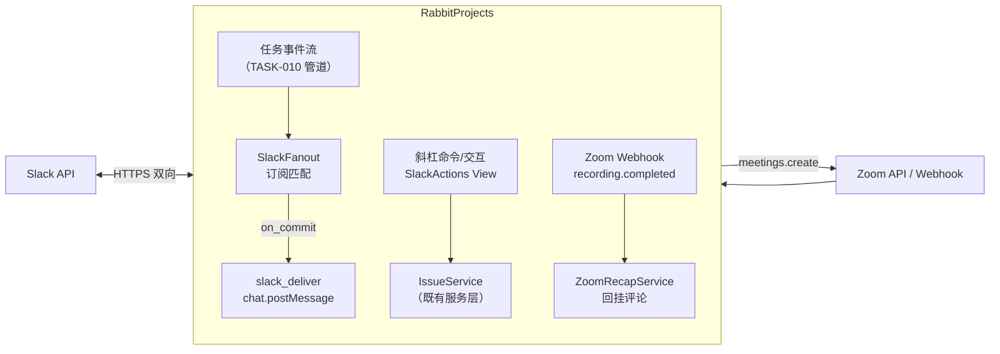
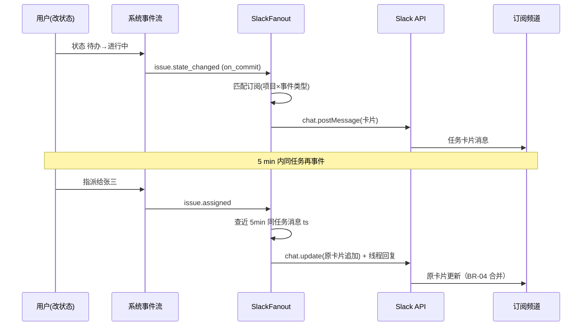
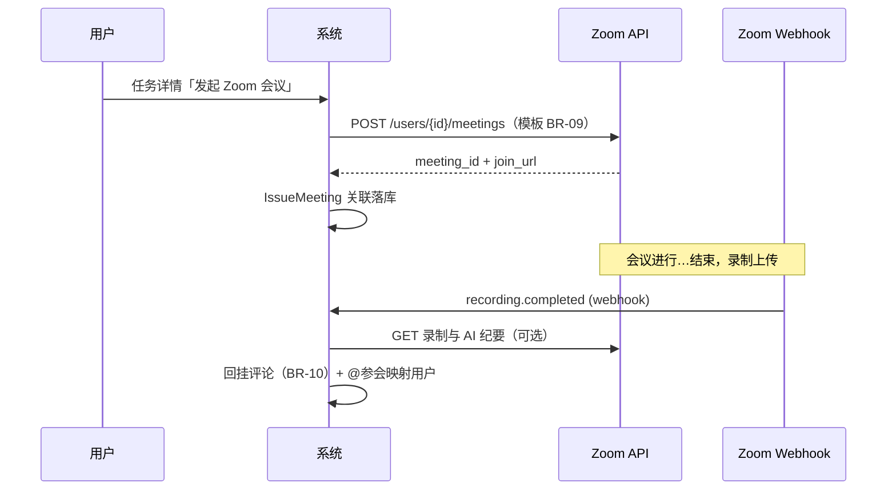

# Slack / Zoom 全量集成

| 元信息项 | 内容 |
| --- | --- |
| 文档编号 | INTG-003 |
| 所属迭代 | P4：远期增强（第 13 周起，签约驱动排期） |
| 优先级 | P4（企业版增强 / 生态与开放价值线） |
| 所属模块 | M9-INTG 集成开放 |
| 文档状态 | 待评审（Draft） |
| 修复摘要 | 2026-09-05 R1 评审 10 项修复：①上游依据 §3.5 改 §3.9（第三方工具集成模块）；②meetings 端点补 `workspaces/{slug}/` 层级；③4 个入站端点补 `/api/v1/` 前缀 + 协议豁免边界声明；④`request_id` 移入 error 对象、成功追踪走 `X-Request-Id` 头；⑤纪要回挂载体 TASK-006 改 COLLAB-001/002；⑥INTG-004 方向声明自包含化（OAuth 角色互补、凭据互不共享）；⑦模型落位 `apps/api/plane/`、复用扩展 `IntegrationInstallation`、主键 UUID v4；⑧全项目订阅重复投递修复（COALESCE 表达式唯一索引，FILE-002 BR-01 同款范式）；⑨示例 JSON 闭合 + 围栏配对修复；⑩补 Slack token 轮换（BR-13/§4.7）与解绑 30 天 purge beat。**R2 复评 PASS（10/9.5/10/10/10）后随手收口 1 MAJOR + 3 MINOR**：①§4.1 演进登记补第 ⑤ 条——`project`/`repository_full_name`/`repository_node_id` 三列可空化，GitHub 侧唯一约束与 `chk_repo_name` 改 `condition=Q(provider="github")` 条件约束补偿（INTG-001 §4.1.1 实文三列 GitHub 语义非空，Slack workspace 级 / Zoom 实例级行无合法值，不演进首插即撞 NOT NULL），取舍表「纯增量、零影响」改「结构演进：三列可空化 + GitHub 侧条件约束补偿，既有 GitHub 行零数据迁移」，INTG-001 待回改范围扩至三列；②`uq_slack_sub_channel_uniq` 补 `WHERE deleted_at IS NULL` 软删兼容（INTG-001 `uniq_binding_project_repo_active` / FILE-002 BR-01 同款先例），§4.4 订阅 DELETE 声明软删让位放行重建、BR-14 唯一性仅辖存活行；③§7.1 管理面口径改「11 路径 / 13 端点」（路径行数 × 方法数两口径并列）；④架构基线限流引用扩「§7.1/§7.2」、BR-11 补出站重试 5 次 vs api-conventions §13.3 六次的差异理由（独立投递通道自洽，非 §13.3 范畴） |
| 最后更新日期 | 2026-09-06 |
| 上游依据 | `docs/需求文档.md` §3.9 第三方工具集成模块（§3.9.2 Slack 集成：动态推送 / 快捷创建 / 评论任务 / 消息同步；§3.9.3 Zoom 集成：一键建会 / 纪要录制回挂 / 参会人同步）、§8.2 P4 列（第三方集成行：Slack/Zoom 全量集成、双向深度同步） |
| 前置依赖 | `INTG-001`（GitHub 集成框架：OAuth App 范式、事件管道、`IntegrationInstallation` 安装模型与 `token_cache` 范式——本文复用扩展，取舍见 §4.1）、`INTG-002`（Webhook 出站：签名与投递管道）、`COLLAB-001`（任务评论 / @ 提醒 / 通知中心——纪要回挂与 Slack→任务评论的落库载体）、`COLLAB-002`（楼中楼回复——Slack 线程同步的线程落点） |
| 下游依赖 | `INTG-004`（完整 Open API 与应用接入——仅方向互补关系，见 §1.5 方向声明；两者凭据体系互不共享，无 OAuth 管理面复用） |
| 架构基线 | [`api-conventions.md`](../architecture/api-conventions.md) §7.1/§7.2 / §8 / §13；[`rbac-permission-model.md`](../architecture/rbac-permission-model.md) §8.1（`integration.manage`）/ §8.2 |
| 竞品参考 | Jira（Slack for Jira 官方应用）、Linear（Slack 双向同步标杆）、Zoom Team Chat 应用范式 |

> **范围声明**：本文档交付两个 SaaS 生态集成——**Slack 全量**（频道联动通知 + 斜杠命令 + 消息转任务 + 线程同步）与 **Zoom**（会议关联任务 + 纪要/录制回挂）。Teams/钉钉/飞书复用同一框架但不在本文档（各自单独立项）。入站消息中的文件附件下载转存不在本期（标注 P4+）。

---

## 1. 概述

### 1.1 功能定位

客户团队的日常沟通在 Slack，会议在 Zoom——任务系统若不能「贴着沟通流工作」，就会退化为「另一个要打开的网页」。两个集成的价值锚点：

| 集成 | 价值 | 核心场景 |
| --- | --- | --- |
| Slack | 任务动态进频道、讨论不离开 Slack 即可建任务 | 频道订阅项目动态；`/rp create` 斜杠命令；消息右键「转为任务」；评论线程双向同步 |
| Zoom | 会议与任务互相关联，纪要自动归位 | 任务详情一键发起/关联 Zoom 会议；会后录制链接与 AI 纪要自动回挂任务评论 |

### 1.2 启动条件

| 条件 | 判定 |
| --- | --- |
| 商业条件 | ≥ 3 家使用 Slack 的客户签约（国内私有化客户通常走钉钉/飞书另案）；Zoom 集成依赖 Zoom Marketplace 上架审批通过 |
| 技术前置 | `INTG-001/002` 集成框架生产稳定（OAuth 应用管理、事件管道、签名投递）；实例具备公网 HTTPS 回调地址（SaaS 天然满足，私有化需客户开放） |
| 选型前置 | Slack App 上架 Slack Marketplace 的材料（隐私政策/安全问卷）经法务评审；Zoom 侧同理 |

### 1.3 独立交付判定

1. Slack 沙盒 workspace 完成：安装 → 频道订阅 → 任务事件推送 → 斜杠建任务 → 消息转任务 → 线程双向同步，全链路可演示。
2. Zoom 沙盒完成：任务关联会议 → 会后 webhook 接收录制完成事件 → 录制链接 + 纪要回挂评论。
3. 断链降级：Slack/Zoom API 故障时主系统功能零影响（集成队列积压告警，不阻塞业务写路径）。
4. 零回归：未安装集成的工作空间行为与企业版 V1.0 一致。

### 1.4 竞品参考结论（详见第 6 章）

- **Linear ↔ Slack**：业界标杆——双向同步（Slack 线程 ↔ Linear 评论）、消息转任务带上下文卡片、通知粒度可配到事件类型。
- **Jira Slack 应用**：功能全但配置复杂（JQL 订阅），通知噪音被诟病。
- **Zoom 范式**：Meeting SDK 创建会议 + `recording.completed` webhook + AI Companion 纪要 API。
- **本系统取舍**：对齐 Linear 的双向体验；订阅配置**只给事件类型勾选**不做查询语言（汲取 Jira 噪音教训，BR-04）；Zoom 侧只做「关联 + 回挂」不做内嵌会议 UI。

### 1.5 与 INTG-004 的方向声明（自包含）

> **方向声明**：本文 Slack/Zoom 为**入向集成**（第三方事件 → 本系统 webhook/回调）；Slack/Zoom 侧的 OAuth 安装授权流（本系统 → 第三方平台，用户级安装，本系统为 OAuth **客户端**）由本文自含交付（§4.4 install/callback）。`INTG-004` 开放 API 域为**反向通道**——第三方应用经 OAuth 2.0 接入本系统 Open API（本系统为 OAuth **授权服务器**，用户级授权安装）。两者方向互补、OAuth 角色相反、凭据体系互不共享；本文不消费、不复用、不依赖 INTG-004 的任何端点/参数，亦不向其提供 OAuth 应用管理面。

---

## 2. 业务逻辑

### 2.1 集成架构



| 维度 | Slack | Zoom |
| --- | --- | --- |
| 授权 | OAuth 2.0（Bot Token，workspace 粒度） | OAuth 2.0（Account-level App，实例粒度） |
| 入站 | 斜杠命令 + Interactive Components + Events API | Webhook（录制/会议状态） |
| 出站 | `chat.postMessage` / `chat.update` | `POST /users/{id}/meetings` |
| 凭证 | `xoxb-` token 密保库存储 | client credentials 密保库 + 账号级 token 刷新 |

### 2.2 业务规则（BR）

| 编号 | 规则 | 说明 |
| --- | --- | --- |
| BR-01 | 安装即绑定 | Slack App 安装到客户 Slack workspace 时与本系统 Workspace 一对一绑定（`team_id ↔ workspace`）；解绑双向可发起，数据保留 30 天（`unbound_at` 起算，保留期内重装复用原行恢复配置），期满由每日 beat `purge_unbound_integration_data` 物理清理（§4.7） |
| BR-02 | 身份映射 | Slack 用户 ↔ 系统用户按邮箱自动映射；映射失败的动作者显示 Slack 昵称并以「集成主体」落 Activity（不伪造用户） |
| BR-03 | 频道订阅 | 频道可订阅项目/任务类型的指定事件类型；每个频道 ≤ 10 条订阅；私频道需 Bot 被邀请方可订阅 |
| BR-04 | 反噪音 | 订阅仅事件类型勾选（创建/状态变更/指派/评论/截止提醒），无自定义查询；同任务 5 min 内多事件合并为一条消息（线程追加） |
| BR-05 | 斜杠命令确认 | `/rp create` 弹模态框（标题/项目/负责人/截止），创建成功回 ephemeral 消息带任务链接 |
| BR-06 | 消息转任务 | Message Action「转为任务」：消息正文进描述（Slack mrkdwn → 系统富文本 JSON 转换），原消息链接自动回挂 |
| BR-07 | 线程同步 | 订阅频道中任务卡片下的 Slack 线程回复 → 任务评论；任务评论 → 卡片线程回复（双向）；**同步开关按频道可关**；机器人消息不回环（BR-08） |
| BR-08 | 防回环 | 系统产生的 Slack 消息带 `metadata.event_payload.origin=rp`；入站事件含此标记直接丢弃；评论同步带 `[Slack]` 前缀作者标记 |
| BR-09 | Zoom 关联 | 任务可关联 0..N 个会议（`meeting_id + join_url`）；创建会议走任务上下文模板（标题=任务名，议程=任务链接） |
| BR-10 | 纪要回挂 | `recording.completed` webhook 到达 → 录制链接 + AI 纪要摘要（Zoom AI Companion API，可选）回挂为任务评论——**载体 = `COLLAB-001` 的 `IssueComment`**（作者=「Zoom 集成」），后续讨论在线程内进行（`COLLAB-002` 楼中楼）；参会人含系统映射用户时 @ 提及 |
| BR-11 | 失败降级 | 出站投递失败指数退避 5 次后计入集成健康面板（5 次与 api-conventions §13.3 的 6 次不同系有意取舍：Slack 投递为集成独立投递通道，重试参数自洽即可，不属 §13.3 通用 webhook 出站规范范畴，且另有 429 `Retry-After` 限速协同，见 §4.2）；入站处理失败返回 200（防 Slack 重试风暴）+ 死信队列人工重放 |
| BR-12 | 权限与审计 | 安装/解绑/订阅管理 `integration.manage`（WS_ADMIN+，`rbac-permission-model.md` §8.1 既有注册码，**无新增权限码**）；斜杠建任务以映射用户身份走既有 `issue.create` 权限校验；全链路审计 |
| BR-13 | 凭证轮换 | Slack `xoxb-` token 无服务端过期，轮换由**管理员重装授权**驱动：换发新 token 落密保库后，旧 token 进入 **24h 宽限**（仅在途投递任务可消费，新投递一律走新 token），宽限期满销毁密保库旧句柄 + 审计 `integration.token_rotated`；Zoom 账号级 token 按 `expires_at` 前置 5 min 自动刷新（复用 INTG-001 `token_cache` 范式）。详见 §4.7 |
| BR-14 | 订阅唯一性 | 同一安装 × 同一频道 × 同一订阅范围（项目或全项目）仅允许一条存活订阅（软删行让位可重建，§4.4 DELETE）；Serializer clean 预检返回 `409 RESOURCE_ALREADY_EXISTS`，DB 层 COALESCE 表达式唯一索引兜底（§4.1.1，FILE-002 BR-01 同款范式）——防止可空 `project` 的 NULL 行绕过唯一约束造成重复投递 |

### 2.3 Slack 通知卡片与合并



| 卡片元素 | 内容 |
| --- | --- |
| Header | 任务编号 + 标题（链接）+ 项目徽标 |
| 变更区 | 事件描述（「陈项目 将状态改为 进行中」） |
| 上下文 | 状态/负责人/优先级/截止 四联字段 |
| 动作 | `查看任务` `指派给我` `完成`（Interactive Button，走入站动作端点） |

### 2.4 线程双向同步状态机

| 方向 | 触发 | 规则 |
| --- | --- | --- |
| Slack → 任务 | 卡片线程新回复 | 忽略 bot 消息与 `origin=rp` 标记（BR-08）；作者按邮箱映射，失败以「Slack 用户 {昵称}」署名；内容转富文本（@提及 → 系统 mention，#频道 → 文本） |
| 任务 → Slack | 任务新评论 | 仅同步到「该任务卡片所在且开启同步」的频道（BR-07）；长评论截断 2,800 字符附「查看全文」链接 |
| 编辑/删除 | 任一侧编辑/删除 | 同步编辑标记「(已编辑)」；删除不同步物理删除，同步「(已撤回)」占位（审计完整性优先） |

### 2.5 Zoom 回挂流程



| 边界 | 处理 |
| --- | --- |
| 非关联会议 | webhook 的 `meeting_id` 无 `IssueMeeting` 匹配 → 忽略（不报错） |
| 多任务关联同会议 | 全部关联任务都回挂（一次会议评审多个任务） |
| 录制删除 | Zoom 侧删除不回撤系统评论（历史事实），链接失效由 Zoom 页提示 |
| 无 AI 纪要订阅 | 仅回挂录制链接与时长 |

---

## 3. UI/UX 设计

### 3.1 页面清单

| 页面 | 位置 | 核心任务 |
| --- | --- | --- |
| 集成中心-Slack | 工作空间设置 → 集成 → Slack | 安装/解绑、身份映射状态、健康度（近 24h 投递成功率） |
| 频道订阅管理 | 同上（子页） | 订阅列表（频道×项目×事件类型）、新增/编辑/停用 |
| 集成中心-Zoom | 工作空间设置 → 集成 → Zoom | 账号连接状态、回挂开关、默认会议模板 |
| 任务详情-会议区 | 任务详情侧栏 | 关联会议列表、发起会议、加入按钮 |

### 3.2 Slack 订阅管理线框

```
┌──────────────────────────────────────────────────────────────────┐
│ 设置 / 集成 / Slack · 频道订阅                        [+ 新增订阅] │
├──────────────────────────────────────────────────────────────────┤
│ Slack 团队: acme-corp.slack.com  ●已连接   Bot: @RabbitProjects    │
│ 身份映射: 182/195 已映射 · 13 未映射 [查看]   24h 投递成功率 99.2% │
│ ┌────────────────────┬────────────┬─────────────────┬─────────┐  │
│ │ 频道               │ 项目       │ 事件类型        │ 线程同步│  │
│ ├────────────────────┼────────────┼─────────────────┼─────────┤  │
│ │ #proj-ecommerce    │ 电商平台   │ 全部 5 类       │ 开 ●    │  │
│ │ #team-qa           │ 电商平台   │ 状态变更/截止   │ 关 ○    │  │
│ │ #general           │ — (全项目) │ 仅截止提醒      │ 关 ○    │  │
│ └────────────────────┴────────────┴─────────────────┴─────────┘  │
│ ⚠ 反噪音保护: 同任务 5 分钟内事件自动合并（BR-04）                 │
└──────────────────────────────────────────────────────────────────┘
```

### 3.3 Slack 侧卡片与模态框（线框）

```
#proj-ecommerce 频道
┌─ RabbitProjects ─────────────────────────────────────────┐
│ 🟦 ECOM-231  下单链路重构                    [电商平台]   │
│ 陈项目 将状态改为「进行中」 · 14:32                       │
│ ──────────────────────────────────────────────           │
│ 状态: 进行中    负责人: 张三点                            │
│ 优先级: 高      截止: 9/16 (🔴 基线+6d)                   │
│ [查看任务]  [指派给我]  [✓完成]                           │
│ 💬 线程 (2) — 任务评论同步开启                            │
│   ├ 李四维(系统): 接口联调排到周四，依赖库存服务           │
│   └ slack_ken: 周四可以，我先出 mock        [Slack]       │
└──────────────────────────────────────────────────────────┘

/rp create 模态框
┌─ 创建任务 ────────────────────────────────┐
│ 项目:   [电商平台 ▾]                       │
│ 标题:   [___________________________]      │
│ 负责人: [选择成员 ▾]   截止: [日期选择]    │
│ 描述:   [_____________________]            │
│         (自动附带当前频道上下文链接)        │
│                    [取消]  [创建]          │
└────────────────────────────────────────────┘
```

### 3.4 交互规则

| 场景 | 交互 |
| --- | --- |
| 安装向导 | 三步：Slack 授权 → 选择绑定 Workspace → 默认订阅推荐（#general 截止提醒）→ 完成页给 `/rp` 命令速查 |
| 未映射用户处理 | 映射面板列出未映射 Slack 用户，支持手工指定或发送邀请；斜杠命令未映射用户收到 ephemeral「请先绑定账号」+ 绑定链接 |
| 会议发起 | 任务详情「发起 Zoom 会议」→ 二次确认（模板预览）→ 创建成功 join_url 复制 + 自动发评论通知负责人 |
| 健康告警 | 投递成功率 < 95%（24h）时集成页顶部黄色横幅 + 通知 WS_ADMIN |
| 权限 | 集成菜单 WS_ADMIN 可见；任务详情会议区项目成员可见，发起会议需 `issue.update` |

---

## 4. 技术架构

### 4.1 数据模型

```python
# apps/api/plane/db/models/integration.py
# （Slack/Zoom 演进列与新表同文件追加，落位对齐 INTG-001 §4.1.1；主键沿用 BaseModel UUID v4）
from django.db import models

from plane.db.models.base import BaseModel
from plane.db.models.integration import IntegrationInstallation

# ── P4 演进登记（对既有 IntegrationInstallation 的同文件扩展——结构演进：三列可空化
#    + GitHub 侧条件约束补偿，既有 GitHub 行零数据迁移）──
# ① Provider 枚举新增 SLACK / ZOOM（IntegrationInstallation.Provider 内追加）；
# ② installation_id（GitHub BigInteger）对 Slack/Zoom 行空置 → 加 null=True；
# ③ 新增可空列：workspace / team_id / team_name / bot_token_ref / bot_user_id /
#    credentials_ref / unbound_at（均 Slack 或 Zoom 行专用，GitHub 行恒 NULL）；
# ④ team_id 偏条件唯一（WHERE team_id IS NOT NULL）——Slack team ↔ 系统工作空间一对一（BR-01）；
# ⑤ project / repository_full_name / repository_node_id 三列可空化——INTG-001 §4.1.1 实文中
#    三列均为 GitHub 语义非空列（project 非空 FK on_delete=CASCADE；repository_full_name 非空
#    且 chk_repo_name CheckConstraint 禁空串；repository_node_id 非空），而 Slack 安装是
#    workspace 级、Zoom 走实例级，两级行对三列均无合法值，不演进则首次插入即撞 NOT NULL；
#    GitHub 侧补偿：唯一约束 uniq_binding_project_repo_active 与 chk_repo_name 改为
#    condition=Q(provider="github") 条件约束补偿（与既有 deleted_at 存活条件叠加）。
# （INTG-001 文档待回改：Provider 枚举扩展、installation_id 与 project /
#   repository_full_name / repository_node_id 三列可空化及条件约束补偿演进补记）


class SlackChannelSubscription(BaseModel):
    installation = models.ForeignKey(IntegrationInstallation,
                                     on_delete=models.CASCADE,
                                     related_name="slack_subscriptions",
                                     limit_choices_to={"provider": "slack"})
    channel_id = models.CharField(max_length=32)               # C…
    channel_name = models.CharField(max_length=128)
    project = models.ForeignKey("db.Project", null=True, blank=True,
                                on_delete=models.CASCADE)      # null=全项目
    event_types = models.JSONField(default=list)               # ["created","state_changed",...]
    thread_sync = models.BooleanField(default=False)           # BR-07
    is_active = models.BooleanField(default=True)

    class Meta:
        db_table = "integration_slack_subscriptions"
        # 唯一性双层（FILE-002 BR-01 同款范式）：
        # ①Serializer clean 预检 → 409 RESOURCE_ALREADY_EXISTS（details[].code=UNIQUE）；
        # ②DB 层 COALESCE 表达式唯一索引（下方 RunSQL）——project 可空，
        #   普通 UniqueConstraint(fields=[…, "project"]) 对 NULL 行不去重
        #   （PG NULL 互异 → 全项目行重复插入 → 重复投递），禁用普通约束。
        constraints = []                                       # 唯一性全部下沉表达式索引


class SlackUserMap(BaseModel):
    installation = models.ForeignKey(IntegrationInstallation,
                                     on_delete=models.CASCADE,
                                     limit_choices_to={"provider": "slack"})
    slack_user_id = models.CharField(max_length=32)
    user = models.ForeignKey("db.User", null=True, blank=True,
                             on_delete=models.SET_NULL)        # null=未映射
    slack_email = models.EmailField()
    slack_display_name = models.CharField(max_length=128)

    class Meta:
        db_table = "integration_slack_user_maps"
        constraints = [
            models.UniqueConstraint(fields=["installation", "slack_user_id"],
                                    name="uq_slack_user_map"),
        ]


class IssueMeeting(BaseModel):                                  # Zoom 关联
    issue = models.ForeignKey("db.Issue", on_delete=models.CASCADE,
                              related_name="meetings")
    meeting_id = models.CharField(max_length=32, db_index=True)
    join_url = models.URLField(max_length=512)
    topic = models.CharField(max_length=255)
    start_time = models.DateTimeField(null=True, blank=True)
    created_by = models.ForeignKey("db.User", on_delete=models.PROTECT)

    class Meta:
        db_table = "integration_issue_meetings"
        indexes = [models.Index(fields=["meeting_id"],
                                name="idx_issue_meeting_mid")]
```

#### 4.1.1 全项目行唯一性 RunSQL（问题⑧修复）

```python
# apps/api/plane/db/migrations/00XX_p4_integrations.py（RunSQL，与 INTG-001 迁移同目录）
MIGRATION_SQL = """
-- uq_slack_sub_channel_uniq：项目行与非空「全项目行」统一去重。
-- project 为可空外键（null=全项目），PG 对 NULL 互异——普通 UniqueConstraint
-- 拦不住重复「全项目订阅」，会导致同事件重复投递（BR-04 合并也随之失效）。
-- WHERE deleted_at IS NULL：软删行让位（订阅删除为软删，同范围可重建）——
-- INTG-001 uniq_binding_project_repo_active 与 FILE-002 BR-01 同款先例。
CREATE UNIQUE INDEX uq_slack_sub_channel_uniq
    ON integration_slack_subscriptions (installation_id, channel_id,
        COALESCE(project_id, '00000000-0000-0000-0000-000000000000'::uuid))
    WHERE deleted_at IS NULL;
"""
```

| 取舍项 | 决策 | 理由 |
| --- | --- | --- |
| 安装载体 | **复用扩展既有 `IntegrationInstallation`**（INTG-001 §4.1.1），**不新建** `SlackInstallation` 安装表 | ①避免「双安装表」造成安装生命周期（安装/解绑/30 天保留/审计/健康面板）两套实现；②系统级安装清单与集成健康面板单一查询入口；③`provider` 枚举天然支持多集成。代价为结构演进：project / repository_full_name / repository_node_id 三列可空化 + GitHub 侧条件约束补偿（§4.1 演进登记 ②⑤），既有 GitHub 行零数据迁移 |
| Zoom 凭据 | Zoom 保持实例级单例 `ZoomConnector`（见下表），**不并入** `IntegrationInstallation` | Zoom 为 Account-level App：client 凭据是实例级资产（私有化部署单实例一份），非「工作空间安装」语义，装/卸生命周期与 Slack 不同 |
| 业务配置表 | 订阅 / 用户映射 / 会议关联 / 消息锚点为独立新表（同文件落位） | 「安装」与「配置」语义分离；配置表随解绑清理（BR-01/§4.7），与安装行「保留-恢复」语义不同 |
| 主键 | 全部沿用 `BaseModel` UUID v4（api-conventions §4.5），API 示例同步 UUID | 架构裁决：主键 UUID v4，不引入 ULID |

| 补充 | 说明 |
| --- | --- |
| 消息锚点 | `SlackMessageAnchor(issue, channel_id, message_ts)`（`db_table="integration_message_anchors"`）表记录任务卡片位置，支撑 `chat.update` 合并（BR-04）与线程同步定位 |
| Zoom 配置 | `ZoomConnector`（实例级单例表，`db_table="integration_zoom_connectors"`）：account_id、client 凭证句柄、AI 纪要开关、webhook secret 句柄 |
| 安装行恢复 | Slack 安装复用 `IntegrationInstallation`（`provider="slack"`）；解绑置 `is_active=False` + `unbound_at`，30 天保留期内重装复用原行恢复订阅/映射配置（BR-01），期满物理清理（§4.7） |

### 4.2 出站投递与合并

```python
# apps/api/plane/bgtasks/slack_sync.py（落位对齐 INTG-001 bgtasks/github_sync.py）
from celery import shared_task


@shared_task(queue="integration", bind=True,
             autoretry_for=(SlackApiError,), retry_backoff=True,
             retry_kwargs={"max_retries": 5})
def slack_deliver(self, subscription_id: str, event: dict) -> None:
    sub = SlackChannelSubscription.objects.select_related(
        "installation").get(id=subscription_id, is_active=True)
    client = SlackClient(sub.installation)          # 密保库取 token
    anchor = SlackMessageAnchor.objects.filter(
        issue_id=event["issue_id"], channel_id=sub.channel_id,
        created_at__gte=timezone.now() - timedelta(minutes=5)).first()
    blocks = build_issue_card(event, compact=anchor is not None)
    if anchor:                                       # BR-04 合并
        client.chat_update(channel=sub.channel_id, ts=anchor.message_ts,
                           blocks=blocks)
        client.chat_post_reply(channel=sub.channel_id, ts=anchor.message_ts,
                               text=event_summary_line(event))
    else:
        resp = client.chat_post_message(channel=sub.channel_id, blocks=blocks)
        SlackMessageAnchor.objects.create(
            issue_id=event["issue_id"], channel_id=sub.channel_id,
            message_ts=resp["ts"])
```

| 要点 | 说明 |
| --- | --- |
| 事件源 | `TASK-010` 事件管道新增 `slack` 订阅者（`on_commit` 扇出），与 webhook 订阅者并列 |
| 限流 | Slack `chat.postMessage` 每频道 1 msg/s 限制——客户端内置令牌桶，429 时读 `Retry-After` 延迟重试 |
| 健康度 | 每次投递结果落 Redis 计数器（`intg:slack:{ws}:ok/fail`，24h 滑窗），健康面板直读 |

### 4.3 入站端点（Slack Actions / Zoom Webhook）

| 端点 | 验签 | 处理 |
| --- | --- | --- |
| `POST /api/v1/integrations/slack/commands/` | `X-Slack-Signature`（HMAC-SHA256，签名密钥密保库）+ 5 min 时间戳窗 | `/rp create` → 3s 内回 200 + 模态框 `trigger_id`（Slack 3 秒规则），建任务走异步视图响应 |
| `POST /api/v1/integrations/slack/actions/` | 同上 | 按钮动作（完成/指派）→ 映射用户鉴权 → 既有服务层 → `response_url` 回执 |
| `POST /api/v1/integrations/slack/events/` | 同上 | 线程回复 → URL verification 握手 + 事件去重（`event_id` Redis SETNX 24h）→ 评论落库 |
| `POST /api/v1/integrations/zoom/webhook/` | Zoom `x-zm-signature` HMAC + CRC 校验（`endpoint.url_validation`） | `recording.completed` → `zoom_recap.delay`；其余事件类型忽略 |

| 纪律 | 说明 |
| --- | --- |
| 快速确认 | 全部入站端点 200 先行：验签通过即异步入队（BR-11），处理失败进 `integration.dlq` 死信可重放 |
| 权限穿透 | 入站动作以映射用户身份构造 `request.user`，走既有 Permission 层——集成无特权通道（BR-12） |
| 回环阻断 | 事件处理首查 `origin=rp` 标记与 bot_user_id（BR-08） |

> **协议豁免边界（入站 4 端点）**：上表 4 条路径为第三方协议回调端点（调用方是 Slack/Zoom 平台而非登录用户），请求/响应体由**对方协议契约规定**——Slack URL verification 须原样回 `challenge`、斜杠/交互动作须回 ephemeral 文本或空 200（3 秒规则）、Zoom `endpoint.url_validation` 须回 `plainToken`/`encryptedToken`——均无法套用 api-conventions §4 统一信封，**按协议豁免**（豁免参照 AUTH-011 SCIM 声明模式；路径仍保留 `/api/v1/` 前缀以统一路由、验签与 §7.2 限流分层，对齐 INTG-001 `POST /api/v1/integrations/github/webhook/` 先例）。豁免**仅限这 4 条入站路径的响应体形态**：路由/验签/限流/日志纪律照常执行，死信重放与管理面一律走统一信封。其余一切端点（§4.4 全部管理面端点）无豁免。

### 4.4 API 端点（管理面）

管理面端点全部走 `workspaces/{slug}/` 层级与统一响应信封（api-conventions §4，无豁免）；请求追踪 ID 经 `X-Request-Id` 响应头下发（api-conventions §4.4）。

| 方法 | 路径 | 说明 |
| --- | --- | --- |
| GET | `/api/v1/workspaces/{slug}/integrations/slack/` | 安装状态 + 映射统计 + 健康度 |
| POST | `/api/v1/workspaces/{slug}/integrations/slack/install/` | 返回 Slack OAuth 跳转 URL |
| GET | `/api/v1/workspaces/{slug}/integrations/slack/callback/` | OAuth 回调（state 校验） |
| POST | `/api/v1/workspaces/{slug}/integrations/slack/token/rotate/` | 发起重装式 token 轮换（BR-13，`integration.manage`）：返回强制重新授权的 OAuth URL，换发成功后旧 token 进入 24h 宽限 |
| DELETE | `/api/v1/workspaces/{slug}/integrations/slack/` | 解绑（30 天数据保留，§4.7 purge） |
| GET/POST | `…/slack/subscriptions/` | 订阅列表（游标分页，`per_page` 缺省 100）/ 新增 |
| PATCH/DELETE | `…/slack/subscriptions/{id}/` | 编辑事件类型/开关线程同步 / 删除（**软删**：置 `deleted_at`，非物理删——`uq_slack_sub_channel_uniq` 的 `WHERE deleted_at IS NULL` 让位放行同范围重建，BR-14 唯一性仅辖存活行） |
| GET | `…/slack/user-maps/` | 映射列表（未映射筛选） |
| POST | `/api/v1/workspaces/{slug}/projects/{pid}/issues/{id}/meetings/` | 发起 Zoom 会议并关联（叶子资源子资源，符合 api-conventions §2.4 嵌套约定） |
| GET | `/api/v1/workspaces/{slug}/projects/{pid}/issues/{id}/meetings/` | 关联会议列表 |
| DELETE | `/api/v1/workspaces/{slug}/projects/{pid}/issues/{id}/meetings/{mid}/` | 解除关联（不取消 Zoom 会议） |

**成功示例** — `POST …/subscriptions/`（主键 UUID v4；追踪 ID 走 `X-Request-Id` 响应头，信封内不含 `request_id`）：

```json
{
  "status": "success",
  "data": {
    "id": "8a1f9c2e-6b3d-4a7e-9f11-2c4d5e6f7a8b",
    "channel_id": "C08ABC123",
    "channel_name": "proj-ecommerce",
    "project": {"id": "6c7d3a10-5b2e-4c8f-9a01-7d3e5f6a8b9c", "name": "电商平台"},
    "event_types": ["created", "state_changed", "assigned", "commented", "due_reminder"],
    "thread_sync": true,
    "is_active": true
  }
}
```

**错误示例** — 私频道未邀请 Bot（BR-03；`request_id` 位于 error 对象内，api-conventions §4.2）：

```json
{
  "status": "error",
  "error": {
    "code": "VALIDATION_ERROR",
    "message": "无法订阅该频道",
    "details": [{"field": "channel_id", "code": "INVALID",
                 "message": "私有频道需先邀请 @RabbitProjects 加入"}],
    "request_id": "01J6ZWZ0M4PS6RXVD0AK7PF5GC"
  }
}
```

**错误示例** — 未安装即建会议：

```json
{
  "status": "error",
  "error": {
    "code": "RESOURCE_STATE_INVALID",
    "message": "Zoom 集成未连接，请管理员先在集成中心完成连接",
    "details": [],
    "request_id": "01J6ZX1A5N7T8YB2WD4EK6M9HC"
  }
}
```

**错误示例** — 重复订阅（同频道同项目重复提交，含全项目行；BR-14 双层唯一性）：

```json
{
  "status": "error",
  "error": {
    "code": "RESOURCE_ALREADY_EXISTS",
    "message": "该频道已存在相同范围的订阅",
    "details": [{"field": "channel_id", "code": "UNIQUE",
                 "message": "频道 #proj-ecommerce 已订阅电商平台的项目动态"}],
    "request_id": "01J6ZX2B8P9U0ZC3XE5FL7N0JD"
  }
}
```

> BR-14：订阅唯一性校验 = Serializer clean 预检（返回 `RESOURCE_ALREADY_EXISTS`）+ DB 层 COALESCE 表达式唯一索引兜底（§4.1.1，FILE-002 BR-01 同款范式）——`project` 为可空外键（null=全项目），PG 对 NULL 互异，普通 `UniqueConstraint` 拦不住重复「全项目行」，曾会导致同一事件重复投递。索引带 `WHERE deleted_at IS NULL` 条件——软删行让位，同范围可重建（INTG-001 `uniq_binding_project_repo_active` 同款先例）。
### 4.5 前端 Store

```typescript
// apps/web/src/modules/integrations/slack.store.ts
export class SlackIntegrationStore {
  installation: ISlackInstallation | null = null;
  subscriptions: ISlackSubscription[] = [];
  health: { successRate24h: number } | null = null;
  unmappedUsers: ISlackUserMap[] = [];

  constructor(private workspaceSlug: string) { makeAutoObservable(this); }

  get isInstalled() { return !!this.installation?.isActive; }
  get healthWarn() { return (this.health?.successRate24h ?? 100) < 95; }

  async install() {
    const res = await integrationService.slackInstallUrl(this.workspaceSlug);
    window.location.href = res.data.authorize_url;   // OAuth 跳转
  }

  async toggleThreadSync(subId: string, enabled: boolean) {
    await integrationService.patchSubscription(
      this.workspaceSlug, subId, { thread_sync: enabled });
    await this.fetchSubscriptions();
  }
}
```

| 前端规则 | 说明 |
| --- | --- |
| OAuth 回跳 | callback 页读取后端写入的安装结果 → 成功跳订阅推荐向导；失败显示 Slack 错误码与重试入口 |
| SWR 键 | `SLACK_INSTALL(ws)` / `SLACK_SUBS(ws)` / `ISSUE_MEETINGS(issueId)`；会议创建后 mutate 任务评论键（回挂评论） |

### 4.6 性能与安全

| 指标 | 预算 | 手段 |
| --- | --- | --- |
| 事件→频道延迟 | P95 < 5s | 管道直达 + 独立 `integration` 队列 |
| 入站确认 | < 500ms（Slack 3s 规则余量 6 倍） | 验签 + 入队即 200 |
| 投递吞吐 | 100  msg/min/实例 | Slack 客户端令牌桶 + 每频道 1/s 限速 |
| 凭证安全 | 零明文落库 | 全部密保库句柄；日志黑名单 `xoxb-`/`x-zm-` 前缀脱敏 |

### 4.7 凭证轮换与留存治理

**Slack token 轮换（BR-13）**：

| 项 | 定义 |
| --- | --- |
| 轮换入口 | `POST /api/v1/workspaces/{slug}/integrations/slack/token/rotate/`（`integration.manage`）——返回强制重新授权的 Slack OAuth URL（`prompt=consent`）；客户若启用 Slack 官方 Token Rotation，则由回调换发 refresh token 存入 `token_cache`，客户端按 `expires_at` 前置 5 min 自动刷新 |
| 轮换窗口 | 新 token 落密保库成功即生效（新投递一律取新句柄）；发起轮换到回调完成期间投递照常走旧 token，无空窗 |
| 旧 token 失效宽限 | 旧 `bot_token_ref` 保留 **24h 宽限**：仅「已入队未执行」的在途投递任务可消费，宽限期满销毁密保库旧句柄并写审计 `integration.token_rotated`（操作者/时间/新旧句柄指纹，不含 token 原文） |
| 泄露应急 | 与轮换同通道：直接销毁旧句柄（跳过宽限）+ 强制重装，`rotation_reason=leak` 入审计 |

**解绑 30 天留存清理（BR-01）**——对齐 FILE-002 `purge_deleted_assets` beat 范式：

```python
# apps/api/plane/bgtasks/slack_sync.py
from datetime import timedelta
from django.utils import timezone
from celery import shared_task
from plane.db.models.integration import IntegrationInstallation


@shared_task(queue="integration")
def purge_unbound_integration_data() -> dict:
    """每日 03:30（beat）——解绑期满（unbound_at < now()-30d）物理清理：
    IntegrationInstallation(provider=slack/zoom) 行 + 级联清理订阅/映射/锚点/会议关联
    与密保库全部句柄；保留期内重装（IT-06）复用原行恢复，不触发本任务。"""
    deadline = timezone.now() - timedelta(days=30)
    expired = list(IntegrationInstallation.objects.filter(
        provider__in=["slack", "zoom"], is_active=False,
        unbound_at__lt=deadline))
    for inst in expired:
        secret_vault.destroy(inst.all_secret_handles())   # 密保库句柄先销毁
        inst.delete()                                      # 级联清理业务配置表（BR-01）
    return {"purged": len(expired)}
```

| 项 | 定义 |
| --- | --- |
| 调度 | Celery beat 每日 03:30，`integration` 队列（与 FILE-002 purge 族同调度段，错峰 1h） |
| 范围 | Slack/Zoom 安装行 + 订阅 / 用户映射 / 消息锚点 / 会议关联 / Zoom 单例配置；审计记录不删（审计完整性优先，§2.4 同款取舍） |
| 恢复窗口 | 30 天内重装：置回 `is_active=True`、清空 `unbound_at`，订阅/映射原样恢复（IT-06 断言） |

---

## 5. 测试用例

### 5.1 单元测试（UT）

| 编号 | 用例 | 断言 |
| --- | --- | --- |
| UT-01 | 邮箱映射 | 同邮箱自动绑定；无匹配进未映射列表 |
| UT-02 | 未映射斜杠 | `/rp create` 未映射用户收到绑定引导 ephemeral |
| UT-03 | 事件合并 | 5 min 内两事件 → `chat.update` 被调而非第二次 post；锚点正确 |
| UT-04 | 防回环 | `origin=rp` 事件与 bot 消息入站直接丢弃 |
| UT-05 | 线程→评论 | Slack 回复落评论且作者署名 `[Slack] 昵称`（未映射）或映射用户 |
| UT-06 | 评论→线程 | 任务评论出现在卡片线程；长评论截断 2,800 字符带链接 |
| UT-07 | mrkdwn 转换 | Slack `*粗体* <url|text> @U123` 正确转系统富文本 JSON |
| UT-08 | 验签 | 错误签名/超 5 min 时间戳 → 401；正确签名通过 |
| UT-09 | 订阅上限 | 频道第 11 条订阅返回 `RESOURCE_LIMIT_EXCEEDED` |
| UT-10 | 会议关联 | 创建会议落 `IssueMeeting` 且模板含任务链接 |
| UT-11 | 无关联 webhook | 未匹配 `meeting_id` 的 recording 事件忽略不报错 |
| UT-12 | 多任务回挂 | 同会议关联 3 任务，3 条回挂评论均生成且 @ 正确 |
| UT-13 | 订阅唯一性（BR-14） | 同频道同项目重复订阅 → `409 RESOURCE_ALREADY_EXISTS`（details.code=UNIQUE）；两条「全项目行」（project=NULL）并发插入被 COALESCE 表达式唯一索引拦截（§4.1.1）；不同项目同频道可共存 |

### 5.2 集成测试（IT）

| 编号 | 用例 | 断言 |
| --- | --- | --- |
| IT-01 | Slack 沙盒全链路 | 安装→订阅→事件推送→斜杠建任务→消息转任务→线程双向，各步沙盒侧可见 |
| IT-02 | 合并窗口 | 脚本 3 min 内触发 5 事件，频道仅 1 卡片 + 4 线程回复 |
| IT-03 | 失败降级 | Slack API 500 注入：业务写路径 P95 无变化；5 次重试后死信；恢复后重放成功 |
| IT-04 | Zoom 沙盒回挂 | 模拟 `recording.completed` → 评论含录制链接与时长；AI 纪要开关开时含摘要 |
| IT-05 | 令牌桶 | 突发 50 消息/频道投递速率 ≤ 1/s 且无 429 失败 |
| IT-06 | 解绑 | 解绑后事件不再投递；30 天内重装恢复订阅配置（`is_active` 置回、`unbound_at` 清空） |
| IT-07 | token 轮换（BR-13） | rotate → 旧 token 宽限期内仅消费存量在途任务、新投递走新 token；24h 后旧句柄销毁（密保库取用报错）且审计含 `integration.token_rotated` 无明文 |
| IT-08 | 留存清理（BR-01/§4.7） | 解绑行 `unbound_at` 回拨 31 天触发 beat：安装行与订阅/映射/锚点/密保库句柄全部物理清理；第 29 天行不被清理；审计记录保留 |

### 5.3 E2E 测试

| 编号 | 场景 | 验收 |
| --- | --- | --- |
| E2E-01 | 频道联动 | 真实 Slack 沙盒演示 BR-03~08 全部场景 |
| E2E-02 | 会议闭环 | 任务发起会议 → 真实开会 1 min 录制 → 录制完成评论自动出现 |
| E2E-03 | 权限 | MEMBER 尝试管理订阅被拒；斜杠建任务在无权限项目被拒并回执 |

---

## 6. 竞品深度对标

| 维度 | Linear Slack | Jira Slack 应用 | Asana/Zoom | 本系统 |
| --- | --- | --- | --- | --- |
| 通知配置 | 事件类型勾选 | JQL 订阅（强但噪音大） | 固定模板 | 事件类型勾选 + 合并窗口（BR-04） |
| 双向同步 | ✅ 线程↔评论（标杆） | 单向为主 | ❌ | ✅ 双向 + 防回环 + 编辑标记 |
| 消息转任务 | ✅ 带上下文卡片 | ✅ | ❌ | ✅ + 原消息回链 |
| 身份映射 | 邮箱自动 | Atlassian ID 强制 | 邮箱 | 邮箱自动 + 未映射降级署名 |
| Zoom 回挂 | 无（Linear 无 Zoom） | 无 | 录制链接回挂 | 录制 + AI 纪要 + 参会人 @ |
| 失败处理 | 未公开 | 未公开 | 未公开 | 死信队列 + 健康面板 + 重放 |

**结论**：Linear 证明了「双向同步 + 合并窗口」是 Slack 集成的体验分水岭，Jira 证明了「查询语言订阅」必然噪音失控——本系统全盘采纳前者、明确拒绝后者。Zoom 侧做「关联 + 回挂」而非内嵌会议 UI，因为客户已有 Zoom 客户端习惯，系统只需成为会议产物的归集处。

---

## 7. 里程碑与验收

### 7.1 工作量估算

| 交付面 | 内容 | 估算 |
| --- | --- | --- |
| Model / Migration | 新表 5（订阅 / 映射 / 会议关联 / 消息锚点 / Zoom 单例）+ `IntegrationInstallation` 演进列 + COALESCE 表达式唯一索引（§4.1.1） | 1.5 d |
| 后端 | OAuth 双流程、token 轮换与 purge beat（BR-13/§4.7）、投递与合并、入站四端点、线程同步、Zoom 回挂、管理面 11 路径 / 13 端点（§4.4 表 11 行路径 × 方法数两口径并列） | 7.5 d |
| 前端 | 集成中心 3 页、任务会议区、安装向导 | 3.5 d |
| 上架材料 | Slack/Zoom Marketplace 材料与安全问卷 | 2 d |
| 测试 | UT-01~13、IT-01~08、E2E-01~03 | 3.5 d |
| **合计** | | **18 d（2-3 人并行约 2 周）** |

### 7.2 可操作演示的验收标准

1. Slack 沙盒全链路（E2E-01）一次演示通过：安装 → 订阅 → 五类事件推送（合并生效）→ 斜杠建任务 → 消息转任务 → 线程双向（含未映射署名）。
2. 回环测试：系统评论同步到 Slack 后，该 Slack 消息不再回流成重复评论（无限循环防护验证）。
3. Zoom 闭环（E2E-02）：真实会议录制完成事件驱动回挂评论，含链接/时长/纪要。
4. 降级：Slack API 故障演练中业务写路径 P95 漂移 < 5%，死信可重放。
5. 安全：日志/审计全文无 `xoxb-`/Zoom 凭证明文；验签负例全拒。
6. 零回归：未安装工作空间契约快照与企业版 V1.0 一致。
7. 凭证与留存（IT-07/08）：轮换后旧 token 宽限期满即失效且审计无明文；解绑 30 天期满数据物理清理、期内重装可恢复。
