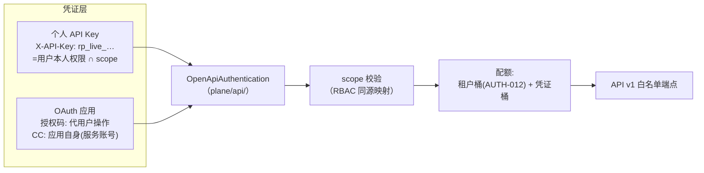
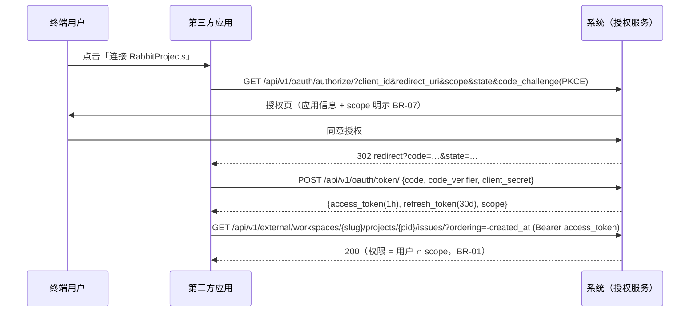

# 完整 Open API 与应用接入

| 元信息项 | 内容 |
| --- | --- |
| 文档编号 | INTG-004 |
| 所属迭代 | P4：远期增强（第 13 周起，签约驱动排期） |
| 优先级 | P4（企业版增强 / 生态与开放价值线） |
| 所属模块 | M9-INTG 集成开放 |
| 文档状态 | 待评审（Draft） |
| 最后更新日期 | 2026-09-05 |
| 修复摘要 | 2026-09-05 R1 评审 10 项修复：①鉴权对齐基线 `X-API-Key` 头 + `rp_<env>_` 前缀密钥体系（api-conventions §9.3，弃 `Bearer rp_sk_`）；②开放面路径对齐 `/api/v1/external/`（§2.1）、排序参数改 `ordering`（§5.4）；③OAuth 端点/方法/期限对齐 §9.4（authorize=GET / token=POST / revoke=POST，增 introspect/userinfo，access 1h + refresh 30d），`client_credentials` 作为基线扩展显式定义（api-conventions 待回改登记）；④scope 全量改复数（`issues:read` 等，§9.3 示例体系）；⑤scope×权限码映射全部改用 rbac §8 已注册码（`approval.read` 按 rbac 附录 B 登记）；⑥上游依据更正 §3.9/§8.2；⑦`request_id` 移入 error 对象；⑧密钥管理复用既有 `/api-tokens/` 体系（扩展 scope/IP 白名单/尾缀字段），不新设 `/developers/keys/` 端点；⑨24 个 scope 全枚举（补 `approvals:read`/`issues:relation`/`comments:delete`/`activities:read`/`workspaces:read` 等，IT-04 可构建）；⑩后端落位 `apps/api/plane/`（db/api 包）、前端 store 落位 `packages/shared-state` |
| 上游依据 | `docs/需求文档.md` §3.9 第三方工具集成节、§8.2 P4 列（第三方集成行：完整 OpenAPI、第三方应用接入市场） |
| 前置依赖 | 全部业务 Sprint（API v1 面完整稳定是开放的前提）、`INTG-002`（Webhook 出站，应用的事件通道）、`AUTH-012`（租户级 API 配额治理） |
| 下游依赖 | 应用接入市场（P4+，本文档交付其凭证与清单底座） |
| 架构基线 | [`api-conventions.md`](../architecture/api-conventions.md) 全文（Open API = 该规范的对外承诺）、§2.1 三套 API 分组（`/api/v1/external/`）、§7.2 限流分组、§9.3 Token 认证（API Key）、§9.4 OAuth 2.0；[`monorepo-structure.md`](../architecture/monorepo-structure.md) §2（`plane/api/` 落位） |
| 竞品参考 | GitHub REST API（文档与 SDK 标杆）、Linear（GraphQL + OAuth 应用）、Jira（Connect 应用框架） |

> **范围声明**：本文档把「内部 API」升级为「可签约的公共产品」——**API Key 与 OAuth 2.0 应用**两种凭证、**scope 细粒度授权**、**开发者门户**（文档/密钥管理/调用日志）、**稳定性承诺**（版本策略与弃用日历）。Open API 覆盖的端点面 = 既有 API v1 的精选子集（§2.2 白名单），不新增业务能力。

---

## 1. 概述

### 1.1 功能定位

企业客户的 IT 生态里，任务系统不是孤岛：BI 平台要抽数、IM 机器人要建任务、CI 要流转状态。没有正式 Open API 时客户只能用 Cookie 抓包模拟——脆弱、越权、无法审计。Open API 把这变成正式契约：

| 交付项 | 说明 |
| --- | --- |
| 个人 API Key | 用户级凭证（`rp_<env>_` 前缀，如 `rp_live_…`，经 `X-API-Key` 头传递——api-conventions §9.3），scope 勾选，代表本人权限子集 |
| OAuth 2.0 应用 | 第三方应用授权码 + PKCE 流程 + Client Credentials（服务间，基线扩展授权类型，见 §2.5），应用级 scope 与安装审计 |
| scope 体系 | 24 个 scope（§2.3），`resource:action` 二维，与 RBAC 权限码同源映射 |
| 开发者门户 | `/developers`：文档（OpenAPI 3.1 生成）、密钥管理、调用日志、速率余量 |
| 稳定性承诺 | v1 契约冻结策略、弃用日历（`Sunset` 头）、变更日志 |

### 1.2 启动条件

| 条件 | 判定 |
| --- | --- |
| 商业条件 | ≥ 3 家客户明确提出 API 对接需求（BI/自研中台/机器人）；或应用市场立项 |
| 技术前置 | API v1 面冻结（企业版 V1.0 发布后无破坏性变更 90 天）；`AUTH-012` 租户配额可用（开放面必须可治理） |
| 选型前置 | 规范形态评审：REST + OpenAPI 3.1（本方案）vs GraphQL（否决：现有 200+ REST 端点双轨维护成本，§6） |

### 1.3 独立交付判定

1. 演示三个真实集成：Python 脚本（API Key 抽数进 BI）、Slack 机器人样式服务（Client Credentials 建任务）、第三方 Web 应用（授权码流程代用户操作）。
2. scope 越权矩阵全绿：每个 scope × 每个端点的允许/拒绝与 §2.3 矩阵一致。
3. OpenAPI 文档与实现零漂移（CI 契约测试，§5 IT-05）。
4. 零回归：Session 认证路径与企业版 V1.0 完全一致（新认证类不影响旧路径）。

### 1.4 目标用户

| 用户 | 场景 | 关注点 |
| --- | --- | --- |
| 客户开发工程师 | BI 抽数、机器人、中台集成 | 文档准确、错误码稳定、速率明确 |
| 客户安全团队 | 审批第三方应用接入 | scope 最小化、调用可审计、可吊销 |
| 我方生态运营 | 应用市场筹备 | 应用注册/审核/上架流程底座 |

### 1.5 竞品参考结论（详见第 6 章）

- **GitHub REST**：`X-GitHub-Api-Version` 日期版本 + `Sunset` 弃用头 + fine-grained PAT 是凭证管理的业界标准。
- **Linear**：GraphQL 唯一面 + OAuth 应用 + 个人 Key；文档交互式探索体验极佳，但 GraphQL 暴露查询复杂度高（深度限制必需）。
- **Jira Connect**：应用框架过重（描述符 + JWT + 生命周期回调），第三方上手成本被诟病。
- **本系统取舍**：凭证与版本策略对齐 GitHub；REST 保留（不追 Linear 的 GraphQL）；应用侧**只做凭证与授权层**不做 Jira 式运行时框架——iframe 嵌入与 UI 扩展点归应用市场另案。

---

## 2. 业务逻辑

### 2.1 凭证模型总览



| 维度 | 个人 API Key | OAuth 授权码 | Client Credentials |
| --- | --- | --- | --- |
| 代表 | 用户本人 | 用户（应用代办） | 应用服务账号 |
| 上限 | 权限 ∩ scope | 授权用户权限 ∩ scope | 应用绑定服务账号权限 ∩ scope |
| 典型场景 | 个人脚本/BI 抽数 | 第三方 Web 应用 | CI/机器人 |
| 有效期 | 可设 30/90/365 天或永久 | access 1h + refresh 30d（api-conventions §9.1） | access 1h（refresh 不适用） |
| 吊销 | 用户自助 + 管理员强制 | 用户「已授权应用」页撤销 | 管理员停用应用 |

### 2.2 开放端点白名单

| 资源组 | 开放端点 | 备注 |
| --- | --- | --- |
| issues | CRUD / 列表 / 搜索 / 评论 / 链接 / 子任务 / 动态只读 | 含 `ordering` 排序与游标分页（§5.4/§6），不含批量写（v1.1 开放） |
| projects | 详情 / 列表 / 成员 | 项目设置写不开放 |
| workspaces | 详情 / 成员 只读 | 集成方定位租户上下文（`workspaces:read`；成员列表需 `users:read`） |
| cycles / views | 只读 | 写操作 v1.1 评估 |
| worklogs | CRUD | 含工时审批状态只读 |
| files | 上传（预签名三段式）/ 下载 / 元数据 | 分享链接管理不开放 |
| webhooks | 订阅 CRUD（复用 `INTG-002`） | 应用事件通道 |
| 不开放 | 认证/SSO/权限/审计/工作流管理/系统管理 | 安全面永不开放（BR-06）；任务动态（`activities:read`）属产品动态时间线而非审计日志（`AuditLog`），不在此列 |
| notifications | 本人通知只读（notification.read） | `notifications:read` |
| approvals | 审批记录只读（BR-06；approval.read 按 rbac 附录 B 登记） | `approvals:read` |
| labels / states | 元数据只读（并入 issue/project 组语义，单列便于 scope 映射） | `labels:read` / `states:read` |

### 2.3 scope 体系（24 个，全枚举）

命名沿用 api-conventions §9.3 的复数 `<resource>:<action>` 体系（如 `issues:read`、`webhooks:manage`）。映射列全部取自 `rbac-permission-model.md` §8 已注册权限码；BR-01 交集在此之上收缩。

| scope（逐行可数：3+1+3+2+1+2+2+1+4+2+1+1+1 = 24） | 覆盖 | 映射 RBAC 权限码（rbac §8） |
| --- | --- | --- |
| `issues:read` / `issues:write` / `issues:delete` | 任务读/写/删 | `issue.read` ／ `issue.create`+`issue.update` ／ `issue.delete` |
| `issues:relation` | 任务链接 / 依赖 / 子任务挂载 | `issue.relation.manage` |
| `comments:read` / `comments:write` / `comments:delete` | 评论读 / 发表与改本人 / 删 | `comment.read` ／ `comment.create`+`comment.update.own` ／ `comment.delete` |
| `projects:read` / `projects:write` | 项目与成员读 / 项目基础信息写（设置写不开放） | `project.read`+`project.member.read` ／ `project.update` |
| `workspaces:read` | 工作空间基础信息只读 | `workspace.read` |
| `worklogs:read` / `worklogs:write` | 工时读 / 报 | `worklog.read` ／ `worklog.create` |
| `files:read` / `files:write` | 文件读（下载/元数据）/ 传（预签名三段式） | `file.read` ／ `file.upload` |
| `webhooks:manage` | 订阅管理（复用 `INTG-002` 端点） | `integration.config` |
| `cycles:read` / `views:read` / `labels:read` / `states:read` | 只读元数据（迭代/视图/标签/状态集） | 随 `project.read` 授权（rbac §8.2 无独立 read 码，元数据读取挂项目读取鉴权） |
| `users:read` / `teams:read` | 成员目录只读（团队目录即工作空间成员域） | `workspace.member.read`+`project.member.read` |
| `notifications:read` | 本人通知只读 | `notification.read` |
| `activities:read` | 任务动态时间线只读 | `activity.read` |
| `approvals:read` | 审批记录只读（BR-06） | `approval.read`（rbac §8.2 仅有 `approval.act`/`approval.withdraw`，只读码为新增，**按 rbac 附录 B 登记**） |

> 权限码对照说明：上表除 `approval.read`（新码，按 rbac 附录 B 登记）外，全部为 rbac §8 注册表既有码；rbac 无 `issue.view`/`project.view`/`file.view`/`webhook.manage` 等码，读语义一律对应 `.read` 族注册码。

### 2.4 业务规则（BR）

| 编号 | 规则 | 说明 |
| --- | --- | --- |
| BR-01 | 权限交集 | 凭证有效权限 = 主体 RBAC 权限 ∩ scope 声明；scope 只是收缩，永不放大 |
| BR-02 | Key 哈希落库 | `rp_<env>_` 明文仅创建时展示一次（AUTH-001 同规则）；DB 存 SHA-256 + 前 8 位前缀与尾 4 位展示段 |
| BR-03 | 越权报错精确 | scope 不足返回 `PERM_TOKEN_SCOPE_INSUFFICIENT`，`details` 列出所需 scope（不泄露端点是否存在于白名单外——白名单外统一 404） |
| BR-04 | 速率双层 | 凭证桶（默认 60 req/min）+ 租户桶（`AUTH-012`）；响应头 `X-RateLimit-*` 全套 + `Retry-After` |
| BR-05 | 调用留痕 | 每次调用记 `ApiCallLog`（凭证 ID/端点/状态码/耗时/IP），保留 30 天；密钥使用本身入 `AuditLog`（创建/吊销/权限变更） |
| BR-06 | 安全面封闭 | 认证、SSO、权限、审计、工作流管理、系统管理端点**永不进入**白名单；审批记录只读开放（`approvals:read`） |
| BR-07 | OAuth 授权明示 | 授权页逐 scope 列中文说明 + 风险分级色标；`users:read` 等基础 scope 默认勾选可取消 |
| BR-08 | 弃用日历 | 破坏性变更：公告 ≥ 180 天 + `Sunset`/`Deprecation` 响应头 + 文档标记；v1 内只允许 additive 变更 |
| BR-09 | 应用审核 | OAuth 应用上线（可被其他工作空间安装）需我方审核；自用应用（仅本空间）免审 |
| BR-10 | 服务账号 | Client Credentials 应用在每个安装空间生成影子服务账号（`is_bot=True`，昵称=应用名），权限由安装者授予，离职免疫 |
| BR-11 | IP 白名单 | Key 可绑定 CIDR 白名单（可选）；不匹配返回 `PERM_IP_NOT_ALLOWED` （api-conventions 待回改登记：§8.3 该码触发场景扩宽为实例级/凭证级 IP 白名单） |
| BR-12 | 文档即契约 | OpenAPI 3.1 spec 由代码注解生成（drf-spectacular），CI 强制 spec diff 审查；文档站每日构建发布 |

### 2.5 OAuth 2.0 授权码流程



| 要点 | 说明 |
| --- | --- |
| PKCE 强制 | 所有客户端类型强制 `code_challenge`（S256），公共客户端无 secret 也可安全 |
| state 校验 | 授权回调 state 不匹配即拒绝并告警（CSRF 防护） |
| 撤销 | 用户「设置 → 已授权应用」一键撤销：refresh 立即失效，access 加黑名单至自然过期（≤1h） |
| refresh 轮换 | 每次刷新签发新 refresh_token 并作废旧值，检测到旧值复用即吊销整个授权链（api-conventions §9.4 refresh token rotation） |
| Client Credentials | `POST /api/v1/oauth/token/` 携 `{grant_type=client_credentials}` → 服务账号 token（BR-10）。**基线扩展**：api-conventions §9.4 授权类型仅列「授权码 + PKCE（唯一推荐）与 refresh_token」，`client_credentials` 为本模式新增的服务间授权类型（api-conventions 待回改登记：§9.4 增补 `client_credentials` 授权类型；implicit / password grant 仍不支持） |

### 2.6 开发者门户

| 板块 | 内容 |
| --- | --- |
| 文档 | OpenAPI 渲染（Redocly），每端点 Try-it（沙盒 token）、错误码全表、速率说明 |
| 我的密钥 | API Key 创建/吊销/白名单/到期时间；最后使用时间显示 |
| 我的应用 | OAuth 应用注册（名称/回调/图标/scope 申请）、审核状态、安装量 |
| 调用日志 | 近 30 天调用列表（端点/状态/耗时/IP），按凭证筛选，CSV 导出 |
| 变更日志 | API 变更记录与弃用日历（BR-08） |

---

## 3. UI/UX 设计

### 3.1 页面清单

| 页面 | 路由 | 核心任务 |
| --- | --- | --- |
| 开发者门户首页 | `/developers` | 文档导航 + 快速开始（3 步出第一个请求） |
| API 密钥 | `/developers/keys` | Key 全生命周期 |
| OAuth 应用 | `/developers/apps` | 应用注册与管理 |
| 授权同意页 | `/oauth/authorize` | scope 明示与授权决策（前端渲染页，承载协议端点 `GET /api/v1/oauth/authorize/`） |
| 已授权应用 | `/{ws}/settings/authorized-apps` | 用户撤销入口 |
| 调用日志 | `/developers/logs` | 调用检索与导出 |

### 3.2 API 密钥页线框

```
┌──────────────────────────────────────────────────────────────────┐
│ 开发者 / API 密钥                                  [+ 创建密钥]   │
├──────────────────────────────────────────────────────────────────┤
│ ┌──────────────────┬──────────────┬───────────┬───────┬───────┐  │
│ │ 名称             │ Key          │ scope     │ 到期  │ 状态  │  │
│ ├──────────────────┼──────────────┼───────────┼───────┼───────┤  │
│ │ BI 抽数          │ rp_live_Ab3x…│ issues:read│ 90d   │ ●活跃 │  │
│ │                  │ …8oP1        │ worklogs:r│ 剩61d │ 用 1h前│  │
│ │ CI 机器人        │ rp_live_Zy7w…│ issues:rw │ 永久  │ ●活跃 │  │
│ │                  │ …1kLm        │ webhooks:m│       │ 用 3m前│  │
│ └──────────────────┴──────────────┴───────────┴───────┴───────┘  │
│ ── 创建密钥 ─────────────────────────────────────────────────     │
│ 名称 [__________]  有效期 [90 天 ▾]  IP 白名单 [可选 CIDR,]       │
│ scope: ☑issues:read ☑issues:write ☐issues:delete ☑projects:read …  │
│ ⚠ 密钥仅创建时完整显示一次，请立即保存。                           │
└──────────────────────────────────────────────────────────────────┘
```

### 3.3 授权同意页线框

```
┌────────────────────────────────────────────────────────┐
│  🔌 DataBridge 请求访问你的 RabbitProjects 账号         │
│      由 Acme Inc 提供 · 已审核 ✓                        │
├────────────────────────────────────────────────────────┤
│ 该应用将获得以下权限：                                  │
│  ☑ 🟢 读取任务与评论        (issues:read comments:read) │
│  ☑ 🟢 读取项目与成员目录    (projects:read teams:read)  │
│  ☑ 🟡 代你创建和修改任务    (issues:write)              │
│  ☐ 🔴 代你删除任务          (issues:delete)             │
│                                                         │
│  工作空间: acme · 以 王小明 (wang@acme.com) 身份授权    │
│                                                         │
│         [拒绝]                    [授权]                │
└────────────────────────────────────────────────────────┘
```

### 3.4 交互规则

| 场景 | 交互 |
| --- | --- |
| Key 创建成功 | 一次性明文展示 + 复制按钮 + 「我已保存」确认后才关闭模态 |
| 速率触顶 | 门户密钥行显示红色「已限流」标记与恢复倒计时 |
| 授权页风险色 | 🟢只读 / 🟡写入 / 🔴删除与高危，🔴 scope 需逐个点开确认（BR-07） |
| 撤销二次确认 | 撤销授权弹窗说明「应用将立即无法访问，已产生的数据不受影响」 |
| 权限 | 门户登录即可访问（密钥=本人）；应用审核管理仅 `SYSTEM_ADMIN`（`system.integration.manage`，rbac §8.3）；门户调用日志导出（AuditLog 审计仍归 `system.audit.read`，SYSTEM_ADMIN） WS_ADMIN |

---

## 4. 技术架构

### 4.1 数据模型

```python
# apps/api/plane/db/models/user.py —— 密钥复用 AUTH-001 既有 APIToken（与 /api-tokens/ 体系同源，
# 见 §4.4 仲裁），既有字段：user / name / key_hash（SHA-256）/ key_prefix（前 8 位，如 rp_live_）/
# scopes（<resource>:<action> 数组）/ expires_at / last_used_at / is_active，本迭代不动；
# 仅增量迁移以下字段：
class APIToken(BaseModel):
    ip_allowlist = models.JSONField(default=list)              # CIDR 列表（BR-11）
    key_suffix = models.CharField(max_length=4)                # 尾 4 位展示段（门户列表）

# apps/api/plane/db/models/openapi.py
class OAuthApplication(BaseModel):
    class ClientType(models.TextChoices):
        CONFIDENTIAL = "confidential", "机密（服务端应用）"
        PUBLIC = "public", "公共（SPA/CLI）"

    owner = models.ForeignKey("db.User", on_delete=models.CASCADE)
    name = models.CharField(max_length=64)
    client_id = models.CharField(max_length=32, unique=True)   # rp_app_…
    client_secret_hash = models.CharField(max_length=64, null=True)
    redirect_uris = models.JSONField(default=list)
    scopes_requested = models.JSONField(default=list)
    client_type = models.CharField(max_length=12,
                                   choices=ClientType.choices)
    review_status = models.CharField(
        max_length=10,
        choices=[("self", "自用"), ("pending", "审核中"),
                 ("approved", "已上架"), ("rejected", "已拒绝")],
        default="self")                                        # BR-09
    icon_asset = models.ForeignKey("db.FileAsset", null=True,
                                   on_delete=models.SET_NULL)

    class Meta:
        db_table = "openapi_oauth_app"


class OAuthGrant(BaseModel):
    """授权码授权记录（用户×应用×scope 三元组）。"""
    app = models.ForeignKey(OAuthApplication, on_delete=models.CASCADE)
    user = models.ForeignKey("db.User", on_delete=models.CASCADE)
    workspace = models.ForeignKey("db.Workspace",
                                  on_delete=models.CASCADE)
    scopes = models.JSONField(default=list)
    refresh_token_hash = models.CharField(max_length=64, unique=True)
    refresh_expires_at = models.DateTimeField()
    revoked_at = models.DateTimeField(null=True)

    class Meta:
        db_table = "openapi_oauth_grant"
        constraints = [
            models.UniqueConstraint(fields=["app", "user", "workspace"],
                                    name="uq_oauth_grant"),
        ]


class ApiCallLog(BaseModel):
    credential_type = models.CharField(max_length=8)           # key/token
    credential_id = models.UUIDField()
    user = models.ForeignKey("db.User", null=True,
                             on_delete=models.SET_NULL)
    workspace = models.ForeignKey("db.Workspace", null=True,
                                  on_delete=models.SET_NULL)
    method = models.CharField(max_length=8)
    path = models.CharField(max_length=255)
    status_code = models.PositiveSmallIntegerField()
    latency_ms = models.PositiveIntegerField()
    ip = models.GenericIPAddressField()

    class Meta:
        db_table = "openapi_call_log"
        indexes = [
            models.Index(fields=["credential_id", "-created_at"],
                         name="idx_calllog_cred"),
        ]
```

| 迁移要点 | 说明 |
| --- | --- |
| access token | JWT（RS256，1h，含 `sub`/`aud`/`scope`/`exp`/`jti`），不落库；撤销靠 grant 删除 + Redis 黑名单（jti，TTL=1h）（api-conventions §9.4） |
| refresh 轮换 | refresh_token 为不透明随机串，仅存哈希；每次刷新签发新值并作废旧值，旧值复用即吊销整个授权链（§9.4 rotation，UT-09 / IT-01 覆盖） |
| 调用日志分区 | `openapi_call_log` 按月分区（`PARTITION BY RANGE (created_at)`），30 天保留期由分区 DROP 执行（BR-05） |

### 4.2 认证类与 scope 网关

```python
# apps/api/plane/api/authentication.py —— 落位 plane/api/（monorepo §2，Open API 专用包）
class OpenApiAuthentication(BaseAuthentication):
    """Session 之外的第二认证类，仅挂载 /api/v1/external/ 路由组，不改旧路径。
    API Key 通道复用 plane/authentication/backends.py 的 APIKeyAuthentication（AUTH-001）。"""

    def authenticate(self, request):
        api_key = request.headers.get("X-API-Key", "")
        if api_key:                                    # 基线 §9.3：仅 X-API-Key 头，禁止 query 传递
            return self._auth_api_key(request, api_key)
        header = request.headers.get("Authorization", "")
        if header.startswith("Bearer "):               # OAuth access_token（JWT，§9.4）
            return self._auth_jwt(request, header[7:])
        return None                                    # 交给 Session 认证

    def _auth_api_key(self, request, raw: str):
        key = APIToken.objects.filter(
            key_hash=sha256(raw), is_active=True).select_related("user").first()
        if not key:
            raise AuthenticationFailed("AUTH_INVALID_TOKEN")
        if key.expires_at and key.expires_at < timezone.now():
            raise AuthenticationFailed("AUTH_TOKEN_EXPIRED")
        if key.ip_allowlist and not ip_in_cidrs(request.ip, key.ip_allowlist):
            raise PermissionDenied("PERM_IP_NOT_ALLOWED")     # BR-11
        request.scopes = key.scopes
        request.credential = ("key", key.id)
        return (key.user, None)


# apps/api/plane/api/permissions.py
class HasScope(BasePermission):
    """视图级：required_scopes = ["issues:write"]；BR-01 交集在 RBAC 层天然成立。"""
    def has_permission(self, request, view):
        required = getattr(view, "required_scopes", [])
        scopes = getattr(request, "scopes", None)
        if scopes is None:
            return True                                # Session 用户不检查
        missing = [s for s in required if s not in scopes]
        if missing:
            raise ScopeInsufficient(missing)           # → PERM_TOKEN_SCOPE_INSUFFICIENT
        return True
```

### 4.3 白名单路由与速率

| 机制 | 实现 |
| --- | --- |
| 白名单路由 | `/api/v1/external/` 命名空间下**重新注册**精选视图集（`OPENAPI_WHITELIST` 注册表；视图集落位 `plane/api/views/`，路由聚合于 `plane/api/urls.py`——monorepo §2 与 api-conventions §2.1 三套分组），物理隔离——未注册端点对凭证认证天然 404（BR-03） |
| 凭证速率 | 滑窗 `orate:{cred_id}:{minute}`，默认 60/min，企业租户可调至 600；超限 `RATE_LIMIT_EXCEEDED` + 全套 `X-RateLimit-*` 头 |
| 租户速率 | `AUTH-012` 租户桶已含凭证流量（同一中间件计数） |
| 调用日志 | 中间件异步写（`on_commit` → `openapi_log` 队列批量 INSERT，500 条/批），请求路径零阻塞 |

### 4.4 API 端点（管理面）

> **与既有 `/api-tokens/` 体系的仲裁（⑧）**：API Key 管理端点在 api-conventions §2.5/§9.3 已定义为 `/api/v1/api-tokens/`（AUTH-001 已交付模型与认证类，管理端点无承接文档）。本文档**不新设** `/developers/keys/` 端点，开发者门户「我的密钥」页直接复用该体系，仅扩展 scope / IP 白名单 / 尾缀展示字段；OAuth 应用与调用日志为全新资源，按 api-conventions §9.4 挂 `/api/v1/oauth/` 与 `/api/v1/users/me/` 既有命名空间。

| 方法 | 路径 | 说明 |
| --- | --- | --- |
| GET/POST | `/api/v1/api-tokens/` | Key 列表 / 创建（唯一一次返回明文；复用既有体系，§2.5/§9.3） |
| DELETE | `/api/v1/api-tokens/{id}/` | 吊销（§9.3：Redis 吊销位图即时失效） |
| GET | `/api/v1/api-tokens/logs/` | 调用日志（`?credential_id=&status=&cursor=`，BR-05） |
| GET/POST | `/api/v1/oauth/applications/` | 应用列表 / 注册 |
| PATCH | `/api/v1/oauth/applications/{id}/` | 改回调/图标/申请上架 |
| GET | `/api/v1/oauth/authorize/` | 授权页（api-conventions §9.4） |
| POST | `/api/v1/oauth/token/` | 换取 / 刷新 token（§9.4；含 `client_credentials` 扩展，见 §2.5） |
| POST | `/api/v1/oauth/revoke/` | 吊销 token（§9.4） |
| GET | `/api/v1/oauth/introspect/`、`/api/v1/oauth/userinfo/` | token 自省 / 当前授权用户（§9.4 基线既有端点） |
| GET/DELETE | `/api/v1/users/me/authorized-apps/` | 用户已授权应用与撤销（§2.4：users 不嵌套） |
| GET | `/api/v1/external/schema/` | Open API 对外契约 spec，仅含白名单端点（BR-12；内部全量 schema 仍为 §10.6 的 `/api/v1/schema/`） |

**成功示例** — `POST /api/v1/api-tokens/`：

```json
{
  "status": "success",
  "data": {
    "id": "8a1f9c2e-6b3d-4a7e-9f11-2c4d5e6f7a8b",
    "name": "BI 抽数",
    "key": "rp_live_Ab3xT7kLm9fQ2wEr5yUi8oP1",
    "key_prefix": "rp_live_",
    "key_suffix": "8oP1",
    "scopes": ["issues:read", "worklogs:read"],
    "expires_at": "2026-11-30T00:00:00.000Z",
    "warning": "此密钥仅本次完整显示，请立即保存"
  }
}
```

**错误示例** — scope 不足（BR-03）：

```json
{
  "status": "error",
  "error": {
    "code": "PERM_TOKEN_SCOPE_INSUFFICIENT",
    "message": "凭证 scope 不覆盖本次操作",
    "details": [{"field": "scope", "code": "REQUIRED",
                 "message": "需要 scope: issues:write"}],
    "request_id": "01J6ZYM4O0PS6RZTDVX7YF5GC"
  }
}
```

**错误示例** — IP 白名单（BR-11）：

```json
{
  "status": "error",
  "error": {
    "code": "PERM_IP_NOT_ALLOWED",
    "message": "请求来源 IP 不在该密钥的白名单内",
    "details": [],
    "request_id": "01J6ZYN5P1QT7S1UEWY8ZG6HD"
  }
}
```

### 4.5 前端 Store（密钥管理）

```typescript
// packages/shared-state/src/developers/api-key.store.ts（@rp/shared-state——monorepo §2：
// MobX store 统一上移共享包，不入 apps/web；配套 apps/web/app/services/developers.service.ts
// （axios 客户端层）与 apps/web/app/routes/developers/（门户路由，monorepo §2 routes/ 结构））
export class ApiKeyStore {
  keys: IApiToken[] = [];
  newlyCreatedSecret: string | null = null;   // 仅创建瞬间持有

  constructor() { makeAutoObservable(this); }

  async createKey(input: IApiKeyInput) {
    const res = await developerService.createKey(input);
    runInAction(() => {
      this.newlyCreatedSecret = res.data.key; // 模态展示，关闭即清
      this.keys.unshift(stripSecret(res.data));
    });
  }

  dismissSecret() { this.newlyCreatedSecret = null; }

  async revoke(id: string) {
    await developerService.revokeKey(id);
    runInAction(() => {
      const k = this.keys.find(k => k.id === id);
      if (k) k.isActive = false;
    });
  }
}
```

### 4.6 安全与性能

| 项 | 标准 |
| --- | --- |
| token 熵 | Key 32 字节 CSPRNG；client_secret 48 字节；授权码 32 字节 10 min 一次性 |
| JWT 密钥 | RS256 密钥对密保库托管，90 天轮换（kid 多活过渡） |
| 日志脱敏 | `Authorization` 头永入黑名单；`ApiCallLog.path` 不含 query（防 token-in-url 泄露） |
| 认证开销 | Key 查询走 `key_hash` 唯一索引 < 1ms；JWT 本地验签无 DB；Redis 负缓存 30s 防爆破 |

---

## 5. 测试用例

### 5.1 单元测试（UT）

| 编号 | 用例 | 断言 |
| --- | --- | --- |
| UT-01 | Key 创建 | 明文仅响应一次；DB 存哈希；前缀格式 `rp_<env>_`（`X-API-Key` 传递，§9.3） |
| UT-02 | 过期 Key | 过期后请求 `AUTH_TOKEN_EXPIRED` |
| UT-03 | IP 白名单 | 名单外 IP `PERM_IP_NOT_ALLOWED`；CIDR 边界正确 |
| UT-04 | scope 交集 | 无 `issues:write` 的 Key 调写端点 `PERM_TOKEN_SCOPE_INSUFFICIENT` 且 details 精确 |
| UT-05 | 权限永不放大 | 用户本无 `issue.delete` 时即使 Key 声明 `issues:delete` 仍 403（BR-01） |
| UT-06 | 白名单外 404 | 凭证调 `/admin/` 端点返回 404 而非 403 |
| UT-07 | PKCE | 无 `code_challenge` 的 authorize 请求拒绝；verifier 不匹配 token 拒绝 |
| UT-08 | state 防 CSRF | 回调 state 不符拒绝并告警 |
| UT-09 | 撤销与轮换 | 撤销后 refresh 立即 `AUTH_TOKEN_REVOKED`；access jti 黑名单生效；刷新后旧 refresh 复用即吊销整链（§9.4 rotation） |
| UT-10 | 服务账号 | CC token 以 bot 身份操作，Activity 作者为应用名 |
| UT-11 | 速率 | 61 次/分钟第 61 次 `RATE_LIMIT_EXCEEDED`，`Retry-After` 正确 |
| UT-12 | 日志 | 调用落 `ApiCallLog`（无 query 串）；30 天分区清理生效 |

### 5.2 集成测试（IT）

| 编号 | 用例 | 断言 |
| --- | --- | --- |
| IT-01 | 授权码全流程 | 真实跳转流（测试客户端模拟用户同意）→ token → 调用 → 刷新（旧 refresh 失效）→ 撤销 |
| IT-02 | CC 机器人 | 建任务 → Webhook 回调触发状态流转（CI 范式）全链 |
| IT-03 | 三集成演示 | §1.3 三个演示集成脚本在沙盒全绿 |
| IT-04 | 越权矩阵 | §2.3 全部 24 个 scope（全枚举，可程序化展开）× 白名单端点的允许/拒绝矩阵自动化全绿 |
| IT-05 | spec 零漂移 | CI：`openapi.json` 与提交快照 diff 为空；破坏性 diff 阻断合并（BR-08 门禁） |
| IT-06 | 租户桶叠加 | 凭证桶未满但租户桶满时按租户桶拒（`AUTH-012` 衔接） |

### 5.3 E2E 测试

| 编号 | 场景 | 验收 |
| --- | --- | --- |
| E2E-01 | 门户全链路 | 文档查阅 → 创建 Key → curl 复制示例跑通 → 调用日志出现记录 |
| E2E-02 | 第三方授权 | 演示应用注册 → 用户授权页逐 scope 勾选 → 代办操作 → 用户撤销 → 应用失效 |
| E2E-03 | 安全审计视角 | 管理员查看某 Key 的调用日志与审计记录，吊销后调用即拒 |

---

## 6. 竞品深度对标

| 维度 | GitHub REST | Linear | Jira Connect | 本系统 |
| --- | --- | --- | --- | --- |
| 规范形态 | REST + OpenAPI | GraphQL 唯一面 | REST + Connect 框架 | REST + OpenAPI 3.1（BR-12 生成式） |
| 个人凭证 | fine-grained PAT（资源粒度） | 个人 Key（全权限） | 无（走 OAuth） | scope 化 Key（24 scope） |
| 版本策略 | 日期头 + Sunset | 无版本（持续演进） | v2/v3 并存 | v1 冻结 + additive + 180 天弃用日历 |
| 应用模型 | GitHub App（细粒度权限） | OAuth 应用 | Connect 描述符 + JWT | OAuth 应用 + 服务账号影子（BR-10） |
| 上手成本 | 低 | 低 | 高（框架过重） | 低（门户 3 步首个请求） |

**结论**：GraphQL 被否决的硬理由——200+ 既有 REST 端点双轨维护等于 API 面翻倍，且 GraphQL 的查询深度/复杂度治理是新的安全负担；GitHub 证明 REST + 优秀凭证与版本策略足以支撑最大规模的开发者生态。Jira Connect 的教训是「框架越重生态越薄」，本系统应用层只解决凭证、授权、事件三件事，UI 扩展留给应用市场另案评估。

---

## 7. 里程碑与验收

### 7.1 工作量估算

| 交付面 | 内容 | 估算 |
| --- | --- | --- |
| Model / Migration | 3 新表（OAuth 应用 / 授权 / 调用日志）+ `APIToken` 增量字段迁移 + 月分区 | 1.5 d |
| 后端 | 认证类 + scope 网关、白名单路由、OAuth 五端点（§9.4）、`/api-tokens/` 体系扩展、速率与日志管道 | 6.5 d |
| 前端 | 门户 5 页（文档站接 Redocly）、授权同意页 | 4 d |
| 文档与 spec | drf-spectacular 注解补全、CI 契约门禁、变更日志流程 | 2 d |
| 测试 | UT-01~12、IT-01~06、E2E-01~03 | 3 d |
| **合计** | | **17 d（2-3 人并行约 2 周）** |

### 7.2 可操作演示的验收标准

1. 三个演示集成（BI 抽数 / CI 机器人 / 第三方 Web 授权）在沙盒全链路通过（IT-03）。
2. 越权矩阵（IT-04）与 spec 零漂移门禁（IT-05）进 CI 常态运行。
3. 速率与头契约：压测验证双层桶与 `X-RateLimit-*`/`Retry-After` 全端点一致。
4. 安全：凭证哈希落库验证、日志无 token 泄露、撤销即时生效。
5. 零回归：Session 认证路径契约快照与企业版 V1.0 一致；白名单外端点对凭证 404。
