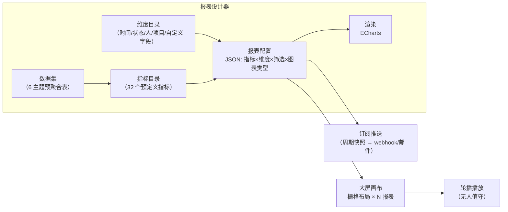
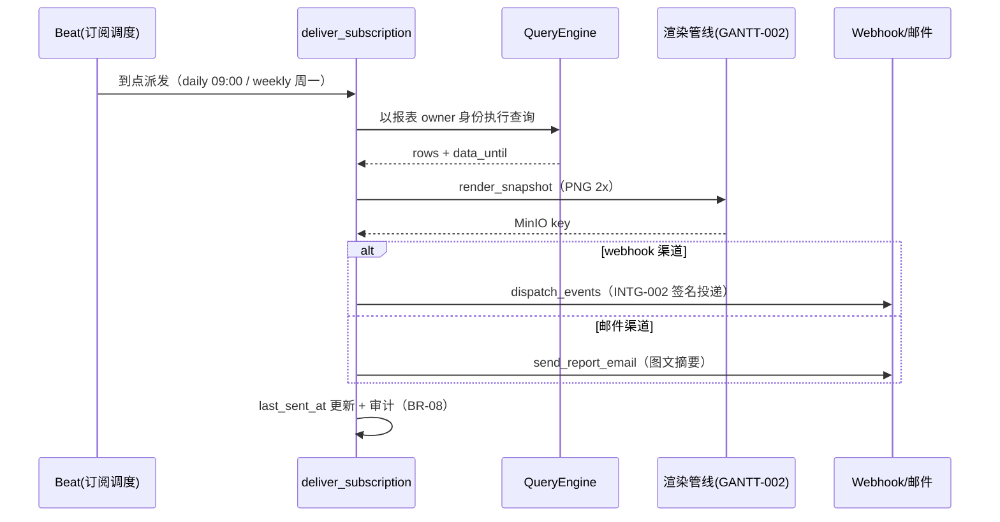

# 企业数据大屏与自定义报表

| 元信息项 | 内容 |
| --- | --- |
| 文档编号 | RPT-005 |
| 所属迭代 | P4：远期增强（第 13 周起，签约驱动排期） |
| 优先级 | P4（企业版增强 / 经营决策价值线） |
| 所属模块 | M10-RPT 数据报表 |
| 文档状态 | 待评审（Draft） |
| 最后更新日期 | 2026-09-01 |
| 上游依据 | `docs/需求文档.md` §3.6 报表节、§8.2 P4 列（报表行） |
| 前置依赖 | `RPT-003`（燃尽/速率/累积流：图表渲染与快照语义）、`RPT-004`（健康度/负载：聚合框架）、`AUTH-012`（大屏用量配额）、`PROJ-004`（项目集维度） |
| 下游依赖 | 经营分析深化（P4+）；`AI-001` 消费大屏聚合数据做异常检测 |
| 架构基线 | [`api-conventions.md`](../architecture/api-conventions.md) §8、`RPT-003` 快照不可篡改原则 |
| 竞品参考 | Jira Dashboard（Gadget 体系）、Monday（Dashboard 模板市场）、帆软/Tableau（专业 BI 边界参照） |

> **范围声明**：本文档交付两块——**自定义报表设计器**（指标×维度×图表类型的自由组合，保存为可分享报表）与**企业数据大屏**（多报表拼合的轮播墙，会议室/管理层场景）。查询能力刻意限定在系统预聚合数据集之上（§2.2），不做自由 SQL、不做跨系统数据源接入——那是专业 BI 的领地，本文档的边界是「让管理层不写 SQL 也能拼出要看的图」。

---

## 1. 概述

### 1.1 功能定位

`RPT-003/004` 交付了「我们认为你该看的」预置报表；管理层真正买单的是「我自己拼出来的那一屏」。典型诉求：

| 客户原声 | 设计器对应 |
| --- | --- |
| 「我要按产品线看每月需求吞吐量，不要按项目」 | 维度=自定义字段（产品线），指标=完成任务数，分组=月 |
| 「会议室挂一屏：左边燃尽、右边延期 TOP10、下面滚动里程碑」 | 大屏画布 + 轮播 |
| 「每周一早上自动把这个报表发给高管群」 | 订阅推送（webhook/邮件） |

### 1.2 启动条件

| 条件 | 判定 |
| --- | --- |
| 商业条件 | ≥ 3 家客户管理层提出定制看板需求；大屏通常作为企业版续约增值点 |
| 技术前置 | `RPT-003/004` 聚合框架生产稳定（预聚合表是设计器的查询底座）；聚合数据集覆盖 §2.2 全部主题 |
| 选型前置 | 图表库选型评审：ECharts（本方案，大屏生态成熟）vs 自研 SVG（否决，`GANTT-001` 经验：渲染层不重复造轮子） |

### 1.3 独立交付判定

1. 演示：5 分钟内在设计器拼出「按产品线 × 月的需求吞吐柱状图」并保存、分享给另一管理员。
2. 大屏：6 组件拼合一屏，轮播播放 1 小时无内存泄漏（heap 增长 < 10%）、无数据断流（轮询容错）。
3. 性能：任意报表查询 P95 < 1.5s（预聚合命中）；大屏 8 组件并发刷新不卡顿。
4. 零回归：`RPT-003/004` 预置报表渲染与数据不变（设计器是纯新增面）。

### 1.4 竞品参考结论（详见第 6 章）

- **Jira Dashboard**：Gadget 拼贴 + 筛选器驱动；问题是 Gadget 各自为政，无统一指标语义。
- **Monday Dashboard**：模板市场 + 拖拽体验标杆；图表类型受限但够用。
- **帆软/Tableau**：专业 BI 的自由度本系统**不追**（§6 论证边界）。
- **本系统取舍**：统一「指标目录」语义层（所有图表从同一目录选指标，口径一致，BR-02）+ 大屏轮播工程化（内存/容错/无人值守）。

---

## 2. 业务逻辑

### 2.1 设计器模型



| 概念 | 定义 |
| --- | --- |
| 数据集 | 预聚合主题表：`fact_issue_daily`（任务日粒度）/ `fact_cycle`（迭代）/ `fact_worklog_daily`（工时）/ `fact_member_load`（负载）/ `fact_file`（文件）/ `fact_portfolio`（项目集）——全部由 `RPT-003/004` 聚合任务产出 |
| 指标 | 数据集字段 + 聚合方式（sum/count/avg/ratio），目录 32 个（如：完成任务数、平均周期天数、延期率、工时偏差） |
| 维度 | 分组轴：时间（日/周/月）、状态组、优先级、负责人、项目、项目集、自定义字段（枚举型） |
| 报表 | 配置 JSON：`{dataset, metrics[], dimensions[], filters, chart_type, options}` |
| 大屏 | 栅格画布（24 列）拼合 N 个报表引用 + 播放配置（轮播间隔/主题/Logo） |

### 2.2 业务规则（BR）

| 编号 | 规则 | 说明 |
| --- | --- | --- |
| BR-01 | 预聚合限定 | 查询只允许打向六张预聚合表；设计器无自由 SQL 入口；新数据需求走「新增聚合任务 + 指标注册」开发流程 |
| BR-02 | 口径唯一 | 指标只能从目录选择（每个指标有唯一 ID、中文名、口径说明、所属数据集）；同名不同口径的指标禁止注册 |
| BR-03 | 权限随行 | 报表查询结果按**查看者**权限实时过滤（项目可见性行级剪枝）；分享报表≠分享权限，无权项目数据显示「已按权限裁剪」水印 |
| BR-04 | 图表类型白名单 | 柱状/条形/折线/面积/饼/数字卡/表格/漏斗/热力 9 型；地图/桑基图等不开放（数据面不支撑） |
| BR-05 | 筛选即参数 | 报表筛选器可声明为「大屏级参数」（如时间范围），大屏播放时统一注入，各组件跟随联动 |
| BR-06 | 快照语义 | 报表数据 = 预聚合表当前态（T+1 日更）；设计器显著标注「数据截至昨日」；当日数据仅数字卡支持（走实时计数） |
| BR-07 | 大屏只读 | 播放态无编辑入口；轮播页 URL 带只读 token（`dsp_` 前缀，可吊销），会议室 PC 免登录 |
| BR-08 | 订阅推送 | 报表可配周期订阅（日/周）：服务端渲染快照（PNG）+ 摘要数字 → webhook（`INTG-002` 管道）或邮件；订阅本身入审计 |
| BR-09 | 配额 | 每工作空间：报表 ≤ 100、大屏 ≤ 20、每屏组件 ≤ 12、订阅 ≤ 50（`RESOURCE_LIMIT_EXCEEDED`）；播放端并发连接 ≤ 20/屏 |
| BR-10 | 性能护栏 | 单报表查询超时 10s；维度基数 > 500 的分组自动截断 Top-50 + 「其他」桶 |
| BR-11 | 审计 | 报表/大屏的创建、分享、删除、订阅变更入 `AuditLog`；播放 token 签发/吊销同 |
| BR-12 | 零回归 | 预置报表（`RPT-003/004`）不经过设计器渲染层，行为与 V1.0 一致 |

### 2.3 指标目录（节选）

| 指标 ID | 名称 | 口径 | 数据集 |
| --- | --- | --- | --- |
| `m_done_count` | 完成任务数 | 状态组=completed 的任务计数 | fact_issue_daily |
| `m_cycle_time_avg` | 平均周期天数 | started→completed 天数均值 | fact_issue_daily |
| `m_overdue_ratio` | 延期率 | 到期未完成 / 到期总数 | fact_issue_daily |
| `m_throughput` | 吞吐量 | 周期内 completed 计数 | fact_cycle |
| `m_velocity` | 迭代速率 | 迭代完成故事点均值（近 3） | fact_cycle |
| `m_worklog_hours` | 工时投入 | worklog 分钟合计 / 60 | fact_worklog_daily |
| `m_estimate_dev` | 工时偏差 | （实际-预估）/预估 | fact_worklog_daily |
| `m_load_heat` | 负载热力 | 人在制任务数 × 剩余工时 | fact_member_load |
| `m_baseline_var` | 基线偏差 | 相对基线延期天数（`TASK-015`） | fact_issue_daily |
| …（共 32 个，注册表随聚合任务上线增量扩充） | | | |

### 2.4 大屏轮播工程

| 主题 | 规格 |
| --- | --- |
| 布局 | 24 列栅格拖拽拼合；组件 = 报表引用 + 标题 + 刷新周期（默认 5min） |
| 播放 | 多屏轮播（每屏停留 30-300s 可配）；`prefers-reduced-motion` 时停动画 |
| 无人值守 | 播放页心跳上报；连接断开指数退避重连；ECharts 实例随组件卸载 `dispose()`（内存纪律，§1.3 判定 2） |
| 只读 token | `dsp_` 前缀 token 绑定大屏 + 过期时间；仅 GET 播放数据，任何写操作 `PERM_DENIED` |

---

## 3. UI/UX 设计

### 3.1 页面清单

| 页面 | 位置 | 核心任务 |
| --- | --- | --- |
| 报表中心 | 工作空间主导航 → 报表 | 报表/大屏列表、模板入口、搜索 |
| 报表设计器 | 报表中心 → 新建 | 左：数据（指标/维度）；中：画布；右：筛选与样式 |
| 大屏设计器 | 报表中心 → 新建大屏 | 栅格画布拼合 + 播放配置 |
| 大屏播放 | `/display/{token}` | 全屏轮播（免登录只读） |

### 3.2 报表设计器线框

```
┌──────────────────────────────────────────────────────────────────┐
│ 报表设计器 · 未命名报表                     [保存] [分享] [订阅]  │
├────────────┬──────────────────────────────────────┬──────────────┤
│ 数据集     │                                      │ 筛选         │
│ ▸任务日表  │        ┌────────────────────┐        │ 时间: [近90天]│
│  指标      │        │      ▇ 柱状图       │        │ 项目: [全部▾] │
│  ⊕完成任务数│        │   ▄▅▇█▆▄▃▅▇█▆▄      │        │ 状态组:[全部▾]│
│  ⊕延期率   │        │                    │        │              │
│  维度      │        │  X: 月  Y: 任务数   │        │ 图表         │
│  ⊕月份     │        │  系列: 产品线(字段) │        │ (•)柱 ( )折  │
│  ⊕产品线   │        │                    │        │ ( )饼 ( )表  │
│ ▸工时日表  │        └────────────────────┘        │ Top-N: [50]  │
│ ▸迭代表    │  数据截至 2026-08-31（T+1）           │              │
├────────────┴──────────────────────────────────────┴──────────────┤
│ 查询 0.8s · 86 行 · 已按你的项目权限裁剪                          │
└──────────────────────────────────────────────────────────────────┘
```

### 3.3 大屏播放线框

```
┌──────────────────────────────────────────────────────────────────┐
│ ▣ 研发指挥中心                          屏 1/3 · 45s ⏸   14:32   │
├──────────────────┬──────────────────┬────────────────────────────┤
│ 需求吞吐（月度）  │ 迭代燃尽          │ 🔴 延期 TOP10              │
│  ▄▅▇█▆▄▃▅        │  ╲___            │ 1. ECOM-231 下单链路 +6d   │
│                  │   ╲___·····实际  │ 2. ECOM-245 库存优化 +4d   │
│  环比 +12%       │    理想╲___      │ 3. PAY-88   对账重构 +4d   │
├──────────────────┴──────────────────┴────────────────────────────┤
│ 里程碑滚动条: ◆支付V2(9/27 ⚠) ◇双11备战(10/20) ◇年终结算(12/15)    │
└──────────────────────────────────────────────────────────────────┘
```

### 3.4 交互规则

| 场景 | 交互 |
| --- | --- |
| 拖拽建模 | 指标/维度拖入画布槽位即时刷新（去抖 500ms）；非法组合（如饼图×双维度）置灰并提示 |
| 权限水印 | 存在裁剪时画布底部常驻「已按权限裁剪」；点击展开被裁项目数（不含名称） |
| 保存与分享 | 保存必填名称+描述；分享生成链接（成员可见，权限随行 BR-03） |
| 大屏 token | 播放链接面板显示 token 生成/吊销/到期设置；吊销即时生效（播放端下轮心跳断开） |
| 订阅 | 订阅配置弹窗：周期/渠道（webhook URL 复用 `INTG-002` 订阅或邮件列表）/预览最近一次快照 |
| 权限 | 设计器 `report.design`（PROJ_ADMIN+ 或 WS 授权）；播放 token 管理 `report.share`；查看按报表分享范围 |

---

## 4. 技术架构

### 4.1 数据模型

```python
# apps/api/rp_reports/models_custom.py
class Report(BaseModel):
    workspace = models.ForeignKey("rp_workspaces.Workspace",
                                  on_delete=models.CASCADE)
    name = models.CharField(max_length=64)
    description = models.CharField(max_length=255, blank=True)
    config = models.JSONField()
    # {"dataset": "fact_issue_daily",
    #  "metrics": ["m_done_count"], "dimensions": ["month", "cf_product_line"],
    #  "filters": {...}, "chart_type": "bar", "options": {...}}
    owner = models.ForeignKey("rp_users.User", on_delete=models.PROTECT)
    is_shared = models.BooleanField(default=False)             # 空间内可见
    version = models.PositiveIntegerField(default=1)           # 乐观锁

    class Meta:
        db_table = "rpt_report"
        constraints = [
            models.UniqueConstraint(fields=["workspace", "name"],
                                    name="uq_report_ws_name"),
        ]


class Dashboard(BaseModel):
    workspace = models.ForeignKey("rp_workspaces.Workspace",
                                  on_delete=models.CASCADE)
    name = models.CharField(max_length=64)
    layout = models.JSONField()
    # {"grid": 24, "items": [{"report_id": "...", "x":0,"y":0,"w":8,"h":6,
    #                          "refresh_s": 300}], "params": {"range": "90d"}}
    theme = models.CharField(max_length=12, default="dark")
    owner = models.ForeignKey("rp_users.User", on_delete=models.PROTECT)

    class Meta:
        db_table = "rpt_dashboard"


class DisplayToken(BaseModel):
    dashboard = models.ForeignKey(Dashboard, on_delete=models.CASCADE,
                                  related_name="tokens")
    token_hash = models.CharField(max_length=64, unique=True)  # dsp_… SHA-256
    token_prefix = models.CharField(max_length=12)
    expires_at = models.DateTimeField(null=True)
    revoked_at = models.DateTimeField(null=True)
    last_seen_at = models.DateTimeField(null=True)             # 心跳

    class Meta:
        db_table = "rpt_display_token"


class ReportSubscription(BaseModel):
    report = models.ForeignKey(Report, on_delete=models.CASCADE,
                               related_name="subscriptions")
    schedule = models.CharField(max_length=8)                  # daily/weekly
    channel = models.JSONField()   # {"type":"webhook","subscription_id":...}
    #                            # {"type":"email","recipients":[...]}
    is_active = models.BooleanField(default=True)
    last_sent_at = models.DateTimeField(null=True)

    class Meta:
        db_table = "rpt_subscription"
```

### 4.2 查询编译与权限剪枝

```python
# apps/api/rp_reports/query_engine.py
class ReportQueryEngine:
    """配置 JSON → 安全 SQL；只打预聚合表（BR-01），权限剪枝注入（BR-03）。"""

    def execute(self, report_config: dict, viewer, params: dict) -> dict:
        ds = DatasetRegistry.get(report_config["dataset"])     # 白名单
        metrics = [ds.metrics[m] for m in report_config["metrics"]]
        dims = [ds.dimensions[d] for d in report_config["dimensions"]]
        filters = self._merge_filters(report_config["filters"], params)
        visible_projects = viewer.visible_project_ids(         # 行级剪枝
            workspace_id=ds.workspace_scope(report_config))
        sql, args = ds.build_query(
            metrics=metrics, dimensions=dims, filters=filters,
            project_scope=visible_projects,
            top_n=self._top_n_guard(dims))                     # BR-10
        rows = ds.run(sql, args, timeout_s=10)                 # BR-10
        return {"rows": rows, "truncated": len(visible_projects) <
                ds.total_projects(report_config),
                "data_until": ds.last_aggregate_date()}
```

| 要点 | 说明 |
| --- | --- |
| DatasetRegistry | 六数据集注册表声明每表的合法指标/维度/筛选字段——编译层拒绝注册表外一切字段名（SQL 注入面为零，查询为参数化模板拼接） |
| 权限语义 | `visible_project_ids` 复用 `AUTH-003/006` 解析；裁剪标记 `truncated` 驱动前端水印（BR-03） |
| 缓存 | 同（报表版本 × 查看者项目集哈希 × 参数）Redis 缓存 5min；大屏组件刷新命中率高 |

### 4.3 API 端点

| 方法 | 路径 | 说明 |
| --- | --- | --- |
| GET/POST | `/api/v1/workspaces/{slug}/reports/` | 报表列表 / 创建 |
| GET/PATCH/DELETE | `/api/v1/workspaces/{slug}/reports/{id}/` | 详情 / 编辑（乐观锁 `version`）/ 删除 |
| POST | `/api/v1/workspaces/{slug}/reports/preview/` | 未保存配置即时预览（设计器画布） |
| GET | `/api/v1/workspaces/{slug}/reports/{id}/query/` | 已保存报表查询（权限剪枝） |
| GET/POST | `/api/v1/workspaces/{slug}/dashboards/` | 大屏列表 / 创建 |
| PATCH | `/api/v1/workspaces/{slug}/dashboards/{id}/` | 布局/播放配置 |
| POST/DELETE | `/api/v1/workspaces/{slug}/dashboards/{id}/tokens/` | 播放 token 签发 / 吊销 |
| GET | `/api/v1/display/{token}/data/` | 播放端数据（token 认证，只读，BR-07） |
| GET/POST | `/api/v1/workspaces/{slug}/reports/{id}/subscriptions/` | 订阅管理 |

**成功示例** — `POST …/reports/preview/`：

```json
{
  "status": "success",
  "data": {
    "columns": ["month", "product_line", "done_count"],
    "rows": [
      {"month": "2026-07", "product_line": "电商", "done_count": 142},
      {"month": "2026-08", "product_line": "电商", "done_count": 168}
    ],
    "row_count": 86,
    "truncated": true,
    "data_until": "2026-08-31",
    "elapsed_ms": 812
  },
  "meta": {"request_id": "01J70FK2M8NQ4PXRBTVH5WD3EA"}
}
```

**错误示例** — 指标未注册（BR-02）：

```json
{
  "status": "error",
  "error": {
    "code": "VALIDATION_INVALID_PARAM",
    "message": "指标不在目录中",
    "details": [{"field": "metrics[1]", "code": "NOT_A_CHOICE",
                 "message": "「m_custom_sql」未注册；可用指标见 /metrics/ 目录"}]
  },
  "meta": {"request_id": "01J70FL3N9OR5QYSCUW6XE4FB"}
}
```

**错误示例** — 播放 token 吊销后（BR-07）：

```json
{
  "status": "error",
  "error": {
    "code": "AUTH_TOKEN_REVOKED",
    "message": "播放链接已被吊销，请联系管理员重新生成",
    "details": []
  },
  "meta": {"request_id": "01J70FM4O0PS6RZTDVX7YF5GC"}
}
```

### 4.4 订阅快照任务



```python
# apps/api/rp_reports/tasks_subscribe.py
@shared_task(queue="report")
def deliver_subscription(subscription_id: str) -> None:
    sub = ReportSubscription.objects.select_related("report").get(
        id=subscription_id, is_active=True)
    engine = ReportQueryEngine()
    data = engine.execute(sub.report.config, sub.report.owner, {})
    png_key = render_snapshot.delay(                     # 复用 GANTT-002 渲染管线
        report_id=str(sub.report.id), payload=data).get(timeout=120)
    if sub.channel["type"] == "webhook":
        dispatch_events.delay(                           # INTG-002 管道
            sub.channel["subscription_id"],
            {"type": "report.snapshot",
             "payload": {"report": sub.report.name,
                         "image_url": signed_url(png_key, ttl=86400),
                         "highlights": digest_numbers(data)}})
    else:
        send_report_email.delay(sub.channel["recipients"], sub.report, png_key)
    sub.last_sent_at = timezone.now()
    sub.save(update_fields=["last_sent_at", "updated_at"])
```

### 4.5 前端播放端工程

```typescript
// apps/web/src/display/player.ts —— 无人值守播放核心
export class DisplayPlayer {
  private charts = new Map<string, echarts.ECharts>();
  private backoff = 1000;

  async loadScreen(token: string, screenIndex: number) {
    try {
      const res = await displayApi.screenData(token, screenIndex);
      this.backoff = 1000;                              // 成功即重置退避
      this.renderItems(res.data.items);
    } catch (e) {
      if (errorCode(e) === "AUTH_TOKEN_REVOKED") return this.halt("链接已吊销");
      setTimeout(() => this.loadScreen(token, screenIndex),
                 this.backoff = Math.min(this.backoff * 2, 60_000));  // 容错重连
    }
  }

  private renderItems(items: IDisplayItem[]) {
    const alive = new Set(items.map(i => i.id));
    for (const [id, chart] of this.charts) {            // 卸载即 dispose（BR/内存）
      if (!alive.has(id)) { chart.dispose(); this.charts.delete(id); }
    }
    for (const item of items) this.mountOrUpdate(item);
  }
}
```

| 前端规则 | 说明 |
| --- | --- |
| 心跳 | 播放端 30s 心跳上报（`last_seen_at`），管理页可见「在线播放端 n」 |
| 内存纪律 | 组件卸载 `dispose()` + 定时器全注册到统一清理器；1h 播放 heap 增长 < 10%（E2E-02 断言） |
| 降动画 | `prefers-reduced-motion` 或 FPS < 30 持续 10s 时自动关闭图表动画 |

### 4.6 性能与规模

| 指标 | 预算 | 手段 |
| --- | --- | --- |
| 报表查询 | P95 < 1.5s | 预聚合表（行数万级）+ 5min 缓存 + 10s 超时护栏 |
| 大屏 8 组件并发 | 首屏 < 3s | 组件并行查询（单查询有界）+ 缓存命中 |
| 播放稳定性 | 24h 无人工干预 | 退避重连 + dispose 纪律 + 心跳监控 |
| 订阅投递 | 09:00 批次 < 10min | `report` 队列独立，渲染复用既有管线 |

### 4.7 维度目录与数据集注册表（节选）

| 维度 ID | 名称 | 可用数据集 | 基数护栏 |
| --- | --- | --- | --- |
| `d_day / d_week / d_month` | 日/周/月 | 全部时间序列表 | — |
| `d_state_group` | 状态组 | fact_issue_daily | 5 |
| `d_priority` | 优先级 | fact_issue_daily | 5 |
| `d_assignee` | 负责人 | issue/worklog/load | Top-50 |
| `d_project` | 项目 | 全部（权限剪枝后） | Top-50 |
| `d_portfolio` | 项目集 | fact_portfolio | 20 |
| `d_cf_enum:<property_id>` | 枚举型自定义字段 | fact_issue_daily | Top-50（BR-10） |
| `d_cycle` | 迭代 | fact_cycle | Top-24 |
| `d_label` | 标签 | fact_issue_daily | Top-50 |

| 数据集 | 粒度 | 更新 | 保留 |
| --- | --- | --- | --- |
| fact_issue_daily | 任务 × 日快照 | T+1（04:30 聚合） | 3 年（月归档压缩） |
| fact_cycle | 迭代（结束即快照，`RPT-003` 不可篡改） | 事件触发 | 永久 |
| fact_worklog_daily | 人 × 日 | T+1 | 3 年 |
| fact_member_load | 人 × 周 | 每日 | 1 年 |
| fact_file | 文件域日汇总 | T+1 | 1 年 |
| fact_portfolio | 项目集 × 日 | T+1 | 3 年 |

### 4.8 缓存与失效矩阵

| 键 | 内容 | TTL | 失效触发 |
| --- | --- | --- | --- |
| `rq:{report_version}:{scope_hash}:{params_hash}` | 查询结果 | 5min | 报表编辑（version 变）/ 聚合任务完成广播 |
| `rmeta:{ws}:catalog` | 指标/维度目录 | 1h | 注册表变更（发版） |
| `dsp:{token}` | token 校验结果 | 60s | 吊销时精确删除（BR-07 即时生效） |
| `rsub:{report}:{date}` | 订阅快照 PNG | 24h | 每日重建 |

| scope_hash | = 查看者可见项目集 ID 列表排序后 sha256 前 16 位——项目集变化（新授权/移出）自然产生新键，无需主动失效 |
| --- | --- |

### 4.9 播放端数据协议

| 消息 | 方向 | 内容 |
| --- | --- | --- |
| `GET /display/{token}/screen/{i}` | 拉取 | 屏布局 + 各组件最新数据（服务端聚合一屏一响应，免 N 请求） |
| `POST /display/{token}/heartbeat` | 上报 | 30s 一次：`{screen_index, fps, heap_mb}`；服务端更新 `last_seen_at` 并回 `{action: "continue" \| "halt"}`（吊销即 halt） |
| 错误重试 | 客户端 | 5xx/超时指数退避 1s→60s 封顶；401/403/410 立即停播显示原因页 |

---

## 5. 测试用例

### 5.1 单元测试（UT）

| 编号 | 用例 | 断言 |
| --- | --- | --- |
| UT-01 | 非法指标拒绝 | 注册表外指标 `VALIDATION_INVALID_PARAM` 子码 `NOT_A_CHOICE` |
| UT-02 | 非法维度组合 | 饼图双维度被设计器校验拒绝 |
| UT-03 | 权限剪枝 | 查看者可见 3/8 项目时 rows 仅含 3 项目且 `truncated=true` |
| UT-04 | Top-N 截断 | 维度基数 600 → 返回 Top-50 + 「其他」聚合行 |
| UT-05 | 缓存键 | 同配置同项目集二次查询命中缓存（DB mock 零调用） |
| UT-06 | token 只读 | 播放 token 调任何写端点 `PERM_DENIED`；过期/吊销 `AUTH_TOKEN_REVOKED` |
| UT-07 | 乐观锁 | `version` 不匹配 PATCH 返回 `RESOURCE_CONFLICT` |
| UT-08 | 配额 | 第 101 张报表 `RESOURCE_LIMIT_EXCEEDED` |
| UT-09 | 参数注入 | 大屏 `params.range` 覆盖组件筛选且组件级参数优先级正确（BR-05） |
| UT-10 | 订阅渲染 | 快照 PNG 生成且 webhook 负载含 image_url 与摘要数字 |
| UT-11 | 图表 dispose | 组件移除后 ECharts 实例数归零（jsdom 断言） |
| UT-12 | 零回归 | 预置报表路由不经过 `ReportQueryEngine`（路由表断言） |

### 5.2 集成测试（IT）

| 编号 | 用例 | 断言 |
| --- | --- | --- |
| IT-01 | 设计器全链 | 建配置 → preview → 保存 → query 一致 → 分享给他人（其权限裁剪生效） |
| IT-02 | 大屏拼合播放 | 6 组件大屏 token 播放数据端点并发 8 请求 P95 < 3s |
| IT-03 | 订阅投递 | daily 订阅触发 → PNG 落 MinIO → webhook 签收（`INTG-002` 管道） |
| IT-04 | 断流容错 | 播放中断网 2min → 退避重连恢复，无重复图表实例 |
| IT-05 | 聚合衔接 | 六数据集 `last_aggregate_date` 与 `RPT-003/004` 聚合任务水位一致 |
| IT-06 | 审计 | 创建/分享/token/订阅四动作各有 `AuditLog` |

### 5.3 E2E 测试

| 编号 | 场景 | 验收 |
| --- | --- | --- |
| E2E-01 | 5 分钟拼报表 | §1.3 判定 1 现场演示通过 |
| E2E-02 | 大屏 1 小时 | 轮播 1h：heap 增长 < 10%、无断流、动画降级逻辑不触发误报 |
| E2E-03 | 订阅到群 | 配置周报订阅 → 模拟周一触发 → 演示 webhook 收到图文卡片 |

---

## 6. 竞品深度对标

| 维度 | Jira Dashboard | Monday | 帆软/Tableau | 本系统 |
| --- | --- | --- | --- | --- |
| 语义层 | ❌（Gadget 各自口径） | 部分（board 列驱动） | ✅（完整语义层） | ✅ 指标目录（32 注册指标，口径唯一 BR-02） |
| 数据自由度 | JQL 筛选 | 板内列 | 任意数据源 + SQL | 六预聚合表（BR-01 刻意限定） |
| 大屏 | 无原生（插件） | 有 | ✅（专业） | ✅ 轮播工程化（token/容错/内存纪律） |
| 订阅 | 筛选器订阅（弱） | ✅ | ✅ | ✅ PNG 快照 + webhook/邮件双通道 |
| 权限 | 各 Gadget 自判 | 板权限 | 行级（复杂配置） | 查看者行级剪枝 + 裁剪水印（BR-03） |

**结论**：不追专业 BI 的理由有三——客户已有 BI 时希望系统**供数**（`INTG-004` Open API 已解决），没有 BI 时需要的是「5 分钟拼出能看的图」而非「学一门工具」；自由 SQL 对企业 SaaS 是性能与安全的双重不可控；而 Jira 的教训（Gadget 口径打架让管理层失去信任）说明**语义层比图表数量值钱**——32 个口径唯一的注册指标是本设计的脊梁。

---

## 7. 里程碑与验收

### 7.1 工作量估算

| 交付面 | 内容 | 估算 |
| --- | --- | --- |
| Model / Migration | 4 表 + 指标注册表种子 | 1 d |
| 后端 | 查询引擎 + 注册表、订阅任务、播放端点、10 组管理端点 | 5 d |
| 前端 | 设计器、大屏设计器、播放端、报表中心 | 6 d |
| 测试 | UT-01~12、IT-01~06、E2E-01~03 | 3 d |
| **合计** | | **15 d（2-3 人并行约 2 周）** |

### 7.2 可操作演示的验收标准

1. 设计器 5 分钟演示（E2E-01）+ 权限水印展示（另一管理员查看同报表见其自己的裁剪结果）。
2. 大屏工程验收（E2E-02）：1h 播放内存与断流指标达标；token 吊销后播放端下轮即停。
3. 订阅闭环（E2E-03）。
4. 指标口径审查：32 指标口径说明与 `RPT-003/004` 口径文档逐条一致（BR-02 审计）。
5. 零回归：预置报表契约快照与企业版 V1.0 一致（UT-12 + 契约比对）。
