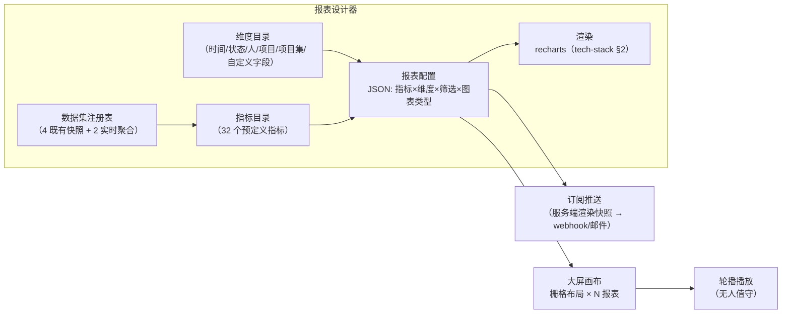
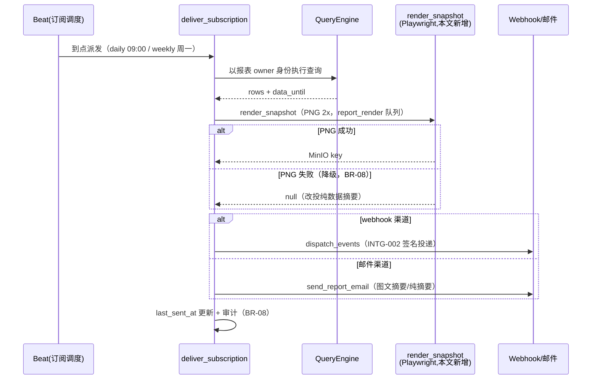

# 企业数据大屏与自定义报表

| 元信息项 | 内容 |
| --- | --- |
| 文档编号 | RPT-005 |
| 所属迭代 | P4：远期增强（第 13 周起，签约驱动排期） |
| 优先级 | P4（企业版增强 / 经营决策价值线） |
| 所属模块 | M10-RPT 数据报表 |
| 文档状态 | 待评审（Draft） |
| 最后更新日期 | 2026-09-06 |
| 修复摘要 | 2026-09-06 R1 评审 14 项修复：①**数据底座回归上游实况（BLOCKER）**——删除六张无产出方的虚构 `fact_*` 表，数据集注册表改挂既有模型/服务（`CycleSnapshot`/`DailyGroupSnapshot`（RPT-003）、`WorkLogSummary`（TASK-013）、`HealthSnapshot`（RPT-004）、`PortfolioService`（PROJ-004）+ `Issue` 实时聚合（RPT-002 口径基座）），32 指标逐一重映射、粒度/刷新/保留按各源实况，本文零新建聚合表；②图表库回归 recharts 2.15.x（tech-stack §2 锁定，删除 ECharts 表述）；③信封对齐 api-conventions §4——成功示例删 `meta.request_id`（追踪走 `X-Request-Id` 头）、错误示例 `request_id` 移入 `error` 对象；④删除未注册权限码 `report.design`/`report.share`——设计器写面（含分享开关）复用 `project.setting.manage`、订阅与播放 token 签发/吊销复用 `report.export`（零新增码，分工见 §3.4/§4.3）；⑤订阅 PNG 改本文新增 Playwright 服务端渲染通道（GANTT-002 为前端 DOM 截图无服务端管线；tech-stack 待回改登记）；⑥播放端契约统一 `/api/v1/display/{token}/screen/{i}/` + `/heartbeat/` 并声明 token 匿名豁免边界；⑦上游依据改 §7.8+§8.2；⑧大屏/报表配额改本文自建（与 AUTH-012 租户配额分域）；⑨端点补 `reports/metrics/` 与 dashboards DELETE，共 11 组；⑩webhook 事件 `report.snapshot` 标注待 INTG-002 §2.3 补登；⑪聚合端点限流 10 请求/分钟声明 + UT-13/IT-07/IT-08（429、P95、超时 504）；⑫播放端 401/403/410 停播分支补全；⑬`AI-001` 消费面改「预留」；⑭`truncated` 拆 `pruned`（权限剪枝）/`truncated`（Top-N）、组件数口径统一 12（BR-09 上限）；2026-09-06 R2 复评 9 项修复：①**`m_load_heat` 口径对齐 RPT-004 实况**——「人在制任务数 × 剩余工时」改为「工时投入（人×周 `total_minutes`）/ 周容量（负载率）」（`WorkLogSummary` 实无在制任务数/剩余工时字段，分母复用 `ProjectWorklogConfig.weekly_capacity_minutes`，RPT-004 BR-06/07 同源复用），§2.1 指标示例同步；②三处示例数据集切换修正——§4.1 注释配置 dataset 改 `ds_issue_live`（`d_cf_enum` 仅实时数据集可用）、§4.3 成功示例 `data_until` 改字面量 `"realtime"` 并注切换依据、§3.2 线框脚注同步改「实时（ds_issue_live）」；③播放端 403/410 停播分支补 UT-15（mock 三状态码 → 断言不重试且显示对应原因页）；④`report_render` 资源预算（并发 ≤ 2/内存 ≤ 512 MB/超时 120 s）补 IT-09 断言；⑤BR-08 补 `report.snapshot` 挂载域声明（工作空间级事件挂载扩展——INTG-002 待回改）；⑥401 统一口径补 256-bit 随机 token 防枚举边界说明；⑦§4.2 代码补渲染缓存读/写点注释；⑧§4.8 scope_hash 由伪表格改正文注释；⑨修复摘要④措辞与 §3.4/§4.3 权限分工对齐 |
| 上游依据 | `docs/需求文档.md` §7.8 报表与大屏（企业核心）、§8.2 P4 列（报表行） |
| 前置依赖 | `RPT-003`（燃尽/速率/累积流：`CycleSnapshot`/`DailyGroupSnapshot` 快照语义与口径）、`RPT-004`（健康度：`HealthSnapshot`；负载同源复用声明）、`TASK-013`（`WorkLogSummary` 人×周快照——同源复用，不另建聚合）、`PROJ-004`（项目集实时聚合）、`AUTH-012`（租户级存储/成员/API 速率/导出行数配额——大屏/报表数量与播放并发配额**本文自建**，分域见 BR-09） |
| 下游依赖 | 经营分析深化（P4+）；`AI-001` 异常检测消费大屏聚合数据——**预留**（AI-001 当前版本未声明该消费面，接入时由其登记） |
| 架构基线 | [`api-conventions.md`](../architecture/api-conventions.md) §4/§7.2/§8、`RPT-003` 快照不可篡改原则、[`tech-stack.md`](../architecture/tech-stack.md) §2（recharts 2.15.x 版本锁定） |
| 竞品参考 | Jira Dashboard（Gadget 体系）、Monday（Dashboard 模板市场）、帆软/Tableau（专业 BI 边界参照） |

> **范围声明**：本文档交付两块——**自定义报表设计器**（指标×维度×图表类型的自由组合，保存为可分享报表）与**企业数据大屏**（多报表拼合的轮播墙，会议室/管理层场景）。查询能力刻意限定在系统既有聚合数据集之上（§4.7 数据集注册表），不做自由 SQL、不做跨系统数据源接入——那是专业 BI 的领地，本文档的边界是「让管理层不写 SQL 也能拼出要看的图」。

---

## 1. 概述

### 1.1 功能定位

`RPT-003/004` 交付了「我们认为你该看的」预置报表；管理层真正买单的是「我自己拼出来的那一屏」。典型诉求：

| 客户原声 | 设计器对应 |
| --- | --- |
| 「我要按产品线看每月需求吞吐量，不要按项目」 | 维度=自定义字段（产品线），指标=完成任务数，分组=月 |
| 「会议室挂一屏：左边燃尽、右边延期 TOP10、下面滚动里程碑」 | 大屏画布 + 轮播 |
| 「每周一早上自动把这个报表发给高管群」 | 订阅推送（webhook/邮件） |

### 1.2 启动条件

| 条件 | 判定 |
| --- | --- |
| 商业条件 | ≥ 3 家客户管理层提出定制看板需求；大屏通常作为企业版续约增值点 |
| 技术前置 | `RPT-003/004` 聚合框架生产稳定（既有快照数据集是设计器的查询底座，§4.7）；数据集注册表覆盖 §4.7 全部主题 |
| 选型前置 | 图表库：**recharts 2.15.x**（tech-stack §2 已锁定，RPT-003 三图同栈复用，不另引入 ECharts——如大屏场景 recharts 不敷处，按 tech-stack §1 版本锁定流程另行评审，本文未引入）vs 自研 SVG（否决，`GANTT-001` 经验：渲染层不重复造轮子） |

### 1.3 独立交付判定

1. 演示：5 分钟内在设计器拼出「按产品线 × 月的需求吞吐柱状图」并保存、分享给另一管理员。
2. 大屏：12 组件拼合一屏（BR-09 上限口径），轮播播放 1 小时无内存泄漏（heap 增长 < 10%）、无数据断流（轮询容错）。
3. 性能：任意报表查询 P95 < 1.5s（快照型数据集命中，IT-08 断言）；大屏 12 组件并发刷新不卡顿（IT-02）。
4. 零回归：`RPT-003/004` 预置报表渲染与数据不变（设计器是纯新增面）。

### 1.4 竞品参考结论（详见第 6 章）

- **Jira Dashboard**：Gadget 拼贴 + 筛选器驱动；问题是 Gadget 各自为政，无统一指标语义。
- **Monday Dashboard**：模板市场 + 拖拽体验标杆；图表类型受限但够用。
- **帆软/Tableau**：专业 BI 的自由度本系统**不追**（§6 论证边界）。
- **本系统取舍**：统一「指标目录」语义层（所有图表从同一目录选指标，口径一致，BR-02）+ 大屏轮播工程化（内存/容错/无人值守）。

---

## 2. 业务逻辑

### 2.1 设计器模型



| 概念 | 定义 |
| --- | --- |
| 数据集 | 数据集注册表（§4.7）：四张**既有快照表**——`CycleSnapshot` / `DailyGroupSnapshot`（RPT-003）、`WorkLogSummary`（TASK-013）、`HealthSnapshot`（RPT-004）+ 两类**实时聚合源**——`PortfolioService`（PROJ-004）、`Issue` 实时聚合（RPT-002 口径基座）；**全部复用上游既有产出，本文零新建聚合表**（粒度/刷新/保留按各源实况，§4.7） |
| 指标 | 数据集字段 + 聚合方式（sum/count/avg/ratio），目录 32 个（如：完成任务数、平均周期天数、延期率、工时偏差、负载率），逐一映射到上述数据集（§2.3） |
| 维度 | 分组轴：时间（日/周/月）、状态组、优先级、负责人、项目、项目集、自定义字段（枚举型） |
| 报表 | 配置 JSON：`{dataset, metrics[], dimensions[], filters, chart_type, options}` |
| 大屏 | 栅格画布（24 列）拼合 N 个报表引用 + 播放配置（轮播间隔/主题/Logo） |

### 2.2 业务规则（BR）

| 编号 | 规则 | 说明 |
| --- | --- | --- |
| BR-01 | 预聚合限定 | 查询只允许打向数据集注册表（§4.7：四张既有快照表 + 两类实时聚合源，**零新建聚合表**）；设计器无自由 SQL 入口；新数据需求（如任务×日粒度快照、文件域日汇总——当前无上游产出方）走「新增聚合任务 + 指标注册」开发流程：先在本文档立项（模型/迁移/beat/工作量）再实现 |
| BR-02 | 口径唯一 | 指标只能从目录选择（每个指标有唯一 ID、中文名、口径说明、所属数据集）；同名不同口径的指标禁止注册 |
| BR-03 | 权限随行 | 报表查询结果按**查看者**权限实时过滤（项目可见性行级剪枝）；分享报表≠分享权限，无权项目数据显示「已按权限裁剪」水印 |
| BR-04 | 图表类型白名单 | 柱状/条形/折线/面积/饼/数字卡/表格/漏斗/热力 9 型（recharts 2.15.x 既有能力覆盖，§1.2）；地图/桑基图等不开放（数据面不支撑） |
| BR-05 | 筛选即参数 | 报表筛选器可声明为「大屏级参数」（如时间范围），大屏播放时统一注入，各组件跟随联动 |
| BR-06 | 快照语义 | 快照型数据集 T+1（`CycleSnapshot`/`DailyGroupSnapshot` 每日 00:10 落上一日、`HealthSnapshot` 每日 00:20 落上一日），`ds_workload` 为人×周增量刷新（审批冻结）；设计器按各数据集 `data_until` 标注「数据截至 YYYY-MM-DD」，实时型数据集（`ds_portfolio`/`ds_issue_live`）标注「实时」（对齐 RPT-004 `meta.as_of="realtime"` 字面量惯例）；当日数据仅数字卡支持（走 `ds_issue_live` 实时计数） |
| BR-07 | 大屏只读 | 播放态无编辑入口；轮播页 URL 带只读 token（`dsp_` 前缀，可吊销），会议室 PC 免登录 |
| BR-08 | 订阅推送 | 报表可配周期订阅（日/周）：服务端渲染快照（PNG，走 §4.4 **本文新增** Playwright 渲染通道，失败降级纯摘要）+ 摘要数字 → webhook（`INTG-002` 管道）或邮件；webhook 事件 `report.snapshot`（**待 `INTG-002` §2.3 事件面枚举补登——架构文档待回改**，PROJ-003 先例；**补登时一并声明挂载域**——`INTG-002` 订阅面现行为项目级端点（其 BR-01，工作空间级端点列为其 P3 评估项），而报表订阅对象为工作空间级（报表无项目归属），故 `report.snapshot` 按**工作空间级事件挂载扩展**声明——INTG-002 文档待回改）；订阅本身入审计 |
| BR-09 | 配额 | 每工作空间：报表 ≤ 100、大屏 ≤ 20、每屏组件 ≤ 12、订阅 ≤ 50（`RESOURCE_LIMIT_EXCEEDED`）；播放端并发连接 ≤ 20/屏——本条为大屏/报表域工作空间级配额，**本文自建**（与 `AUTH-012` 租户级存储/成员/API 速率/导出行数配额分域，AI-001 `AiQuotaCounter` 分域同款先例）；越限第 21 连接 `409 RESOURCE_LIMIT_EXCEEDED`（UT-16） |
| BR-10 | 性能护栏 | 单报表查询超时 10s——超时中断查询、返回 `504 SERVER_TIMEOUT`（api-conventions §8 已注册）、不缓存部分结果、message 建议缩小时间范围或减少维度（UT-13）；维度基数 > 500 的分组自动截断 Top-50 + 「其他」桶（截断标记 `truncated`，与权限剪枝标记 `pruned` 一字段一语义，见 §4.2） |
| BR-11 | 审计 | 报表/大屏的创建、分享、删除、订阅变更入 `AuditLog`；播放 token 签发/吊销同 |
| BR-12 | 零回归 | 预置报表（`RPT-003/004`）不经过设计器渲染层，行为与 V1.0 一致 |

### 2.3 指标目录（节选）

| 指标 ID | 名称 | 口径 | 数据源 |
| --- | --- | --- | --- |
| `m_done_count` | 完成任务数 | 状态组=completed 的任务计数 | `ds_daily_group`（completed 组，T+1）；组合自定义字段维度时切 `ds_issue_live`（实时）。**时间桶聚合口径**：`DailyGroupSnapshot.counts` 为当日存量（CFD 源），月/周分组取期末值而非求和（求和会把存量当流量重复计数）；日趋势可直接逐日取值 |
| `m_cycle_time_avg` | 平均周期天数 | started→completed 天数均值 | `ds_issue_live`（实时，任务时间戳聚合） |
| `m_overdue_ratio` | 延期率 | 到期未完成 / 到期总数 | `ds_issue_live`（实时，`target_date` 比对当日） |
| `m_throughput` | 吞吐量 | 周期内 completed 计数 | `ds_cycle`（终版快照完成度量合计） |
| `m_velocity` | 迭代速率 | 迭代完成故事点均值（近 3） | `ds_cycle`（RPT-003 速率口径，终版快照为统计锚点） |
| `m_worklog_hours` | 工时投入 | worklog 分钟合计 / 60 | `ds_workload`（`WorkLogSummary.total_minutes`，人×周） |
| `m_estimate_dev` | 工时偏差 | （实际-预估）/预估 | `ds_issue_live`（实时任务级聚合，RPT-004 工时偏差维度同口径，不消费快照） |
| `m_load_heat` | 负载热力 | 工时投入（人×周 `total_minutes`）/ 周容量（负载率） | `ds_workload`（人×周矩阵；分母复用 `ProjectWorklogConfig.weekly_capacity_minutes`——RPT-004 BR-06/07 同源复用；`WorkLogSummary` 无任务级剩余估算语义，不消费） |
| `m_baseline_var` | 基线偏差 | 相对基线延期天数（`TASK-015`） | `ds_issue_live` + TASK-015 基线快照实时比对（TASK-015 上线前该指标不注册） |
| …（共 32 个，注册表随指标登记增量扩充） | | | |

> **粒度与数据源原则（上游实况对齐）**：32 指标全部映射到上游既有产出（§4.7 注册表），本文**零新建聚合表**——快照型数据集（`ds_cycle`/`ds_daily_group`/`ds_health`）承载趋势与历史对比、支撑 P95 < 1.5s 预算；真实需要任务级粒度的指标（周期/延期/自定义字段维度等）**如实降级为实时聚合**（`ds_issue_live`，RPT-002 `issue_stats_base()` 口径基座），不虚构「T+1 任务×日快照」粒度，其成本由「报表聚合端点」限流兜底（§4.3）；文件域当前无上游聚合产出、不设数据集（确需时按 BR-01 申报新增聚合任务）。

### 2.4 大屏轮播工程

| 主题 | 规格 |
| --- | --- |
| 布局 | 24 列栅格拖拽拼合；组件 = 报表引用 + 标题 + 刷新周期（默认 5min） |
| 播放 | 多屏轮播（每屏停留 30-300s 可配）；`prefers-reduced-motion` 时停动画 |
| 无人值守 | 播放页心跳上报；连接断开指数退避重连；图表随组件 React 卸载回收（recharts 声明式 SVG，无命令式实例——内存纪律，§1.3 判定 2） |
| 只读 token | `dsp_` 前缀 token 绑定大屏 + 过期时间；仅播放数据拉取与心跳上报（§4.9），任何管理写操作 `PERM_DENIED` |

---

## 3. UI/UX 设计

### 3.1 页面清单

| 页面 | 位置 | 核心任务 |
| --- | --- | --- |
| 报表中心 | 工作空间主导航 → 报表 | 报表/大屏列表、模板入口、搜索 |
| 报表设计器 | 报表中心 → 新建 | 左：数据（指标/维度）；中：画布；右：筛选与样式 |
| 大屏设计器 | 报表中心 → 新建大屏 | 栅格画布拼合 + 播放配置 |
| 大屏播放 | 前端路由 `/display/{token}`（数据面走 §4.9 播放端 API） | 全屏轮播（免登录只读） |

### 3.2 报表设计器线框

```
┌──────────────────────────────────────────────────────────────────┐
│ 报表设计器 · 未命名报表                     [保存] [分享] [订阅]  │
├────────────┬──────────────────────────────────────┬──────────────┤
│ 数据集     │                                      │ 筛选         │
│ ▸每日五组  │        ┌────────────────────┐        │ 时间: [近90天]│
│  指标      │        │      ▇ 柱状图       │        │ 项目: [全部▾] │
│  ⊕完成任务数│        │   ▄▅▇█▆▄▃▅▇█▆▄      │        │ 状态组:[全部▾]│
│  ⊕延期率   │        │                    │        │              │
│  维度      │        │  X: 月  Y: 任务数   │        │ 图表         │
│  ⊕月份     │        │  系列: 产品线(字段) │        │ (•)柱 ( )折  │
│  ⊕产品线   │        │                    │        │ ( )饼 ( )表  │
│ ▸工时周表  │        └────────────────────┘        │ Top-N: [50]  │
│ ▸迭代快照  │  数据截至 实时（ds_issue_live）       │              │
├────────────┴──────────────────────────────────────┴──────────────┤
│ 查询 0.8s · 86 行 · 已按你的项目权限裁剪                          │
└──────────────────────────────────────────────────────────────────┘
```

### 3.3 大屏播放线框

```
┌──────────────────────────────────────────────────────────────────┐
│ ▣ 研发指挥中心                          屏 1/3 · 45s ⏸   14:32   │
├──────────────────┬──────────────────┬────────────────────────────┤
│ 需求吞吐（月度）  │ 迭代燃尽          │ 🔴 延期 TOP10              │
│  ▄▅▇█▆▄▃▅        │  ╲___            │ 1. ECOM-231 下单链路 +6d   │
│                  │   ╲___·····实际  │ 2. ECOM-245 库存优化 +4d   │
│  环比 +12%       │    理想╲___      │ 3. PAY-88   对账重构 +4d   │
├──────────────────┴──────────────────┴────────────────────────────┤
│ 里程碑滚动条: ◆支付V2(9/27 ⚠) ◇双11备战(10/20) ◇年终结算(12/15)    │
└──────────────────────────────────────────────────────────────────┘
```

### 3.4 交互规则

| 场景 | 交互 |
| --- | --- |
| 拖拽建模 | 指标/维度拖入画布槽位即时刷新（去抖 500ms）；非法组合（如饼图×双维度）置灰并提示 |
| 权限水印 | 存在裁剪时画布底部常驻「已按权限裁剪」；点击展开被裁项目数（不含名称） |
| 保存与分享 | 保存必填名称+描述；分享生成链接（成员可见，权限随行 BR-03） |
| 大屏 token | 播放链接面板显示 token 生成/吊销/到期设置；吊销即时生效（播放端下轮心跳断开） |
| 订阅 | 订阅配置弹窗：周期/渠道（webhook URL 复用 `INTG-002` 订阅或邮件列表）/预览最近一次快照 |
| 权限 | 设计器写面（报表/大屏创建、编辑、删除、布局与发布配置）`project.setting.manage`；播放 token 签发/吊销与订阅管理 `report.export`；查看 `report.read`；播放面 token 匿名（BR-07）——**全部为 rbac §8 既有注册码，零新增**（RPT-004 放弃自造码改用 `project.setting.manage` 同款先例；端点级权限矩阵见 §4.3） |

---

## 4. 技术架构

### 4.1 数据模型

```python
# apps/api/rp_reports/models_custom.py
class Report(BaseModel):
    workspace = models.ForeignKey("rp_workspaces.Workspace",
                                  on_delete=models.CASCADE)
    name = models.CharField(max_length=64)
    description = models.CharField(max_length=255, blank=True)
    config = models.JSONField()
    # {"dataset": "ds_issue_live",    # 含自定义字段维度 d_cf_enum → 实时数据集（§2.3 切换规则/§4.7 可用性表）
    #  "metrics": ["m_done_count"], "dimensions": ["d_month", "d_cf_enum:42"],
    #  "filters": {...}, "chart_type": "bar", "options": {...}}
    owner = models.ForeignKey("rp_users.User", on_delete=models.PROTECT)
    is_shared = models.BooleanField(default=False)             # 空间内可见
    version = models.PositiveIntegerField(default=1)           # 乐观锁

    class Meta:
        db_table = "rpt_report"
        constraints = [
            models.UniqueConstraint(fields=["workspace", "name"],
                                    name="uq_report_ws_name"),
        ]


class Dashboard(BaseModel):
    workspace = models.ForeignKey("rp_workspaces.Workspace",
                                  on_delete=models.CASCADE)
    name = models.CharField(max_length=64)
    layout = models.JSONField()
    # {"grid": 24, "items": [{"report_id": "...", "x":0,"y":0,"w":8,"h":6,
    #                          "refresh_s": 300}], "params": {"range": "90d"}}
    theme = models.CharField(max_length=12, default="dark")
    owner = models.ForeignKey("rp_users.User", on_delete=models.PROTECT)

    class Meta:
        db_table = "rpt_dashboard"


class DisplayToken(BaseModel):
    dashboard = models.ForeignKey(Dashboard, on_delete=models.CASCADE,
                                  related_name="tokens")
    token_hash = models.CharField(max_length=64, unique=True)  # dsp_… SHA-256
    token_prefix = models.CharField(max_length=12)
    expires_at = models.DateTimeField(null=True)
    revoked_at = models.DateTimeField(null=True)
    last_seen_at = models.DateTimeField(null=True)             # 心跳

    class Meta:
        db_table = "rpt_display_token"


class ReportSubscription(BaseModel):
    report = models.ForeignKey(Report, on_delete=models.CASCADE,
                               related_name="subscriptions")
    schedule = models.CharField(max_length=8)                  # daily/weekly
    channel = models.JSONField()   # {"type":"webhook","subscription_id":...}
    #                            # {"type":"email","recipients":[...]}
    is_active = models.BooleanField(default=True)
    last_sent_at = models.DateTimeField(null=True)

    class Meta:
        db_table = "rpt_subscription"
```

### 4.2 查询编译与权限剪枝

```python
# apps/api/rp_reports/query_engine.py
class ReportQueryEngine:
    """配置 JSON → 安全 SQL；只打数据集注册表（BR-01），权限剪枝注入（BR-03）。"""

    def execute(self, report_config: dict, viewer, params: dict) -> dict:
        # 缓存读：rq:{report_version}:{scope_hash}:{params_hash} 命中即返（§4.8，TTL 5min）
        ds = DatasetRegistry.get(report_config["dataset"])     # 白名单
        metrics = [ds.metrics[m] for m in report_config["metrics"]]
        dims = [ds.dimensions[d] for d in report_config["dimensions"]]
        filters = self._merge_filters(report_config["filters"], params)
        visible_projects = viewer.visible_project_ids(         # 行级剪枝
            workspace_id=ds.workspace_scope(report_config))
        sql, args = ds.build_query(
            metrics=metrics, dimensions=dims, filters=filters,
            project_scope=visible_projects,
            top_n=self._top_n_guard(dims))                     # BR-10
        rows = ds.run(sql, args, timeout_s=10)                 # BR-10：超时中断 → 504 SERVER_TIMEOUT
        # 缓存写：结果写 rq:* 键 TTL 5min（§4.8；实时型数据集不落缓存，见 §4.8 失效触发）
        return {"rows": rows,
                "pruned": len(visible_projects) <              # 权限剪枝标记（BR-03，驱动水印）
                          ds.total_projects(report_config),
                "truncated": ds.top_n_applied(report_config),  # Top-N 截断标记（BR-10）
                "data_until": ds.last_aggregate_date()}        # 实时型数据集为字面量 "realtime"
```

| 要点 | 说明 |
| --- | --- |
| DatasetRegistry | 六数据集注册表（4 快照 + 2 实时，§4.7）声明每数据集的合法指标/维度/筛选字段——编译层拒绝注册表外一切字段名（SQL 注入面为零，查询为参数化模板拼接） |
| 权限语义 | `visible_project_ids` 复用 `AUTH-003/006` 解析；剪枝标记 `pruned` 驱动前端水印（BR-03）、截断标记 `truncated` 标注 Top-N（BR-10）——**一字段一语义**，前端据此分别呈现「已按权限裁剪」水印与「已截断至 Top-50」提示 |
| 缓存 | 同（报表版本 × 查看者项目集哈希 × 参数）Redis 缓存 5min；大屏组件刷新命中率高 |

### 4.3 API 端点

| 方法 | 路径 | 说明 | 权限 |
| --- | --- | --- | --- |
| GET/POST | `/api/v1/workspaces/{slug}/reports/` | 报表列表 / 创建 | `report.read` / `project.setting.manage` |
| GET/PATCH/DELETE | `/api/v1/workspaces/{slug}/reports/{id}/` | 详情 / 编辑（乐观锁 `version`）/ 删除 | `report.read` / `project.setting.manage` |
| POST | `/api/v1/workspaces/{slug}/reports/preview/` | 未保存配置即时预览（设计器画布；**报表聚合端点限流 10 请求/分钟**，见下注） | `project.setting.manage` |
| GET | `/api/v1/workspaces/{slug}/reports/{id}/query/` | 已保存报表查询（权限剪枝；**报表聚合端点限流 10 请求/分钟**，见下注） | `report.read` |
| GET | `/api/v1/workspaces/{slug}/reports/metrics/` | 指标/维度目录（BR-02 注册表面；错误示例 `details` 引用） | `report.read` |
| GET/POST | `/api/v1/workspaces/{slug}/dashboards/` | 大屏列表 / 创建 | `report.read` / `project.setting.manage` |
| PATCH/DELETE | `/api/v1/workspaces/{slug}/dashboards/{id}/` | 布局/播放配置 / 删除（BR-11 审计面） | `project.setting.manage` |
| POST/DELETE | `/api/v1/workspaces/{slug}/dashboards/{id}/tokens/` | 播放 token 签发 / 吊销（对外产物面，与导出同级） | `report.export` |
| GET | `/api/v1/display/{token}/screen/{i}/` | 播放端屏数据（token 认证，只读，BR-07；豁免声明见下注） | 匿名（token 即凭据） |
| POST | `/api/v1/display/{token}/heartbeat/` | 播放端心跳（30s，更新 `last_seen_at`，§4.9；豁免声明见下注） | 匿名（token 即凭据） |
| GET/POST | `/api/v1/workspaces/{slug}/reports/{id}/subscriptions/` | 订阅管理（列表+启停 / 创建） | `report.read` / `report.export` |

共 **11 组**（管理面 9 组 + 播放匿名面 2 组，与 §7.1 计数一致）。权限码全部为 rbac §8 既有注册码（`report.read` / `report.export` / `project.setting.manage`，零新增；RPT-004 同款先例）。

> **限流声明（RPT-003 IT-07 同款）**：`preview/` 与 `query/` 挂 api-conventions §7.2「报表聚合端点」L2 配额 **10 请求/分钟**（复用 RPT-004 `ReportAggregationThrottle`），超限返回 `429 RATE_LIMIT_EXCEEDED` + `Retry-After` 与 `X-RateLimit-*` 响应头（用例 IT-07）；`ds_issue_live` 实时聚合指标的成本即由该配额兜底（§2.3）。

> **token 匿名面豁免声明**：`/api/v1/display/{token}/…` 两组端点**脱离 `workspaces` 前缀**——大屏播放设备无用户会话，token 即凭据（`dsp_` 前缀、仅播放数据 GET + 心跳 POST，无业务写面）；豁免声明模式参照 `FILE-004` 分享链接（`/api/v1/public/` 匿名分组）与 `AUTH-011` `/scim/v2/` 协议豁免边界声明。`heartbeat` 为播放面唯一非只读动作，仅更新 `last_seen_at` 遥测、不创建/修改任何业务资源。token 本体为 256-bit 随机值（`secrets.token_urlsafe(32)`），不可枚举——401 对无效/过期/吊销统一返回 `AUTH_TOKEN_REVOKED`（UT-06）不构成 token 存在性泄露（枚举风险可忽略）。

**成功示例** — `POST …/reports/preview/`（请求追踪经 `X-Request-Id` 响应头——api-conventions §4.4，成功响应体不含 `request_id`）：

```json
{
  "status": "success",
  "data": {
    "columns": ["d_month", "product_line", "done_count"],
    "rows": [
      {"d_month": "2026-07", "product_line": "电商", "done_count": 142},
      {"d_month": "2026-08", "product_line": "电商", "done_count": 168}
    ],
    "row_count": 86,
    "pruned": true,
    "truncated": false,
    "data_until": "realtime",
    "elapsed_ms": 812
  }
}
```

> `pruned`=发生权限剪枝（BR-03，驱动「已按权限裁剪」水印）；`truncated`=发生 Top-50 截断（BR-10）——一字段一语义。示例含自定义字段维度 `product_line`（`d_cf_enum`），按 §2.3 切换规则落 `ds_issue_live` 实时数据集，故 `data_until` 为字面量 `"realtime"`（§4.2 代码注释、IT-05 同口径）。

**错误示例** — 指标未注册（BR-02）：

```json
{
  "status": "error",
  "error": {
    "code": "VALIDATION_INVALID_PARAM",
    "message": "指标不在目录中",
    "details": [{"field": "metrics[1]", "code": "NOT_A_CHOICE",
                 "message": "「m_custom_sql」未注册；可用指标见 /metrics/ 目录"}],
    "request_id": "01J70FL3N9OR5QYSCUW6XE4FB"
  }
}
```

**错误示例** — 播放 token 吊销后（BR-07）：

```json
{
  "status": "error",
  "error": {
    "code": "AUTH_TOKEN_REVOKED",
    "message": "播放链接已被吊销，请联系管理员重新生成",
    "details": [],
    "request_id": "01J70FM4O0PS6RZTDVX7YF5GC"
  }
}
```

### 4.4 订阅快照任务



```python
# apps/api/rp_reports/tasks_subscribe.py
@shared_task(queue="report")
def deliver_subscription(subscription_id: str) -> None:
    sub = ReportSubscription.objects.select_related("report").get(
        id=subscription_id, is_active=True)
    engine = ReportQueryEngine()
    data = engine.execute(sub.report.config, sub.report.owner, {})
    try:
        png_key = render_snapshot.delay(                     # 本文新增服务端渲染通道（见下注：
                report_id=str(sub.report.id),                    # GANTT-002 为前端 DOM 截图，
                payload=data).get(timeout=120)
    except Exception:                       # 超时/渲染异常同走降级：PNG 缺失不硬阻塞订阅主流程（UT-14 同路径）
        png_key = None                   # 无服务端管线可复用；任务侧
                                                         # max_retries=0，失败返回 None）
    if sub.channel["type"] == "webhook":
        dispatch_events.delay(                           # INTG-002 管道
            sub.channel["subscription_id"],
            {"type": "report.snapshot",                  # 事件名待 INTG-002 §2.3 补登（挂载域=工作空间级
                                                         # 扩展，随补登声明，见 BR-08——架构文档待回改）
             "payload": {"report": sub.report.name,
                         "image_url": signed_url(png_key, ttl=86400) if png_key else None,
                         "highlights": digest_numbers(data)}})
    else:
        send_report_email.delay(sub.channel["recipients"], sub.report, png_key)
    sub.last_sent_at = timezone.now()
    sub.save(update_fields=["last_sent_at", "updated_at"])
```

> **服务端渲染通道（本文新增）**：`GANTT-002` §4.3.3 为**前端** html-to-image DOM 截图，并无服务端渲染管线可复用；订阅推送必须由服务端出 PNG。新增 `render_snapshot` Celery 任务：**Playwright + headless Chromium** 加载既有报表渲染页（recharts 同栈直出，零图表实现重复）2x 截图 → 落 MinIO。① 新依赖 `playwright`（**tech-stack 待回改登记**，按其 §1 版本锁定流程先登记后引入）；② 资源预算：独立 `report_render` 队列、并发 ≤ 2、单渲染内存 ≤ 512 MB、超时 120 s（随 `deliver_subscription` 同步收敛，IT-09 断言）；③ **失败降级**：PNG 生成失败不重试硬阻塞——置 `image_url=None` 降级投递纯数据摘要（highlights + rows 文本表），订阅主流程照常完成并写告警审计（BR-08，UT-14）。

### 4.5 前端播放端工程

```typescript
// apps/web/src/display/player.ts —— 无人值守播放核心
export class DisplayPlayer {
  private mounted = new Map<string, HTMLDivElement>();   // 组件挂载点（recharts 声明式 SVG）
  private backoff = 1000;

  async loadScreen(token: string, screenIndex: number) {
    try {
      const res = await displayApi.screenData(token, screenIndex);
      this.backoff = 1000;                              // 成功即重置退避
      this.renderItems(res.data.items);
    } catch (e) {
      const s = httpStatus(e);
      // 401=吊销/过期（AUTH_TOKEN_REVOKED）、403=播放面收紧、410=资源失效
      // —— 三者均立即停播显示原因页（§4.9 状态码集合），不落入重试
      if (s === 401 || s === 403 || s === 410)
        return this.halt(s === 403 ? "报表权限已变更，请联系管理员"
                                    : "播放链接已失效或被吊销");
      setTimeout(() => this.loadScreen(token, screenIndex),          // 仅 5xx/超时
                 this.backoff = Math.min(this.backoff * 2, 60_000)); // 容错重连
    }
  }

  private renderItems(items: IDisplayItem[]) {
    const alive = new Set(items.map(i => i.id));
    for (const [id, el] of this.mounted) {              // 卸载即移除挂载点
      if (!alive.has(id)) { el.remove(); this.mounted.delete(id); }  // recharts 声明式 SVG，
    }                                                   // React 卸载即回收，无命令式实例
    for (const item of items) this.mountOrUpdate(item);
  }
}
```

| 前端规则 | 说明 |
| --- | --- |
| 心跳 | 播放端 30s 心跳上报（`last_seen_at`），管理页可见「在线播放端 n」 |
| 内存纪律 | 组件卸载即移除挂载点（recharts 声明式回收）+ 定时器全注册到统一清理器；1h 播放 heap 增长 < 10%（E2E-02 断言） |
| 降动画 | `prefers-reduced-motion` 或 FPS < 30 持续 10s 时自动关闭图表动画 |

### 4.6 性能与规模

| 指标 | 预算 | 手段 |
| --- | --- | --- |
| 报表查询 | P95 < 1.5s（IT-08 断言） | 快照型数据集（行数万级）+ 5min 缓存 + 10s 超时护栏（504 SERVER_TIMEOUT，BR-10） |
| 大屏 12 组件并发 | 首屏 < 3s（IT-02 断言） | 组件并行查询（单查询有界）+ 缓存命中 |
| 播放稳定性 | 24h 无人工干预（运维观测目标；验收代理为 E2E-02 的 1h 断言） | 退避重连 + 卸载回收纪律 + 心跳监控 |
| 订阅投递 | 09:00 批次 < 10min | `report` 队列独立；渲染走本文新增 `report_render` 通道（Playwright，并发 ≤ 2，§4.4） |

### 4.7 维度目录与数据集注册表（节选）

| 维度 ID | 名称 | 可用数据集 | 基数护栏 |
| --- | --- | --- | --- |
| `d_day / d_week / d_month` | 日/周/月 | 快照型全表（`ds_cycle` / `ds_daily_group` / `ds_health`）；`ds_issue_live` 按任务时间戳字段；`ds_workload`（仅 `d_week`，按 `week_start` 列） | — |
| `d_state_group` | 状态组 | `ds_issue_live`（实时） | 5 |
| `d_priority` | 优先级 | `ds_issue_live`（实时） | 5 |
| `d_assignee` | 负责人 | `ds_workload` / `ds_issue_live` | Top-50 |
| `d_project` | 项目 | 全部（权限剪枝后） | Top-50 |
| `d_portfolio` | 项目集 | `ds_portfolio` | 20 |
| `d_cf_enum:<property_id>` | 枚举型自定义字段 | `ds_issue_live`（实时） | Top-50（BR-10） |
| `d_cycle` | 迭代 | `ds_cycle` | Top-24 |
| `d_label` | 标签 | `ds_issue_live`（实时） | Top-50 |

| 数据集 | 上游模型/服务（产出方） | 粒度 | 更新 | 保留 |
| --- | --- | --- | --- | --- |
| `ds_cycle` | `CycleSnapshot`（RPT-003） | 迭代 × 日 + 迭代终版 | 每日 00:10 快照；迭代完成落终版并冻结（RPT-003 BR-04） | 永久（终版不可篡改） |
| `ds_daily_group` | `DailyGroupSnapshot`（RPT-003） | 项目 × 日（五组度量，非任务粒度） | 每日 00:10（与 Cycle 快照同管道）；缺日空窗不回补（RPT-003 BR-12） | 同 RPT-003 快照策略（本文不另设归档） |
| `ds_workload` | `WorkLogSummary`（TASK-013） | 人 × 周 | 增量刷新 + 审批通过冻结 | 同 TASK-013 |
| `ds_health` | `HealthSnapshot`（RPT-004） | 项目 × 日（四维评分） | 每日 00:20 落上一日 | 同 RPT-004 |
| `ds_portfolio` | `PortfolioService`（PROJ-004） | 项目集 | 实时聚合（无日表） | —（无落表） |
| `ds_issue_live` | `Issue` 实时聚合（RPT-002 `issue_stats_base()` 口径基座） | 任务级 | 实时（成本由报表聚合端点限流兜底，§4.3） | —（无落表） |

> **上游实况对齐声明**：上表全部为既有产出，本文零新建聚合表/粒度——RPT-003 产物为 `CycleSnapshot`（迭代域）+ `DailyGroupSnapshot`（项目级每日五组，非任务粒度）；RPT-004 负载明确「同源复用 TASK-013 `WorkLogSummary`（人×周），不另建聚合」；PROJ-004 项目集为实时聚合、无日表；全系统当前不存在任务×日快照与文件域日汇总（确需时按 BR-01 申报新增聚合任务，不在本文虚构产出方）。

### 4.8 缓存与失效矩阵

| 键 | 内容 | TTL | 失效触发 |
| --- | --- | --- | --- |
| `rq:{report_version}:{scope_hash}:{params_hash}` | 查询结果 | 5min | 报表编辑（version 变）/ 上游快照任务完成广播（RPT-003 00:10 / RPT-004 00:20 beat；实时型数据集不落此缓存） |
| `rmeta:{ws}:catalog` | 指标/维度目录 | 1h | 注册表变更（发版） |
| `dsp:{token}` | token 校验结果 | 60s | 吊销时精确删除（BR-07 即时生效） |
| `rsub:{report}:{date}` | 订阅快照 PNG | 24h | 每日重建 |

> `scope_hash` = 查看者可见项目集 ID 列表排序后 sha256 前 16 位——项目集变化（新授权/移出）自然产生新键，无需主动失效。

### 4.9 播放端数据协议

| 消息 | 方向 | 内容 |
| --- | --- | --- |
| `GET /api/v1/display/{token}/screen/{i}/` | 拉取 | 屏布局 + 各组件最新数据（服务端聚合一屏一响应，免 N 请求；与 §4.3 端点表同一契约，前端 `screenData(token, screenIndex)` 对齐） |
| `POST /api/v1/display/{token}/heartbeat/` | 上报 | 30s 一次：`{screen_index, fps, heap_mb}`；服务端更新 `last_seen_at` 并回 `{action: "continue" \| "halt"}`（吊销即 halt） |
| 错误重试 | 客户端 | 5xx/超时指数退避 1s→60s 封顶；**401/403/410 立即停播显示原因页**（§4.5 分支全集，不落入重试） |

> 端点为 §4.3 token 匿名面豁免边界（大屏设备无用户会话，token 即凭据），心跳为播放面唯一非只读动作（仅遥测，无业务写面）。

---

## 5. 测试用例

### 5.1 单元测试（UT）

| 编号 | 用例 | 断言 |
| --- | --- | --- |
| UT-01 | 非法指标拒绝 | 注册表外指标 `VALIDATION_INVALID_PARAM` 子码 `NOT_A_CHOICE` |
| UT-02 | 非法维度组合 | 饼图双维度被设计器校验拒绝 |
| UT-03 | 权限剪枝 | 查看者可见 3/8 项目时 rows 仅含 3 项目且 `pruned=true`（`truncated=false`） |
| UT-04 | Top-N 截断 | 维度基数 600 → 返回 Top-50 + 「其他」聚合行且 `truncated=true` |
| UT-05 | 缓存键 | 同配置同项目集二次查询命中缓存（DB mock 零调用） |
| UT-06 | token 只读 | 播放 token 调任何写端点 `PERM_DENIED`；过期/吊销 `AUTH_TOKEN_REVOKED` |
| UT-07 | 乐观锁 | `version` 不匹配 PATCH 返回 `RESOURCE_CONFLICT` |
| UT-08 | 配额 | 第 101 张报表 `RESOURCE_LIMIT_EXCEEDED` |
| UT-09 | 参数注入 | 大屏 `params.range` 覆盖组件筛选且组件级参数优先级正确（BR-05） |
| UT-10 | 订阅渲染 | 快照 PNG 生成且 webhook 负载含 image_url 与摘要数字 |
| UT-11 | 图表卸载回收 | 组件移除后图表挂载点与 SVG 节点数归零（jsdom 断言，recharts 声明式卸载即回收） |
| UT-12 | 零回归 | 预置报表路由不经过 `ReportQueryEngine`（路由表断言） |
| UT-13 | 查询超时 | 注入慢查询 > 10s → 查询中断、返回 `504 SERVER_TIMEOUT`、不写缓存、message 含缩小范围建议（BR-10） |
| UT-14 | 渲染失败降级 | `render_snapshot` 抛错 → `image_url=None` 降级投递纯摘要、`last_sent_at` 照常更新、写告警审计（BR-08/§4.4） |
| UT-15 | 播放端停播分支 | mock 401/403/410 三状态码 → 三者均不重试、立即停播并显示对应原因页（403=「报表权限已变更」；401/410=「播放链接已失效或被吊销」；§4.5 分支全集、§4.9） |
| UT-16 | 播放并发配额 | 同屏第 21 连接 → 409 `RESOURCE_LIMIT_EXCEEDED`；连接释放后可重入（BR-09） | BR-09 |

### 5.2 集成测试（IT）

| 编号 | 用例 | 断言 |
| --- | --- | --- |
| IT-01 | 设计器全链 | 建配置 → preview → 保存 → query 一致 → 分享给他人（其权限裁剪生效，`pruned` 标记随查看者变化） |
| IT-02 | 大屏拼合播放 | 12 组件大屏 token 播放数据端点并发 12 请求 P95 < 3s |
| IT-03 | 订阅投递 | daily 订阅触发 → PNG 落 MinIO → webhook 签收（`INTG-002` 管道） |
| IT-04 | 断流容错 | 播放中断网 2min → 退避重连恢复，无重复图表实例 |
| IT-05 | 聚合衔接 | 快照型数据集 `data_until` 与上游水位一致（`CycleSnapshot`/`DailyGroupSnapshot` 00:10、`HealthSnapshot` 00:20、`WorkLogSummary` 周冻结）；实时型数据集 `data_until="realtime"`（RPT-004 `as_of` 字面量同款） |
| IT-06 | 审计 | 创建/分享/token/订阅四动作各有 `AuditLog` |
| IT-07 | 限流 | 同一用户 1 分钟内第 11 次调用 `preview/`/`query/` → 429 `RATE_LIMIT_EXCEEDED` + `Retry-After`（api-conventions §7.2 报表聚合端点 10 请求/分钟；RPT-003 IT-07 同款） |
| IT-08 | 查询性能 | 快照型数据集报表连续 100 次查询 P95 < 1.5s（§1.3 判定 3、§4.6 预算） |
| IT-09 | 渲染资源预算 | `report_render` 队列并发 ≤ 2、单渲染内存 ≤ 512 MB、渲染超时 120 s 三项断言（§4.4 资源预算；超时按 UT-14 降级路径收敛） |

### 5.3 E2E 测试

| 编号 | 场景 | 验收 |
| --- | --- | --- |
| E2E-01 | 5 分钟拼报表 | §1.3 判定 1 现场演示通过 |
| E2E-02 | 大屏 1 小时 | 轮播 1h：heap 增长 < 10%、无断流、动画降级逻辑不触发误报 |
| E2E-03 | 订阅到群 | 配置周报订阅 → 模拟周一触发 → 演示 webhook 收到图文卡片 |

---

## 6. 竞品深度对标

| 维度 | Jira Dashboard | Monday | 帆软/Tableau | 本系统 |
| --- | --- | --- | --- | --- |
| 语义层 | ❌（Gadget 各自口径） | 部分（board 列驱动） | ✅（完整语义层） | ✅ 指标目录（32 注册指标，口径唯一 BR-02） |
| 数据自由度 | JQL 筛选 | 板内列 | 任意数据源 + SQL | 既有快照 ×4 + 实时聚合 ×2（BR-01 刻意限定） |
| 大屏 | 无原生（插件） | 有 | ✅（专业） | ✅ 轮播工程化（token/容错/内存纪律） |
| 订阅 | 筛选器订阅（弱） | ✅ | ✅ | ✅ PNG 快照 + webhook/邮件双通道 |
| 权限 | 各 Gadget 自判 | 板权限 | 行级（复杂配置） | 查看者行级剪枝 + 裁剪水印（BR-03） |

**结论**：不追专业 BI 的理由有三——客户已有 BI 时希望系统**供数**（`INTG-004` Open API 已解决），没有 BI 时需要的是「5 分钟拼出能看的图」而非「学一门工具」；自由 SQL 对企业 SaaS 是性能与安全的双重不可控；而 Jira 的教训（Gadget 口径打架让管理层失去信任）说明**语义层比图表数量值钱**——32 个口径唯一的注册指标是本设计的脊梁。

---

## 7. 里程碑与验收

### 7.1 工作量估算

| 交付面 | 内容 | 估算 |
| --- | --- | --- |
| Model / Migration | 4 表（零新增聚合表）+ 指标/数据集注册表种子 | 1 d |
| 后端 | 查询引擎 + 数据集注册表、订阅任务、服务端渲染通道（Playwright，tech-stack 待回改登记）、播放端点、11 组端点（管理 9 + 播放匿名 2） | 6 d |
| 前端 | 设计器、大屏设计器、播放端、报表中心 | 6 d |
| 测试 | UT-01~16、IT-01~09、E2E-01~03 | 3 d |
| **合计** | | **16 d（2-3 人并行约 2 周）** |

### 7.2 可操作演示的验收标准

1. 设计器 5 分钟演示（E2E-01）+ 权限水印展示（另一管理员查看同报表见其自己的裁剪结果）。
2. 大屏工程验收（E2E-02）：1h 播放内存与断流指标达标；token 吊销后播放端下轮即停。
3. 订阅闭环（E2E-03）。
4. 指标口径审查：32 指标口径说明与各数据源口径文档（`RPT-003/004`、`TASK-013`、`RPT-002` 口径基座）逐条一致（BR-02 审计）。
5. 零回归：预置报表契约快照与企业版 V1.0 一致（UT-12 + 契约比对）。
6. 限流与护栏：聚合端点第 11 次请求 429 + `Retry-After`（IT-07）；查询 P95 < 1.5s（IT-08）；超时 10s 返回 504（UT-13）。
