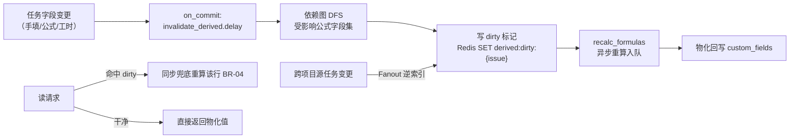
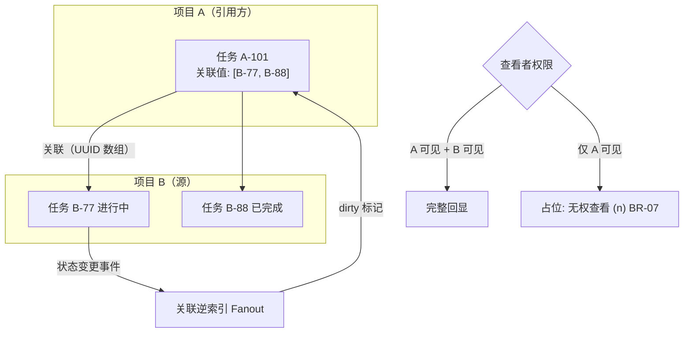

# 公式 / 级联 / 跨项目关联字段

| 元信息项 | 内容 |
| --- | --- |
| 文档编号 | TASK-014 |
| 所属迭代 | P4：远期增强（第 13 周起，签约驱动排期） |
| 优先级 | P4（企业版增强 / 研发效能价值线） |
| 所属模块 | M4-TASK 任务核心 |
| 文档状态 | 待评审（Draft） |
| 最后更新日期 | 2026-09-01 |
| 上游依据 | `docs/需求文档.md` §3.3 任务管理节、§8.2 P4 列（任务行） |
| 前置依赖 | `TASK-012`（高级自定义字段四类型 + 字段级权限，全部就绪）、`TASK-008`（自定义字段基座：JSONB+GIN、Schema API、FilterCompiler）、`PROJ-004`（跨项目关联的项目集上下文） |
| 下游依赖 | `RPT-005`（大屏消费公式列聚合）、`AI-001`（公式字段作为特征） |
| 架构基线 | [`dynamic-fields-design.md`](../architecture/dynamic-fields-design.md) 全文、[`api-conventions.md`](../architecture/api-conventions.md) §8 |
| 竞品参考 | Jira（ScriptRunner 脚本字段）、Notion（Formula 2.0）、飞书多维表格（公式 + 关联 + 级联三件套） |

> **范围声明**：本文档在 `TASK-008/012` 的字段基座上交付三个 P4 字段类型——**公式字段**（受限 DSL 求值，结果物化缓存）、**多级级联字段**（N 级选项树，TASK-012 二级级联的扩展）、**跨项目关联字段**（引用他项目任务并回显属性）。不含字段值的版本历史（归 `TASK-015` 基线体系）。

---

## 1. 概述

### 1.1 功能定位

企业客户的字段需求最终会撞上「值要从别的值算出来」：

| 客户原声 | 对应能力 |
| --- | --- |
| 「工时偏差 = 实际工时 - 预估工时，不用每次手算导出 Excel」 | 公式字段 |
| 「省 → 市 → 区三级联动，两级不够用」 | 多级级联 |
| 「这条客户需求关联到研发项目的哪几个任务？进度直接带过来」 | 跨项目关联 + 属性回显 |

三个类型的共同技术命题是**派生数据的一致性**：公式值随依赖变化而重算、回显值随源任务变化而刷新。本文档的核心设计是统一的「派生字段失效传播」框架（§4.3），而非三个孤立实现。

### 1.2 启动条件

| 条件 | 判定 |
| --- | --- |
| 商业条件 | ≥ 3 家付费客户在需求池为该能力投票（需求文档 §9.2 第 5 条），或签约合同明确列入 |
| 技术前置 | `TASK-012` 高级字段生产稳定 ≥ 60 天；FilterCompiler 支持 `cf_` JSONB 路径查询无性能事故 |
| 选型前置 | 公式 DSL 选型评审通过：自研受限表达式（本方案）vs 内嵌 Lua/JS 沙箱（否决：安全与维护成本，§6） |

### 1.3 独立交付判定

1. 三类字段各在演示项目配置并联动：改预估工时 → 公式列实时重算；三级级联筛选可用；跨项目回显随源任务状态变更 5s 内刷新。
2. 1 万任务 × 5 个公式字段的全量重算 < 3 min（后台任务），增量重算 P95 < 300ms。
3. 零回归：未配置三类字段的项目序列化路径与企业版 V1.0 字节级一致（契约快照比对）。
4. 公式 DSL 安全评审：无沙箱逃逸面（纯解析求值，不 eval），恶意公式（深嵌套/大指数）被复杂度上限拦截。

### 1.4 目标用户

| 用户 | 场景 | 关注点 |
| --- | --- | --- |
| PMO | 跨项目需求-研发联动跟踪 | 回显值可信（与源一致）、刷新及时 |
| 研发 Lead | 迭代内自动算工时偏差、剩余工作量 | 公式可自定义、出错有提示 |
| 字段管理员 | 配置三级以上级联（区域/产品线/模块） | 选项树可批量导入（CSV） |

### 1.5 竞品参考结论（详见第 6 章）

- **飞书多维表格**：公式 + 关联 + 级联体验标杆；公式列即时重算，关联列支持「引用回显」（lookup）。
- **Notion Formula 2.0**：图灵完备倾向的表达式语言，强大但社区抱怨调试困难。
- **Jira ScriptRunner**：Groovy 脚本字段——能力无上限但成为性能与安全黑洞（客户脚本拖垮实例案例众多）。
- **本系统取舍**：表达式能力对齐飞书（60+ 函数白名单），**明确拒绝** ScriptRunner 式代码执行；重算策略为「同步失效标记 + 异步重算 + 读时兜底」，避免 Notion 式大表即时重算卡顿。

---

## 2. 业务逻辑

### 2.1 三类字段定义

| 类型 | `field_type` | 定义载体（`CustomFieldDefinition.config` 扩展） | 值存储 |
| --- | --- | --- | --- |
| 公式 | `formula` | `{"expression": "subtract(prop('实际工时'), prop('预估工时'))", "result_type": "number", "precision": 2}` | **物化**：重算后写入 `custom_fields` JSONB（与手填值同位），另存 `formula_meta` |
| 多级级联 | `cascade_multi` | `{"levels": 3, "options_tree": [{v, label, children: [...]}]}` | 数组 `["华东","杭州","西湖区"]`，各级同层级校验 |
| 跨项目关联 | `relation_xproject` | `{"target_project_ids": [...], "display_props": ["state","assignees"], "multiple": true}` | 目标任务 UUID 数组；回显值不存储（读时 join + 5s 缓存） |

### 2.2 业务规则（BR）

| 编号 | 规则 | 说明 |
| --- | --- | --- |
| BR-01 | 公式只读 | 公式字段不接受写入（`PATCH` 含公式键 → `VALIDATION_CUSTOM_FIELD_INVALID`，子码 `READ_ONLY`） |
| BR-02 | 依赖图无环 | 公式 A 引用公式 B 引用公式 A → 保存时环检测拒绝（`RESOURCE_CIRCULAR_DEPENDENCY`，`details` 给环路径） |
| BR-03 | 复杂度上限 | 表达式 AST 节点数 ≤ 200、嵌套深度 ≤ 10、引用字段数 ≤ 20；超限保存拒绝 |
| BR-04 | 重算最终一致 | 依赖变更后公式值**异步**重算（P95 < 300ms 入队，秒级完成）；读请求命中未重算标记时同步兜底重算该单行 |
| BR-05 | 错误值显式 | 求值失败（除零/类型不符/引用被删）值置为 `null` 且 `formula_meta.error` 记录原因；UI 显示 `—` 悬停见原因，**不阻断**任务保存 |
| BR-06 | 级联层级完整 | 级联值数组长度必须 ≤ 配置 levels 且逐层存在于 options_tree；父级选项删除时子级值自动失效（置 null + Activity 记录） |
| BR-07 | 跨项目权限双向 | 关联字段可选范围 = 当前用户**可见**的目标项目任务；回显同样受权限过滤（无权项目显示 `无权查看` 占位，不泄露标题） |
| BR-08 | 关联不联锁 | 跨项目关联仅引用：源任务删除/归档时关联值自动清理（删除）或标记（归档），不阻止源操作、不产生级联写 |
| BR-09 | 批量导入校验 | options_tree 支持 CSV 导入（≤ 5,000 节点），导入走干跑预览（重复/环/超深检测） |
| BR-10 | 筛选一致性 | 公式字段可筛选可排序（走物化值 + 表达式索引复用 `TASK-008` 机制）；回显属性可筛选（编译为目标项目子查询） |
| BR-11 | 字段权限继承 | 三类字段同样受 `TASK-012` 字段级权限约束（隐藏角色看不到公式列与回显列） |
| BR-12 | 审计 | 公式定义变更、级联树变更、关联目标项目变更均产生 Activity + `AuditLog` |

### 2.3 公式 DSL 规范

| 类别 | 函数/语法 | 示例 |
| --- | --- | --- |
| 引用 | `prop('字段名')`、`prop_cf('property_id')` | `prop('priority')` |
| 算术 | `+ - * / %` `subtract(a,b)` `round(x,n)` | `round(prop_cf('p1')/prop_cf('p2')*100, 1)` |
| 逻辑 | `if(cond, then, else)` `and or not` 比较符 | `if(gt(prop_cf('p1'), 8), '超期', '正常')` |
| 日期 | `days_between(a,b)` `now()` `date_add(d, n)` | `days_between(now(), prop('due_date'))` |
| 聚合（子任务） | `sub_count()` `sub_done_count()` `sub_sum('prop')` | `sub_sum('estimate_minutes')` |
| 文本 | `concat(...)` `upper/lower` `len` | `concat(prop('name'), '-v2')` |

| 约束 | 说明 |
| --- | --- |
| 类型系统 | `number / text / boolean / date / null` 五型；隐式转换仅限 number→text、date→text；其余类型不符即求值错误（BR-05） |
| 白名单 | 仅上表函数；标识符仅 `prop/prop_cf/sub_*`；无变量、无循环、无函数定义（刻意非图灵完备，§1.6） |
| `result_type` | 保存时静态推断并与声明比对，不符拒绝（如声明 number 但表达式可能返回 text） |
| 工时/金钱 | 提供 `minutes(n)` 与 `hours(n)` 字面量构造器，避免裸数字歧义 |

### 2.4 失效传播框架



| 步骤 | 说明 |
| --- | --- |
| 依赖图 | 从全部公式字段定义静态解析 `prop/prop_cf` 引用，构建「被引用键 → 公式字段」逆索引（Redis，Schema 变更时重建） |
| 失效粒度 | 行级（单任务）；跨项目关联回显的失效以「关联逆索引」定位引用方任务集 |
| 风暴防护 | 批量操作（`BOARD-004`）一次变更 100 行 → 合并为单个重算任务批；同一任务 5s 内多次失效去重（Redis SETNX） |

### 2.5 跨项目关联与回显



| 行为 | 规则 |
| --- | --- |
| 可选范围 | 目标项目集 = `config.target_project_ids` ∩ 当前用户可见项目（BR-07）；选择器走目标项目 `TASK-003` 列表接口（只读视图） |
| 回显属性 | `display_props` 白名单：`state / priority / due_date / assignees / progress`；读时 `SELECT … WHERE id = ANY(关联值)` + 权限过滤 + 5s Redis 缓存 |
| 源变更处理 | 源任务删除 → 引用方关联值清理（Activity 记录「关联已移除：源任务被删除」）；源归档 → 回显带 `已归档` 徽标但保留（BR-08） |
| 反向视图 | 目标任务详情页展示「被引用」面板（来自哪些项目哪些任务），助 PMO 双向追踪 |
| 权限裁剪 | 引用方可见、源不可见 → 回显占位 `无权查看 (n)`；两侧均可见才显示完整属性 |

---

## 3. UI/UX 设计

### 3.1 页面与组件清单

| 组件 | 位置 | 核心任务 |
| --- | --- | --- |
| 公式编辑器 | 字段配置抽屉（新建/编辑公式字段） | 表达式输入、函数自动补全、实时校验、预览求值 |
| 级联树编辑器 | 字段配置抽屉 | 树形编辑、拖拽调序、CSV 导入、干跑预览 |
| 关联选择器 | 任务详情 / 行内编辑 | 跨项目搜索选择、回显展示、无权占位 |
| 公式列渲染 | 列表/看板卡/甘特侧栏 | 物化值展示 + 错误态 `—`（悬停原因）+ 重算中骨架 |

### 3.2 公式编辑器线框

```
┌──────────────────────────────────────────────────────────────────┐
│ 新建字段 · 公式                                        [取消][保存]│
├──────────────────────────────────────────────────────────────────┤
│ 字段名称: [工时偏差___________]   结果类型: [数值▾]  小数: [2▾]    │
│                                                                  │
│ 表达式:                                                          │
│ ┌──────────────────────────────────────────────────────────────┐ │
│ │ subtract( prop_cf('实际工时'), prop_cf('预估工时') )          │ │
│ │                                                              │ │
│ └──────────────────────────────────────────────────────────────┘ │
│ 函数: [subtract▾] [if] [days_between] [sub_sum] [round] …(60+)   │
│ 引用: [预估工时] [实际工时] [优先级] [截止日期] [子任务]          │
│                                                                  │
│ ✓ 语法正确 · 引用 2 个字段 · 复杂度 7/200                         │
│ ── 预览（对最近 5 条任务求值）───────────────────────────────     │
│  TASK-101  需求评审流程     实际 480 - 预估 360  = 120           │
│  TASK-102  支付对账         实际 240 - 预估 240  = 0             │
│  TASK-103  首页改版         实际  -  预估 600    = — (实际工时未填)│
└──────────────────────────────────────────────────────────────────┘
```

### 3.3 级联值与关联回显线框

```
任务详情 · 字段区
┌────────────────────────────────────────────────────────┐
│ 所属区域:  华东 / 杭州 / 西湖区            [✎ 修改]     │
│  (级联选择器: 三级下拉联动，末级可选「待定」)             │
├────────────────────────────────────────────────────────┤
│ 关联研发任务 (跨项目·电商平台):                          │
│  ┌──────────────────────────────────────────────────┐  │
│  │ ● ECOM-231  下单链路重构      进行中 · 张三点     │  │
│  │ ○ ECOM-245  库存扣减优化      未开始 · 9/15 截止  │  │
│  │ 🔒 无权查看 (1)                                    │  │
│  └──────────────────────────────────────────────────┘  │
│  [+ 添加关联]                                           │
├────────────────────────────────────────────────────────┤
│ 工时偏差 (公式): 120 分钟                                │
│ 交付健康度 (公式): —  ⚠ 悬停: 实际工时未填写              │
└────────────────────────────────────────────────────────┘
```

### 3.4 交互规则

| 场景 | 交互 |
| --- | --- |
| 公式实时校验 | 输入停顿 400ms 后服务端 `validate_expression`（语法 + 类型 + 复杂度 + 环检测），错误行内红字 |
| 重算中态 | 依赖刚变更时公式列显示骨架条（≤ 3s）；超时未刷新自动回退同步兜底（BR-04） |
| 级联选择器 | 逐级下拉，选择上级后下级清空重选；支持搜索（树内 label 模糊） |
| 关联选择器 | 弹层内 Tab 切换目标项目，搜索走服务端（标题/编号），已选项置顶可移除 |
| CSV 导入 | 上传 → 干跑预览（新增/重复/超深分行标色）→ 确认导入（BR-09） |
| 权限 | 字段创建/编辑 `issue.custom_field.manage`（PROJ_ADMIN+）；跨项目关联目标配置需操作者在目标项目至少 VIEWER |

---

## 4. 技术架构

### 4.1 定义扩展与物化存储

`CustomFieldDefinition`（`TASK-008` 既有表）零新列——三类型复用 `field_type` 枚举扩展 + `config` JSONB：

```python
# apps/api/rp_issues/formula.py
FORMULA_COMPLEXITY_LIMIT = {"ast_nodes": 200, "depth": 10, "refs": 20}  # BR-03


class FormulaDefinition:
    """config 子结构：
    {"expression": "...", "result_type": "number", "precision": 2,
     "compiled": "<AST 序列化>", "refs": ["estimate_minutes", "cf:p1"]}
    """


class CascadeMultiConfig:
    """{"levels": 3, "options_tree": [
        {"value": "hd", "label": "华东", "children": [
            {"value": "hz", "label": "杭州", "children": [
                {"value": "xh", "label": "西湖区", "children": []}]}]}]}
    节点总数 ≤ 5,000；深度 = levels ≤ 5。
    """


class XProjectRelationConfig:
    """{"target_project_ids": ["..."], "multiple": true,
        "display_props": ["state", "assignees"], "max_links": 50}
    """
```

| 存储决策 | 说明 |
| --- | --- |
| 公式物化 | 重算结果写入 `Issue.custom_fields["cf_<property_id>"]`（与手填值同位），FilterCompiler 零改造即可筛选/排序（BR-10）；`custom_fields_meta.formula.<property_id> = {"dirty": bool, "error": str|null, "computed_at": ts}` 存于新增的 `Issue.custom_fields_meta` JSONB 列（AddField，默认 `{}`） |
| 级联值 | 数组存 `custom_fields`，校验逐层落树（BR-06） |
| 关联值 | UUID 数组存 `custom_fields`；**回显不物化**（读时 join + 缓存，§2.5） |

### 4.2 表达式求值器

### 4.2.0 函数目录（62 个，白名单全集）

| 类别 | 函数 | 签名与返回 |
| --- | --- | --- |
| 算术（10） | `add/subtract/multiply/divide/mod` `round(x,n)` `abs` `min` `max` `pow` | `(number,…) → number`；`divide` 除零抛 FormulaError |
| 逻辑（9） | `if(cond,a,b)` `and/or/not` `gt/gte/lt/lte/eq/neq` | `→ boolean`；比较跨型抛错（日期可与日期比） |
| 日期（9） | `now()` `today()` `days_between(a,b)` `date_add(d,n)` `date_sub(d,n)` `year/month/day(d)` `weekday(d)` | 日期运算时区按项目时区 |
| 文本（10） | `concat(…)` `upper/lower` `len` `trim` `substring(s,a,b)` `replace(s,f,t)` `contains(s,sub)` `starts_with/ends_with` | `→ text/boolean/number` |
| 聚合-子任务（6） | `sub_count()` `sub_done_count()` `sub_sum(prop)` `sub_avg(prop)` `sub_min/sub_max(prop)` | 仅一层子任务（不递归孙子，防深树扫描） |
| 空值（4） | `coalesce(a,b,…)` `is_null(x)` `if_null(a,b)` `null()` | 显式空值语义，避免隐式 0 歧义 |
| 构造（4） | `minutes(n)` `hours(n)` `date(y,m,d)` `number(x)` `text(x)` | 字面量与显式转型（§2.3 隐式转换白名单外强制显式） |
| 列表（5，枚举/多选字段） | `list_len(l)` `list_contains(l,v)` `list_any(l)` `list_join(l,sep)` `list_first(l)` | 作用于多选枚举与关联字段值 |
| 工作日志（5） | `worklog_sum()` `worklog_estimate()` `worklog_remaining()` `worklog_ratio()` `estimate_minutes()` | 复用 `TASK-006` 数据；`ratio=sum/estimate` 除零安全（estimate=0 → null） |

> 目录冻结策略：新增函数走 minor 版本增补并更新本表；**永不**引入 `eval`/`fetch`/`user_defined` 类函数（§1.6 安全红线）。

```python
# apps/api/rp_issues/formula_eval.py
from dataclasses import dataclass
import ast as pyast  # 仅借鉴接口风格；实际为自研递归下降解析器


class FormulaError(Exception):
    pass


@dataclass
class EvalContext:
    issue: "Issue"
    props: dict          # 已解析的 prop/prop_cf 值快照
    sub_stats: dict      # 子任务聚合预取（sub_sum 等）


ALLOWED_FUNCS = {  # 白名单（BR：非图灵完备）
    "subtract", "round", "if", "and", "or", "not", "gt", "lt", "gte", "lte",
    "eq", "neq", "days_between", "now", "date_add", "concat", "upper",
    "lower", "len", "sub_count", "sub_done_count", "sub_sum",
    "minutes", "hours", "abs", "min", "max", "coalesce",  # …共 62 个
}


def compile_expression(src: str) -> "AST":
    """解析 → 白名单校验 → 复杂度计量（BR-03）→ 静态类型推断。"""
    tree = Parser(src).parse()
    ComplexityChecker(FORMULA_COMPLEXITY_LIMIT).visit(tree)
    TypeChecker.visit(tree)          # 推断 result_type，不符声明则抛
    return tree


def evaluate(tree: "AST", ctx: EvalContext):
    """纯函数求值；任何异常 → FormulaError（BR-05 值置 null + 记因）。"""
    try:
        return tree.eval(ctx)
    except (FormulaError, ZeroDivisionError, TypeError) as exc:
        raise FormulaError(str(exc)) from exc
```

### 4.3 重算任务（Celery）

```python
# apps/api/rp_issues/tasks_derived.py
from celery import shared_task
from django.db import transaction


@shared_task(queue="derived", rate_limit="200/m")
def recalc_formulas(issue_ids: list[str], field_ids: list[str]) -> None:
    """批量重算；幂等——重复执行结果相同（物化值由输入唯一决定）。"""
    issues = Issue.objects.filter(id__in=issue_ids).select_related("project")
    defs = CustomFieldDefinition.objects.filter(
        id__in=field_ids, field_type="formula")
    with transaction.atomic():
        for issue in issues:
            ctx = EvalContext.build(issue)
            for d in defs:
                try:
                    value = evaluate(d.config["compiled"], ctx)
                    err = None
                except FormulaError as exc:
                    value, err = None, str(exc)          # BR-05
                issue.custom_fields[f"cf_{d.id}"] = value
                issue.custom_fields_meta.setdefault("formula", {})[str(d.id)] = {
                    "dirty": False, "error": err,
                    "computed_at": timezone.now().isoformat()}
            issue.save(update_fields=["custom_fields",
                                      "custom_fields_meta", "updated_at"])


@shared_task(queue="derived")
def invalidate_derived(issue_id: str, changed_keys: list[str]) -> None:
    """变更扇出：逆索引找受影响公式 → 标 dirty → 合并入队（BR-04）。"""
    affected = DerivedIndex.fields_for(changed_keys)      # Redis 逆索引
    if not affected:
        return
    cache.set(f"derived:dirty:{issue_id}", list(affected), timeout=3600)
    cache.sadd(f"derived:queue:{affected[0].project_id}", issue_id)
    recalc_formulas.apply_async(
        args=[[issue_id], [str(f.id) for f in affected]],
        countdown=0.3)                                    # 合并窗口去抖
```

| 要点 | 说明 |
| --- | --- |
| 派发纪律 | `invalidate_derived` 一律由任务更新服务 `transaction.on_commit` 挂接（与 Activity 同点） |
| 队列隔离 | `derived` 队列独立，避免公式风暴阻塞通知/审计管道 |
| 全量重建 | Schema 变更（新增公式/改表达式）触发 `recalc_project_formulas.delay(project_id)`，分批 500 行，1 万行 < 3 min |
| 批量合并 | `BOARD-004` 批量端点在循环外收集 changed_keys，一次派发一批（§2.4 风暴防护） |

### 4.4 API 端点

| 方法 | 路径 | 说明 |
| --- | --- | --- |
| POST | `/api/v1/projects/{pid}/custom-fields/validate-expression/` | 表达式实时校验（语法/类型/复杂度/环） |
| POST | `/api/v1/projects/{pid}/custom-fields/preview-expression/` | 对最近 5 条任务求值预览 |
| POST | `/api/v1/projects/{pid}/custom-fields/{id}/import-options/` | 级联树 CSV 导入（`{"dry_run": true}` 预览） |
| GET | `/api/v1/projects/{pid}/issues/{id}/relation-echo/` | 跨项目关联回显（权限过滤后） |
| GET | `/api/v1/projects/{pid}/issues/{id}/referenced-by/` | 反向被引用面板 |

**成功示例** — `POST …/validate-expression/`：

```json
{
  "status": "success",
  "data": {
    "valid": true,
    "result_type": "number",
    "complexity": {"ast_nodes": 7, "depth": 2, "refs": 2},
    "refs": ["cf:01J6X8…estimate", "cf:01J6X8…actual"]
  },
  "meta": {"request_id": "01J6ZT8F3NQW7PYVTB2H5KD9EA"}
}
```

**错误示例** — 公式成环（BR-02）：

```json
{
  "status": "error",
  "error": {
    "code": "RESOURCE_CIRCULAR_DEPENDENCY",
    "message": "公式字段存在循环引用",
    "details": [{"field": "expression", "code": "INVALID",
                 "message": "环路径: 工时偏差 → 交付健康度 → 工时偏差"}]
  },
  "meta": {"request_id": "01J6ZT9G4ORX8QZWUC3J6LE0FB"}
}
```

**错误示例** — 写入只读公式字段（BR-01）：

```json
{
  "status": "error",
  "error": {
    "code": "VALIDATION_CUSTOM_FIELD_INVALID",
    "message": "公式字段不接受写入",
    "details": [{"field": "property.01J6X8K2…", "code": "READ_ONLY",
                 "message": "字段「工时偏差」为公式字段，值由系统计算"}]
  },
  "meta": {"request_id": "01J6ZT0H5PSY9RA1VD4K7MF1GC"}
}
```

### 4.5 前端 Store 与组件

```typescript
// apps/web/src/modules/custom-fields/formula-editor.store.ts
import { makeAutoObservable, runInAction } from "mobx";

export class FormulaEditorStore {
  expression = "";
  validation: IExpressionValidation | null = null;
  previewRows: IPreviewRow[] = [];
  private debounceTimer: number | null = null;

  constructor(private projectId: string) { makeAutoObservable(this); }

  setExpression(src: string) {
    this.expression = src;
    if (this.debounceTimer) window.clearTimeout(this.debounceTimer);
    this.debounceTimer = window.setTimeout(() => this.validate(), 400);
  }

  async validate() {
    try {
      const res = await customFieldService.validateExpression(
        this.projectId, this.expression);
      runInAction(() => { this.validation = res.data; });
      if (res.data.valid) await this.loadPreview();
    } catch (e) {
      runInAction(() => { this.validation = errorToValidation(e); });
    }
  }

  get canSave(): boolean {
    return !!this.validation?.valid && !this.validation.cycle;
  }
}
```

| 组件规则 | 说明 |
| --- | --- |
| 公式列渲染 | 读 `custom_fields_meta.formula[id].dirty`：true → 骨架条 + 触发单行刷新轮询（≤3s）；error → `—` + Tooltip |
| 关联选择器 | 复用 `TASK-003` 列表 Store 的只读模式，`targetProjectIds` 切换时重建 fetcher |
| SWR 键 | `ISSUE_RELATION_ECHO(issueId)` 5s  stale-while-revalidate（与服务端缓存同周期） |

### 4.6 性能与规模

| 指标 | 预算 | 手段 |
| --- | --- | --- |
| 单行增量重算 | P95 < 300ms 入队，< 2s 完成 | 行级失效 + 去抖合并 |
| 全量重建 | 1 万行 × 5 公式 < 3 min | 分批 500 + `bulk_update` |
| 公式筛选 | 与手填字段同性能 | 物化值 + `TASK-008` 表达式索引（CONCURRENTLY，10 个/项目上限含公式） |
| 回显查询 | P95 < 150ms | `id = ANY()` 主键查 + 5s Redis 缓存 + 权限预过滤 |
| 级联树加载 | 5,000 节点 < 200ms | Schema API ETag 缓存（`TASK-008` 既有机制）整树下发 |

---

## 5. 测试用例

### 5.1 单元测试（UT）

| 编号 | 用例 | 断言 |
| --- | --- | --- |
| UT-01 | 四则与优先级 | `1+2*3=7`、`(1+2)*3=9` |
| UT-02 | 类型推断 | 声明 number 但表达式返 text → 保存拒绝 |
| UT-03 | 除零 | 值置 null，`formula_meta.error` 含 `division by zero`，任务可正常保存 |
| UT-04 | 引用被删字段 | 求值错误置 null + 记因；UI 数据含错误标记 |
| UT-05 | 环检测 | A→B→A 保存拒绝 `RESOURCE_CIRCULAR_DEPENDENCY`，details 含环路径 |
| UT-06 | 复杂度上限 | 201 AST 节点拒绝；深嵌套 11 层拒绝 |
| UT-07 | 公式只读 | PATCH 写公式键返回子码 `READ_ONLY` |
| UT-08 | 级联层级校验 | 值数组含树中不存在的节点 → `VALIDATION_CUSTOM_FIELD_INVALID` |
| UT-09 | 父级删除子级失效 | 删除「杭州」后值 `["华东","杭州"]` 自动置 null + Activity |
| UT-10 | 关联权限过滤 | 目标项目无权限任务不出现在可选列表与回显 |
| UT-11 | 源删除清理 | 源任务删除后引用方关联值移除且 Activity 记录 |
| UT-12 | 失效去重 | 同行 5s 内 3 次变更仅 1 次重算任务 |

### 5.2 集成测试（IT）

| 编号 | 用例 | 断言 |
| --- | --- | --- |
| IT-01 | 改预估工时 → 公式刷新 | 5s 内物化值更新；期间读请求走同步兜底返回新值 |
| IT-02 | 批量操作风暴 | 100 行批量改优先级（公式引用）→ 重算任务 ≤ 2 个，全部完成 < 10s |
| IT-03 | 全量重建 | 新增公式字段后 1 万行重建 < 3 min，期间旧列读不受影响 |
| IT-04 | 跨项目回显刷新 | 源任务改状态 → 5s 后引用方回显为新状态 |
| IT-05 | 公式筛选排序 | FilterCompiler `cf_<id> >= 100` 命中正确；排序走表达式索引（EXPLAIN 验证） |
| IT-06 | CSV 导入干跑 | 含重复/超深行的 CSV 干跑预览逐行标色，确认后库中树正确 |

### 5.3 E2E 测试

| 编号 | 场景 | 验收 |
| --- | --- | --- |
| E2E-01 | 公式配置全链路 | 编辑器输入 → 实时校验绿 → 预览 5 行正确 → 保存 → 列表列显示 → 改依赖值 → 列自动刷新 |
| E2E-02 | 三级级联 | 建树 → 任务选三级 → 筛选该级 → 命中正确 |
| E2E-03 | 跨项目关联 | A 项目任务关联 B 项目 2 任务 → 回显状态正确 → B 中改状态 → A 回显刷新 → 无权限用户见占位 |

---

## 6. 竞品深度对标

| 维度 | 飞书多维表格 | Notion Formula 2.0 | Jira ScriptRunner | 本系统 |
| --- | --- | --- | --- | --- |
| 表达式能力 | 60+ 函数，业务导向 | 接近图灵完备 | Groovy 全语言 | 62 函数白名单，非图灵完备 |
| 执行模型 | 即时重算（大表卡顿口碑差） | 即时重算 | JVM 脚本执行 | 异步物化 + 读时兜底 |
| 安全面 | 解析求值 | 解析求值 | **代码执行，逃逸事故史** | 解析求值 + 复杂度上限 + 环检测 |
| 关联回显 | lookup 字段（仅同表/关联表） | relation + rollup | 无原生 | 跨项目 + 权限双向过滤 |
| 级联 | 单选分组（非真正级联） | 无 | 插件（Elements Connect） | 原生 N 级树 + CSV 导入 |

**结论**：ScriptRunner 证明了「代码级字段」在企业 SaaS 是灾难（性能、安全、升级兼容性三连），本系统明确不跟进；飞书的函数面与体验是上限参照，但其即时重算在大数据量下的卡顿恰是本系统「异步物化 + 读时兜底」架构要规避的——物化还让筛选/排序/报表聚合零成本复用既有管线，这是本方案的最大架构红利。

---

## 7. 里程碑与验收

### 7.1 工作量估算

| 交付面 | 内容 | 估算 |
| --- | --- | --- |
| DSL 核心 | 解析器、类型系统、求值器、62 函数库、复杂度/环检测 | 5 d |
| 后端 | 失效传播框架、重算任务、三类型校验、回显与反向视图、5 端点 | 5 d |
| 前端 | 公式编辑器、级联树编辑器、关联选择器、列渲染 | 5 d |
| 测试 | UT-01~12、IT-01~06、E2E-01~03 | 3 d |
| **合计** | | **18 d（2-3 人并行约 2 周）** |

### 7.2 可操作演示的验收标准

1. 公式闭环：配置「工时偏差」→ 列表显示 → 修改实际工时 → 5s 内列刷新；除零公式显示 `—` 且悬停见原因，任务保存不被阻断。
2. 环与上限：构造 A↔B 环保存被拒且提示环路径；201 节点表达式保存被拒。
3. 级联：三级联动选择与筛选正确；删除中间级选项后存量值自动失效并有 Activity。
4. 跨项目：双向权限矩阵（可见/不可见 × 引用方/源）四象限行为与 §2.5 表一致；源删除自动清理。
5. 性能：IT-02/IT-03 指标达标；公式筛选 EXPLAIN 走索引。
6. 零回归：无三类字段项目序列化快照与企业版 V1.0 一致。
