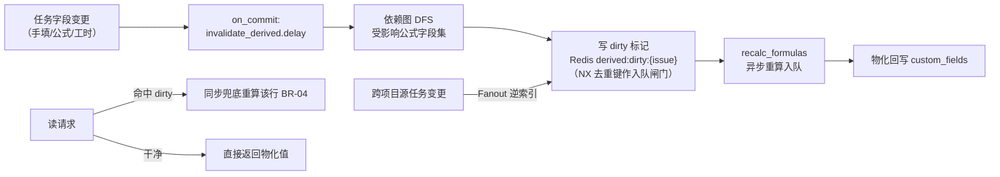
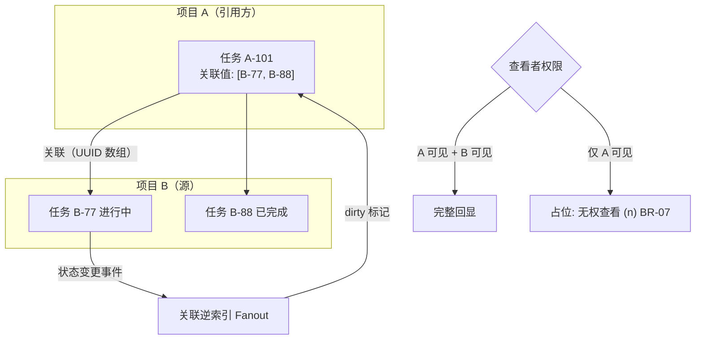

# 公式 / 级联 / 跨项目关联字段

| 元信息项 | 内容 |
| --- | --- |
| 文档编号 | TASK-014 |
| 所属迭代 | P4：远期增强（第 13 周起，签约驱动排期） |
| 优先级 | P4（企业版增强 / 研发效能价值线） |
| 所属模块 | M4-TASK 任务核心 |
| 文档状态 | 待评审（R1 修复稿） |
| 最后更新日期 | 2026-09-06 |
| 修复摘要 | 2026-09-05 落实 R1 评审 10 项：公式定义改用 `formula` 预留列、级联/关联配置归位 `cascade_config`（删除不存在的 `config` JSONB 载体表述，零新列成立）；端点补齐 `/api/v1/workspaces/{slug}/` 层级并改挂 `issue-properties/` 冻结基线（TASK-008 §4.2），5 端点补全契约、权限与错误码；`cf_<uuid>` 全文更正为 `cf_<field_key>` 命名规范；`due_date` → `target_date`；权限码更正 `issue.field.manage`（rbac §8.2 实读核实）；级联值改存选项 `value`；表达式索引上限对齐工作空间口径（TASK-008 BR-10，10 个/工作空间）；删除 `custom_fields_meta` 新列方案，改用 `custom_fields._meta` 预留系统键（dynamic-fields §2.4）；relation-echo 缓存键补工作空间 + 用户域隔离；修正 §1.6 幽灵引用（→ §1.5/§1.3）、函数计数漂移（64 个）、四象限计数与 SETNX 代码语义（`cache.add` NX 占位）；2026-09-06 R2 复评 PASS 随手收口（1 MAJOR + 4 MINOR + 3 INFO）：补 dirty 标记生命周期闭环——Issue 序列化时 Redis `derived:dirty:{issue}` 命中即将 `_meta.formula[<key>].dirty` 以响应态置 true 下发（不落库）、同步兜底与异步重算回写后清除该 Redis 键（§4.3 要点表 + §4.1/§3.4/§4.5 挂钩，IT-01 断言改「5s 内读请求返回新值（物化或兜底）」）；重算路径补 `select_for_update` 行锁防读-改-写丢更新；§2.5 补 display_props 配置键→响应键映射（`state_id`→state 名、`assignee_ids`→成员摘要）；BR-08 补 `LIMIT` 子码跨母码复用登记标注（§8.8 `PERM_DENIED` 复用范式）；FormulaDepGraph 循环内取用标注示意（实现批量预取）；validate/preview-expression 补 api-conventions §7 三层限流声明（L3 求值端点 10 请求/分钟）；IT-05 补排序 wire 口径（api-conventions §5.4 参数名 + TASK-008 §4.2.5 cf_ 值语法 + `ordering_fields` 白名单）；预览示例补「节选 3 行」口径 |
| 上游依据 | `docs/需求文档.md` §3.4 任务核心模块、§8.2 分模块优先级全景表 P4 列（任务行：级联/公式/关联字段） |
| 前置依赖 | `TASK-012`（高级自定义字段四类型 + 字段级权限，全部就绪）、`TASK-008`（自定义字段基座：JSONB+GIN、Schema API、FilterCompiler）、`PROJ-004`（跨项目关联的项目集上下文） |
| 下游依赖 | `RPT-005`（大屏消费公式列聚合）、`AI-001`（公式字段作为特征） |
| 架构基线 | [`dynamic-fields-design.md`](../architecture/dynamic-fields-design.md) 全文（§2.4 命名规范与 `_meta` 预留键、§3.1 `formula`/`cascade_config` 预留列、§6.2 表达式索引、§7 P4 行依赖图缓存表）、[`api-conventions.md`](../architecture/api-conventions.md) §4/§8/§13、[`rbac-permission-model.md`](../architecture/rbac-permission-model.md) §8.2（`issue.field.manage`） |
| 竞品参考 | Jira（ScriptRunner 脚本字段）、Notion（Formula 2.0）、飞书多维表格（公式 + 关联 + 级联三件套） |

> **范围声明**：本文档在 `TASK-008/012` 的字段基座上交付三个 P4 字段类型——**公式字段**（受限 DSL 求值，结果物化缓存）、**多级级联字段**（2-5 级选项树，TASK-012 二/三级级联的扩展）、**跨项目关联字段**（引用他项目任务并回显属性）。不含字段值的版本历史（归 `TASK-015` 基线体系）。

---

## 1. 概述

### 1.1 功能定位

企业客户的字段需求最终会撞上「值要从别的值算出来」：

| 客户原声 | 对应能力 |
| --- | --- |
| 「工时偏差 = 实际工时 - 预估工时，不用每次手算导出 Excel」 | 公式字段 |
| 「省 → 市 → 区三级联动，两级不够用」 | 多级级联 |
| 「这条客户需求关联到研发项目的哪几个任务？进度直接带过来」 | 跨项目关联 + 属性回显 |

三个类型的共同技术命题是**派生数据的一致性**：公式值随依赖变化而重算、回显值随源任务变化而刷新。本文档的核心设计是统一的「派生字段失效传播」框架（§2.4，任务落地见 §4.3），而非三个孤立实现。

### 1.2 启动条件

| 条件 | 判定 |
| --- | --- |
| 商业条件 | ≥ 3 家付费客户在需求池为该能力投票（承接需求文档 §9.2 第 5 条「P4 需求统一录入需求池」的启动出口），或签约合同明确列入 |
| 技术前置 | `TASK-012` 高级字段生产稳定 ≥ 60 天；FilterCompiler 支持 `cf_` JSONB 路径查询无性能事故 |
| 选型前置 | 公式 DSL 选型评审通过：自研受限表达式（本方案）vs 内嵌 Lua/JS 沙箱（否决：安全与维护成本，§6） |

### 1.3 独立交付判定

1. 三类字段各在演示项目配置并联动：改预估工时 → 公式列实时重算；三级级联筛选可用；跨项目回显随源任务状态变更 5s 内刷新。
2. 1 万任务 × 5 个公式字段的全量重算 < 3 min（后台任务），增量重算 P95 < 300ms。
3. 零回归：未配置三类字段的项目序列化路径与企业版 V1.0 字节级一致（契约快照比对）。
4. 公式 DSL 安全评审：无沙箱逃逸面（纯解析求值，不 eval），恶意公式（深嵌套/大指数）被复杂度上限拦截。

### 1.4 目标用户

| 用户 | 场景 | 关注点 |
| --- | --- | --- |
| PMO | 跨项目需求-研发联动跟踪 | 回显值可信（与源一致）、刷新及时 |
| 研发 Lead | 迭代内自动算工时偏差、剩余工作量 | 公式可自定义、出错有提示 |
| 字段管理员 | 配置三级以上级联（区域/产品线/模块） | 选项树可批量导入（CSV） |

### 1.5 竞品参考结论（详见第 6 章）

- **飞书多维表格**：公式 + 关联 + 级联体验标杆；公式列即时重算，关联列支持「引用回显」（lookup）。
- **Notion Formula 2.0**：图灵完备倾向的表达式语言，强大但社区抱怨调试困难。
- **Jira ScriptRunner**：Groovy 脚本字段——能力无上限但成为性能与安全黑洞（客户脚本拖垮实例案例众多）。
- **本系统取舍**：表达式能力对齐飞书（60+ 函数白名单），**明确拒绝** ScriptRunner 式代码执行；重算策略为「同步失效标记 + 异步重算 + 读时兜底」，避免 Notion 式大表即时重算卡顿。

---

## 2. 业务逻辑

### 2.1 三类字段定义

| 类型 | `field_type` | 定义载体（全部复用 P2 已建列，零新列） | 值存储 |
| --- | --- | --- | --- |
| 公式 | `formula`（dynamic-fields §3.1 枚举已预留） | `CustomFieldDefinition.formula` 预留列（TextField DSL 源文，P4 启用）：`round(subtract(prop_cf('cf_actual_minutes'), prop_cf('cf_planned_minutes')), 0)`；`result_type` 保存时静态推断（本例 number），无独立声明键 | **物化**：重算后写入 `custom_fields["<field_key>"]`（与手填值同位），计算状态另存 `custom_fields._meta.formula`（§4.1） |
| 多级级联 | `cascade_multi`（本文新增枚举值，枚举即代码、零 DDL） | `cascade_config`（P2 已建列，承 TASK-012 §4.2 `levels` 结构）：`{"levels": [{"name": "省份", "options": [{"label": "浙江省", "value": "zj"}]}, …]}`；2-5 级、整树 ≤ 5,000 节点 | 逐级 `value` 数组 `["hd", "hz", "xh"]`——**存 value 不存 label**（展示时经选项树解析 label，dynamic-fields §2.3 值类型约定），逐级父链校验 |
| 跨项目关联 | `relation_xproject`（本文新增枚举值，零 DDL） | `cascade_config` 关联键位（架构 help_text 键位扩展——架构文档待回改）：`{"target_project_ids": […], "display_props": ["state","priority","target_date","assignees","sub_issues_count"], "multiple": true, "max_links": 50}` | 目标任务 UUID 数组；回显值不存储（读时 join + 查看者域缓存，§2.5） |

> 管理入口白名单递进：`P2_ALLOWED_TYPES`（12 基础类型）→ `P3_ENTERPRISE_TYPES`（TASK-012 四类型）→ `P4_ENTERPRISE_TYPES`（本文三类型），枚举与白名单均为代码常量，零 DDL。

### 2.2 业务规则（BR）

| 编号 | 规则 | 说明 |
| --- | --- | --- |
| BR-01 | 公式只读 | 公式字段不接受写入（`PATCH` 含公式键 → `VALIDATION_CUSTOM_FIELD_INVALID`，子码 `READ_ONLY`——api-conventions §8.8 已登记子码）。与 TASK-012 权限 `readonly` 的静默丢弃（BR-16）不同：公式是计算列，写入即模型错误，显式报错避免「以为保存了」的误导 |
| BR-02 | 依赖图无环 | 公式 A 引用公式 B 引用公式 A → 保存时环检测拒绝（`RESOURCE_CIRCULAR_DEPENDENCY`——复用 api-conventions §8.5 既有码，TASK-005 依赖环同码；字段级子码 `CYCLE`，`details` 给环路径） |
| BR-03 | 复杂度上限 | 表达式 AST 节点数 ≤ 200、嵌套深度 ≤ 10、引用字段数 ≤ 20；超限保存拒绝 |
| BR-04 | 重算最终一致 | 依赖变更后公式值**异步**重算（P95 < 300ms 入队，秒级完成）；读请求命中未重算标记时同步兜底重算该单行 |
| BR-05 | 错误值显式 | 求值失败（除零/类型不符/引用被删）值键不落 `custom_fields`（承 TASK-008「空值不落键」纪律）且 `custom_fields._meta.formula[<field_key>].error` 记录原因；UI 显示 `—` 悬停见原因，**不阻断**任务保存 |
| BR-06 | 级联层级完整 | 级联值数组长度必须 = 配置 levels、逐级 `value` 存在于对应层级选项且父链连续（承 TASK-012 级联值语义：不允许跳级）；父级选项删除时子级值自动失效（删键 + Activity 记录） |
| BR-07 | 跨项目权限双向 | 关联字段可选范围 = 当前用户**可见**的目标项目任务；回显同样受权限过滤（无权项目显示 `无权查看` 占位，不泄露标题） |
| BR-08 | 关联不联锁 | 跨项目关联仅引用：源任务删除/归档时关联值自动清理（删除）或标记（归档），不阻止源操作、不产生级联写；关联数上限 `max_links`（默认 50，超限 `400 VALIDATION_CUSTOM_FIELD_INVALID` + `LIMIT`——子码跨母码复用登记：§8.8 将 `LIMIT` 登记为 `RESOURCE_LIMIT_EXCEEDED` 字段级子码（TASK-005/007），此处按关联数上限值域校验场景复用于 `VALIDATION_CUSTOM_FIELD_INVALID`，同 §8.8 `PERM_DENIED` 复用范式）。对比：P3 同项目 `relation` 源删除置灰保留（TASK-012 BR-14）；跨项目类型选择清理——置灰渲染依赖跨项目读权限不可假定常在，且 Activity 留痕可溯 |
| BR-09 | 批量导入校验 | 级联选项树（`cascade_config.levels`）支持 CSV 导入（≤ 5,000 节点，超限 `409 RESOURCE_LIMIT_EXCEEDED` + `LIMIT`），导入走干跑预览（重复/环/超深检测） |
| BR-10 | 筛选一致性 | 公式字段可筛选可排序（走物化值 + 表达式索引复用 `TASK-008` 机制）；回显属性可筛选（编译为目标项目子查询） |
| BR-11 | 字段权限继承 | 三类字段同样受 `TASK-012` 字段级权限约束（隐藏角色看不到公式列与回显列）；**权限随依赖传递**——公式引用链上存在对某角色 `hidden` 的字段 → 该公式列对该角色同样按 `hidden` 处理（序列化剔除口径一致，防经派生值侧信道泄露） |
| BR-12 | 审计 | 公式定义变更、级联树变更、关联目标项目变更均产生 Activity + `AuditLog` |

### 2.3 公式 DSL 规范

| 类别 | 函数/语法 | 示例 |
| --- | --- | --- |
| 引用 | `prop('字段名')`、`prop_cf('cf_<field_key>')` | `prop('priority')`、`prop_cf('cf_actual_minutes')` |
| 算术 | `+ - * / %` `subtract(a,b)` `round(x,n)` | `round(prop_cf('p1')/prop_cf('p2')*100, 1)` |
| 逻辑 | `if(cond, then, else)` `and or not` 比较符 | `if(gt(prop_cf('p1'), 8), '超期', '正常')` |
| 日期 | `days_between(a,b)` `now()` `date_add(d, n)` | `days_between(now(), prop('target_date'))` |
| 聚合（子任务） | `sub_count()` `sub_done_count()` `sub_sum('prop')` | `sub_sum('estimate_minutes')` |
| 文本 | `concat(...)` `upper/lower` `len` | `concat(prop('name'), '-v2')` |

| 约束 | 说明 |
| --- | --- |
| 类型系统 | `number / text / boolean / date / null` 五型；隐式转换仅限 number→text、date→text；其余类型不符即求值错误（BR-05） |
| 白名单 | 仅上表函数；标识符仅 `prop/prop_cf/sub_*`；无变量、无循环、无函数定义（刻意非图灵完备，§1.5） |
| `result_type` | 保存时静态推断并存入依赖图缓存（无独立声明键）；推断失败（分支返回混合类型）拒绝保存，Schema 回显推断结果 |
| 工时/金钱 | 提供 `minutes(n)` 与 `hours(n)` 字面量构造器，避免裸数字歧义 |

### 2.4 失效传播框架



| 步骤 | 说明 |
| --- | --- |
| 依赖图 | 从全部公式字段定义静态解析 `prop/prop_cf` 引用，构建「被引用键 → 公式字段」逆索引（Redis，Schema 变更时重建；持久母本为公式依赖图缓存表 `FormulaDepGraph`，§4.1） |
| 失效粒度 | 行级（单任务）；跨项目关联回显的失效以「关联逆索引」定位引用方任务集 |
| 风暴防护 | 批量操作（`BOARD-004`）一次变更 100 行 → 合并为单个重算任务批；同一任务 5s 内多次失效去重（`cache.add` NX 占位：5s 去重键已存在即跳过重复入队、仅刷新 dirty 标记——与 §4.3 代码语义一致） |

### 2.5 跨项目关联与回显



| 行为 | 规则 |
| --- | --- |
| 可选范围 | 目标项目集 = `cascade_config.target_project_ids` ∩ 当前用户可见项目（BR-07）；选择器走目标项目任务列表接口（`TASK-003` `?search=`，只读视图；与 TASK-012 §4.6 relation 选择器同款数据源，零新增搜索端点） |
| 回显属性 | `display_props` 白名单：`state / priority / target_date / assignees / sub_issues_count`（均为统一工作项模型 Issue 序列化既有键）；白名单为配置键口径，响应键按 Issue 序列化既有键映射解析（`state_id` → `state` 名、`assignee_ids` → 成员摘要），§4.4④ 示例即映射后响应键位；读时 `SELECT … WHERE id = ANY(关联值)` + 权限过滤 + 5s Redis 缓存——缓存键 `relation_echo:v1:{workspace_id}:{issue_id}:{user_id}`，按工作空间 + **查看者**隔离（§4.4④：回显经查看者权限裁剪，键缺用户域会跨用户泄露无权标题） |
| 源变更处理 | 源任务删除 → 引用方关联值清理（Activity 记录「关联已移除：源任务被删除」）；源归档 → 回显带 `已归档` 徽标但保留（BR-08） |
| 反向视图 | 目标任务详情页展示「被引用」面板（来自哪些项目哪些任务），助 PMO 双向追踪 |
| 权限裁剪 | 引用方可见、源不可见 → 回显占位 `无权查看 (n)`；两侧均可见才显示完整属性（有效象限两种；引用方不可见的两象限因任务本身不可达而不适用） |

---

## 3. UI/UX 设计

### 3.1 页面与组件清单

| 组件 | 位置 | 核心任务 |
| --- | --- | --- |
| 公式编辑器 | 字段配置抽屉（新建/编辑公式字段） | 表达式输入、函数自动补全、实时校验、预览求值 |
| 级联树编辑器 | 字段配置抽屉 | 树形编辑、拖拽调序、CSV 导入、干跑预览 |
| 关联选择器 | 任务详情 / 行内编辑 | 跨项目搜索选择、回显展示、无权占位 |
| 公式列渲染 | 列表/看板卡/甘特侧栏 | 物化值展示 + 错误态 `—`（悬停原因）+ 重算中骨架 |

### 3.2 公式编辑器线框

```
┌──────────────────────────────────────────────────────────────────┐
│ 新建字段 · 公式                                        [取消][保存]│
├──────────────────────────────────────────────────────────────────┤
│ 字段名称: [工时偏差___________]   结果类型: [数值▾(自动推断)]       │
│                                                                  │
│ 表达式:                                                          │
│ ┌──────────────────────────────────────────────────────────────┐ │
│ │ round( subtract( prop_cf('cf_actual_minutes'),               │ │
│ │                  prop_cf('cf_planned_minutes') ), 0 )        │ │
│ └──────────────────────────────────────────────────────────────┘ │
│ 函数: [subtract▾] [if] [days_between] [sub_sum] [round] …(60+)   │
│ 引用: [预估工时] [实际工时] [优先级] [截止日期] [子任务]          │
│                                                                  │
│ ✓ 语法正确 · 引用 2 个字段 · 复杂度 7/200                         │
│ ── 预览（对最近 5 条任务求值，下为节选 3 行）────────────────     │
│  TASK-101  需求评审流程     实际 480 - 预估 360  = 120           │
│  TASK-102  支付对账         实际 240 - 预估 240  = 0             │
│  TASK-103  首页改版         实际  -  预估 600    = — (实际工时未填)│
└──────────────────────────────────────────────────────────────────┘
```

### 3.3 级联值与关联回显线框

```
任务详情 · 字段区
┌────────────────────────────────────────────────────────┐
│ 所属区域:  华东 / 杭州 / 西湖区            [✎ 修改]     │
│  (级联选择器: 三级下拉联动，末级可选「待定」；           │
│   存储为逐级 value: ["hd","hz","xh"])                    │
├────────────────────────────────────────────────────────┤
│ 关联研发任务 (跨项目·电商平台):                          │
│  ┌──────────────────────────────────────────────────┐  │
│  │ ● ECOM-231  下单链路重构      进行中 · 张三点     │  │
│  │ ○ ECOM-245  库存扣减优化      未开始 · 9/15 截止  │  │
│  │ 🔒 无权查看 (1)                                    │  │
│  └──────────────────────────────────────────────────┘  │
│  [+ 添加关联]                                           │
├────────────────────────────────────────────────────────┤
│ 工时偏差 (公式): 120 分钟                                │
│ 交付健康度 (公式): —  ⚠ 悬停: 实际工时未填写              │
└────────────────────────────────────────────────────────┘
```

### 3.4 交互规则

| 场景 | 交互 |
| --- | --- |
| 公式实时校验 | 输入停顿 400ms 后服务端 `validate_expression`（语法 + 类型 + 复杂度 + 环检测），错误行内红字 |
| 重算中态 | 依赖刚变更时（序列化响应态 `_meta.formula[<key>].dirty=true`，下发口径见 §4.3）公式列显示骨架条（≤ 3s）；超时未刷新自动回退同步兜底（BR-04） |
| 级联选择器 | 逐级下拉，选择上级后下级清空重选；支持搜索（树内 label 模糊） |
| 关联选择器 | 弹层内 Tab 切换目标项目，搜索走服务端（标题/编号），已选项置顶可移除 |
| CSV 导入 | 上传 → 干跑预览（新增/重复/超深分行标色）→ 确认导入（BR-09） |
| 权限 | 字段创建/编辑 `issue.field.manage`（rbac §8.2，默认 PROJ_ADMIN、可授权 CONTRIBUTOR——TASK-008 BR-15）；跨项目关联目标配置需操作者在目标项目至少 VIEWER（`project.read`） |

---

## 4. 技术架构

### 4.1 定义扩展与物化存储

**零新列**：三类型定义全部复用 P2 建列时预留的载体（dynamic-fields §3.1 `formula` TextField 预留列 + `cascade_config` JSONB 列），后端落位 `apps/api/plane/`：

```python
# apps/api/plane/db/services/formula.py
FORMULA_COMPLEXITY_LIMIT = {"ast_nodes": 200, "depth": 10, "refs": 20}  # BR-03


class FormulaDefinition:
    """`CustomFieldDefinition.formula`（TextField 预留列，P4 启用——零新列）承载 DSL 源文
    （函数调用式 prop_cf('cf_x')，替代 dynamic-fields §7.5 预览的 {cf_price} 占位符语法——架构文档待回改）。
    编译产物（AST 序列化/refs/推断 result_type/复杂度计量）为纯派生数据，
    存入 dynamic-fields §7 P4 行预留的「公式依赖图缓存表」，可由源文全量重编译重建。"""


class CascadeMultiConfig:
    """`cascade_config`（TASK-012 §4.2 levels 结构，P4 扩展上限）：
    {"levels": [{"name": "省份", "options": [{"label": "华东", "value": "hd"}]},
                {"name": "城市", "options": [{"label": "杭州", "value": "hz", "parent_value": "hd"}]},
                {"name": "区县", "options": [{"label": "西湖区", "value": "xh", "parent_value": "hz"}]}]}
    级数 2-5；每级选项 ≤ 1,000；整树节点 ≤ 5,000（上限独立于 TASK-012 BR-03——其仅约束 P3 `cascade` 类型）；
    选项 value 全树唯一（承 TASK-012 BR-03 唯一性同源约束）。
    """


class XProjectRelationConfig:
    """`cascade_config` 关联键位（架构 help_text 键位扩展——架构文档待回改）：
    {"target_project_ids": ["…"], "multiple": true,
     "display_props": ["state", "priority", "target_date", "assignees", "sub_issues_count"],
     "max_links": 50}
    display_props 白名单 = 统一工作项模型 Issue 序列化既有键。
    """
```

```python
# apps/api/plane/db/models/formula_dep_graph.py
# dynamic-fields §7 P4 行预留的「公式依赖图缓存表」——缓存性质，非字段载体：
# 唯一真相是 CustomFieldDefinition.formula 源文，本表可全量重编译重建，
# 不承载业务数据，与「新增/删除字段零 ALTER TABLE」的 G1 目标不冲突。
class FormulaDepGraph(models.Model):
    definition = models.OneToOneField(
        "db.CustomFieldDefinition", on_delete=models.CASCADE, related_name="dep_graph")
    workspace = models.ForeignKey("db.Workspace", on_delete=models.CASCADE)
    compiled = models.JSONField(default=dict)      # AST 序列化
    refs = models.JSONField(default=list)          # 被引用键（cf_ key 与内置字段名）
    result_type = models.CharField(max_length=16)  # number/text/boolean/date/null（静态推断）
    ast_nodes = models.PositiveIntegerField(default=0)
    depth = models.PositiveIntegerField(default=0)
```

| 存储决策 | 说明 |
| --- | --- |
| 公式物化 | 重算结果写入 `Issue.custom_fields["<field_key>"]`（`field_key` 恒为 `cf_` 前缀 snake_case，dynamic-fields §2.4 命名规范；创建后不可变，TASK-008 BR-01——故可作稳定键），与手填值同位，FilterCompiler 零改造即可筛选/排序（BR-10）；计算状态存 `custom_fields["_meta"]["formula"]["<field_key>"] = {"dirty": bool, "error": str|null, "computed_at": ts}`（`dirty` 库内恒由重算落 false；变更窗口的进行中脏态经序列化响应态下发，§4.3）——`_meta` 系统级键为 dynamic-fields §2.4 预留位，服务端独占维护（客户端 payload 携带 `_` 前缀键按未知 key 拒绝，承 TASK-008 BR-07），**零新列** |
| 级联值 | 逐级 `value` 数组存 `custom_fields`（存 value 不存 label，§2.1），父链校验逐层落 `cascade_config.levels`（BR-06） |
| 关联值 | 目标任务 UUID 数组存 `custom_fields`；**回显不物化**（读时 join + 查看者域缓存，§2.5） |

### 4.2 表达式求值器

### 4.2.0 函数目录（64 个，白名单全集）

| 类别 | 函数 | 签名与返回 |
| --- | --- | --- |
| 算术（10） | `add/subtract/multiply/divide/mod` `round(x,n)` `abs` `min` `max` `pow` | `(number,…) → number`；`divide` 除零抛 FormulaError |
| 逻辑（10） | `if(cond,a,b)` `and/or/not` `gt/gte/lt/lte/eq/neq` | `→ boolean`；比较跨型抛错（日期可与日期比） |
| 日期（9） | `now()` `today()` `days_between(a,b)` `date_add(d,n)` `date_sub(d,n)` `year/month/day(d)` `weekday(d)` | 日期运算时区按项目时区 |
| 文本（10） | `concat(…)` `upper/lower` `len` `trim` `substring(s,a,b)` `replace(s,f,t)` `contains(s,sub)` `starts_with/ends_with` | `→ text/boolean/number` |
| 聚合-子任务（6） | `sub_count()` `sub_done_count()` `sub_sum(prop)` `sub_avg(prop)` `sub_min/sub_max(prop)` | 仅一层子任务（不递归孙子，防深树扫描） |
| 空值（4） | `coalesce(a,b,…)` `is_null(x)` `if_null(a,b)` `null()` | 显式空值语义，避免隐式 0 歧义 |
| 构造（5） | `minutes(n)` `hours(n)` `date(y,m,d)` `number(x)` `text(x)` | 字面量与显式转型（§2.3 隐式转换白名单外强制显式） |
| 列表（5，枚举/多选字段） | `list_len(l)` `list_contains(l,v)` `list_any(l)` `list_join(l,sep)` `list_first(l)` | 作用于多选枚举与关联字段值 |
| 工作日志（5） | `worklog_sum()` `worklog_estimate()` `worklog_remaining()` `worklog_ratio()` `estimate_minutes()` | 复用 `TASK-006` 数据；`ratio=sum/estimate` 除零安全（estimate=0 → null） |

> 目录冻结策略：新增函数走 minor 版本增补并更新本表；**永不**引入 `eval`/`fetch`/`user_defined` 类函数（§1.5 安全红线，DSL 安全评审验收见 §1.3 第 4 条）。

```python
# apps/api/plane/db/services/formula_eval.py
from dataclasses import dataclass
import ast as pyast  # 仅借鉴接口风格；实际为自研递归下降解析器


class FormulaError(Exception):
    pass


@dataclass
class EvalContext:
    issue: "Issue"
    props: dict          # 已解析的 prop/prop_cf 值快照
    sub_stats: dict      # 子任务聚合预取（sub_sum 等）


ALLOWED_FUNCS = {  # 白名单（BR：非图灵完备）
    "subtract", "round", "if", "and", "or", "not", "gt", "lt", "gte", "lte",
    "eq", "neq", "days_between", "now", "date_add", "concat", "upper",
    "lower", "len", "sub_count", "sub_done_count", "sub_sum",
    "minutes", "hours", "abs", "min", "max", "coalesce",  # …共 64 个
}


def compile_expression(src: str) -> "AST":
    """解析 → 白名单校验 → 复杂度计量（BR-03）→ 静态类型推断。"""
    tree = Parser(src).parse()
    ComplexityChecker(FORMULA_COMPLEXITY_LIMIT).visit(tree)
    TypeChecker.visit(tree)          # 推断 result_type，推断失败则抛
    return tree


def evaluate(tree: "AST", ctx: EvalContext):
    """纯函数求值；任何异常 → FormulaError（BR-05 错误态不落值键 + 记因）。"""
    try:
        return tree.eval(ctx)
    except (FormulaError, ZeroDivisionError, TypeError) as exc:
        raise FormulaError(str(exc)) from exc
```

### 4.3 重算任务（Celery）

```python
# apps/api/plane/bgtasks/formula_recalc.py
from celery import shared_task
from django.core.cache import cache
from django.db import transaction
from django.utils import timezone


@shared_task(queue="derived", rate_limit="200/m")
def recalc_formulas(issue_ids: list[str], field_keys: list[str]) -> None:
    """批量重算；幂等——重复执行结果相同（物化值由输入唯一决定）。"""
    issues = (Issue.objects.filter(id__in=issue_ids)
              .select_related("project").select_for_update())  # 行锁：JSONB 整体回写前锁行，防并发读-改-写丢更新
    defs = CustomFieldDefinition.objects.filter(
        field_key__in=field_keys, field_type="formula")
    with transaction.atomic():
        for issue in issues:
            ctx = EvalContext.build(issue)
            meta = issue.custom_fields.setdefault("_meta", {}).setdefault("formula", {})
            for d in defs:
                try:
                    # 示意：循环内 get 为 N+1，实现按 defs 批量预取 compiled（一次查询取全）再求值
                    issue.custom_fields[d.field_key] = evaluate(
                        FormulaDepGraph.objects.get(definition=d).compiled, ctx)
                    err = None
                except FormulaError as exc:
                    issue.custom_fields.pop(d.field_key, None)   # BR-05 错误态不落值键
                    err = str(exc)
                meta[d.field_key] = {"dirty": False, "error": err,
                                     "computed_at": timezone.now().isoformat()}
            issue.save(update_fields=["custom_fields", "updated_at"])
    transaction.on_commit(lambda: cache.delete_many(   # 提交后清除脏标记：不留 TTL 3600 内逐读同步兜底窗口
        [f"derived:dirty:{i}" for i in issue_ids]))


@shared_task(queue="derived")
def invalidate_derived(issue_id: str, changed_keys: list[str]) -> None:
    """变更扇出：逆索引找受影响公式 → 标 dirty → 合并入队（BR-04）。

    去重语义（§2.4 风暴防护）：cache.add 即 SETNX（键不存在才写入，NX 占位）——
    5s 去重键占位成功才入队；窗口内的重复失效仅刷新 dirty 标记，不重复入队。
    """
    affected = DerivedIndex.fields_for(changed_keys)      # Redis 逆索引（field_key → 公式定义）
    if not affected:
        return
    cache.set(f"derived:dirty:{issue_id}",
              sorted(d.field_key for d in affected), timeout=3600)
    if cache.add(f"derived:dedup:{issue_id}", "1", timeout=5):
        recalc_formulas.apply_async(
            args=[[issue_id], sorted(d.field_key for d in affected)],
            countdown=0.3)                                # 合并窗口去抖
```

| 要点 | 说明 |
| --- | --- |
| 派发纪律 | `invalidate_derived` 一律由任务更新服务 `transaction.on_commit` 挂接（与 Activity 同点） |
| dirty 下发与清除 | Issue 序列化时若 Redis `derived:dirty:{issue}` 命中，则将命中键的 `_meta.formula[<key>].dirty` 以**响应态**置 true 下发（不落库——库内 `dirty` 恒由 `recalc_formulas` 落 false；前端骨架条的标记生产方即此合并逻辑，§3.4/§4.5）；同步兜底（BR-04）与异步重算回写完成后删除该 Redis 键，TTL 3600 仅作任务丢失时的崩溃兜底，正常路径无「最长 1h 逐读同步重算」窗口 |
| 队列隔离 | `derived` 队列独立，避免公式风暴阻塞通知/审计管道 |
| 全量重建 | Schema 变更（新增公式/改表达式）触发 `recalc_project_formulas.delay(project_id)`（全局字段逐项目派发），分批 500 行，1 万行 < 3 min；`FormulaDepGraph` 缓存与 Redis 逆索引同步重建（§2.4） |
| 批量合并 | `BOARD-004` 批量端点在循环外收集 changed_keys，一次派发一批（§2.4 风暴防护） |

### 4.4 API 端点

全部挂载工作空间层级前缀 `/api/v1/workspaces/{slug}/`；字段定义域端点承 `TASK-008` §4.2 冻结基线 `issue-properties/`（与 P2/P3 同族，不新开 `custom-fields` 路径族）。值读写、字段 CRUD、`?property.<id>=` 筛选均沿 TASK-008 冻结端点，本文零新增值路径：

| 方法 | 路径 | 说明 | 权限 Key | 成功码 |
| --- | --- | --- | --- | --- |
| POST | `/api/v1/workspaces/{slug}/projects/{project_id}/issue-properties/validate-expression/` | 表达式实时校验（语法/类型/复杂度/环） | `issue.field.manage` | `200` |
| POST | `/api/v1/workspaces/{slug}/projects/{project_id}/issue-properties/preview-expression/` | 对最近 5 条任务求值预览 | `issue.field.manage` | `200` |
| POST | `/api/v1/workspaces/{slug}/projects/{project_id}/issue-properties/{property_id}/import-options/` | 级联树 CSV 导入（`dry_run` 预览/确认两段式） | `issue.field.manage` | `200`（预览）/ `202`（确认导入，异步） |
| GET | `/api/v1/workspaces/{slug}/projects/{project_id}/issues/{issue_id}/relation-echo/` | 跨项目关联回显（权限过滤后；`?field_key=` 可选过滤） | `issue.read` | `200` |
| GET | `/api/v1/workspaces/{slug}/projects/{project_id}/issues/{issue_id}/referenced-by/` | 反向被引用面板（游标分页，`per_page` 默认 100/上限 100，api-conventions §6.3） | `issue.read` | `200` |

信封承 api-conventions §4：`status` 恒为 `"success"`/`"error"` 字符串；`request_id` 仅在 error 对象内（成功响应以 `X-Request-Id` 响应头追踪，api-conventions §4.4）；`details` 为 `[{field, code, message}]` 数组。

`validate-expression/` 与 `preview-expression/` 为高成本求值端点，服务端限流承 api-conventions §7 三层：L1 边缘 + L2 已认证用户配额（60 req/min）之上，L3 端点级 `throttle_classes` 覆盖按 **10 请求/分钟** 从紧（对齐 §7.2 报表聚合等高 CPU 成本端点档），超限 `429 RATE_LIMIT_EXCEEDED` + `Retry-After`；前端 400ms 防抖仅为交互优化，不构成服务端限流的替代。

**① 表达式校验** — `POST …/issue-properties/validate-expression/`，请求体 `{"expression": "round(subtract(prop_cf('cf_actual_minutes'), prop_cf('cf_planned_minutes')), 0)"}`：

```json
{
  "status": "success",
  "data": {
    "valid": true,
    "result_type": "number",
    "complexity": {"ast_nodes": 7, "depth": 2, "refs": 2},
    "refs": ["cf_actual_minutes", "cf_planned_minutes"]
  }
}
```

**② 求值预览** — `POST …/issue-properties/preview-expression/`，请求体同上；成功 `200`（示例节选 3 行，实际返回最近 5 条）：

```json
{
  "status": "success",
  "data": {
    "result_type": "number",
    "rows": [
      { "issue_id": "8a1f9c2e-6b3d-4a7e-9f11-2c4d5e6f7a8b", "sequence_id": 101,
        "name": "需求评审流程", "value": 120, "error": null },
      { "issue_id": "9b2a0d3f-7c4e-4b8f-a1d2-3e4f5a6b7c8d", "sequence_id": 102,
        "name": "支付对账", "value": 0, "error": null },
      { "issue_id": "ac31b4a0-8d5f-4c9e-b2e3-4f5a6b7c8d9e", "sequence_id": 103,
        "name": "首页改版", "value": null, "error": "引用字段 cf_actual_minutes 未填值（BR-05）" }
    ]
  }
}
```

**③ 级联树 CSV 导入（BR-09，两段式）** — 干跑 `POST …/issue-properties/{property_id}/import-options/`（`multipart/form-data`：`file=<csv>`，`dry_run=true`）→ `200`：

```json
{
  "status": "success",
  "data": {
    "dry_run": true,
    "summary": {"total": 124, "new": 120, "duplicate": 3, "too_deep": 1},
    "rows": [
      { "line": 12, "path": "华东/杭州/西湖区", "value": "hd/hz/xh", "result": "new" },
      { "line": 15, "path": "华东/杭州", "value": "hd/hz", "result": "duplicate" },
      { "line": 31, "path": "华东/杭州/西湖区/…/…", "result": "too_deep" }
    ]
  }
}
```

确认导入（`dry_run=false`）→ `202`（api-conventions §13.1 异步模式）：

```json
{
  "status": "success",
  "data": {
    "task_id": "01JCB8X4T7CV2T4U0A8B1D3E6F",
    "state": "queued",
    "status_url": "/api/v1/tasks/01JCB8X4T7CV2T4U0A8B1D3E6F/"
  }
}
```

**④ 跨项目关联回显** — `GET …/issues/{issue_id}/relation-echo/?field_key=cf_rel_dev`（`field_key` 可省 = 回显全部关联字段）→ `200`：

```json
{
  "status": "success",
  "data": {
    "issue_id": "8a1f9c2e-6b3d-4a7e-9f11-2c4d5e6f7a8b",
    "relations": {
      "cf_rel_dev": [
        { "id": "3d7e8f9a-0b1c-4d2e-8f3a-4b5c6d7e8f9a", "sequence_id": 231,
          "name": "下单链路重构", "state": "in_progress", "priority": "high",
          "target_date": "2026-09-20", "assignee_ids": ["6c7d1e2f-3a4b-4c5d-8e9f-0a1b2c3d4e5f"],
          "sub_issues_count": 3, "masked": false, "archived": false },
        { "masked": true, "reason": "no_access" }
      ]
    }
  }
}
```

约束：
- 服务端缓存键 `relation_echo:v1:{workspace_id}:{issue_id}:{user_id}`，TTL 5s——回显经**查看者**权限裁剪（BR-07），键必须含工作空间与用户域：缺任一域都会让 A 用户的裁剪结果（含 `无权查看` 占位与属性子集）被无权用户命中，构成跨用户泄露；
- 对当前角色 `hidden` 的关联字段：该键直接不出现在 `relations`（TASK-012 BR-10 序列化剔除口径）；`?field_key=` 显式点名 hidden 字段 → `403 PERM_FIELD_HIDDEN`；
- 无权目标任务仅回 `{"masked": true, "reason": "no_access"}`，不回 ID 与标题（BR-07）。

**⑤ 反向被引用面板** — `GET …/issues/{issue_id}/referenced-by/?per_page=100` → `200`：

```json
{
  "status": "success",
  "data": [
    { "project": {"id": "5e4d3c2b-1a0f-4e9d-8c7b-6a5f4e3d2c1b", "name": "项目 A（引用方）"},
      "issue": {"id": "8a1f9c2e-6b3d-4a7e-9f11-2c4d5e6f7a8b", "sequence_id": 101,
                "name": "客户需求拆解"},
      "field_key": "cf_rel_dev" }
  ],
  "meta": { "next_cursor": "100:1:0", "prev_cursor": "100:0:1",
            "next_page_results": false, "prev_page_results": false,
            "count": 1, "total_count": 1, "total_pages": 1, "page": 1,
            "per_page": 100, "masked_count": 2 }
}
```

仅返回查看者**有权见**的引用方任务；无权引用方计入 `meta.masked_count`、不下发明细（BR-07 权限双向）。

**错误示例** — 公式成环（BR-02）：

```json
{
  "status": "error",
  "error": {
    "code": "RESOURCE_CIRCULAR_DEPENDENCY",
    "message": "公式字段存在循环引用",
    "details": [{"field": "expression", "code": "CYCLE",
                 "message": "环路径: 工时偏差 → 交付健康度 → 工时偏差"}],
    "request_id": "01J6ZT9G4ORX8QZWUC3J6LE0FB"
  }
}
```

**错误示例** — 写入只读公式字段（BR-01）：

```json
{
  "status": "error",
  "error": {
    "code": "VALIDATION_CUSTOM_FIELD_INVALID",
    "message": "公式字段不接受写入",
    "details": [{"field": "property.7c1e4f6a-2b3d-4e8f-9a0b-1c2d3e4f5a6b",
                 "code": "READ_ONLY",
                 "message": "字段「工时偏差」为公式字段，值由系统计算"}],
    "request_id": "01J6ZT0H5PSY9RA1VD4K7MF1GC"
  }
}
```

**错误响应矩阵**：

| 场景 | HTTP | code | details |
| --- | --- | --- | --- |
| 表达式语法/类型/复杂度非法 | 400 | `VALIDATION_ERROR` | `{field: "expression", code: "INVALID"}`，message 定位错误位置 |
| 公式成环（BR-02） | 409 | `RESOURCE_CIRCULAR_DEPENDENCY` | `{field: "expression", code: "CYCLE"}`，环路径 |
| 写入只读公式键（BR-01） | 400 | `VALIDATION_CUSTOM_FIELD_INVALID` | 子码 `READ_ONLY`，`field` 为 `property.<id>` |
| 级联导入超 5,000 节点（BR-09） | 409 | `RESOURCE_LIMIT_EXCEEDED` | 子码 `LIMIT` |
| 导入 CSV 解析失败 | 400 | `VALIDATION_ERROR` | `{field: "file", code: "INVALID"}`，message 含行号 |
| `?field_key=` 未知键 | 400 | `VALIDATION_INVALID_PARAM` | `{field: "field_key", code: "INVALID"}` |
| 点名 hidden 关联字段 | 403 | `PERM_FIELD_HIDDEN` | `[]`（权限类，rbac §5.5 范式） |
| issue 不可见/不存在 | 404 | `RESOURCE_NOT_FOUND` | `[]`（存在性隐藏，api-conventions §4.3） |

### 4.5 前端 Store 与组件

```typescript
// apps/web/src/modules/custom-fields/formula-editor.store.ts
import { makeAutoObservable, runInAction } from "mobx";

export class FormulaEditorStore {
  expression = "";
  validation: IExpressionValidation | null = null;
  previewRows: IPreviewRow[] = [];
  private debounceTimer: number | null = null;

  constructor(private projectId: string) { makeAutoObservable(this); }

  setExpression(src: string) {
    this.expression = src;
    if (this.debounceTimer) window.clearTimeout(this.debounceTimer);
    this.debounceTimer = window.setTimeout(() => this.validate(), 400);
  }

  async validate() {
    try {
      const res = await customFieldService.validateExpression(
        this.projectId, this.expression);
      runInAction(() => { this.validation = res.data; });
      if (res.data.valid) await this.loadPreview();
    } catch (e) {
      runInAction(() => { this.validation = errorToValidation(e); });
    }
  }

  get canSave(): boolean {
    return !!this.validation?.valid && !this.validation.cycle;
  }
}
```

| 组件规则 | 说明 |
| --- | --- |
| 公式列渲染 | 读 `custom_fields._meta.formula[<field_key>].dirty`（序列化响应态，§4.3 下发口径）：true → 骨架条 + 触发单行刷新轮询（≤3s）；error → `—` + Tooltip |
| 关联选择器 | 复用 `TASK-003` 列表 Store 的只读模式，`targetProjectIds` 切换时重建 fetcher |
| SWR 键 | `ISSUE_RELATION_ECHO(issueId, userId)` 5s stale-while-revalidate（与服务端缓存同周期；键含用户域，与服务端 `relation_echo` 键的域隔离口径一致） |

### 4.6 性能与规模

| 指标 | 预算 | 手段 |
| --- | --- | --- |
| 单行增量重算 | P95 < 300ms 入队，< 2s 完成 | 行级失效 + 去抖合并 |
| 全量重建 | 1 万行 × 5 公式 < 3 min | 分批 500 + `bulk_update` |
| 公式筛选 | 与手填字段同性能 | 物化值 + `TASK-008` 表达式索引（CONCURRENTLY；`is_indexed` 上限 **10 个/工作空间**——TASK-008 BR-10 口径，公式字段计入同一上限） |
| 回显查询 | P95 < 150ms | `id = ANY()` 主键查 + 5s Redis 缓存（查看者域键，§4.4④）+ 权限预过滤 |
| 级联树加载 | 5,000 节点 < 200ms | Schema API ETag 缓存（`TASK-008` 既有机制）整树下发 |

---

## 5. 测试用例

### 5.1 单元测试（UT）

| 编号 | 用例 | 断言 |
| --- | --- | --- |
| UT-01 | 四则与优先级 | `1+2*3=7`、`(1+2)*3=9` |
| UT-02 | 类型推断 | 分支返回混合类型（推断失败）→ 保存拒绝 |
| UT-03 | 除零 | 值键不落 `custom_fields`，`_meta.formula.<key>.error` 含 `division by zero`，任务可正常保存 |
| UT-04 | 引用被删字段 | 求值错误错误态不落值键 + `_meta` 记因；UI 数据含错误标记 |
| UT-05 | 环检测 | A→B→A 保存拒绝 `RESOURCE_CIRCULAR_DEPENDENCY`，details 子码 `CYCLE` 含环路径 |
| UT-06 | 复杂度上限 | 201 AST 节点拒绝；深嵌套 11 层拒绝 |
| UT-07 | 公式只读 | PATCH 写公式键返回子码 `READ_ONLY` |
| UT-08 | 级联层级校验 | 值数组含树中不存在的 value / 父链断裂 / 长度 ≠ 级数 → `VALIDATION_CUSTOM_FIELD_INVALID` |
| UT-09 | 父级删除子级失效 | 删除「杭州」（`hz`）后值 `["hd","hz"]` 自动删键 + Activity |
| UT-10 | 关联权限过滤 | 目标项目无权限任务不出现在可选列表与回显 |
| UT-11 | 源删除清理 | 源任务删除后引用方关联值移除且 Activity 记录 |
| UT-12 | 失效去重 | 同行 5s 内 3 次变更仅 1 次重算任务（`cache.add` NX 占位闸门） |
| UT-13 | relation-echo 缓存域隔离 | 用户 B 不得命中用户 A 的缓存（键含 workspace + user）；A 见完整回显、B 见占位 |
| UT-14 | `_meta` 系统键防篡改 | 客户端 PATCH `custom_fields` 携带 `_` 前缀键 → 400 未知 key 拒绝；服务端写 `_meta.formula` 不受影响 |
| UT-15 | 权限随依赖传递（BR-11） | 公式引用链含对某角色 hidden 字段 → 该角色 Schema 标注与序列化中公式列同为 hidden |

### 5.2 集成测试（IT）

| 编号 | 用例 | 断言 |
| --- | --- | --- |
| IT-01 | 改预估工时 → 公式刷新 | 5s 内读请求返回新值（物化或兜底）；异步重算完成后物化值更新 |
| IT-02 | 批量操作风暴 | 100 行批量改优先级（公式引用）→ 重算任务 ≤ 2 个，全部完成 < 10s |
| IT-03 | 全量重建 | 新增公式字段后 1 万行重建 < 3 min，期间旧列读不受影响 |
| IT-04 | 跨项目回显刷新 | 源任务改状态 → 5s 后引用方回显为新状态 |
| IT-05 | 公式筛选排序 | FilterCompiler 条件 `cf_hour_deviation >= 100`（API 层 `?property.<id>=` 冻结语法）命中正确；`?ordering=cf_hour_deviation` 走表达式索引（排序 wire 口径：参数名承 api-conventions §5.4 `?ordering=` 冻结，cf_ 值语法承 TASK-008 §4.2.5 `±cf_<field_key>`，公式物化键纳入 ViewSet `ordering_fields` 白名单；EXPLAIN 验证） |
| IT-06 | CSV 导入干跑 | 含重复/超深行的 CSV 干跑预览逐行标色，确认后库中树正确 |

### 5.3 E2E 测试

| 编号 | 场景 | 验收 |
| --- | --- | --- |
| E2E-01 | 公式配置全链路 | 编辑器输入 → 实时校验绿 → 预览 5 行正确 → 保存 → 列表列显示 → 改依赖值 → 列自动刷新 |
| E2E-02 | 三级级联 | 建树 → 任务选三级 → 筛选该级 → 命中正确 |
| E2E-03 | 跨项目关联 | A 项目任务关联 B 项目 2 任务 → 回显状态正确 → B 中改状态 → A 回显刷新 → 无权限用户见占位 |

---

## 6. 竞品深度对标

| 维度 | 飞书多维表格 | Notion Formula 2.0 | Jira ScriptRunner | 本系统 |
| --- | --- | --- | --- | --- |
| 表达式能力 | 60+ 函数，业务导向 | 接近图灵完备 | Groovy 全语言 | 64 函数白名单，非图灵完备 |
| 执行模型 | 即时重算（大表卡顿口碑差） | 即时重算 | JVM 脚本执行 | 异步物化 + 读时兜底 |
| 安全面 | 解析求值 | 解析求值 | **代码执行，逃逸事故史** | 解析求值 + 复杂度上限 + 环检测 |
| 关联回显 | lookup 字段（仅同表/关联表） | relation + rollup | 无原生 | 跨项目 + 权限双向过滤 |
| 级联 | 单选分组（非真正级联） | 无 | 插件（Elements Connect） | 原生 2-5 级树 + CSV 导入 |

**结论**：ScriptRunner 证明了「代码级字段」在企业 SaaS 是灾难（性能、安全、升级兼容性三连），本系统明确不跟进；飞书的函数面与体验是上限参照，但其即时重算在大数据量下的卡顿恰是本系统「异步物化 + 读时兜底」架构要规避的——物化还让筛选/排序/报表聚合零成本复用既有管线，这是本方案的最大架构红利。

---

## 7. 里程碑与验收

### 7.1 工作量估算

| 交付面 | 内容 | 估算 |
| --- | --- | --- |
| DSL 核心 | 解析器、类型系统、求值器、64 函数库、复杂度/环检测 | 5 d |
| 后端 | 失效传播框架、重算任务、三类型校验、回显与反向视图、5 端点 | 5 d |
| 前端 | 公式编辑器、级联树编辑器、关联选择器、列渲染 | 5 d |
| 测试 | UT-01~15、IT-01~06、E2E-01~03 | 3 d |
| **合计** | | **18 d（2-3 人并行约 2 周）** |

### 7.2 可操作演示的验收标准

1. 公式闭环：配置「工时偏差」→ 列表显示 → 修改实际工时 → 5s 内列刷新；除零公式显示 `—` 且悬停见原因，任务保存不被阻断。
2. 环与上限：构造 A↔B 环保存被拒且提示环路径；201 节点表达式保存被拒。
3. 级联：三级联动选择与筛选正确；删除中间级选项后存量值自动失效并有 Activity。
4. 跨项目：双向权限矩阵行为与 §2.5 表一致——有效象限两种（双侧可见 → 完整回显；仅引用方可见 → 占位；引用方不可见的两象限因任务本身不可达而不适用）；源删除自动清理。
5. 性能：IT-02/IT-03 指标达标；公式筛选 EXPLAIN 走索引。
6. 零回归：无三类字段项目序列化快照与企业版 V1.0 一致。
