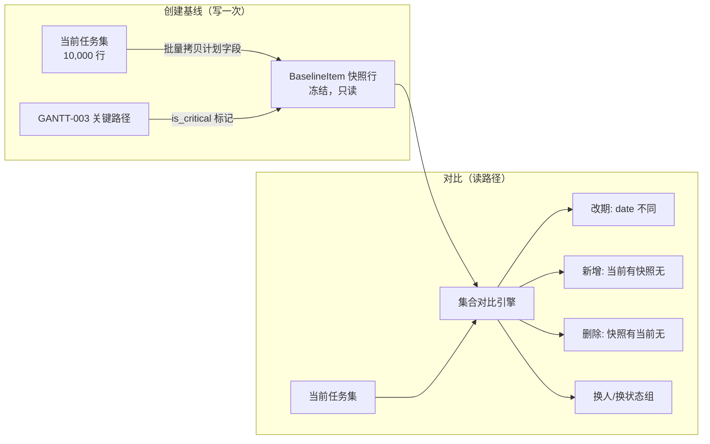
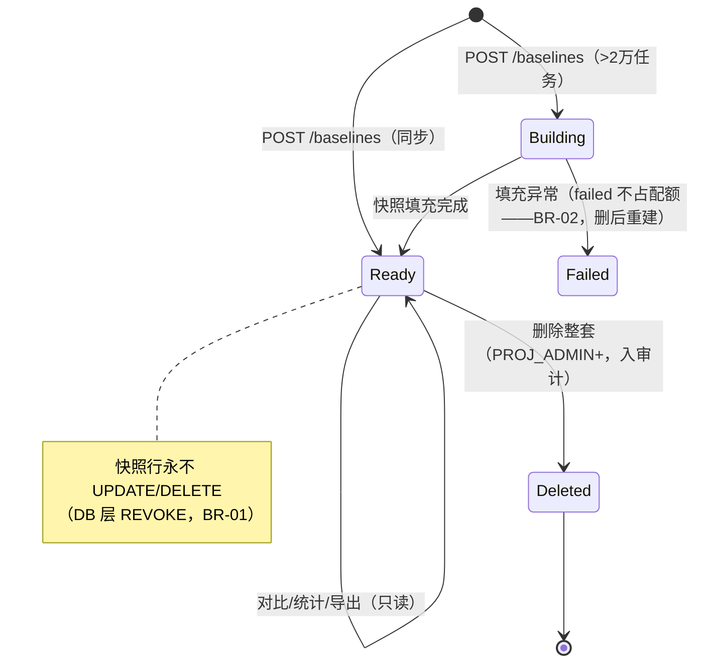

# 任务基线与版本对比

| 元信息项 | 内容 |
| --- | --- |
| 文档编号 | TASK-015 |
| 所属迭代 | P4：远期增强（第 13 周起，签约驱动排期） |
| 优先级 | P4（企业版增强 / 研发效能价值线） |
| 所属模块 | M4-TASK 任务核心 |
| 文档状态 | R2 复评 PASS（9.5/9.5/9.5/10/10），本稿为 R2 随手收口稿（PASS 文档无风险收口，不再复评） |
| 最后更新日期 | 2026-09-06 |
| 修复摘要 | 2026-09-05 落实 R1 评审 10 项：SNAPSHOT_SQL 表/列名对齐架构真实模型（`issues`/`states`/`issue_assignees`/`assignee_id`/`target_date`/`issue_cpm_cache.float_days`，unified-issue-model §2.6/§2.8/§2.9、GANTT-003 §4.2）；对比 SQL 谓词全部入 `ON` 并以 `b.id IS NULL` 判空分支保留新增行、补 `project_id` 过滤（修复 FULL OUTER JOIN + WHERE 把新增任务剔空的缺陷）；快照行 `issue` 外键改 `SET_NULL` 行保留（消除与 REVOKE DELETE 的 CASCADE 矛盾）；`REPEATABLE READ` 改为事务开启首语句设置（BR-03 可运行）；`name_snapshot` 扩至 512 对齐 `Issue.name`；`due_date` → `target_date` 全文清零；权限码统一 rbac §8.2 注册码 `gantt.baseline.manage`；上游依据 §3.3 → §3.4（docs/README.md §4 TASK 模块映射）；`created_by` 改默认返回 ID + `?expand=created_by`、列表走信封 `data` 数组；「变更原因必填」落地为 `reason` 必填字段（BR-13 + UT-14）；信封 `request_id` 归位 error 对象、主键示例改 UUID v4、排序改 `ordering` 全族通病清零；2026-09-06 R2 复评 PASS 随手收口 6 项——①（MAJOR-1）对比主查询补当前侧数据与判定：`cur_assignees`（`issue_assignees` 二次 `jsonb_agg` LATERAL 聚合）、`cur_critical`（LEFT JOIN 当前 `issue_cpm_cache`，缓存无行 → NULL）、新增 `assignee_changed`/`drifted` 两布尔标志列（新增/删除行恒 false），`diff_type` CASE 增 `unscheduled` 分支（NULL 日期不再落 `on_track`），§2.3 增未排期行并标注两标志列判定来源、§4.3 要点改「四类差异类型 + 两类标志位」、§4.4 `?diff_type=` 契约对齐七值枚举、§4.5 Store 标注 DiffType、UT-07/IT-04 断言路径成立；②（MINOR）冷存引用 `INFRA-006`（实读无冷存内容）改 `INFRA-005` §4.4 备份归档口径（§4.1/§4.6 两处）；③（MINOR）前置依赖注明 `WF-001` 省略理由（快照仅消费 `state_group`，不依赖工作流版本）并标注 dependency-graph 待回改边处置；④（MINOR）「GANTT-001 注册 `baselineLane` 插件」失实表述改「§4.4.2 分层表新增基线通道图层（GANTT-001 待回改登记）」（§4.5/§7.1 两处）；⑤（INFO）SNAPSHOT_SQL 注释显式声明含归档任务（仅排除软删）；⑥（INFO）§7.1「回填校验」模板残留删除；2026-09-06 R2 收口 #2（第二份独立 R2 评审 4 MAJOR + 2 INFO 随手收口）——(1)（MAJOR-1）「回收站 30 天物理清理 issue」系上游不存在的机制（TASK-009 回收站仅软删 + 管理端恢复，FILE-001 `purge_deleted_assets` 只清附件不物理删除 Issue 行），BR-04/§4.1 模型注释/迁移要点三处改条件式表述「若上游未来启用回收站物理清理（待建，P4 评估）」并登记 TASK-009 待回改，`SET_NULL` 外键保留为防御性兜底（§4.3 purged 注释同步）；(2)（MAJOR-2）SNAPSHOT_SQL `state_group` 改 `COALESCE(s."group", 'backlog')`——该列 NOT NULL 而 `Issue.state` 可空（SET_NULL），原写法 NULL-state 行单行违规致整条 INSERT…SELECT 失败，JOIN 注释与 §2.1 兜底口径同步；(3)（MAJOR-3）补 UT-15（DB 层物理删除 issue 后快照行保留、`purged=true`、`name_snapshot` 可辨认），§4.3 三态输出断言指引与 §7.1 测试范围（UT-01~15）同步；(4)（MAJOR-4）异步生命周期闭环：端点表补 GET 基线详情（BR-11 轮询载体，`status` 字段），Building→Failed「可重试」改「failed 不占配额、删后重建」（BR-02 注明配额仅计 `building/ready`），BR-11/§2.2 状态机/§4.4/§4.5 一致；INFO 四项：SNAPSHOT_SQL 注释补「属计划历史」、§7.1 迁移行去模板残留表述、BR-10 对齐 GANTT-002 §1.4（拖拽自动顺延 ❌ P4）改准确措辞、§4.3 权限过滤补 b 侧 NULL/purged 行可见性机制 |
| 上游依据 | `docs/需求文档.md` §3.4 任务核心模块（企业版专属-任务基线：计划基线保存、版本对比、变更溯源、变更原因必填、基线偏差统计）、§8.2 分模块优先级全景表 P4 列（任务行：任务基线/版本对比） |
| 前置依赖 | `GANTT-001/002`（甘特与日期字段全量）、`GANTT-003`（关键路径，基线偏差的浮动时间分析）、`TASK-010`（Activity 事件流，对比的时间轴来源）。`WF-001` 不列入前置：基线快照仅消费 `state_group` 状态语义组与 Activity 事件流，不消费工作流版本/状态机定义，工作流重构不影响快照与对比语义（dependency-graph §4.5 登记 `TASK-015 ← TASK-010, WF-001`——dependency-graph 待回改：WF-001 边处置） |
| 下游依赖 | `RPT-004/005`（健康度与大屏消费偏差统计）、`PROJ-004`（项目集级基线汇总） |
| 架构基线 | [`api-conventions.md`](../architecture/api-conventions.md) §4/§5/§6/§8、[`unified-issue-model.md`](../architecture/unified-issue-model.md) §2.6/§2.8/§2.9、[`rbac-permission-model.md`](../architecture/rbac-permission-model.md) §8.2（`gantt.baseline.manage`） |
| 竞品参考 | Microsoft Project（基线 11 套）、Smartsheet（Baseline 视图）、Ones（计划基线与偏差） |

> **范围声明**：本文档交付「项目计划的时间胶囊」——**基线快照**（某时刻全项目任务计划日期/工时/关键路径的冻结副本）、**基线对比**（当前计划 vs 基线的逐行偏差视图）、**偏差统计**（延期分布与趋势）。基线只读不可改（BR-01），不做基线的分支合并，不做自动纠偏建议（归 `AI-001`）。

---

## 1. 概述

### 1.1 功能定位

项目管理的经典三问——「原计划是什么、现在变成什么、差了多少」——在没有基线的系统里只能靠记忆和周报。企业客户的 PMO 在季度复盘、客户问责、合同里程碑对账时需要**可举证**的原始计划。

| 交付项 | 说明 |
| --- | --- |
| 基线快照 | 一键冻结全项目任务的 `start_date/target_date/estimate_minutes/assignees/state_group/关键路径标记`，含快照元信息（创建人/变更原因/备注/任务数） |
| 多基线并存 | 每项目最多 11 套基线（对齐 MS Project 上限），命名管理（如「V2.0 合同版」「Q3 冲刺版」） |
| 对比视图 | 甘特双轨（基线条 + 当前条）、列表偏差列（天数偏差 + 状态着色）、逐任务变更溯源（跳转 Activity） |
| 偏差统计 | 延期任务占比、平均延期天数、按成员/状态组分布、趋势曲线（多次快照对比） |

### 1.2 启动条件

| 条件 | 判定 |
| --- | --- |
| 商业条件 | ≥ 3 家客户投票或合同列入；通常为 PMO 成熟的研发/工程类客户 |
| 技术前置 | 甘特三件套（`GANTT-001~003`）生产稳定；日期字段与 Activity 事件流数据质量达标（抽样核对日期变更事件完整率 ≥ 99%） |
| 选型前置 | 无外部选型；快照存储方案（行级 JSONB 快照表 vs 事件回放）评审通过——本方案选快照表（§6 论证） |

### 1.3 独立交付判定

1. 创建基线后任意修改计划（改期/删任务/加任务/换负责人），对比视图准确呈现全部差异类型（改期/新增/删除/换人四类）。
2. 10,000 任务项目快照创建 < 60s；对比视图首屏 < 2s。
3. 基线数据只读性验证：API 层无写路径，DB 层 `baseline_item` 对应用账号仅 `INSERT`（`REVOKE UPDATE, DELETE`，§4.1 迁移要点，BR-01）。
4. 零回归：未创建基线的项目甘特/列表渲染与企业版 V1.0 一致。

### 1.4 目标用户

| 用户 | 场景 | 关注点 |
| --- | --- | --- |
| PMO | 季度复盘：实际 vs 合同基线 | 偏差可下钻到具体任务与变更人 |
| 项目经理 | 冲刺中预警：当前计划相对基线漂移 | 一眼看出哪些任务拖了整个计划 |
| 客户方接口人 | 里程碑对账 | 基线快照可导出（PDF/CSV）作为对账附件 |

### 1.5 竞品参考结论（详见第 6 章）

- **MS Project**：基线功能的定义者——11 套基线、`Baseline Start/Finish` 字段对、偏差列（`Start Variance`）；但其基线是字段级复制，无任务增删语义。
- **Smartsheet**：Baseline 视图直观（灰条 vs 彩条），支持偏差摘要；无多基线管理。
- **Ones**：基线 + 偏差统计 + 里程碑对账导出，国内企业标杆。
- **本系统取舍**：采纳 MS Project 的多基线与偏差列语义、Smartsheet 的双轨可视化；**增强**：任务增删语义（快照集 vs 当前集的集合差）与变更溯源（跳 Activity 时间轴）是两者都没有的。

---

## 2. 业务逻辑

### 2.1 基线数据语义



| 快照字段 | 来源 | 说明 |
| --- | --- | --- |
| `start_date / target_date` | `Issue` 同名列（unified-issue-model §2.8，截止字段无 `due_date`） | 核心对比对象 |
| `estimate_minutes` | 同上 | 工时偏差 |
| `assignee_ids` | M2M 快照为 UUID 数组 | 换人对账 |
| `state_group` | 状态语义组（非状态本身；任务无状态时按 `backlog` 兜底入快照，§4.2 COALESCE） | 状态重命名后对比仍稳定 |
| `is_critical / total_float_days` | `GANTT-003` CPM 结果 | 关键链漂移分析 |
| `name_snapshot / sequence_id` | 任务标题与编号 | 快照展示用（任务被删后仍可辨认） |

### 2.2 业务规则（BR）



| 编号 | 规则 | 说明 |
| --- | --- | --- |
| BR-01 | 基线不可变 | 快照创建后任何角色不可改不可删单条（DB 层 `REVOKE UPDATE, DELETE`，§4.1 迁移要点）；整套基线仅持 `gantt.baseline.manage`（PROJ_ADMIN+）者可删除（物理删除基线头 + DB 级联清理快照行，入审计） |
| BR-02 | 数量上限 | 每项目基线 ≤ 11 套（配额判定仅计 `building/ready` 状态，`failed` 不占配额——删后重建，§2.2 状态机）；超限需先删除旧套（`409 RESOURCE_LIMIT_EXCEEDED`） |
| BR-03 | 快照一致性 | 创建在同一 DB 事务的可重复读快照内完成（`REPEATABLE READ`，事务开启后的**第一条语句**设置隔离级别，§4.2 `_fill` 自成最外层事务），保证 10,000 行是同一时刻切面 |
| BR-04 | 软删任务处理 | 已软删任务不进快照；快照后删除的任务在对比中显示「已删除」灰行（软删即触发）。`purged`「已彻底清除」为防御性兜底：上游现无 issue 物理删除路径（TASK-009 回收站仅软删 + 管理端恢复，FILE-001 `purge_deleted_assets` 只清附件不物理删除 Issue 行；回收站物理清理待建，P4 评估——TASK-009 待回改登记），若上游未来启用回收站物理清理致 issue 行硬删，`ON DELETE SET_NULL` 使快照行保留、`issue_id` 置 NULL 转 `purged`，对比行不灭失——BR-05 |
| BR-05 | 对比行不灭失 | 对比视图以快照集 ∪ 当前集为全集；任何一侧缺失都有显式行（新增/删除），绝不静默忽略 |
| BR-06 | 偏差计算口径 | 天数偏差 = `当前 target_date - 基线 target_date`（正=延期）；无日期任务不参与偏差统计但列入「未排期」桶 |
| BR-07 | 归档项目只读 | 项目归档后基线与对比只读；恢复后继续使用，历史基线不失效 |
| BR-08 | 权限 | 创建/删除基线 `gantt.baseline.manage`（PROJ_ADMIN+，rbac-permission-model.md §8.2 注册码）；查看对比项目成员皆可（`gantt.read`）；导出含 `report.export` 校验 |
| BR-09 | 审计 | 创建/删除/导出基线三动作入 `AuditLog` |
| BR-10 | 与甘特解耦 | 基线不影响 `GANTT-002` 拖拽改期交互；「拖拽自动顺延」在 `GANTT-002` §1.4 明确为 ❌ P4，系统当前无自动排期逻辑、基线亦不引入；对比层是纯读视图 |
| BR-11 | 大项目降级 | 任务数 > 20,000 的项目快照转异步任务（创建请求立即返回 `baseline_id` + 轮询状态——轮询载体为 GET 基线详情端点的 `status` 字段，§4.4），不阻塞请求 |
| BR-12 | 时区口径 | 日期对比一律按项目时区（`Project.timezone`）日期粒度，不含时刻 |
| BR-13 | 变更原因必填 | 创建基线必须填写 `reason`（≤255 字；需求文档 §3.4「变更原因必填」的落地，不留悬空）；序列化器 required，缺失返回 `400 VALIDATION_ERROR` + `details[{field: "reason", code: "REQUIRED"}]`（UT-14、§4.4 示例） |

### 2.3 对比视图差异类型

| 类型 | 判定 | 视觉 | 统计归属 |
| --- | --- | --- | --- |
| 按期/提前 | `target_date 偏差 ≤ 0` 且日期存在（`on_track`） | 绿色偏差值 | 健康桶 |
| 延期 | `target_date 偏差 > 0`（`delayed`） | 红色偏差值 + 天数 | 延期桶 |
| 改期中（进行中任务延期） | 延期且 `state_group=started` | 红底闪烁徽标 | 延期桶（高优） |
| 新增任务 | 当前有、快照无（`added`） | 行首 `+` 徽标 | 范围蔓延桶 |
| 已删除 | 快照有、当前无（`deleted`） | 灰色删除线行 | 范围缩减桶 |
| 未排期 | 基线或当前 `target_date` 为 NULL（`unscheduled`，§4.3 CASE 分支） | 灰色「—」偏差占位 | 未排期桶（不入偏差统计，BR-06） |
| 负责人变更 | `assignee_ids` 集合不等（基线与当前任务均在时比较，§4.3 `assignee_changed` 标志列） | 头像区双头像对比 | 仅标注不入统计 |
| 关键链漂移 | 基线 `is_critical` ≠ 当前（§4.3 `drifted` 标志列；当前侧取 `issue_cpm_cache`，缓存无行视为不在关键链） | 甘特条黄色描边 | 风险桶 |

### 2.4 偏差统计聚合

| 指标 | 口径 |
| --- | --- |
| 延期率 | 延期任务数 / 基线有日期任务数 |
| 平均延期 | 延期任务偏差天数算术平均（另有 P50/P90 分位） |
| 范围蔓延率 | 新增任务数 / 基线任务数 |
| 按人分布 | 延期任务按当前负责人分桶（前 10） |
| 趋势 | 多套基线间同一指标的时间序列（需 ≥ 2 套基线） |

---

## 3. UI/UX 设计

### 3.1 页面清单

| 页面/组件 | 位置 | 核心任务 |
| --- | --- | --- |
| 基线管理面板 | 项目设置 → 基线 | 基线列表（名称/变更原因/创建人/时间/任务数）、创建、删除、导出 |
| 甘特对比模式 | 甘特页工具栏「基线对比」开关 | 双轨条 + 偏差徽标 + 漂移描边 |
| 列表对比视图 | 列表页「基线对比」列组 | 偏差列、差异类型筛选、跳 Activity |
| 偏差统计抽屉 | 对比视图右上「统计」 | §2.4 五指标 + 分布图 |

### 3.2 甘特对比模式线框

```
┌──────────────────────────────────────────────────────────────────┐
│ 甘特 · 电商平台          基线对比: [V2.0 合同版 ▾] [统计] [导出]   │
├──────────────┬───────────────────────────────────────────────────┤
│ 任务         │  9/1   9/8   9/15  9/22  9/29  10/6                │
├──────────────┼───────────────────────────────────────────────────┤
│ ECOM-231     │ ┄┄┄┄┄┄┄┄┄  ← 基线(9/1-9/10)                        │
│ 下单链路重构  │ ▓▓▓▓▓▓▓▓▓▓▓▓▓▓ ← 当前(9/1-9/16) 🔴+6d 黄边=关键漂移│
├──────────────┼───────────────────────────────────────────────────┤
│ ECOM-245     │ ┄┄┄┄┄┄┄┄┄┄┄┄┄  ← 基线(9/8-9/22)                    │
│ 库存扣减优化  │      ▓▓▓▓▓▓▓▓▓▓▓▓ ← 当前(9/10-9/22) 🟢0d           │
├──────────────┼───────────────────────────────────────────────────┤
│ + ECOM-260   │         ▓▓▓▓▓▓▓▓ ← 新增任务(无基线)                 │
│ 支付渠道扩展  │                                                   │
├──────────────┼───────────────────────────────────────────────────┤
│ ~~ECOM-198~~ │ ┄┄┄┄┄┄  ← 基线有, 当前已删除                        │
│ 旧结算下线    │                                                   │
└──────────────┴───────────────────────────────────────────────────┘
  图例: ┄ 基线  ▓ 当前  🔴延期  🟢按期  黄边 关键链漂移
```

### 3.3 偏差统计抽屉线框

```
┌─ 偏差统计 · V2.0 合同版 vs 当前 ─────────────────┐
│ 延期率        31% (28/90)      ██████░░░░░░       │
│ 平均延期      4.2 天 (P50=3, P90=9)               │
│ 范围蔓延      +12 任务 (13%)                      │
│ 范围缩减      -3 任务                             │
│ 关键链漂移    2 任务进出关键路径 ⚠                │
│ ── 按负责人延期分布 ──────────────                │
│ 张三点  ████████ 8 任务/均 5.1d                   │
│ 李四维  █████ 5 任务/均 3.8d                      │
│ …                                                 │
│ ── 趋势（3 套基线）─────────────────              │
│ 延期率  V1.0: 22% → V1.5: 27% → V2.0: 31% ↗      │
│                          [导出 CSV] [导出 PDF]    │
└───────────────────────────────────────────────────┘
```

### 3.4 交互规则

| 场景 | 交互 |
| --- | --- |
| 创建基线 | 弹窗：名称（必填，≤32 字）+ 变更原因（必填，≤255 字——需求文档 §3.4「变更原因必填」，BR-13）+ 备注；>2 万任务提示「将异步创建，完成后通知」；创建成功 Toast + 面板新增行 |
| 切换基线 | 对比开关下拉列出全部基线；切换仅改读视图，URL `?baseline=<id>` 可分享 |
| 差异筛选 | 对比视图顶部 Chips：全部/延期/新增/删除/换人/漂移，点击过滤行 |
| 跳溯源 | 点击偏差值 → 侧滑 Activity 时间轴定位到该任务日期变更事件（`TASK-010` 流） |
| 删除基线 | 二次确认输入基线名；删除入审计；进行中异步创建不可删（状态为 building） |
| 权限 | 无 `gantt.baseline.manage` 者管理面板只读；无 `report.export` 导出按钮隐藏 |

---

## 4. 技术架构

### 4.1 数据模型

```python
# apps/api/plane/db/models/baseline.py
from django.db import models

from plane.db.models import BaseModel


class Baseline(BaseModel):
    class Status(models.TextChoices):
        BUILDING = "building", "创建中"
        READY = "ready", "就绪"
        FAILED = "failed", "失败"

    project = models.ForeignKey("db.Project",
                                on_delete=models.CASCADE,
                                related_name="baselines")
    name = models.CharField(max_length=32)
    # 需求文档 §3.4「变更原因必填」的落地：序列化器 required，缺失 400（BR-13、UT-14）
    reason = models.CharField(max_length=255, verbose_name="变更原因")
    note = models.CharField(max_length=255, blank=True)
    status = models.CharField(max_length=10, choices=Status.choices,
                              default=Status.BUILDING)
    issue_count = models.PositiveIntegerField(default=0)
    stats_cache = models.JSONField(default=dict)   # 创建时刻的基准统计
    # created_by / updated_by 由 BaseModel 统一提供（UUID FK → User，SET_NULL），
    # 子模型不得重复声明同名字段，否则 Django 抛 FieldError（unified-issue-model §2.2）

    class Meta:
        db_table = "baseline"
        constraints = [
            models.UniqueConstraint(fields=["project", "name"],
                                    name="uq_baseline_project_name"),
        ]
        indexes = [
            models.Index(fields=["project", "-created_at"],
                         name="idx_baseline_project"),
        ]


class BaselineItem(BaseModel):
    """单行快照；只写一次（BR-01）。DB 层 REVOKE UPDATE/DELETE。"""

    baseline = models.ForeignKey(Baseline, on_delete=models.CASCADE,
                                 related_name="items")
    # 行保留承诺（BR-04/05）：上游现无 issue 物理删除路径（TASK-009 回收站仅软删 + 管理
    # 端恢复，FILE-001 purge_deleted_assets 只清附件不物理删除 Issue 行；回收站物理清理
    # 待建，P4 评估，TASK-009 待回改登记）。SET_NULL 为防御性兜底：若上游未来启用物理清理
    # 致 issue 行硬删，快照行保留、issue_id 置 NULL（§4.3 purged 标记），JOIN 缺失即
    # 「已彻底清除」——禁用 CASCADE：级联物理删除快照行将违背 REVOKE DELETE 的不可变承诺
    issue = models.ForeignKey("db.Issue", on_delete=models.SET_NULL,
                              null=True, blank=True,
                              related_name="baseline_items")
    sequence_id = models.PositiveIntegerField()      # 冗余编号，删后仍可辨认
    name_snapshot = models.CharField(max_length=512)  # 对齐 Issue.name varchar(512)
    start_date = models.DateField(null=True)
    target_date = models.DateField(null=True)         # Issue.target_date 同名快照（架构无 due_date 列）
    estimate_minutes = models.PositiveIntegerField(null=True)
    assignee_ids = models.JSONField(default=list)
    state_group = models.CharField(max_length=16)
    is_critical = models.BooleanField(default=False)
    total_float_days = models.IntegerField(null=True)  # 快照自 GANTT-003 IssueCPMCache.float_days

    class Meta:
        db_table = "baseline_item"
        constraints = [
            models.UniqueConstraint(fields=["baseline", "issue"],
                                    name="uq_baseline_item_issue"),
        ]
        indexes = [
            models.Index(fields=["baseline", "issue"],
                         name="idx_baseline_item_pair"),
        ]
```

| 迁移要点 | 说明 |
| --- | --- |
| 只读强化 | 迁移中执行 `REVOKE UPDATE, DELETE ON baseline_item FROM rp_app;`（应用账号）与 `GRANT UPDATE (status, issue_count, stats_cache, updated_at) ON baseline TO rp_app;`（`Baseline` 头表仅状态与统计列可更新）。删除整套基线 = `DELETE ON baseline` + DB 级联清理快照行——级联由引用约束执行、不检查子表 DELETE 权限，与 REVOKE 不矛盾；单条快照行的 UPDATE/DELETE 仍被 DB 拒绝（UT-09）。issue 侧 `ON DELETE SET NULL`（BR-04 行保留的防御性兜底——上游回收站物理清理待建，P4 评估，TASK-009 待回改登记，§4.1 模型注释同口径）同理不受 REVOKE 影响 |
| 体积估算 | 单行 ≈ 300B；1 万任务 × 11 基线 ≈ 33MB/项目——可接受，不做分区；归档项目的基线随每日全量备份 + WAL 归档留存（`INFRA-005` §4.4 备份体系口径；`INFRA-006` 实为高可用部署、无冷存专项内容，若后续增设冷存策略再回改登记，§4.6 同口径） |
| 一致性 | 创建走 `REPEATABLE READ` 事务，且 `SET TRANSACTION ISOLATION LEVEL` 为事务内第一条语句（BR-03，§4.2 `_fill`）；大项目异步任务同款：事务开启即设隔离，再分批 `INSERT … SELECT`（每批 1000，同一快照事务） |

### 4.2 快照创建服务

```python
# apps/api/plane/baselines/services.py
from django.db import connection, transaction

from plane.db.models import Issue

ASYNC_THRESHOLD = 20_000   # BR-11：任务数超过即转异步


# 表/列名逐一对照架构真实模型：issues（unified-issue-model §2.8）、states（§2.6）、
# issue_assignees.assignee_id（§2.9）、issue_cpm_cache.float_days/is_critical（GANTT-003 §4.2）
# 口径：仅排除软删（deleted_at IS NULL）；已归档任务（archived_at 非空，TASK-010 任务归档）
# 照常入快照——归档 ≠ 删除，属计划历史，基线要冻结的是「全部在册任务的计划」
SNAPSHOT_SQL = """
INSERT INTO baseline_item (
    id, baseline_id, issue_id, sequence_id, name_snapshot,
    start_date, target_date, estimate_minutes, assignee_ids,
    state_group, is_critical, total_float_days, created_at, updated_at)
SELECT gen_random_uuid(), %(baseline_id)s, i.id, i.sequence_id, i.name,
       i.start_date, i.target_date, i.estimate_minutes,
       COALESCE((SELECT jsonb_agg(ia.assignee_id ORDER BY ia.created_at)
                 FROM issue_assignees ia
                 WHERE ia.issue_id = i.id), '[]'),
       -- IssueAssignee 为物理删除中间表，无软删行可滤（TASK-001 §4.1.2，TASK-004 同款口径）
       COALESCE(s."group", 'backlog'),   -- state_group 列 NOT NULL（§4.1 模型），state 可空
                                         -- （SET_NULL）时 s."group" 为 NULL，不兜底则单行违规
                                         -- 令整条 INSERT…SELECT 失败（全项目快照创建报错）
       COALESCE(cpm.is_critical, false), cpm.float_days,
       now(), now()
FROM issues i
LEFT JOIN states s ON s.id = i.state_id               -- state 可空（SET_NULL），LEFT JOIN 保全集；
                                                      -- NULL 组由 SELECT 侧 COALESCE 'backlog' 兜底
LEFT JOIN issue_cpm_cache cpm ON cpm.issue_id = i.id  -- GANTT-003 物化表
WHERE i.project_id = %(project_id)s AND i.deleted_at IS NULL
"""


class BaselineService:
    def create(self, project, name: str, reason: str, note: str, user) -> Baseline:
        self._assert_quota(project)                  # BR-02 ≤11，超限 409
        with transaction.atomic():                   # 短事务：建头 + 异步投递
            baseline = Baseline.objects.create(
                project=project, name=name, reason=reason,
                note=note, created_by=user)          # created_by 为 BaseModel 字段
            if (Issue.all_objects.filter(project=project,
                                         deleted_at__isnull=True).count()
                    > ASYNC_THRESHOLD):              # BR-11 >20,000
                build_baseline.delay_on_commit(str(baseline.id))
                return baseline                      # building 状态
        self._fill(baseline)                         # 独立 REPEATABLE READ 事务（BR-03）
        return baseline

    def _fill(self, baseline: Baseline) -> None:
        # BR-03：SET TRANSACTION ISOLATION LEVEL 必须是事务内第一条语句——
        # 因此 _fill 自成最外层事务，绝不嵌套于 create 的短事务
        # （外层事务已有查询后再 SET 会直接报错，隔离级别无法生效）
        with transaction.atomic():
            with connection.cursor() as cursor:
                cursor.execute("SET TRANSACTION ISOLATION LEVEL REPEATABLE READ")
                cursor.execute(SNAPSHOT_SQL, {
                    "baseline_id": baseline.id, "project_id": baseline.project_id})
                baseline.issue_count = cursor.rowcount
            baseline.stats_cache = self._baseline_stats(baseline)
            baseline.status = Baseline.Status.READY
            baseline.save(update_fields=["issue_count", "stats_cache",
                                         "status", "updated_at"])
```

### 4.3 对比查询（读路径）

```sql
-- 对比主查询：全集 = 快照 ∪ 当前（BR-05），单 SQL 完成
-- 连接谓词全部入 ON；WHERE 只保留「基线侧全集 ∪ 纯新增行」两个分支——
-- FULL OUTER JOIN 的判空行就是「新增/删除」语义本身，绝不能被 WHERE 剔除
-- （原始缺陷：WHERE b.baseline_id 把基线侧为 NULL 的新增任务行全部剔空）
SELECT COALESCE(b.issue_id, i.id)                     AS issue_id,
       b.sequence_id,
       COALESCE(i.name, b.name_snapshot)              AS name,
       b.start_date  AS base_start,  i.start_date AS cur_start,
       b.target_date AS base_target, i.target_date AS cur_target,
       (i.target_date - b.target_date)                AS target_variance,  -- BR-06 口径（date - date = 天数）
       b.assignee_ids AS base_assignees, cur.ids AS cur_assignees,  -- 换人判定两侧数据（§2.3）；当前无负责人/删除行 → NULL
       b.is_critical  AS base_critical, cpm.is_critical AS cur_critical,  -- 当前侧关键链（GANTT-003 缓存无行 → NULL）
       (b.id IS NOT NULL AND i.id IS NOT NULL
          AND b.assignee_ids IS DISTINCT FROM COALESCE(cur.ids, '[]'::jsonb))
                                                      AS assignee_changed, -- 负责人变更标志（§2.3：集合不等；新增/删除行恒 false）
       (b.id IS NOT NULL AND i.id IS NOT NULL
          AND b.is_critical IS DISTINCT FROM COALESCE(cpm.is_critical, false))
                                                      AS drifted,          -- 关键链漂移标志（§2.3；缓存无行视为不在关键链；新增/删除行恒 false）
       (b.id IS NOT NULL AND b.issue_id IS NULL)      AS purged,   -- 已彻底清除标记（BR-04 防御性兜底）
       CASE
         WHEN b.id IS NULL THEN 'added'               -- 新增：当前有、快照无（b 侧判空行）
         WHEN i.id IS NULL THEN 'deleted'             -- 删除：快照有、当前无（软删或已彻底清除）
         WHEN b.target_date IS NULL OR i.target_date IS NULL
              THEN 'unscheduled'                      -- 未排期（§2.3/BR-06：无日期不落 on_track，不入偏差统计）
         WHEN i.target_date - b.target_date > 0 THEN 'delayed'
         ELSE 'on_track'                              -- 按期/提前（偏差 ≤ 0 且日期存在，§2.3）
       END AS diff_type
FROM baseline_item b
FULL OUTER JOIN issues i
       ON i.id = b.issue_id
      AND i.deleted_at IS NULL                        -- 软删任务即「已删除」灰行（BR-04）
      AND i.project_id = %(project_id)s               -- project 过滤，邻项目任务不串行
LEFT JOIN issue_cpm_cache cpm
       ON cpm.issue_id = i.id                         -- 当前侧 CPM（GANTT-003 物化表；缓存无行 → NULL，drifted 按 false 归并）
LEFT JOIN LATERAL (
       SELECT jsonb_agg(ia.assignee_id ORDER BY ia.created_at) AS ids
       FROM issue_assignees ia
       WHERE ia.issue_id = i.id                       -- i.id 为 NULL（删除行）时自然返回 NULL，保全「cur_* 全 NULL」三态
     ) cur ON true
WHERE b.baseline_id = %(baseline_id)s                 -- 分支一：基线侧全集（含已删任务行）
   OR (b.id IS NULL AND i.project_id = %(project_id)s
                     AND i.deleted_at IS NULL)        -- 分支二：新增任务行（b 侧全 NULL，保留不剔）
ORDER BY COALESCE(i.sort_order, b.sequence_id),
         COALESCE(i.id::text, b.id::text);            -- 确定且唯一的排序键（cursor 分页前提）
```

| 要点 | 说明 |
| --- | --- |
| 单次往返 | `FULL OUTER JOIN` 一次拿齐「四类差异类型 + 两类标志位」（BR-05）：`diff_type` 承载 `added/deleted/delayed/on_track`（另有 `unscheduled` 未排期桶，BR-06/§2.3），`assignee_changed`/`drifted` 两标志列承载负责人变更与关键链漂移——§1.3 判定 1 的「换人」差异与 §3.4 Chips 的「换人/漂移」均由此产生（§2.3 七类判定的机器判定来源）；不走应用层合并；过滤谓词全部入 `ON`，`WHERE` 仅保留两个全集分支（基线侧 / 纯新增侧），保证基线后新增的任务行永不丢失 |
| 三态输出 | 新增行 `base_*` 全 `NULL`（`diff_type=added`）；删除行 `cur_*` 全 `NULL`（含 `cur_assignees`/`cur_critical`，LATERAL / LEFT JOIN 对 `i.id IS NULL` 自然落空）、`name` 取 `name_snapshot`、`purged=true` 为已彻底清除（BR-04）；改期行 `target_variance > 0`；`assignee_changed`/`drifted` 仅在基线与当前两侧任务均在时可能为 `true`，新增/删除行恒 `false`——UT-05/UT-06/UT-07/UT-15/IT-03/IT-04 逐一断言 |
| 大项目分页 | 对比结果走既有 cursor 分页（`?per_page=` + `?ordering=sort_order`，api-conventions §5.4/§6.3），统计聚合单独走 `…/stats/` 端点（`GROUP BY diff_type` + 分位数 `percentile_cont`） |
| 权限过滤 | 对比查询复用 `AUTH-003/006` 行级过滤（子查询包 `visible_issues`），无权任务行整体剔除（含其快照行，防标题泄露）；b 侧 `i.id IS NULL`（软删/`purged` 行）无当前任务可套可见性子查询，按「持 `gantt.read` 的项目成员即可见」放行——此类行仅暴露冻结于快照的历史标题，不含当前可变数据 |

### 4.4 API 端点

| 方法 | 路径 | 说明 |
| --- | --- | --- |
| GET | `/api/v1/workspaces/{slug}/projects/{project_id}/baselines/` | 基线列表 |
| POST | `/api/v1/workspaces/{slug}/projects/{project_id}/baselines/` | 创建（≤2 万任务同步返回 `201`；>2 万返回 `202` + `building` 轮询，BR-11） |
| GET | `/api/v1/workspaces/{slug}/projects/{project_id}/baselines/{baseline_id}/` | 基线详情（BR-11 轮询载体：`status` 字段 `building/ready/failed`，§4.5 `pollUntilReady` 即轮询本端点；`failed` 后前端引导删后重建——failed 不占 BR-02 配额） |
| DELETE | `/api/v1/workspaces/{slug}/projects/{project_id}/baselines/{baseline_id}/` | 删除整套（物理删除基线头 + 级联清理快照行，BR-01 例外，入审计） |
| GET | `/api/v1/workspaces/{slug}/projects/{project_id}/baselines/{baseline_id}/compare/` | 对比行（cursor 分页 `?per_page=` + `?diff_type=`；取值枚举对齐 §4.3 输出：`added/deleted/delayed/on_track/unscheduled` 五类差异类型 + `assignee_changed/drifted` 两标志过滤——后两者作用于同名标志列、可与日期类取值叠加，支撑 §3.4 Chips「换人/漂移」） |
| GET | `/api/v1/workspaces/{slug}/projects/{project_id}/baselines/{baseline_id}/stats/` | 偏差统计（§2.4） |
| GET | `/api/v1/workspaces/{slug}/projects/{project_id}/baselines/{baseline_id}/export/` | CSV/PDF 导出（异步任务 + 通知） |

**成功示例** — `POST …/baselines/`（同步完成，`201` + `Location` 头）：

```json
{
  "status": "success",
  "data": {
    "id": "9b2f1c3a-4d5e-4f6a-8b7c-1d2e3f4a5b6c",
    "name": "V2.0 合同版",
    "reason": "合同签署节点冻结计划，季度复盘对账",
    "status": "ready",
    "issue_count": 1240,
    "created_by": "3a7d8e9f-1b2c-4d3e-9f0a-5b6c7d8e9f0a",
    "created_at": "2026-09-05T06:30:00.120Z"
  }
}
```

> 关联字段默认返回 ID（api-conventions §4.5）：`created_by` 为 UUID v4 字符串；需要对象时以 `GET …/baselines/?expand=created_by` 展开（expand 后 ID 字段保留，§5.2）。列表数据在信封 `data` **数组**内，无 `results` 包裹层；`request_id` 只出现在错误响应的 `error` 对象内（成功响应用 `X-Request-Id` 响应头承载）。

**错误示例** — 基线上限（BR-02）：

```json
{
  "status": "error",
  "error": {
    "code": "RESOURCE_LIMIT_EXCEEDED",
    "message": "每项目最多 11 套基线，请先删除旧基线",
    "details": [{"field": "baseline", "code": "LIMIT",
                 "message": "当前 11/11"}],
    "request_id": "01J6ZVP4M0PSY6RZTDVA7K5FGC"
  }
}
```

**错误示例** — 名称重复：

```json
{
  "status": "error",
  "error": {
    "code": "RESOURCE_ALREADY_EXISTS",
    "message": "同名基线已存在",
    "details": [{"field": "name", "code": "UNIQUE",
                 "message": "「V2.0 合同版」创建于 2026-06-01"}],
    "request_id": "01J6ZVQ5N1QTZ7S1UEWB8L6GHD"
  }
}
```

**错误示例** — 变更原因缺失（BR-13）：

```json
{
  "status": "error",
  "error": {
    "code": "VALIDATION_ERROR",
    "message": "请求参数校验失败",
    "details": [{"field": "reason", "code": "REQUIRED",
                 "message": "变更原因为必填项"}],
    "request_id": "01J6ZVR6N2RUA82VF1XA9L6JHD"
  }
}
```

### 4.5 前端 Store

```typescript
// apps/web/src/modules/baseline/baseline.store.ts
// service 层已拆 axios 响应：res 即统一信封 {status, data, meta}（api-conventions §4.1）
export class BaselineStore {
  baselines: IBaseline[] = [];
  activeBaselineId: string | null = null;      // URL ?baseline= 同步
  compareRows: ICompareRow[] = [];
  stats: IBaselineStats | null = null;
  // DiffType = "added" | "deleted" | "delayed" | "on_track" | "unscheduled"
  //          | "assignee_changed" | "drifted"（§4.3 diff_type + 两标志列，§4.4 ?diff_type= 契约）
  diffFilter: DiffType | "all" = "all";

  constructor(private projectId: string) { makeAutoObservable(this); }

  get delayedRows() {
    return this.compareRows.filter(r => r.diffType === "delayed");
  }

  async createBaseline(name: string, reason: string, note?: string) {   // reason 必填（BR-13）
    const res = await baselineService.create(this.projectId, { name, reason, note });
    if (res.data.status === "building") {
      this.pollUntilReady(res.data.id);        // 2s→5s 退避轮询 GET 基线详情端点（§4.4），status 到 ready/failed 止
    }
    await this.fetchBaselines();
  }

  async loadCompare(baselineId: string, cursor?: string) {
    const res = await baselineService.compare(
      this.projectId, baselineId,
      { cursor, per_page: 100,
        diff_type: this.diffFilter === "all" ? undefined : this.diffFilter });
    runInAction(() => {
      // 信封 data 即数组（无 results 包裹层，api-conventions §4.1）
      this.compareRows = cursor
        ? [...this.compareRows, ...res.data]
        : res.data;
    });
  }
}
```

| 前端规则 | 说明 |
| --- | --- |
| 甘特双轨 | 基线双轨以「基线通道」图层承载——`GANTT-001` §4.4.2 渲染分层表为固定五层（时间表头/行区/任务条/连线层/今日线）、无插件机制，故为分层表**新增一个基线通道图层**（GANTT-001 待回改登记）：数据就绪前不渲染基线行，避免布局抖动 |
| SWR 键 | `BASELINE_COMPARE(pid, baselineId, diffFilter)`；切换基线 mutate 重建 |
| 虚拟滚动 | 对比列表复用 `GANTT-001` 虚拟滚动（36px 行高基座，`GANTT-001` BR-09）；双轨甘特模式两通道叠加，单任务行高 72px（2 × 36px 通道） |

### 4.6 性能与规模

| 指标 | 预算 | 手段 |
| --- | --- | --- |
| 快照创建 | 1 万行 < 60s（同步） | 单 SQL `INSERT…SELECT`，无 Python 行循环 |
| 对比查询 | 1 万行首屏 < 2s | `FULL OUTER JOIN` + `idx_baseline_item_pair` + cursor 分页 |
| 统计聚合 | < 800ms | `GROUP BY` 直算快照表（行数有界）；趋势取各 `stats_cache` 免重算 |
| 存储 | 11 基线 × 1 万行 ≈ 33MB/项目 | 冷项目基线随 `INFRA-005` §4.4 每日全量 + WAL 归档留存（§4.1 同口径） |

---

## 5. 测试用例

### 5.1 单元测试（UT）

| 编号 | 用例 | 断言 |
| --- | --- | --- |
| UT-01 | 快照字段完整 | §2.1 七类字段全部落快照，值与源一致 |
| UT-02 | 软删排除 | 创建时刻已软删任务不进快照 |
| UT-03 | 上限 | 第 12 套创建返回 `RESOURCE_LIMIT_EXCEEDED` |
| UT-04 | 差异-改期 | `target_date` 偏差 +6 → `delayed`，`target_variance=6` 正确 |
| UT-05 | 差异-新增 | 快照后新建任务 `diff_type=added` |
| UT-06 | 差异-删除 | 快照后删除任务 `diff_type=deleted`，名称用 `name_snapshot` |
| UT-07 | 差异-换人 | assignee 集合不等 → `assignee_changed=true`（§4.3 标志列）；仅日期变化不误报换人；新增/删除行恒 `false`；`?diff_type=assignee_changed` 筛选命中同名标志（§4.4 契约） |
| UT-08 | 偏差口径 | 提前 3 天偏差 = -3，归健康桶；无日期任务入「未排期」桶 |
| UT-09 | 只读强制 | ORM `save()` 快照行被自定义管理器拒绝；DB 层 `UPDATE` 报权限错误 |
| UT-10 | 名称唯一 | 同名创建 `RESOURCE_ALREADY_EXISTS` |
| UT-11 | 统计口径 | 延期率/平均/分位与手工核算一致（fixture 10 行） |
| UT-12 | 权限裁剪 | 对比查询剔除无权任务及其快照行 |
| UT-13 | 跨项目隔离 | 邻项目任务不作为 `added` 行混入对比结果（§4.3 `project_id` 过滤分支验证） |
| UT-14 | 变更原因必填 | 缺 `reason` 创建返回 `400 VALIDATION_ERROR`，`details[0]` 为 `{field: "reason", code: "REQUIRED"}`（BR-13） |
| UT-15 | 差异-彻底清除兜底 | 测试内直捣 DB 层物理删除 issue 行（上游现无业务入口）后：快照行保留、`issue_id` 置 NULL、对比行 `purged=true` 且 `diff_type=deleted`、`name_snapshot` 保留可辨认（BR-04 防御性兜底，§4.3） |

### 5.2 集成测试（IT）

| 编号 | 用例 | 断言 |
| --- | --- | --- |
| IT-01 | 快照一致性 | 创建并发改期的注入脚本：10,000 行快照为同一时刻切面（REPEATABLE READ 验证） |
| IT-02 | 大项目异步 | 21,000 任务创建返回 `building`，完成后通知，`issue_count` 正确 |
| IT-03 | 四类差异并存 | 构造改期/新增/删除/换人各若干，对比行四类齐全无遗漏 |
| IT-04 | 关键链漂移 | 修改依赖使关键路径变化，漂移任务 `drifted=true`（基线 `is_critical` ≠ 当前 `issue_cpm_cache.is_critical`，§4.3 LEFT JOIN 当前侧缓存，缓存无行视为不在关键链），黄色标记正确；`?diff_type=drifted` 筛选命中 |
| IT-05 | 导出 | CSV 行数 = 对比行数；PDF 含统计摘要；导出动作入审计 |
| IT-06 | 项目归档 | 归档后对比只读可用，创建/删除被拒 `PERM_PROJECT_ARCHIVED` |

### 5.3 E2E 测试

| 编号 | 场景 | 验收 |
| --- | --- | --- |
| E2E-01 | 基线全链路 | 创建 → 改 3 个日期 → 甘特对比双轨正确 → 统计抽屉数字与视觉一致 → 导出 PDF |
| E2E-02 | 溯源跳转 | 点击延期偏差 → Activity 侧滑定位到日期变更事件 |
| E2E-03 | 多基线趋势 | 3 套基线后趋势曲线三点正确 |

---

## 6. 竞品深度对标

| 维度 | MS Project | Smartsheet | Ones | 本系统 |
| --- | --- | --- | --- | --- |
| 基线套数 | 11 | 1 | 多（未公开上限） | 11（对齐 MSP 心智） |
| 快照粒度 | 字段对（Baseline Start/Finish） | 整行 | 整行 | 整行 + 关键路径标记 |
| 增删语义 | ❌（任务增删无对比概念） | 部分 | ✅ | ✅ 集合差四类差异（BR-05） |
| 变更溯源 | ❌ | ❌ | 跳动态 | ✅ 偏差值直跳 Activity 事件 |
| 一致性保证 | 桌面单用户无需 | 未公开 | 未公开 | `REPEATABLE READ` 切面（BR-03） |
| 只读强制 | 应用层 | 应用层 | 应用层 | 应用 + DB `REVOKE` 双层 |

**结论**：MS Project 的字段对模型在协作系统里失效（任务会被删除）；Smartsheet 单基线撑不起 PMO 复盘；本系统的差异点是「集合差 + 事件溯源 + 数据库级只读」——快照不做成普通表加应用层约束，而是用 `REVOKE` 把不可变刻进数据库权限，这是应对「基线被悄悄改掉」这一客户信任焦虑的终极答案。事件回放方案（从 Activity 重建基线）被否决：回放依赖事件流永不缺漏，而快照表是自包含证据，§1.2 选型评审记录于此。

---

## 7. 里程碑与验收

### 7.1 工作量估算

| 交付面 | 内容 | 估算 |
| --- | --- | --- |
| Model / Migration | 2 表 + REVOKE 迁移（全新建表，无存量数据、无回填步骤） | 1 d |
| 后端 | 快照服务、对比查询、统计聚合、导出任务、7 端点（含 BR-11 轮询用 GET 详情） | 4 d |
| 前端 | 基线面板、甘特双轨图层、对比列表、统计抽屉 | 4.5 d |
| 测试 | UT-01~15、IT-01~06、E2E-01~03 | 2.5 d |
| **合计** | | **12 d（2 人并行约 1.5 周）** |

### 7.2 可操作演示的验收标准

1. 全链路：创建「合同版」基线 → 改期 5 任务、删 2、增 3、换 1 负责人 → 对比视图四类差异逐行正确 → 统计抽屉与手工核算一致。
2. 一致性：注入并发改期脚本创建 1 万行快照，抽样 100 行校验为同一时刻切面。
3. 只读性：ORM 与裸 SQL 两路尝试改快照行均被拒；删除整套基线后对比 404 且审计有记录。
4. 溯源：任一延期行点击偏差值跳转对应 Activity 事件。
5. 性能：IT-02/§4.6 指标达标。
6. 零回归：无基线项目甘特/列表契约快照与企业版 V1.0 一致。
