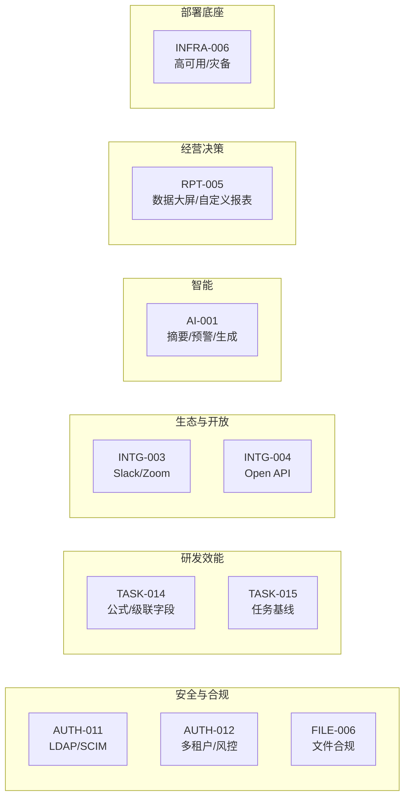
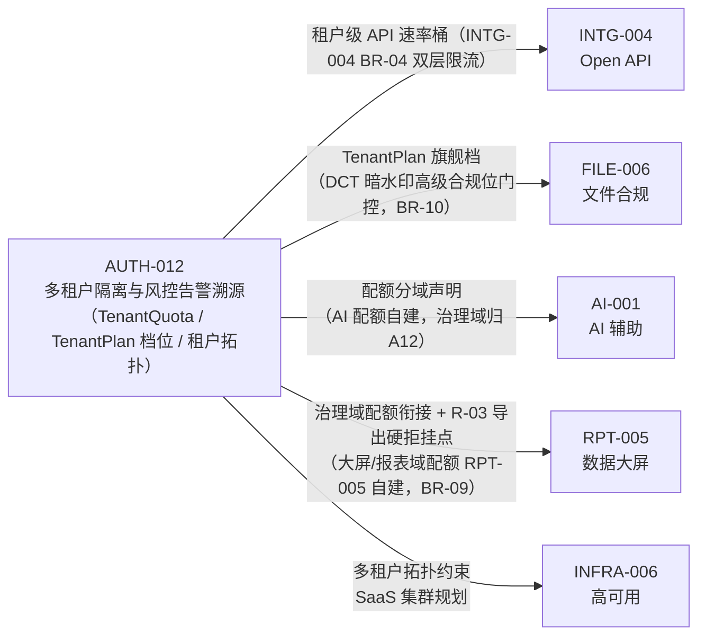

# P4 远期增强 迭代概览

| 元信息项 | 内容 |
| --- | --- |
| 所属迭代 | P4 — 远期增强（第 13 周起，按商业化节奏排期） |
| 优先级 | P4（企业版增强 / 远期级） |
| 覆盖模块 | AUTH（LDAP/SCIM/多租户）｜TASK（公式字段/基线）｜INTG（Slack/Zoom/Open API）｜FILE（合规）｜AI｜RPT（大屏）｜INFRA（高可用） |
| 文档状态 | 待评审（Draft）· R1 修复 6 项：①dg §1.3 INTG-003/004 与 AUTH-009/010 编号-标题错位按 README §4 消解（标注 dg 待回改）②§2 依赖表按十份功能文档实文逐行重建、补齐漏列前置（AUTH-011 缺 AUTH-007/008/010、AUTH-012 缺 AUTH-010/INFRA-005、TASK-014 缺 TASK-008/PROJ-004、INTG-004 缺 INTG-002/AUTH-012、FILE-006 缺 FILE-003/AUTH-010/AUTH-012、AI-001 缺 RPT-003/004/AUTH-012/FILE-006、RPT-005 缺 AUTH-012/PROJ-004、INFRA-006 缺 INFRA-001/002/AUTH-012、INTG-003 缺 COLLAB-001/002）③补 AUTH-012 枢纽依赖呈现（§2.1）④新增 §3「范围排除」⑤新增 §6「风险与应对」⑥TASK-015 前置补编号（GANTT-001/002/003、TASK-010）。R2 复评 FAIL（一致性 8.0）后修复：RPT-005 行补 TASK-013 前置（RPT-005 R1 修复引入的数据底座同源复用，晚于本文修复致漂移）、AUTH-012 衔接点改「治理域配额衔接 + R-03 导出硬拒挂点」（大屏/报表域配额 RPT-005 自建，BR-09 分域）+§2.1 mermaid 边标注/声明式耦合列举同步、INTG-004 BR-04 归属注明、范围排除锚点精确化（§1.6/§6、§1.4/§6）。R3 复评 PASS（10×5 满分）后随手收口：A12→F6 边标注收敛为「旗舰档（DCT 暗水印高级合规位门控，BR-10）」（/DLP 无档位门控实文支撑）、范围排除两行锚点改 §1.6/§1.4 与 §6 并列精确式） |
| 最后更新日期 | 2026-09-05 |
| 上游依赖 | **企业版 V1.0（Sprint 9 发布）**——全部 P4 能力建立在双版本稳定基线之上 |
| 下游消费 | 商业化路线图；需求统一入需求池排期，标准版 V1.0 发布前不占用任何排期（`需求文档` §9.2 第 5 条） |
| 迭代周期 | 不设固定周——按客户签约与商业化节奏逐项启动 |

---

## 1. 迭代定位

P4 不是「下一个 Sprint」，而是**商业化选项库**：每份文档定义一项可独立售卖、签约后才启动的增强能力。十份文档覆盖六条价值线：

排期原则：**客户签约驱动 + 依赖驱动**——`AUTH-011`（SCIM）签约后通常与 `AUTH-012`（多租户）捆绑评估；`AI-001` 依赖外部模型服务选型；`INFRA-006` 是大客户私有化的前置；`AUTH-012` 为 P4 内部枢纽节点（五份文档衔接其配额/档位/拓扑，见 §2.1），达线应优先排期。

## 2. 能力总览与依赖

> **编号口径（裁决 A/G：README §4 为准）**：**（dependency-graph 待回改：§1.3 INTG-003/004 与 AUTH-009/010 编号-标题错位——dg 字面 `INTG-003`＝「完整 OpenAPI 与应用接入市场」/`INTG-004`＝「Slack / Zoom 全量集成」、`AUTH-009`＝「全量操作审计日志」/`AUTH-010`＝「SSO 单点登录」，与 docs/README.md §4 官方索引互换；本文一律按 README §4 书写：`INTG-003`＝Slack / Zoom 全量集成、`INTG-004`＝完整 Open API 与应用接入、`AUTH-009`＝SSO 单点登录、`AUTH-010`＝全站操作审计日志）**。dg 回改时应随 §4 依赖边行（其 Slack/Zoom 行与 OpenAPI 行的上游清单）一并换号对齐。

下表前置依赖按十份功能文档 §1 元信息「前置依赖」与正文硬前提逐行重建（功能文档为依赖内容的真实事实来源）：

| 文档 | 一句话价值 | 关键前置 |
| --- | --- | --- |
| `AUTH-011` | 企业身份源打通：LDAP 目录 / SCIM 自动开通禁用 | `AUTH-009` SSO（`IdentityProvider`/`SSOAccount` 模型与 JIT 开通路径）；`AUTH-007` 部门树（同步落点）；`AUTH-008` 自定义角色（组→角色映射目标）；`AUTH-010` 审计管道（同步留痕走 `record()` 契约） |
| `AUTH-012` | 多租户隔离与风控告警溯源 | `AUTH-006` 行级隔离（生产运行 ≥ 90 天无隔离事故）；`AUTH-010` 全站审计日志（风控规则数据源，积累 ≥ 30 天）；`INFRA-005` 限流底座（Throttle 家族，租户桶兜底） |
| `TASK-014` | 公式/多级级联/跨项目关联字段 | `TASK-012` 高级字段（生产稳定 ≥ 60 天）；`TASK-008` 自定义字段基座（JSONB+GIN、Schema API、FilterCompiler）；`PROJ-004` 项目集（跨项目关联上下文） |
| `TASK-015` | 计划基线保存、版本对比、偏差统计 | `GANTT-001/002` 甘特与日期字段全量；`GANTT-003` 关键路径（浮动时间分析）；`TASK-010` Activity 事件流（变更溯源时间轴，事件完整率 ≥ 99%） |
| `INTG-003` | Slack 频道联动 + Zoom 会议纪要回挂 | `INTG-001` GitHub 集成框架（OAuth App 范式、事件管道、安装模型）；`INTG-002` Webhook 出站（签名投递）；`COLLAB-001` 评论/通知（纪要与评论落库载体）；`COLLAB-002` 楼中楼回复（Slack 线程同步落点） |
| `INTG-004` | 完整 Open API + 应用接入市场雏形 | API v1 面冻结（企业版 V1.0 后 90 天无破坏性变更）；`INTG-002` Webhook 出站（应用事件通道）；`AUTH-012` 租户级 API 配额（开放面治理）；`api-conventions` §9.3/9.4 凭证与 OAuth 基座 |
| `FILE-006` | 水印/禁转/脱敏/留存周期/文件审计 | `FILE-003` 衍生件管线（水印注入点）；`FILE-004` 分享链接（合规策略对外落点）；`AUTH-010` 审计管道（四事件留痕）；`AUTH-012` `TenantPlan` 档位（旗舰档合规位门控） |
| `AI-001` | 任务摘要/重复识别/风险预警/内容生成 | 全量数据面（特征依赖 `TASK-006/010`、`RPT-003/004` 聚合快照）；`AUTH-012` 租户治理衔接（配额分域声明，见 §2.1）；`FILE-006` 脱敏基础设施复用；模型服务选型评审（两家以上提供方验证） |
| `RPT-005` | 企业数据大屏 + 自定义报表设计器 | `RPT-003/004` 聚合框架（数据集注册表挂其既有快照模型）；`TASK-013` 工时快照（`WorkLogSummary` 人×周同源复用，不另建聚合）；`AUTH-012` 治理域配额衔接（大屏/报表域配额本文自建、分域见 RPT-005 BR-09；R-03 导出行数硬拒挂订阅快照导出端点）；`PROJ-004` 项目集维度 |
| `INFRA-006` | 高可用集群/异地灾备/灰度/全链路监控 | `INFRA-005` 生产部署（单机稳定 ≥ 90 天 + 恢复演练连续 3 次成功）；`INFRA-001/002` 工程与容器基线；`AUTH-012` 多租户拓扑（对 SaaS 集群的约束） |

### 2.1 AUTH-012 枢纽依赖（P4 内部被依赖最多项）

`AUTH-012` 是 P4 批次内的**枢纽节点**：五份文档在配额治理、档位分级、部署拓扑上衔接它，构成 P4 的排期关键路径——`AUTH-012` 延后，五个下游的对应衔接点一并顺延。

各衔接点均为**声明式耦合**而非实现耦合：`AI-001` 自建 `AiCallLedger`/`AiQuotaCounter` 承载 AI 调用配额（`AUTH-012` 的 `TenantQuota` 仅覆盖存储/成员/API 速率/导出行数，两域边界以 `AI-001` BR-05 分域声明为准）；`FILE-006` 仅消费 `TenantPlan(tier="flagship")` 档位判定（`AUTH-012` §2.3），不依赖其风控引擎。

## 3. 范围排除（各功能文档「明确不做」汇总）

以下边界由各功能文档 §1/§2 的范围声明与竞品取舍实文锁定，签约洽谈与实施期任何「顺手扩一点」的提议均视为范围蔓延，须回需求池重新评估，不进本文档范围：

| 排除项 | 说明 | 归属 / 去向 |
| --- | --- | --- |
| 跨地域双活 / 双写 | 一致性成本远超当前客户体量收益；异地灾备以 RPO ≤ 5min / RTO ≤ 4h 异步复制 + 一键切换演练为边界 | `INFRA-006` §1 范围声明 |
| 外发审批流 | 重流程，刻意不做——需要审批流的客户归工作流引擎客户自建 | `FILE-006` §1.4/§6（`WF-002`） |
| 自定义风控规则 DSL | 风控引擎做规则表驱动（六类预置规则 + 参数可调），不做通用 CEP 与自定义规则编程 | `AUTH-012` §1.6/§6 |
| AI 自主操作 / 对话式 Agent / 客户数据训练 | AI 产出永不直接写库（草稿 + 人工保存）；不提供对话框形态；提示词与产出不用于训练 | `AI-001` §1 范围声明 / §1.4 |
| 基线分支合并 / 自动纠偏建议 | 基线只读不可改（BR-01），只做快照对比与偏差统计，不做基线间合并，不出自动纠偏 | `TASK-015` §1 范围声明（纠偏归 `AI-001`） |
| 代码级公式执行（Lua/JS 沙箱） | 明确拒绝 ScriptRunner 式脚本字段——公式 DSL 为纯解析求值白名单函数，不 eval | `TASK-014` §6 |
| GraphQL 对外面 / 重应用框架 | REST + OpenAPI 3.1 保留（否决 GraphQL 双轨维护）；应用侧只做凭证与授权层，iframe 嵌入与 UI 扩展点不做 | `INTG-004` §6（应用市场另案） |
| 安全面开放 | 认证/SSO/权限/审计/工作流管理/系统管理端点永不进入 Open API 白名单（BR-06）；implicit / password grant 不支持 | `INTG-004` BR-06 / §2.5 |
| Slack 订阅查询语言 / 内嵌会议 UI | Slack 订阅只给事件类型勾选（汲取 Jira 噪音教训，BR-04）；Zoom 只做「关联 + 回挂」不做内嵌会议界面；钉钉/飞书集成另案 | `INTG-003` §6 / §1.2 |
| 目录「全量覆盖式」禁用 | 不采纳网络分区下会误禁全员的覆盖式语义，改为「连续两次同步缺席才禁用」双确认 + 干跑先行 | `AUTH-011` §6 |
| P4 全量排期 | 标准版 / 企业版 V1.0 发布前一律不排期，全部能力签约驱动、需求入池评估 | 本文档 §4 排期纪律 |

---

## 4. 统一约束

| 类别 | 约束 |
| --- | --- |
| 排期纪律 | 标准/企业版 V1.0 发布前一律不排期；需求入池评估 |
| 架构纪律 | 所有 P4 能力不得破坏既有 API v1 契约；破坏性能力走 v2 评审 |
| 安全纪律 | `AUTH-011/012`、`FILE-006` 涉身份与数据边界，须附安全评审记录 |
| AI 纪律 | `AI-001` 的数据出域（模型服务）须显式客户授权与脱敏策略 |

## 5. 验收标准

- [ ] 10 份规格均含七章结构与全部详尽要素（与 P0-P3 同一标准——「远期」不降级文档质量）。
- [ ] 每份含「启动条件」（签约/依赖/选型）与「独立交付判定」——可单项售卖、单项验收。
- [ ] 每份明确与既有版本的兼容策略（零回归要求）。

## 6. 风险与应对（自各功能文档实文提炼）

| # | 风险 | 影响 | 概率 | 应对措施 | 责任文档 |
| --- | --- | --- | --- | --- | --- |
| 1 | **多租户配额双层扣减一致性**：租户层（`TenantQuota`）与工作空间层（`FILE-002` 既有强制点）两层配额独立判定，扣减顺序错乱会产生「WS 层预留悬空」或租户层超卖 | 高：配额失守直接击穿多租户治理承诺，跨租户资源争抢 | 中 | ① 扣减顺序固定「WS 先判定 → 租户聚合后判定 → 两层均通过才落预留」，任一层超限整体拒绝、不产生预留；② 成员/API 速率/导出行数同构复用同一顺序范式；③ 集成测试构造「单 WS 未满、合计打满租户」场景断言拒绝层级与无预留落库 | `AUTH-012` §2.3 / §5 IT-04 |
| 2 | **SCIM/LDAP 批量禁用误伤**：目录侧抖动、网络分区或过滤条件配置错误可能触发大规模误禁用（离职账号残留是采购动因，误禁在职账号是更重的事故） | 高：全员账号被禁 = 客户生产事故，直接冲击续约 | 中 | ① 不采纳「全量覆盖式禁用」，改「连续两次同步缺席才禁用」双确认；② 缺席判定仅在 full_sync 批执行、增量批跳过；③ 策略变更强制干跑（Dry Run）输出影响清单，确认后才真实执行；④ 同步全程留痕 `DirectorySyncRun` 台账可回放 | `AUTH-011` §2.4 / §6 |
| 3 | **Open API 密钥体系迁移与开放面治理**：API Key 复用既有 `APIToken` 体系的增量字段迁移波及既有 `/api-tokens/` 用户；开放面若无治理将成爬虫与越权突破口 | 高：破坏既有集成零回归承诺，或数据经开放面越权泄漏 | 中 | ① 不新设密钥端点，开发者门户直接复用 `api-conventions` §9.3 既有体系、仅增量迁移字段（`INTG-004` §4.4 仲裁）；② 凭证桶 + 租户桶（`AUTH-012`）双层速率，`X-RateLimit-*` + `Retry-After` 全套；③ scope 越权矩阵全组合 CI 测试；④ 安全面端点永不入白名单（BR-06） | `INTG-004` §4.4 / BR-04 / BR-06（配额衔接 `AUTH-012`） |
| 4 | **AI 配额与供应商限额、数据出域合规**：LLM 供应商限额抖动拖累体验；提示词/字段出域若无授权与脱敏闭环构成合规事故 | 高：合规事故为销售阻断项；供应商故障若阻塞业务写路径违背降级承诺 | 中 | ① 配额分域：AI 调用配额由 `AiCallLedger`/`AiQuotaCounter` 自建承载，`AUTH-012` `TenantQuota` 只管治理域（BR-05 声明边界）；② 模型抽象层验证两家以上提供方可插拔；③ 失败降级（摘要/生成显式不可用、预警用前一日分数）保证业务写路径永不阻塞（BR-06）；④ 出域授权书签署为启用前置 + 台账逐次可审计（§2.4） | `AI-001` §2.4 / §4.3 / BR-05 / BR-06 |
| 5 | **HA 集群化与灾备承诺兑现**：SLA 99.9% 依赖单点全消除与灰度零尖峰；双活明确不做后，异地灾备 RPO ≤ 5min / RTO ≤ 4h 完全依赖演练纪律维系 | 高：SLA 违约赔偿 + 私有化大单交付失败 | 中 | ① 跨 AZ 打散 + 单组件故障注入混沌演练每季度（BR-01）；② 灾备恢复演练季度化并归档报告（BR-10）；③ 灰度门禁 + 前后兼容迁移纪律（加列可回滚、删列分两版本）；④ 单机 docker-compose 形态继续受支持，`INFRA-005` 不失效 | `INFRA-006` §2.2 / BR-01 / BR-10 |
| 6 | **AUTH-012 枢纽排期耦合**：五份 P4 文档（`INTG-004`/`FILE-006`/`AI-001`/`RPT-005`/`INFRA-006`）衔接其配额、档位与拓扑；其启动条件本身苛刻（付费租户 ≥ 20、审计积累 ≥ 30 天、行级隔离稳定 ≥ 90 天），任一不满足即全线下顺延 | 中：商业化节奏整体推迟一个启动周期 | 中 | ① 签约评估时同步核对 `AUTH-012` 启动条件，达线即优先排期；② 下游按声明式耦合解耦（`AI-001` 配额自建、`FILE-006` 只消费档位枚举、`RPT-005` 大屏/报表域配额自建只消费治理域衔接），枢纽延后时下游可先行开发、衔接点后联调（见 §2.1） | `AUTH-012` §1.2 + 各下游 §1 前置依赖 |

---

## 7. 文档清单

| 序号 | 文件 | 一级标题 |
| --- | --- | --- |
| 1 | `AUTH-011-ldap-scim.md` | LDAP / SCIM 账号同步 |
| 2 | `AUTH-012-multi-tenant.md` | 多租户隔离与风控告警溯源 |
| 3 | `TASK-014-formula-fields.md` | 公式 / 级联 / 跨项目关联字段 |
| 4 | `TASK-015-baseline.md` | 任务基线与版本对比 |
| 5 | `INTG-003-slack-zoom.md` | Slack / Zoom 全量集成 |
| 6 | `INTG-004-open-api.md` | 完整 Open API 与应用接入 |
| 7 | `FILE-006-compliance.md` | 文件水印 / 脱敏 / 合规留存 |
| 8 | `AI-001-ai-features.md` | AI 辅助能力（摘要 / 预警 / 生成） |
| 9 | `RPT-005-dashboard.md` | 企业数据大屏与自定义报表 |
| 10 | `INFRA-006-ha-deploy.md` | 高可用集群与私有化部署 |

## 8. 相关文档

- 前置迭代：[`docs/sprint-9-enterprise-portfolio/sprint-overview.md`](../sprint-9-enterprise-portfolio/sprint-overview.md)（企业版 V1.0）
- 编号权威：[`docs/README.md`](../README.md) §4（本文档全部编号-标题引用的仲裁依据；dependency-graph §1.3 错位项见 §2 消解注）
- 依赖边参考：[`docs/architecture/dependency-graph.md`](../architecture/dependency-graph.md) §4（本文 §2 依赖表以十份功能文档 §1 元信息实文为第一事实来源，dg §4 为交叉参照）
- 原始需求：[`docs/需求文档.md`](../需求文档.md) §8.2 全表 P4 列
- 商业化分层：需求文档 §七 标准版 VS 企业版总对照表
