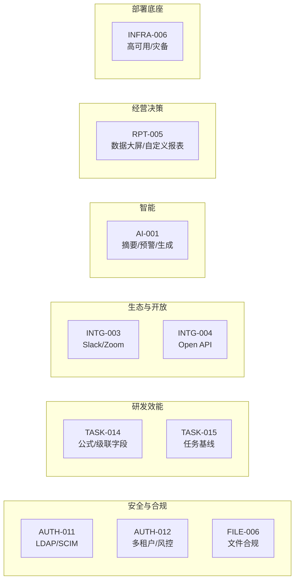

# P4 远期增强 迭代概览

| 元信息项 | 内容 |
| --- | --- |
| 所属迭代 | P4 — 远期增强（第 13 周起，按商业化节奏排期） |
| 优先级 | P4（企业版增强 / 远期级） |
| 覆盖模块 | AUTH（LDAP/SCIM/多租户）｜TASK（公式字段/基线）｜INTG（Slack/Zoom/Open API）｜FILE（合规）｜AI｜RPT（大屏）｜INFRA（高可用） |
| 文档状态 | 待评审（Draft） |
| 最后更新日期 | 2026-09-01 |
| 上游依赖 | **企业版 V1.0（Sprint 9 发布）**——全部 P4 能力建立在双版本稳定基线之上 |
| 下游消费 | 商业化路线图；需求统一入需求池排期，标准版 V1.0 发布前不占用任何排期（`需求文档` §9.2 第 5 条） |
| 迭代周期 | 不设固定周——按客户签约与商业化节奏逐项启动 |

---

## 1. 迭代定位

P4 不是「下一个 Sprint」，而是**商业化选项库**：每份文档定义一项可独立售卖、签约后才启动的增强能力。十份文档覆盖六条价值线：

排期原则：**客户签约驱动 + 依赖驱动**——`AUTH-011`（SCIM）签约后通常与 `AUTH-012`（多租户）捆绑评估；`AI-001` 依赖外部模型服务选型；`INFRA-006` 是大客户私有化的前置。

## 2. 能力总览与依赖

| 文档 | 一句话价值 | 关键前置 |
| --- | --- | --- |
| `AUTH-011` | 企业身份源打通：LDAP 目录 / SCIM 自动开通禁用 | `AUTH-009` SSO（同为身份面） |
| `AUTH-012` | 多租户隔离与风控告警溯源 | 行级隔离（`AUTH-006`）长期稳定运行 |
| `TASK-014` | 公式/多级级联/跨项目关联字段 | `TASK-012` 高级字段 |
| `TASK-015` | 计划基线保存、版本对比、偏差统计 | 甘特与依赖全量 |
| `INTG-003` | Slack 频道联动 + Zoom 会议纪要回挂 | `INTG-001/002` 集成框架 |
| `INTG-004` | 完整 Open API + 应用接入市场雏形 | `api-conventions` Open 分组基座 |
| `FILE-006` | 水印/禁转/脱敏/留存周期/文件审计 | `FILE-004` 分享是其落点 |
| `AI-001` | 任务摘要/重复识别/风险预警/内容生成 | 全量数据面 + 模型服务选型 |
| `RPT-005` | 企业数据大屏 + 自定义报表设计器 | `RPT-003/004` 聚合框架 |
| `INFRA-006` | 高可用集群/异地灾备/灰度/全链路监控 | `INFRA-005` 生产部署 |

## 3. 统一约束

| 类别 | 约束 |
| --- | --- |
| 排期纪律 | 标准/企业版 V1.0 发布前一律不排期；需求入池评估 |
| 架构纪律 | 所有 P4 能力不得破坏既有 API v1 契约；破坏性能力走 v2 评审 |
| 安全纪律 | `AUTH-011/012`、`FILE-006` 涉身份与数据边界，须附安全评审记录 |
| AI 纪律 | `AI-001` 的数据出域（模型服务）须显式客户授权与脱敏策略 |

## 4. 验收标准

- [ ] 10 份规格均含七章结构与全部详尽要素（与 P0-P3 同一标准——「远期」不降级文档质量）。
- [ ] 每份含「启动条件」（签约/依赖/选型）与「独立交付判定」——可单项售卖、单项验收。
- [ ] 每份明确与既有版本的兼容策略（零回归要求）。

## 5. 文档清单

| 序号 | 文件 | 一级标题 |
| --- | --- | --- |
| 1 | `AUTH-011-ldap-scim.md` | LDAP / SCIM 账号同步 |
| 2 | `AUTH-012-multi-tenant.md` | 多租户隔离与风控告警溯源 |
| 3 | `TASK-014-formula-fields.md` | 公式 / 级联 / 跨项目关联字段 |
| 4 | `TASK-015-baseline.md` | 任务基线与版本对比 |
| 5 | `INTG-003-slack-zoom.md` | Slack / Zoom 全量集成 |
| 6 | `INTG-004-open-api.md` | 完整 Open API 与应用接入 |
| 7 | `FILE-006-compliance.md` | 文件水印 / 脱敏 / 合规留存 |
| 8 | `AI-001-ai-features.md` | AI 辅助能力（摘要 / 预警 / 生成） |
| 9 | `RPT-005-dashboard.md` | 企业数据大屏与自定义报表 |
| 10 | `INFRA-006-ha-deploy.md` | 高可用集群与私有化部署 |

## 6. 相关文档

- 前置迭代：[`docs/sprint-9-enterprise-portfolio/sprint-overview.md`](../sprint-9-enterprise-portfolio/sprint-overview.md)（企业版 V1.0）
- 原始需求：[`docs/需求文档.md`](../需求文档.md) §8.2 全表 P4 列
- 商业化分层：需求文档 §七 标准版 VS 企业版总对照表
